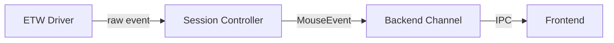

# Design Standards — Engineering Planning Quality Guide

> 本文件是 `engineering-planning` Skill 的 **HOW to write** 規範。
> Step 3 載入此文件，確保 Tech Spec 的每個 section 達到品質標準。
> `assets/tech_spec_template.md` 定義結構（WHAT），本文件定義品質（HOW）。

---

## Section 1 — Requirements 撰寫規範

### Functional Requirements
- 使用「系統**必須**...」格式（should/may 不算 FR）
- 每條 FR 必須可以被測試（能寫出對應的驗收條件）
- 避免描述實作細節（描述 **what**，不描述 **how**）

**好的例子**:
> 系統必須在用戶移動滑鼠時，以 ≤ 4ms 的延遲回傳游標位置。

**壞的例子**:
> 系統會用 ETW 監聽滑鼠事件並透過 channel 傳遞。（這是實作細節）

### Non-functional Requirements
- 每條 NFR 必須有**量化指標**（不能只說「快」或「穩定」）
- 常見量化格式：
  - 效能：`P99 延遲 < X ms`
  - 可用性：`uptime > 99.X%`
  - 資料量：`支援 X GB / X 萬筆`

### Open Questions
- 每個 Open Question 必須標記：
  - **Owner**：誰負責回答
  - **Deadline**：何時需要答案
  - **Impact**：若未解決會影響哪個 Task

---

## Section 2 — Technical Design 撰寫規範

### System Boundary
必須明確列出：
- **In scope**: 此次修改涵蓋的模組與功能
- **Out of scope**: 刻意排除的部分（防止範圍蔓延）

### Data Flow
優先使用 Mermaid 圖（若環境支援）：


若不使用圖，至少描述：「資料從 X 產生，經由 Y 轉換，最終到達 Z」

### Interface Contracts
每個 interface 必須包含：
- 函數/方法名稱與完整簽名（含型別）
- 參數說明
- 回傳值說明
- Error 情境

**Go 介面範例**:
```go
// MouseEventSource 提供滑鼠原始事件的串流介面
type MouseEventSource interface {
    // Start 開始監聽，回傳 event channel 和 error channel
    // ctx 用於取消監聽
    Start(ctx context.Context) (<-chan MouseEvent, <-chan error)
    Close() error
}
```

### Failure Modes
每個 High Risk Task 對應至少一個 Failure Mode：
- **觸發條件**: 何時會失敗
- **影響範圍**: 失敗時影響哪些功能
- **處理策略**: retry / fallback / 用戶通知 / graceful degradation

### Concurrency Model
若設計涉及以下情境，**必須**說明：
- 多個 goroutine 共享資料
- channel 的 buffer 大小選擇
- mutex 使用時機
- context 取消傳播

---

## Section 3 — Risk Analysis 撰寫規範

### Risk 分級標準

| 等級 | 條件 | Task 處理要求 |
|---|---|---|
| **Low** | 有充分先例，可獨立測試，不影響共用 data flow | 標準開發流程 |
| **Med** | 跨模組影響，或依賴外部 API / 第三方服務 | 需要 integration test |
| **High** | 無先例、影響核心 data flow、涉及併發模型變更 | 必須有 Failure Mode 說明 + PoC 驗證 |

### Technical Debt Risk
明確標記哪些設計決策是「有意識的妥協」：
- 妥協原因（時程壓力、依賴限制）
- 後續處理計畫（sprint N 重構、版本 X 改善）
- 觸發重構的條件（如「當 QPS > 1000 時」）

---

## Section 4 — Task Breakdown 撰寫規範

### Task 粒度原則
- 一個 Task 的工作量：**0.5 ~ 3 天**
- 超過 3 天的 Task 必須拆解
- 少於 0.5 天的多個 Task 考慮合併

### Definition of Done 品質要求
DoD **必須**是可客觀驗證的，禁止使用主觀描述：

| 禁止 | 改為 |
|---|---|
| 「功能完成」 | 「所有 unit test 通過，覆蓋率 > 80%」 |
| 「程式碼寫好」 | 「PR review 通過，CI 綠燈」 |
| 「介面實作完成」 | 「介面符合 Interface Contracts 的簽名定義，且有對應的 mock 可供測試」 |

### Dependencies 標記規則
- 若 Task B 依賴 Task A，標記 `Task A`（用 Task 編號）
- 若依賴外部（API 文件、別組 PR），標記具體連結或 owner
- `None` 表示可以獨立並行開始

---

## 完整性檢查清單（Step 5 使用）

```
[ ] 每個 Functional Requirement 對應至少一個 Task
[ ] 所有 Open Questions 已標記 owner 和 deadline
[ ] High Risk task 有對應的 Failure Mode 說明
[ ] Interface contracts 有明確的 input/output 型別
[ ] Definition of Done 可被客觀驗證（非「完成實作」）
[ ] Data flow 有圖示或流程說明（非空白）
[ ] System boundary 明確列出 in scope / out of scope
[ ] Concurrency model 若涉及 goroutine / mutex 則必填
[ ] Technical debt 若有妥協則標記後續處理計畫
```
