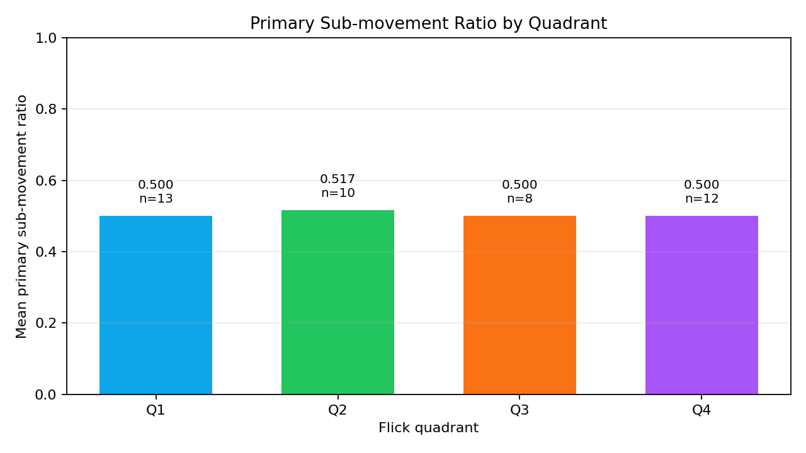
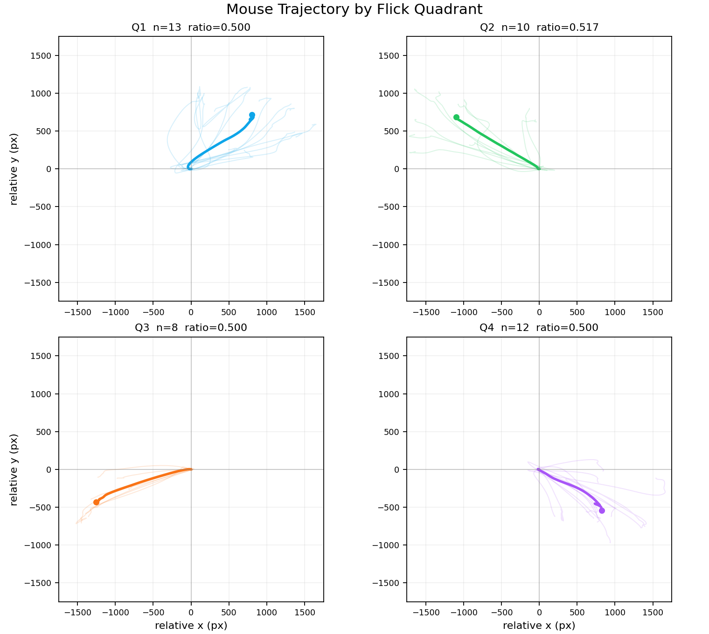
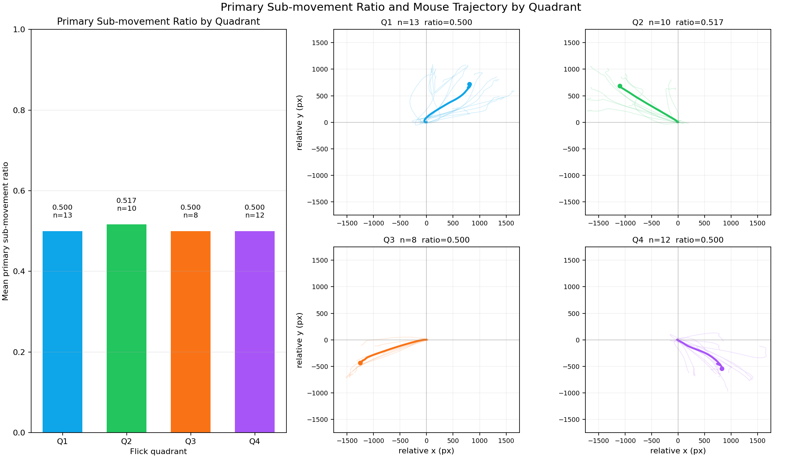

# Primary Sub-movement Ratio 指標說明與 Notebook 使用方法

> Status: implemented locally (2026-05-20)
> Notebook: `research/src/modules/analysis/notebooks/primary_submovement_ratio/q1_primary_submovement_ratio.py`
> Sample data: `backend/brain/Spidershot - Challenge - 2026.03.09-13.42.45 Stats.csv.json`

---

## 1. 指標目的

Primary Sub-movement Ratio 用來量化一次瞄準移動中，玩家有多少比例是靠「第一段主 flick」完成，而不是依賴後續 micro-adjustment 修正。

它回答的問題是：

> 這次瞄準主要是一段乾淨的主 flick，還是主 flick 後仍需要很多細修？

這個指標屬於 Q1 Precision Aiming / Flick Quality 的 T1 mouse-only 指標。它只依賴既有 `fusedTrace.segments`，不需要新增鍵盤、target 或後端資料管線。

---

## 2. 計算定義

Scenario-level scalar:

```text
Primary Sub-movement Ratio =
count(primary_flick) / (count(primary_flick) + count(micro_adjustment))
```

若 `primary_flick` 和 `micro_adjustment` 都不存在，回傳 `NaN`，避免除以零。

目前 Python implementation:

```text
research/src/modules/analysis/algorithms/metrics_submovement.py
compute_primary_submovement_ratio(scenario_record) -> float
```

Notebook 為了畫 per-quadrant distribution，會另外以 center -> outer kill-pair window 切分每一個 movement pair，並在各 pair 內用同一個公式計算 pair-level ratio。public API 仍維持單一 Scenario scalar。

---

## 3. 解讀方式

| Ratio | 解讀 | Precision Aimer 意義 |
|---|---|---|
| 接近 `1.0` | 幾乎都是 primary flick | 第一段 flick 很自足，後續細修需求低 |
| 接近 `0.5` | primary flick 與 micro-adjustment 數量接近 | 常見於每次主 flick 後都有一段修正 |
| 接近 `0.0` | 大多是 micro-adjustment | 主 flick 後需要大量修正，可能代表 flick landing 不穩 |
| `NaN` | 沒有可計算 segment | 資料不足或 segmentation 沒產生 T1 所需 segment |

注意：這個 ratio 是「segment count ratio」，不是時間占比，也不是位移占比。它描述的是 sub-movement 結構，而不是每段 movement 的長短或能量。

---

## 4. 範例結果

以 Spidershot sample：

```text
primary_flick = 93
micro_adjustment = 92
ratio = 93 / 185 = 0.502703
```

這代表此 session 幾乎每個 primary flick 後都有一段 micro-adjustment。對 Precision Aimer 來說，這不是「壞」的結論，而是一個診斷入口：接下來應該看哪些 quadrant 的 ratio 較低、哪些方向更依賴細修，再搭配 speed profile、path efficiency、initial angle error 判斷原因。

---

## 5. Per-quadrant 圖表

Notebook 會把每個 center -> outer kill-pair 的 raw trace 位移量加總成 `dx_total` / `dy_total`，再用既有 `classify_flick_quadrant(dx_total, dy_total)` 分到 Q1~Q4。



讀圖方式：

- X 軸：flick direction quadrant。
- Y 軸：該 quadrant 的 pair-level Primary Sub-movement Ratio 平均值。
- bar 上的 `n`：該 quadrant 中可計算的 kill-pair 數量。
- 較高：該方向較常由 primary flick 主導。
- 較低：該方向較常需要 micro-adjustment 補正。

目前 sample 中四個 quadrant 都接近 `0.5`，表示各方向多半呈現「一段 primary flick + 一段 micro-adjustment」的結構；Q2 稍高，因其中有一個 pair 的 ratio 為 `2 / 3`。

---

## 6. Mouse trajectory by quadrant

只看 ratio bar chart 會知道「哪個方向比較依賴 micro-adjustment」，但不知道滑鼠實際怎麼移動。因此 notebook 也會把每個 center -> outer kill-pair 的滑鼠軌跡畫出來：

- 每條淡線是一個 kill-pair 的 mouse trajectory。
- 每條軌跡都 normalize 到 `(0, 0)` 起點，方便比較不同方向的形狀。
- 粗線是該 quadrant 的平均軌跡，末端圓點代表平均 landing direction。
- 每個子圖用相同 x/y scale，避免視覺上誤判某個 quadrant 比較穩。



這張圖的用途是補足 ratio 的行為解釋：

- 如果 ratio 低且軌跡發散，代表該方向不只需要細修，主 flick path 本身也較不穩。
- 如果 ratio 低但軌跡集中，代表主 flick 方向可能穩定，但 landing 後仍有固定的微調需求。
- 如果 ratio 高且軌跡集中，代表該方向的 primary flick 較自足。

---

## 7. Dashboard view

Notebook 另外輸出 dashboard，把 ratio bar chart 和四象限軌跡放在同一張圖，方便一起閱讀。



建議閱讀順序：

1. 先看左側 bar chart，找出哪個 quadrant 的 mean ratio 比較低。
2. 再看右側對應 quadrant 的軌跡是否發散、彎曲、或有一致偏移。
3. 若 ratio 差異很小，優先解讀軌跡形狀，而不是過度解讀 `0.50` vs `0.52` 這種小差距。

---

## 8. Notebook 使用方法

從 repo root 執行：

```powershell
python -m research.src.modules.analysis.notebooks.primary_submovement_ratio.q1_primary_submovement_ratio --file "backend\brain\Spidershot - Challenge - 2026.03.09-13.42.45 Stats.csv.json"
```

可指定輸出目錄：

```powershell
python -m research.src.modules.analysis.notebooks.primary_submovement_ratio.q1_primary_submovement_ratio `
  --file "backend\brain\Spidershot - Challenge - 2026.03.09-13.42.45 Stats.csv.json" `
  --out "tmp\q1_primary_submovement_ratio"
```

預設輸出位置：

```text
research/src/modules/analysis/notebooks/primary_submovement_ratio/outputs/<session_stem>_primary_submovement_ratio/
```

輸出檔案：

| 檔案 | 內容 |
|---|---|
| `q1_ratio_summary.txt` | scalar ratio、segment counts、per-quadrant summary、per-pair table、解讀文字 |
| `q1_pair_ratios.csv` | 每個 kill-pair 的 quadrant、segment counts、pair-level ratio |
| `q1_quadrant_ratio_summary.csv` | Q1~Q4 的平均/中位數/std ratio |
| `q1_per_quadrant_ratio.png` | per-quadrant bar chart |
| `q1_trajectory_by_quadrant.png` | 四象限 mouse trajectory small multiples |
| `q1_ratio_trajectory_dashboard.png` | ratio bar chart + trajectory quadrants dashboard |

---

## 9. 測試方式

單元測試：

```powershell
python -m pytest research\src\modules\analysis\algorithms\tests\test_per_segment_apply.py research\src\modules\analysis\algorithms\tests\test_metrics_submovement.py -q
```

Notebook / existing CLI smoke test：

```powershell
python -m pytest research\src\modules\analysis\notebooks\tests\test_spidershot_cli_smoke.py -q
```

完整 targeted verification：

```powershell
python -m pytest research\src\modules\analysis\algorithms\tests\test_per_segment_apply.py research\src\modules\analysis\algorithms\tests\test_metrics_submovement.py research\src\modules\analysis\notebooks\tests\test_spidershot_cli_smoke.py -q
```

預期結果：

```text
16 passed
```

---

## 10. 限制與注意事項

- 這是 segment count ratio，不代表時間占比或距離占比。
- per-quadrant attribution 目前使用 kill-pair raw trace displacement，不是在 segment 上新增 quadrant metadata。
- `compute_primary_submovement_ratio` 是 Scenario scalar；per-pair ratio 是 notebook visualization layer 的計算。
- mouse trajectory 圖使用 center -> outer pair normalized path，不直接畫整場 session raw trace；這是為了避免不同 kill-pair 串在一起造成視覺混淆。
- `algorithms/` 內不得 import matplotlib、print 或做檔案 I/O；plotting 和 summary output 只存在 notebook script。
