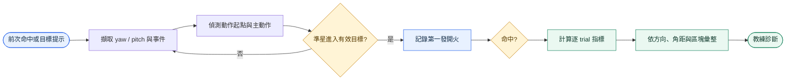
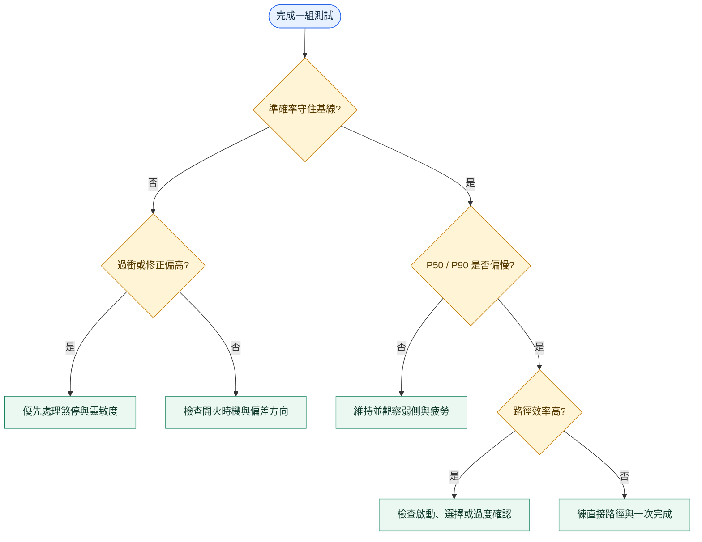

# Micro Flick Test 表現指標與量測原理

*設計提案｜以短距離、離散式準星轉移拆解啟動、加速、煞停、修正與開火時機；本文件不代表指標已實作。*

---

## 📋 文件定位

Micro Flick Test 測量的是「從目前視線快速轉向鄰近目標，穩定停住並在正確時機開火」的能力。它不是單純反應力測驗，也不能代替追蹤、壓槍、移動射擊或長距離大角度轉身測試。

正式比較應採用**提示目標模式**：三個目標可同時顯示，但每個 trial 只指定一個有效目標，以控制方向、角距與目標寬度。影片式的**自由選擇模式**可保留作為實戰化教練測試，但成績會混合目標選擇與動作執行，不能把命中時間直接稱為純反應時間。

建議核心面板只放六組訊號：有效命中率、射擊準確率、命中間隔 P50／P90、開火角誤差、路徑效率、過衝／免修正率。其餘指標用來解釋核心成績為什麼變好或變差。

## 🧪 建議測試設計

| 項目 | 正式比較設定 | 原因 |
|---|---|---|
| 模式 | 提示目標；每 trial 僅一個有效目標 | 分離選擇與動作，讓方向／距離可控 |
| 視角與輸入 | 固定解析度、FOV、DPI、遊戲靈敏度與 raw input 設定 | 避免角度與滑鼠位移映射改變 |
| 玩家狀態 | 固定位置；只允許 yaw／pitch | 排除走位與相機平移 |
| 武器規則 | hitscan、零散布、零後座、無換彈與彈藥限制 | 不製作槍枝模型，並排除武器機制造成的誤差 |
| 目標配置 | 平衡左／右、上／下、斜向與小／中角距 | 防止成績被單一方向偏好主導 |
| 暖身 | 2 組 × 30 秒 | 降低冷啟動效應 |
| 正式測試 | 5 組 × 30 秒；組間休息 45–60 秒 | 同時觀察代表值、尾端與疲勞趨勢 |
| 隨機化 | 凍結 seed；不同玩家使用相同 trial 集合 | 確保可重現與公平比較 |
| 基準複測 | 若用於長期基線，另一天重測一次 | 估計日間可靠度 |

上述秒數是首輪驗證建議，不是不可修改的常數。正式收案前應凍結版本、閾值與排除規則。

## 🔄 從事件到教練診斷



## 📐 事件、幾何與符號

每個 trial 的錨點為 `t_anchor`：首個 trial 使用目標提示時間，後續 trial 使用前一次有效命中時間。建議保存原始 tick，而不是只保存彙整值。

| 符號 | 定義 |
|---|---|
| `t_move` | 角速度超過凍結啟動閾值並連續成立 N ticks 的第一個 tick |
| `t_enter` | 準星第一次進入有效目標角半徑的時間 |
| `t_fire` | 該 trial 第一發有效開火時間 |
| `t_hit` | 有效命中事件時間 |
| `u_k` | tick `k` 的單位視線向量 |
| `v` | 目標中心的單位方向向量 |
| `D` | 從起點到目標中心的最短球面角距 |
| `W` | 沿移動方向投影的目標有效角寬 |
| `L` | 實際準星球面路徑長度 |
| `e_fire` | 開火瞬間準星到目標中心的角誤差 |
| `ω(t)` | 準星角速度，單位建議為 degree/s |

核心幾何式：

```text
D = acos(clamp(u_start · v, -1, 1))
L = Σ acos(clamp(u_k · u_(k+1), -1, 1))
e_fire = acos(clamp(u_fire · v, -1, 1))
```

計算前須固定座標系、角度單位、tick rate、掉幀處理、啟動／停止閾值及目標邊界是否含等號。這些都是演算法版本的一部分。

## 📊 指標總覽

| 層級 | 指標 ID | 計算 | 方向 | 主要回答 |
|---|---|---|---|---|
| 結果 | `effective-hit-rate-hz` | `有效命中數 / 有效秒數` | 高較佳 | 單位時間產出多少有效命中 |
| 結果 | `shot-accuracy` | `有效命中數 / 有效開火數` | 高較佳 | 產出是否靠浪費子彈換得 |
| 速度 | `hit-to-hit-p50-ms` | `median(t_hit[i]-t_hit[i-1])` | 低較佳 | 典型完成速度 |
| 速度 | `hit-to-hit-p90-ms` | `P90(t_hit[i]-t_hit[i-1])` | 低較佳 | 慢 trial 與失穩尾端 |
| 精度 | `shot-error-p50-deg` | `median(e_fire)` | 低較佳 | 開火時離中心多遠 |
| 控制 | `path-efficiency` | `D / L` | 高較佳 | 路徑是否直接；理論上不大於 1 |
| 控制 | `overshoot-rate` | `過衝 trial / 可判定 trial` | 低較佳 | 煞停失敗是否頻繁 |
| 控制 | `correction-free-rate` | `無次動作命中 / 有效命中` | 高較佳 | 一次主動作完成的比例 |
| 控制 | `settling-p50-ms` | `median(t_fire-t_primary_end)` | 低較佳 | 主動作後等多久才敢開火 |
| 時機 | `click-latency-p50-ms` | `median(t_fire-t_enter)` | 視情境 | 進入目標後的開火策略 |
| 動態 | `peak-omega-p50-dps` | `median(max ω(t))` | 無單向優劣 | 主動作速度能力與策略 |
| 穩定 | `within-block-cv` | `SD(hit-to-hit) / mean(hit-to-hit)` | 低較佳 | 同一區塊的節奏穩定性 |
| 穩定 | `fatigue-slope` | `metric ~ trial_index` 的穩健斜率 | 趨近 0 較佳 | 區塊內是否逐漸退化 |
| 研究 | `fitts-throughput-bps` | `ID / MT`，`ID=log2(D/W+1)` | 高較佳 | 控制角距與寬度後的資訊處理率 |

所有代表值都應同時回報樣本數，並以方向、角距、目標寬度、區塊與命中／未命中狀態分層。只報全場平均會掩蓋弱側與極慢尾端。

## 🎯 核心結果指標

### 有效命中率與射擊準確率

```text
有效命中率 (Hz) = N_hit / T_valid_seconds
射擊準確率 (%) = N_hit / N_fire × 100
```

有效命中率是輸出，射擊準確率是成本。兩者必須成對閱讀：高命中率但準確率低，可能只是用更多開火換取分數；準確率極高但命中率低，可能代表策略過度保守。暫停、選單、失焦與明確無效 trial 不計入有效秒數。

### 命中間隔 P50 與 P90

```text
hit_to_hit_i = t_hit_i - t_hit_(i-1)
```

P50 描述典型節奏，P90 描述最慢 10% 邊界。若 P50 改善而 P90 惡化，表示最佳表現變快但失誤恢復或偶發卡頓加重。首個 trial 應另報 `first-target-time`，不可硬併入 hit-to-hit 分布。

### 開火角誤差

```text
e_fire = acos(clamp(u_fire · v_target, -1, 1))
```

角誤差比畫面像素更能跨解析度比較。除中位數外，建議回報 P90 與帶符號的水平／垂直誤差，辨識一致性偏左、偏右、偏上或偏下。命中與未命中都要保留，否則只看成功樣本會低估真實誤差。

## 🧭 路徑與煞停控制

### 路徑效率

```text
path_efficiency = D / L
```

`D` 是最短球面角距，`L` 是實際累積角路徑。接近 1 表示準星走得直接；偏低可能來自弧形路徑、抖動或來回修正。當 `D` 太小、樣本掉幀或 `L < D` 超過數值容差時，trial 應標記為不可判定，而不是強制截成 1。

### 過衝率與過衝量

先把每個準星位置投影到「起點→目標中心」的主移動軸。若投影跨過目標中心後又反向回到開火位置，視為過衝；最大越界距離是過衝量。

```text
overshoot_rate = N_overshoot / N_evaluable
overshoot_magnitude = max(0, max(projected_position - D))
```

過衝率高通常指向煞停控制、靈敏度或用力過度；但目標內刻意穿越中心不一定是錯誤，因此必須同看命中、開火時機與誤差。

### 修正次數與免修正率

快速瞄準可被描述為一個主要子動作，加上零個或多個次要修正；這種分解與快速瞄準動作的最佳控制模型一致。[^meyer1988]

```text
correction_free_rate = N_hit_without_secondary_submovement / N_hit
```

子動作分割會受平滑濾波、局部峰值閾值與 tick rate 影響，因此要保存 `segmentation_version`。第一版較適合用「免修正率」做教練溝通，將原始修正次數留作診斷。

### 穩定時間

```text
settling_time = t_fire - t_primary_end
```

`t_primary_end` 可定義為主速度峰之後，首次進入停止速度帶且持續 N ticks 的時間。時間長且誤差低，通常代表玩家已到位但不敢開火；時間短且邊緣 miss 增加，則可能是過早開火。閾值必須在試點後凍結。

## ⏱️ 速度與開火時機

### 峰值角速度

```text
peak_omega = max(ω(t)),  t ∈ [t_move, t_fire]
```

峰值角速度不是越高越好。它要與路徑效率、過衝、穩定時間及命中結果共同解讀：高峰值且低過衝表示快速又能煞停；高峰值伴隨大量修正，代表速度超過當前控制能力。

### 進入目標後開火延遲

```text
click_latency = t_fire - t_enter
```

正值代表準星先進入目標才開火；接近零代表在邊界同步開火；負值只可能出現在事件對時、延遲補償或目標移動的特殊定義中，應標記檢查。此指標回答的是時機策略，不是單純神經反應時間。

## 📈 一致性、弱側與疲勞

### 區塊內變異與尾端

```text
CV = SD(hit_to_hit) / mean(hit_to_hit)
tail_gap = P90(hit_to_hit) - P50(hit_to_hit)
```

CV 比標準差更適合比較不同平均速度，但只應用於正值且定義一致的分布。`tail_gap` 大表示偶發慢 trial 對整體體驗有明顯影響。另應回報最長 miss streak，避免平均值掩蓋連續崩盤。

### 方向與角距分層

至少分成左、右、上、下與斜向，並在相近 `D/W` 條件下比較。弱側判定優先看成對差值與信賴區間，而不是單一場次的名次。方向差異可能來自手腕活動範圍、握姿、滑鼠墊邊界或坐姿，不應直接解讀為視覺能力差。

### 疲勞斜率

對 trial 序號或有效經過時間擬合穩健趨勢：

```text
metric_i = intercept + fatigue_slope × trial_index_i + error_i
```

命中間隔或角誤差的正斜率、有效命中率的負斜率，都可能指向疲勞、緊張或注意力下降。斜率應附信賴區間，並避免用只有少量 trial 的區塊下結論。

## 🧮 Fitts 正規化與進階平滑度

Fitts 模型描述快速瞄準中的速度—準確度權衡，難度隨移動距離增加、隨目標容許寬度縮小。[^fitts1954]

```text
ID = log2(D / W + 1)
throughput = ID / MT
```

它只適合提示目標、控制 `D` 與 `W` 的 trial，且應先檢查 `MT ~ ID` 的關係。自由選擇模式會混入選擇時間；因此 throughput 是跨條件正規化的研究指標，不是唯一 KPI。

SPARC、LDJ 等平滑度指標可用於研究動作是否間斷，但平滑度會受到動作時間、幅度、停頓、取樣與處理流程影響。[^hogan2009][^balasubramanian2015] 第一版教練面板優先使用可視化且容易稽核的路徑效率、過衝與修正率；進階平滑度保留在分析層。

專案內延伸設計可參考：[Primary Submovement Ratio](../metrix_design/primary-submovement-ratio-guide-2026-05-20.md)、[Velocity Scaling Consistency](../metrix_design/velocity-scaling-consistency-guide-2026-05-21.md)、[LDJ-V](../metrix_design/per-segment-ldj-v-guide-2026-05-21.md) 與 [SPARC Tracking](../metrix_design/per-segment-sparc-tracking-guide-2026-05-21.md)。

## 🔍 教練判讀矩陣

| 觀察組合 | 優先假設 | 建議複核 | 訓練方向 |
|---|---|---|---|
| 峰值速度高、過衝高、穩定時間長 | 加速超過煞停能力 | 靈敏度、握力、反向修正幅度 | 降低用力；固定角距做「快起、早煞」 |
| 路徑直接、角誤差低，但命中間隔慢 | 啟動或目標選擇偏慢 | `t_move-t_anchor`；提示與自由模式差 | 提示模式練啟動；自由模式練掃視規則 |
| 很早進入目標、click latency 長 | 開火過度保守 | 進入後是否停住；miss 型態 | 逐步提前點擊，守住準確率下限 |
| click latency 很短、邊緣 miss 多 | 預判式提前開火 | 帶符號誤差與 miss 方位 | 延後數毫秒；練中心確認 |
| 右向顯著優於左向 | 人體工學或活動範圍不對稱 | 控制 `D/W` 後再比；錄影握姿 | 調整坐姿／墊面，補弱側 |
| P50 穩定、P90 與 miss streak 惡化 | 偶發失穩或錯誤恢復慢 | 過衝後下一 trial、連續失誤 | 練錯誤重置與固定節奏 |
| 區塊後段速度、精度同步下降 | 疲勞或張力累積 | 疲勞斜率、手部用力與休息 | 縮短組長、建立放鬆提示 |



## ⚠️ 有效性與排除規則

- 自由選擇模式的時間包含「看哪一顆、選哪一顆」；不能稱為純反應時間。
- 不同 FOV、靈敏度、DPI、frame/tick rate、目標角寬或輸入延遲不可直接混比。
- miss trial 不可整筆刪除；結果指標保留 miss，只有需命中事件的衍生量才標記缺失。
- 失焦、暫停、非測試輸入、遙測缺口與目標生成失敗應有獨立 reason code。
- 主要指標、閾值與排除規則應在正式測試前註冊並鎖版，避免看過結果後調參。
- 本測試不直接測量 tracking、recoil control、movement shooting、戰術決策或純視覺反應。

## ✅ 驗收與資料契約

每個原始 tick 至少保存：`session_id`、`block_id`、`trial_id`、單調時間戳、yaw、pitch、目標 ID／位置／角半徑、目標有效狀態、fire、hit、pause／focus 狀態與設定版本。每個 trial 衍生表至少保存：上述事件時間、`D`、`W`、`L`、結果、排除原因與演算法版本。

首輪驗收建議：

1. 用合成直線軌跡驗證 `D/L ≈ 1`，用已知彎折軌跡驗證路徑長度。
2. 用已知角偏差驗證 `e_fire`，包含跨 yaw ±180° 的邊界案例。
3. 用人工標記影片／tick 對照 `t_move`、`t_enter`、過衝與次動作分割。
4. 重播相同 seed 與輸入，確認逐 trial 結果可重現。
5. 比較不同 tick rate 下的指標偏差，為不可接受的敏感度設定門檻。
6. 以同日與跨日複測估計可靠度，再決定個人最小有意義變化。

## 📚 參考資料

[^fitts1954]: Fitts, P. M. (1954). *The information capacity of the human motor system in controlling the amplitude of movement*. Journal of Experimental Psychology, 47(6), 381–391. https://doi.org/10.1037/h0055392
[^meyer1988]: Meyer, D. E., Abrams, R. A., Kornblum, S., Wright, C. E., & Smith, J. E. K. (1988). *Optimality in human motor performance: ideal control of rapid aimed movements*. Psychological Review, 95(3), 340–370. https://doi.org/10.1037/0033-295X.95.3.340
[^hogan2009]: Hogan, N., & Sternad, D. (2009). *Sensitivity of smoothness measures to movement duration, amplitude, and arrests*. Journal of Motor Behavior, 41(6), 529–534. https://pubmed.ncbi.nlm.nih.gov/19892658/
[^balasubramanian2015]: Balasubramanian, S., Melendez-Calderon, A., Roby-Brami, A., & Burdet, E. (2015). *On the analysis of movement smoothness*. Journal of NeuroEngineering and Rehabilitation, 12, 112. https://doi.org/10.1186/s12984-015-0090-9
