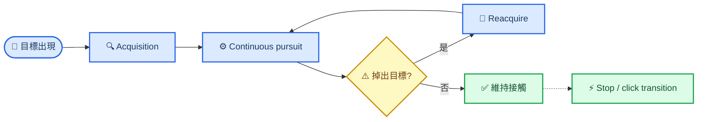

# Tracking 能力量測：Drill 與指標 Pilot 研究設計

_研究草案 · FPS Aim Analyst · 2026-08-31_

---

## 📋 結論摘要

如果目標是分析選手的 **Tracking 能力**，不應把「對移動目標開槍的總分」當成 tracking。較有效的設計是先把能力拆成 acquisition、continuous pursuit、loss/recovery 與 tracking-to-click transition，並讓不同 drill 各自承擔一個清楚的量測任務。

本研究建議：

1. **核心評估**採「單一目標、玩家靜止、禁止射擊、20–30 秒連續、二維帶限偽隨機軌跡」。它較不容易被記住或靠固定邊界預判，適合測在線視覺回饋與連續修正。
2. 現有 `tracking_v1` 的一維水平 ping-pong 保留，但定位為 **可預測基準／儀器校準**，不可單獨代表整體 tracking。
3. 另設「隨機變向／速度階躍」作 **反應性 tracking 診斷**，量方向改變後的反應、overshoot、掉靶與 reacquire。
4. `hold_track_v1`、ADS、projectile、玩家移動與射擊屬 **轉移測驗**；它們接近遊戲情境，但混入其他構念，不放進純 tracking 主分數。
5. Pilot 的預註冊主要指標維持現有 **pursuit window 內 `RMS(ε)`**。`TOT%`、lag、velocity gain、drop/reacquire 與條件差異負責解釋原因。
6. SPARC 只作研究向平滑度診斷。它不能取代 tracking error，也不能把「平滑但落後／偏離」說成好 tracking。
7. Pilot 階段 **不建立單一 Tracking Score、不設人口常模**。先確認 floor/ceiling、構念敏感度、跨 session repeatability 與硬體效度。

> 📌 **最小可行方案：**先新增 `tracking_core_pr_v1` 與 `tracking_reversal_v1`，保留 `tracking_v1` 作 predictable baseline；三者共用既有 `ε(t)`、on-target、`t_acquire`、TOT、drop/reacquire 資料地基。

## 🎯 要測的不是一個分數，而是四個階段

Tracking 是持續閉迴路控制。選手必須看見目標、取得目標、匹配其速度、修正誤差，掉出目標後再重新取得；若 drill 要求開火，還要從追蹤切換成停止／點擊。這些階段可能由不同能力限制，不能用一個 hit rate 混在一起。



### 四個構念的操作定義

| 構念 | 問題 | 主要觀察窗 | 不應混入 |
| --- | --- | --- | --- |
| **Acquisition** | 多快第一次把準星帶入目標？ | `t_visible → t_first_on_target` | 後續追蹤誤差 |
| **Pursuit** | 取得後能否持續貼住並匹配目標運動？ | `t_first_on_target → window_end` | 初始搜尋／flick |
| **Recovery** | 掉出後多常發生、多久回來？ | 每次 on→off→on episode | 未恢復段的假造時間 |
| **Transition** | 目標停止或要求開火時能否正確轉換？ | `target_stop → first_fire` | 純 pursuit 主分數 |

現有 [Tracking Metrics Offline Derivation](../../operational/analysis-tracking.md) 已正確把 acquisition failure 與 pursuit 聚合分開；這個邊界應保留。整段從未 on-target 是觀察到的 acquisition failure，不是缺值，也不應被丟進 TOT／RMS 平均後稀釋。

## 📚 研究依據與專案現況

### 為什麼需要 predictable 與 unpredictable 兩類 drill

連續 manual tracking 研究常同時計算 target–cursor position error、velocity error 與 cross-correlation lag，而不是只看完成分數。重複軌跡還可能形成內部計畫，讓表現混入路徑學習[^1]。單一 sinusoid 與 pseudorandom target 也會產生不同 phase lag／amplitude response；研究者因此建議把頻域 timing／gain 與 RMSE 並用，否則相同 RMSE 可能來自不同原因[^2]。

因此：

- **Predictable drill** 適合看選手在已知規律下的穩態速度匹配、軸向差異與裝置基準
- **Unpredictable drill** 更適合作為核心評估，因為它降低背路徑與固定 reversal timing 的貢獻
- 兩者不是 easy／hard 的同一條刻度，而是在測不同控制策略

一維不可預測目標的研究亦常用多頻 gain／phase 分析；手部 tracking 的 phase lag 會隨刺激頻率增加，顯示單一總體誤差不足以描述頻率依賴的控制能力[^3]。

### 現有專案已具備的地基

| 現有資產 | 可以回答 | 本研究判定 |
| --- | --- | --- |
| [`tracking_v1`](../../../src/drill/tracking_v1.ts) | 2 秒水平 ping-pong；`t_acquire`、TOT、RMS | 保留為 predictable baseline |
| [`tracking_longrange_v1`](../../../src/drill/tracking_longrange_v1.ts) | 0.5° × 5°/s 小目標遠距條件 | 適合角尺寸 floor 測試 |
| [`tracking_br_v1`](../../../src/drill/tracking_br_v1.ts) | ADS × ballistic × 角尺寸 | 定位為 BR transfer，不是 pure tracking |
| [`hold_track_v1`](../../../src/drill/hold_track_v1.ts) | 追蹤→停止→首發 | 定位為 transition transfer |
| [`trackingDerivation.ts`](../../../src/metrics/trackingDerivation.ts) | `ε(t)`、on-target、acquisition、TOT、RMS／median／P95 | 可直接重用 |
| [`trackingTransitions.ts`](../../../src/metrics/trackingTransitions.ts) | drop count、完成 reacquire 的時間 | 可直接重用，但要報 censored count |
| [Per-segment SPARC guide](../metrix_design/per-segment-sparc-tracking-guide-2026-05-21.md) | tracking-like segment 的 smoothness 候選 | 研究脈絡，不覆寫本專案 registry |
| [Advanced diagnostics registry](../../operational/analysis-advanced-diagnostics.md) | 現行 `sparc-v1` 與使用限制 | 權威契約；目前只涵蓋 MR／primary flick |

### 現行 2 秒 ping-pong 的解釋邊界

`tracking_v1` 對 TOT、RMS 與 acquisition 是有效的工程／行為探針，但若拿它作唯一能力測驗，存在三個問題：

1. **反轉可預測**：target 在固定邊界反向，選手可用位置與節奏預判
2. **只走水平軸**：無法看到垂直、斜向與二維耦合控制
3. **窗太短**：2 秒足以算逐 tick error，卻不足以穩定估計低頻 phase／gain；對 SPARC 也容易落入不同 padding bucket 的比較限制

所以不需要淘汰它，而是改正其角色：**它是 baseline，不是完整 construct**。

## 🧪 建議的 drill 組合

### Drill A：Predictable axis calibration

**目的：**建立低認知負荷的速度匹配基準、檢查水平／垂直不對稱，並確認資料管線與硬體狀態。

建議設定：

- 單一目標、玩家靜止、禁止射擊
- 水平與垂直分開成兩個 block
- 使用連續 sinusoid；若沿用 ping-pong，需把固定反轉明確標為 predictable
- scored window 建議 20–30 秒；開頭 1 秒不計分或讓準星先覆蓋目標
- 角尺寸、角速度與 seed／phase 固定並版本化

適合指標：RMS／median／P95 `ε`、TOT、axis-specific lag、velocity gain、SPARC 研究值。

不適合的主張：不能用這一項直接推論 reactive tracking；規律路徑容許 anticipation。

### Drill B：2D band-limited pseudorandom pursuit

**目的：**作為純 Tracking 的核心評估，主要測在線視覺回饋、二維速度匹配與持續誤差控制。

建議設定：

- 單一目標、玩家靜止、禁止射擊
- 20–30 秒 uninterrupted presentation；不要每 2 秒 respawn
- X/Y 由不同頻率與 phase 的 sum-of-sines 或平滑 stochastic process 生成
- 軌跡需位置、速度連續，並限制最大角速度與角加速度；不可用 teleport 製造「反應性」
- 水平／垂直能量近似平衡，整段不長時間黏邊
- 每個 scored block 使用未見 seed；seed family、generator version 與實際 angular speed distribution 寫入 metadata
- 不同 seed 必須匹配 RMS speed、P95 speed、路徑長與 reversal density，否則 seed 本身會成為難度因子

手動追蹤研究顯示，重複／熟悉軌跡可能讓控制混入 internal plan；Novel 軌跡較能保留視覺導引成分[^1]。因此 assessment 可使用不同 phase seed，但不同 session 的 seed family 必須難度等價，不能每次任意抽一條路。

適合指標：RMS `ε` 主統計量、TOT、lag、gain、lag-compensated residual、drop/reacquire、X/Y signed bias、window consistency。

### Drill C：Random reversal and velocity-step tracking

**目的：**量化目標改變方向或速度後，選手多快更新控制，是否 overshoot，以及掉靶後能否恢復。

建議設定：

- 初始先讓準星覆蓋目標，再開始 scored motion
- target 以 piecewise-smooth velocity 運動；變向事件發生在隨機時間與非固定畫面位置
- 事件前後速度、方向差與加速度 ramp 均寫入 event log
- reversal interval 使用範圍抽樣，避免形成固定節拍
- sharp change 仍需有限加速度；否則量到的是 target discontinuity，不是選手 jerk

適合指標：change response latency、峰值離靶誤差、overshoot、settling time、drop probability、reacquire time。

不適合的主張：它不等於 steady pursuit；高變向密度也會使 raw SPARC 變差，不能直接解讀成手部不平滑。

### Drill D：角尺寸 × 角速度難度矩陣

現有專案已有 `0.5° / 2.0° × 5°/s / 20°/s` 的角參數脈絡。target width 與 target speed 都會改變 moving-target acquisition 難度[^6]；對 continuous pursuit，這個 2 × 2 矩陣仍適合做 floor／ceiling 與交互作用 pilot，但效果量必須由本專案資料重新估計。

| 角尺寸 | 角速度 | Pilot 角色 | 主要風險 |
| ---: | ---: | --- | --- |
| 2.0° | 5°/s | Easy anchor | TOT ceiling |
| 2.0° | 20°/s | Speed stress | motion blur／lag |
| 0.5° | 5°/s | Precision stress | pixel visibility |
| 0.5° | 20°/s | Combined stress | acquisition floor |

> ⚠️ **角尺寸與角速度是 drill 自變量，不是事後分箱。**同一 scored block 內不要自動改 target size／speed；自適應只發生在 block 之間，否則一場內的 samples 不再同質。

### Drill E/F：只作轉移效度

| Drill | 增加的遊戲構念 | 可以回答 | 不可回答 |
| --- | --- | --- | --- |
| `hold_track_v1` | 停止、點擊、首發 | tracking-to-click transition | 純 pursuit 高低 |
| BR tracking | ADS、武器、彈道 | 瞄準模式／lead transfer | 一般 mouse tracking |
| Player-strafe tracking | 自身移動、WASD | eye-hand-body coordination | 靜態 tracking baseline |
| Recoil tracking | 射擊節奏、後座 | sustained fire control | 視覺追蹤單一構念 |

這些 drill 很有產品價值，但應在 pure tracking 之後呈現為「轉移測驗」。否則選手可能因 projectile lead、ADS FOV、counter-strafe 或 recoil 失分，卻被錯誤標記為 Tracking 能力差。

### 不建議作為主測驗的形式

- 只用「打中多少發／擊殺多少目標」評分的 moving target drill
- 每次命中立即 respawn，導致 tracking window 被好表現者縮短
- 只有固定邊界 bounce、固定 reversal timing 的單一路徑
- 同一 block 同時操弄 size、speed、scene、ADS、ballistic 與 player movement
- 會在 scored block 內依表現即時改難度的 adaptive drill
- 只記 target spawn 與 click event、沒有逐 tick target／aim telemetry 的 drill

## 📊 應分析的指標

### P0：結果與接觸品質

| 指標 | 定義／單位 | 角色 | 解讀紅線 |
| --- | --- | --- | --- |
| `acquisitionFailureRate` | 未曾 on-target presentations / total | Acquisition gate | 不進 pursuit 聚合 |
| median `tAcquireMs` | 首次 on-target − visible | Acquisition | 不叫純反應時間 |
| `RMS(ε)` | pursuit window 內 angular center error 的 RMS，deg | **預註冊 primary** | 大誤差權重較高 |
| median／P95 `ε` | pursuit window 內誤差分布 | 典型／尾端控制 | 不取代 RMS |
| `TOT%` | exact ray–hitbox on-target ticks / pursuit ticks | 接觸比例 | 隨 target size 改變 |
| effective tracking time | valid pursuit ticks / Hz | Exposure | 每個結果都應帶 n／duration |

`RMS(ε)` 與 TOT 必須並列。TOT 使用真實 hit geometry，對選手直覺；RMS 對掉靶的大偏差敏感，較適合作主統計。大目標可能同時出現 TOT 高但 center error 也高，因此不能互相替代。

### P1：時序與速度匹配

Tracking 的核心不是「滑鼠移動很多」，而是 aim angular velocity 是否在正確時間、正確方向、以正確幅度跟上 target。

建議從逐 tick target／aim angle 建立：

```text
e_yaw(t)   = aim_yaw(t)   - target_yaw(t)
e_pitch(t) = aim_pitch(t) - target_pitch(t)

ω_target(t) = d target_angle / dt
ω_aim(t)    = d aim_angle / dt
```

| 指標 | 建議定義 | 回答的問題 |
| --- | --- | --- |
| tracking lag `τ̂` | 在預註冊 lag range 內，使 target 與 aim velocity 關聯最大的時間位移 | 選手平均落後多久？ |
| velocity gain `β` | lag-aligned 後，aim velocity 對 target velocity 的投影斜率 | 速度幅度是跟不上、匹配或過度？ |
| velocity RMSE | `ω_aim − ω_target` 的 RMS | 每 tick 速度匹配誤差多大？ |
| lag-compensated residual | 對齊 `τ̂` 後重新計算的 position／velocity residual | 原始誤差有多少只是 timing？ |
| frequency gain／phase | 對已知 sum-of-sines 每個刺激頻率估 gain、phase；同時報 coherence | 哪個頻段開始跟不上？ |

本文件建議的 lag 符號固定為：

```text
corr(ω_target(t), ω_aim(t + τ)) 最大時，τ > 0 代表 aim 落後 target。
```

這個符號契約必須跟報告一起版本化，避免與既有 key–velocity xcorr 的正負 lag 慣例混淆。對 periodic drill，單一 cross-correlation peak 可能有週期性多解；應優先使用已知刺激頻率的 phase，或限制 lag 搜尋區間並報 peak ambiguity。Parker 等人的結果也顯示，RMSE 對 timing 與 amplitude error 的敏感度不一定足夠，phase／amplitude ratio 能提供不同資訊[^2]。

### P1：掉靶與恢復

| 指標 | 定義 | 注意事項 |
| --- | --- | --- |
| drop rate | on-target→off-target 次數 / 有效追蹤秒數 | 比 raw count 更可比 |
| off-target episode duration | 每段 off→on 時間 | 報 median、P90、n |
| reacquire time | drop 後首次重新 on-target 的時間 | 已有 derivation 可重用 |
| terminal drop rate | 到 window end 仍未恢復的 drops / all drops | 右設限，不補成假時間 |
| longest off-target streak | 最長連續 off-target 時間 | 顯示單次重大失控 |

現有 `deriveTrackingTransitions()` 正確地讓 terminal drop 計入 `dropCount`，但不把剩餘視窗塞成一筆假的 reacquire time。報告需要同時顯示 `dropCount`、完成 reacquire 的 `n` 與 terminal-censored count。

### P1：方向、距離與條件差異

建議保留 signed error，而不只留 unsigned `ε`：

- horizontal signed bias：是否長期領先／落後於水平 target
- vertical signed bias：是否有一致的高／低偏差
- leftward vs rightward gain／lag
- upward vs downward gain／lag
- clockwise vs counter-clockwise，或四象限差異
- 角尺寸 × 角速度 cell 的 RMS、TOT、lag、gain

不要把所有條件先 normalize 後合成一個分數。先顯示條件矩陣與 speed–precision frontier，才能看出選手是「小目標掉準度」還是「高速時延遲變大」。

### P2：平滑度與控制策略

SPARC 可以描述速度頻譜是否含較多高頻修正；相較 LDLJ，它通常對 measurement noise 更穩健，但任何 filtering／sampling／windowing 變更仍會改變結果[^5]。

對本專案的建議是：

1. 新增 tracking smoothness 時使用新的 metric version，不直接借用現行只涵蓋 MR primary flick 的 `sparc-v1`
2. 只在 **相同 sample rate、固定 window duration、相同 motion family、相同 padding bucket** 內比較
3. 同時報 target motion 的 SPARC／spectral content，避免把較複雜的刺激誤判成選手較不平滑
4. 優先研究 lag-aligned correction residual 的頻譜，而非只看 raw aim speed
5. SPARC 只進 advanced diagnostics，不進主表與自動處方

可選的研究向指標：

- aim angular-speed SPARC
- lag-aligned residual-speed SPARC
- high-frequency correction power ratio
- aim path length / target path length
- acceleration／jerk distribution
- correction burst rate

> ⚠️ **Smoothness 的必要反例：**一名選手可以非常平滑地落後目標 150 ms，也可以平滑地維持固定偏差。沒有 RMS／lag／gain，SPARC 不能判定 tracking 好壞。

### 不建議優先採用的指標

| 指標 | 原因 |
| --- | --- |
| 總分／擊殺數 | 混合 target exposure、click、weapon 與 pursuit |
| 平均 mouse speed | 主要由 target speed 與 sensitivity 決定 |
| raw correction count | 高度依賴 filtering、sample rate 與閾值 |
| 單一 peak speed | 不代表持續速度匹配 |
| 只看 hit rate | 點射結果，不是 continuous contact |
| 只看 SPARC／LDJ | 可平滑但錯位；LDJ 又會放大微分噪聲 |
| 無品質 gate 的 percentile | 可能只是 dropped frames／latency／telemetry 缺口 |

### 指標組合的教練式解讀

| 表現型 | RMS／TOT | Lag／gain | Drop／smoothness | 可能限制 |
| --- | --- | --- | --- | --- |
| 貼得住但慢半拍 | RMS 中、TOT 中高 | lag 高、gain≈1 | drops 少 | 預測／時序 |
| 跟不上速度 | RMS 高、TOT 低 | gain<1 | 長 off-target | 速度縮放 |
| 容易超前過衝 | P95 高 | gain>1 或 reversal overshoot 高 | drops 集中在變向 | 制動控制 |
| 持續抖動修正 | RMS 中高 | lag 不一定高 | residual SPARC 低、burst 多 | correction stability |
| 平滑但偏離 | RMS 高、TOT 低 | lag／bias 高 | SPARC 可能好 | 不能稱為 smooth tracking 優秀 |
| 取得慢、取得後好 | tAcquire 高 | pursuit lag／gain 正常 | drops 少 | acquisition，不是 pursuit |

這些只是假設產生規則。真正的 coach rule 必須在同人基準與足夠樣本上驗證，且每次只挑一個最有證據的限制因素。

## ⚙️ 資料、品質與正規化契約

### 必要逐 tick 資料

現有 schema v2 已能支持 P0 與大部分 P1：

- sim timestamp、`aim.yaw/pitch`
- target center `tx/ty/tz`
- player／eye origin metadata
- exact target hitbox
- visible／target_stop 等 lifecycle events
- `simHz`、seed、scene、FOV／ADS、display／frame summary

若要穩健估 lag／gain／reversal，建議再保證：

- motion generator id／version 與完整參數
- 每個 direction／speed change 的 event timestamp 與前後 velocity
- 每 tick target velocity 可由 position 決定性重建，或輸出可對表的 motion state
- input mode、pointer-lock raw-input capability、polling／render condition
- 每個 block 的 angular size、RMS/P95 angular speed、angular acceleration 與 path length 摘要

### Quality gates 先於能力判定

Cursor latency 會增加 position error、改變 corrective submovement 與速度頻譜；突變 latency 也會造成短期重新校準[^4]。因此下列項目是 eligibility／quality，不是選手能力：

- `meta.suspect == false`
- recorder overflow、missing target telemetry、non-monotonic timestamp 均為 0
- sim tick coverage 與 dt gap 通過既有 gate
- render frame p95、長幀與 fullscreen／display mode 符合 protocol
- 同一比較中的 FOV、ADS、sensitivity、DPI、resolution、refresh rate 與 input mode 相容
- target angular size 在實際 display 上可辨識；0.5° condition 需單獨檢查 pixel／aliasing floor
- assessment 期間不顯示會誘發策略改變的即時指標

### 單位與跨條件正規化

- 主誤差保留 `deg`，不用 screen pixel；這能避免 distance／FOV 直接改寫量尺
- TOT 使用 exact hitbox intersection，不另造任意 error threshold
- 跨 target size 可額外報 target-normalized error，但不可取代原始角度與 exact TOT
- X/Y normalized error 可使用各軸 angular half-size；若要做 radial normalized error，必須版本化 box-to-angular approximation
- 所有聚合按 drill version × size × speed × motion family × device-compatible condition 分層

## 🔬 Pilot 執行與驗證方案

### 建議的最小 protocol

| 順序 | Block | 條件 | 建議 scored exposure |
| ---: | --- | --- | ---: |
| 0 | Practice | Predictable easy | 30–60 s，不入分析 |
| 1–2 | Axis calibration | Horizontal／vertical predictable | 各 20–30 s |
| 3–6 | Core pseudorandom | 2 sizes × 2 speeds | 各 20–30 s |
| 7–8 | Reactive | Medium／high reversal density | 各 20–30 s |
| 9 | Transfer optional | `hold_track_v1` | 依既有 protocol |

正式施測應把 block order 對抗平衡；core 的 seed phase 可以不同，但 generator statistics 必須等價。第一次 session 先給不計分 practice，避免把操作熟悉期當能力。評估 block 之間提供固定休息，並把休息與重跑原因記錄。

### 三階段 Pilot

#### Stage A：Instrumentation pilot

少量內部／熟練使用者重複跑所有條件，目的只在找工程錯誤：

- target path 是否連續、無碰牆／黏邊
- motion event 與逐 tick position 是否對表
- 角尺寸／角速度 round-trip 是否正確
- quality gate 是否能抓到 frame stall、overflow、missing target
- perfect follower、fixed lag、gain<1、overshoot、never acquire 等 synthetic fixtures 是否回復已知答案

#### Stage B：Difficulty calibration

以真人資料檢查：

- easy cell 是否 TOT ceiling
- hard cell 是否 acquisition floor
- size 變小／speed 變快時，RMS、TOT、lag、drop 是否呈可解釋變化
- 0.5° 是否主要量到解析度／可見性，而不是精密 tracking
- 不同 seed 的 exposure statistics 與表現難度是否等價
- 20–30 秒是否出現明顯疲勞坡度；若有，縮短 block 或把時間窗效果納入模型

這一階段的門檻是 pilot decision rule，不是人口常模。不要先把例如 TOT 80% 寫成及格線，再強迫 task 配合。

#### Stage C：Repeatability and validity pilot

同一批選手在相同硬體／設定下完成至少兩個 session。除平均差之外，應同時檢查：

- test–retest ICC：選手排序是否穩定
- within-subject CV／SEM：同一人的自然波動多大
- Bland–Altman limits：絕對差異與偏差是否可接受
- seed-family equivalence：alternate forms 是否等價
- metric redundancy：RMS、TOT、lag、gain、drop 是否只是重複同一訊息
- known manipulation sensitivity：size、speed、predictability、reversal density 是否只影響預期指標

動態 visuomotor tracking 研究已有以 ICC 與 Bland–Altman 類方法檢查 test–retest reliability／repeatability 的做法[^7]。本專案應依想偵測的最小個人變化決定樣本量與可接受誤差，而不是只追求群體平均顯著。

### Pilot 決策表

| 觀察 | 優先決策 | 不應做的解釋 |
| --- | --- | --- |
| hard cell 多數 never acquire | 放大 target 或降 speed | 選手沒有 tracking 能力 |
| easy cell 多數 TOT≈100 | 增加速度或縮小 target | 指標非常可靠 |
| pseudorandom lag 明顯高於 predictable | 保留兩 drill 分立報告 | 合併成平均 lag |
| seed 間表現差異大 | 重新匹配 path statistics | 當成選手波動 |
| SPARC 跟 window/padding 走 | 固定 window、分 bucket 或暫不報 | 加分數校正後硬合併 |
| RMS 好但 transfer click 差 | 診斷 transition | 調降 pure tracking 評價 |
| 跨 session 差異大於 condition effect | 先改善 task reliability | 建立常模／處方 |

## 💡 建議的實作優先序

### P0：先形成可解釋的核心評估

1. 新增 `tracking_core_pr_v1`：2D、band-limited、20–30 秒、no-fire、multiple equivalent seeds
2. 新增 `tracking_reversal_v1`：記錄 direction／speed change events
3. 保留 `tracking_v1`，UI 改標「Predictable horizontal baseline」
4. 結果主表只放 RMS `ε`、TOT、acquisition failure／`tAcquire`
5. 結果診斷放 lag、gain、drop/reacquire、X/Y bias
6. 所有數值都帶 condition、effective duration、n 與 quality state

### P1：建立追蹤動態解釋

1. 實作 target/aim angular velocity 的共享 derivation
2. 凍結 tracking lag 的正負號、搜尋範圍與 ambiguity gate
3. 對 predictable sum-of-sines 加 frequency gain／phase／coherence
4. 對 reversal drill 加 response latency、overshoot 與 settling time
5. 建立 size × speed 的個人表現矩陣與 session history

### P2：研究向平滑度與轉移效度

1. 另立 tracking-specific SPARC version 與 fixed-window parity fixture
2. 比較 raw aim-speed SPARC 與 residual-speed SPARC 的效度
3. 將 `hold_track_v1`、BR tracking、player movement 分列為 transfer tests
4. 有足夠 repeatability／known-groups 證據後，再評估是否需要 composite score

### 暫時不要做

- 不把 `RMS + TOT + SPARC + hit rate` 任意加權成總分
- 不發布「好／普通／差」的全球門檻
- 不讓 assessment block 內自動調難度
- 不把 projectile lead、ADS 或 recoil 結果回寫成 pure tracking 分數
- 不直接將現有 primary-flick `sparc-v1` 改名為 tracking smoothness

## 🔗 研究問題與待決策

下一輪設計會需要回答：

1. 核心產品更重視 **smooth precise tracking**、**reactive tracking**，還是兩者並列？
2. assessment 是否允許按住射擊？若允許，hit events 只能作 transfer outcome，pursuit window 仍須固定
3. 目標軌跡要模擬敵人 strafe，還是作純粹可辨識的 sensorimotor probe？前者生態效度高，後者診斷效度高
4. `0.5° × 20°/s` 是否對現有顯示設備形成視覺 floor？需要先用 Stage B 回答
5. lag/gain 是只做 session summary，還是要畫 frequency response？後者解釋力更高，但需要較長 block 與受控 stimulus
6. 結果頁是否採「一個主結論 + 一張 target/aim trace + 一張 size×speed matrix + loss/recovery timeline」？

本研究的建議答案是：**先把診斷效度做好，再用 transfer drill 補生態效度。**第一版只要能可靠區分「取得慢」、「穩態落後」、「速度跟不上」、「變向過衝」與「掉靶後回不來」，就已經比單一 tracking score 更能指導訓練。

研究查詢與來源摘要保存在 [research_tracking_drill_metrics_2026-08-31.md](../../../sources/research_tracking_drill_metrics_2026-08-31.md)。

## 🔗 References

[^1]: Philip, B. A., Wu, Y., Donoghue, J. P., & Sanes, J. N. (2008). “Performance differences in visually- and internally-guided continuous manual tracking movements.” _Experimental Brain Research_, 190, 475–491. https://pmc.ncbi.nlm.nih.gov/articles/PMC2574818/

[^2]: Parker, M. G., Weightman, A. P., Tyson, S. F., Abbott, B., & Mansell, W. (2021). “Sensorimotor delays in tracking may be compensated by negative feedback control of motion-extrapolated position.” _Experimental Brain Research_, 239, 189–204. https://pmc.ncbi.nlm.nih.gov/articles/PMC7884356/

[^3]: Niehorster, D. C., Siu, W. W. F., & Li, L. (2015). “Manual tracking enhances smooth pursuit eye movements.” _Journal of Vision_, 15(15), 11. https://pmc.ncbi.nlm.nih.gov/articles/PMC4669211/

[^4]: Turner, L. J., Wiederman, S. D., O’Rielly, J. L., & Ma-Wyatt, A. (2026). “The impact of varying cursor latency on visuomotor tracking.” _Experimental Brain Research_, 244(6), 105. https://pubmed.ncbi.nlm.nih.gov/42068368/

[^5]: Balasubramanian, S., Melendez-Calderon, A., Roby-Brami, A., & Burdet, E. (2015). “On the analysis of movement smoothness.” _Journal of NeuroEngineering and Rehabilitation_, 12, 112. https://pmc.ncbi.nlm.nih.gov/articles/PMC4674971/

[^6]: Lee, J., & Hong, S.-K. (2022). “Time to Capture a Moving Target Travelling along a Circular Trajectory.” _Applied Sciences_, 12(4), 1911. https://www.mdpi.com/2076-3417/12/4/1911

[^7]: Kryskow, E. M., Maule, A. L., & Ghajar, J. (2013). “Dynamic visuomotor synchronization: Quantification of predictive timing.” _Behavior Research Methods_, 45, 289–300. https://pmc.ncbi.nlm.nih.gov/articles/PMC3578718/

