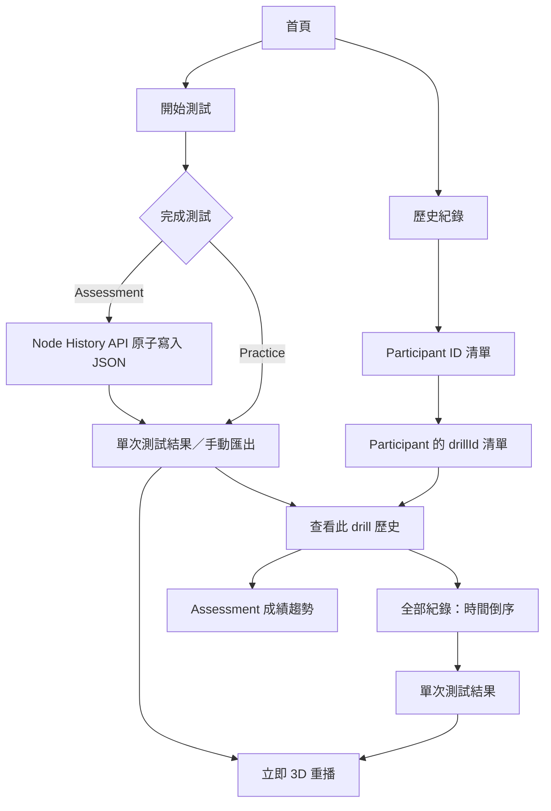
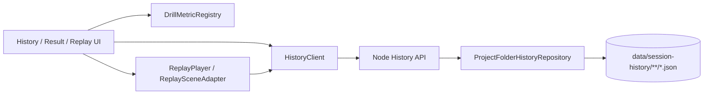
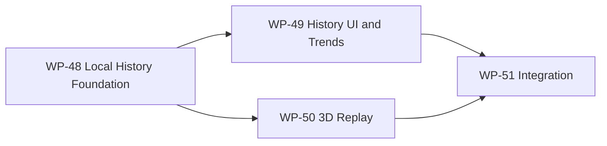

# 階段 J（stage10）提案 — 本機歷史紀錄中心與 3D 重播 prototype

> **狀態：🟡 已確認產品方向，尚未開工。** 本階段把目前只能由瀏覽器下載／手動選取的單次 JSON 匯出，提升為專案內固定資料夾的本機紀錄庫，並提供 `Participant ID → drillId → 時間` 的歷史瀏覽、Assessment 趨勢與第一人稱 3D 狀態重建重播。
>
> 本文件記錄 2026-08-27 與使用者確認的需求。技術棧維持 Three.js + TypeScript + Vite + 純 DOM UI；新增一個只存取本專案指定目錄的 Node History API。完整 task 狀態見 [task-checklist.md](task-checklist.md)，進度與決策紀錄見 [progress.md](progress.md)。

| | |
|---|---|
| **目標** | 讓 Participant 與研究員能在同一台電腦上瀏覽、比較並重播過去測試 |
| **資料來源** | 專案下固定資料夾中的 JSON；不使用雲端、資料庫或瀏覽器 IndexedDB |
| **核心階層** | `Participant ID → 完全相同 drillId → startedAt 倒序 → 結果／重播` |
| **歷史政策** | 只保存與瀏覽 Assessment；Practice 保留即時結果與手動匯出，但不建立歷史紀錄 |
| **重播語意** | 依記錄狀態重建玩家當時看到的 3D 過程，不重新執行舊輸入或要求錄影檔 |
| **里程碑** | 暫定 M18：本機自動保存、歷史瀏覽、Assessment 趨勢、3D 重播與 E2E 驗收全數成立 |
| **狀態** | 🟡 規劃完成，尚未開始 T0 |

---

## 1. 已確認的產品決策

| # | 決策 | 結論 |
|---|---|---|
| D-S10-1 | 重播形式 | 用 Three.js 3D 場景重建玩家當時看到的過程 |
| D-S10-2 | 歷史儲存 | 只存在本機，固定於本專案下的特定資料夾，格式 JSON |
| D-S10-3 | 本機寫檔能力 | 接受新增 Node History API；瀏覽器不得直接存取任意檔案系統路徑 |
| D-S10-4 | Practice／Assessment | 只保存與瀏覽 Assessment；Practice 不自動保存、不進 Participant 歷史階層，仍可查看當次結果並手動匯出 |
| D-S10-5 | Drill 分組 | 只以完全相同的 `drillId` 分組；不同 id 不合併，即使屬同一 family |
| D-S10-6 | 使用者角色 | Participant 本人與研究員皆會使用；prototype 不做登入、權限或資料隔離 |
| D-S10-7 | 成績指標 | 每種 drill 可有不同指標；本階段建立可擴充 registry，不要求先完成全部指標定義或 composite score |

術語統一使用 **Participant ID**，不使用 Participate ID。

---

## 2. 現況與缺口

目前已有的可重用能力：

- `ExportPayload` 已保存 `meta + ticks + events`，tick 包含玩家位置、速度、瞄準方向、按鍵、ADS 與目標位置；event 包含 cue、visible、counter、fire、hit 等時間標記。
- `ResultScreen` 已能呈現單次測試的 metrics、diagnosis 與 quality flags。
- `sessionHistory.ts` 已有 Assessment compatibility／quality gate 與固定 recent-window baseline 邏輯。
- `HistoryView` 已能手動選取多個 JSON，但目前只服務「當前 Assessment 對過去相容資料」的臨時比較。

本階段需補上的缺口：

1. 瀏覽器目前只會觸發 JSON download，沒有能自動寫入／掃描專案資料夾的 runtime。
2. 歷史資料沒有持久 repository、Participant／Drill 索引或單次 run 載入契約。
3. 現有 history presentation 只有兩張 baseline card，不是可瀏覽的歷史中心。
4. 現有 deterministic replay 是測試／離線重算概念，沒有面向使用者的 3D playback clock、scene adapter 或 transport UI。
5. 現有 history model 偏向固定 speed／accuracy 二指標；stage10 不可把這個形狀擴散成所有 drill 的永久限制。

---

## 3. 使用者流程



Breadcrumb 固定為：

```text
歷史紀錄 > {Participant ID} > {drillId} > {startedAt}
```

瀏覽器 Back／Forward 與 UI 返回操作必須回到同一層級與原本的篩選／捲動狀態；不得只靠互相覆蓋 DOM 且失去導航狀態。

---

## 4. 架構邊界



### 4.1 邊界責任

| 模組 | 責任 | 不負責 |
|---|---|---|
| `ProjectFolderHistoryRepository` | 驗證、原子寫入、掃描、排序、讀取單一 run | HTTP、DOM、metric 計算、重播 rendering |
| Node History API | 將 repository 暴露為本機 HTTP 契約、回傳一致錯誤格式 | 直接計算 UI 趨勢、修改 gameplay |
| `HistoryClient` | 前端 typed request／response、取消與錯誤轉譯 | 直接使用 Node `fs` |
| History UI | Participant／drill／run navigation 與 loading／empty／error state | 自行解析整批原始 JSON |
| `DrillMetricRegistry` | 定義各 drill 可呈現的 metric、單位、格式與方向 | 發明跨 drill 總分 |
| `ReplayPlayer` | playback clock、seek、speed、tick interpolation、event cursor | 重新跑 `SimLoop` 或改寫 live `SharedState` |
| `ReplaySceneAdapter` | 將 JSON metadata／tick state 映射到隔離的 Three.js replay scene | 接管 live drill 的 target manager／input sampler |

### 4.2 Node History API（prototype 契約）

最低端點：

| Method | Route | 用途 |
|---|---|---|
| `POST` | `/api/history/runs` | 驗證並原子寫入一個完整 `ExportPayload` |
| `GET` | `/api/history/participants` | Participant 摘要清單 |
| `GET` | `/api/history/participants/:participantId/drills` | 該 Participant 的精確 `drillId` 清單 |
| `GET` | `/api/history/participants/:participantId/drills/:drillId/runs` | run summaries，`startedAt` 新到舊 |
| `GET` | `/api/history/runs/:runId` | 單次完整 JSON，供結果與重播使用 |
| `GET` | `/api/history/health` | UI 啟動時確認本機 API 與 history root 可用 |

所有 path parameter 必須 URL encode。API 不能接受任意 filesystem path；repository 必須 resolve 後驗證目標仍位於設定的 history root 內，拒絕 `..`、絕對路徑、separator injection 與 symlink escape。prototype 不提供 delete／rename endpoint。

---

## 5. 磁碟與資料契約

### 5.1 預設目錄

```text
data/
└── session-history/
    └── {sanitizedParticipantId}/
        └── {sanitizedDrillId}/
            └── 2026-08-27T14-32-11.321Z_assessment.json
```

- 路徑分層對齊 UI 的 `Participant ID → drillId → time`。
- 檔名時間一律由 `meta.startedAt` 的 UTC ISO timestamp 產生，Windows 不合法的 `:` 轉成 `-`。
- metadata 是權威；資料夾／檔名只供人類管理與快速索引。讀取時若路徑與 metadata 不一致，標記 invalid 且不得混入趨勢。
- `runId` 必須 deterministic 且不依賴完整檔案路徑；prototype 可由 schema version、Participant ID、drillId、startedAt 組成並安全編碼。
- 寫入採同目錄 temporary file + atomic rename；不得讓歷史頁讀到半份 JSON。
- 同一 `runId` 重送採 idempotent：內容相同回傳既有紀錄，內容不同回傳 conflict，不靜默覆寫。

### 5.2 Schema 演進

保留現有 `ExportPayload` 的 `meta + ticks + events`，以 additive 欄位描述重播能力：

```ts
interface ReplayMeta {
  replaySchemaVersion: 1;
  recordingHz: number;
}
```

實作前的 T0 必須先證明各現有 drill 的資料足以重建玩家視角、scene、目標生命週期與必要武器狀態。不得只因 `schemaVersion === 2` 就宣稱所有舊檔皆可完整重播。

重播支援狀態固定為：

- `full`：可重建使用者所需的第一人稱過程。
- `partial`：可播放相機／玩家軌跡，但至少一項視覺狀態無法可靠還原；UI 明列限制。
- `unsupported`：只能查看結果，不顯示播放按鈕。
- `invalid`：JSON／schema／路徑 metadata 不合法，不進入正常紀錄清單。

---

## 6. 趨勢與 metric 擴充點

Drill 頁面只列出完全相同 `drillId` 的 Assessment；正式趨勢資料集再套用：

1. quality gate 合格。
2. 現有 compatibility key 相容。
3. metric id 與 unit 相同且值為有限數。

Practice 不會成為歷史 run。suspect、不相容與 metric 未定義的 Assessment 仍可查看結果與重播，只是不進入正式趨勢。

```ts
interface MetricDescriptor {
  readonly id: string;
  readonly label: string;
  readonly unit: string;
  readonly direction: 'higher-is-better' | 'lower-is-better' | 'neutral';
  readonly primary: boolean;
  readonly format: 'integer' | 'decimal-1' | 'decimal-2' | 'percent';
}
```

若某 drill 尚未註冊主要 metric，歷史頁仍須可用：顯示 run 列表、完整單次結果與「此 drill 尚未設定主要趨勢指標」empty state。不得以 `speedMetric + accuracyMetric` 是現有 history 形狀為由，把 stage10 永久鎖成兩指標 UI。

---

## 7. 3D 重播契約

### 7.1 MVP 必須具備

- 第一人稱重建視角；camera position／yaw／pitch 由相鄰 ticks 插值。
- 播放／暫停、seek、0.25×／0.5×／1×／2×。
- 時間軸顯示 cue、visible、counter、fire、hit；可跳到上一／下一事件。
- 顯示當下 A/D/W/S、ADS、速度與 timestamp。
- 重播場景和 live gameplay 隔離；進入 replay 時不得啟動 Pointer Lock、InputSampler 或 live SimLoop。
- seek 後必須由時間 t 決定完整畫面狀態，不得依賴從 0 順播累積出的隱藏 mutable state。

### 7.2 明確不做

- 不錄製或播放影片。
- 不用原始輸入重新執行當時的 SimLoop。
- 不保證舊 schema 或缺少必要 metadata 的紀錄能完整重播。
- free-camera、逐 frame 單步、影片輸出、兩次 run 疊圖不屬 MVP；可在核心重播穩定後另開 enhancement。

---

## 8. Scope

### In scope

1. 專案固定 history root 與 Node History API。
2. Assessment 完成後自動保存完整 JSON；保存失敗可重試，並保留既有下載 fallback。
3. Participant → exact drillId → time-descending run library。
4. 從歷史紀錄重新開啟現有單次 Result Screen。
5. 可擴充 metric registry 與 Assessment-only 趨勢。
6. 第一人稱 3D state playback、transport 與 event timeline。
7. corrupt／unsupported／API unavailable／empty folder 等 failure states。
8. Vitest + Playwright 驗證，測試使用 temporary history root，不污染真實 `data/session-history/`。

### Out of scope

- 登入、權限、多使用者隔離、加密、雲端同步與跨裝置共享。
- JSON 編輯、刪除、rename、批次修復或研究員 annotation。
- Practice 持久化、Participant 歷史瀏覽與歷史趨勢；Practice 的當次 Result Screen 與手動匯出仍保留。
- 不同 `drillId` 或不同 drill family 的合併趨勢／比較。
- 統一 composite score 與全部 drill 的最終 metric 產品設計。
- 以 video capture 取代 state replay。

---

## 9. Work Package 索引（暫用 WP-48～51）

| WP | 目標 | 主要交付 | Risk | 狀態 |
|---|---|---|---|---|
| **WP-48** | [本機歷史儲存基礎](wp-48-local-history-foundation/README.md) | strict payload contract、filesystem repository、Node API、typed client、自動保存與 download fallback | High（path safety／半寫入／啟動方式） | ✅ 已完成（T0～T5＋T-exit 全綠，2026-08-27） |
| **WP-49** | 歷史紀錄 UI 與趨勢 | Participant／drill／run navigation、歷史 Result Screen、metric registry、Assessment 趨勢 | Med（狀態導航／相容性語意） | ⬜ |
| **WP-50** | 3D 重播 | replay compatibility audit、playback clock、state sampling、scene adapter、transport/event UI | High（舊資料充分性／scene 狀態還原） | ⬜ |
| **WP-51** | 整合與 M18 驗收 | 完整流程 E2E、failure states、效能、文件與實機驗收 | Med | ⬜ |

詳細 task 與 entry／exit 條件見 [task-checklist.md](task-checklist.md)。正式開工前若 stage9 又新增 WP，需重新分配這裡的暫用編號，避免碰撞。



---

## 10. M18 驗收條件

- [ ] 完成 Assessment 後，JSON 自動且原子地寫入正確 Participant／drillId 目錄。
- [ ] API 重啟後仍可從磁碟重建索引，不依賴瀏覽器記憶體或 IndexedDB。
- [ ] Participant、drill 與 run 列表正確，run 預設依 `startedAt` 新到舊。
- [ ] 完成 Practice 後仍可查看當次結果與手動匯出，但不呼叫保存 API、不產生歷史檔案，也不出現在 Participant 歷史紀錄。
- [ ] 不同 `drillId` 不會被合併；同 drill 的不相容 Assessment 不會被靜默混算。
- [ ] 未註冊主要 metric 的 drill 仍可完整使用歷史列表、結果與重播。
- [ ] 支援的 JSON 可進行第一人稱 3D 重播、seek、調速與 event navigation。
- [ ] unsupported／partial／invalid 記錄有明確 UI，不 crash、不假裝完整重播。
- [ ] API 不接受 history root 外的讀寫路徑，且重複保存不會靜默覆寫不同內容。
- [ ] Unit／integration／E2E 全綠；測試不寫入真實歷史資料夾。
- [ ] `npm run build` 與既有回歸測試全綠，live gameplay 的 determinism 與結果計算未被 replay path 改變。

---

## 11. 非阻塞 Open Questions

| # | 問題 | 目前預設 | 收斂時機 |
|---|---|---|---|
| OQ-S10-1 | Node API 採獨立 process，或掛在 Vite dev/preview server middleware？ | WP-48 讀碼後推薦 Vite plugin middleware（既有 plugin 先例、少一個 process）；最終於 WP-48 T0 凍結 | WP-48 T0 |
| OQ-S10-2 | 真正的 history root 是否固定為 `data/session-history/`？ | 是；可由啟動參數覆蓋測試用 temporary root，但 UI 不接受任意路徑 | WP-48 T0 |
| OQ-S10-3 | 現有每一種 drill 的 schema v2 是否足夠 full replay？ | 不預設；逐 drill audit 後標記 full／partial／unsupported | WP-50 T0 |
| OQ-S10-4 | 第一批 primary metrics 為何？ | 不阻塞 storage／navigation／replay；先以 registry + 未設定 empty state 交付 | 後續 metric 設計 |
