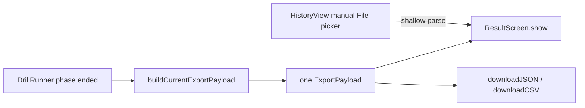

# WP-48（暫用編號）— Local History Foundation

> Stage 10 的第一個 Work Package。上層規格：[../README.md](../README.md)。
>
> Companion：[task-checklist.md](task-checklist.md) · [progress.md](progress.md)
>
> 本計畫依 `.claude/skills/engineering-planning/SKILL.md` 與其 `design_standards.md`／`tech_spec_template.md` 制定。**本 WP 只建立可靠的本機儲存與讀取地基，不實作歷史瀏覽頁、趨勢圖或 3D replay。**

| | |
|---|---|
| **Problem** | 現有 browser runtime 只能用 `<a download>` 匯出 JSON；`HistoryView` 也只能人工選檔，無法自動寫入或掃描專案固定資料夾 |
| **Outcome** | 完成一場 Assessment 後，同一份 `ExportPayload` 會由本機 Node API 原子保存；重啟後可透過 typed API 列出並載入。Practice 不持久化，保留當次結果與手動匯出 |
| **Primary users** | Participant 本人、研究員；prototype 無登入／權限隔離 |
| **Runtime** | Node 20（CI 現況）+ Vite 6 + TypeScript；browser 不得 import `node:*` |
| **Default root** | `<repo>/data/session-history/`（T0 最終凍結） |
| **Scale target** | 最多 5,000 個 run JSON、單檔最多 16 MiB；現有 8 份 fixture 最大約 1.18 MiB |
| **Estimate** | 9–14 dev-days（T0～T5 + T-exit） |
| **Risk** | High：filesystem containment、原子寫入、跨 browser/Node 邊界、完成流程的非同步失敗 |
| **Status** | 🟡 T0～T5 完成(filesystem PoC 綠燈、OQ-48.1／48.2 已凍結;單一 parseExportPayload/canonicalExportJSON 契約落地;`HistoryRepository` 落地含 5,000-run benchmark;Node History API + Vite dev/preview adapter 落地,六 routes 契約測試全綠;typed `HistoryClient` + `HistoryPersistence` state machine 落地,含 generation-race/retry-existing/unhandled-rejection 測試;`main.ts` completion 接線 + `HistorySaveStatus` UI 落地,同一 payload render+save,3 條真實 temp-root E2E 綠燈,既有 36 條 E2E 零回歸),T-exit 尚未開始 |

---

## 0. Repository-grounded discovery（2026-08-27）

### 0.1 現有流程



讀碼結論：

1. `src/main.ts` 的 render loop 在 `drillRunner.phase === 'ended'` 後，以 `resultShown` 保證只執行一次；它先 `await buildCurrentExportPayload()`，再用**同一個 payload**計算 diagnosis、history summary、metrics 並顯示 Result Screen。自動保存應接在此 payload seam，不得重新 snapshot 或第二次 build。
2. `buildCurrentExportPayload()` 位於 render-loop 外的 cold path；新增 HTTP 儲存不得進入 sim tick，也不得改 `DrillRunner`／`SimLoop`／`SharedState`。
3. 現有 `downloadJSON()` 只建立 Blob 與 `<a download>`，無法指定 `<repo>/data/session-history/`。
4. `sessionHistoryLoader.ts` 的 `isExportPayload()` 只檢查 `meta` 是 object、`ticks/events` 是 array，不能作為 filesystem trust boundary 的完整 runtime validator。
5. `collectMeta()` 會驗證新產生 metadata，但讀入磁碟 JSON 時不會經過它；Node repository 需要一個接受 `unknown` 的單一 runtime parser。
6. `meta.assessment !== undefined` 是現有 Assessment 判定；缺席即 Practice。新範圍只封存 Assessment，因此 Practice 缺少 `meta.session.participantId` 不再需要新增 Participant context UI；repository／API 仍須在推導路徑前拒絕 Practice。
7. 現有 `vite.config.ts` 已使用 Node `ServerResponse` 與 `configureServer`／`configurePreviewServer` middleware，是 prototype Node API 的既有先例；CI 鎖 Node 20。
8. `tsconfig.json` 只 include `src`，Vitest 只收 `src/**/*.test.ts` 與 `tests/**/*.test.ts`。新增 `server/` 後必須有明確 Node typecheck boundary，不能只靠 Vite runtime transpile。
9. CodeGraph blast radius 顯示 `buildCurrentExportPayload()` 只由 `src/main.ts` 的兩個 export action 呼叫，且沒有直接 covering test；`ResultScreen` 有 component tests，但 `main.ts` completion wiring 無直接單元測試。T5 因此是 cross-module Medium/High risk，必須以 service seam + E2E 補足。

### 0.2 目前工作樹注意事項

制定本計畫時 `src/main.ts` 已有使用者／其他工作留下的未提交修改（WP-47 `loadSceneById()` guard 位置調整）。WP-48 規劃沒有修改它。未來 T5 開工前必須重新跑 CodeGraph impact 並確認該變更已提交或有明確 owner；不得覆蓋或夾帶。

---

## 1. 需求壓縮（Requirements）

### 1.1 Functional Requirements

| ID | Requirement |
|---|---|
| **FR-48.1** | 系統**必須**在一場具有 `meta.session.participantId` 的 Assessment 結束後，自動嘗試保存該次結果使用的同一份 `ExportPayload`。 |
| **FR-48.2** | 系統**必須**把成功保存的 run 放入 `Participant ID → 完全相同 drillId → startedAt` 對應的專案內固定目錄，且 JSON metadata 保持權威。 |
| **FR-48.3** | 系統**必須**在 Node API 重啟後，只從 JSON 重建 Participant、drill 與 run summary 索引，不依賴 browser memory、IndexedDB 或不可重建的資料庫。 |
| **FR-48.4** | 系統**必須**提供 health、save run、list participants、list drills、list runs 與 load run 的 typed HTTP 契約，供 WP-49／WP-50 使用。 |
| **FR-48.5** | 系統**必須**以 deterministic `runId` 處理重送：相同 identity 與相同 canonical content 回傳 `existing`；相同 identity 但不同 content 回傳 conflict，不得覆寫。 |
| **FR-48.6** | 系統**必須**拒絕 history root 外的讀寫、path traversal、absolute path、separator injection、symlink escape 與不合法／超過大小限制的 payload。 |
| **FR-48.7** | 系統**必須**用同目錄 temporary file + atomic publication 保存 JSON；掃描與列表不得看到半份檔案。 |
| **FR-48.8** | 系統**必須**在 Result Screen 顯示 `saving`、`saved`、`failed` 或 `excluded: practice` 狀態；失敗時允許 retry，且既有手動 Download JSON 保持可用。 |
| **FR-48.9** | 系統**必須**在 Practice submission 或 Assessment 的 Participant ID 缺失時，以不同錯誤拒絕歷史保存；不得建立 temporary／final file，也不得捏造 `unknown`／`anonymous` 身分。 |
| **FR-48.10** | 系統**必須**讓 browser code 只透過 `HistoryClient` 存取 API；browser bundle 不得包含 `node:fs`、`node:path`、history root 或任意 filesystem path。 |
| **FR-48.11** | 系統**必須**把 corrupt／unsupported JSON 從正常索引排除，並在 health/index report 回報數量與不含絕對路徑的診斷。 |

### 1.2 Non-functional Requirements

| ID | Requirement / measurable gate |
|---|---|
| **NFR-48.1** | API request body hard limit = **16 MiB**；超過回 `413 PAYLOAD_TOO_LARGE`，且不得建立 temporary/final file。 |
| **NFR-48.2** | 支援 **5,000 run files** 的 prototype dataset；warm in-memory index 的 participants／drills／runs endpoint，在本機 acceptance fixture 上 P95 < **100 ms**。 |
| **NFR-48.3** | 由 5,000 個 summary-sized fixture 重建 index 的 cold start < **10 s**；若真實 payload 解析使門檻失敗，T2 必須記錄量測並引入可重建 summary cache，不得改用不可重建 DB。 |
| **NFR-48.4** | 對 ≤ **4 MiB** payload，save endpoint 的本機 P95 < **1,000 ms**（20 次、排除第一次 warm-up），且 Result metrics 在 payload 建好後不等待 save 成功才 render。 |
| **NFR-48.5** | Node API 只接受 loopback／same-origin prototype traffic；不得設定 permissive `Access-Control-Allow-Origin: *`。 |
| **NFR-48.6** | 100% filesystem mutation tests 使用明確 temporary root；test/CI 不得在真實 `data/session-history/` 建立、修改或刪除 JSON。 |
| **NFR-48.7** | `npm run build` 必須同時 typecheck browser 與 Node boundary；`npm run test:ci` 必須涵蓋 repository/API/client tests 與至少一條 auto-save Playwright flow。 |
| **NFR-48.8** | 保存失敗不得產生 unhandled rejection、不得停止 render loop、不得阻止 Result Screen 的 metrics／diagnosis 顯示。 |

### 1.3 Constraints

- 技術棧維持 Vite 6、TypeScript、Vitest、Playwright；不引入 application database。
- Node 版本以 CI 的 Node 20 為最低支援版本。
- JSON 必須仍是 source of truth；index/cache 必須可刪除後重建。
- 保留既有 `ExportPayload` 的 `meta + ticks + events` 語意與 Download JSON/CSV 功能。
- 不修改 sim hot path、fixed-step 時鐘、determinism、metrics 或 Assessment compatibility 語意。
- production data 不進 git；repo 只追蹤資料夾說明／placeholder。
- WP-48 不提供 delete、rename、annotation、趨勢、歷史頁或 replay。

### 1.4 Assumptions

- 一次只會有一個 Node History API process 擁有同一個 history root；第二個 process 必須因 root lease 失敗而不可寫。
- 現行 `schemaVersion: 2` 是 WP-48 正常索引的最低契約；舊版或未知 schema 可保留在磁碟，但標記 unsupported，不進正常清單。
- Practice payload 仍是合法 `ExportPayload`，供當次 Result Screen 與手動 JSON／CSV 匯出使用；「是否可封存」是 repository/API policy，不應污染共用 parser。

### 1.5 Open Questions

| ID | Question | Recommended default | Owner | Deadline | Impact if unresolved |
|---|---|---|---|---|---|
| **OQ-48.1** | Node API 採獨立 process 還是 Vite dev/preview middleware？ | **Vite plugin middleware**：現有 `vite.config.ts` 已有同型先例，無需新增 process orchestrator；這是 local prototype 妥協 | 使用者／架構師 | T0 exit、T3 前 | 決定 package scripts、preview/E2E 啟動方式與 deployment debt |
| **OQ-48.2** | history root 是否正式凍結為 `data/session-history/`？ | 是；test 只可由 server factory 注入 temporary root，browser UI 無路徑輸入 | 使用者 | T0 exit、T2 前 | 決定路徑契約、`.gitignore` 與操作文件 |
| **OQ-48.3** | invalid/corrupt 檔案在 WP-49 UI 如何呈現？ | WP-48 先從正常索引排除並回報 count；詳細 quarantine UI 延至 WP-49 | WP-49 owner | WP-49 T0 | 不阻塞 WP-48；影響後續 researcher diagnostics |

**T0 決議（2026-08-27）**：OQ-48.1／OQ-48.2 已由使用者確認採用推薦預設（見 [progress.md](progress.md) D-48.P8／D-48.P9 與 T0 PoC 證據）。OQ-48.3 維持 deferred to WP-49 T0。

---

## 2. 系統架構與設計（Technical Design）

### 2.1 System boundary

#### In scope

```text
src/data/exportPayloadSchema.ts       NEW    unknown → ExportPayload runtime parser + canonical JSON
src/history/contracts.ts              NEW    browser/server 共用 HTTP DTO（pure TS，無 Node/DOM side effects）
server/history/HistoryRepository.ts   NEW    root containment、index、atomic save、load/list
server/history/historyApi.ts          NEW    Node HTTP middleware / route dispatcher
server/history/historyPlugin.ts       NEW    Vite dev + preview adapter（OQ-48.1 default）
src/history/HistoryClient.ts          NEW    typed fetch client
src/history/HistoryPersistence.ts     NEW    save/retry state machine，避免 main.ts 含 HTTP 細節
src/ui/HistorySaveStatus.ts           NEW    saving/saved/failed/excluded presentation
src/main.ts                           MODIFY completion seam 接線；同一 payload render + persist
src/ui/ResultScreen.ts                MODIFY 接受 save-status element；不負責 HTTP
src/data/sessionHistoryLoader.ts      MODIFY 改用同一 runtime parser，移除 shallow second definition
vite.config.ts                        MODIFY mount history plugin（dev + preview）
tsconfig.node.json                    NEW    server/config Node typecheck boundary
package.json / package-lock.json      MODIFY scripts/typecheck + 必要 Node typings
.gitignore                            MODIFY 忽略真實 run JSON、保留資料夾說明
tests/history/*                       NEW    repository/API integration tests
tests/e2e/history-persistence.spec.ts NEW    browser → API → temp root E2E
```

上述為 planning-time target；每個 task 開工前仍須以 CodeGraph impact／current worktree 重新確認，尤其 `src/main.ts` 與 `ResultScreen.ts`。

#### Out of scope

- Participant／Drill／Run 歷史頁、breadcrumb、搜尋與趨勢圖（WP-49）。
- 3D replay schema audit 或播放器（WP-50）。
- delete／rename／edit／annotation API。
- authentication、authorization、encryption、cloud sync、LAN remote access。
- durable database、不可重建 index、背景 file watcher。
- 改寫現有 metrics、diagnosis、quality gate、DrillRunner 或 SimLoop。

### 2.2 Data flow

```mermaid
sequenceDiagram
    participant Sim as Existing drill/render flow
    participant Main as main.ts completion seam
    participant Result as ResultScreen + SaveStatus
    participant Client as HistoryPersistence / HistoryClient
    participant API as Node History API
    participant Repo as HistoryRepository
    participant FS as data/session-history

    Sim->>Main: phase becomes ended once
    Main->>Main: await buildCurrentExportPayload()
    Main->>Result: show metrics/diagnosis from same payload
    alt Assessment
    Main->>Client: save(payload)
    Client-->>Result: state = saving
    Client->>API: POST /api/history/runs
    API->>Repo: saveRun(parsed payload)
    Repo->>FS: write *.tmp, fsync/close, atomic publish *.json
    Repo-->>API: created | existing | conflict
    API-->>Client: typed response/error
    Client-->>Result: saved | failed(retry available)
    else Practice
    Main->>Client: classify payload without HTTP request
    Client-->>Result: excluded: practice; manual export remains available
    end
```

關鍵順序：Result metrics 不等待 disk I/O；但 `HistoryPersistence` 持有完成時的 immutable payload reference/canonical bytes，retry 不得重新 snapshot 新一場 run。

### 2.3 Disk layout and identity

```text
data/session-history/
└── P-001--{participantHash10}/
    └── counterstrafe_reversal_v1--{drillHash10}/
        └── 2026-08-27T14-32-11.321Z_assessment_{runId12}.json
```

- 目錄 segment = readable sanitized prefix + 原始 UTF-8 值 SHA-256 前 10 字元，避免 `A/B` 與 `A_B` collision。
- `runIdentity = schemaVersion + "\0" + participantId.trim() + "\0" + drillId + "\0" + normalizedStartedAt`。
- `runId = SHA-256(runIdentity)` 的 base64url 或 hex 固定長度表示；不得使用絕對檔案路徑。
- repository 在推導 identity／目錄前要求 `meta.assessment !== undefined`；Practice 回傳 not-archivable error，不產生 history identity 或路徑。
- final JSON 內容使用共用 canonical serializer；identity 相同時，以 canonical content hash 判斷 `existing` 或 `conflict`。
- list/load 只信 parser 後 metadata；路徑與 metadata 推導結果不一致即 invalid。

### 2.4 Interface contracts

#### Runtime parser

```ts
export interface ExportPayloadParseError {
  readonly path: string;
  readonly code: 'invalid_type' | 'invalid_value' | 'unsupported_schema' | 'non_finite';
  readonly message: string;
}

export type ExportPayloadParseResult =
  | { readonly ok: true; readonly payload: ExportPayload }
  | { readonly ok: false; readonly errors: readonly ExportPayloadParseError[] };

export function parseExportPayload(value: unknown): ExportPayloadParseResult;
export function canonicalExportJSON(payload: ExportPayload): string;
```

Parser 必須驗證 schema v2 metadata、所有 tick 與 event discriminants、有限數值與陣列形狀；成功結果要重建成 canonical property order。Parser 必須接受合法 Practice，因其仍供當次 Result／手動匯出使用；repository 才套用 Assessment-only 封存政策。`sessionHistoryLoader` 與 Node repository 必須共用此 parser，禁止保留 shallow `isExportPayload()` 第二定義。

#### Shared DTOs

```ts
export type HistoryReplaySupport = 'unchecked'; // WP-50 才升級 full/partial/unsupported

export interface HistoryRunSummary {
  readonly runId: string;
  readonly participantId: string;
  readonly drillId: string;
  readonly startedAt: string;
  readonly schemaVersion: number;
  readonly suspect: boolean;
  readonly byteLength: number;
  readonly replaySupport: HistoryReplaySupport;
}

export interface HistoryParticipantSummary {
  readonly participantId: string;
  readonly drillCount: number;
  readonly runCount: number;
  readonly latestStartedAt: string;
}

export interface HistoryDrillSummary {
  readonly drillId: string;
  readonly runCount: number;
  readonly latestStartedAt: string;
}

export type SaveHistoryRunResult =
  | { readonly disposition: 'created' | 'existing'; readonly run: HistoryRunSummary }
  | { readonly disposition: 'conflict'; readonly runId: string };
```

#### Repository

```ts
export interface HistoryIndexReport {
  readonly validRunCount: number;
  readonly invalidFileCount: number;
  readonly unsupportedFileCount: number;
  readonly excludedPracticeFileCount: number;
  readonly rebuiltAt: string;
}

export interface HistoryRepository {
  initialize(): Promise<HistoryIndexReport>;
  saveRun(payload: ExportPayload): Promise<SaveHistoryRunResult>;
  listParticipants(): readonly HistoryParticipantSummary[];
  listDrills(participantId: string): readonly HistoryDrillSummary[];
  listRuns(participantId: string, drillId: string): readonly HistoryRunSummary[];
  loadRun(runId: string): Promise<ExportPayload | undefined>;
  close(): Promise<void>;
}

export function createHistoryRepository(options: {
  readonly root: string;
  readonly maxPayloadBytes: number;
  readonly now?: () => Date;
}): HistoryRepository;
```

Repository constructor 接受 server-side absolute root；HTTP request 與 browser DTO 永遠不包含 root/path。

#### HTTP responses

```ts
export type HistoryApiErrorCode =
  | 'MALFORMED_JSON'
  | 'PAYLOAD_TOO_LARGE'
  | 'INVALID_EXPORT'
  | 'UNSUPPORTED_SCHEMA'
  | 'PRACTICE_NOT_ARCHIVABLE'
  | 'MISSING_PARTICIPANT'
  | 'RUN_NOT_FOUND'
  | 'RUN_CONFLICT'
  | 'HISTORY_ROOT_LOCKED'
  | 'STORAGE_IO'
  | 'HISTORY_UNAVAILABLE';

export interface HistoryApiErrorBody {
  readonly ok: false;
  readonly error: {
    readonly code: HistoryApiErrorCode;
    readonly message: string;
    readonly details?: readonly { readonly path: string; readonly code: string }[];
  };
}

export interface HistoryApiSuccess<T> {
  readonly ok: true;
  readonly data: T;
}
```

| Method | Route | 2xx body | Expected errors |
|---|---|---|---|
| GET | `/api/history/health` | `HistoryApiSuccess<HistoryIndexReport>` | 423 root locked；503 root unavailable |
| POST | `/api/history/runs` | `HistoryApiSuccess<SaveHistoryRunResult>`; created=201, existing=200 | 400/409/413/422/423/500/503 |
| GET | `/api/history/participants` | `HistoryApiSuccess<readonly HistoryParticipantSummary[]>` | 503 |
| GET | `/api/history/participants/:participantId/drills` | `HistoryApiSuccess<readonly HistoryDrillSummary[]>` | 400/503 |
| GET | `/api/history/participants/:participantId/drills/:drillId/runs` | `HistoryApiSuccess<readonly HistoryRunSummary[]>` | 400/503 |
| GET | `/api/history/runs/:runId` | `HistoryApiSuccess<ExportPayload>` | 400/404/422/503 |

API error message 不得曝露 history root、Windows user profile 或 absolute path。

#### Browser client and persistence state

```ts
export interface HistoryClient {
  health(signal?: AbortSignal): Promise<HistoryIndexReport>;
  saveRun(payload: ExportPayload, signal?: AbortSignal): Promise<SaveHistoryRunResult>;
  listParticipants(signal?: AbortSignal): Promise<readonly HistoryParticipantSummary[]>;
  listDrills(participantId: string, signal?: AbortSignal): Promise<readonly HistoryDrillSummary[]>;
  listRuns(participantId: string, drillId: string, signal?: AbortSignal): Promise<readonly HistoryRunSummary[]>;
  loadRun(runId: string, signal?: AbortSignal): Promise<ExportPayload>;
}

export type HistorySaveState =
  | { readonly kind: 'idle' }
  | { readonly kind: 'excluded'; readonly reason: 'practice' }
  | { readonly kind: 'saving'; readonly runKey: string }
  | { readonly kind: 'saved'; readonly run: HistoryRunSummary; readonly disposition: 'created' | 'existing' }
  | { readonly kind: 'failed'; readonly message: string; readonly retryable: boolean };

export interface HistoryPersistence {
  readonly state: HistorySaveState;
  save(payload: ExportPayload): Promise<HistorySaveState>;
  retry(): Promise<HistorySaveState>;
  subscribe(listener: (state: HistorySaveState) => void): () => void;
}
```

`HistoryClient` 預設 request timeout = 5 s；timeout、network error 與 5xx 轉為 retryable，422/409 轉為 non-retryable。`HistoryPersistence.save()` 看到 Practice 時直接回 `excluded`，不得送 HTTP request；API／repository 仍以 `PRACTICE_NOT_ARCHIVABLE` 防禦直接 submission。Persistence 只保留最近一次失敗的 Assessment payload 供 retry；新 run 開始時明確 reset，不能錯存上一輪。

### 2.5 Failure modes

| ID | Trigger | Impact | Handling strategy | Covered by |
|---|---|---|---|---|
| **FM-48.1** | `../`、absolute path、encoded separator 或 symlink 指向 root 外 | 任意檔案讀寫／資料外洩 | request 不接受 path；segment 由 metadata 推導；每次 I/O 前 resolve + realpath containment；拒絕並記錄 safe code | T2 unit tests |
| **FM-48.2** | process crash／disk full 發生在寫入中 | 半份 JSON 進正常索引 | 同目錄 `.tmp` 寫入、flush/close 後 atomic publish；scanner 忽略 tmp；下次啟動清理已逾期 tmp | T2 integration tests |
| **FM-48.3** | 同一 run 被 double click／retry／兩 request 同時送出 | duplicate 或靜默覆寫 | repository mutation queue + deterministic identity；same content=`existing`，different=`409` | T2/T3 concurrency tests |
| **FM-48.4** | dev 與 preview 同時使用同一 root | 兩個 process 競爭寫入 | root lease file；第二 owner health=503/locked；Playwright 的兩 server 使用不同 temp roots | T2/T3 + E2E config |
| **FM-48.5** | JSON 可 parse 但 tick/event/meta 欄位錯誤或非有限數 | 後續 metrics/replay crash 或污染索引 | 單一 strict parser；422；既有 corrupt file 排除並計數 | T1/T2 tests |
| **FM-48.6** | API 未啟動、timeout、permission denied | run 未保存 | Result 仍顯示；save status=`failed`；retry + Download JSON fallback；無 unhandled rejection | T4/T5 tests |
| **FM-48.7** | Practice 被 completion wiring 或直接 API submission 送進 history | 產生不在產品範圍內、可能無 Participant ID 的歷史資料 | client short-circuit=`excluded`；API/repository defense-in-depth 回 `422 PRACTICE_NOT_ARCHIVABLE`；零 temporary/final file；當次 Result／手動匯出不受影響 | T2/T3/T4/T5 |
| **FM-48.8** | startup 遇到 corrupt／unsupported／legacy Practice file | 整個 API 無法啟動或 Practice 混入歷史 | 單檔隔離；正常 Assessment 仍建索引；health 分別回 invalid/unsupported/excluded-Practice count，不曝露 absolute path | T2 tests |
| **FM-48.9** | T5 又呼叫 `buildCurrentExportPayload()` 或 recorder 已 reset | 保存內容與 Result metrics 不同 | completion seam 只 build 一次並把同一 payload 傳給 Result + HistoryPersistence；E2E 比對 runId/meta/tick/event counts | T5/E2E |
| **FM-48.10** | async save rejection 從 render-loop IIFE 逸出 | console unhandled rejection、session runner 卡住 | HistoryPersistence 吃掉並轉 state；session progression 與保存結果解耦；service unit test 驗證 rejection | T4/T5 |

### 2.6 Concurrency model

- **Owner model**：一個 Node process 取得一個 history root lease；無跨 process shared mutable index。
- **Mutation model**：`saveRun()` 進單一 Promise queue，確保 identity check、temp write、atomic publish、index swap 的順序一致。WP-48 預期寫入頻率低（每個 drill 結束一次），全域 single-writer 不是吞吐瓶頸。
- **Read model**：list endpoints 讀 immutable index snapshot，可並行；成功 publish 後建立新 snapshot 並一次替換 reference。
- **Filesystem visibility**：scanner 只認 `.json` final files；`.tmp` 與 lock file 永不進 index。
- **Browser model**：每個 completed run 只允許一個 active save promise；retry 共用原 payload。`AbortSignal` 取消 fetch 只影響 client wait，不可中止已開始的 atomic repository commit。
- **Shutdown**：plugin/server close 時停止接新 mutation、await queue、釋放 root lease；超時由 process termination 留給下次 stale-lease recovery 規則處理。

---

## 3. 風險分析（Risk Analysis）

### 3.1 Risk register

| Risk | Level | Evidence / blast radius | Mitigation |
|---|---|---|---|
| Runtime parser 成為第二份 schema 真相 | High | 現有 shallow `isExportPayload` 與 `collectMeta` 分離 | T1 建單一 parser，舊 loader 改用它；schema fixtures + negative matrix |
| Filesystem escape／partial write／collision | High | 新能力、現有 repo 無寫檔先例 | T0 PoC + T2 containment/atomic/concurrency tests；API 不接受 path |
| Completion seam 回歸 | High | `main.ts` result path 無 direct covering test，且目前工作樹已有未提交變更 | T5 前 impact/rebase gate；抽 service；E2E 對同一 payload；不改 sim |
| Vite middleware 只適合 local prototype | Med／Technical debt | 現有產品無 standalone backend build | 明文限制 loopback；當需要 packaged app、LAN 或 production deployment 時抽出同一 `historyApi` handler 到獨立 process |
| Startup full scan 隨 JSON 數量放大 | Med／Technical debt | JSON 是 source of truth；5,000 檔可能有冷 I/O | 先量測；超過 10 s 才加可重建 summary cache；不在 WP-48 引 file watcher/DB |
| Assessment-only policy 漏到 parser 或只做前端判斷 | Med | Practice 仍是合法匯出 payload；API 可能被直接呼叫 | parser 保持 mode-neutral；client short-circuit + repository/API defense-in-depth；負向測試證明零檔案 |
| Personal data 被 commit | Med | history root 位於 repo 下 | `.gitignore` 預設忽略 JSON；tracked README 說明；T-exit 檢查 staged files 無真實 run |

### 3.2 Conscious technical debt

1. **Vite-hosted Node API（推薦預設）**：為 prototype 省去第二個 build/process orchestrator。觸發重構條件：需要離開 Vite dev/preview、需要 packaged desktop、需要 LAN、多 process 或權限隔離。
2. **Startup scan + memory index**：沒有 persistent DB/file watcher。觸發重構條件：5,000 檔 cold rebuild ≥10 s，或 root 需要被外部工具持續寫入。
3. **單一 writer queue**：犧牲寫入吞吐換取簡單一致性。觸發重構條件：實測 save queue P95 ≥1 s，或一次要批次 ingest 大量 runs。

### 3.3 Performance bottlenecks

- JSON parse/canonicalize 是 save 與 cold scan 的主要 CPU／memory 峰值；16 MiB hard limit 控制單 request。
- `loadRun` 回傳完整 ticks/events，不能用於列表；列表只回 summary DTO。
- cold scan 若每次讀完整 JSON，5,000 檔可能受磁碟支配。T2 benchmark 決定是否建立 sidecar summary cache；cache 必須可刪除重建。

---

## 4. 任務拆解（Task Breakdown）

| Task | Objective | Dependencies | Risk | Complexity | Definition of Done |
|---|---|---|---|---|---|
| **T0** | Entry gate + Node/fs PoC + 凍結 OQ-48.1～2 | None | High | 0.5–1d | containment、atomic publish、root lease PoC 在 workspace temp root 通過；兩個 blocking OQ 寫入 progress，OQ-48.3 記錄 deferred；baseline tests 記錄 |
| **T1** | 單一 ExportPayload runtime parser／canonical contract | T0 | High | 1.5–2d | 現有 8 fixtures 全部 parse；negative matrix 全拒絕；`sessionHistoryLoader` 移除 shallow guard；typecheck/Vitest 綠 |
| **T2** | ProjectFolderHistoryRepository | T1 | High | 2–3d | save/list/load/rebuild/idempotency/conflict/containment/atomic/lease/corrupt isolation tests 全綠；5,000 summary benchmark 達 NFR 或有 evidence-backed cache decision |
| **T3** | Node History API + Vite dev/preview adapter | T2 | High | 1.5–2.5d | 六 endpoint contract tests、16 MiB/loopback/error redaction、dev+preview temp roots、Node typecheck 與 build 綠 |
| **T4** | Typed HistoryClient + HistoryPersistence state machine | T3 | Med | 1–1.5d | success/existing/conflict/422/timeout/5xx/retry/abort tests；browser bundle 無 `node:*`；無 unhandled rejection |
| **T5** | Assessment-only auto-save、Result save status 與 completion wiring | T4 | High | 1.5–2.5d | 同一 Assessment payload render+save；Practice 顯示 excluded、零 POST／零檔案且 Result/download 可用；missing-ID、retry/download fallback、session progression zero-regression 的 unit/E2E 證據 |
| **T-exit** | WP-48 acceptance + handoff to WP-49/WP-50 | T1～T5 | Med | 0.5–1d | FR/NFR matrix 全有證據；`npm run test:ci`/build/Node typecheck 綠；restart rebuild；真實 history root 零 test artifacts；文件/graph 對帳 |

Task 詳細步驟與 task-local DoD 見同資料夾的 `T*.md`。

### 4.1 Requirements traceability

| Requirement | Tasks | Verification |
|---|---|---|
| FR-48.1／2 | T2, T5 | repository integration + Assessment auto-save E2E |
| FR-48.3 | T2, T-exit | close/reopen rebuild test |
| FR-48.4 | T3, T4 | API contract + client tests |
| FR-48.5 | T2, T3 | same/different content concurrency tests |
| FR-48.6／7 | T0, T2, T3 | containment/size/atomic/lease negative matrix |
| FR-48.8／9 | T2～T5 | save-status/service tests + Practice zero-write/API rejection + missing participant E2E |
| FR-48.10 | T3, T4, T-exit | Node typecheck boundary + build bundle inspection |
| FR-48.11 | T1, T2 | corrupt/unsupported rebuild report tests |
| NFR-48.1／5 | T3 | 16 MiB + loopback contract tests |
| NFR-48.2／3／4 | T2, T5, T-exit | benchmark fixtures + result non-blocking assertion |
| NFR-48.6／7／8 | 全 tasks, T-exit | temp-root guard、CI/build、unhandled rejection test |

---

## 5. Exit boundary / WP-49 handoff

WP-48 完成時，WP-49 可以只依賴下列穩定面，不需知道磁碟路徑：

- `HistoryClient.listParticipants()`
- `HistoryClient.listDrills(participantId)`
- `HistoryClient.listRuns(participantId, drillId)`
- `HistoryClient.loadRun(runId)`
- `HistoryRunSummary` 與 typed error codes

WP-48 **不**承諾 metric summaries、trend eligibility 或 replay support 判定；`replaySupport: 'unchecked'` 是刻意佔位，WP-50 audit 後才升級。

---

## 6. Execution rules

- 一個 task = 一個垂直切片 = 一個原子 commit；未驗證、未更新 progress 不開下一 task。
- 每次要修改既有 symbol 前執行 CodeGraph impact，先記錄 local/cross-module blast radius。
- filesystem tests 只能使用已 resolve 且驗證位於 workspace test temp root 的目錄；不得碰真實 history root。
- T5 開工前先處理／確認現有 `src/main.ts` dirty change owner，禁止覆蓋使用者變更。
- 程式碼修改後執行 `graphify update .`；T-exit 檢查 CodeGraph pending files 與 git staged names。
