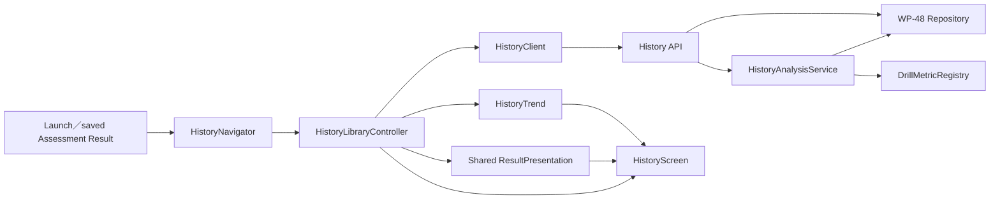
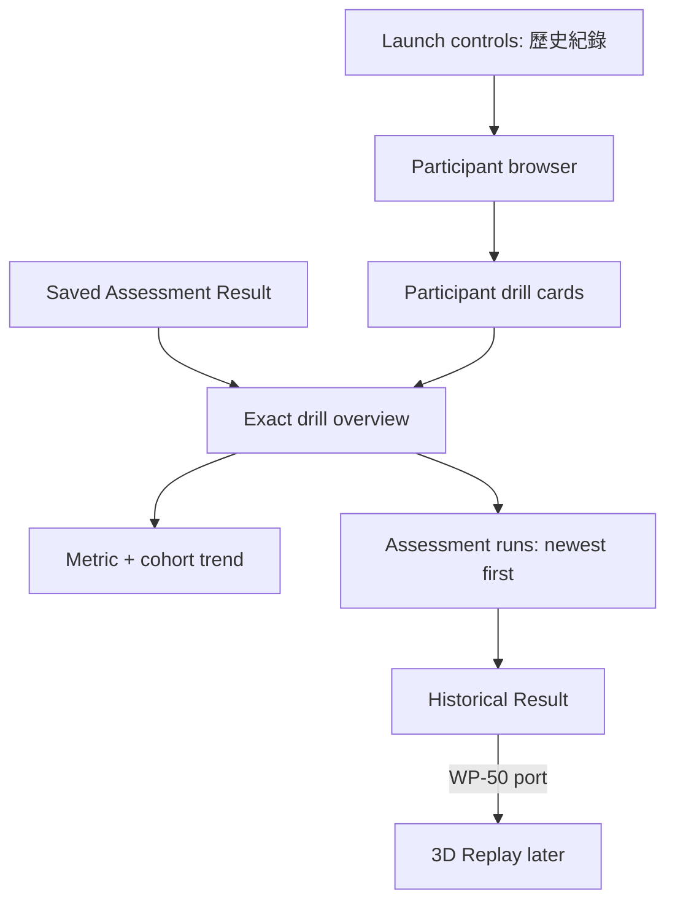

# WP-49（暫用編號）— History Library and Assessment Trends

> Stage 10 的第二個 Work Package。上層規格：[../README.md](../README.md)；資料／API 地基依賴 [WP-48](../wp-48-local-history-foundation/README.md)。
>
> Companion：[task-checklist.md](task-checklist.md) · [progress.md](progress.md)
>
> 本計畫依 `.claude/skills/engineering-planning/SKILL.md`、`design_standards.md` 與 `tech_spec_template.md` 制定。**本 WP 建立 Assessment-only 歷史瀏覽、歷史結果與趨勢；不實作 3D replay player。**

| | |
|---|---|
| **Problem** | 現有 `HistoryView` 只是 Result Screen 內的多檔 JSON picker；沒有 Participant／drill／run library、browser navigation、完整歷史結果頁或可擴充趨勢模型 |
| **Outcome** | Participant 與研究員可從應用內依 `Participant ID → exact drillId → startedAt desc` 瀏覽 Assessment，開啟歷史結果，並查看同 drill 的相容成績變化 |
| **Primary users** | Participant 本人、研究員；prototype 無登入與角色權限隔離 |
| **History policy** | 只有 Assessment 可持久化與瀏覽；Practice 不出現在任何歷史 route、清單、結果或趨勢 |
| **Runtime** | TypeScript + Vite + 純 DOM/SVG；透過 WP-48 `HistoryClient` 存取本機 Node API |
| **Scale target** | 5,000 個 Assessment run summaries；單一 drill 可有數百至數千 runs，列表與分析必須分頁／漸進載入 |
| **Estimate** | 10–16 dev-days（T0～T5 + T-exit） |
| **Risk** | High：新 navigation state、歷史／當前 Result 共用、metric 語意與大量 payload 分析 |
| **Status** | 🟡 **T0 完成（2026-08-27）**：handoff 對帳零 mismatch、route/Result-seam/100-run projection 三個 PoC 皆有實測證據、baseline `test:ci` 綠燈、production diff=0。OQ-49.1～5 已與使用者收斂（詳見 [progress.md](progress.md)）：僅註冊 `spider-shot-v2`（peek-click-transfer 需另立跨 WP 決定；`spider-shot-v2` metric descriptor 待 T4 前由研究設計 owner 定義）、latest-eligible cohort 預設+selector、T3 移除人工 picker、cursor 分頁漸進趨勢、Participant 頁只顯示分類 count。T1 可開始 |

---

## 0. Repository-grounded discovery（2026-08-27）

1. `createHistoryView()` 目前只接受 browser `File`，並嵌在 `ResultScreen`；它沒有 API、Participant、drill、run 或 route 概念。
2. `src/main.ts` 以 `currentHistorySession` + `loadAssessmentSessionSummaries()` 計算當前 Assessment 的 recent baseline；Practice 已被 loader 排除，但 UI 仍顯示「選取過去 JSON」。WP-49 完成後這條人工 picker path 應退場或明確降級，不能和正式 history library 並存成兩套真相。
3. 應用目前沒有通用 router。literal search 只找到 dev-only `#pattern`；沒有 `pushState`／`popstate`。WP-49 必須建立 namespaced history navigation，不能用互相 `display:none` 的 ad-hoc callback 取代 URL state。
4. `ResultScreen` 是 modal overlay，內部直接建立完整結果 DOM，action callbacks 綁定當前 run。歷史 run 若直接重用同一 instance，可能錯誤 restart／匯出當前 run；需先抽出 read-only result presentation seam。
5. `sessionSummaryFromPayload()`、`historyMetricsFor()`、`qualityGateStatusFor()` 位於 `main.ts`。其中 history metric mapping 只支援 `hold-click` 與 `hold-track`，未知 drill 會 throw；這些 domain rules 不應繼續留在 composition root。
6. `SessionSummary`／`buildSessionHistory()` 固定為 speed + accuracy 與 recent-window median，不足以表達每 drill 不同指標或完整時間序列。
7. 現有 `CompatibilityKey` 已包含 Participant、exact task/drill、protocol、movement、weapon、sensitivity/FOV、target cell、feedback policy與 quality status，可重用為趨勢 cohort 基礎；但 cohort 必須先移除 `qualityGateStatus`，再把 quality當獨立eligibility gate，否則 suspect run會被誤認成另一種測試條件。
8. WP-48 handoff 的 `HistoryRunSummary` 刻意不含 metric／compatibility projection。直接把每個完整 JSON 全載入 browser 才算趨勢，在數百個約 0.6–1.2 MiB payload 時不可接受；WP-49 需要 additive、分頁的 analysis projection endpoint。
9. UI 技術棧只有原生 DOM 與 Three.js，沒有 chart library。MVP 趨勢採可測的 SVG + table fallback，不新增重量級前端框架或 chart dependency。

### 0.1 Planning-time blast radius

- `createHistoryView`：2 個 `main.ts` caller；有 `HistoryView.test.ts`。WP-49 將取代其人工 picker責任，屬 cross-module change。
- `createResultScreen`：2 個 `main.ts` caller；有 component tests。抽 presentation body 會影響 current result 與 historical result，屬 High risk。
- `buildSessionHistory`：2 個 `main.ts` caller；有 domain tests。保留既有 baseline 語意供現有功能，另建 generalized trend domain，避免未經驗證改寫舊 baseline。
- `CompatibilityKey`：9 個 type/function consumers；有完整 tests。WP-49 以 adapter/projector 使用，不直接改 frozen equality field 語意。
- `main.ts` history/result composition 無直接 covering test；T5 必須用 Playwright 補足。

---

## 1. 需求壓縮（Requirements）

### 1.1 Functional Requirements

| ID | Requirement |
|---|---|
| **FR-49.1** | 系統**必須**提供所有使用者都能進入的「歷史紀錄」入口，並在離開時回到原本的 launch 或 current Result context。 |
| **FR-49.2** | 系統**必須**列出有 Assessment 紀錄的 Participant，支援不改寫原值的 case-insensitive substring 搜尋，並顯示 drill 數、run 數與最近時間。 |
| **FR-49.3** | 系統**必須**在 Participant 下只用完全相同 `drillId` 分組；drill 卡顯示 raw exact id、Assessment 數與最近時間，不做 family 合併。 |
| **FR-49.4** | 系統**必須**在 drill overview 同時顯示該 exact drill 的趨勢區與全部 Assessment run list；run list 預設依 `startedAt` 新到舊。 |
| **FR-49.5** | 系統**必須**從 run list 開啟單一歷史 Assessment 的 metrics、diagnosis、quality flags 與下載動作；計算／呈現語意與當前 Result 共用同一 presentation path。 |
| **FR-49.6** | 系統**必須**讓 breadcrumb、UI 返回、Browser Back／Forward 與 reload 對應同一 `Participant → drill → run` route；搜尋、filter、metric／cohort 選擇與 scroll state 必須按規則保存。 |
| **FR-49.7** | 系統**必須**在 browser UI 與 analysis API 兩邊都維持 Assessment-only boundary；Practice 不得出現在 Participant、drill、run、detail 或 trend。 |
| **FR-49.8** | 系統**必須**透過 exact-`drillId` `DrillMetricRegistry` 定義 metric id、label、unit、direction、primary、format 與 payload projector；不得建立跨 drill composite score。 |
| **FR-49.9** | 系統**必須**只把 quality-ok、同 compatibility cohort、同 metric id/unit 且 finite 的 Assessment observations 納入正式趨勢。 |
| **FR-49.10** | 系統**必須**在一個 drill 存在多個 compatibility cohort 時顯示 cohort 選擇與排除原因；不得默默把不相容 runs 混成一條線。 |
| **FR-49.11** | 系統**必須**在 drill 未註冊 metric、資料不足、API unavailable、route not found、個別 projection/load 失敗時提供可行動的 loading／empty／error state，且 run list／breadcrumb 仍可用。 |
| **FR-49.12** | 系統**必須**從剛完成且已保存的 Assessment Result 提供「查看此 Drill 歷史」入口；Practice Result 不顯示歷史入口。 |
| **FR-49.13** | 系統**必須**在 historical run detail 保留一個 typed replay action port，供 WP-50 接入；WP-49 不顯示無作用的 replay button。 |

### 1.2 Non-functional Requirements

| ID | Requirement / measurable gate |
|---|---|
| **NFR-49.1** | 5,000-run fixture 下，warm API 的 Participant／drill／run summary 取得 + 第一批 100 個 DOM row 呈現 P95 < **500 ms**；單次 render long task < **50 ms**。 |
| **NFR-49.2** | analysis projection 每頁最多 **100 observations**；≤100 個、單檔 ≤4 MiB 的 cold page P95 < **2,000 ms**，warm cache P95 < **300 ms**。 |
| **NFR-49.3** | route 改變或 History Screen 關閉後，舊 request 必須在 **100 ms** 內收到 abort；任何晚到 response 不得覆蓋新 route state。 |
| **NFR-49.4** | 一次最多 **4** 個 payload analysis I/O／projector jobs；不得 `Promise.all()` 無界展開整個 drill 的完整 JSON。 |
| **NFR-49.5** | 所有 route、breadcrumb、搜尋、filter、metric/cohort control 與 run action 可只用 keyboard 操作，具 accessible name／focus order；趨勢 SVG 必須有同資料的文字摘要或 table fallback。 |
| **NFR-49.6** | Participant ID、drillId、runId 與 error UI 必須以 `textContent` 或等價安全 DOM API 呈現；不得把 metadata 注入 `innerHTML`。 |
| **NFR-49.7** | History UI 不 import `node:*`、不讀 filesystem path；所有資料只經 typed `HistoryClient`／analysis endpoint。 |
| **NFR-49.8** | `npm run build`、browser/Node typecheck、Vitest 與 history Playwright E2E 全綠；History route 不改變 live sim、pointer lock、Result metrics 或 Assessment persistence。 |

### 1.3 Constraints

- 依賴 WP-48 的 Assessment-only repository/API/client；WP-49 不繞過 `HistoryClient` 讀檔。
- 維持純 TypeScript + DOM UI，不引入 React/Vue/router/chart framework。
- JSON 仍是 source of truth；analysis projection/cache 必須可由 JSON 重建。
- 同一 drill 只以 exact `drillId` 判斷；registry 也採 exact registration，不做 prefix/family fallback。
- 趨勢不改寫既有 `buildSessionHistory()` recent-baseline 語意；新 model 另建並在明確驗證後才取代舊 UI。
- Practice 當次 Result／手動匯出屬 WP-48；WP-49 不為 Practice 建 route 或歷史 entry。
- delete／rename／annotation、權限、雲端、跨 Participant 比較與 3D replay 不在本 WP。

### 1.4 Assumptions

- `startedAt` 儲存與排序用 UTC ISO；UI 顯示 browser local time，同時提供完整 UTC ISO（例如 `title`／detail field）。
- Participant search 在已載入的 compact summaries 上 client-side 執行；不改寫或模糊化 Participant ID。
- 趨勢預設選「最新一筆 quality-ok、registered、finite observation」所屬 compatibility cohort，x 軸由舊到新；run list仍由新到舊。
- 趨勢顯示每 run 原始 metric 值與相鄰 eligible run delta，不做 smoothing、forecast 或跨 metric總分。
- 未註冊 drill 的完整歷史列表與 result仍可用，趨勢區顯示明確 empty state。

### 1.5 Open Questions

| ID | Question | Recommended default | Owner | Deadline | Impact if unresolved |
|---|---|---|---|---|---|
| **OQ-49.1** | MVP 要正式註冊哪些 drill metrics？ | 只註冊現有已有明確 mapping 的 `holdClickV1.drill.drillId`／`holdTrackV1.drill.drillId` exact ids；其他 drill 顯示「尚未設定」，不發明指標 | 使用者／研究設計 owner | T0 exit、T4 前 | 決定 registry fixtures 與 T5 趨勢 acceptance roster |
| **OQ-49.2** | 多 compatibility cohorts 的預設與切換 UX？ | 最新 eligible cohort為預設，提供 cohort selector；每個 cohort 顯示條件摘要與 n | 使用者／UI owner | T0 exit、T5 前 | 決定 route filter shape、空狀態與 E2E |
| **OQ-49.3** | 舊 Result Screen 的人工 JSON HistoryView 是否保留？ | WP-49 T3 移除，避免兩套 history；保留 Download JSON/CSV 作資料攜出，不保留人工 baseline picker | 使用者 | T0 exit、T3 前 | 決定 `HistoryView.ts` 是刪除、redirect 或 temporary fallback |
| **OQ-49.4** | 趨勢是否必須一次載完同 drill 所有 runs？ | 分頁投影並漸進補齊全部資料；首屏先顯示 summaries/最近一頁，UI 明示 `loaded / total` | 架構師／使用者 | T0 exit、T4 前 | 決定 analysis endpoint pagination、cache 與 NFR fixture |
| **OQ-49.5** | WP-48 回報的 invalid／unsupported／excluded-Practice files 在 UI 顯示到什麼程度？ | Participant頁頂端只顯示不阻塞的分類count與說明，不列檔名／路徑、不做quarantine操作 | 使用者／UI owner | T0 exit、T2 前 | 關閉WP-48 OQ-48.3；決定health warning與diagnostic scope |

**T0 決議（2026-08-27）**：OQ-49.1～5 全數收斂（使用者拍板，詳見 [progress.md](progress.md) D-49.P9～P13）。**OQ-49.1 偏離推薦預設**：不採用 hold-click/hold-track，改為只註冊 `spider-shot-v2`（exact drillId `'spider-shot-v2'`）；`peek_click_transfer_pilot_v1` 因 `mode: 'practice'` 結構上無法進入 Assessment-only 歷史邊界（[DECISIONS.md GD-25](../../../DECISIONS.md) 既有決議），需另立跨 WP 決定才能討論納入，非本 WP 範圍。`spider-shot-v2` 目前無既有 metric mapping，其具體 metric descriptor 仍待研究設計 owner 於 T4 開工前定義。OQ-49.2～49.5 採用推薦預設。

---

## 2. 系統架構與設計（Technical Design）

### 2.1 System boundary

#### In scope（planning-time targets）

```text
src/history/contracts.ts                         MODIFY WP-49 projection/page DTO
src/history/navigation/HistoryRoute.ts           NEW parse/format route + filters
src/history/navigation/HistoryNavigator.ts       NEW hash/history adapter + scroll state
src/history/HistoryLibraryController.ts          NEW async state/cancellation orchestration
src/history/DrillMetricRegistry.ts               NEW exact-id descriptors/projectors
src/history/HistoryTrend.ts                      NEW cohort/eligibility/trend pure domain
src/results/ResultPresentation.ts                NEW current/historical shared payload projector
src/ui/history/HistoryScreen.ts                  NEW full-screen shell + breadcrumb/states
src/ui/history/ParticipantBrowser.ts             NEW search + paged participant list
src/ui/history/DrillBrowser.ts                    NEW exact drill cards
src/ui/history/DrillOverview.ts                   NEW trend controls/chart + run list
src/ui/history/HistoricalRunDetail.ts             NEW read-only result host/actions
src/ui/history/TrendChart.ts                      NEW SVG + accessible table fallback
server/history/HistoryAnalysisService.ts          NEW bounded projection/cache service
server/history/historyApi.ts                      MODIFY additive observations route
src/history/HistoryClient.ts                      MODIFY observations method
src/ui/ResultScreen.ts                            MODIFY shared presentation + history callback
src/ui/HistoryView.ts                             RETIRE or redirect per OQ-49.3
src/main.ts                                       MODIFY composition/entry/visibility only
tests/history/*                                   MODIFY/NEW analysis API/service tests
tests/e2e/history-library.spec.ts                 NEW route/library/result/trend E2E
```

每個 task 開工前需重新執行 CodeGraph impact，尤其 `ResultScreen`、`main.ts`、`HistoryClient` 與 WP-48 server files；WP-48 尚未實作時不得把 planning-time target 當成既成路徑。

#### Out of scope

- Practice history、Practice result history entry、Practice trend。
- 3D replay core／scene／transport；只提供 action port（WP-50）。
- delete、rename、edit、annotation、manual import、folder picker。
- login、角色權限、Participant data isolation。
- 跨 drill、跨 Participant、family-level或 composite score 比較。
- smoothing、prediction、statistical significance、normative benchmark。
- chart framework、SPA framework 或通用 application router 重寫。

### 2.2 Data flow



載入順序：route 先驅動 compact summaries，讓 breadcrumb／list可立即使用；drill overview 的 analysis observations 分頁、獨立載入，完成一頁即重建 immutable trend view model；run detail只載入被選中的完整 payload。

### 2.3 Navigation contract

採 namespaced hash route，避免新增 Vite history-fallback server責任並保留既有 dev `#pattern`：

```text
#/history
#/history/participants/{participantId}
#/history/participants/{participantId}/drills/{drillId}
#/history/participants/{participantId}/drills/{drillId}/runs/{runId}
```

```ts
export type HistoryRoute =
  | { readonly kind: 'participants'; readonly query: string }
  | { readonly kind: 'drills'; readonly participantId: string }
  | {
      readonly kind: 'drill';
      readonly participantId: string;
      readonly drillId: string;
      readonly metricId?: string;
      readonly cohortId?: string;
      readonly runFilter: 'all' | 'trend-eligible' | 'excluded';
    }
  | { readonly kind: 'run'; readonly participantId: string; readonly drillId: string; readonly runId: string };

export function parseHistoryHash(hash: string): HistoryRoute | undefined;
export function formatHistoryHash(route: HistoryRoute): string;

export interface HistoryNavigator {
  readonly current: HistoryRoute | undefined;
  push(route: HistoryRoute): void;
  replace(route: HistoryRoute): void;
  back(): void;
  close(): void;
  subscribe(listener: (route: HistoryRoute | undefined) => void): () => void;
  dispose(): void;
}
```

所有 logical id 逐 segment `encodeURIComponent`／decode；invalid encoding、未知 route 或不存在 entity 進 typed not-found state，不 throw 到 global。`history.state` 保存 route-local scrollY；reload 可重建 route/filter，memory data重新 fetch。

### 2.4 Controller state and cancellation

```ts
export type AsyncState<T> =
  | { readonly status: 'idle' }
  | { readonly status: 'loading'; readonly previous?: T }
  | { readonly status: 'ready'; readonly value: T }
  | { readonly status: 'empty' }
  | { readonly status: 'error'; readonly code: string; readonly message: string; readonly retryable: boolean };

export interface HistoryLibraryState {
  readonly route?: HistoryRoute;
  readonly participants: AsyncState<readonly HistoryParticipantSummary[]>;
  readonly drills: AsyncState<readonly HistoryDrillSummary[]>;
  readonly runs: AsyncState<readonly HistoryRunSummary[]>;
  readonly observations: AsyncState<HistoryObservationCollection>;
  readonly runDetail: AsyncState<HistoricalRunPresentation>;
  readonly health?: HistoryIndexReport;
}

export interface HistoryLibraryController {
  readonly state: HistoryLibraryState;
  start(): void;
  retry(scope: 'participants' | 'drills' | 'runs' | 'observations' | 'run-detail'): void;
  loadNextObservationPage(): void;
  subscribe(listener: (state: HistoryLibraryState) => void): () => void;
  dispose(): void;
}
```

Controller 擁有 request generation + `AbortController`；view只送 navigation/filter/retry intent，不自行 fetch。state snapshot immutable，晚到 generation response 必須丟棄。

### 2.5 Metric registry and projection contract

```ts
export interface MetricDescriptor {
  readonly id: string;
  readonly label: string;
  readonly unit: string;
  readonly direction: 'higher-is-better' | 'lower-is-better' | 'neutral';
  readonly primary: boolean;
  readonly format: 'integer' | 'decimal-1' | 'decimal-2' | 'percent';
}

export interface MetricObservation {
  readonly metricId: string;
  readonly unit: string;
  readonly value: number;
}

export type TrendCompatibilityKey = Omit<CompatibilityKey, 'qualityGateStatus'>;

export function toTrendCompatibilityKey(key: CompatibilityKey): TrendCompatibilityKey;

export interface DrillMetricRegistration {
  readonly drillId: string;
  readonly label?: string;
  readonly version: string;
  readonly descriptors: readonly MetricDescriptor[];
  project(payload: ExportPayload): readonly MetricObservation[];
}

export interface DrillMetricRegistry {
  registrationForExactDrill(drillId: string): DrillMetricRegistration | undefined;
  project(payload: ExportPayload): HistoryProjectionResult;
}

export type HistoryProjectionResult =
  | {
      readonly status: 'ready';
      readonly compatibilityKey: CompatibilityKey;
      readonly qualityGateStatus: QualityGateStatus;
      readonly observations: readonly MetricObservation[];
    }
  | { readonly status: 'unregistered-drill'; readonly drillId: string }
  | { readonly status: 'invalid-metric'; readonly reasonCode: string };
```

Projector輸出前驗證所有 values finite、metric id/unit 與 descriptor一致；未知 drill 不 throw。Registration keyed by full exact `drillId`；不得 prefix match。

### 2.6 Analysis API extension

```ts
export interface HistoryRunProjection {
  readonly run: HistoryRunSummary;
  readonly projection: HistoryProjectionResult;
}

export interface HistoryObservationPage {
  readonly items: readonly HistoryRunProjection[];
  readonly total: number;
  readonly nextCursor?: string;
  readonly registryVersion: string;
}
```

| Method | Route | Query | Result |
|---|---|---|---|
| GET | `/api/history/participants/:participantId/drills/:drillId/observations` | `limit=1..100&cursor=opaque` | `HistoryApiSuccess<HistoryObservationPage>` |

Service只接受 repository list/load ports，不接受 path。Cursor由 `startedAt + runId` 安全編碼，順序固定新到舊；invalid cursor=400。Service以 `(runId, registryVersion)` memory cache projection；cache miss最多4 concurrent jobs。個別 load/project失敗回該 item 的 typed `invalid-metric`／safe reason，不能讓整頁 500；Practice payload視為 policy violation、排除並記 safe diagnostic。

### 2.7 Trend domain

```ts
export interface CompatibilityCohort {
  readonly id: string;
  readonly label: string;
  readonly key: TrendCompatibilityKey;
  readonly runCount: number;
}

export interface TrendPoint {
  readonly runId: string;
  readonly startedAt: string;
  readonly value: number;
  readonly deltaFromPrevious?: number;
}

export type HistoryTrendResult =
  | {
      readonly status: 'ready';
      readonly descriptor: MetricDescriptor;
      readonly cohort: CompatibilityCohort;
      readonly points: readonly TrendPoint[]; // oldest → newest
      readonly excludedCounts: Readonly<Record<string, number>>;
    }
  | { readonly status: 'empty'; readonly reason: 'unregistered-drill' | 'no-finite-values' | 'insufficient-data' };

export function buildHistoryTrend(args: {
  readonly projections: readonly HistoryRunProjection[];
  readonly registration?: DrillMetricRegistration;
  readonly metricId?: string;
  readonly cohortId?: string;
}): HistoryTrendResult;
```

正式 dataset gate順序：Assessment-only repository witness → exact drill route → projection ready → quality=`ok` → 由`CompatibilityKey`移除quality欄位後的selected cohort → selected descriptor id/unit → finite value。quality status不參與cohort identity。至少2點才畫變化線；1點顯示單點值與「尚無變化資料」。

### 2.8 Historical result presentation

```ts
export interface HistoricalRunPresentation {
  readonly run: HistoryRunSummary;
  readonly payload: ExportPayload;
  readonly result: ResultPresentation;
}

export interface ResultPresentation {
  readonly summary: ResultSummary;
  readonly promoted?: PromotedMetrics;
  readonly diagnosis?: DiagnosisResult;
  readonly qualityFlags?: QualityFlagsInput;
}

export function buildResultPresentation(payload: ExportPayload): ResultPresentation;
```

當前 Result Screen 與 historical detail 都使用 `buildResultPresentation()` + shared read-only body。Current wrapper才擁有 restart/save status；historical wrapper只擁有 Back、Download JSON/CSV 與 optional `onReplay(runId)`。不得讓歷史 action誤用 `buildCurrentExportPayload()`。

### 2.9 UI flow and visual hierarchy



- History Screen是 z-index高於 gameplay的 full-screen application surface；開啟時不取得 Pointer Lock，背景 canvas click被 `historyActive` gate阻擋。
- 桌面：左上 breadcrumb／標題，內容最大寬 1200px；drill overview上方 trend、下方 run table。窄螢幕改單欄，不水平捲整頁。
- Participant／drill列表採每頁100或 chunk render；raw IDs可選取、不可截斷到無法辨識，長字串允許 break。
- Trend chart不以顏色單獨表達 improvement；同時顯示數值、方向文字、delta與 table。
- loading保留上一個成功內容但標記更新中；error不清掉 breadcrumb/filter，retry聚焦回原區塊。

### 2.10 Failure modes

| ID | Trigger | Impact | Handling strategy | Covered by |
|---|---|---|---|---|
| **FM-49.1** | 快速 Back/Forward，舊 request晚回 | 畫面顯示錯 Participant/drill | AbortController + generation token；reducer拒絕 stale generation | T1/T2 tests |
| **FM-49.2** | URL含 malformed encoding／不存在 id | uncaught URIError或空白頁 | safe parser；typed not-found；返回可用上層 | T1/T2/T3 E2E |
| **FM-49.3** | Practice由惡意／stale API漏入 | 違反產品政策、污染正式趨勢 | repository/API defense；analysis再驗 `meta.assessment`；UI contract test拒絕 | T4 integration |
| **FM-49.4** | 同 drill有多 compatibility條件 | 誤導性混線 | cohort selector；default latest eligible；排除計數與條件摘要 | T4/T5 tests |
| **FM-49.5** | metric projector throw／NaN／unit漂移 | 整頁 crash或錯誤趨勢 | item-level invalid status；finite/id/unit guard；其餘 runs繼續 | T4 tests |
| **FM-49.6** | 未註冊 drill | 使用者無法瀏覽任何資料 | run list/detail完整；trend empty state；不 throw、不 fallback family | T4/T5 E2E |
| **FM-49.7** | 數百完整 payload一次載入／分析 | browser/server memory spike、UI freeze | compact paged endpoint、max100、4-job queue、cache、漸進 render | T4 perf tests |
| **FM-49.8** | 歷史 Result共用當前 action closure | restart/export錯 run | shared read-only presentation；historical actions綁已載入 payload；action tests | T3 tests/E2E |
| **FM-49.9** | API unavailable／run被外部移除 | route失效 | scoped retry/not-found；breadcrumb和返回仍可用 | T2/T3/T5 E2E |
| **FM-49.10** | 開啟 History仍可點背景 canvas | 意外 Pointer Lock／gameplay input | full-screen capture + `historyActive` gate；E2E斷言 pointer lock未請求 | T1/T5 E2E |

### 2.11 Concurrency model

- **Browser owner**：單一 `HistoryLibraryController` 擁有 route data。每次 route scope改變，abort上一 scope並遞增 generation。
- **Browser reads**：participants/drills/runs/detail各最多1 active request；observations最多1 page request，避免同 cursor重送。retry沿用當前 route，不沿用已離開 route。
- **Server projection**：`HistoryAnalysisService` 全域 bounded worker queue concurrency=4；相同 `(runId, registryVersion)` in-flight promise coalesce。
- **Cache**：immutable JSON identity使成功 projection可 memory cache；failed I/O不永久 cache。server restart可由 JSON重建，不寫不可重建資料庫。
- **Render**：controller只發布 immutable snapshots；DOM view以一次 `replaceChildren`／chunk update消費，不由多 promise直接改同一節點。
- **Dispose**：History Screen close/controller dispose abort所有 client waits、移除 `hashchange/popstate` listeners、保留server已開始的安全 read；不得留下 unhandled rejection。

---

## 3. 風險分析（Risk Analysis）

### 3.1 Risk register

| Risk | Level | Evidence / blast radius | Mitigation |
|---|---|---|---|
| Navigation成為 ad-hoc overlay state | High | 現有 app無 router／back-forward先例 | T0凍結 route model；T1 pure parser+navigator+race tests；hash namespace不重寫全 app |
| Historical/current Result語意漂移 | High | `ResultScreen`直接建 DOM且 actions綁 current run | T3先抽 shared presentation/body，再接 historical wrapper；current regression + E2E |
| Metric registry發明研究語意 | High | current mapping只覆蓋 hold-click/track；使用者說最終指標待設計 | exact registry；OQ-49.1 gate；未知 drill empty；不做 composite/smoothing |
| 大量 payload分析 | High | WP-48 scale 5,000、fixture約0.6–1.2MiB | server compact projection、cursor page、bounded concurrency、cache、NFR benchmark |
| WP-48/WP-49 contract漂移 | Med | WP-48尚未實作；WP-49需 additive endpoint | T0 handoff review；shared DTO contract tests；不得複製 summary types |
| `main.ts` composition回歸 | Med/High | history/result wiring無直接 covering test | T5只做 composition；CodeGraph impact；Playwright涵蓋 launch/result/close/pointer lock |
| 純 SVG chart可用性 | Med | 專案無 chart先例 | 小型專用 renderer；table fallback；keyboard/ARIA/visual tests；不做通用 chart engine |

### 3.2 Conscious technical debt

1. **Namespaced hash router**：適合Vite prototype並支援Back/Forward；當產品已有正式 multi-screen router或 packaged app時遷移。觸發：第二個以上非-history full-screen feature需要deep-link。
2. **In-memory projection cache**：不持久化sidecar；server restart需按需重算。觸發：100-run cold page P95持續超過2s或重算顯著影響操作。
3. **專用 SVG trend renderer**：只支援單 metric time series。觸發：需要多軸、confidence band、annotation或跨run疊圖時再評估chart library。
4. **首批registry coverage有限**：未註冊drill仍可用但無trend。新增指標必須有研究設計owner、descriptor/projector tests與version bump。

### 3.3 Performance bottlenecks

- 完整 JSON read + parse + metric projection是cold analysis主成本；不可在browser主執行緒批次做。
- 5,000 participant/run rows一次建立DOM會造成long task；列表採page/chunk，trend SVG只渲染已載入eligible points並同步table pagination。
- 每次filter變更不得重抓payload；controller在同route重用projection collection，純函式重算trend。

---

## 4. 任務拆解（Task Breakdown）

| Task | Objective | Dependencies | Risk | Complexity | Definition of Done |
|---|---|---|---|---|---|
| **T0** | Entry gate、WP-48 handoff audit、凍結OQ與route/analysis PoC | WP-48 contract available | High | 0.5–1d | OQ-49.1～5有結論/blocked owner；hash round-trip、Result extraction seam與100-run projection benchmark PoC有證據；baseline記錄 |
| **T1** | HistoryRoute／Navigator／Controller shell | T0 | High | 1.5–2.5d | route parse/format、Back/Forward、reload、scroll、abort/generation、invalid route tests全綠；HistoryScreen shell不觸發Pointer Lock |
| **T2** | Participant／exact-drill browser | T1 + WP-48 T4 | Med | 1.5–2.5d | API-driven participant search、drill cards、loading/empty/error/paging；raw ids/UTC evidence；navigation E2E |
| **T3** | Run list與historical Result presentation | T2 + WP-48 loadRun | High | 2–3d | run desc/filter、shared current/historical result path、correct-payload download、not-found/retry；current Result regression全綠 |
| **T4** | Exact DrillMetricRegistry、analysis service/API與trend domain | T0 + WP-48 T2/T3 | High | 2–3d | registry/projector/cohort/gate tests；paged endpoint、4-worker/cache/race/perf tests；Practice/NaN/unknown drill負向證據 |
| **T5** | Drill overview trend UI與entry-point integration | T1～T4 + WP-48 T5 | High | 2–3d | SVG+table、metric/cohort/filter URL state、progress/error/exclusion UI、launch+saved Result entries、Practice no-entry、pointer-lock E2E |
| **T-exit** | WP-49 acceptance與WP-50 handoff | T1～T5 | Med | 0.5–1d | FR/NFR evidence matrix、5,000-run fixture、build/typecheck/Vitest/Playwright全綠、docs/graph/status對帳 |

Task詳細步驟與local DoD見同資料夾 `T*.md`。

### 4.1 Requirements traceability

| Requirement | Tasks | Verification |
|---|---|---|
| FR-49.1／6 | T1, T5 | navigator unit + launch/result/back/reload E2E |
| FR-49.2／3 | T2 | participant search + exact drill grouping tests/E2E |
| FR-49.4 | T2, T5 | drill overview/run order/trend integration |
| FR-49.5 | T3 | shared presentation parity + historical action E2E |
| FR-49.7 | T2～T5 | Practice repository/API/UI negative matrix |
| FR-49.8 | T4 | exact registry contract/projector tests |
| FR-49.9／10 | T4, T5 | eligibility/cohort domain + UI exclusion evidence |
| FR-49.11 | T1～T5 | scoped loading/empty/error/not-found/retry tests |
| FR-49.12 | T5 | saved Assessment vs Practice Result entry E2E |
| FR-49.13 | T3, T-exit | typed optional replay port + WP-50 handoff contract |
| NFR-49.1／2／4 | T2, T4, T-exit | 5,000 summaries + projection benchmarks |
| NFR-49.3 | T1, T-exit | fake clock/abort/generation race tests |
| NFR-49.5／6 | T1～T5 | keyboard/accessible name/table/XSS-string tests |
| NFR-49.7／8 | 全 tasks, T-exit | boundary scans、CI/build、live flow regressions |

---

## 5. WP-50 handoff

WP-49完成時，WP-50可依賴：

- stable historical `run` route與breadcrumb context；
- `HistoryClient.loadRun(runId)`；
- `HistoricalRunDetail` optional `onReplay(runId)` action port；
- route-local返回／scroll restoration；
- `HistoryRunSummary.replaySupport`（仍可由WP-50升級判定）。

WP-49不建立假的`replaySupport='full'`、不顯示無作用按鈕，也不讓replay場景進入History controller的資料責任。

---

## 6. Execution rules

- 一個task = 一個垂直切片 = 一個原子commit；未驗證、未更新progress不開下一task。
- 修改既有symbol前執行CodeGraph impact並記local/cross-module blast radius；WP-48 pending files需直接讀取。
- T3/T5開始前確認WP-48對`ResultScreen`／`main.ts`的實際diff，禁止覆蓋或重複設計save-status seam。
- metric projector必須pure、deterministic、無DOM/fs/wall-clock；registry變更需version bump與fixture tests。
- History tests使用WP-48 explicit temporary root；不得接觸真實`data/session-history/`。
- production code修改後執行`graphify update .`；T-exit對帳git staged names與CodeGraph pending files。
