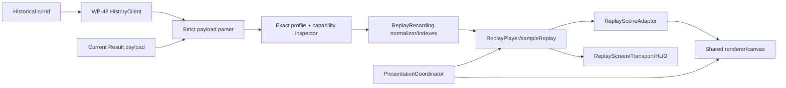
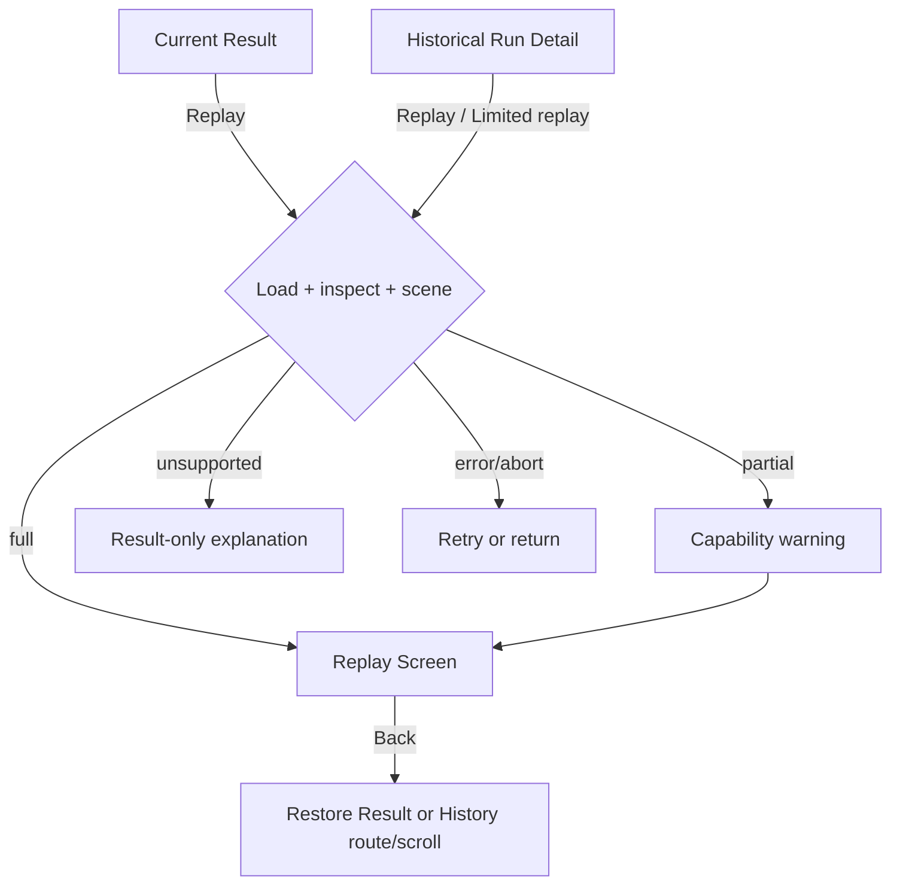

# WP-50（暫用編號）— First-person 3D State Replay

> Stage 10 的第三個 Work Package。上層規格：[../README.md](../README.md)；本機 payload 讀取依賴 [WP-48](../wp-48-local-history-foundation/README.md)，歷史 route／Result action port 依賴 [WP-49](../wp-49-history-library-and-trends/README.md)。
>
> Companion：[task-checklist.md](task-checklist.md) · [progress.md](progress.md)
>
> 本計畫依 `.claude/skills/engineering-planning/SKILL.md`、`references/design_standards.md` 與 `assets/tech_spec_template.md` 制定。**本 WP 實作 recorded-state playback；不把舊輸入重新送入 `SimLoop`，也不錄製／輸出影片。**

| | |
|---|---|
| **Problem** | 現有 JSON 有分析用 tick/event，但沒有面向使用者的 replay contract、支援判定、clock、隔離 3D scene、transport UI 或 Result/History replay flow |
| **Outcome** | 支援的 run 可從當次 Result 或歷史 Run Detail 進入同一第一人稱 3D Replay Screen，播放、暫停、seek、調速、跳事件並安全返回來源 |
| **Replay policy** | historical replay 只有 Assessment；Practice 不保存、不出現在 Participant 歷史，但當次 in-memory Result 是否提供 replay 由 OQ-50.2 收斂 |
| **Truth model** | payload recorded state 是唯一 replay truth；不呼叫 live simulation、TargetManager、InputSampler 或 Pointer Lock |
| **Compatibility** | exact `drillId` profile + capability inspection；不以 family/prefix 或單一 `schemaVersion` 猜測完整支援 |
| **Estimate** | 13–20 dev-days（T0～T6 + T-exit） |
| **Risk** | High：現有錄製不足、單一 renderer ownership、seek 決定性、Three.js resource lifecycle |
| **Status** | 🟢 T0～T2 完成（2026-08-28，見 [progress.md](progress.md)）；OQ-50.1～4 已 owner 確認；T3 可開工 |

---

## 0. Repository-grounded discovery（2026-08-27）

1. `TickRecord` 現有欄位為 `t/vx/vz/px/pz/tx/ty/tz/aim/keys/ads` 與 optional `dYaw/dPitch`。`TickArena.recordState()` 只記錄**第一個 visible 且 alive target 的座標**，沒有 target ID、alive/visible transition 或多 target snapshot。
2. `DrillEvent` 已有 `cue/visible/counter/ads/target_stop/key/fire/hit`。`visible` 可帶 target ID/position；`fire` 可帶 shot sequence、view aim、單發 punch/spread/ammo；但 export 沒有 live `shotRays`、impact world position、逐 tick recoil decay或 active projectile track。
3. `Meta` 已有 `simHz/fovDeg/simToWorld/weapon/targets/spawn/scene`。`scene` 保存 `sceneId/assetPackVersion/clutterTier/fallback/eye`，足以辨識場景與 camera base；舊 payload 可能缺 additive scene/eye/target metadata。
4. live render path 由 `main.ts` 的單一 `createRenderLoop()` 同幀直接執行 `simLoop.pump`、player interpolation、camera recoil/ADS、`TargetView`、`ImpactView`、`TracerView` 與 `renderer.render`。Replay 若只蓋 overlay，背景 sim 仍會前進；必須建立明確 presentation ownership。
5. `CameraController` 的 ADS FOV transition 是 render-only 120 ms，recoil punch 由 `SharedState.recoil.prev/curr` 內插；兩者都不能只靠現有 `ticks[].aim` 精確還原。Replay full 定義必須明列哪些視覺語意需錄製或可由事件純推導。
6. `TargetView` 可重用 geometry/pool 思路，但它的輸入是 live `TargetState[]`，且 visible 即顯示；直接把 replay 寫回 `SharedState` 會破壞隔離。Replay 需自己的 immutable sampled view model／adapter。
7. `ImpactView` 依單調 ring sequence 增量更新，`TracerView` 依 render wall time 累積 lifetime；兩者目前都不是任意 seek 的純時間函式，不能原封不動作為 replay truth。
8. `SceneManager` 能依 `SceneConfig` 建隔離 scene/camera並 dispose GPU resources；`createRenderer()` 只有 `main.ts` 一個 caller。prototype 優先共用既有 renderer/canvas、租用 presentation ownership，避免第二 GPU context。
9. 正式 session roster 至少包含 exact IDs 對應 hold-click、hold-track、spider-shot、counterstrafe 與 peek-click-transfer；另有 BR tracking protocol variants（含 hitscan/projectile）。是否 `full` 必須逐 exact ID/profile 驗證，不能由 family 推定。
10. WP-48 提供完整 payload load，WP-49 預留 historical `onReplay(runId)` action port與 route-local return/scroll context；兩者尚未完成時，WP-50 T0 以 approved contract 對帳並標 dependency，不複製 temporary DTO。

### 0.1 Planning-time blast radius

- `parseExportPayload`：browser history loader與 WP-48 Node repository的共用 strict boundary；增加 optional replay fields 是 cross-runtime change，必須保留舊 v2 fixture相容性。
- `TickArena.recordState`／`createDataRecorder`：12 個以上錄製 caller與多個 metrics tests。若新增 capture，只能 additive，不能改現有 tick/event計量語意。
- `SceneManager`／`TargetView`／`CameraController`：分別已有 scene/camera/target regression tests；可抽純 adapter或建立 replay-specific view，不把 replay condition塞入 live classes熱路徑。
- `main.ts` render callback：目前集中 live pump/presentation/result completion，且缺直接 covering test。presentation ownership屬 cross-module High-risk change，需 Playwright與 determinism regression。
- `ImpactView`／`TracerView`：現況依累積 ring/render time，不符合 seek invariant；WP-50建立 replay-specific stateless effect projection，避免改壞 live hot path。
- WP-49 `HistoricalRunDetail`／route/action port是 planned path；T6開始前必須重新讀當時實際 implementation與CodeGraph impact。

---

## 1. 需求壓縮（Requirements）

### 1.1 Functional Requirements

| ID | Requirement |
|---|---|
| **FR-50.1** | 系統**必須**以 strict payload parse + exact-`drillId` replay profile + capability inspection產生 `full/partial/unsupported/invalid`，並提供 machine-readable reason codes；不得只看 `meta.schemaVersion`。 |
| **FR-50.2** | 系統**必須**建立 additive replay schema v1，保存 full replay所需但現有 v2缺少的 target lifecycle、camera/recoil、weapon/fire visual狀態；既有 metrics/export consumers語意不得改變。 |
| **FR-50.3** | 系統**必須**把 payload正規化為 immutable `ReplayRecording`，驗證 tick/event finite、時間單調、timeline範圍、scene/profile/capability，並將來源時間正規化為 `0…durationMs`。 |
| **FR-50.4** | 系統**必須**以 recorded-state playback重建過程；Replay path不得呼叫 `SimLoop.pump/simStep`、TargetManager/DrillRunner、InputSampler或修改 live `SharedState`。 |
| **FR-50.5** | 系統**必須**在相鄰 ticks間插值第一人稱 player/camera position與 yaw/pitch；yaw採最短弧，離散 keys/ADS/lifecycle採明確的左閉右開規則。 |
| **FR-50.6** | 系統**必須**依 recorded scene metadata與 exact replay profile建立隔離 Three.js scene/camera，呈現可支援的 targets、recoil/ADS與 fire/hit visuals；缺能力時降級而非捏造。 |
| **FR-50.7** | 系統**必須**提供播放／暫停、seek、0.25×／0.5×／1×／2×、重新從頭播放與 ended state；speed切換不得改變當下 media time。 |
| **FR-50.8** | 系統**必須**顯示 cue、visible、counter、fire、hit事件時間軸與上一／下一事件；跳轉到事件時以該 event的normalized time為準。 |
| **FR-50.9** | 系統**必須**顯示當下 A/D/W/S、ADS、平面速度與 timestamp HUD；所有值來自同一 sampled frame，不從 live state讀取。 |
| **FR-50.10** | 任意時間 `t` 的 scene/HUD/effects**必須**只由 recording + `t` 純推導；直接 seek與從0順播到`t`的可觀測state必須等價。 |
| **FR-50.11** | 系統**必須**以 exclusive presentation ownership阻止 Replay期間的 live sim/render/input；全應用同一時間最多一個 active rAF presentation owner與一個 renderer owner。 |
| **FR-50.12** | `partial` 可在明確限制banner下播放其可靠capabilities；`unsupported`不顯示可執行播放action；`invalid`走既有invalid/error邊界。 |
| **FR-50.13** | 系統**必須**從 historical Run Detail載入正確 `runId`後進入 Replay，返回時還原原route/filter/scroll；快速切換run或返回不得被晚到scene/payload覆蓋。 |
| **FR-50.14** | 系統**必須**從剛完成、仍在記憶體中的支援payload進入同一 Replay Screen；保存失敗不應阻止 in-memory replay，是否包含Practice依OQ-50.2。 |
| **FR-50.15** | scene asset unavailable/version mismatch、payload overflow、empty ticks、non-monotonic time、unknown exact drill、load abort與WebGPU/WebGL fallback皆有明確failure/degrade state，不crash或卡住背景UI。 |

### 1.2 Non-functional Requirements

| ID | Requirement / measurable gate |
|---|---|
| **NFR-50.1** | 以 recorder上限附近 **42,000 ticks**／≤4 MiB fixture，strict parse後的normalize + indexes P95 < **250 ms**，且不得逐frame重掃整個tick/event array。 |
| **NFR-50.2** | 任意 seek/sample（含event cursor與effect window）P95 < **2 ms**；tick/event定位採 binary search或預建index，複雜度 `O(log n + k_visible)`。 |
| **NFR-50.3** | cached scene asset下，payload ready到第一個可見replay frame P95 < **1,500 ms**；scene load期間有可取消loading UI。 |
| **NFR-50.4** | 60 Hz播放時，replay sample + adapter + UI update（不含GPU submit）P95 < **4 ms/frame**、無連續>50 ms long task；熱路徑避免per-frame array/object churn。 |
| **NFR-50.5** | Replay active時instrumentation證明 `SimLoop.pump`、Pointer Lock request與InputSampler consumption皆為0；同時最多一個rAF callback鏈與一個renderer presentation owner。 |
| **NFR-50.6** | load/scene generation切換或dispose後 **100 ms**內abort client wait／停止commit；晚到asset若無法取消，必須立即dispose且不得掛入active scene。 |
| **NFR-50.7** | transport、event controls、speed與返回可只用keyboard操作；slider有ARIA min/max/current text，focus不落入hidden source screen，partial warning可由screen reader讀取。 |
| **NFR-50.8** | Replay UI不 import `node:*`；replay domain無DOM/fs/wall-clock/random，clock與scheduler可注入；`npm run build`、typecheck、Vitest、Playwright與live determinism regressions全綠。 |

### 1.3 Constraints

- 保持 TypeScript + Three.js + Vite + 純 DOM；不新增影片encoder、game replay middleware或前端framework。
- JSON仍為source of truth；WP-50不建立不可重建的sidecar replay檔或資料庫。
- historical records只有Assessment；Practice不得因此新增save/API/history route。
- 同一支援profile只綁exact `drillId`；未知或新variant不沿用prefix/family設定。
- additive replay capture不可改變live命中、metrics、RNG、sim tick ordering或現有v2欄位語意。
- replay可以重用scene config/asset/view primitives，但不能重用live mutable state或累積式effect state。
- free camera、frame-by-frame editor、video export、run overlay comparison、annotation與research scoring不在本WP。

### 1.4 Assumptions

- media time以第一個合法recorded tick為0；duration以最後一個tick為準，event超界由normalizer回報reason，不靜默延長影片。
- yaw/pitch與player/target位置連續插值；keys/ADS/target lifecycle使用`latest tick at or before t`。相鄰ticktarget ID不同時不跨target插值。
- event jump預設保留原播放／暫停狀態；ended時按播放會seek 0再開始。
- tab hidden時自動pause，避免背景rAF停擺後回頁瞬間跳時；focus/visibility恢復不自動播放。
- scene load失敗不阻止回到Result/History；partial/unsupported reason採code + localized message，不把raw exception直接當UI契約。
- 建議 immediate current Result replay同時允許Assessment與Practice；Practice payload只活在記憶體，不寫入或建立history entry（待OQ-50.2確認）。

### 1.5 Open Questions

| ID | Question | Recommended default | Owner | Deadline | Impact if unresolved |
|---|---|---|---|---|---|
| **OQ-50.1** | `full`是否要求重現每一項fire visual（連續recoil、tracer、impact、projectile），或相機+目標+lifecycle+事件提示即可？ | ✅ **已確認（2026-08-28，D-50-P6）**：`full`＝camera（punch由recoil純函式推導，不逐tick捕捉）＋單一active target位置/ID（scalar `targetId?`，非陣列）＋ADS＋shot/hit cue（既有事件欄位推導）。**projectile視覺明確排除**——目前6個Assessment exact ID皆非projectile武器。詳見[progress.md](progress.md) | 使用者 | ~~T0 exit、T1前~~ 已收斂 | 決定replay schema大小、capability profile與首批full roster |
| **OQ-50.2** | Practice不進歷史後，剛完成的Practice Result是否仍可立即Replay？ | ✅ **已確認（D-50-P9）**：Assessment與Practice皆可，只用in-memory payload，離開後不可再找回 | 使用者 | ~~T0 exit、T6前~~ 已收斂 | 決定Result action visibility與E2E matrix；不改Assessment-only storage |
| **OQ-50.3** | `partial`是否允許播放可靠部分，或只能查看結果？ | ✅ **已確認（D-50-P10）**：允許「有限重播」，畫面持續顯示缺失capabilities（persistent banner）；只有無可信camera timeline才`unsupported` | 使用者 | ~~T0 exit、T5前~~ 已收斂 | 決定action wording、warning與support classifier threshold |
| **OQ-50.4** | recorded `assetPackVersion`與目前資產不一致時如何處理？ | ✅ **已確認（D-50-P11）**：降為`partial`，以目前scene呈現並顯示版本差異；只有當前資產不滿足drill的`minimumPlayable`時才整體`unsupported` | 使用者 | ~~T0 exit、T3前~~ 已收斂 | 決定scene loader fallback與support reason |

---

## 2. 系統架構與設計（Technical Design）

### 2.1 System boundary

#### In scope（planning-time targets）

```text
src/data/metadata.ts                              MODIFY optional ReplayMeta v1
src/data/RingBuffer.ts                            MODIFY additive replay snapshot fields after T0
src/data/DataRecorder.ts                          MODIFY additive capture/events after T0
src/data/exportPayloadSchema.ts                   MODIFY strict backward-compatible parser
src/replay/contracts.ts                           NEW support/capability/recording DTO
src/replay/replayCompatibility.ts                 NEW exact profile registry + classifier
src/replay/normalizeReplayRecording.ts            NEW strict normalization/index build
src/replay/sampleReplay.ts                        NEW binary lookup/interpolation/effects
src/replay/ReplayPlayer.ts                        NEW injected-clock playback state machine
src/replay/ReplayController.ts                    NEW async load/generation/source return context
src/render/replay/ReplaySceneAdapter.ts            NEW isolated scene/camera adapter
src/render/replay/ReplayTargetView.ts              NEW sampled target presentation
src/render/replay/ReplayEffectView.ts              NEW time-derived shot/hit effects
src/render/PresentationCoordinator.ts              NEW exclusive live/replay ownership seam
src/ui/replay/ReplayScreen.ts                      NEW viewport/shell/loading/error/warning
src/ui/replay/ReplayTransport.ts                   NEW timeline/controls/HUD/events
src/ui/ResultScreen.ts                             MODIFY optional current replay action
src/ui/history/HistoricalRunDetail.ts              MODIFY WP-49 action port wiring
src/history/navigation/HistoryRoute.ts             MODIFY replay source/return if WP-49 contract requires
src/main.ts                                        MODIFY composition and frame delegation only
tests/replay/*                                     NEW domain/adapter/contract/perf tests
tests/e2e/replay.spec.ts                           NEW current/historical/isolation E2E
```

T0開工前需以當時worktree與CodeGraph重新確認路徑。若WP-48／49尚未完成，T1～T5可先使用fixture與typed port；T6保持blocked，不得複製另一套history client/route。

#### Out of scope

- Practice persistence/history route、delete/rename/import。
- 以輸入重跑simulation、可互動玩家控制、Pointer Lock或live hit testing。
- video capture/export、free camera、逐frame編輯、兩次run疊圖。
- 改變研究metrics、quality gate、compatibility cohort或Result計算。
- 為不完整舊資料猜測target ID、impact位置、projectile path或scene版本。

### 2.2 Data flow



load與play分離：Controller先取得payload並分類；`full/partial`才normalize與load scene。`ReplayPlayer`不擁有`requestAnimationFrame`，只接受app presentation frame帶入的`nowMs`；`PresentationCoordinator`是唯一owner，replay active時在呼叫live `simLoop.pump`前分流。

### 2.3 Additive replay contract（T0 candidate；T1 freeze）

現有`ticks`保留作分析相容層；新增欄位只補 replay能力。確切shape由T0 size/coverage PoC凍結，建議起點：

```ts
export interface ReplayMeta {
  readonly replaySchemaVersion: 1;
  readonly recordingHz: number;
  readonly visualSemanticsVersion: string;
  readonly capabilities: readonly ReplayCapability[];
}

export interface ReplayTickStateV1 {
  readonly viewPunchPitchDeg: number;
  readonly viewPunchYawDeg: number;
  readonly ammo?: number;
  readonly targets: readonly {
    readonly id: string;
    readonly visible: boolean;
    readonly alive: boolean;
    readonly x: number;
    readonly y: number;
    readonly z: number;
  }[];
  readonly projectiles?: readonly ReplayProjectileState[];
}

// additive only; legacy fields remain unchanged
interface TickRecord {
  readonly replay?: ReplayTickStateV1;
}

interface ReplayShotVisualV1 {
  readonly origin: { readonly x: number; readonly y: number; readonly z: number };
  readonly endpoint: { readonly x: number; readonly y: number; readonly z: number };
  readonly impact?: { readonly x: number; readonly y: number; readonly z: number };
}
```

`fire` event可additive掛`visual`；若projectile drill需要逐tick path才能符合OQ-50.1，T0比較「tick snapshots」與「spawn + recorded hit/end segment」大小及seek純度。不得為減少payload而回頭呼叫live physics。

向後相容規則：

- pre-replay v2仍由原strict parser接受；不存在`meta.replay`不等於invalid。
- `meta.replay`存在時，其版本／capabilities／tick extensions必須strict驗證；宣稱capability但資料缺失是`partial`或`invalid-contract`，不可full。
- `recorderOverflow`或replay capture overflow會移除`full`資格，但不等同research quality status。
- 舊canonical serialization、metrics snapshots與schema consumers必須維持；新增golden fixture驗證new replay v1。

### 2.4 Compatibility/profile contract

```ts
export type ReplaySupportStatus = 'full' | 'partial' | 'unsupported' | 'invalid';

export type ReplayCapability =
  | 'camera'
  | 'player-motion'
  | 'input-hud'
  | 'scene'
  | 'target-lifecycle'
  | 'ads-recoil'
  | 'shot-visuals'
  | 'projectile-visuals'
  | 'event-timeline';

export interface ReplaySupport {
  readonly status: ReplaySupportStatus;
  readonly available: readonly ReplayCapability[];
  readonly missing: readonly ReplayCapability[];
  readonly reasonCodes: readonly string[];
  readonly profileVersion?: string;
}

export interface ReplayProfile {
  readonly drillId: string;
  readonly version: string;
  readonly requiredForFull: readonly ReplayCapability[];
  readonly minimumPlayable: readonly ReplayCapability[];
  readonly sceneId?: string;
}
```

分類順序固定：strict parse → timeline structural validation → exact profile lookup → advertised/observed capabilities → overflow/scene asset check。profile registry沒有prefix fallback；新exact ID先`partial/unsupported`，直到有fixture與owner核准。

建議legacy政策：可信camera/player timeline存在時可`partial`；沒有ticks、時間不單調、非finite camera或無法建立最低scene時`unsupported`；JSON schema本身不合法才`invalid`。T0需輸出逐drill matrix與golden payload provenance。

### 2.5 Normalized recording and sampling

```ts
export interface ReplayRecording {
  readonly runId?: string;
  readonly drillId: string;
  readonly durationMs: number;
  readonly support: ReplaySupport;
  readonly ticks: readonly NormalizedReplayTick[];
  readonly events: readonly NormalizedReplayEvent[];
  readonly eventTimes: Float64Array;
  readonly scene: ReplaySceneDescriptor;
}

export interface ReplaySample {
  readonly timeMs: number;
  readonly tickBefore: number;
  readonly tickAfter: number;
  readonly alpha: number;
  readonly camera: ReplayCameraState;
  readonly player: ReplayPlayerState;
  readonly input: ReplayInputState;
  readonly targets: readonly ReplayTargetState[];
  readonly effects: readonly ReplayEffectState[];
  readonly eventCursor: number;
}

export function sampleReplay(recording: ReplayRecording, timeMs: number, reuse?: ReplaySampleBuffer): ReplaySample;
```

規則：

- normalize一次驗證與建立typed indexes；frame path不sort、不filter全array、不parse。
- position linear interpolation；yaw以wrap-to-π後最短弧；pitch linear後依recorded/project pitch limit clamp。
- target只在相同ID且兩端同一lifecycle segment時插值；spawn/death邊界採latest-at-or-before離散state。
- keys/ADS/ammo取左tick；速度以`hypot(vx,vz)`；HUD與scene共用同一sample。
- cue/shot/impact等短效視覺由`eventTime <= t < eventTime + fixedDuration`純查詢；seek不保留previous frame accumulator。
- `previousEvent/nextEvent`對duplicate timestamps採stable source-order；到邊界disabled，不wrap。

### 2.6 ReplayPlayer state machine

```ts
export type ReplayPlaybackState =
  | { readonly status: 'paused'; readonly timeMs: number; readonly rate: ReplayRate }
  | { readonly status: 'playing'; readonly timeMs: number; readonly rate: ReplayRate }
  | { readonly status: 'ended'; readonly timeMs: number; readonly rate: ReplayRate };

export type ReplayRate = 0.25 | 0.5 | 1 | 2;

export interface ReplayPlayer {
  readonly state: ReplayPlaybackState;
  play(): void;
  pause(): void;
  seek(timeMs: number): void;
  setRate(rate: ReplayRate): void;
  frame(nowMs: number): ReplaySample;
  previousEvent(): void;
  nextEvent(): void;
  dispose(): void;
}
```

`frame(now)`只在playing時以`(now-lastNow)*rate`推進；play/seek/rate/visibility change重設anchor，防tab休眠或切速跳時。所有commands序列以fake clock測試，dispose後不得發布sample。

### 2.7 Presentation ownership and scene lifecycle

建議採單renderer、隔離scene/camera、單app rAF：

```ts
type PresentationMode =
  | { readonly kind: 'live' }
  | { readonly kind: 'replay'; readonly session: ReplayPresentationSession };

interface PresentationCoordinator {
  enterReplay(session: ReplayPresentationSession): void;
  leaveReplay(): void;
  frame(nowMs: number): void;
  dispose(): void;
}
```

- `frame()`在mode分支最前面決定owner；replay branch不得落到live `simLoop.pump`。
- replay建立自己的`SceneManager`/camera/target/effect views；共用renderer/canvas但不共用live scene、camera、TargetView或SharedState。
- 只允許從ended Result或History context進入；不提供進行中run replay action。退出後返回原Result/History，不嘗試恢復一場被暫停的live test。
- async scene load帶generation；late success若不是active generation立即dispose。
- resize只投遞給active scene；leave/dispose移除DOM/listeners、GPU resources、samples與controller subscriptions，再把renderer ownership還給live。

若T0 PoC證明單renderer lease無法在現行WebGPU lifecycle安全成立，才可改用dedicated replay renderer；必須同時證明第二context的memory/dispose與live loop完全停止，不能以overlay遮住背景代替隔離。

### 2.8 UI flow and layout



Desktop MVP：top bar顯示Back、Participant/Drill/startedAt與support badge；中央16:9 viewport；左上疊keys/ADS/speed/timestamp HUD；下方固定transport；event markers疊在seek track，窄螢幕時event list移到transport下方。partial banner固定在viewport上方且不以顏色單獨傳意。

Transport順序：上一事件 → Play/Pause → 下一事件 → current/duration → seek slider → rate segmented control。Space只在focus不位於button/slider/input時切換；slider原生Arrow/Home/End可用；離開screen後shortcut listener必須移除。

### 2.9 Error/support UX

| State | User-facing action |
|---|---|
| `full` | 顯示「3D重播」；badge「完整」 |
| `partial` | 顯示「有限重播」；進入前列出缺少項，畫面中保留warning與「查看限制」 |
| `unsupported` | 不顯示可播放button；顯示「此紀錄只能查看結果」+ reason + 返回 |
| `invalid` | 沿用WP-48/49 invalid/not-found UI，不建立ReplayRecording |
| API unavailable | historical retry/返回；current in-memory payload仍可依support播放 |
| scene unavailable | 依profile降partial placeholder或unsupported；永遠可返回，不顯示黑屏 |

reason code例：`LEGACY_REPLAY_FIELDS_MISSING`、`UNKNOWN_EXACT_DRILL`、`EMPTY_TICKS`、`NON_MONOTONIC_TICKS`、`RECORDER_OVERFLOW`、`TARGET_LIFECYCLE_MISSING`、`SHOT_VISUALS_MISSING`、`PROJECTILE_TRACK_MISSING`、`SCENE_ASSET_VERSION_MISMATCH`、`SCENE_LOAD_FAILED`。

### 2.10 Failure-mode design

| Failure mode | Impact | Prevention / handling | Evidence owner |
|---|---|---|---|
| schema v2一律標full | 顯示不存在的精準度 | exact profile + observed capabilities + T0 matrix | T0/T1 contract tests |
| replay重跑input/sim | 版本漂移、不可重現、污染live state | module boundary scans；presentation branch不call pump | T3/T-exit |
| seek依賴順播累積 | 前後跳畫面錯誤 | pure sample/effect windows；direct-vs-linear state hash | T2/T4 |
| target ID缺失卻跨target lerp | 目標飛越場景 | same-ID segment rule；legacy降partial | T0/T2 tests |
| yaw穿越±π走長路 | 相機旋轉一圈 | shortest-arc interpolation | T2 unit |
| background sim仍pump | 隱藏測試被改寫/CPU浪費 | exclusive presentation mode + pump spy | T3 E2E |
| scene/payload late response覆蓋 | 錯run畫面、GPU leak | AbortController + generation + late dispose | T3/T6 race tests |
| Impact/Tracer累積元件直接重用 | seek殘影/錯位 | replay-specific time-derived effects | T4 state hash |
| second renderer/context未dispose | GPU memory leak | default shared renderer lease；若fallback做repeat-enter heap/resource test | T3/T-exit |
| partial warning被忽略 | 研究員誤認完整 | distinct action/badge/persistent warning/reason list | T5 E2E/a11y |
| Practice經Replay被保存 | 違反Assessment-only | in-memory source type；零HistoryClient save/list mutation | T6 E2E |

### 2.11 Concurrency and lifecycle

- `ReplayController`擁有payload/scene load generation與source return context；每次run/source變更先abort前一generation。
- `ReplayPlayer`只在main thread，以app frame傳入clock；它不建立worker/rAF/timer，不直接改DOM/Three objects。
- `ReplaySceneAdapter`消費immutable sample；render scratch objects/pools由adapter擁有並重用。
- payload load與scene load最多各一個active；scene無法實際abort時，以generation忽略並dispose。
- `visibilitychange`、source close、route change與fatal renderer error都經同一controller transition；每條exit path必須pause player並release presentation lease。
- History rapid navigation晚到load不得顯示Replay，也不得改WP-49 route state。

---

## 3. 風險分析（Risk Analysis）

### 3.1 Risk register

| Risk | Level | Evidence / blast radius | Mitigation |
|---|---|---|---|
| 現有錄製不夠full | High | 單target座標、無ID/lifecycle；無continuous recoil/shot ray/impact/projectile export | T0逐drill matrix與size PoC；T1 additive contract；legacy誠實partial |
| 單一main render callback難隔離 | High | live pump/render/result/HUD集中於`main.ts` | T3 presentation coordinator先切ownership；保持一rAF/renderer；pump spy+Playwright |
| seek視覺不決定 | High | live impact/tracer依ring與render time累積 | T2 pure sample；T4 replay-specific effect view；state hash/property tests |
| schema擴充影響研究資料 | High | recorder/parser被metrics/history共用 | additive optional fields；old canonical/golden/metrics regressions；不改RNG/sim order |
| exact drill/asset快速演進 | Med/High | BR variants與scene asset version可新增 | exact versioned profile；unknown不fallback；asset mismatch reason |
| GPU資源與late async leak | Med/High | SceneManager/GLTF async，WebGPU renderer昂貴 | shared lease；generation dispose；50-cycle enter/leave test |
| WP-48/49尚未落地 | Med | loadRun/route/action只是approved plan | T0 handoff matrix；T1～T5 fixture-first；T6明確dependency gate |
| full/partial詞義誤導 | High | 使用者要重建「當時看到」但pixel-perfect資料不存在 | OQ-50.1 owner決策；capability list；不宣稱video/pixel equivalence |

### 3.2 Conscious technical debt

1. **exact replay profile registry**：prototype需人工註冊新drill。觸發：drill新增或visual semantics變更時，必須加fixture/profile version；不做family fallback。
2. **shared renderer presentation lease**：適用目前單canvas app。觸發：未來需要side-by-side live/replay或多viewport時，再抽render surface manager。
3. **fixed-duration event effects**：只重建可觀測shot cue，不是影片級粒子。觸發：研究問題需要逐frame muzzle/particle fidelity時，新增recorded visual track schema version。
4. **main-thread normalization**：42k ticks目標內先維持簡單。觸發：NFR-50.1連續失敗或payload大於4MiB，再評估worker；worker不得複製兩份大型payload。

### 3.3 Performance bottlenecks

- JSON parse由WP-48 strict boundary負責；normalizer不可再次deep-clone完整ticks。
- per-frame target/effect arrays若每幀配置會GC；採typed indexes、scratch buffers與mesh pools。
- scene asset第一次load是首畫面主成本；loading可返回、late result dispose，不能阻塞navigation。
- HUD DOM每幀全文重建會造成layout；只在顯示值改變時更新text/attributes，viewport render不觸發全頁reflow。

---

## 4. 任務拆解（Task Breakdown）

| Task | Objective | Dependencies | Risk | Complexity | Definition of Done |
|---|---|---|---|---|---|
| **T0** | Entry gate、逐drill資料充分性／renderer lifecycle PoC、OQ與support matrix凍結 | WP-48 approved load contract | High | 0.5–1d | 現有official exact IDs都有full/partial/unsupported理由；schema候選size、single-renderer lease與direct-seek PoC有證據；OQ有結論/blocked owner |
| **T1** | Additive replay contract、capture與compatibility classifier | T0 | High | 2–3d | old v2 parse/golden/metrics不變；new v1 fixture含凍結capabilities；exact profile/reason/overflow/legacy tests全綠；至少一official drill具full候選資料 |
| **T2** | Normalizer、binary sampling、clock與event navigation | T1 | Med/High | 2–3d | timeline validation、shortest-yaw、target segment、seek/speed/end/event tests；42k tick NFR達標；domain無DOM/Three/sim |
| **T3** | Exclusive presentation coordinator與base replay scene/camera | T1～T2 | High | 2–3d | 一renderer/一rAF；Replay active零live pump/input/pointer lock；scene load race/dispose/resize與camera parity tests成立 |
| **T4** | Target lifecycle、ADS/recoil、shot/hit/projectile effect adapter | T1～T3 | High | 2–3d | exact profile visuals映射完成；direct seek vs sequential state hash等價；legacy/asset/projectile缺口正確降級 |
| **T5** | Replay Screen、transport、timeline、HUD與support/error UX | T2～T4 | Med | 2–3d | controls/rates/markers/HUD/loading/partial/unsupported/keyboard/ARIA/component tests與responsive browser evidence成立 |
| **T6** | Current Result／historical Run Detail入口、return state與race整合 | T5 + WP-48 T4/T5 + WP-49 T3 | High | 1.5–2.5d | correct payload/runId、saved/failed Assessment、Practice policy、Back/filter/scroll、rapid switch、no fake action E2E全綠 |
| **T-exit** | WP-50 acceptance與WP-51 handoff | T1～T6 | Med | 0.5–1d | golden/state-hash/perf/a11y/50-cycle lifecycle/build/Vitest/Playwright/live determinism evidence齊全，docs/graph/status對帳 |

Task詳細步驟與local DoD見同資料夾`T*.md`。

### 4.1 Requirements traceability

| Requirement | Tasks | Verification |
|---|---|---|
| FR-50.1～3 | T0/T1/T2 | support matrix、strict contract、normalizer fixtures |
| FR-50.4／11 | T3/T-exit | module scan、pump/input spies、single-owner E2E |
| FR-50.5／10 | T2/T4 | interpolation/property/state-hash tests |
| FR-50.6 | T1/T3/T4 | scene/profile/target/effect integration |
| FR-50.7～9 | T2/T5 | player clock + transport/event/HUD component/E2E |
| FR-50.12／15 | T1/T4/T5 | full/partial/unsupported/invalid/failure matrix |
| FR-50.13／14 | T6 | current/historical source and return-state E2E |
| NFR-50.1／2／4 | T2/T4/T-exit | 42k fixture benchmark and frame instrumentation |
| NFR-50.3／6 | T3/T6/T-exit | cached scene/start latency、abort/generation lifecycle |
| NFR-50.5 | T3/T-exit | rAF/renderer/pump/pointer-lock instrumentation |
| NFR-50.7／8 | T5/T-exit | keyboard/ARIA/boundary scans/CI |

---

## 5. WP-51 handoff

WP-50完成時，WP-51可依賴：

- versioned `ReplayMeta`／optional replay tick/event extensions與strict backward-compatible parser；
- exact-`drillId` replay profile registry、support status/reason codes與golden fixtures；
- pure normalized recording、clock、sampling、event navigation與seek invariant tests；
- exclusive renderer/presentation lifecycle，Replay active零live simulation/input；
- current/historical共用Replay Screen與stable return contract；
- 42k tick、scene load、50-cycle enter/leave與a11y evidence。

WP-51只做跨WP happy/failure/scale/operations acceptance，不應重新定義full/partial語意或在E2E中補domain logic。

---

## 6. Execution rules

- 一個task = 一個垂直切片 = 一個原子commit；未完成tests/evidence/progress，不開下一task。
- 修改既有symbol前執行CodeGraph impact並記affected files/symbols與local/cross-module；pending file直接讀。
- T1任何capture欄位必須先有T0 owner-approved capability與payload-size evidence；禁止「順便多錄」未使用狀態。
- replay domain pure/deterministic；不得import DOM/Three/fs/wall-clock/random/sim。Three mapping只在render adapter。
- T3修改`main.ts`前先抽可測ownership seam；不得以`if (replayActive)`散落多處作為生命周期設計。
- T6開始前對帳WP-48/49實際DTO/route/action diff；保留concurrent changes，不複製contract。
- 測試payload與assets放fixtures/temp root，不寫真實`data/session-history/`；不得把Participant資料加入git。
- production code修改後執行`graphify update .`；T-exit檢查git status/staged names、CodeGraph pending與Stage 10 docs。
