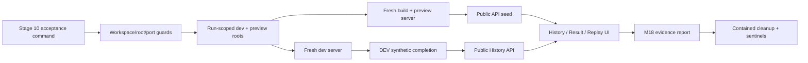

# WP-51（暫用編號）— Stage 10 Integration and M18 Acceptance

> Stage 10 最後一個 Work Package。上層規格：[../README.md](../README.md)；輸入契約來自 [WP-48](../wp-48-local-history-foundation/README.md)、[WP-49](../wp-49-history-library-and-trends/README.md) 與 [WP-50](../wp-50-3d-state-replay/README.md)。
>
> Companion：[task-checklist.md](task-checklist.md) · [progress.md](progress.md)
>
> 本計畫依 `.claude/skills/engineering-planning/SKILL.md`、`references/design_standards.md` 與 `assets/tech_spec_template.md` 制定。**本 WP 只做跨模組整合、驗收工具、操作文件與 M18 證據；不重新定義 History、趨勢或 Replay domain semantics。**

| | |
|---|---|
| **Problem** | WP-48～50 各自可交付 storage、History UI 與 3D Replay，但尚缺一套不碰真實資料、可在 dev／preview 重現、涵蓋失敗／重啟／效能／實機的跨 WP 驗收方式 |
| **Outcome** | 一個命令可建立隔離環境並執行 Stage 10 自動驗收；M18 每項條件都有 automated／measurement／inspection／manual 證據與明確 owner |
| **Scope policy** | Assessment 是唯一持久化歷史；Practice 僅保留當次 Result／手動匯出，以及依 WP-50 決策可能存在的當次 in-memory Replay |
| **Release policy** | WP-48、49、50 exit gates 與本 WP exit gate 全綠後才可宣告 M18；上游 domain defect 必須回到 owning WP 修復並重跑交接證據 |
| **Estimate** | 10–16 dev-days（T0～T5 + T-exit） |
| **Risk** | Med/High：跨 process/root lifecycle、dev-only test hooks、preview parity、競態、實機 3D fidelity |
| **Status** | 🟡 T0～T4 完成；T-exit automated gates 已於 2026-08-31 在 working tree based on HEAD `d142baf` 重跑並通過（typecheck/build/Vitest/Playwright/test:ci/test:stage10/scale/critical repeat）。T5 文件交付完成；KI-017 已於 2026-09-01 由 WP-50 owner 修復，但 manual browser/GPU/a11y walkthrough、independent operator runbook walkthrough、KI-018 owner 收斂與 Chrome/WebGL2 coverage gap 仍未完成；依 T-exit gate 尚不能宣告 M18。詳見 [progress.md](progress.md) 與 [acceptance-stage-j.md](../../../operational/acceptance-stage-j.md)。 |

---

## 0. Repository-grounded discovery（2026-08-27）

1. WP-48 實作已推進至 T2：strict parser、Node typecheck boundary、history paths、repository core、single-process serialization、root lease 與 opt-in 5,000-run benchmark 已存在；T3～T5 與 exit 尚未完成。WP-51 不以 Stage 層較舊的狀態文字取代 owning WP 進度。
2. `HistoryRepository` 已規劃／實作 `initialize/saveRun/listParticipants/listDrills/listRuns/loadRun/close`，Assessment-only、16 MiB payload、atomic write、containment、conflict 與 corrupt/unsupported/practice counts 可作為整合契約；WP-51 不直接讀 filesystem 來繞過 API。
3. 目前測試使用 Vite dev/preview 雙 server、固定 5173/4173 ports、system Edge channel，且非 CI 預設 `reuseExistingServer`。過去已有 stale reused server flake；M18 runner 必須自行擁有 server lifecycle 並禁止 reuse。
4. `__fpsTest` 等完成測試掛鉤只在 DEV 暴露。故自動化的「完成 Assessment→自動保存」只能在 dev 驗證；preview 應從公開 API 植入合成紀錄，再走公開 History／Result／Replay UI，不能把不存在的 preview hook 當產品能力。
5. COOP／COEP headers 同時套用 dev 與 preview，但仍需用實際 response/browser evidence 驗證，不能只 inspection config。
6. Playwright `fullyParallel: true`；History API 又是共享 process/root。Stage 10 fixtures 必須用唯一 Participant/run identity，跨 restart/corrupt/root 狀態案例需使用獨立 root 或 serial project，不可依全域筆數。
7. WP-48 目前部分 Node tests 使用 OS temp。Stage 10 主規則要求 workspace 內顯式 temp root；T0 必須把 M18 runner 統一到 ignored workspace root，並將上游不一致列為 handoff blocker，而非在 WP-51 默默放寬。
8. 現有 E2E 只自動跑 Edge；需求是 desktop Chrome/Edge。是否把兩者都列為 automated release gate，需由 OQ-51.2 收斂。
9. Pointer Lock、原生滑鼠輸入與 WebGPU 實際視覺 fidelity 無法由目前 synthetic harness 充分證明；須有版本化人工 runbook、指定硬體／browser 與簽核者。
10. 全基線在 WP-48 T0 記錄為 137 Vitest files／1,081 tests 與 31 Playwright tests。T0 必須以當時 HEAD 重跑並保存新基線，數量本身不是固定 release contract。

### 0.1 Planning-time blast radius

- WP-51 預設只新增 test runner、fixtures、E2E、操作與 acceptance 文件；不修改 storage、metric、replay domain。
- 若需變更 app composition、Playwright config 或 package scripts，先用 CodeGraph impact／直接 config inspection 記錄 blast radius；只允許 testability 或 lifecycle wiring，不可夾帶新 domain 規則。
- `playwright.config.ts`、Vite server lifecycle、History root injection 與 fixed ports 是 cross-process 熱區；錯誤可能碰真實資料或得到假綠結果，列為 High-risk harness change。
- `data/session-history/` 是真實資料 root。所有自動測試 root 必須位於 `.playwright-tmp/stage10/<runToken>/` 且在 cleanup 前做 resolved containment 檢查。

---

## 1. 需求壓縮（Requirements）

### 1.1 Functional Requirements

| ID | Requirement |
|---|---|
| **FR-51.1** | T0 **必須**以實際 implementation／tests／exit evidence 對帳 WP-48～50 handoff；任一必要 contract 未交付時標為 blocked，不以 WP-51 fixture 偽造成功。 |
| **FR-51.2** | 驗收 runner **必須**為每次執行建立 run-scoped、workspace-contained、dev／preview 分離的 History roots 與 downloads root；不得讀寫 `data/session-history/`。 |
| **FR-51.3** | 系統**必須**驗證 canonical Assessment journey：完成測試→原子自動保存→Result→History→Participant→exact drill→run detail→trend→3D Replay→返回來源。 |
| **FR-51.4** | 系統**必須**驗證 server restart 後只由 JSON 重建 Participant／drill／run index，排序、result 與 replay identity 不變，不依賴 browser memory/cache。 |
| **FR-51.5** | 系統**必須**驗證不同 Participant、exact `drillId`、startedAt/runId 排序、incompatible cohort 與 historical/current Result parity；不得以 family/prefix 混併。 |
| **FR-51.6** | Practice journey **必須**保留當次 Result 與手動匯出，但零 save API、零歷史檔、零 Participant/history entry；當次 Replay 行為依 OQ-50.2 的已核准決策驗收。 |
| **FR-51.7** | 未註冊 primary metric 的 Assessment 仍**必須**可瀏覽 Result／History／Replay，趨勢只顯示明確 empty state；不得產生臨時 composite score。 |
| **FR-51.8** | `full/partial/unsupported/invalid` 與 scene asset mismatch/failure **必須**遵守 WP-50 support/reason contract；partial/unsupported 不得被 happy-path fixture 隱藏。 |
| **FR-51.9** | API unavailable、permission/injected write failure、duplicate conflict、not found、corrupt/unsupported JSON、save retry/manual download **必須**有可重現的 recovery evidence。 |
| **FR-51.10** | 快速切 Participant/drill/run、History→Replay→Back、route close、payload/scene late completion **必須**不 stale commit、不洩漏 presentation owner，且還原 route/filter/scroll/focus。 |
| **FR-51.11** | dev **必須**驗證 synthetic completion/autosave；preview **必須**在無 DEV hook 的 production bundle 上，以公開 API/UI 驗證 seeded History→Result→Replay smoke 與 headers。 |
| **FR-51.12** | 驗收**必須**覆蓋 5,000 summary files、100-run analysis page、42,000-tick Replay、50 次 Replay enter/leave，並沿用上游已核准 performance/lifecycle gates。 |
| **FR-51.13** | History→Result→Replay 的整合流程**必須**有 keyboard/focus/ARIA evidence；錯誤、partial 與 loading 狀態不得只靠顏色表達。 |
| **FR-51.14** | 專案**必須**提供單一 Stage 10 acceptance command、可重現 environment manifest、M18 evidence record 與對應 acceptance report。 |
| **FR-51.15** | 操作文件**必須**涵蓋啟動、固定 root、備份、資料損壞／API／GPU troubleshooting、prototype 無 auth 與 loopback-only boundary。 |
| **FR-51.16** | 使用者／研究員的真實 browser + GPU 人工 walkthrough **必須**依版本化 checklist 留下 pass/fail、環境與 signer；是否阻擋 M18 由 OQ-51.1 決定。 |
| **FR-51.17** | WP-51 發現 domain defect 時**必須**建立 upstream regression、由 owning WP 修正並重跑 exit evidence；WP-51 只可修 acceptance harness、composition wiring 或文件。 |

### 1.2 Non-functional Requirements

| ID | Requirement / measurable gate |
|---|---|
| **NFR-51.1** | 沿用上游 budgets：save <1 s；5k History 首 100 rows P95 <500 ms；100-run analysis cold <2 s／warm <300 ms；42k normalize <250 ms、seek <2 ms、cached first replay frame <1.5 s。 |
| **NFR-51.2** | Stage 10 critical E2E 以 `--repeat-each=5 --retries=0` 零失敗；不得靠 retries、sleep 或 reused server 掩蓋 race。 |
| **NFR-51.3** | 100% test mutation 位於 resolved `.playwright-tmp/stage10/<runToken>/`；dev/preview root不同；outside sentinel、真實 root檔案樹與mtime在前後一致。 |
| **NFR-51.4** | route/load/replay abort後100 ms內停止commit；50次enter/leave後active rAF/listener/presentation owner/GPU resource counters回到baseline。 |
| **NFR-51.5** | Stage 10 acceptance command在reference machine **10分鐘內**完成（人工與opt-in 5k benchmark除外）；report記錄wall time與未納入項目。 |
| **NFR-51.6** | History→Replay主要流程只用keyboard可完成；所有互動控制有accessible name/state，focus返回觸發action或來源heading。 |
| **NFR-51.7** | browser bundle無`node:*`，History API只綁loopback、不使用CORS wildcard、root不由request提供；dev與preview headers同時通過。 |
| **NFR-51.8** | typecheck、Vitest、Playwright、build、Stage 10 acceptance皆exit 0；報告記錄commit、Node、OS、browser/backend、roots與測試數。 |
| **NFR-51.9** | git、test report與保留 artifacts不得含真實 Participant資料或真實payload；fixtures只用明確synthetic IDs。 |

### 1.3 Constraints and assumptions

- JSON仍是唯一 source of truth；WP-51 不引入 database、不可重建 index或新的 production cache。
- Assessment-only 與 exact `drillId` 已凍結，不在 M18 調整。
- fixed 5173/4173 ports 下，一次只允許一個 Stage 10 acceptance run；重入時 fail fast，不自動殺死未知 process。
- 自動化不得依 Pointer Lock／原生滑鼠做假保證；該區域由既有 determinism tests + 人工實機 evidence共同覆蓋。
- preview fixture先經公開 POST API寫入其隔離root；bootstrap-only corrupt/unsupported fixture可在server啟動前由runner放入該root，並在report標明來源。
- failure injection優先使用 WP-48 已核准 injectable filesystem seam；不得依OS ACL或修改真實資料夾權限。
- 所有 performance gate須記錄reference hardware與P95樣本；單次肉眼感覺不算證據。

### 1.4 Open Questions

| ID | Question | Recommended default | Owner | Deadline | Impact if unresolved |
|---|---|---|---|---|---|
| **OQ-51.1** | 真實硬體上的 3D fidelity、Pointer Lock/滑鼠與 Participant/研究員 walkthrough 是否阻擋 M18？ | **是**；Replay是本階段核心，不能只靠synthetic DOM/state assertions宣告完成 | 使用者／產品owner | T0 exit；最晚T5前 | 未決時T5可準備runbook，但T-exit不得宣告M18 |
| **OQ-51.2** | Chrome與Edge是否都需自動化release gate？ | CI/system Edge自動化；latest Chrome + Edge各做一次人工WebGPU walkthrough，WebGL2 fallback自動化 | 使用者／QA owner | T0 exit；T1前 | 決定Playwright projects、執行時間與硬體需求 |
| **OQ-51.3** | 是否接受preview只驗公開History→Result→Replay，完整「完成→autosave」由dev automation + preview人工完成？ | 接受；DEV test hook刻意不進production bundle，preview不新增後門 | 使用者／架構owner | T0 exit；T1前 | 若不接受，需另設安全的test-only launch contract並重新impact review |

---

## 2. 系統架構與設計（Technical Design）

### 2.1 Planning-time targets

```text
scripts/run-stage10-acceptance.mjs                  NEW runner/process/root lifecycle
tests/stage10/Stage10AcceptanceEnvironment.ts       NEW run manifest + containment guards
tests/stage10/Stage10FixtureFactory.ts              NEW deterministic synthetic fixtures
tests/stage10/Stage10EvidenceReporter.ts             NEW evidence schema/report writer
tests/e2e/stage10-assessment.spec.ts                 NEW dev canonical journey
tests/e2e/stage10-preview.spec.ts                    NEW public preview smoke/headers
tests/e2e/stage10-failure-recovery.spec.ts           NEW cross-WP failures/races
tests/e2e/stage10-accessibility.spec.ts               NEW keyboard/focus/ARIA journey
tests/stage10/stage10-restart.integration.test.ts    NEW restart/rebuild/identity
docs/operational/history-center-replay.md             NEW operator/user runbook
docs/operational/acceptance-stage-j.md                NEW M18 evidence record
package.json / playwright.config.ts                  MODIFY acceptance entry/config only
```

T0以實際上游交付調整targets。若現有test helpers已能滿足契約，擴充而不建立第二套driver；production code只有在明確的composition seam缺失時才可修改，並回到owning WP處理。

### 2.2 Acceptance environment contract

```ts
interface Stage10AcceptanceEnvironment {
  readonly runToken: string;
  readonly workspaceTempRoot: string;
  readonly devHistoryRoot: string;
  readonly previewHistoryRoot: string;
  readonly downloadsRoot: string;
  readonly outsideSentinel: string;
}

interface Stage10FixtureManifest {
  readonly syntheticParticipantIds: readonly string[];
  readonly assessmentRunIds: readonly string[];
  readonly practiceRunId: string;
  readonly corruptRelativePaths: readonly string[];
  readonly unsupportedRelativePaths: readonly string[];
}

type M18EvidenceKind = 'automated' | 'measurement' | 'inspection' | 'manual';

interface M18EvidenceRecord {
  readonly id: string;
  readonly status: 'pass' | 'fail' | 'blocked' | 'not-applicable';
  readonly kind: M18EvidenceKind;
  readonly owner: string;
  readonly command?: string;
  readonly artifact: string;
  readonly environment: {
    readonly commit: string;
    readonly node: string;
    readonly os: string;
    readonly browser: string;
    readonly backend: string;
    readonly startedAt: string;
  };
  readonly notes?: string;
}
```

Evidence reporter只輸出synthetic identifiers、counts/timings與artifact相對路徑；不得embed完整payload或絕對真實history path。

### 2.3 Runner lifecycle and data flow



1. Runner確認workspace marker、root containment、ports未被未知process占用；建立unique run token與sentinels。
2. dev與preview各自注入不同`FPS_HISTORY_ROOT`，強制`reuseExistingServer=false`；不與一般Playwright run共享server。
3. dev利用既有DEV-only driver完成Assessment／Practice；所有assertion仍經公開UI/API觀察，不直接改production state。
4. preview先用公開API seed Assessment；再從瀏覽器公開navigation驗證History/Result/Replay。corrupt bootstrap fixtures在server啟動前建立。
5. restart案例關閉並重新啟動同一隔離root，清browser context後驗證disk rebuild。
6. finally先停止server，再驗證resolved root仍在run root內才recursive cleanup；outside與真實root sentinels必須未變。

### 2.4 Test partition and concurrency

| Suite | Backend/root | Parallel policy | Purpose |
|---|---|---|---|
| dev canonical | fresh dev root | unique IDs，可parallel | complete→autosave、Practice zero persistence |
| preview public | fresh preview root | unique IDs，可parallel | production bundle、public API/UI、headers |
| restart/corrupt | per-test Node root | serial per root | restart、bootstrap corruption、lease/conflict |
| race/navigation | dev/preview isolated root | unique run generations | stale response、Back、scene abort、ownership |
| scale/lifecycle | dedicated fixture root | serial | 5k/100/42k/50-cycle measurement |

- Browser cases不assert全域Participant/run總數，只assert本次manifest identities與ordering。
- 需要改變server/root狀態的suite與一般fully-parallel suite隔離；不以global mutable flag協調。
- runner擁有process與root lifecycle；E2E page object不得自行start/kill server或delete root。
- upstream controllers仍各自擁有AbortController/generation/presentation lease；WP-51只做cross-race assertions，不新增第二套ownership。

### 2.5 Acceptance matrix and evidence grades

| M18 area | Primary evidence | Task |
|---|---|---|
| atomic Assessment save／Practice排除 | automated + filesystem inspection | T2 |
| restart/index/order/exact grouping | integration + automated | T2 |
| Result/trend/unknown metric | automated + snapshots/DOM contract | T2 |
| full/partial/unsupported/invalid Replay | automated + manual fidelity | T2/T5 |
| failure/recovery/data safety | injected failure + sentinel inspection | T3 |
| navigation/async/presentation lifecycle | repeated E2E + instrumentation | T3/T4 |
| scale/performance | measurement with environment | T4 |
| accessibility | automated keyboard/ARIA + manual | T4/T5 |
| operations/security boundary | inspection + runbook walkthrough | T5 |

`automated`驗證可計算行為；`measurement`保存P95/size/time；`inspection`用於boundary/config/filesystem tree；`manual`只用於視覺、真實輸入與使用者流程。任何一項不得以較弱證據替代已有可自動驗證的條件。

### 2.6 Failure ownership

| Finding | Owner/action | WP-51 status |
|---|---|---|
| harness root/process/report錯誤 | WP-51修復並加runner regression | task stays active |
| WP-48 save/path/API/domain defect | reopen WP-48 task，補regression與exit evidence | dependent scenario blocked |
| WP-49 navigation/metric/trend defect | reopen WP-49 task，補regression與exit evidence | dependent scenario blocked |
| WP-50 support/seek/scene/ownership defect | reopen WP-50 task，補regression與exit evidence | dependent scenario blocked |
| 未核准的新產品語意 | 記錄OQ/後續WP，不在M18臨時實作 | out of scope |

所有修復回來後，至少重跑 owning WP exit gate、受影響的 Stage 10 suite與完整M18 gate；不得只重跑單一失敗case。

---

## 3. 風險分析（Risk Analysis）

| Risk | Level | Failure mode | Mitigation/evidence |
|---|---|---|---|
| 假綠preview | High | 用DEV hook測到功能，但production bundle根本沒有該路徑 | dev/preview分套；preview只走public API/UI；manual completion |
| 測試污染真實歷史 | High | env注入失敗或cleanup target算錯 | root manifest、startup assert、outside/real sentinel、resolved containment before delete |
| stale server造成假結果 | High | Playwright reuse舊port/server/env | acceptance runner own lifecycle、reuse=false、port fail-fast、PID/report |
| parallel共享狀態flaky | Med/High | 全域count、同runId、restart中斷其他spec | unique IDs、dedicated roots、stateful suite serial、repeat×5 no retry |
| 只測DOM不測3D fidelity | High | player可操作但畫面語意錯 | state-hash/adapter tests + real GPU manual signoff |
| WP-51變成修補包 | High | domain rules散入E2E helpers/composition | defect ownership table、upstream regression、review diff boundary |
| perf gate環境不可比較 | Med | 單次或不同硬體數值被誤判 | environment manifest、warmup/P95、沿用upstream fixture與threshold |
| 真實資料進artifact/git | High | failure screenshot/report含Participant payload | synthetic-only roots、redacted evidence schema、artifact/git scans |

### Conscious technical debt

1. Stage 10 acceptance先以fixed ports單instance執行；未來CI需要shard時，再將ports與server orchestration參數化。
2. 人工WebGPU fidelity仍是release evidence；若未來renderer具可重現pixel harness，再把代表場景轉為golden image/semantic render assertions。
3. synthetic fixture factory涵蓋contract邊界，不取代真實研究資料分布；未來資料migration/import另立WP。

---

## 4. 任務拆解（Task Breakdown）

| Task | Objective | Dependencies | Risk | Complexity | Definition of Done |
|---|---|---|---|---|---|
| **T0** | Entry gate、上游handoff與OQ凍結 | WP-48～50 exit evidence | High | 0.5–1d | contract/evidence矩陣、baseline、roots/browser/manual policy與blocked owners明確；未齊不開T2 |
| **T1** | Acceptance runner、isolated roots、fixtures與evidence schema | T0可確認test seams | High | 1.5–2.5d | fresh dev/preview lifecycle、containment/sentinels、public seed、report與harness regressions成立 |
| **T2** | Canonical cross-WP happy paths、restart與parity | T1 + WP-48～50 exit | High | 2–3d | Assessment/Practice、restart、exact grouping、trend/unknown metric、full replay/return在dev/preview matrix成立 |
| **T3** | Failure、recovery、security與race acceptance | T1/T2 | High | 2–3d | failure matrix、retry/download、corrupt/conflict/path safety、late response與ownership cases repeat×5零失敗 |
| **T4** | Scale、lifecycle與integrated accessibility | T1～T3 | Med/High | 2–3d | 5k/100/42k/50-cycle budgets、abort/resource baselines與keyboard/focus/ARIA gates有report |
| **T5** | Operations、manual walkthrough與release dossier | T2～T4 | Med | 1.5–2.5d | runbook、troubleshooting/privacy、Chrome/Edge/GPU checklist與M18 evidence draft完成，無真實資料 |
| **T-exit** | Final M18 gate與Stage 10 closeout | T0～T5 + all upstream exits | High | 0.5–1d | README §10、all commands、repeat/perf/manual/data-safety、docs/graph/status全有pass evidence後才宣告M18 |

### 4.1 Requirements traceability

| Requirement | Tasks | Verification |
|---|---|---|
| FR-51.1／17 | T0/T-exit | handoff/defect ownership matrix、upstream rerun links |
| FR-51.2／11／14 | T1/T-exit | runner tests、dev/preview manifests、single command/report |
| FR-51.3～8 | T2 | canonical/restart/parity/Practice/support E2E |
| FR-51.9～10 | T3 | injected failures、sentinels、race/lifecycle repeated E2E |
| FR-51.12～13 | T4 | perf/resource measurements、keyboard/ARIA tests |
| FR-51.15～16 | T5 | operational doc、manual signed evidence |
| NFR-51.1／4／5 | T4/T-exit | P95/lifecycle/wall-time report |
| NFR-51.2／3／7～9 | T1/T3/T-exit | repeat×5、root/header/bundle/artifact scans、all gates |
| NFR-51.6 | T4/T5 | automated + manual accessibility walkthrough |

Task細節見同資料夾`T*.md`。

---

## 5. Execution rules

- 一個task = 一個可驗收垂直切片 = 一個原子commit；完成後同步本清單、progress與上層Stage 10文件。
- T0不得把「planned contract」當「delivered evidence」；以當時HEAD、actual types、tests與exit artifacts對帳。
- 修改既有symbol前執行CodeGraph impact並回報affected files/symbols與local/cross-module；config則直接inspection。
- runner不得kill未知process、不得刪除未通過resolved containment的path、不得fallback到真實root。
- E2E helper只驅動／觀察，不實作storage、metric、support或seek domain規則。
- 發現上游domain defect即依§2.6回流；不在WP-51偷偷修production semantics。
- production code修改後執行`graphify update .`；純docs/test plan不需更新source graph。
- T-exit前檢查`git status --short`、staged stat/names與artifact scan，確保沒有合成或真實payload進git。
