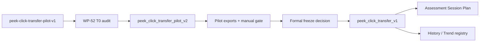

# 階段 K（stage11）提案 — Peek-click transfer pilot adjustment and formal release

> **狀態：🟡 WP-52 已交付（2026-09-01），WP-53 尚未開工。** 本階段把 WP-45 交付的 `peek-click-transfer-pilot-v1` 從 practice/pilot tool 推進到可由 evidence 支撐的正式 `peek_click_transfer_v1` Assessment。WP-52（pilot v2 調整/session wiring/evidence tooling）T0–T-exit 全數完成，但 WP-53 go/no-go 為 **No-go**——尚待真人 pilot 執行（見 [wp-52 T4-manual-pilot-gate.md](wp-52-peek-click-transfer-pilot-v2/T4-manual-pilot-gate.md)）。完整 task 狀態見 [task-checklist.md](task-checklist.md)，進度與決策紀錄見 [progress.md](progress.md)。

| | |
|---|---|
| **目標** | 先建立可調整且可稽核的 transfer pilot v2，再依 pilot evidence 發布正式 `peek_click_transfer_v1` |
| **資料來源** | `peek-ad-corridor-v1`、`peekClickTransferMetrics`、pilot session exports、人工 pointer-lock 走查 |
| **正式版政策** | 不原地覆寫 `peek-click-transfer-pilot-v1`；正式版使用新 drill id 與 assessment metadata |
| **Session Plan 政策** | pilot v2 可進 researcher/pilot session；正式 v1 才可進 Assessment history/trend/compatibility |
| **里程碑** | 暫定 M19：transfer pilot v2 evidence 與 `peek_click_transfer_v1` formal release gate 全數成立 |
| **狀態** | 🟡 WP-52 已交付；WP-53 尚未開始 T0（No-go，待真人 pilot） |

---

## 1. 已確認的產品決策

| # | 決策 | 結論 |
|---|---|---|
| D-S11-1 | `peek-click-transfer-pilot-v1` 是否原地改成正式版 | 不原地改；保留 WP-45 pilot-ready 紀錄與 drill id 語意 |
| D-S11-2 | pilot 調整方式 | 新增 `peek_click_transfer_pilot_v2`，用來承載調整後候選參數與人工驗證 |
| D-S11-3 | 正式發布方式 | 新增 `peek_click_transfer_v1`，`mode:'assessment'`，並有獨立 freeze decision |
| D-S11-4 | history/trend 政策 | pilot 不進正式 history/trend；正式 v1 才註冊 metric registry 與 compatibility key |
| D-S11-5 | composite score | stage11 不新增跨構念 composite score；transfer 指標維持分層呈現 |

---

## 2. 現況與缺口

WP-45 已交付：

- `peek_click_transfer_pilot_v1.ts`：1.5/2/3 deg candidates、2 deg researcher default、20 presentations、LR、spawn-anchored 3000 ms timeout。
- `peek-ad-corridor-v1`：左右對稱 self-motion exposure 場景。
- `derivePeekClickTransferMetrics()`：組裝 exposure、counter-strafe、first-shot 與 completion metrics，不產生 composite score。
- `transfer-pilot-v1` preset primitive：session 層已有三家族 roster，但操作端 UI 與 metadata wiring 有意識延後。

WP-52 已補上（2026-09-01）：

1. ✅ 調整後 pilot 參數的版本化來源：`peek_click_transfer_pilot_v2`，獨立 module/id/seed range，不覆寫 `pilot-v1`。
2. 🟡 真人 pointer-lock / 視覺手感 / timeout / 左右對稱 / flag rate evidence：checklist 文件已就緒（[T4-manual-pilot-gate.md](wp-52-peek-click-transfer-pilot-v2/T4-manual-pilot-gate.md)），**尚待真人執行**。
3. ✅ `SessionPlanSetup` family 允許清單與 `metadata.ts` allowlist 的既有缺口（GD-26 / KI-016）：已解決——KI-016 改單一來源允許清單；GD-26 拍板不重新引入 preset 下拉，改擴充既有自由 checkbox 家族清單。

仍需補上（WP-53 範圍）：

4. 正式 `peek_click_transfer_v1` 的 Assessment metadata、compatibility key、history/trend registry 與 E2E 保存驗證。
5. 文件上的 formal freeze decision：從 pilot evidence 到正式凍結值的可追溯理由。

---

## 3. Stage Data Flow



---

## 4. Scope

### In scope

- WP-52：新增調整後 pilot v2、pilot session wiring、evidence checklist 與 no-history guard。
- WP-53：新增正式 `peek_click_transfer_v1`、Assessment metadata、compatibility/history/trend/session integration。
- 修補讓 transfer family 能進 session metadata 的既有 blocking issue（KI-016）與 preset UI wiring gap（GD-26），但只在對應 task 明確驗收。

### Out of scope

- 原地修改 `peek-click-transfer-pilot-v1` 的既有語意或 drill id。
- 把 pilot 資料混入正式 Assessment history。
- 新增 Kovaak-style score、leaderboard、跨構念 composite score。
- 改寫 `hold-click-v1`、`counterstrafe-reversal-v1` 或 stage6 frozen protocol version。
- 基於未完成真人 pilot evidence 宣告正式 Assessment 採納。

---

## 5. Execution Order

```text
WP-52 T0 -> T1 -> T2 -> T3 -> T4 -> T-exit
                                      |
                                      v
WP-53 T0 -> T1 -> T2 -> T3 -> T4 -> T5 -> T-exit
```

- WP-53 T0 不得早於 WP-52 T-exit；formal freeze 必須引用 WP-52 evidence。
- WP-52 可先完成 KI-016/GD-26 的 pilot-session 操作端 wiring，但仍不得把 pilot 標記為 Assessment。
- WP-53 只發布正式版；不得回頭改 `pilot-v1` 或用同一 drill id 表達不同協定。

---

## 6. Stage Exit Gate

- [x] WP-52 T-exit 完成，包含調整後 pilot v2 automated tests、session wiring、manual evidence table（2026-09-01；manual evidence table 本身待真人回填，見 [T4-manual-pilot-gate.md](wp-52-peek-click-transfer-pilot-v2/T4-manual-pilot-gate.md)）。
- [ ] WP-53 T-exit 完成，包含正式 `peek_click_transfer_v1` Assessment run 可保存、瀏覽與進入 trend registry。
- [x] GD-26 已回寫為已解決（2026-09-01）；formal freeze GD 待 WP-53。
- [x] `known_issue/BUGFIX-DECISIONS.md` 與 KI-016 狀態與實作結果一致（已修復，2026-09-01）。
- [x] `CONTEXT.md` 對 WP-52 pilot v2 狀態同步；`docs/MAP.md`、`docs/exec-plan/README.md` 待 WP-53 T-exit 一併同步（stage 尚未整體完成）。
- [x] WP-52 範圍內 full CI 與 transfer-focused Playwright E2E 皆通過；WP-53 範圍待其自身 T-exit。
