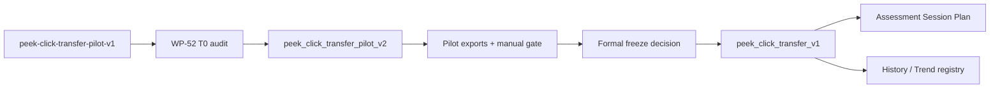

# 階段 K（stage11）— Peek-click transfer formal release + Tracking pilot capability test + Tracking observability

> **狀態：✅ M19（WP-52/WP-53）全數 T-exit 完成（2026-09-02）；🟡 M20（WP-54 tracking pilot）T0-T4 完成、T5 待開工（2026-09-02）；🟢 M21（WP-55 tracking on-target observability）T0-T5 完成、T6 待開工（2026-09-03）。** 本階段先把 WP-45 交付的 `peek-click-transfer-pilot-v1` 從 practice/pilot tool 推進到可由 evidence 支撐的正式 `peek_click_transfer_v1` Assessment（M19）；WP-52（pilot v2 調整/session wiring/evidence tooling）T0–T-exit 全數完成；WP-53 go/no-go 已由 No-go 改為 **Go**（人工 checklist 走查 + n=1 真人 evidence，見 [wp-52 T4-manual-pilot-gate.md](wp-52-peek-click-transfer-pilot-v2/T4-manual-pilot-gate.md)「Evidence collected」與全域 [DECISIONS.md GD-29](../../DECISIONS.md)）。formal Session Plan 整合（T4）已落地——新增獨立 `'peek-click-transfer-v1'` 家族，不改 stage6 default 四家族與 pilot 家族。E2E acceptance（T5）已完成——真實 counter-strafe round 跑到 `ended`、真存 history、trend 顯示真實 primary metric，並證實 FR-53-6 的 pilot/formal 隔離即使在強制條件下仍然成立。T-exit 已完成 full CI、focused E2E、operational/index docs sync 與 staged file audit。使用者於 2026-09-02 進一步確認正式接受 **WP-54 — Tracking Pilot Capability Test**（researcher/pilot-only，不發布正式 Assessment）納入 stage11，作為獨立 M20 里程碑；WP-54 T0-T4 已完成，詳見 [wp-54-tracking-pilot/README.md](wp-54-tracking-pilot/README.md) 與 [progress.md](wp-54-tracking-pilot/progress.md)。使用者於 2026-09-03 要求實作 **WP-55 — Tracking On-target Observability without Health** T0-T5；stage scope、no-health boundary、OQ-55-1~4、CodeGraph blast radius、baseline、contact geometry contract、deterministic export-derived JSON artifact、all tracking drill coverage、離線 replay contact trace 與 report/quality projection 已凍結，詳見 [wp-55-tracking-on-target-observability-no-health/README.md](wp-55-tracking-on-target-observability-no-health/README.md) 與 [progress.md](wp-55-tracking-on-target-observability-no-health/progress.md)。完整 task 狀態見 [task-checklist.md](task-checklist.md)，進度與決策紀錄見 [progress.md](progress.md)。

| | |
|---|---|
| **M19 目標** | 先建立可調整且可稽核的 transfer pilot v2，再依 pilot evidence 發布正式 `peek_click_transfer_v1` |
| **M19 資料來源** | `peek-ad-corridor-v1`、`peekClickTransferMetrics`、pilot session exports、人工 pointer-lock 走查 |
| **M19 正式版政策** | 不原地覆寫 `peek-click-transfer-pilot-v1`；正式版使用新 drill id 與 assessment metadata |
| **M19 Session Plan 政策** | pilot v2 可進 researcher/pilot session；正式 v1 才可進 Assessment history/trend/compatibility |
| **M19 狀態** | ✅ WP-52/WP-53 T-exit 完成；M19 達成（2026-09-02） |
| **M20 目標** | 建立可分離 acquisition／steady pursuit／reactive correction 的 tracking pilot，完成工程有效性、難度校準與 test-retest 證據（詳見 [wp-54-tracking-pilot/README.md](wp-54-tracking-pilot/README.md)） |
| **M20 交付定位** | Researcher/pilot-only；不發布正式 Assessment、常模、composite score 或自動處方 |
| **M20 狀態** | 🟡 WP-54 T0-T4 完成（2026-09-02）；T5（researcher session manifest/operator flow）待開工 |
| **M21 目標** | 讓現有 tracking drill 以同一 exact-hitbox contact artifact 重建每 tick `onTarget` / `epsilonDeg`，支援 export/replay/report 對表且不引入 health/damage lifecycle |
| **M21 交付定位** | Researcher/pilot evidence；不發布正式 Assessment，不把 hit/damage/kill 當 pure tracking 主指標 |
| **M21 狀態** | 🟢 WP-55 T0-T5 完成（2026-09-03）；T6（exit gate and documentation）待開工 |

---

## 1. 已確認的產品決策

| # | 決策 | 結論 |
|---|---|---|
| D-S11-1 | `peek-click-transfer-pilot-v1` 是否原地改成正式版 | 不原地改；保留 WP-45 pilot-ready 紀錄與 drill id 語意 |
| D-S11-2 | pilot 調整方式 | 新增 `peek_click_transfer_pilot_v2`，用來承載調整後候選參數與人工驗證 |
| D-S11-3 | 正式發布方式 | 新增 `peek_click_transfer_v1`，`mode:'assessment'`，並有獨立 freeze decision |
| D-S11-4 | history/trend 政策 | pilot 不進正式 history/trend；正式 v1 才註冊 metric registry 與 compatibility key |
| D-S11-5 | composite score | stage11 不新增跨構念 composite score；transfer 指標維持分層呈現 |
| D-S11-6 | WP-54（tracking pilot）是否納入 stage11 | 使用者於 2026-09-02 確認正式納入，作為獨立 M20 里程碑；不與 M19 peek-click-transfer 範圍或 drill id 混合 |
| D-S11-7 | WP-55（tracking on-target observability without health）是否納入 stage11 | 使用者於 2026-09-03 要求實作 T0，正式納入為 M21；第一版以 export 後 derived contact artifact 為主，不新增 health/HP/damage/kill tracking contract |

---

## 2. 現況與缺口

WP-45 已交付：

- `peek_click_transfer_pilot_v1.ts`：1.5/2/3 deg candidates、2 deg researcher default、20 presentations、LR、spawn-anchored 3000 ms timeout。
- `peek-ad-corridor-v1`：左右對稱 self-motion exposure 場景。
- `derivePeekClickTransferMetrics()`：組裝 exposure、counter-strafe、first-shot 與 completion metrics，不產生 composite score。
- `transfer-pilot-v1` preset primitive：session 層已有三家族 roster，但操作端 UI 與 metadata wiring 有意識延後。

WP-52 已補上（2026-09-01）：

1. ✅ 調整後 pilot 參數的版本化來源：`peek_click_transfer_pilot_v2`，獨立 module/id/seed range，不覆寫 `pilot-v1`。
2. ✅ 真人 pointer-lock / 視覺手感 / timeout / 左右對稱 / flag rate evidence：checklist 已由研究者本人逐項走查完成，並附 3 場真人 `peek_click_transfer_pilot_v2_masked` session evidence（2026-09-01，見 [T4-manual-pilot-gate.md](wp-52-peek-click-transfer-pilot-v2/T4-manual-pilot-gate.md)「Evidence collected」）。
3. ✅ `SessionPlanSetup` family 允許清單與 `metadata.ts` allowlist 的既有缺口（GD-26 / KI-016）：已解決——KI-016 改單一來源允許清單；GD-26 拍板不重新引入 preset 下拉，改擴充既有自由 checkbox 家族清單。

WP-53 已補上（2026-09-01，T1~T3）：

4. ✅ 正式 `peek_click_transfer_v1` 的 Assessment config（T1）、compatibility key/condition cell（T2）、history/trend registry（T3）——凍結值已由全域 [DECISIONS.md GD-29](../../DECISIONS.md) 拍板為正式值（非 provisional）。
5. ✅ 文件上的 formal freeze decision：見 GD-29（從 pilot evidence 到正式凍結值的可追溯理由）。

WP-53 已補上（2026-09-01，T4~T5）：

6. ✅ formal Session Plan 整合：新增獨立 `'peek-click-transfer-v1'` 家族（`SessionRunner`/`main.ts`），不改 stage6 default 四家族 roster 與 pilot 家族；即時 export 的 `meta.assessment.protocolVersion` 依 drillId 正確分派。
7. ✅ E2E 驗收：真實 counter-strafe round 跑到 `ended` → auto-save → history exact-drill list → trend registry 顯示 primary metric，含 stage6/pilot 全套回歸（81/81 Playwright passed）。FR-53-6 的 pilot/formal 隔離即使在強制 assessment override 條件下也驗證成立。

WP-53 T-exit 已補上（2026-09-02）：

8. ✅ operational docs（`CONTEXT.md`、`docs/operational/analysis-peek-click-transfer.md`、`docs/MAP.md`、`docs/exec-plan/README.md`）同步 + staged file audit；full CI 與 transfer-focused E2E exit 0。

---

## 3. Stage Data Flow



---

## 4. Scope

### In scope

- WP-52：新增調整後 pilot v2、pilot session wiring、evidence checklist 與 no-history guard。
- WP-53：新增正式 `peek_click_transfer_v1`、Assessment metadata、compatibility/history/trend/session integration。
- 修補讓 transfer family 能進 session metadata 的既有 blocking issue（KI-016）與 preset UI wiring gap（GD-26），但只在對應 task 明確驗收。
- WP-54（M20）：新增版本化、seeded tracking pilot trajectory/drill matrix、P0/P1 canonical metrics、eligibility/evidence pipeline 與 researcher session manifest；詳細 in/out scope 見 [wp-54-tracking-pilot/README.md §2.1](wp-54-tracking-pilot/README.md#21-system-boundary)。
- WP-55（M21）：新增 tracking on-target observability；以既有 raw export telemetry、target hitbox 與 eye origin 重建 exact-hitbox `onTarget`/`epsilonDeg` contact artifact，並支援 replay/report 對表；詳細 in/out scope 見 [wp-55-tracking-on-target-observability-no-health/README.md §2.1](wp-55-tracking-on-target-observability-no-health/README.md#21-system-boundary)。

### Out of scope

- 原地修改 `peek-click-transfer-pilot-v1` 的既有語意或 drill id。
- 把 pilot 資料混入正式 Assessment history。
- 新增 Kovaak-style score、leaderboard、跨構念 composite score。
- 改寫 `hold-click-v1`、`counterstrafe-reversal-v1` 或 stage6 frozen protocol version。
- 基於未完成真人 pilot evidence 宣告正式 Assessment 採納。
- WP-54：正式 tracking Assessment drill、正式 history/trend registry、跨玩家常模、composite score、tracking-specific SPARC；改寫或縮減 M19 peek-click-transfer 範圍。
- WP-55：血條、HP、damage、armor、weapon damage falloff、HP 歸零 respawn；把 hit count、damage 或 kill 當作 pure tracking 跟隨判定來源；產品 Replay overlay 第一版不列為必達。

---

## 5. Execution Order

```text
WP-52 T0 -> T1 -> T2 -> T3 -> T4 -> T-exit
                                      |
                                      v
WP-53 T0 -> T1 -> T2 -> T3 -> T4 -> T5 -> T-exit
```

- WP-53 T0 不得早於 WP-52 T-exit；formal freeze 必須引用 WP-52 evidence。
- WP-52 可先完成 KI-016/GD-26 的 pilot-session 操作端 wiring，但仍不得把 pilot 標記為 Assessment。
- WP-53 只發布正式版；不得回頭改 `pilot-v1` 或用同一 drill id 表達不同協定。

---

## 6. Stage Exit Gate（M19 — 已達成）

- [x] WP-52 T-exit 完成，包含調整後 pilot v2 automated tests、session wiring、manual evidence table（2026-09-01；manual evidence table 已由真人回填完成，見 [T4-manual-pilot-gate.md](wp-52-peek-click-transfer-pilot-v2/T4-manual-pilot-gate.md)「Evidence collected」）。
- [x] WP-53 T0 formal freeze 已拍板（2026-09-01，GD-29）；T1~T3（config/metadata-compatibility/registry）已轉正式凍結值。
- [x] WP-53 T-exit 完成，包含正式 `peek_click_transfer_v1` Assessment run 可保存、瀏覽與進入 trend registry（T0~T5 + 文件同步/驗證/audit 已完成，2026-09-02）。
- [x] GD-26 已回寫為已解決（2026-09-01）；formal freeze GD 已拍板（2026-09-01，GD-29）。
- [x] `known_issue/BUGFIX-DECISIONS.md` 與 KI-016 狀態與實作結果一致（已修復，2026-09-01）。
- [x] `CONTEXT.md` 對 WP-52 pilot v2 與 WP-53 formal v1 狀態同步；`docs/MAP.md`、`docs/exec-plan/README.md` 已於 WP-53 T-exit 同步。
- [x] WP-52 與 WP-53 範圍內 full CI 與 transfer-focused Playwright E2E 皆通過。

## 7. Stage Exit Gate（M20 — WP-54 tracking pilot，進行中）

> 完整逐項 gate 見 [wp-54-tracking-pilot/README.md §6](wp-54-tracking-pilot/README.md#6-m20-exit-gate)；此處僅追蹤高層狀態，不重複列出。

- [x] WP-54 T0：stage scope 正式接受、OQ-54-1~8 preregistration 凍結、CodeGraph impact、legacy baseline 全綠（2026-09-02）。
- [x] WP-54 T1：deterministic 2D pseudorandom/reversal trajectory kernel + export contract（2026-09-02）。
- [x] WP-54 T2：pilot drill matrix（practice/calibration/core 2×2/reversal density）+ protocol guards（2026-09-02）。
- [x] WP-54 T3：canonical P0/P1 metrics（lag/gain/drop/recovery/reversal）+ truth fixtures（2026-09-02）。
- [x] WP-54 T4：eligibility/evidence pipeline（closed quality-reason vocabulary、WP-54 compatibility key、deterministic JSON evidence、self-contained HTML report）（2026-09-02）。
- [ ] WP-54 T5：researcher session manifest/operator flow。
- [ ] WP-54 T6~T8：instrumentation／difficulty calibration／repeatability 三層 pilot gate（Gate A/B/C）。
- [ ] WP-54 T-exit：M20 evidence audit，go/revise/stop 結論。

## 8. Stage Exit Gate（M21 — WP-55 tracking observability，進行中）

> 完整逐項 gate 見 [wp-55-tracking-on-target-observability-no-health/README.md §6](wp-55-tracking-on-target-observability-no-health/README.md#6-m21-exit-gate)。

- [x] WP-55 T0：stage scope 正式接受、OQ-55-1~4 凍結、CodeGraph impact、no-health audit、legacy tracking baseline 50 tests 全綠（2026-09-03）。
- [x] WP-55 T1：contact geometry contract（2026-09-03）。
- [x] WP-55 T2：export-derived artifact（2026-09-03）。
- [x] WP-55 T3：all tracking drill coverage（2026-09-03）。
- [x] WP-55 T4：Replay observability / offline replay trace（2026-09-03）。
- [x] WP-55 T5：report and quality integration（2026-09-03）。
- [ ] WP-55 T6：exit gate and documentation。
- [ ] WP-55 T-exit：M21 evidence audit and handoff。
