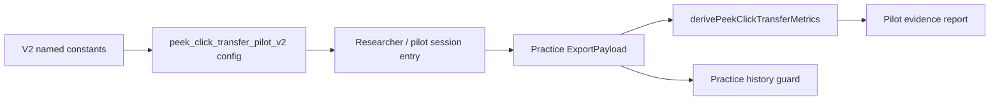

# WP-52 — Peek-click Transfer Pilot v2

> Stage spec：[../README.md](../README.md) · checklist：[task-checklist.md](task-checklist.md) · progress：[progress.md](progress.md)

| | |
|---|---|
| **目標** | 調整 `peek-click-transfer` pilot 設定，但保留 WP-45 `pilot-v1` 歷史語意，新增可驗證的 `peek_click_transfer_pilot_v2` |
| **里程碑** | Pilot v2 evidence-ready；不宣告正式 Assessment |
| **相依** | WP-45 T-exit；GD-26 / KI-016 作為 session wiring 前置缺口 |
| **估時** | 4-6 dev-days，不含真人 pilot 招募時間 |
| **狀態** | ✅ T0–T4/T-exit 完成（2026-09-01）；WP-53 go/no-go：**No-go**，待真人 pilot 執行（[T4-manual-pilot-gate.md](T4-manual-pilot-gate.md)） |

---

## 1. 需求壓縮 (Requirements)

### Functional Requirements

| ID | Requirement | 驗收摘要 | Task |
|---|---|---|---|
| FR-52-1 | 系統**必須**保留 `peek-click-transfer-pilot-v1` 的既有 drill id、參數語意與 researcher 可追溯性 | v1 tests 零修改全綠；v1 config 無 semantic diff | T0/T1 |
| FR-52-2 | 系統**必須**新增調整後 `peek_click_transfer_pilot_v2` config，且所有可調參數以具名常數宣告 | config builder tests 覆蓋 target size、timeout、count、sequence、visibility | T1 |
| FR-52-3 | 系統**必須**禁止 operator 在 UI 任意輸入未登記 pilot 參數 | UI 只消費具名 preset/candidate；無自由 numeric protocol input | T2 |
| FR-52-4 | 系統**必須**讓 pilot session 能選到 transfer family 並完成匯出，metadata 不因 `'peek-click-transfer'` family 失敗 | KI-016 regression test + transfer pilot session E2E | T2 |
| FR-52-5 | 系統**必須**產生 pilot evidence report，至少列出 completion rate、timeout rate、valid first shot rate、left/right balance、flag counts | synthetic + committed pilot export fixture 產出表格或 JSON report | T3 |
| FR-52-6 | 系統**必須**保證 pilot v2 不產生 `meta.assessment`、不被 WP-48/49 history/trend 當成正式 run | history guard test 證明 practice-only 排除 | T3/T4 |

### Non-functional Requirements

| ID | Requirement | 量化判準 | Task |
|---|---|---|---|
| NFR-52-1 決定性 | 同 seed/同 input timeline 在 60/120/240 Hz pump cadence 下 export tick/event snapshot deep-equal | focused determinism test 3 cadence 全綠 | T1 |
| NFR-52-2 左右對稱 | L/R exposure onset crossing 與 full exposure reachable 的差異不得超過 1 sim tick 的空間容差 | `peek-ad-corridor-v1` + v2 config parity test | T1 |
| NFR-52-3 可稽核 | pilot v2 export 必須包含 drill id、scene id、seed、hitbox、visibility、candidate label | metadata assertions 全綠 | T2/T3 |
| NFR-52-4 回歸範圍 | stage6四家族 Session Plan、WP-45 pilot-v1、history practice guard 均不得回歸 | focused suites + relevant Playwright pass | T-exit |

### Constraints

- 不修改 `peek-click-transfer-pilot-v1` 的既有 id 或把它改成 `mode:'assessment'`。
- 不修改 stage6 frozen drills 或 `STAGE6_PROTOCOL_VERSION`。
- 不新增 composite score。
- 調整後參數必須是具名常數或候選集合，不允許 operator runtime 任意調參。
- 若 session wiring 觸碰 `metadata.ts` / `SessionPlanSetup.ts` / `main.ts`，必須同時處理 GD-26 / KI-016，不得只接半條路。

### Open Questions

| ID | 問題 | 目前預設 | Owner | Deadline | Impact |
|---|---|---|---|---|---|
| OQ-52-1 | pilot v2 target angular size 是否仍保留 1.5/2/3 deg，或改成單一候選？ | 保留候選集合，T0 用 evidence 拍板 | 使用者 + 研究者 | T0 | T1 config |
| OQ-52-2 | timeout 是否維持 spawn-anchored 3000 ms，或改 split timeout？ | 維持 3000 ms，除非 T0 有明確 evidence | 使用者 + 研究者 | T0 | T1 state/config |
| OQ-52-3 | pilot v2 是否增加獨立 warmup drill？ | 不增加；沿用 WP-45 D-45.16 | 使用者 | T0 | T2 session flow |
| OQ-52-4 | minimum manual pilot evidence 要幾位 participant 才足以交給 WP-53？ | 暫不假設 | 研究者 | T4 | WP-53 T0 |

---

## 2. 系統架構與設計 (Technical Design)

### System Boundary

**In scope**

- `src/drill/peek_click_transfer_pilot_v2.ts`（新增）
- `src/drill/peek_click_transfer_pilot_v2.test.ts`（新增）
- `src/pilot/pilotConfigs.ts` / tests：新增 v2 pilot candidate builder
- `src/session/sessionSchedule.ts` / `SessionRunner.ts` / `sessionPlanPresets.ts`：必要時新增 v2 pilot roster/preset
- `src/ui/SessionPlanSetup.ts` / `src/main.ts` / `src/data/metadata.ts`：只為補齊 GD-26 / KI-016 session wiring
- `docs/operational/analysis-peek-click-transfer.md`：新增 v2 evidence section

**Out of scope**

- `peek_click_transfer_v1` formal Assessment config
- history/trend formal registry
- compatibility key 正式版本
- composite score 或 ranking UI

### Data Flow



### Interface Contracts

```ts
export const PEEK_CLICK_TRANSFER_PILOT_V2_ID = 'peek_click_transfer_pilot_v2';

export interface PeekClickTransferPilotV2Config {
  readonly id: string;
  readonly sceneId: 'peek-ad-corridor-v1';
  readonly drill: DrillConfig; // mode:'practice'
  readonly clearanceOptions: ClearanceOptions;
  readonly visibility: { readonly sampleCount: 9; readonly onsetThreshold: 0.5 };
  readonly candidateLabel: string;
}

export function buildPeekClickTransferPilotV2Config(): PeekClickTransferPilotV2Config;
```

Error 情境：

- 未登記 candidate 不能從 UI 傳入 builder。
- scene 與 hitbox distance 若不符合 `peek-ad-corridor-v1` invariants，T1 tests 必須 fail。
- pilot v2 export 若含 `meta.assessment`，history guard test 必須 fail。

### Failure Modes

| ID | 觸發條件 | 影響範圍 | 處理策略 |
|---|---|---|---|
| FM-52-1 | 原地改 `pilot-v1` 導致舊 evidence 與新設定同 id | 研究追溯與 compatibility | T0 git diff audit；T1 建新檔新 id |
| FM-52-2 | session UI 接入 transfer family 但 metadata allowlist 未放寬 | 匯出中段 throw | T2 先修 KI-016 regression，再接 UI |
| FM-52-3 | pilot v2 太難或太簡單，timeout/validFirstShot 分布不可用 | WP-53 freeze 無依據 | T3 evidence report + T4 manual gate，不自動進 WP-53 |
| FM-52-4 | pilot practice 被 auto-save 成 history | history/trend 污染 | T3/T4 practice guard tests |

### Concurrency Model

不新增 concurrency model。所有變更沿用既有 render/sim/session runner 流程；pilot evidence report 為離線純函式或測試 fixture，不新增 worker/thread/channel。

---

## 3. 風險分析 (Risk Analysis)

| Risk | 等級 | 說明 | 對策 |
|---|---|---|---|
| Session wiring 觸碰 `main.ts` / metadata / UI | High | 現有 GD-26/KI-016 已指出半接線會讓 export fail | T2 垂直切片一次補齊 validator、UI、metadata tests |
| Pilot v2 參數沒有真人 evidence | High | 會讓 WP-53 formal freeze 失去依據 | T4 manual gate 是 WP-53 前置條件 |
| v1/v2/published v1 id 混淆 | Med | 同一 family 多版本易被 history 合併 | drill id exact-match policy + explicit docs |
| Technical debt：暫不新增 warmup | Low | WP-45 已決議 transfer 無 warmup | 若 pilot evidence 顯示需要，另開 v2.1/v3 task |

---

## 4. 任務拆解 (Task Breakdown)

| Task | Objective | Dependencies | Risk | Complexity | Definition of Done |
|------|-----------|--------------|------|------------|---------------------|
| T0 | Entry gate／v1 audit／參數候選拍板 | WP-45 T-exit | High | Med | CodeGraph impact 記錄；v1 config/tests baseline 綠燈；OQ-52-1~3 有決議；不修改 production code |
| T1 | 新增 `peek_click_transfer_pilot_v2` config 與 deterministic contract | T0 | High | Med | v2 config builder tests 覆蓋 id、scene、hitbox、timeout、visibility、seed；60/120/240 Hz deterministic test 通過；v1 tests 零修改全綠 |
| T2 | Pilot session preset UI + metadata unblock | T1 + KI-016/GD-26 | High | High | session family allowlist 單一來源；操作者能把 `'peek-click-transfer'` 排進 Session Plan；transfer pilot session E2E 匯出不 throw（實際落地方式見 [progress.md D-52.7](progress.md) / [DECISIONS.md GD-26](../../../DECISIONS.md)：擴充既有自由 checkbox 家族清單，不重新引入 preset 下拉——WP-43 FR-H3 已移除且有 E2E 鎖定；`sessionPlanPreset` 匯出欄位不在此次範圍） |
| T3 | Pilot evidence harness/report | T1-T2 | Med | Med | report 產出 completion/timeout/validFirstShot/LR/flag counts；至少一組 committed synthetic fixture；practice history guard tests 通過 |
| T4 | Manual pilot gate and documentation | T3 | High | Med | manual checklist 記錄 pointer-lock、視覺手感、timeout、左右對稱；`analysis-peek-click-transfer.md` 新增 v2 evidence；WP-53 go/no-go 明確 |
| T-exit | Pilot v2 acceptance and handoff | T1-T4 | Med | Low | focused tests + relevant Playwright + typecheck 通過；stage11/progress 更新；若改 code 已執行 `graphify update .`；WP-53 T0 所需 evidence links 完整 |

---

## Assumptions

- 使用者要先調整 pilot，再正式發布；因此 WP-52 不會直接建立 `mode:'assessment'`。
- stage10 history/trend contract 若尚未完成，WP-52 不受阻；WP-53 的 history/trend task 會等待對應 contract。
