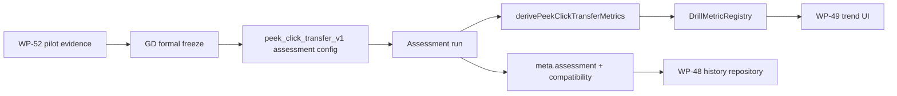

# WP-53 — Peek-click Transfer v1 Formal Release

> Stage spec：[../README.md](../README.md) · checklist：[task-checklist.md](task-checklist.md) · progress：[progress.md](progress.md)

| | |
|---|---|
| **目標** | 根據 WP-52 pilot evidence 凍結並發布正式 `peek_click_transfer_v1` Assessment |
| **里程碑** | Formal `peek_click_transfer_v1` 可進 Assessment Session Plan、history、trend registry |
| **相依** | WP-52 T-exit；stage10 history/trend contract（WP-48/WP-49）可用 |
| **估時** | 5-8 dev-days，不含額外 pilot 資料收集 |
| **狀態** | ✅ T-exit 完成（2026-09-02） |

---

## 1. 需求壓縮 (Requirements)

### Functional Requirements

| ID | Requirement | 驗收摘要 | Task |
|---|---|---|---|
| FR-53-1 | 系統**必須**在 formal freeze decision 存在後才新增 `peek_click_transfer_v1` | T0 檢查 WP-52 evidence links 與 GD freeze 條目 | T0 |
| FR-53-2 | 系統**必須**新增獨立 `peek_click_transfer_v1` config，`mode:'assessment'`，不沿用 pilot drill id | config tests 覆蓋 formal id、mode、凍結參數 | T1 |
| FR-53-3 | 系統**必須**為正式 transfer run 產生完整 `meta.assessment` 與 compatibility key | metadata/compatibility tests 通過 | T2 |
| FR-53-4 | 系統**必須**註冊 transfer formal metrics，使 exact `drillId='peek_click_transfer_v1'` 可在 history/trend 投影 | `DrillMetricRegistry` tests ready；unregistered 狀態不再出現在 formal id | T3 |
| FR-53-5 | 系統**必須**提供正式 Session Plan 路徑執行 `peek_click_transfer_v1`，且不污染 stage6 default four-family roster | session schedule/preset tests 與 E2E 通過 | T4/T5 |
| FR-53-6 | 系統**必須**保證 pilot v1/v2 仍維持 practice-only 且不進正式 history/trend | negative tests 覆蓋 pilot ids | T3/T5 |

### Non-functional Requirements

| ID | Requirement | 量化判準 | Task |
|---|---|---|---|
| NFR-53-1 compatibility 穩定性 | 相同 participant/drill/protocol/target cell 產生相同 compatibility key；任一凍結參數變更會改變 target condition cell 或 protocol version | compatibility tests 全綠 | T2 |
| NFR-53-2 history persistence | 完成一場 formal run 後，WP-48 repository 可保存並重新讀取完整 JSON | API/repository E2E 通過 | T3/T5 |
| NFR-53-3 exact drill isolation | `peek_click_transfer_v1` 不與 pilot v1/v2 或未來 v2 formal 合併 history cohort | registry/history tests 覆蓋 exact id | T3 |
| NFR-53-4 regression | stage6 default session、WP-45 pilot、stage10 history UI 不回歸 | focused + CI + Playwright pass | T-exit |

### Constraints

- WP-53 不得在 WP-52 T-exit evidence 缺失時開工。
- 不改 `peek_click_transfer_pilot_v1` / `peek_click_transfer_pilot_v2` 的 `mode:'practice'`。
- 不新增 composite score；formal metrics 仍分層呈現。
- 不修改 stage6 v1 四家族 default roster；若加入第五家族，必須是新的 formal roster/preset。
- history/trend 必須使用 exact drill id，不以 family id 合併。

### Open Questions

| ID | 問題 | 目前預設 | Owner | Deadline | Impact |
|---|---|---|---|---|---|
| OQ-53-1 | Formal release 的 protocol version 字串如何命名？ | `peek-click-transfer-v1.0.0` | 使用者 + 研究者 | T0 | T1/T2 |
| OQ-53-2 | 正式 Session Plan 要採第五家族加入現有 Assessment，或新增 transfer-only / transfer-battery plan？ | 新增獨立 formal transfer preset，不改 stage6 default | 使用者 | T0 | T4 |
| OQ-53-3 | Formal primary trend metric 要選哪幾個？ | `validFirstShotRate` + median `onsetToHitMs` | 使用者 + 研究者 | T3 | T3 |
| OQ-53-4 | 是否需要最低 participant n 才能宣告 formal v1？ | 由 WP-52 T4 決定 | 研究者 | T0 | T0 |

---

## 2. 系統架構與設計 (Technical Design)

### System Boundary

**In scope**

- `src/drill/peek_click_transfer_v1.ts`（新增 formal config）
- formal assessment metadata wiring in `main.ts` / metadata helpers
- `src/metrics/compatibilityKey.ts` / formal target condition cell integration
- `src/history/DrillMetricRegistry.ts`：exact drill registration for `peek_click_transfer_v1`
- `src/session/sessionSchedule.ts` / `SessionRunner.ts` / `sessionPlanPresets.ts` / `SessionPlanSetup.ts`：formal session/preset wiring
- E2E：formal run save → history listing → trend projection
- `CONTEXT.md` / `DECISIONS.md` / operational docs

**Out of scope**

- 更動 pilot v1/v2 的既有資料語意
- formal v2 或多版本 migration
- 影片匯出、leaderboard、composite score
- 新 gameplay mechanics beyond WP-45 transfer task

### Data Flow



### Interface Contracts

```ts
export const PEEK_CLICK_TRANSFER_PROTOCOL_VERSION = 'peek-click-transfer-v1.0.0';
export const peekClickTransferV1: DrillConfig; // drillId:'peek_click_transfer_v1', mode:'assessment'

export interface PeekClickTransferFormalConditionCell {
  readonly angularSizeDeg: number;
  readonly distanceU: number;
  readonly timeoutMs: number;
  readonly targetCount: number;
  readonly visibilitySampleCount: 9;
  readonly visibilityOnsetThreshold: 0.5;
}

export function buildPeekClickTransferV1ConditionCell(): string;
```

Registry contract：

```ts
const PEEK_CLICK_TRANSFER_V1_REGISTRATION: DrillMetricRegistration = {
  drillId: 'peek_click_transfer_v1',
  version: 'peek-click-transfer-registry-v1',
  descriptors: [...],
  project(payload: ExportPayload): readonly MetricObservation[],
};
```

Error 情境：

- `meta.assessment` 缺失時，compatibility build 必須 throw，避免 practice 被誤投影。
- payload drill id 不等於 `peek_click_transfer_v1` 時，formal registry 不得接受。
- frozen condition cell 缺欄或與 config 不一致時，tests 必須 fail。

### Failure Modes

| ID | 觸發條件 | 影響範圍 | 處理策略 |
|---|---|---|---|
| FM-53-1 | 沒有 WP-52 evidence 就發布正式版 | 研究效度與文件可信度 | T0 freeze gate 阻擋 |
| FM-53-2 | 正式 id 與 pilot id 混用 | history/trend cohort 污染 | exact id tests + negative pilot tests |
| FM-53-3 | compatibility key 漏掉凍結參數 | 不同條件被誤視為可比較 | condition cell 包含 target size/distance/timeout/visibility/count |
| FM-53-4 | formal run 沒有 `meta.assessment` | WP-48 不保存或 WP-49 無法 trend | metadata tests + E2E save path |
| FM-53-5 | 加入 session plan 時改壞 stage6 default roster | 既有 Assessment 回歸 | golden order tests + separate formal preset |

### Concurrency Model

不新增 concurrency model。History save 沿用 WP-48 fire-and-forget persistence；本 WP 只要求 formal run 符合 assessment/history contract，不改寫 persistence state machine。

---

## 3. 風險分析 (Risk Analysis)

| Risk | 等級 | 說明 | 對策 |
|---|---|---|---|
| Formal freeze 依據不足 | High | 沒有足夠 pilot evidence 會讓正式版只是改名 | T0 必須引用 WP-52 T4/T-exit evidence |
| Compatibility key 漏條件 | High | 會把不可比較 run 混入 trend | T2 condition cell tests + registry projection tests |
| History/trend integration blast radius | High | 觸碰 WP-48/49 熱區與既有 unregistered drill 行為 | T3 focused tests + E2E |
| Session Plan 改動污染 default roster | High | stage6 default Assessment 流程漂移 | T4/T5 golden cases byte-for-byte/deep-equal |
| Technical debt：primary metric 初版有限 | Med | transfer metric 可能未涵蓋全部研究問題 | descriptors 保留可擴充；新增 metric 需 registry version bump |

---

## 4. 任務拆解 (Task Breakdown)

| Task | Objective | Dependencies | Risk | Complexity | Definition of Done |
|------|-----------|--------------|------|------------|---------------------|
| T0 | Freeze decision gate | WP-52 T-exit | High | Med | `DECISIONS.md` draft/entry 包含 evidence links、frozen params、alternatives；OQ-53-1~4 有結論；未通過則不得進 T1 |
| T1 | Formal Assessment drill config | T0 | High | Med | `peek_click_transfer_v1` config tests 覆蓋 id/mode/scene/count/timeout/visibility/hitbox；pilot v1/v2 tests 仍全綠 |
| T2 | Assessment metadata and compatibility | T1 | High | High | formal run 產生 `meta.assessment`；condition cell 包含所有凍結比較條件；compatibility positive/negative tests 通過 |
| T3 | Metric registry and history/trend projection | T2 + WP-49 contract | High | High | `DrillMetricRegistry` 註冊 exact formal id；primary descriptors 決議並測試；pilot ids 仍 unregistered 或 practice-excluded；history analysis tests 通過 |
| T4 | Formal Session Plan integration | T2-T3 | High | Med | 新 formal preset/roster 不改 stage6 default；SessionRunner 可 resolve formal transfer；SessionPlanSetup 可選 formal preset |
| T5 | E2E acceptance and regression | T1-T4 | High | High | Playwright 完成 formal transfer run save → history list → trend projection；stage6 session plan、pilot session、practice history guard 零回歸 |
| T-exit | Formal release docs and M19 gate | T1-T5 | Med | Low | `CONTEXT.md`、`DECISIONS.md`、`docs/MAP.md`、exec-plan index 更新；full CI pass；若改 code 已執行 `graphify update .`；staged file audit clean |

---

## Assumptions

- WP-52 會產出足以支撐 formal freeze 的 evidence；若沒有，WP-53 T0 應停止並回到 pilot 調整。
- Stage10 history/trend infrastructure 若仍未完成，WP-53 T3/T5 必須等待或縮小為 formal config-only release，不能假裝 history/trend 已可用。
