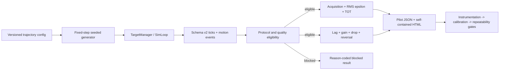

# WP-54 候選計畫 — Tracking 能力測試與 Pilot 執行

> **狀態：🟡 規劃完成，尚未納入 stage11 master checklist、尚未開工。** 這是一份可獨立排程的候選 WP。stage11 目前已由 WP-52／WP-53 定義為 peek-click transfer；若決定把本計畫正式排入 stage11，T0 必須先更新 [stage11 README](README.md)、[master checklist](task-checklist.md) 與 [progress log](progress.md)，不得只實作本文件中的程式項目。

| | |
|---|---|
| **目標** | 建立能分離 acquisition、steady pursuit、reactive correction 的 tracking pilot，完成工程有效性、難度校準與 test–retest 證據 |
| **主要使用者** | 電競表現教練、研究者、測試操作員；受測者為 FPS 選手 |
| **交付定位** | Researcher／pilot-only；不直接發布正式 Assessment、常模、總分或自動處方 |
| **上游基線** | `tracking_v1`、schema v2、`deriveTrackingMetrics()`、`deriveTrackingTransitions()`、stage10 history/result 基礎 |
| **估時** | 12–18 dev-days，另加招募與兩次真人施測的日曆時間 |
| **里程碑** | 暫定 M20：tracking pilot 的刺激、資料、指標與 repeatability exit gate 全數成立 |
| **規劃日期** | 2026-08-31 |

---

## 1. 執行摘要

本計畫不把現有 `tracking_v1` 直接改名成正式 tracking assessment。現有 drill 是可預測的單軸水平往返，適合做 baseline 與儀器 sanity check，但不足以代表完整 tracking 能力。第一版 pilot 應保留它，另外新增兩種版本化刺激：

1. `tracking_core_pr_pilot_v1`：2D、band-limited、可由 seed 完整重建的 pseudorandom trajectory，用來量 steady pursuit。
2. `tracking_reversal_pilot_v1`：有限加速度、變向時間與方向不可預測的 trajectory，用來量 reactive correction。

核心報告預註冊 `RMS(ε)` 為 pursuit primary，並列 `TOT%`、acquisition failure／`tAcquire`。lag、velocity gain、drop／reacquire 與 reversal response 是診斷指標；SPARC 僅保留在後續研究層，不能先進主結果或 composite score。

執行順序固定為：**合成真值 → 決定性與資料完整性 → 小規模 instrumentation pilot → 真人難度校準 → 兩次 session 的 repeatability pilot**。任何前一層失敗都不得用增加受測者數來掩蓋。

設計依據：

- [Tracking drill／metrics pilot research](../../../algorithm/tracking_pilot/tracking-ability-drill-and-metrics-pilot-research-2026-08-31.md)
- [Tracking metrics offline derivation](../../../operational/analysis-tracking.md)
- [Per-segment SPARC + Tracking guide](../../../algorithm/metrix_design/per-segment-sparc-tracking-guide-2026-05-21.md)
- [WP-18 tracking drill + metrics spec](../../completed/stage2/wp-18-f5-subtick/T4-tracking-drill-metrics-spec.md)
- [WP-23 long-range tracking](../../completed/stage5/wp-23-longrange-tracking/README.md)

---

## 2. 已確認的產品與研究決策

| ID | 決策 | 理由 |
|---|---|---|
| D-54.1 | 不原地改寫 `tracking_v1` | 保留既有 baseline、fixture 與 drill id 的歷史語意 |
| D-54.2 | Pure tracking 期間玩家靜止、禁用 ADS、禁用射擊 | 避免 movement、weapon、lead、recoil 污染 pursuit construct |
| D-54.3 | Scored block 內不做 adaptive difficulty | 保持同一 block 的刺激與樣本同質；調整只發生在 block 之間 |
| D-54.4 | `RMS(ε)` 是 primary，TOT 是並列可解釋指標 | RMS 對大偏差敏感；TOT 對命中幾何直覺，但受 target size 影響 |
| D-54.5 | Acquisition 與 pursuit 分開報告 | 未取得目標不是缺失值，但不得把 acquisition 過程混入 pursuit 聚合 |
| D-54.6 | Pilot 不產生正式 composite score、好壞門檻或全球常模 | 在 reliability 與 validity 證據完成前，合成分數會製造錯誤精確感 |
| D-54.7 | `hold_track_v1`、BR tracking、player-strafe tracking 只作 transfer test | 這些 drill 混入不同遊戲構念，不回寫 pure tracking 結論 |
| D-54.8 | 現行 primary-flick `sparc-v1` 不直接重用 | tracking smoothness 需要不同 window、stimulus control 與 metric version |

---

## 3. 需求壓縮（Requirements）

### 3.1 Functional Requirements

| ID | Requirement | 驗收摘要 | Task |
|---|---|---|---|
| FR-54-1 | 系統**必須**保留 `tracking_v1`、`tracking_longrange_v1` 與 `tracking_br_v1` 的既有 drill id 與行為 | 既有 deterministic／metrics tests 不改 expected values 且全綠 | T0、T1、T2 |
| FR-54-2 | 系統**必須**以版本化、seeded、固定 sim clock 的方式產生 2D band-limited pseudorandom trajectory | 同 config／seed 的逐 tick target position 在 60／120／240 Hz render pump 下 deep-equal | T1 |
| FR-54-3 | 系統**必須**產生有限加速度的隨機 reversal trajectory，並讓每個 change event 可由 export 還原 | event time、前後 angular velocity 與逐 tick position 可對表 | T1 |
| FR-54-4 | 系統**必須**提供版本化的 size × speed core condition matrix，且 scored block 內條件固定 | export 可辨識 motion version、seed、angular size、speed cell 與 duration | T2 |
| FR-54-5 | 系統**必須**在正式計分前提供不入分析的 practice，並讓 target 與 crosshair 先完成初始對準 | practice 不寫入 scored aggregation；scored start event 可稽核 | T2、T5 |
| FR-54-6 | 系統**必須**沿用 canonical hit geometry 推導 acquisition failure、`tAcquire`、TOT、RMS／median／P95 `ε` | perfect follower、never acquire、known onset fixtures 回復已知答案 | T3 |
| FR-54-7 | 系統**必須**推導有明確正負號契約的 tracking lag、velocity gain 與 velocity residual | fixed-lag／gain fixtures 誤差在預註冊容差內 | T3 |
| FR-54-8 | 系統**必須**推導 drop rate、completed reacquire duration、terminal-censored drop 與 longest off-target streak | terminal drop 不被填成假的 reacquire duration | T3 |
| FR-54-9 | 系統**必須**對 reversal block 推導 response latency、peak error／overshoot 與 settling time，且只在有效 change event 上計算 | synthetic reversal fixtures 與 event window isolation tests 全綠 | T3 |
| FR-54-10 | 系統**必須**先判定資料 eligibility，再產生能力解讀；不合格 run 仍輸出原因但不進聚合 | overflow、missing target、timestamp、coverage、protocol mismatch 均有封閉 reason code | T4 |
| FR-54-11 | 系統**必須**產生一份可稽核的 pilot evidence artifact，至少包含 condition、n／duration、品質狀態、primary／diagnostic metrics 與 seed 統計 | 同一 export 重跑產物 deterministic；表格可追到 run id | T4 |
| FR-54-12 | 系統**必須**支援 counterbalanced block order、固定 rest、重跑原因與兩次 session protocol | session manifest 可重建每位受測者的 block order 與排除理由 | T5、T7、T8 |
| FR-54-13 | 系統**必須**在 M20 前完成 instrumentation、difficulty calibration 與 repeatability 三層 gate | 三份 evidence 均有資料版本、分析版本與 go／revise／stop 結論 | T6、T7、T8、T-exit |

### 3.2 Non-functional Requirements

| ID | Requirement | 量化判準 | Task |
|---|---|---|---|
| NFR-54-1 決定性 | motion 與 export 不得依 render FPS 或 wall clock 漂移 | 同 seed／input 在 60／120／240 Hz pump 的 tick target positions、motion events、metrics deep-equal | T1–T4 |
| NFR-54-2 時序精度 | synthetic lag／event timing 誤差不得超出 fixed-step 可解析度 | `abs(estimated − truth) <= 1 / simHz` 秒；報告同時揭露 tick quantization | T3 |
| NFR-54-3 數值精度 | perfect follower 與已知 gain fixture 必須回復真值 | RMS `ε <= 1e-6°`；TOT `= 100%`；`abs(gain − truth) <= 0.02` | T3 |
| NFR-54-4 資料完整性 | Eligible run 不得含靜默缺口 | target telemetry missing count、non-monotonic timestamp、buffer overflow 均為 0；scored tick coverage `>= 99.5%` | T4 |
| NFR-54-5 可追溯性 | 每個結果必須能重建刺激與分析 | artifact 含 drill id、trajectory version、seed、condition cell、simHz、metric version、analysis commit、run id | T2–T4 |
| NFR-54-6 效能隔離 | 不在 sim 熱路徑計算分析指標或產生每 tick 新配置 | metrics 全在 export 後計算；motion 熱路徑通過現有 GC／determinism tests | T1、T3 |
| NFR-54-7 相容性 | 不同 protocol／device-critical 設定不得混成同一比較 cohort | compatibility key 至少區分 drill、protocol、motion、size、speed、FOV、sensitivity、input mode | T4、T8 |
| NFR-54-8 可存取性 | 操作員可只用鍵盤完成 pilot 控制，品質與狀態不只靠顏色表達 | focused a11y test + 人工 keyboard walkthrough | T5 |

### 3.3 Constraints

- schema v2 raw ticks/events 仍是事實來源；sim 不儲存衍生能力分數。
- 目標運動只讀 fixed-step sim age 與 seeded config，不讀 `Date.now()`、`performance.now()` 或 `Math.random()`。
- Scored block 禁止射擊、ADS 與玩家移動；若偵測到對應輸入，run 標記 protocol violation。
- 不把 acquisition failure 填補成極大 RMS／TOT=0 後混入 pursuit mean；兩者分開報告。
- 不把 terminal drop 的剩餘時間當成完成 reacquire duration。
- 不用 target size 正規化值取代原始 degree error 與 exact-hitbox TOT。
- Pilot 資料不得自動進正式 Assessment history／trend；正式發布另立後續 WP 與 drill id。

### 3.4 Open Questions

| ID | 問題 | 目前規劃預設 | Owner | Deadline | Impact |
|---|---|---|---|---|---|
| OQ-54-1 | 本輪是只做 steady pursuit，還是 steady＋reactive 並列？ | 兩者並列但分開報告 | 使用者＋研究者 | T0 | T1–T8 scope |
| OQ-54-2 | Core matrix 是否直接沿用 `2.0°／0.5° × 5°/s／20°/s`？ | 作為 calibration candidates，不視為正式凍結值 | 研究者 | T0 | T2 config |
| OQ-54-3 | 每個 scored block 採 20、25 或 30 秒？ | 25 秒；Stage B 檢查 time-on-task slope | 研究者 | T0 | T2、T5、T7 |
| OQ-54-4 | Lag 搜尋範圍、平滑器與 ambiguity gate 為何？ | `0–250 ms`、離線固定係數平滑；週期多峰則 blocked | 指標 owner | T0 | T3 metric contract |
| OQ-54-5 | Repeatability 的最低證據門檻為何？ | 暫定 primary RMS：ICC(A,1) point `>= 0.75` 且 95% CI lower bound `>= 0.60`；須於收資料前確認 | 使用者＋研究者 | T6 前 | T8、M20 |
| OQ-54-6 | 真人 pilot 的招募數與 session 間隔？ | Stage B 先 12–20 人；Stage C 目標 20–30 人、相隔 24–72 小時，最終 N 由 precision analysis 凍結 | 研究者 | T6 前 | T7、T8 日曆與可信度 |
| OQ-54-7 | Pilot evidence artifact 只做研究 HTML／JSON，或同步進產品 Result 頁？ | 先離線 self-contained HTML＋JSON；產品 Result UI 另立 WP | 產品 owner | T0 | T4 scope |
| OQ-54-8 | 是否需要 tracking-specific SPARC？ | 本 WP 不做；M20 後另立 `tracking-sparc-v1` 研究 | 指標 owner | T-exit | 後續診斷 |

---

## 4. 系統架構與技術設計（Technical Design）

### 4.1 現況與缺口

- `tracking_v1` 已有單一 moving target、timed presentation 與 schema v2 telemetry，但 motion 是可預測的單軸 pingpong。
- `TargetMotion` 與 `motionOffset()` 目前只實作單軸 `linear`／`pingpong`／`sine`；`waypoints` 尚未驅動，沒有 2D pseudorandom 或 versioned reversal schedule。
- `deriveTrackingMetrics()` 已定義 canonical acquisition window、exact-hitbox TOT 與 RMS／median／P95 `ε`。
- `deriveTrackingTransitions()` 已有 drop count 與 completed reacquire durations，但還缺每秒率、terminal censor count 與 longest streak。
- `ResultPresentation` 只對 `hold_track_v1` 建立有限診斷；一般 tracking 尚無專屬 result model。
- 現有 SPARC／tracking classifier 以另一份 schema 與 flick segment 為主，不可直接當本 pilot 的 pursuit smoothness。

### 4.2 System Boundary

**In scope**

- 版本化 2D pseudorandom／reversal trajectory contract、schema validation 與 deterministic runtime。
- Practice、axis calibration、core 2 × 2、reactive blocks 的 pilot configs。
- Export metadata／motion-change events 的 additive contract。
- P0／P1 metrics、quality eligibility、synthetic truth fixtures 與 pilot evidence report。
- Researcher-only session manifest／runner 支援、instrumentation、difficulty calibration、repeatability 分析。

**Out of scope**

- 正式 Assessment drill、正式 history／trend registry 與跨玩家常模。
- Composite score、leaderboard、自動訓練處方或「好／普通／差」標籤。
- BR／ADS／projectile／recoil／player movement 的正式效度驗證。
- Tracking-specific SPARC／LDLJ promotion。
- 重寫既有 stage11 WP-52／WP-53。

### 4.3 Data Flow



### 4.4 Proposed Interface Contracts

下列路徑與名稱是規劃介面，不是既成程式碼；T0 必須先用 CodeGraph impact 確認 blast radius，再凍結實際檔名。

```ts
export type TrackingTrajectoryConfig =
  | {
      readonly kind: 'band-limited-2d-v1';
      readonly seed: number;
      readonly durationMs: number;
      readonly yawBoundDeg: number;
      readonly pitchBoundDeg: number;
      readonly targetRmsSpeedDegPerSec: number;
      readonly frequencyBandHz: readonly [number, number];
    }
  | {
      readonly kind: 'reversal-2d-v1';
      readonly seed: number;
      readonly durationMs: number;
      readonly angularBoundsDeg: readonly [number, number];
      readonly speedRangeDegPerSec: readonly [number, number];
      readonly reversalIntervalMs: readonly [number, number];
      readonly accelerationRampMs: number;
    };

export interface TrackingTrajectorySample {
  readonly yawDeg: number;
  readonly pitchDeg: number;
  readonly yawVelocityDegPerSec: number;
  readonly pitchVelocityDegPerSec: number;
}

export interface TrackingMotionChangeEvent {
  readonly type: 'target_motion_change';
  readonly t: number;
  readonly targetId: string;
  readonly fromVelocityDegPerSec: readonly [number, number];
  readonly toVelocityDegPerSec: readonly [number, number];
  readonly rampMs: number;
  readonly eventIndex: number;
}

export interface TrackingTrajectory {
  sample(ageSec: number, out: MutableTrackingTrajectorySample): void;
  readonly changes: readonly PrecomputedTrackingChange[];
}

export function createTrackingTrajectory(config: TrackingTrajectoryConfig): TrackingTrajectory;
```

Runtime contract：

- `createTrackingTrajectory()` 只在 load／reset 的低頻路徑預先建立 schedule；`sample()` 在每 tick 就地寫入 caller-owned buffer，不配置物件。
- 所有 position／velocity 都是 `(config, seed, age)` 的純函式結果。
- Target 世界座標由角度與固定 distance 決定性轉換；export 同時保留逐 tick target center，使分析不必重跑 generator 才能計算 P0。
- `target_motion_change` 是 additive event；舊 export reader 遇到未知 additive event 必須依既有 schema 政策明確處理，不得靜默錯配 event union。

```ts
export interface TrackingDynamicsOptions {
  readonly version: 'tracking-dynamics-v1';
  readonly lagSearchMs: readonly [number, number];
  readonly smoothingVersion: string;
  readonly minValidTicks: number;
  readonly correlationAmbiguityRatio: number;
}

export type TrackingDynamicsResult =
  | {
      readonly status: 'ok';
      readonly lagMs: number;
      readonly velocityGain: number;
      readonly velocityRmseDegPerSec: number;
      readonly signedYawBiasDeg: number;
      readonly signedPitchBiasDeg: number;
      readonly dropRatePerSec: number;
      readonly reacquireMedianMs?: number;
      readonly completedReacquireCount: number;
      readonly terminalDropCount: number;
      readonly longestOffTargetMs: number;
    }
  | {
      readonly status: 'blocked';
      readonly reason:
        | 'insufficient-valid-ticks'
        | 'no-acquisition'
        | 'lag-peak-ambiguous'
        | 'missing-target-telemetry'
        | 'protocol-incompatible';
    };

export function deriveTrackingDynamics(
  payload: ExportPayload,
  options: TrackingDynamicsOptions,
): TrackingDynamicsResult;
```

Lag 符號契約：

```text
corr(omega_target(t), omega_aim(t + tau)) 最大時，tau > 0 代表 aim 落後 target。

velocity_gain =
  sum(dot(omega_target(t), omega_aim(t + tau_hat))) /
  sum(dot(omega_target(t), omega_target(t)))
```

```ts
export interface TrackingPilotManifest {
  readonly protocolVersion: 'tracking-pilot-v1';
  readonly participantId: string;
  readonly sessionIndex: 0 | 1;
  readonly orderedBlocks: readonly TrackingPilotBlock[];
  readonly restSeconds: number;
  readonly generatedFromCounterbalanceCell: string;
}

export type TrackingRunEligibility =
  | { readonly status: 'eligible'; readonly validScoredTicks: number; readonly durationMs: number }
  | { readonly status: 'blocked'; readonly reasons: readonly TrackingQualityReason[] };

export function evaluateTrackingRunEligibility(payload: ExportPayload): TrackingRunEligibility;
export function buildTrackingPilotEvidence(
  manifest: TrackingPilotManifest,
  payloads: readonly ExportPayload[],
): TrackingPilotEvidence;
```

Error contract：

- Unknown trajectory kind／version、non-finite range、invalid band、negative duration 或 seed 缺失：load fail，drill 不啟動。
- Manifest 少 block、重複 block id、session index 非 0／1、counterbalance cell 不存在：session start fail。
- Export 與 manifest 的 drill／seed／condition 不一致：evidence build fail，不降級成 warning。
- Quality／protocol 不合格：產生 reason-coded blocked result；保留 raw export，但不進能力聚合。
- Lag 多峰 ambiguity 或 valid ticks 不足：只 block dynamics 指標，不刪除仍有效的 P0 指標。

### 4.5 Metrics Contract

| 層級 | 指標 | 聚合與用途 |
|---|---|---|
| P0 gate | `acquisitionFailureRate` | never-on-target blocks／all scored blocks；不進 pursuit 聚合 |
| P0 acquisition | median `tAcquireMs`、valid n | `first_on_target - scored_start`；名稱不得寫成純反應時間 |
| P0 primary | `RMS(ε)`，deg | 對每個 condition 合併所有 eligible pursuit ticks：`sqrt(sum ε² / nTicks)` |
| P0 companion | TOT%、median／P95 `ε` | exact ray–hitbox；同時顯示有效秒數與 tick n |
| P1 dynamics | lag、velocity gain、velocity RMSE | 分 condition；lag ambiguous 時不得輸出 gain |
| P1 recovery | drop／sec、reacquire median／P90／n、terminal count、longest off-target | completed 與 right-censored 分開 |
| P1 reactive | response latency、peak error、overshoot、settling time | 以 motion-change event 為窗，重疊／邊界不足事件排除並計數 |
| P1 directional | signed yaw／pitch bias、left／right、up／down lag／gain | 不先 normalize 成單一分數 |
| P2 research | SPARC／high-frequency correction power | 本 WP 不實作、不進 M20 gate |

### 4.6 Eligibility and Quality Contract

能力解讀前依序檢查：

1. schema／manifest／trajectory version 可解析。
2. `meta.suspect === false`、input buffer overflow `=== 0`。
3. tick timestamp 單調、target telemetry 缺失 `=== 0`、scored coverage `>= 99.5%`。
4. 玩家位移、ADS、fire input 都未違反 pure tracking protocol。
5. FOV、sensitivity、input mode、display／refresh、target condition 可建立 compatibility cohort。
6. P0 acquisition gate 與各 P1 的 metric-specific sample gate 個別判定。

Quality reason vocabulary 必須是封閉、machine-readable、可測試的集合；HTML 只把 reason code 翻成教練可讀文字。

### 4.7 Concurrency Model

本 WP 不新增 worker、thread 或 channel。Trajectory 仍由既有 128 Hz fixed-step sim 驅動；render loop 只讀 SharedState。Metrics 與 report 只在 run 結束後處理 export。若 30 秒 export 的分析時間在 T4 benchmark 超出 2 秒，再另開 worker spike，不能在本 WP 內未量先加 concurrency。

---

## 5. Pilot Protocol

### 5.1 最小 Session

| 順序 | Block | 條件 | 建議時長 | 是否計分 |
|---:|---|---|---:|---|
| 0 | Practice | Predictable easy；先對準再開始 | 30–60 s | 否 |
| 1–2 | Axis calibration | Horizontal／vertical predictable | 各 25 s | 是，僅 calibration |
| 3–6 | Core pseudorandom | 2 angular sizes × 2 angular speeds | 各 25 s | 是，P0 primary |
| 7–8 | Reactive reversal | Medium／high reversal density | 各 25 s | 是，P1 reactive |
| 9 | Transfer optional | `hold_track_v1` | 既有 protocol | 分開報告 |

Protocol rules：

- Core／reactive block order 使用受控 counterbalance，不讓所有受測者固定 easy→hard。
- 每個 scored block 前 1 秒用來置中與確認 pointer lock，不進分析。
- Block 間固定休息；若重跑，必須記 `operator-error`、`technical-invalid` 或 `participant-request`，不得覆蓋原 export。
- Session 2 使用等價 alternate seed family 與同一 counterbalance 邏輯；不能重播完全相同 phase 讓記憶成為主要策略。
- Assessment 過程不顯示即時 RMS／TOT，以免受測者改變策略；只顯示進度與品質中止訊息。

### 5.2 三層 Pilot Gate

#### Gate A — Instrumentation

- 建議 3–5 位內部／熟練 tester，每條件至少 2 次。
- 驗證 trajectory 連續、bounds、event 對表、angular size／speed round-trip、quality flags 與 report traceability。
- 必須包含 perfect follower、fixed lag、gain `0.7／1.0／1.3`、never acquire、overshoot、terminal drop、missing telemetry 的 synthetic fixtures。
- Exit：所有真值 fixture、determinism 與 export round-trip 綠；任何無法解釋的 target／event 差異皆為 stop。

#### Gate B — Difficulty Calibration

- 建議 12–20 位涵蓋不同 tracking 程度的受測者；此樣本只作參數選擇，不宣稱人口常模。
- 觀察 easy ceiling、hard acquisition floor、0.5° pixel／aliasing floor、seed equivalence 與 block time slope。
- 暫定 decision flag：若某 cell 超過 30% 受測者 `TOT >= 95%`，標記 ceiling candidate；若超過 30% acquisition failure，標記 floor candidate。T0 可調整，但必須在收資料前凍結。
- Exit：每個 retained cell 至少 10 份 eligible runs；size／speed 操弄方向可解釋；無單一 seed 顯著主導難度。

#### Gate C — Repeatability／Validity

- 同一批受測者完成兩次 session；裝置與設定相容，session 間隔依 OQ-54-6 凍結。
- Primary：condition-level RMS `ε` 的 ICC(A,1)、within-subject CV／SEM、Bland–Altman bias／limits。
- Secondary：TOT、lag、gain、drop 的 repeatability、metric redundancy、alternate-seed equivalence。
- Known manipulation：size 變小主要惡化精度／接觸；speed 增加主要增加 lag／gain mismatch；reversal density 主要影響 response／overshoot。若所有 metric 同方向同步變動，要檢查是否只是單一難度因子。
- Exit：達到 T0 凍結的 reliability threshold；若未達，結論只能是 revise／stop，不能發布正式 tracking Assessment。

---

## 6. Failure Modes and Risk Analysis

| ID | 等級 | 觸發條件 | 影響 | 預防／處理 |
|---|---|---|---|---|
| FM-54-1 | High | 直接擴充 `TargetMotion` 破壞 schema／clearance／TargetManager 消費者 | 多 drill cross-module regression | T0 先做 CodeGraph impact；採 additive versioned union；全量 legacy determinism gate |
| FM-54-2 | High | pseudorandom path 不是真正 band-limited，或 seed 間刺激統計差異過大 | 選手分數被特定 path 決定 | T1 產出每 seed angular speed／acceleration／path length summary；T6 seed equivalence gate |
| FM-54-3 | High | reversal 是位置跳變或無限加速度 | 量到視覺突變與 target jerk，不是 reactive tracking | config 強制 `accelerationRampMs > 0`；continuity／bounded acceleration fixture |
| FM-54-4 | High | lag 使用 periodic signal 出現多峰，但系統仍回傳單值 | 錯誤判定選手落後時間 | ambiguity ratio gate；blocked result；sum-of-sines 優先用 frequency phase 作補充研究 |
| FM-54-5 | High | acquisition failure 被當缺失值刪除，或塞進 pursuit mean | 對能力較弱者產生嚴重 survivorship bias | P0 gate 獨立報告；aggregation contract tests |
| FM-54-6 | High | display latency／frame stall／input overflow 污染 lag 與 smoothness | 把系統問題誤判為選手問題 | Eligibility 先行；render／input metadata 分層；blocked 不聚合 |
| FM-54-7 | Med | 0.5° target 接近 pixel visibility floor | 精細 tracking 混入視覺可辨識度 | T7 依 resolution／FOV 檢查像素角尺寸；必要時淘汰 0.5° cell |
| FM-54-8 | Med | fixed order 導致練習或疲勞與難度共變 | size／speed effect 無法解釋 | counterbalance、固定 rest、time-on-task slope |
| FM-54-9 | Med | P0、P1、SPARC 被加權成單一分數 | 診斷來源消失、權重無證據 | 本 WP 明確禁止 composite；report 分層顯示 |
| FM-54-10 | Med | Pilot run 被保存為正式 Assessment／history cohort | 污染個人 trend 與 compatibility | practice-only metadata、history guard tests、正式版另立 WP |
| FM-54-11 | Low | 分析大 export 阻塞 UI | Result 畫面延遲 | T4 benchmark；超過 2 秒才建立 worker spike |

Technical debt：為縮小第一輪範圍，本 WP 不實作 frequency-response chart、tracking-specific SPARC、產品正式結果頁與跨玩家模型；這些不得以 TODO 混入 M20，應在 pilot evidence 通過後另立有版本契約的 WP。

---

## 7. Task Breakdown

> 每個 production-code task 開工前，都要依專案規範對預計修改的既有 symbol 執行 CodeGraph impact，將 affected files／symbols 與 local／cross-module 判斷記入 stage11 progress。下列檔名為規劃候選，T0 讀碼後可調整，但介面責任不可遺失。

### T0 — Entry gate、scope freeze 與 preregistration（0.5–1.0 day，High）

**Dependencies**：使用者確認 WP-54 是否正式納入 stage11。

**Work**：

- 更新 stage11 三份索引，建立 WP-54 checklist／progress；若不納入 stage11，將本文件移至 future proposal 而不是偷偷開工。
- 對 `TargetMotion`、`motionOffset`、`TargetManager`、schema／export events、`deriveTrackingMetrics`、Result／history consumers 做 impact audit。
- 凍結 OQ-54-1～OQ-54-7、metric version、primary outcome、exclusion、ceiling／floor、repeatability decision rules。
- 保存 preregistration snapshot；後續任何變更以新 protocol version 與 decision log 表達。

**DoD**：stage scope 無衝突；所有 open question 有結論；FR／NFR／metric／pilot gate 均有 owner 與版本；legacy baseline tests 結果已記錄。

**Maps to**：FR-54-1～13、NFR-54-1～8。

### T1 — Deterministic 2D trajectory kernel and export contract（2–3 days，High）

**Dependencies**：T0。

**Work**：

- 實作 band-limited 2D 與 finite-acceleration reversal generator、config validation、angular-to-world projection。
- 以低頻 precompute＋每 tick caller-owned buffer 遵守 GC 紀律。
- Additive metadata／motion-change event，完成 schema parse／serialize round-trip。
- 建立 continuity、bounds、speed statistics、event crossing、reset reproducibility 與 60／120／240 Hz pump determinism tests。

**DoD**：FR-54-2／3、NFR-54-1／6 全部由 automated test 證明；舊 motion/drill snapshot 不變；未知 version fail fast。

### T2 — Pilot drill matrix and scene／protocol guards（1.5–2.5 days，High）

**Dependencies**：T1。

**Work**：

- 新增 practice、axis calibration、core 2 × 2、reactive candidate configs；每個 block 都有固定 duration、condition id、seed family。
- 驗證 scene clearance、angular size／speed round-trip、target visibility、初始置中、no-fire／no-ADS／no-movement policy。
- 讓 export metadata 可完整重建 block；建立 practice/scored boundary event。
- 保留 `tracking_v1` 為 predictable baseline，不修改其 id／參數。

**DoD**：每個 config 可 load、可完成、可由 metadata 重建；practice 不進 scored window；protocol violation 可被辨識；legacy regression 全綠。

### T3 — Canonical P0／P1 metrics and truth fixtures（2–3 days，High）

**Dependencies**：T2。

**Work**：

- 重用 canonical `deriveTrackingMetrics()`，只在必要處以 additive result model 組裝 P0。
- 實作 angular target／aim kinematics、lag／gain／velocity residual、directional bias。
- 擴充 recovery aggregation並保留 terminal censor 語意；實作 reversal event windows。
- 建立 perfect follower、fixed lag、known gain、never acquire、drop/reacquire、terminal drop、overshoot／settling synthetic truth fixtures。

**DoD**：NFR-54-2／3 數值容差全綠；每個 blocked branch 有 fixture；P0 不因 P1 blocked 而消失；公式與正負號同步回寫 operational spec。

### T4 — Eligibility, evidence pipeline and report（1.5–2.5 days，High）

**Dependencies**：T3。

**Work**：

- 實作 closed quality reason vocabulary、run／metric-level eligibility 與 compatibility fields。
- 產生 deterministic JSON evidence model 與 self-contained HTML；至少顯示：品質結論、RMS＋TOT、acquisition、lag＋gain、drop／recovery、condition matrix、target／aim trace。
- 所有數值附 condition、effective duration、tick n、run id、seed、metric version；blocked 指標顯示原因，不顯示 0。
- 對單一 30 秒 export 建 benchmark；若本機 reference run 分析 >2 秒，只記 worker spike，不在本 task 偷加 concurrency。

**DoD**：valid／invalid fixtures 產物 deterministic；invalid run 不進 aggregate；HTML／JSON 數值 parity；practice run 被 history guard 排除。

### T5 — Researcher session manifest and operator flow（1–2 days，Med）

**Dependencies**：T2、T4。

**Work**：

- 實作或擴充 researcher-only pilot runner，讀取 `TrackingPilotManifest`，執行 counterbalanced blocks、rest、session index 與 alternate seed family。
- 操作端可看到當前 block／rest／quality abort；不得看到即時能力分數。
- 記錄 completion、abort、retry reason；原 run 永不被 retry 覆蓋。
- 完成 keyboard-only／focus／status text walkthrough。

**DoD**：manifest 兩次重放得到相同 order／seed；非法 manifest fail fast；E2E 完成 practice→scored→rest→export；a11y gate 綠。

### T6 — Instrumentation pilot（0.5–1 engineering day + manual runs，High）

**Dependencies**：T1–T5。

**Work**：依 Gate A 施測，逐條檢查 path、event、round-trip、quality injection、report traceability；每個 defect 先最小化與補 regression fixture，再重跑 affected conditions。

**DoD**：Gate A checklist 全綠；3–5 位 tester 的每個條件至少 2 個 eligible runs；所有 synthetic truth fixtures 與 full focused suite pass；產出 `instrumentation-gate-v1` evidence 與 go／revise／stop 結論。

### T7 — Difficulty calibration pilot（1–2 engineering days + recruitment/data collection，High）

**Dependencies**：T6 PASS。

**Work**：執行 Gate B，分析 floor／ceiling、size × speed 操弄、seed effect、time-on-task、0.5° visibility；只依 preregistered rules 調整下一版候選，不覆寫 v1 protocol。

**DoD**：retained cell 各至少 10 eligible runs；排除與重跑原因完整；輸出 calibration report、candidate decision 與若需變更的新 protocol version。未達 gate 時狀態為 revise，不進 T8。

### T8 — Repeatability and validity pilot（1.5–2.5 engineering days + two-session data collection，High）

**Dependencies**：T7 PASS、OQ-54-5／6 已凍結。

**Work**：執行 Gate C，計算 ICC(A,1)＋CI、CV／SEM、Bland–Altman、seed equivalence、metric redundancy 與 known-manipulation sensitivity；所有分析 script／input manifest／exclusion log 版本化。

**DoD**：兩 session eligible pair 數達 preregistered N；primary 與 secondary 結果可重跑；每個 M20 threshold 有 pass/fail；輸出 go／revise／stop，不以 p-value 單獨決定採納。

### T-exit — M20 evidence audit and handoff（0.5–1 day，Med）

**Dependencies**：T6 PASS、T7 PASS、T8 有正式結論。

**Work**：審核需求追溯、資料版本、排除、測試、manual evidence 與 open questions；更新 `CONTEXT.md`、`DECISIONS.md`、operational docs、stage progress 與 map；production code 有修改時執行 `graphify update .`。

**DoD**：本文件 §9 全部成立，或明確以 revise／stop 結案；只有 PASS 才能另立正式 `tracking_v1` Assessment release WP。

---

## 8. Execution Order and Verification Matrix

```text
T0 -> T1 -> T2 -> T3 -> T4 -> T5 -> T6 -> T7 -> T8 -> T-exit
                  \--------------/
                  metrics/report 可在 configs 凍結後平行開發，
                  但 T6 前必須整合且全綠。
```

| 驗證層 | 必測內容 | Evidence |
|---|---|---|
| Unit | generator purity、schema、kinematics、lag／gain、recovery、eligibility | Focused Vitest output |
| Property／determinism | seeds、bounds、continuity、pump cadence、reset | Determinism snapshots |
| Round-trip | config → sim → recorder → export → derivation | Committed synthetic fixtures |
| Integration | practice/scored boundary、manifest、quality block、HTML／JSON parity | Integration suite + fixture artifact |
| E2E | researcher session、rest、retry、export、keyboard flow | Playwright evidence |
| Manual A | pointer lock、視覺連續性、quality injection | Instrumentation checklist |
| Human B | floor／ceiling、seed、visibility、time slope | Calibration report |
| Human C | test–retest、alternate forms、known manipulations | Repeatability report |

預計 focused commands 在 T0 依實際檔名凍結；至少包含：

```powershell
npx vitest run src/sim/targetMotion.test.ts src/metrics/trackingDerivation.test.ts src/metrics/trackingTransitions.test.ts
npx vitest run src/drill/tracking_v1.test.ts src/drill/tracking_longrange_v1.test.ts tests/regression/longrange-tracking-determinism.test.ts
npm test
```

若新增 research-side reliability script，必須另列其 `uv run --project research pytest ...` targeted suite 與 checked-in de-identified fixture；不得用 notebook 手動輸出取代可重跑測試。

---

## 9. Definition of Done（M20 Exit Gate）

- [ ] WP-54 已正式被 stage11 接受，或文件已移到明確 future proposal；stage scope 不矛盾。
- [ ] `tracking_v1` 與所有 legacy motion/drill 行為無 semantic regression。
- [ ] Core 2D 與 reactive reversal stimulus 具版本、seed、連續性、bounds、event 與決定性證據。
- [ ] Practice、scored window、condition matrix、counterbalance、rest、retry、alternate seed 都可由 manifest／export 還原。
- [ ] P0 的 acquisition、RMS、TOT 與 P1 的 lag、gain、drop／recovery、reversal 指標均有公式、版本、真值 fixture、blocked semantics。
- [ ] Eligibility 在能力聚合之前執行；所有排除有封閉 reason code、原始 export 保留、不得以 0 代替 blocked。
- [ ] Pilot JSON／HTML 可由同一 evidence model deterministic 重建，所有結果附 n、duration、condition、seed、quality 與 version。
- [ ] Gate A、B、C 各有 versioned evidence、go／revise／stop 決策與 owner sign-off。
- [ ] Primary RMS 的 repeatability 達 T0 預註冊門檻；若未達，本 WP 以 revise／stop 結案，不發布 Assessment。
- [ ] 未產生 composite score、全球常模、自動處方；pilot run 未進正式 history／trend。
- [ ] Focused unit／integration／determinism／E2E、full CI 與人工 a11y walkthrough 全綠。
- [ ] `CONTEXT.md`、`DECISIONS.md`、operational spec、stage progress／checklist 與 `graphify-out`（若有 code change）同步。

---

## 10. 後續但不屬於本 WP

只有 M20 PASS 後，才評估：

1. 另立正式 tracking Assessment release WP，凍結 drill id、protocol version、history compatibility 與正式 Result UI。
2. 建立「一個主結論＋target/aim trace＋size × speed matrix＋loss/recovery timeline」的產品版面。
3. 另立 `tracking-sparc-v1`，固定 sample rate、window、padding、stimulus family，先驗證 residual smoothness 的增額效度。
4. 以 `hold_track_v1`、BR／ADS、player-strafe／recoil tracking 做 transfer validity，不回寫 pure tracking 分數。
5. 累積足夠跨 session、跨裝置與已知群組證據後，再討論個人基準、教練規則或 composite score。
