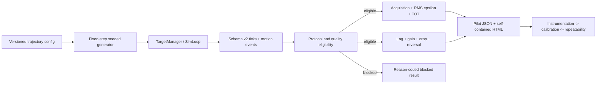

# WP-54 — Tracking Pilot Capability Test

> Stage spec：[../README.md](../README.md) · checklist：[task-checklist.md](task-checklist.md) · progress：[progress.md](progress.md)
>
> Source proposal：[../wp-54-tracking-pilot-execution-plan.md](../wp-54-tracking-pilot-execution-plan.md)。本文件依 `.claude/skills/engineering-planning/SKILL.md`、`references/design_standards.md`、`assets/tech_spec_template.md` 與 WP-51 的 work-package 格式整理。
>
> **狀態：✅ 已正式納入 stage11（2026-09-02，T0 entry gate/scope freeze/preregistration 完成）。** stage11 [README](../README.md)、[master checklist](../task-checklist.md) 與 [progress](../progress.md) 已同步接受 WP-54；本 WP 進入 M20，T0/T1/T2/T3/T4/T5 完成，T6（instrumentation pilot）待開工。

| | |
|---|---|
| **目標** | 建立可分離 acquisition、steady pursuit、reactive correction 的 tracking pilot，完成工程有效性、難度校準與 test-retest 證據 |
| **主要使用者** | 電競表現教練、研究者、測試操作員；受測者為 FPS 選手 |
| **交付定位** | Researcher/pilot-only；不發布正式 Assessment、常模、composite score 或自動處方 |
| **上游基線** | `tracking_v1`、schema v2、`deriveTrackingMetrics()`、`deriveTrackingTransitions()`、stage10 history/result 基礎 |
| **里程碑** | 暫定 M20：tracking pilot 的刺激、資料、指標與 repeatability exit gate 成立 |
| **估時** | 12-18 dev-days，另加招募與兩次真人施測日曆時間 |
| **風險** | High：核心 target motion、export schema、metric derivation、pilot protocol 與真人 reliability evidence 都是 release-blocking |

---

## 0. Repository-grounded discovery

1. `tracking_v1` 目前應保留為 predictable baseline；WP-54 不原地改寫既有 drill id 或歷史語意。
2. graphify report 顯示 `createSharedState()`、`createDataRecorder()`、`createSimLoop()`、`loadDrill()`、`createTargetManager()` 是高連結核心節點；target motion 與 export 改動屬 cross-module 熱區。
3. 現有 graphify communities 指出 target 狀態流為 `TargetManager -> SharedState.targets -> TargetView`，輸出資料流為 `DataRecorder -> ExportPayload -> metrics/report`；WP-54 必須沿用此資料責任切分。
4. 原始 WP-54 已預註冊 `RMS(epsilon)` 作為 pursuit primary，TOT、acquisition、lag/gain、drop/reacquire 與 reversal response 分層報告；本文件不改此研究決策。
5. 本 WP 只新增 researcher/pilot evidence；正式 Assessment release、history/trend registry、常模與產品 Result UI 應另立後續 WP。

### 0.1 Planning-time blast radius

- T0 開工前必須對 `TargetMotion`、`motionOffset()`、`TargetManager`、schema/export events、`deriveTrackingMetrics()`、`deriveTrackingTransitions()`、Result/history consumers 執行 CodeGraph impact。
- 若實際 implementation target 與本計畫命名不同，以 T0 讀碼後的 actual symbols 為準更新本文件與 [progress.md](progress.md)。
- 本次文件整理未修改 production code，因此不執行 graphify update。

---

## 1. 需求壓縮 (Requirements)

### 1.1 Functional Requirements

| ID | Requirement | 驗收摘要 | Task |
|---|---|---|---|
| FR-54-1 | 系統**必須**保留 `tracking_v1`、`tracking_longrange_v1` 與 `tracking_br_v1` 的既有 drill id 與行為 | 既有 deterministic/metrics tests 不改 expected values 且全綠 | T0/T1/T2 |
| FR-54-2 | 系統**必須**以版本化、seeded、固定 sim clock 產生 2D band-limited pseudorandom trajectory | 同 config/seed 在 60/120/240 Hz pump 下逐 tick target position deep-equal | T1 |
| FR-54-3 | 系統**必須**產生有限加速度的 random reversal trajectory，且每個 change event 可由 export 還原 | event time、前後 angular velocity 與逐 tick position 可對表 | T1 |
| FR-54-4 | 系統**必須**提供版本化 size x speed core condition matrix，且 scored block 內條件固定 | export 可辨識 motion version、seed、angular size、speed cell 與 duration。**「angular size」＝目標角尺寸（`targets.hitbox`），不是行程振幅；宣稱的 speed 必須是實際交付的 speed**（T6 slice 10 / [KI-020](../../../known_issue/KI-020-core-matrix-size-speed-manipulation-not-delivered.md) 修正了兩者皆未被交付的缺陷，並加上建構期守衛） | T2 |
| FR-54-5 | 系統**必須**提供不入分析的 practice，並讓 scored start 前 target/crosshair 完成初始對準 | practice 不寫入 scored aggregation；scored start event 可稽核 | T2/T5 |
| FR-54-6 | 系統**必須**沿用 canonical hit geometry 推導 acquisition failure、`tAcquire`、TOT、RMS/median/P95 `epsilon` | perfect follower、never acquire、known onset fixtures 回復已知答案 | T3 |
| FR-54-7 | 系統**必須**推導有明確正負號契約的 tracking lag、velocity gain 與 velocity residual | fixed-lag/gain fixtures 誤差在預註冊容差內 | T3 |
| FR-54-8 | 系統**必須**推導 drop rate、completed reacquire duration、terminal-censored drop 與 longest off-target streak | terminal drop 不被填成假的 reacquire duration | T3 |
| FR-54-9 | 系統**必須**對 reversal block 推導 response latency、peak error/overshoot 與 settling time，只在有效 change event 上計算 | synthetic reversal fixtures 與 event window isolation tests 全綠 | T3 |
| FR-54-10 | 系統**必須**先判定資料 eligibility，再產生能力解讀；不合格 run 仍輸出原因但不進聚合 | overflow、missing target、timestamp、coverage、protocol mismatch 均有封閉 reason code | T4 |
| FR-54-11 | 系統**必須**產生可稽核的 pilot evidence artifact，含 condition、n/duration、品質狀態、primary/diagnostic metrics 與 seed 統計 | 同一 export 重跑 deterministic；表格可追到 run id | T4 |
| FR-54-12 | 系統**必須**支援 counterbalanced block order、固定 rest、重跑原因與兩次 session protocol | session manifest 可重建每位受測者的 block order 與排除理由 | T5/T7/T8 |
| FR-54-13 | 系統**必須**在 M20 前完成 instrumentation、difficulty calibration 與 repeatability 三層 gate | 三份 evidence 均有資料版本、分析版本與 go/revise/stop 結論 | T6/T7/T8/T-exit |

### 1.2 Non-functional Requirements

| ID | Requirement | 量化判準 | Task |
|---|---|---|---|
| NFR-54-1 決定性 | motion 與 export 不得依 render FPS 或 wall clock 漂移 | 同 seed/input 在 60/120/240 Hz pump 的 positions、events、metrics deep-equal | T1-T4 |
| NFR-54-2 時序精度 | synthetic lag/event timing 誤差不得超出 fixed-step 可解析度 | `abs(estimated - truth) <= 1 / simHz` 秒，並揭露 tick quantization | T3 |
| NFR-54-3 數值精度 | perfect follower 與 known gain fixture 必須回復真值 | RMS `epsilon <= 1e-6 deg`；TOT `= 100%`；`abs(gain - truth) <= 0.02` | T3 |
| NFR-54-4 資料完整性 | Eligible run 不得含靜默缺口 | missing target、non-monotonic timestamp、buffer overflow 均為 0；scored tick coverage `>= 99.5%` | T4 |
| NFR-54-5 可追溯性 | 每個結果必須能重建刺激與分析 | artifact 含 drill id、trajectory version、seed、condition、simHz、metric version、analysis commit、run id | T2-T4 |
| NFR-54-6 效能隔離 | 不在 sim 熱路徑計算分析指標或產生每 tick 新配置 | metrics 全在 export 後計算；motion 熱路徑通過 GC/determinism tests | T1/T3 |
| NFR-54-7 相容性 | 不同 protocol/device-critical 設定不得混入同一比較 cohort | compatibility key 至少區分 drill、protocol、motion、size、speed、FOV、sensitivity、input mode | T4/T8 |
| NFR-54-8 可存取性 | 操作員可只用鍵盤完成 pilot 控制，品質與狀態不只靠顏色表達 | focused a11y test + manual keyboard walkthrough | T5 |

### 1.3 Constraints

- schema v2 raw ticks/events 仍是 source of truth；sim 不儲存衍生能力分數。
- Target motion 只讀 fixed-step sim age 與 seeded config，不讀 `Date.now()`、`performance.now()` 或 `Math.random()`。
- Scored block 禁止射擊、ADS 與玩家移動；偵測到對應輸入時標記 protocol violation。
- Acquisition failure 不填補成極大 RMS 或 TOT=0 後混入 pursuit mean；兩者分開報告。
- Terminal drop 的剩餘時間不得當成 completed reacquire duration。
- Pilot 資料不得自動進正式 Assessment history/trend；正式發布另立後續 WP 與 drill id。
- 本 WP 不實作 tracking-specific SPARC promotion、正式 Result UI、跨玩家常模或 composite score。

### 1.4 Open Questions（T0 preregistration — 2026-09-02 全數凍結，見 [progress.md](progress.md) D-54.1~D-54.8）

| ID | Question | T0 凍結決定 | Owner | Status |
|---|---|---|---|---|
| OQ-54-1 | 本輪只做 steady pursuit，或 steady + reactive 並列？ | **Steady + Reactive 並列，分開報告**（使用者確認，非合併分數） | 使用者 + 研究者 | ✅ Resolved |
| OQ-54-2 | Core matrix 是否沿用 `2.0 deg / 0.5 deg x 5 deg/s / 20 deg/s`？ | 採為 **calibration candidates**（T2 config 初值），非正式凍結值；T7 依 floor/ceiling 證據決定 retained/revise/remove。**T6（2026-09-03）：四個候選值全部保留，但實現方式再參數化**——size 改為真的目標角尺寸、speed 改以「頻帶 [0.3,2.1] Hz + 共用振幅 ±16°」交付（KI-020 §6；先前兩個因子都沒有被真正操弄）。reversal 視窗一併放寬到 ±13°（KI-019 §5） | 研究者 | ✅ Resolved（candidate，非 hard freeze；實現方式見 KI-020/KI-019） |
| OQ-54-3 | 每個 scored block 採 20、25 或 30 秒？ | **25 秒**；T7 Gate B 檢查 time-on-task slope 是否需調整 | 研究者 | ✅ Resolved |
| OQ-54-4 | Lag 搜尋範圍、平滑器與 ambiguity gate 為何？ | **`0–250 ms`** 搜尋範圍、離線固定係數平滑（`smoothingVersion` 版本化字串）；相關函數呈週期性多峰時回傳 `lag-peak-ambiguous`，不得回傳單值 | 指標 owner | ✅ Resolved |
| OQ-54-5 | Repeatability 最低證據門檻為何？ | **RMS ICC(A,1) point `>= 0.75` 且 95% CI lower `>= 0.60`**（使用者確認採用建議預設） | 使用者 + 研究者 | ✅ Resolved |
| OQ-54-6 | 真人 pilot 招募數與 session 間隔？ | Gate B **12–20 人**；Gate C **20–30 人**、相隔 **24–72 小時** | 研究者 | ✅ Resolved |
| OQ-54-7 | Evidence artifact 只做研究 HTML/JSON，或同步進產品 Result 頁？ | **先離線 self-contained HTML + JSON**；產品 Result UI 另立後續 WP，本 WP 不碰 `src/ui`/`src/results` 的正式 Result 呈現路徑 | 產品 owner | ✅ Resolved |
| OQ-54-8 | 是否需要 tracking-specific SPARC？ | **本 WP 不做**；M20 PASS 後另立 `tracking-sparc-v1` 研究提案 | 指標 owner | ✅ Resolved（deferred） |

---

## 2. 系統架構與設計 (Technical Design)

### 2.1 System Boundary

**In scope**

- 版本化 2D pseudorandom/reversal trajectory contract、schema validation 與 deterministic runtime。
- Practice、axis calibration、core 2 x 2、reactive blocks 的 pilot configs。
- Export metadata/motion-change events 的 additive contract。
- P0/P1 metrics、quality eligibility、synthetic truth fixtures 與 pilot evidence report。
- Researcher-only session manifest/runner、instrumentation、difficulty calibration、repeatability 分析。

**Out of scope**

- 正式 Assessment drill、正式 history/trend registry 與跨玩家常模。
- Composite score、leaderboard、自動訓練處方或「好/普通/差」標籤。
- BR/ADS/projectile/recoil/player movement 的正式效度驗證。
- Tracking-specific SPARC/LDLJ promotion。
- 重寫或改變 stage11 WP-52/WP-53 peek-click transfer 範圍。

### 2.2 Planning-time targets

下列路徑是候選落點，T0 讀碼與 CodeGraph impact 後可調整；責任邊界不可遺失。

```text
src/sim/trackingTrajectory.ts                         NEW deterministic trajectory kernel
src/sim/trackingTrajectory.test.ts                    NEW synthetic truth/determinism tests
src/drill/tracking_core_pr_pilot_v1.ts                NEW core pseudorandom pilot configs
src/drill/tracking_reversal_pilot_v1.ts               NEW reversal pilot configs
src/data/exportPayloadSchema.ts                       MODIFY additive motion event parsing
src/metrics/trackingDynamics.ts                       NEW lag/gain/recovery/reversal metrics
src/metrics/trackingDerivation.test.ts                MODIFY/ADD P0/P1 truth fixtures
src/pilot/trackingPilotEvidence.ts                    NEW JSON/HTML evidence model
src/session/trackingPilotManifest.ts                  NEW researcher manifest/counterbalance
docs/operational/analysis-tracking.md                 MODIFY formula/version/evidence contract
docs/operational/tracking-pilot-runbook.md            NEW operator/researcher runbook
```

**T1/T2 actual additive touch points**（讀碼後實況，補充上表未列出的落點；詳細設計理由見 [progress.md](progress.md) T1/T2 各 slice 條目）：

```text
src/drill/DrillConfig.ts        MODIFY additive targets.trackingTrajectory / timing.trackingPrepMs / protocolGuard
src/drill/schema.ts             MODIFY validateTrackingTrajectory / validateProtocolGuard / requireAscendingRange
src/scene/clearance.ts          MODIFY additive expandForTrackingTrajectory envelope expansion
src/sim/TargetManager.ts        MODIFY additive trackingTrajectory drive branch (isDrivenMotion 分支之前提早 continue)
src/state/SharedState.ts        MODIFY additive tScoredStart / targetMotionChanges / protocolViolations queues
src/loop/SimLoop.ts             MODIFY additive recordScoredStartEvents / recordTargetMotionChangeEvents / recordProtocolViolationEvents
src/drill/DrillRunner.ts        MODIFY additive tickProtocolGuard（running 相位、tickHoldReversal 之後）
src/data/DataRecorder.ts        MODIFY additive scored_start / protocol_violation DrillEvent members
src/data/metadata.ts            MODIFY additive SpawnMeta.trackingTrajectory（opaque）/ trackingPrepMs
src/main.ts、src/testharness/fpsTestHarness.ts   MODIFY spawn meta 區塊帶出 trackingTrajectory/trackingPrepMs
```

未落地的原規劃項目（T3+ 待辦，非本次遺漏）：`src/metrics/trackingDynamics.ts`、
`src/pilot/trackingPilotEvidence.ts`、`src/session/trackingPilotManifest.ts`、
`docs/operational/analysis-tracking.md`、`docs/operational/tracking-pilot-runbook.md` ——
分別對應 T3（metrics）、T4（evidence）、T5（manifest/runbook），照原計畫排程，非本 T1/T2 範圍。

### 2.3 Data Flow



### 2.4 Interface Contracts

```ts
export type TrackingTrajectoryConfig =
  | {
      readonly kind: 'band-limited-2d-v1';
      readonly seed: number;
      readonly durationMs: number;
      readonly yawBoundDeg: number;
      readonly pitchBoundDeg: number;
      readonly targetRmsSpeedDegPerSec: number;
      readonly frequencyBandHz: readonly [number, number];
    }
  | {
      readonly kind: 'reversal-2d-v1';
      readonly seed: number;
      readonly durationMs: number;
      readonly angularBoundsDeg: readonly [number, number];
      readonly speedRangeDegPerSec: readonly [number, number];
      readonly reversalIntervalMs: readonly [number, number];
      readonly accelerationRampMs: number;
    };

export interface TrackingTrajectorySample {
  readonly yawDeg: number;
  readonly pitchDeg: number;
  readonly yawVelocityDegPerSec: number;
  readonly pitchVelocityDegPerSec: number;
}

export interface TrackingTrajectory {
  sample(ageSec: number, out: MutableTrackingTrajectorySample): void;
  readonly changes: readonly PrecomputedTrackingChange[];
}

export function createTrackingTrajectory(config: TrackingTrajectoryConfig): TrackingTrajectory;
```

Runtime contract：

- `createTrackingTrajectory()` 只在 load/reset 低頻路徑建立 schedule；`sample()` 每 tick 寫入 caller-owned buffer，不配置新物件。
- 所有 position/velocity 都是 `(config, seed, age)` 的純函式結果。
- Export 保留逐 tick target center，也保留 additive `target_motion_change` event 讓 reversal analysis 可對表。
- Unknown trajectory kind/version、non-finite range、invalid band、negative duration 或 seed 缺失必須 fail fast。

```ts
export interface TrackingDynamicsOptions {
  readonly version: 'tracking-dynamics-v1';
  readonly lagSearchMs: readonly [number, number];
  readonly smoothingVersion: string;
  readonly minValidTicks: number;
  readonly correlationAmbiguityRatio: number;
}

export type TrackingDynamicsResult =
  | {
      readonly status: 'ok';
      readonly lagMs: number;
      readonly velocityGain: number;
      readonly velocityRmseDegPerSec: number;
      readonly signedYawBiasDeg: number;
      readonly signedPitchBiasDeg: number;
      readonly dropRatePerSec: number;
      readonly completedReacquireCount: number;
      readonly terminalDropCount: number;
      readonly longestOffTargetMs: number;
    }
  | {
      readonly status: 'blocked';
      readonly reason:
        | 'insufficient-valid-ticks'
        | 'no-acquisition'
        | 'lag-peak-ambiguous'
        | 'missing-target-telemetry'
        | 'protocol-incompatible';
    };

export function deriveTrackingDynamics(
  payload: ExportPayload,
  options: TrackingDynamicsOptions,
): TrackingDynamicsResult;
```

Lag sign contract：

```text
corr(omega_target(t), omega_aim(t + tau)) 最大時，tau > 0 代表 aim 落後 target。

velocity_gain =
  sum(dot(omega_target(t), omega_aim(t + tau_hat))) /
  sum(dot(omega_target(t), omega_target(t)))
```

```ts
export interface TrackingPilotManifest {
  readonly protocolVersion: 'tracking-pilot-v1';
  readonly participantId: string;
  readonly sessionIndex: 0 | 1;
  readonly orderedBlocks: readonly TrackingPilotBlock[];
  readonly restSeconds: number;
  readonly generatedFromCounterbalanceCell: string;
}

export type TrackingRunEligibility =
  | { readonly status: 'eligible'; readonly validScoredTicks: number; readonly durationMs: number }
  | { readonly status: 'blocked'; readonly reasons: readonly TrackingQualityReason[] };

export function evaluateTrackingRunEligibility(payload: ExportPayload): TrackingRunEligibility;
export function buildTrackingPilotEvidence(
  manifest: TrackingPilotManifest,
  payloads: readonly ExportPayload[],
): TrackingPilotEvidence;
```

### 2.5 Metrics and evidence contract

| Layer | Metrics | Rule |
|---|---|---|
| P0 gate | `acquisitionFailureRate` | never-on-target blocks/all scored blocks；不進 pursuit 聚合 |
| P0 acquisition | median `tAcquireMs`、valid n | `first_on_target - scored_start`；不得寫成純反應時間 |
| P0 primary | `RMS(epsilon)` in deg | 每 condition 合併 eligible pursuit ticks：`sqrt(sum epsilon^2 / nTicks)` |
| P0 companion | TOT%、median/P95 `epsilon` | exact ray-hitbox；同時顯示有效秒數與 tick n |
| P1 dynamics | lag、velocity gain、velocity RMSE | 分 condition；lag ambiguous 時不得輸出 gain |
| P1 recovery | drop/sec、reacquire median/P90/n、terminal count、longest off-target | completed 與 right-censored 分開 |
| P1 reactive | response latency、peak error、overshoot、settling time | 以 motion-change event 為窗，排除重疊或邊界不足事件並計數 |
| P1 directional | signed yaw/pitch bias、left/right、up/down lag/gain | 不 normalize 成單一分數 |

### 2.6 Concurrency model

本 WP 不新增 worker、thread、channel 或共享鎖。Trajectory 由既有 128 Hz fixed-step sim 驅動；render loop 只讀 SharedState；metrics/report 在 run 結束後處理 export。若 T4 benchmark 顯示單一 30 秒 export 分析時間超過 2 秒，另記 worker spike，不在本 WP 未量先加 concurrency。

---

## 3. 風險分析 (Risk Analysis)

| Risk | Level | Failure mode | Mitigation/evidence |
|---|---|---|---|
| Target motion 改動破壞既有 drill | High | 擴充 `TargetMotion` 時改變 schema/clearance/TargetManager 消費者 | T0 CodeGraph impact；additive versioned union；legacy determinism gate |
| Seeded path 統計不等價 | High | pseudorandom path 不 band-limited，或 seed 間難度差異過大 | T1 seed summary；T6/T7 seed equivalence gate |
| Reversal 變成位置跳變 | High | 無限加速度讓 metric 量到 visual pop，不是 reactive tracking | 強制 `accelerationRampMs > 0`；continuity/bounded acceleration fixtures |
| Lag 多峰仍回傳單值 | High | periodic signal 造成 ambiguity，但系統仍輸出 lag/gain | ambiguity ratio gate；blocked result；fixture 覆蓋 |
| Acquisition failure 被吃掉 | High | 弱者 run 被刪除或混入 pursuit mean | P0 gate 獨立報告；aggregation contract tests |
| 系統品質污染能力指標 | High | display stall/input overflow/missing telemetry 污染 lag/smoothness | Eligibility before metrics；blocked 不聚合 |
| Pilot 被保存為正式 Assessment | Med/High | history/trend compatibility 被研究資料污染 | practice/pilot metadata guard；formal release 另立 WP |
| 0.5 deg target 接近 pixel floor | Med | 量到視覺可辨識度而非 tracking | T7 visibility check；必要時淘汰該 cell。**T6 slice 10 起「0.5 deg」才真的是目標角尺寸**（`targets.hitbox` cube，邊長 `2·distance·tan(size/2)`）；兩個 axis calibration block 也改用此至風險尺寸——在此之前所有 cell 共用預設 H1 目標（約 ±7°），此風險項無法被檢驗（KI-020） |
| Fixed order 導致疲勞/練習 confound | Med | 難度與時間順序共變 | counterbalance、固定 rest、time-on-task slope |
| 大 export analysis 阻塞 UI | Low/Med | Result/evidence report 明顯延遲 | T4 benchmark；超過 2 秒才另立 worker spike |

### Conscious technical debt

1. 本 WP 不實作 frequency-response chart、tracking-specific SPARC、正式產品 Result UI 或跨玩家模型；M20 PASS 後另立版本化 WP。
2. 初版 evidence 先以 researcher HTML/JSON 為主；正式 Assessment 的 history/trend projection 與教練版 UI 不在本 WP。
3. 真人 Gate B/C 只支撐 pilot decision，不宣稱 population norm。

---

## 4. 任務拆解 (Task Breakdown)

| Task | Objective | Dependencies | Risk | Complexity | Definition of Done |
|---|---|---|---|---|---|
| **T0** | Entry gate、scope freeze 與 preregistration | 使用者確認 WP-54 是否納入 stage11 | High | 0.5-1d | stage scope 無衝突；OQ-54-1~7 有 owner/decision；CodeGraph impact、baseline、metric version、exclusion/reliability rules 已記錄 |
| **T1** | Deterministic 2D trajectory kernel and export contract | T0 | High | 2-3d | FR-54-2/3、NFR-54-1/6 automated tests 全綠；舊 motion/drill snapshot 不變；未知 version fail fast |
| **T2** | Pilot drill matrix and scene/protocol guards | T1 | High | 1.5-2.5d | practice/core/reactive configs 可 load/complete/rebuild；practice 不進 scored window；protocol violation 可辨識；legacy regression 綠 |
| **T3** | Canonical P0/P1 metrics and truth fixtures | T2 | High | 2-3d | NFR-54-2/3 容差全綠；每個 blocked branch 有 fixture；P0 不因 P1 blocked 消失；公式回寫 operational spec |
| **T4** | Eligibility, evidence pipeline and report | T3 | High | 1.5-2.5d | valid/invalid fixtures deterministic；invalid run 不進 aggregate；HTML/JSON parity；practice/pilot run 被 history guard 排除 |
| **T5** | Researcher session manifest and operator flow | T2/T4 | Med | 1-2d | manifest replay order/seed deterministic；非法 manifest fail fast；practice->scored->rest->export E2E；a11y gate 綠 |
| **T6** | Instrumentation pilot gate | T1-T5 | High | 0.5-1 engineering day + manual runs | synthetic truth、determinism、round-trip、3-5 tester runs 與 `instrumentation-gate-v1` evidence 全綠；go/revise/stop 明確 |
| **T7** | Difficulty calibration pilot | T6 PASS | High | 1-2 engineering days + recruitment/data collection | retained cell 各至少 10 eligible runs；floor/ceiling、seed、visibility、time slope report；未達 gate 不進 T8 |
| **T8** | Repeatability and validity pilot | T7 PASS + OQ-54-5/6 frozen | High | 1.5-2.5 engineering days + two-session data collection | eligible pairs 達 preregistered N；ICC/CV/SEM/Bland-Altman/seed equivalence 可重跑；M20 threshold 有 pass/fail |
| **T-exit** | M20 evidence audit and handoff | T6 PASS、T7 PASS、T8 formal conclusion | Med | 0.5-1d | §6 exit gate 全部成立，或以 revise/stop 結案；只有 PASS 才能另立正式 tracking Assessment release WP |

### 4.1 Requirements traceability

| Requirement | Tasks | Verification |
|---|---|---|
| FR-54-1 | T0/T1/T2/T-exit | legacy drill snapshots、determinism tests、full focused regression |
| FR-54-2/3 | T1 | trajectory truth fixtures、pump cadence snapshots、export event round-trip |
| FR-54-4/5/12 | T2/T5/T7/T8 | config metadata assertions、practice/scored boundary、manifest/counterbalance E2E |
| FR-54-6/7/8/9 | T3 | synthetic truth fixtures、blocked branch fixtures、formula doc parity |
| FR-54-10/11 | T4 | closed reason vocabulary、eligibility before aggregation、JSON/HTML parity |
| FR-54-13 | T6/T7/T8/T-exit | Gate A/B/C evidence records and M20 decision |
| NFR-54-1/2/3/6 | T1/T3/T4 | determinism, timing, precision and no-hot-path-allocation gates |
| NFR-54-4/5/7 | T2/T4/T8 | data quality, traceability and compatibility fields |
| NFR-54-8 | T5/T-exit | keyboard/a11y automated + manual walkthrough |

---

## 5. Execution rules

- 一個 task = 一個可驗收垂直切片 = 一個原子 commit；完成後同步 [task-checklist.md](task-checklist.md)、[progress.md](progress.md) 與 stage11 master 文件。
- T0 不得把 planned contract 當 delivered evidence；所有 interface/path 以 actual codebase 為準。
- 修改既有 symbol 前執行 CodeGraph impact，記錄 affected files/symbols 與 local/cross-module 判斷。
- Additive schema/version change 必須 fail closed；舊 export reader 不得靜默錯配 event union。
- Pilot run 不得寫入正式 Assessment history/trend；若需要 formal history 行為，另立 release WP。
- Gate A 失敗不得用增加真人樣本數掩蓋；Gate B/C 的 protocol threshold 必須在收資料前凍結。
- production code 修改後執行 `graphify update .`；純 docs/test-plan 整理不需更新 source graph。
- T-exit 前檢查 `git status --short`、staged stat/names 與 artifact scan，確保無真實 participant payload 進 git。

---

## 6. M20 Exit Gate

- [ ] WP-54 已正式被 stage11 接受，或文件移到明確 future proposal；stage scope 不矛盾。
- [ ] `tracking_v1` 與所有 legacy motion/drill 行為無 semantic regression。
- [ ] Core 2D 與 reactive reversal stimulus 具版本、seed、連續性、bounds、event 與決定性證據。
- [ ] Practice、scored window、condition matrix、counterbalance、rest、retry、alternate seed 都可由 manifest/export 還原。
- [ ] P0 acquisition/RMS/TOT 與 P1 lag/gain/drop/recovery/reversal 指標均有公式、版本、真值 fixture、blocked semantics。
- [ ] Eligibility 在能力聚合前執行；所有排除有封閉 reason code，原始 export 保留，不以 0 代替 blocked。
- [ ] Pilot JSON/HTML 可由同一 evidence model deterministic 重建，所有結果附 n、duration、condition、seed、quality 與 version。
- [ ] Gate A/B/C 各有 versioned evidence、go/revise/stop 決策與 owner sign-off。
- [ ] Primary RMS repeatability 達 T0 預註冊門檻；若未達，本 WP 以 revise/stop 結案，不發布 Assessment。
- [ ] 未產生 composite score、全球常模、自動處方；pilot run 未進正式 history/trend。
- [ ] Focused unit/integration/determinism/E2E、full CI 與人工 a11y walkthrough 全綠。
- [ ] `CONTEXT.md`、`DECISIONS.md`、operational spec、stage progress/checklist 與 `graphify-out`（若有 code change）同步。

