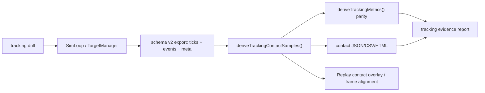

# WP-55 候選計畫 — Tracking on-target 可觀測性與 no-health 收斂

> **狀態：🟡 候選規劃，尚未納入 stage11 master checklist、尚未開工。** 本計畫回應「不需要血條」的方向：Tracking 是否跟隨目標，不以 HP、damage 或擊殺數判斷，而以既有 raw tick telemetry 推導逐 tick `onTarget`、`epsilonDeg`、TOT、RMS epsilon 與 replay/export 可重建觀測。若決定正式排入 stage11，T0 必須先更新 [README.md](README.md)、[task-checklist.md](task-checklist.md) 與 [progress.md](progress.md)。

| | |
|---|---|
| **目標** | 讓所有 tracking 項目都能用同一套 exact-hitbox on-target 觀測，確認準心是否跟隨目標，並支援 export/replay/報告重建 |
| **主要使用者** | 研究者、教練、測試操作員；受測者為 FPS 選手 |
| **交付定位** | Researcher／pilot evidence；不新增血條、不新增 HP、不把射擊命中當 tracking 主指標 |
| **上游基線** | `tracking_v1`、`tracking_longrange_v1`、`tracking_br_v1`、schema v2、`deriveTrackingMetrics()`、Replay |
| **估時** | 5-8 dev-days，若只做離線 artifact 不改產品 Replay UI 可降為 3-5 dev-days |
| **里程碑** | 暫定 M21：tracking on-target observability 在 live export、offline artifact 與 replay 對表成立 |

---

## 1. 需求壓縮（Requirements）

### 1.1 Functional Requirements

| ID | Requirement | 驗收摘要 | Task |
|---|---|---|---|
| FR-55-1 | 系統**必須**明確排除血條、HP、damage 與擊殺數作為 tracking 跟隨判定來源 | `DrillConfig`、`TargetState`、hit path、export schema 不新增 health/damage contract | T0、T6 |
| FR-55-2 | 系統**必須**對所有 tracking drill 以同一 exact-hitbox geometry 推導每 tick `onTarget` | `tracking_v1`、`tracking_longrange_v1`、`tracking_br_v1` fixtures 均能輸出逐 tick contact samples | T1、T3 |
| FR-55-3 | 系統**必須**輸出可重建的 per-tick 觀測 artifact，至少包含 `t`、`targetId`、target center、aim、`onTarget`、`epsilonDeg` | JSON artifact 與 `deriveTrackingMetrics()` 的 TOT/RMS/acquisition 對表 | T2、T3 |
| FR-55-4 | 系統**必須**在 replay 中可觀測準心是否跟隨目標 | replay 同一 frame 的 target/aim/contact state 與 artifact row 對表 | T4 |
| FR-55-5 | 系統**必須**保留既有 tracking drill lifecycle；HP 歸零 respawn 語意不得引入 | `presentationMs`、`visible` event、target id window 切分維持既有語意 | T0、T5 |
| FR-55-6 | 系統**必須**把 pure tracking 與 BR/projectile transfer tracking 分層報告 | BR projectile/hitscan 條件可呈現 on-target，但不回寫成 pure tracking 主結論 | T3、T5 |
| FR-55-7 | 系統**必須**在資料不足或不相容時輸出 reason-coded blocked result，而不是輸出錯誤的 0 或空白 | missing target、missing hitbox、eye origin 不可解、schema mismatch 均有封閉原因 | T2、T3 |

### 1.2 Non-functional Requirements

| ID | Requirement | 量化判準 | Task |
|---|---|---|---|
| NFR-55-1 決定性 | contact artifact 不得依 render FPS 或 wall clock 漂移 | 同 export 重跑 artifact byte-equivalent；同 seed/input 在既有 60/120/240 pump gate 中 metrics deep-equal | T2、T5 |
| NFR-55-2 幾何一致性 | `onTarget` 必須與 engine hit geometry 使用同一 hitbox 來源 | synthetic ray-hitbox fixture 中 on-target 與 known hit/miss oracle 逐列一致 | T1 |
| NFR-55-3 相容性 | 舊 export 可用既有 fallback，新 export 使用 `meta.targets.hitbox` | legacy/default hitbox fixture 與 hitbox metadata fixture 均通過 | T2 |
| NFR-55-4 效能 | artifact generation 不得進 sim/render hot path | 30 秒 tracking export 的 artifact generation reference runtime < 500 ms；live sim 無新增 per tick allocation contract | T2、T4 |
| NFR-55-5 可追溯性 | 每份報告都可追到原始 run 與分析版本 | artifact 含 drillId、schemaVersion、simHz、target hitbox、analysisVersion、sourceRunId 或 export basename | T2 |

### 1.3 Constraints

- 不新增血條、不新增 HP、不新增 damage event、不改 `TargetManager.markKilled()` 為扣血模型。
- 不用「有沒有射中」替代「準心是否跟隨」。射擊只是一個瞬間事件；tracking 觀測必須來自逐 tick aim/target/hitbox。
- 不把 `tracking_br_v1` 的 ADS、projectile、weapon spread 或 lead 結果混入 pure tracking 主分數。
- 不把 derived `onTarget` 寫回 sim state；engine 仍只匯出 raw ticks/events，衍生觀測在 export 後生成。
- 不修改既有 `tracking_v1`、`tracking_longrange_v1`、`tracking_br_v1` drill id 或凍結參數。

### 1.4 Open Questions

| ID | 問題 | 目前規劃預設 | Owner | Deadline | Impact |
|---|---|---|---|---|---|
| OQ-55-1 | Replay 可觀測性要做到產品 UI，還是先產出離線 HTML/JSON replay artifact？ | 先做離線 artifact；產品 Replay overlay 作 T4 可選切片 | 使用者 | T0 | T4 scope/估時 |
| OQ-55-2 | 「tracking 項目」是否只包含現有三類，或也包含 WP-54 候選 `tracking_core_pr_pilot_v1`/`tracking_reversal_pilot_v1`？ | 現有三類先全覆蓋；WP-54 新 drill 以同一 contract 接入 | 使用者 + 研究者 | T0 | T3、T5 fixture matrix |
| OQ-55-3 | Export 支援是指 raw export 足以重建，還是要另存 derived contact JSON/CSV？ | 另產 derived artifact，不改 raw schema v2 | 使用者 | T0 | T2 output format |
| OQ-55-4 | BR projectile 條件中是否同時顯示 ballistic hit 與 aim-ray on-target？ | 顯示兩者但分欄；tracking contact 仍以 aim-ray exact hitbox 定義 | 研究者 | T1 | T3 metric semantics |

---

## 2. 系統架構與設計（Technical Design）

### 2.1 System Boundary

**In scope**

- 共用 on-target sample derivation：從 `ExportPayload` 的 `ticks[]`、`events[]`、`meta.targets.hitbox` 與 eye origin metadata 推導逐 tick contact。
- Derived artifact：JSON/CSV 或 self-contained HTML，能讓研究者檢查準心是否跟隨目標。
- Replay 對表：同一 replay frame 可找到對應 observation row，並能呈現 contact state。
- 所有現有 tracking drill 的 fixtures、quality guard 與 regression gate。
- 文件更新：operational tracking spec、stage11 progress/checklist（正式採納時）。

**Out of scope**

- 血條、HP、damage、armor、weapon damage falloff、HP 歸零 respawn。
- 正式 Assessment 發布、history/trend registry、常模與 composite score。
- Scored block 內 adaptive difficulty。
- 把射擊 hit rate、projectile lead、ADS 表現合併為 pure tracking 分數。
- 重寫 WP-54 的 trajectory generator；本 WP 只規範所有 tracking drill 如何觀測 contact。

### 2.2 Data Flow



資料從 sim 產生 raw telemetry，經 export 後由分析層推導 contact samples；Replay 與報告只讀 derived artifact，不回寫 sim，也不改變 target lifecycle。

### 2.3 Interface Contracts

下列為規劃介面；T0 讀碼後可調整檔名，但輸入/輸出語意不可遺失。

```ts
export interface TrackingContactSample {
  readonly t: number;
  readonly targetId: string;
  readonly target: { readonly x: number; readonly y: number; readonly z: number };
  readonly aim: { readonly yaw: number; readonly pitch: number };
  readonly onTarget: boolean;
  readonly epsilonDeg: number;
  readonly presentationIndex: number;
  readonly trackingWindow: 'pre-acquire' | 'pursuit' | 'none';
}

export type TrackingContactBlockedReason =
  | 'schema-version-unsupported'
  | 'missing-visible-event'
  | 'missing-target-telemetry'
  | 'missing-eye-origin'
  | 'invalid-hitbox'
  | 'no-tracking-drill'
  | 'protocol-incompatible';

export type TrackingContactDerivationResult =
  | {
      readonly status: 'ok';
      readonly analysisVersion: 'tracking-contact-v1';
      readonly drillId: string;
      readonly samples: readonly TrackingContactSample[];
    }
  | {
      readonly status: 'blocked';
      readonly analysisVersion: 'tracking-contact-v1';
      readonly reasons: readonly TrackingContactBlockedReason[];
    };

export function deriveTrackingContactSamples(payload: ExportPayload): TrackingContactDerivationResult;
```

Output contract：

- `samples[]` 只包含有 active target telemetry 的 scored ticks。
- `onTarget` 使用 same geometry as tracking metrics：eye ray intersects H1 hitbox。
- `epsilonDeg` 與 `deriveTrackingMetrics()` 的 angular center error 同源。
- `trackingWindow` 必須與 acquisition rule 對齊：首次 on-target 前是 `pre-acquire`，之後到 presentation end 是 `pursuit`。
- `blocked` 結果不得輸出空 samples 假裝成功。

Replay contract：

```ts
export interface ReplayContactFrame {
  readonly t: number;
  readonly targetId: string | null;
  readonly onTarget: boolean | null;
  readonly epsilonDeg: number | null;
}

export function sampleReplayContact(
  samples: readonly TrackingContactSample[],
  replayTimeMs: number,
): ReplayContactFrame;
```

Error 情境：

- export 沒有可解析 eye origin：blocked `missing-eye-origin`。
- tick 有 target center 但找不到 matching visible/presentation window：blocked `missing-visible-event`，避免跨 presentation 污染。
- hitbox 非正有限或 shape unsupported：blocked `invalid-hitbox`。
- BR projectile 條件有 hit event 但 aim ray off target：保留兩者差異，不把其中之一覆寫另一個。

### 2.4 Concurrency Model

本 WP 不新增 worker、thread、channel 或共享 mutable concurrency。所有 derived contact 在 export/replay 載入後同步計算。若 T4 benchmark 顯示 30 秒 export 生成時間 >= 500 ms，再另立 worker spike；不得在本 WP 未量先改 concurrency。

---

## 3. 風險分析（Risk Analysis）

| ID | 等級 | 觸發條件 | 影響範圍 | 處理策略 |
|---|---|---|---|---|
| FM-55-1 | High | 把血條/HP 又帶回設計，或用 hit count 取代 contact | tracking 構念被射擊、recoil、projectile lead 污染 | T0 freeze 明列 no-health/no-damage；T6 驗收檢查 schema/state/hit path 無 HP 改動 |
| FM-55-2 | High | `onTarget` 幾何與 engine hitbox 或 existing `deriveTrackingMetrics()` 不一致 | Replay/報告與既有 metrics 矛盾 | T1 建 same-fixture parity；所有 hitbox fallback 與 metadata path 共用 |
| FM-55-3 | High | Replay frame 與 derived sample 對齊錯誤 | 操作員看到錯誤的 contact 狀態 | T4 用 deterministic replay fixture 對表 `t`、target id、position、contact |
| FM-55-4 | Med | BR projectile hit 與 aim-ray contact 語意混用 | 把 ballistic lead 或 travel time 誤判為跟槍 | 報告分欄：`aimRayOnTarget` vs ballistic `hit`；pure tracking summary 不讀 projectile hit |
| FM-55-5 | Med | 舊 export 缺少 hitbox 或 eye origin metadata | 部分歷史資料無法觀測 contact | 使用既有 legacy fallback 只在可證明時啟用；否則 reason-coded blocked |
| FM-55-6 | Med | Derived artifact 體積過大或生成慢 | replay/report 開啟延遲 | 只輸出 scored target ticks；30 秒 reference benchmark < 500 ms；HTML 可採摘要 + trace decimation |

Technical debt：第一版若只做離線 artifact 而不做產品 Replay overlay，是有意識的切範圍。觸發後續工作的條件是研究者需要在正式操作 UI 逐 frame 檢視 contact，而不是只審核 exported report。

---

## 4. 任務拆解（Task Breakdown）

| Task | Objective | Dependencies | Risk | Complexity | Definition of Done |
|---|---|---|---|---|---|
| T0 | Scope freeze and no-health audit | 使用者採納本 WP | High | Low | stage11 是否採納已有決議；`TargetState`、`DrillConfig`、`TargetManager`、`SimLoop`、export schema 的 no-health/no-damage blast radius 記入 progress；OQ-55-1~4 皆有結論 |
| T1 | Contact geometry contract | T0 | High | Med | `deriveTrackingContactSamples()` 介面凍結；perfect on-target、known miss、legacy hitbox、metadata hitbox fixtures 通過；結果與 `deriveTrackingMetrics()` 的 on-target/TOT/RMS 對表 |
| T2 | Export-derived artifact | T1 | Med | Med | 產出 deterministic contact JSON；包含 analysisVersion、drillId、hitbox、samples；blocked reason vocabulary 有測試；30 秒 reference export generation < 500 ms |
| T3 | All tracking drill coverage | T2 | High | Med | `tracking_v1`、`tracking_longrange_v1`、`tracking_br_v1` 每類至少一份 fixture；BR 條件分開呈現 `aimRayOnTarget` 與 projectile/hitscan hit；pure tracking summary 不讀 hit count |
| T4 | Replay observability | T2、T3 | Med | Med | `sampleReplayContact()` 與 replay sample 對表；Replay fixture 在 seek/playback 下 targetId、time、onTarget 不漂移；若 OQ-55-1 決定不做 UI，則以 self-contained HTML replay trace 取代 |
| T5 | Report and quality integration | T3、T4 | Med | Med | report 顯示 acquisition、pursuit、TOT、RMS epsilon、contact timeline、blocked reasons；每個數值帶 n/duration/condition；protocol-incompatible run 不進 aggregate |
| T6 | Exit gate and documentation | T1-T5 | Med | Low | operational spec 更新；stage11 progress/checklist 更新；focused Vitest/Replay tests 與 `npm test` 綠；確認未新增 HP/damage/health bar schema/state/render contract |

---

## 5. Execution Order and Verification Matrix

```text
T0 -> T1 -> T2 -> T3 -> T4 -> T5 -> T6
```

| 驗證層 | 必測內容 | Evidence |
|---|---|---|
| Unit | ray-hitbox contact、epsilon、blocked reasons、legacy hitbox fallback | Focused Vitest |
| Round-trip | export payload -> contact artifact -> metrics parity | Golden fixtures |
| Drill matrix | `tracking_v1`、`tracking_longrange_v1`、`tracking_br_v1` | Per-drill fixtures |
| Replay | seek/playback frame contact alignment | Replay unit/integration tests |
| Regression | no-health/no-damage/no-lifecycle-change | TargetManager/SimLoop/schema grep audit + existing tests |

預計 commands 由 T0 依實際檔名凍結，至少包含：

```powershell
npx vitest run src/metrics/trackingDerivation.test.ts src/metrics/trackingTransitions.test.ts
npx vitest run src/render/replay/ReplayTargetView.test.ts tests/replay/replay-visual-seek-purity.test.ts
npx vitest run src/drill/tracking_v1.test.ts src/drill/tracking_longrange_v1.test.ts src/drill/tracking_br_v1.test.ts
npm test
```

---

## 6. Definition of Done（M21 Exit Gate）

- [ ] 血條、HP、damage、擊殺數均未成為 tracking 跟隨判定來源。
- [ ] 所有 tracking drill 都能從 export 重建逐 tick `onTarget` 與 `epsilonDeg`。
- [ ] Contact artifact 與 `deriveTrackingMetrics()` 的 acquisition/TOT/RMS epsilon 對表成立。
- [ ] Replay 或離線 replay artifact 能逐 frame 檢視 contact state。
- [ ] BR/projectile tracking 的 ballistic hit 與 aim-ray contact 分欄呈現，未混入 pure tracking 主結論。
- [ ] 資料不足、不相容或舊 export 無法可靠重建時，輸出封閉 reason code。
- [ ] Existing target lifecycle、`presentationMs`、drill id 與 legacy tests 無 semantic regression。
- [ ] 文件同步說明：tracking 是否跟隨目標以 exact-hitbox on-target/TOT/RMS epsilon 判定，不需要血條。

---

## 7. 後續但不屬於本 WP

1. 若 WP-54 新增 `tracking_core_pr_pilot_v1` 或 `tracking_reversal_pilot_v1`，直接接入本 WP 的 contact artifact contract。
2. 若研究者需要 live practice feedback，可另立 render-only contact indicator，但不得進 sim state 或 scored block strategy feedback。
3. 正式 Assessment、history/trend registry、教練式診斷規則與 composite score 需另立 WP，且必須引用 M21 evidence。
