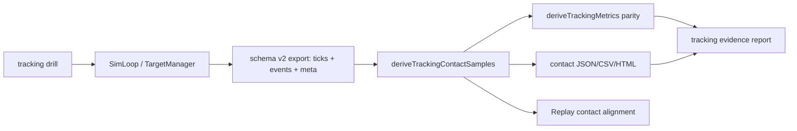

# WP-55 — Tracking On-target Observability without Health

> Stage spec：[../README.md](../README.md) · checklist：[task-checklist.md](task-checklist.md) · progress：[progress.md](progress.md)
>
> Source proposal：[../wp-55-tracking-on-target-observability-no-health-plan.md](../wp-55-tracking-on-target-observability-no-health-plan.md)。本文件依 `.claude/skills/engineering-planning/SKILL.md`、`references/design_standards.md`、`assets/tech_spec_template.md` 與 WP-51 的 work-package 格式整理。
>
> **狀態：✅ 完成。T0-T6 + T-exit + T7 全數交付；M21 = pass（2026-09-04）。** T-exit（2026-09-03）曾以 conditional pass 結案並開立 OI-55-1（無 operator 入口）；**T7（2026-09-04）已補上 CLI runner,OI-55-1 關閉**,M21 由 conditional pass 收成 pass。逐項證據見 [§6.2](#62-t-exit-evidence-ledger2026-09-03)、[§6.3](#63-t7-oi-55-1-關閉證據2026-09-04) 與 [progress.md](progress.md)。

| | |
|---|---|
| **目標** | 讓所有 tracking 項目都能用同一套 exact-hitbox on-target 觀測，確認準心是否跟隨目標，並支援 export/replay/report 重建 |
| **主要使用者** | 研究者、教練、測試操作員；受測者為 FPS 選手 |
| **交付定位** | Researcher/pilot evidence；不新增血條、不新增 HP、不把 damage 或擊殺數當 tracking 主指標 |
| **上游基線** | `tracking_v1`、`tracking_longrange_v1`、`tracking_br_v1`、schema v2、`deriveTrackingMetrics()`、Replay |
| **里程碑** | 暫定 M21：tracking on-target observability 在 live export、offline artifact 與 replay 對表成立 |
| **估時** | 5-8 dev-days；若 T4 不做產品 Replay UI、只做離線 replay artifact，可降為 3-5 dev-days |
| **風險** | High：hit geometry、export schema、derived metrics 與 replay frame alignment 都可能造成研究語意錯配 |

---

## 0. Repository-grounded discovery

1. 既有 tracking 構念已由 raw tick telemetry、target state 與 hit geometry 推導；WP-55 不需要也不得引入 health/damage lifecycle。
2. graphify report 顯示 `createSharedState()`、`createDataRecorder()`、`createSimLoop()`、`loadDrill()`、`createTargetManager()` 是高連結核心節點；WP-55 應把 contact 推導放在 export 後分析層，避免污染 sim/render hot path。
3. 既有 target 狀態流為 `TargetManager -> SharedState.targets -> TargetView`，輸出資料流為 `DataRecorder -> ExportPayload -> metrics/report`；WP-55 必須沿用這個責任切分。
4. `tracking_br_v1` 同時涉及 ADS、hitscan/projectile 與 lead 語意；WP-55 可呈現 aim-ray on-target，但不得把 ballistic hit 寫回 pure tracking 主結論。
5. WP-54 若後續新增 `tracking_core_pr_pilot_v1` 或 `tracking_reversal_pilot_v1`，應接入同一 contact artifact contract；WP-55 本身先覆蓋現有三個 tracking drill。

### 0.1 Planning-time blast radius

- T0 開工前必須對 `TargetState`、`TargetManager`、`DataRecorder`、export schema/parser、`deriveTrackingMetrics()`、Replay sampling/view 與 report consumers 執行 CodeGraph impact。
- 若實際 implementation target 與本計畫命名不同，以 T0 讀碼後的 actual symbols 為準更新本文件與 [progress.md](progress.md)。
- 本次文件整理未修改 production code，因此不執行 graphify update。

---

## 1. 需求壓縮 (Requirements)

### 1.1 Functional Requirements

| ID | Requirement | 驗收摘要 | Task |
|---|---|---|---|
| FR-55-1 | 系統**必須**明確排除血條、HP、damage 與擊殺數作為 tracking 跟隨判定來源 | `DrillConfig`、`TargetState`、hit path、export schema 不新增 health/damage contract | T0/T6/T-exit |
| FR-55-2 | 系統**必須**對所有 tracking drill 以同一 exact-hitbox geometry 推導每 tick `onTarget` | `tracking_v1`、`tracking_longrange_v1`、`tracking_br_v1` fixtures 均能輸出逐 tick contact samples | T1/T3 |
| FR-55-3 | 系統**必須**輸出可重建的 per-tick 觀測 artifact，至少包含 `t`、`targetId`、target center、aim、`onTarget`、`epsilonDeg` | JSON artifact 與 `deriveTrackingMetrics()` 的 TOT/RMS/acquisition 對表 | T2/T3 |
| FR-55-4 | 系統**必須**在 replay 中可觀測準心是否跟隨目標 | replay 同一 frame 的 target/aim/contact state 與 artifact row 對表 | T4 |
| FR-55-5 | 系統**必須**保留既有 tracking drill lifecycle；HP 歸零 respawn 語意不得引入 | `presentationMs`、`visible` event、target id window 切分維持既有語意 | T0/T5/T-exit |
| FR-55-6 | 系統**必須**把 pure tracking 與 BR/projectile transfer tracking 分層報告 | BR projectile/hitscan 條件可呈現 on-target，但不回寫成 pure tracking 主結論 | T3/T5 |
| FR-55-7 | 系統**必須**在資料不足或不相容時輸出 reason-coded blocked result，而不是輸出錯誤的 0 或空白 | missing target、missing hitbox、eye origin 不可解、schema mismatch 均有封閉原因 | T2/T3/T5 |

### 1.2 Non-functional Requirements

| ID | Requirement | 量化判準 | Task |
|---|---|---|---|
| NFR-55-1 決定性 | contact artifact 不得依 render FPS 或 wall clock 漂移 | 同 export 重跑 artifact byte-equivalent；同 seed/input 在既有 60/120/240 pump gate 中 metrics deep-equal | T2/T5 |
| NFR-55-2 幾何一致性 | `onTarget` 必須與 engine hit geometry 使用同一 hitbox 來源 | synthetic ray-hitbox fixture 中 on-target 與 known hit/miss oracle 逐列一致 | T1 |
| NFR-55-3 相容性 | 舊 export 可用既有 fallback，新 export 使用 `meta.targets.hitbox` | legacy/default hitbox fixture 與 hitbox metadata fixture 均通過；不可解析時 blocked | T2 |
| NFR-55-4 效能 | artifact generation 不得進 sim/render hot path | 30 秒 tracking export 的 artifact generation reference runtime < 500 ms；live sim 無新增 per tick allocation contract | T2/T4 |
| NFR-55-5 可追溯性 | 每份報告都可追到原始 run 與分析版本 | artifact 含 drillId、schemaVersion、simHz、target hitbox、analysisVersion、sourceRunId 或 export basename | T2/T5 |

### 1.3 Constraints

- 不新增血條、不新增 HP、不新增 damage event、不改 `TargetManager.markKilled()` 為扣血模型。
- 不用「有沒有射中」替代「準心是否跟隨」。射擊只是一個瞬間事件；tracking 觀測必須來自逐 tick aim/target/hitbox。
- 不把 `tracking_br_v1` 的 ADS、projectile、weapon spread 或 lead 結果混入 pure tracking 主分數。
- 不把 derived `onTarget` 寫回 sim state；engine 仍只匯出 raw ticks/events，衍生觀測在 export 後生成。
- 不修改既有 `tracking_v1`、`tracking_longrange_v1`、`tracking_br_v1` drill id 或凍結參數。

### 1.4 Open Questions

| ID | Question | Recommended default | Owner | Deadline | Impact if unresolved |
|---|---|---|---|---|---|
| OQ-55-1 | Replay 可觀測性要做到產品 UI，還是先產出離線 HTML/JSON replay artifact？ | 先做離線 artifact；產品 Replay overlay 作 T4 可選切片 | 使用者 | T0 | T4 scope/估時 |
| OQ-55-2 | 「tracking 項目」是否只包含現有三類，或也包含 WP-54 候選 `tracking_core_pr_pilot_v1`/`tracking_reversal_pilot_v1`？ | 現有三類先全覆蓋；WP-54 新 drill 以同一 contract 接入 | 使用者 + 研究者 | T0 | T3/T5 fixture matrix |
| OQ-55-3 | Export 支援是指 raw export 足以重建，還是要另存 derived contact JSON/CSV？ | 另產 derived artifact，不改 raw schema v2 | 使用者 | T0 | T2 output format |
| OQ-55-4 | BR projectile 條件中是否同時顯示 ballistic hit 與 aim-ray on-target？ | 顯示兩者但分欄；tracking contact 仍以 aim-ray exact hitbox 定義 | 研究者 | T1 | T3 metric semantics |

---

## 2. 系統架構與設計 (Technical Design)

### 2.1 System Boundary

**In scope**

- 共用 on-target sample derivation：從 `ExportPayload` 的 `ticks[]`、`events[]`、`meta.targets.hitbox` 與 eye origin metadata 推導逐 tick contact。
- Derived artifact：JSON/CSV 或 self-contained HTML，能讓研究者檢查準心是否跟隨目標。
- Replay 對表：同一 replay frame 可找到對應 observation row，並能呈現 contact state。
- 所有現有 tracking drill 的 fixtures、quality guard 與 regression gate。
- 文件更新：operational tracking spec、stage11 progress/checklist（正式採納時）。

**Out of scope**

- 血條、HP、damage、armor、weapon damage falloff、HP 歸零 respawn。
- 正式 Assessment 發布、history/trend registry、常模與 composite score。
- Scored block 內 adaptive difficulty。
- 把射擊 hit rate、projectile lead、ADS 表現合併為 pure tracking 分數。
- 重寫 WP-54 的 trajectory generator；本 WP 只規範所有 tracking drill 如何觀測 contact。

### 2.2 Planning-time targets

下列路徑是候選落點，T0 讀碼與 CodeGraph impact 後可調整；責任邊界不可遺失。

```text
src/metrics/trackingContact.ts                         NEW deriveTrackingContactSamples contract
src/metrics/trackingContact.test.ts                    NEW ray-hitbox/contact/blocked fixtures
src/metrics/trackingDerivation.test.ts                 MODIFY parity with contact artifact if needed
src/data/exportPayloadSchema.ts                        MODIFY only if metadata parser needs additive hitbox/eye origin validation
src/replay/replayContact.ts                            NEW sampleReplayContact pure helper
src/replay/replayContact.test.ts                       NEW frame alignment and seek/playback tests
src/render/replay/*                                    OPTIONAL Replay overlay if OQ-55-1 chooses product UI
src/pilot/trackingContactEvidence.ts                   NEW JSON/HTML evidence model if offline artifact path chosen
docs/operational/analysis-tracking.md                  MODIFY no-health/contact formula/version contract
docs/operational/tracking-on-target-observability.md   NEW operator/researcher artifact contract
scripts/trackingContactRunner.ts                       NEW (T7) pure runner output contract
scripts/analyze-tracking-contact.ts                    NEW (T7) CLI entry point — the OI-55-1 fix
tests/regression/tracking-contact-runner.test.ts       NEW (T7) runner output regression
```

### 2.3 Data Flow



資料從 sim 產生 raw telemetry，經 export 後由分析層推導 contact samples；Replay 與報告只讀 derived artifact，不回寫 sim，也不改變 target lifecycle。

### 2.4 Interface Contracts

```ts
export interface TrackingContactSample {
  readonly t: number;
  readonly targetId: string;
  readonly target: { readonly x: number; readonly y: number; readonly z: number };
  readonly aim: { readonly yaw: number; readonly pitch: number };
  readonly onTarget: boolean;
  readonly epsilonDeg: number;
  readonly presentationIndex: number;
  readonly trackingWindow: 'pre-acquire' | 'pursuit' | 'none';
}

export type TrackingContactBlockedReason =
  | 'schema-version-unsupported'
  | 'missing-visible-event'
  | 'missing-target-telemetry'
  | 'missing-eye-origin'
  | 'invalid-hitbox'
  | 'no-tracking-drill'
  | 'protocol-incompatible';

export type TrackingContactDerivationResult =
  | {
      readonly status: 'ok';
      readonly analysisVersion: 'tracking-contact-v1';
      readonly drillId: string;
      readonly samples: readonly TrackingContactSample[];
    }
  | {
      readonly status: 'blocked';
      readonly analysisVersion: 'tracking-contact-v1';
      readonly reasons: readonly TrackingContactBlockedReason[];
    };

export function deriveTrackingContactSamples(payload: ExportPayload): TrackingContactDerivationResult;
```

Output contract：

- `samples[]` 只包含有 active target telemetry 的 scored ticks。
- `onTarget` 使用 same geometry as tracking metrics：eye ray intersects H1 hitbox。
- `epsilonDeg` 與 `deriveTrackingMetrics()` 的 angular center error 同源。
- `trackingWindow` 必須與 acquisition rule 對齊：首次 on-target 前是 `pre-acquire`，之後到 presentation end 是 `pursuit`。
- `blocked` 結果不得輸出空 samples 假裝成功。

Replay contract：

```ts
export interface ReplayContactFrame {
  readonly t: number;
  readonly targetId: string | null;
  readonly onTarget: boolean | null;
  readonly epsilonDeg: number | null;
}

export function sampleReplayContact(
  samples: readonly TrackingContactSample[],
  replayTimeMs: number,
): ReplayContactFrame;
```

Error 情境：

- export 沒有可解析 eye origin：blocked `missing-eye-origin`。
- tick 有 target center 但找不到 matching visible/presentation window：blocked `missing-visible-event`，避免跨 presentation 污染。
- hitbox 非正有限或 shape unsupported：blocked `invalid-hitbox`。
- BR projectile 條件有 hit event 但 aim ray off target：保留兩者差異，不把其中之一覆寫另一個。

### 2.5 Artifact and report contract

| Layer | Field / metric | Rule |
|---|---|---|
| Identity | `analysisVersion`、`sourceRunId`、`drillId`、`schemaVersion`、`simHz` | 每份 artifact 必填；缺少可追溯 identity 時 blocked |
| Geometry | hitbox source、eye origin source、target center | 顯示 metadata/fallback 來源；不可混用 multiple hitbox definitions |
| Contact timeline | per tick `onTarget`、`epsilonDeg`、`trackingWindow` | 可與 export ticks 依 `t` 對表 |
| P0 summary | acquisition、TOT%、RMS/median/P95 `epsilon` | 與 `deriveTrackingMetrics()` parity；不讀 hit count |
| BR companion | `aimRayOnTarget` vs projectile/hitscan hit | 分欄呈現；pure tracking summary 不讀 ballistic hit |
| Blocked result | closed reason vocabulary | 不顯示 0 或空圖表取代 blocked |

### 2.6 Concurrency model

本 WP 不新增 worker、thread、channel 或共享 mutable concurrency。所有 derived contact 在 export/replay 載入後同步計算。若 T4 benchmark 顯示 30 秒 export 生成時間 >= 500 ms，再另立 worker spike；不得在本 WP 未量先改 concurrency。

---

## 3. 風險分析 (Risk Analysis)

| Risk | Level | Failure mode | Mitigation/evidence |
|---|---|---|---|
| Health model scope creep | High | 把血條/HP 又帶回設計，或用 hit count 取代 contact | T0 freeze 明列 no-health/no-damage；T6/T-exit 稽核 schema/state/hit path 無 HP 改動 |
| Contact geometry 不一致 | High | `onTarget` 與 engine hitbox 或 existing `deriveTrackingMetrics()` 不一致 | T1 建 same-fixture parity；metadata/fallback path 共用 |
| Replay alignment 錯誤 | High | 操作員看到錯誤 frame 的 contact state | T4 deterministic replay fixture 對表 `t`、target id、position、contact |
| BR 語意混用 | Med/High | ballistic lead 或 travel time 被誤判為跟槍 | T3/T5 分欄報告 `aimRayOnTarget` 與 ballistic `hit` |
| Legacy export 不完整 | Med | 舊 export 缺少 hitbox 或 eye origin metadata | 可證明 fallback 才啟用；否則 reason-coded blocked |
| Artifact 太大或太慢 | Med | replay/report 開啟延遲，或 export 後分析阻塞操作 | 只輸出 scored target ticks；30 秒 reference benchmark < 500 ms；必要時另立 worker spike |
| Sim/render hot path 污染 | High | derived contact 被寫進 sim state 或 render allocation | T0 impact review；T2/T4 確認 export 後同步計算；legacy determinism gate |

### Conscious technical debt

1. 第一版若只做離線 artifact 而不做產品 Replay overlay，是有意識的切範圍。觸發後續工作的條件是研究者需要在正式操作 UI 逐 frame 檢視 contact，而不是只審核 exported report。
2. Legacy export fallback 只支援能由既有資料可靠重建的案例；不可重建的舊資料保留 blocked 結果，不做推測補值。
3. WP-55 不把 tracking contact 直接晉升為正式 Assessment/history/trend 指標；正式發布應另立 release WP 或由 WP-54/WP-53 後續里程碑承接。
4. ~~WP-55 只交付 library-level 純函式,未交付 operator 入口~~ ⇒ **已於 T7（2026-09-04）償付**:`npm run analyze:contact` 落地,OI-55-1 關閉(§6.3)。此負債的生命週期完整記錄保留於此,作為「每個 task 的 DoD 都只驗函式行為 ⇒ WP 可全綠卻零可用性」的案例。

---

## 4. 任務拆解 (Task Breakdown)

| Task | Objective | Dependencies | Risk | Complexity | Definition of Done |
|---|---|---|---|---|---|
| **T0** | Scope freeze and no-health audit | 使用者確認 WP-55 是否納入 stage11 | High | 0.5-1d | stage scope 決議、OQ-55-1~4、CodeGraph impact、baseline、no-health/no-damage audit 與 actual target paths 全部記錄 |
| **T1** | Contact geometry contract | T0 | High | 1-1.5d | `deriveTrackingContactSamples()` 介面凍結；perfect on-target、known miss、legacy hitbox、metadata hitbox fixtures 通過；與 `deriveTrackingMetrics()` on-target/TOT/RMS 對表 |
| **T2** | Export-derived artifact | T1 | Med/High | 1-1.5d | deterministic contact JSON/CSV 或 HTML artifact；含 analysisVersion、drillId、hitbox、samples；blocked reason vocabulary 有測試；30 秒 generation < 500 ms |
| **T3** | All tracking drill coverage | T2 | High | 1-1.5d | `tracking_v1`、`tracking_longrange_v1`、`tracking_br_v1` 每類至少一份 fixture；BR 分開呈現 `aimRayOnTarget` 與 projectile/hitscan hit；pure summary 不讀 hit count |
| **T4** | Replay observability | T2/T3 | Med/High | 1-2d | `sampleReplayContact()` 與 replay sample 對表；seek/playback 下 targetId、time、onTarget 不漂移；若 OQ-55-1 不做 UI，則 self-contained HTML replay trace 取代 |
| **T5** | Report and quality integration | T3/T4 | Med | 1-1.5d | report 顯示 acquisition、pursuit、TOT、RMS epsilon、contact timeline、blocked reasons；每個數值帶 n/duration/condition；protocol-incompatible run 不進 aggregate |
| **T6** | Exit gate and documentation | T1-T5 | Med | 0.5-1d | operational spec 更新；stage11 progress/checklist 更新；focused tests 與 `npm test` 綠；確認未新增 HP/damage/health bar schema/state/render contract |
| **T-exit** | M21 evidence audit and handoff | T1-T6 | Med | 0.5d | §6 exit gate 全部成立，或以 blocked/revise 結案；handoff 明確指出 WP-54/new tracking drills 如何接入 contact contract |
| **T7** | Operator entry point（關閉 OI-55-1） | T-exit | Low/Med | 0.5d | `npm run analyze:contact` 可從真實 export 產出 contact artifact / replay trace HTML / report JSON+HTML / manifest；輸出落 gitignored 目錄；runner 不重新定義任何 contact 構念 |

Task 詳細步驟與 local DoD 見同資料夾 `T*.md`。

### 4.1 Requirements traceability

| Requirement | Tasks | Verification |
|---|---|---|
| FR-55-1/5 | T0/T6/T-exit | no-health/no-damage schema/state/render audit、legacy lifecycle tests |
| FR-55-2 | T1/T3 | ray-hitbox truth fixtures、all tracking drill fixtures |
| FR-55-3/7 | T2/T3/T5 | artifact parity、blocked reason fixtures、no fake zero output |
| FR-55-4 | T4 | replay frame alignment, seek/playback determinism |
| FR-55-6 | T3/T5 | BR split-column report and pure tracking aggregation tests |
| NFR-55-1/4 | T2/T4/T6 | deterministic artifact rerun, pump gate, generation benchmark |
| NFR-55-2/3 | T1/T2 | geometry oracle, metadata/fallback compatibility fixtures |
| NFR-55-5 | T2/T5/T-exit | artifact identity/version/source fields and report traceability |
| FR-55-3/4（operator 可用性） | T7 | CLI runner 產出全套 artifact；`manifest.json` 讓每個輸出檔可追回來源 export |

---

## 5. Execution rules

- 一個 task = 一個可驗收垂直切片 = 一個原子 commit；完成後同步 [task-checklist.md](task-checklist.md)、[progress.md](progress.md) 與 stage11 master 文件。
- T0 不得把 planned contract 當 delivered evidence；所有 interface/path 以 actual codebase 為準。
- 修改既有 symbol 前執行 CodeGraph impact，記錄 affected files/symbols 與 local/cross-module 判斷。
- Contact derivation 必須留在 export 後分析層；不得寫回 sim state 或把 health/damage 加進 target lifecycle。
- BR projectile/hitscan evidence 可並列顯示，但 pure tracking summary 不得讀 hit count、damage 或 kill。
- Data-insufficient case 必須 fail closed with reason code；不得用 0、空 samples 或空 chart 偽裝成功。
- production code 修改後執行 `graphify update .`；純 docs/test-plan 整理不需更新 source graph。
- T-exit 前檢查 `git status --short`、staged stat/names 與 artifact scan，確保無真實 participant payload 進 git。

---

## 6. M21 Exit Gate

> T6（2026-09-03）已完成逐項 evidence ledger（§6.1）；T-exit（2026-09-03）已重跑全部 gate 並判定 **conditional pass**，逐項證據見 §6.2。

- [x] WP-55 已正式被 stage11 接受，或文件移到明確 future proposal；stage scope 不矛盾。
- [x] 血條、HP、damage、擊殺數均未成為 tracking 跟隨判定來源。
- [x] 所有現有 tracking drill 都能從 export 重建逐 tick `onTarget` 與 `epsilonDeg`。
- [x] Contact artifact 與 `deriveTrackingMetrics()` 的 acquisition/TOT/RMS epsilon 對表成立。
- [x] Replay 或離線 replay artifact 能逐 frame 檢視 contact state。（T-exit 時僅契約層成立;T7 補上 `npm run analyze:contact` 後,operator 可從真實 export 直接產出逐 frame HTML trace ⇒ 全項成立）
- [x] BR/projectile tracking 的 ballistic hit 與 aim-ray contact 分欄呈現，未混入 pure tracking 主結論。
- [x] 資料不足、不相容或舊 export 無法可靠重建時，輸出封閉 reason code。
- [x] Existing target lifecycle、`presentationMs`、drill id 與 legacy tests 無 semantic regression。
- [x] 文件同步說明：tracking 是否跟隨目標以 exact-hitbox on-target/TOT/RMS epsilon 判定，不需要血條。
- [x] Focused unit/replay/report tests、full CI 全綠;**manual/researcher artifact review 的阻塞已於 T7 解除** —— runner 已可產出 artifact/report/replay trace 供人工審閱（OI-55-1 關閉）。實際由研究者審閱真實 run 屬 operator 排程,不再是工程阻塞。
- [x] `CONTEXT.md`、`DECISIONS.md`、operational spec、stage progress/checklist 與 `graphify-out`（若有 code change）同步。

### 6.1 T6 evidence ledger

| Gate item | T6 status | Evidence type | Evidence / owner |
|---|---|---|---|
| Stage scope accepted / not contradictory | Evidence ready | inspection | Stage11 README/progress/checklist show M21 accepted and T0-T6 complete; T-exit remains unchecked. |
| No health/HP/damage/kill tracking source | Evidence ready | inspection + automated grep | `rg` audit over `src`, `tests`, `docs/operational`, and WP-55 docs found no target health/HP/damage/health-bar contract; matches are WP-55 boundary docs, History API `/health`, `HitDetector.test.ts` hit-point variable `hp`, and existing fire/hit/kill lifecycle. |
| Existing tracking drills reconstruct `onTarget` / `epsilonDeg` | Evidence ready | automated | Contact and legacy tracking/BR focused suite: 14 files / 81 tests passed. |
| Contact artifact parity with `deriveTrackingMetrics()` | Evidence ready | automated | `trackingContact.test.ts`, `trackingContactArtifact.test.ts`, `trackingContactCoverage.test.ts`, and `trackingContactReport.test.ts` passed; T1-T5 progress records acquisition/TOT/RMS parity fixtures. |
| Replay/offline artifact frame contact state | Evidence ready | automated | `src/replay/replayContact.test.ts` passed in focused suite; T4 delivered offline replay trace, product Replay overlay intentionally remains future scope. |
| BR ballistic hit vs aim-ray contact split | Evidence ready | automated + inspection | `trackingContactCoverage.test.ts` / `trackingContactReport.test.ts` passed; operational spec says BR/projectile evidence is companion-only and not mixed into pure summary. |
| Data insufficient/incompatible => closed reason code | Evidence ready | automated + inspection | Closed vocabulary covered by contact/artifact/report tests and documented in `docs/operational/analysis-tracking.md`; no fake 0 or empty chart semantics. |
| Existing target lifecycle and legacy semantics | Evidence ready | automated | Legacy tracking/BR focused suite passed; full `npm.cmd test` passed 210 files / 2021 tests with existing 1 file / 2 tests skipped. |
| Documentation says exact-hitbox contact, no health bar | Evidence ready | inspection | `docs/operational/analysis-tracking.md` WP-55 section documents exact-hitbox aim-ray `onTarget`, TOT, RMS/median/P95 epsilon, contact artifact consumers, blocked semantics, and no-health boundary. |
| Focused tests/full CI/manual review | Evidence ready | automated + inspection | Focused contact/report/replay suite: 5 files / 40 tests passed; legacy tracking/BR suite: 14 files / 81 tests passed; `npm.cmd run typecheck` exit 0; `npm.cmd test` exit 0. Manual/researcher artifact review is not required for T6 and remains T-exit/adjacent review owner if requested. |
| Docs and graph/source state synced | Evidence ready | inspection | WP-55 and stage11 docs updated for T6. No production code changed in T6, so `graphify update .` intentionally skipped and `graphify-out` is not staged. `CONTEXT.md` / `DECISIONS.md` require no T6 change because no new global decision or code contract changed. |

### 6.2 T-exit evidence ledger（2026-09-03）

**Verdict：conditional pass。** 全部 automated gate、A-55.1~10 acceptance scenario、research/data safety 與 architecture regression 皆有客觀證據；唯一未閉合項是 OI-55-1（無 operator 入口可從真實 export 產出 artifact），因此 manual/researcher artifact review 保持 OPEN 並帶明確 owner。

Measured at HEAD `a1d89e8`，worktree clean。

| Automated gate | Result | Evidence |
|---|---|---|
| 1. Focused unit/replay/report tests | ✅ exit 0 | `trackingContactReport` / `trackingContactCoverage` / `trackingContactArtifact` / `trackingContact` / `replayContact` → **5 files / 40 tests passed** |
| 2. Full `npm test` | ✅ exit 0 | **211 files / 2028 tests passed，1 file / 2 tests skipped**。Skip = `tests/history/historyRepository.perf.test.ts`（`describe.skipIf(!RUN_BENCHMARK)` opt-in 5,000-run benchmark，pre-existing、與 WP-55 無關） |
| 3. Determinism | ✅ | `trackingContactArtifact.test.ts:150` "serializes byte-equivalent JSON for the same export"；`trackingContactReport.test.ts:157` deterministic report + HTML embedded JSON parity；`replayContact.test.ts:147` seek/playback/rate-change query-order determinism |
| 4. Performance | ✅ | `trackingContactArtifact.test.ts:218` 30 s / 3840-tick reference export `< 500 ms` gate 通過。實測上界：整個 artifact test file（8 tests）僅 **41 ms**，故單次 generation 遠低於 500 ms gate，headroom 約一個數量級 |
| 5. Boundary scans | ✅ | 5 個 WP-55 production module 對 `Date.now` / `performance.now` / `Math.random` / `three` / `window` 全數 0 命中（符合 ADR-4、GD-5）。`document.*` 僅出現在 `TRACE_SCRIPT` / `REPORT_SCRIPT` **template string 常數**內（self-contained HTML 的 payload），非 module runtime DOM 依賴。sim/render hot path 無 derived contact allocation：見下方 architecture 欄 |
| 6. No-health audit | ✅ | `targetHealth\|healthBar\|hitPoints\|maxHealth\|currentHealth\|damage\|armor\|killCount` over `src/` + `server/` production code → **0 命中**。`src/state/`、`src/sim/`、`src/data/`、`src/drill/` 的 `health\|hp` 命中只有 `HitDetector.test.ts` 的 hit-point out-param 區域變數 `hp` |

| Scenario | Result | Evidence |
|---|---|---|
| A-55.1 no-health boundary | ✅ | Gate 6 grep audit；WP-55 commit 檔案清單未觸碰 `TargetState`/`DrillConfig` health 契約（`src/sim/TargetManager.test.ts`、`src/drill/*` 變更皆為 hitbox/trajectory，非 health） |
| A-55.2 `tracking_v1` contact | ✅ | `trackingContactCoverage.test.ts:47` contact samples + acquisition/TOT/RMS parity |
| A-55.3 `tracking_longrange_v1` contact | ✅ | `trackingContactCoverage.test.ts:64` source-unit hitbox provenance + 角高 parity |
| A-55.4 `tracking_br_v1` split | ✅ | `trackingContactCoverage.test.ts:96` aim-ray 與 ADS/projectile/hitscan companion 分離；`:120` pure summary 不隨 fire/hit count 改變；`trackingContactReport.test.ts:140` 分欄呈現 |
| A-55.5 artifact determinism | ✅ | Gate 3 |
| A-55.6 blocked semantics | ✅ | `trackingContact.test.ts:164`、`:185`（KI-021 sphere well-formed/malformed）；`trackingContactArtifact.test.ts:164` no fake samples/zero metrics；`trackingContactReport.test.ts:112`；`replayContact.test.ts:162` |
| A-55.7 replay observability | ⚠️ 契約層 ✅／operator 層 OPEN | `replayContact.test.ts` 11 tests 全綠，含 `:180` JSON trace 與 replay frame/contact row parity、`:194` self-contained HTML 逐 frame 文字 label。**但**無入口可從真實 export 產出該 HTML → OI-55-1 |
| A-55.8 report parity | ✅ | `trackingContactReport.test.ts:97` 對 `deriveTrackingMetrics()` 的 tFirstOnTarget/tAcquire 精確相等，TOT/RMS/median/P95 `toBeCloseTo(...,12)`；`trackingContact.test.ts:206` 同源 parity。T-exit 已逐行檢視測試 body，確認為真實重算比對，非 tautology |
| A-55.9 lifecycle regression | ✅ | contact + legacy tracking/BR baseline **14 files / 81 tests passed**；full suite 211/2028 passed |
| A-55.10 stage handoff | ✅ | §7 handoff 已含 WP-54/new drill 接入方式與 OI-55-1 承接條件 |

| Research / data safety | Result | Evidence |
|---|---|---|
| Contact status 可追到 fixture/artifact/metadata | ✅ | artifact 必填 `analysisVersion`、`sourceRunId`/`exportBasename`、`drillId`、`schemaVersion`、`simHz`、hitbox/eye-origin provenance；`trackingContactArtifact.test.ts:107`、`:123`、`:139` |
| Legacy/blocked export 無推測補值 | ✅ | 預設 `strictEyeOrigin: true`；`legacy-default` eye origin 僅在呼叫端顯式 `strictEyeOrigin: false` 時可見；不可解析 run identity → blocked `protocol-incompatible` |
| Pure summary 不讀 hit/damage/kill | ✅ | `trackingContactCoverage.test.ts:120`；BR companion 標記 `companion-only-not-pure-tracking` |
| 測試不動真實 history root / participant payload | ✅ | 5 個 WP-55 test file 對 `fs`/`node:fs`/`writeFile`/`mkdtemp`/`historyRoot`/`os.tmpdir` **0 命中** —— 全為 in-memory fixture，無檔案系統副作用 |

| Architecture regression | Result | Evidence |
|---|---|---|
| Contact derivation 留在 export 後分析層 | ✅ | import 方向單向：`trackingContact` → `data/export` type + `trackingDerivation`；`artifact` → `contact` + `DrillConfig` 常數 + `loop/constants` 常數 + `eyeOrigin`；`coverage` → `artifact`；`report` → `coverage`/`artifact`/`contact`/`replayContact`(type-only)；`replayContact` → `artifact`/`contact`(type-only)。**無任何 import 自 `src/sim`、`src/state`、`src/render`**，無回寫 sim state |
| Replay contact sampling 無 DOM/Three/live sim/clock/random | ✅ | Gate 5 |
| Report 不重新定義 contact | ✅ | `report` 只吃 `TrackingContactCoverageReport` + 可選 replay trace，不吃 raw payload（T5 D-55.6） |
| Legacy determinism gate 無回歸 | ✅ | A-55.9 |
| `graphify update .` / CodeGraph 同步 | ✅ | T-exit **未修改 production code**（docs-only），依 §5 規則不執行 `graphify update .`；`graphify-out/GRAPH_REPORT.md` 仍 built from `2cbedbce`（相對 HEAD stale，已記錄）。`codegraph.cmd status` = 545 files / 8,815 nodes / 29,698 edges |

#### OI-55-1 — 無 operator 入口可產出 contact artifact（T-exit 開立）

- **事實**：`deriveTrackingContactSamples()`、`buildTrackingContactArtifact()`、`buildTrackingContactCoverageReport()`、`buildTrackingContactReport()`、`renderTrackingContactReportHtml()`、`sampleReplayContact()`、`buildReplayContactTrace()`、`renderReplayContactTraceHtml()` 全部只被自己的 test file 匯入；`src/`、`scripts/`、`server/`、`tests/` 無其他 importer，`package.json` 亦無對應 script。
- **後果**：研究者拿到真實 tracking `export.json` 時，無法在不寫新程式的情況下產出 contact artifact、離線 replay HTML trace 或 report HTML。因此 M21 的 manual/researcher artifact review 無法執行。
- **不是 FR 失敗**：FR-55-3/4 的凍結驗收判準是 artifact 與 `deriveTrackingMetrics()` 對表、replay frame 與 artifact row 對表，兩者皆由測試證明成立。缺的是 operator tooling，屬 §3 conscious technical debt 第 4 項。
- **建議修法**：比照 WP-54 的 `scripts/analyze-tracking-pilot.ts`，新增一支 thin CLI runner（讀 export JSON → 寫 artifact/coverage/report/replay-trace 檔），並掛上 `npm run` script。估時 0.5d。
- **Owner**：使用者決定是否在 WP-55 內補 T7，或由承接 WP（正式 Assessment / researcher tooling）處理。
- **Trigger**：任何一次真實 tracking run 需要人工審閱 contact evidence 時。

### 6.3 T7 OI-55-1 關閉證據（2026-09-04）

**OI-55-1 已關閉。** 新增 `npm run analyze:contact`,研究者可直接把 export 轉成全套 artifact,無需寫程式。

交付物:

```text
scripts/trackingContactRunner.ts                  純函式:loaded runs -> 檔案內容 + manifest + summary（無 fs）
scripts/analyze-tracking-contact.ts               CLI:收檔/parse/mkdir/write/exit code
tests/regression/tracking-contact-runner.test.ts  7 tests
.gitignore                                        + .contact-analysis/（participant-derived 紅線）
package.json                                      + analyze:contact
```

| 輸出檔 | 來源純函式 | 範圍 |
|---|---|---|
| `<NNN>-<sourceId>.contact-artifact.json` | coverage run 的 `contactArtifact`（含 blocked） | per run |
| `<NNN>-<sourceId>.replay-trace.html` | `renderReplayContactTraceHtml()` | per included run |
| `tracking-contact-report.json` / `.html` | `serializeTrackingContactReport()` / `renderTrackingContactReportHtml()` | 聚合 |
| `manifest.json` | runner 自產 | 聚合;輸出檔 ↔ 來源 export 檔 ↔ `sourceId` 對照 |

**End-to-end 實跑證據**(3 份 synthetic export:1 份正常、1 份缺 `visible` event、1 份 schema 破損):

- `runs: 2 (included 1, excluded 1)`;`exclusion reasons: missing-visible-event=1`;`rejected files: 1`(具名 `broken.json` 與 schema 錯誤字串)。
- included run 產出 `tAcquireMs = 250`、`totPercent = 100`(pursuit window n=224)、`rmsEpsilonDeg = 0.249591`、`medianEpsilonDeg = 0.261820`、`p95EpsilonDeg = 0.347114`、timeline n=256、replay trace frame count=256。
- **這些數字經解析式覆驗**:fixture 注入的 acquisition 在第 32 tick ⇒ 32 × (1000/128) = **250 ms**,與輸出精確相符;注入的 aim 誤差為 0.35° 正弦 ⇒ 解析 RMS = 0.35/√2 = **0.247°**,與輸出 0.2496° 相符。證明 runner 確實接上既有推導,而非自行產數。
- blocked run 仍產出 artifact(`status: 'blocked'`、`reasons: ['missing-visible-event']`、`sampleCount: 0`、無 `samples`),不產 replay trace,不偽裝 0 TOT。
- 預設輸出目錄 `.contact-analysis/` 經 `git check-ignore -v` 確認被 `.gitignore:38` 擋住;跑完 runner 後 `git status --short` 不出現任何 artifact。

**驗證**:runner 層 7 tests 綠;WP-55 focused suite **6 files / 47 tests passed**(T-exit 時為 5 / 40);`npm run typecheck` exit 0;full `npm test` **217 files / 2078 tests passed**,1 file / 2 tests skipped(仍為 `historyRepository.perf.test.ts` 的 opt-in benchmark),exit 0。

**架構紀律**:runner 不重新定義任何 contact 構念(C-D4)—— 所有數值皆取自 `buildTrackingContactCoverageReport()` / `buildTrackingContactReport()` / `buildReplayContactTrace()`;測試 `reports the same coverage as calling the shipped coverage function directly` 直接把 runner 的 coverage 與 shipped 函式對表。未改任何凍結 schema 版本字串,未動 sim/render/`TargetManager`/`SharedState`,未新增 health/HP/damage/kill contract。

**一個設計取捨(入帳)**:`buildTrackingContactCoverageReport(payloads, options)` 對整批只吃一份 options,無法逐檔帶 `exportBasename`。若 runner 另為每檔再呼一次 `buildTrackingContactArtifact()` 並帶 basename,同一檔可能出現兩種判定(standalone ok 但 coverage 判 `protocol-incompatible`)。故 runner **只呼 coverage 一次**,per-run artifact 直接取 `run.contactArtifact`,檔名 provenance 由 `manifest.json` 承載。這樣不動凍結契約也不會有兩套判定(D-55.9)。

---

## 7. Handoff to adjacent work

1. 若 WP-54 新增 `tracking_core_pr_pilot_v1` 或 `tracking_reversal_pilot_v1`，直接接入本 WP 的 contact artifact contract。接入方式：以 `ExportPayload` 呼叫 `buildTrackingContactCoverageReport([payload])`，drill 只要滿足 tracking telemetry（`tx/ty/tz` 逐 tick、`visible` event、可解析 eye origin）與 well-formed hitbox（`box`，或三軸相等的 `sphere`，見 D-55.7）即可被 included；不合格者以 closed reason code 進 excluded，不需要改 contact 層。既有相容性 smoke 見 `trackingContactCoverage.test.ts:146`。
2. 若研究者需要 live practice feedback，可另立 render-only contact indicator，但不得進 sim state 或 scored block strategy feedback。
3. 正式 Assessment、history/trend registry、教練式診斷規則與 composite score 需另立 WP，且必須引用 M21 evidence。
4. ~~OI-55-1（operator 入口）~~ ⇒ **已關閉（T7,2026-09-04）**:`npm run analyze:contact -- <export.json | export-dir> [--out <dir>] [--no-strict-eye-origin]`。承接 WP 若要加新 tracking drill,只要 drill 滿足 handoff 第 1 項的 telemetry 條件,就能直接被這支 runner 涵蓋,不需改 runner。
