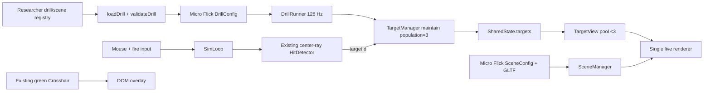

# WP-56（暫用編號）— Micro Flick Three-Target Test Scene

> Stage 12 的第一個 Work Package。場景依使用者提供的 `Media1.mp4` 作為視覺／玩法參考；影片內文字只視為畫面證據，不視為專案指令。
>
> Companion：[task-checklist.md](task-checklist.md) · [progress.md](progress.md)
>
> 本計畫依 `.claude/skills/engineering-planning/SKILL.md`、`references/design_standards.md` 與 `assets/tech_spec_template.md` 制定。**本 WP 先交付 researcher-only／practice 測試場景；不製作槍枝、手臂或第一人稱 weapon view model。**

| | |
|---|---|
| **Problem** | 現有場景／drill 管線只保證單一 active target，且 seeded `spawnArea` 只有水平 yaw 與距離，無法表達影片中的固定位置、三顆同時存在、水平＋垂直隨機分布與命中補位 |
| **Outcome** | 可從研究者控制列載入一個灰白狹長走廊；玩家位置固定、保留滑鼠視角與綠色準星；場上恆維持最多三顆紅色球形目標，命中後最遲下一個 128 Hz sim tick 補位，直到練習結束 |
| **Truth model** | `DrillConfig` 是玩法資料來源；`SharedState.targets` 是 live target truth；render 只讀 state；seeded spawn sequence 在不同 render FPS 下逐 tick 一致 |
| **Delivery policy** | v1 為 practice／researcher-only；不加入正式 participant protocol、不宣稱 full replay、不改研究指標定義 |
| **Estimate** | 8.5–15.5 dev-days（T0～T6 + T-exit） |
| **Risk** | High：`DrillConfig` 與 `SceneConfig` 為跨模組核心契約；`TargetManager`／`DrillRunner` 註解與部分測試建立在單 active target 假設上 |
| **Status** | T0／T1 complete（2026-09-04）；使用者以明確 T1 實作指令採用 Candidate A 與 60-kill quota，T2～T6未開始 |

---

## 0. Repository-grounded discovery（2026-09-04）

1. `SceneManager` 已支援 `SceneConfig.asset` 的 GLTF 場景、camera、燈光、resize、fallback 與 GPU dispose；新走廊可走既有 asset pipeline，不必在 `main.ts` 內硬編幾何。
2. 內建 procedural room 只有地板與四牆，沒有天花板、板材接縫或模組化牆面；要接近影片構圖，建議新增輕量 `micro-flick-room.gltf`，而不是把 scene-id 特例塞進 `SceneManager`。
3. `TargetManager.tick()` 目前以 `hasAliveTarget()` 實作單 active target；`targets.count` 是整場 spawn 總數，不是同時存在數。
4. `DrillRunner` 的 lifecycle 說明、timeout／presentation 推進與測試主要以單 active target 為前提；`seenIds.size - state.targets.length` 雖可泛化，但必須以三靶替換／耗盡情境證明。
5. `SpawnAreaConfig` 目前只有 `yawDegRange` 與 `distanceURange`，生成高度固定為 `TARGET_Y = 1.5`；無法重現影片中上／中／下位置。
6. `HitDetector.raycastWithRay()` 已遍歷所有 `visible && alive` targets 並取最近交點，具多目標基礎；需補遮擋、重疊與 target-id 精準撤除測試，不另建第二套 hit test。
7. `TargetView` 已用共享 geometry/material + mesh pool 顯示任意數量 targets，sphere geometry 也已存在；本 WP 應把 pool 上限驗證為 3，而不是新增三個專用 render objects。
8. `Crosshair` 已是固定螢幕中心的綠色 DOM overlay，與 camera 中心射線同源，可直接沿用。
9. 目前 live render path 沒有 gun／hands view-model object；「不製作槍枝模型」因此是 scope boundary 與 regression gate，不是新增隱藏系統的理由。
10. `SimLoop` 每 tick 無條件執行 movement integration；僅用 `playerCorridor` 或 `protocolGuard.noMovement` 不能真正鎖住位置，需一個 additive、預設不變的 translation policy。
11. live `visible`／`fire`／`hit` events 帶 `targetId`，足以驗證三靶互動；但 WP-50 full replay profile／capture 以單 target 為既有官方契約，本 WP 不應把新 drill 誤升為 full replay。
12. 現有主迴圈固定 128 Hz sim、rAF render、SharedState 單向呈現邊界皆可沿用；本 WP 不需要 worker、第二 rAF 或第二 renderer。

### 0.1 Planning-time blast radius

- `DrillConfig`：CodeGraph 顯示約 115 個 consumers；新增欄位必須 optional、strict validation 且舊 fixtures parse 結果不變。屬 cross-module。
- `SceneConfig`：約 79 個 consumers；採既有 GLTF + 現有 `proceduralRoom` camera/light contract，可把修改限制在新增 scene config／asset／registry，避免擴充核心型別。屬 local-to-registry。
- `createTargetManager`：約 39 個呼叫／28 個 `TargetManager` consumers；多 active lifecycle 會碰 sim、drill、test harness 與 deterministic fixtures。屬 cross-module High risk。
- `DrillRunner`：約 9 個直接 callers；不先假定需要重寫，T0/T2 以多目標 tests 判斷最小修改。
- `TargetView`：3 個 live callers且已有單元測試；預期只新增三靶／pool bound regression，屬 local。
- `HitDetector`：現有 multi-target nearest-hit contract 已成立；預期只補 tests，除非 T0 證明 sphere overlap／同距 tie-break 不符合需求。

---

## 1. 需求壓縮（Requirements）

### 1.1 Functional Requirements

| ID | Requirement |
|---|---|
| **FR-56.1** | 系統**必須**提供 exact `drillId = micro_flick_three_target_test_v1` 與 exact `sceneId = micro-flick-room`，並只從 researcher／practice 入口載入。 |
| **FR-56.2** | 場景**必須**呈現狹長、對稱、灰白色封閉走廊，包含亮色地板／側牆／端牆、較深天花板與規則板材接縫，畫面線條匯聚於中央消失點。 |
| **FR-56.3** | 系統**必須**鎖定玩家世界位置；W/A/S/D 輸入不得改變 `player.x/z`、camera base position 或 target engagement distance，但滑鼠 yaw/pitch 仍可操作。 |
| **FR-56.4** | 系統**必須**顯示固定在螢幕中心的綠色準星，且中心射線與準星在所有支援 viewport 尺寸一致。 |
| **FR-56.5** | 系統**必須**使用紅色球形目標，visual geometry 與 sphere hitbox 讀同一 `TargetState.hitbox` 尺寸來源。 |
| **FR-56.6** | drill running 且 spawn budget 足夠時，系統**必須**維持恰好三個 unique、`visible && alive` targets；不得把既有 `targets.count` 誤解為 concurrent count。 |
| **FR-56.7** | 三個 targets **必須**由 seeded 水平＋垂直角度範圍及距離範圍生成，並符合凍結的最小中心角距；相同 seed 產生相同 target-id／position sequence。 |
| **FR-56.8** | 命中任一 target 時，系統**必須**只撤除該 target；其餘兩個 target 的 ID 與位置不變，並在下一個 128 Hz sim tick 結束前補入一個新 target。 |
| **FR-56.9** | 未命中、命中場景幾何或對已撤除 ID 重送 kill 時，系統**必須**不消耗 target quota、不替換仍存活 targets。 |
| **FR-56.10** | spawn budget 耗盡時，系統**必須**讓剩餘 targets 可被逐一清除，並在完成 `endCondition` 後進入 `ended`；restart 必須清除舊 IDs 並從同 seed 重建同一序列。 |
| **FR-56.11** | 場景**不得**建立或載入槍枝、手臂、hands、muzzle 或第一人稱 weapon view-model；射擊仍走既有中心射線／weapon timing 邏輯。 |
| **FR-56.12** | 系統**必須**沿用既有 score、time、hit rate 與 `visible/fire/hit` target-id 事件，不複製影片中的 Kovaak 編輯器、FPS counter 或 ammo bar。 |
| **FR-56.13** | 系統**必須**在 scene／drill 切換、restart 與離開時釋放舊 asset、target meshes與 listeners；不得殘留上一輪 targets 或 GPU resources。 |
| **FR-56.14** | 新 drill **必須**保持 practice-only，且 replay support 不得標為 `full`；未來升為 Assessment 或 full replay 前需另有資料契約與 evidence。 |
| **FR-56.15** | 場景資產載入失敗時，系統**必須**走既有 fallback／錯誤狀態且仍可切換離開；不得黑屏、卡住 sim 或靜默載入另一個 drill。 |

### 1.2 Non-functional Requirements

| ID | Requirement / measurable gate |
|---|---|
| **NFR-56.1** | 128 Hz 下 target hit → replacement latency ≤ **1 tick（7.8125 ms）**；active target count 在補位後恆為 3，耗盡尾段除外。 |
| **NFR-56.2** | 相同 seed／input timeline 在 30、60、144、240 render FPS 下的逐 tick `targetId/position/alive/visible` trace 必須完全一致。 |
| **NFR-56.3** | 連續 10,000 次 target replacement 中不得出現超出 spawn bounds、非有限座標、重複 active ID 或低於凍結 separation 的 target pair。 |
| **NFR-56.4** | `TargetManager.tick + TargetView.sync` 在 3 targets、10,000 warmed iterations 的 P95 < **1 ms**；量測須記錄 CPU、browser、build mode 與樣本數。 |
| **NFR-56.5** | 1,000 次 replacements 後 `TargetView.poolSize === 3`；scene children、geometry、material 與 listener 數不得隨命中次數成長。 |
| **NFR-56.6** | cached asset 下，選擇 drill 到第一個可見場景 frame P95 < **1,500 ms**；load failure 仍可於 **100 ms** 內操作離開／切換。 |
| **NFR-56.7** | 1920×1080 與 1280×720 下三靶完整位於 viewport safe region；準星中心誤差各軸 ≤ **1 CSS px**。 |
| **NFR-56.8** | target red 與其 spawn zone 背景的最小對比度 ≥ **3:1**；三顆球不得因燈光變成不可辨識的黑面或白面。 |
| **NFR-56.9** | `npm run typecheck`、`npm test`、`npm run build`、`npm run test:e2e` 與既有 determinism／scene／drill／replay regressions exit 0。 |

### 1.3 Constraints

- 保持 TypeScript + Three.js/WebGPU + Vite + 純 DOM；不新增遊戲引擎、物理引擎或 UI framework。
- 固定 128 Hz sim 與現有 rAF render 邊界；spawn RNG 只能在 spawn event 消費，不得依 render frame 消費。
- `DrillConfig.targets.count` 保留「整場總 spawn budget」語意；新增 concurrent population 契約不得改舊 drill 行為。
- 舊 drill 未提供新欄位時，其 parse、spawn、movement、metrics、export 與 replay 行為逐位／結構相容。
- scene geometry 不進 sim truth；目標位置、hitbox、命中與紀錄仍使用 canonical source units。
- v1 不製作槍模／手模、射擊動畫、muzzle flash、Kovaak editor UI、ammo bar、音效、移動關卡或敵人 AI。
- v1 不加入正式 Assessment、Participant session、history persistence 或 full replay profile。
- 使用者提供影片不複製進 repo；任何 approved visual baseline 只保留必要、可追溯且合法的本專案 screenshot。

### 1.4 Assumptions

- 「固定第一人稱視角」解讀為 camera **位置固定**，滑鼠 yaw/pitch 可動；準星固定螢幕中心。
- 「立即補位」量化為命中後最遲下一個 128 Hz sim tick 恢復三個 active targets。
- 初始候選為固定距離附近的 rectangular angular field；確切 FOV、yaw/pitch bounds、target diameter、separation 與 target quota 在 T0 凍結。
- 預設以 `targets.count = endCondition.value` 的 target-count 練習收尾，避免新增無界 spawn sentinel；若 owner 選 time-limit，T0 必須另外定義有限安全 budget。
- 目標彼此不能視覺重疊；bounded rejection sampling 超過固定次數時採 deterministic fallback，不可無限迴圈或改用非 seeded randomness。
- HUD 沿用現有 score/time/hit-rate；固定位置造成 velocity 恆為 STOP 可接受，精簡 HUD 不是本 WP 必要條件。

### 1.5 Open Questions

| ID | Question | Recommended default | Owner | Deadline | Impact if unresolved |
|---|---|---|---|---|---|
| **OQ-56.1** | 場景／玩法理解與同時三靶、固定位置、無槍模是否正確？ | ✅ 已確認（2026-09-04，使用者訊息） | 使用者 | 已收斂 | 全 WP scope |
| **OQ-56.2** | 首版 FOV、yaw/pitch bounds、球體角直徑與最小 separation 採何值？ | ✅ 75° FOV、yaw ±22°、pitch ±12°、3°球、7° separation、12–14u（2026-09-04 使用者明確要求實作 T1，採 Candidate A） | 使用者 + Gameplay owner | 已收斂 | T1 config、T2 spawn、T3 visual baseline |
| **OQ-56.3** | 練習以 target quota 或固定時間結束？ | ✅ target quota，60 kills（2026-09-04 使用者明確要求實作 T1） | Gameplay owner | 已收斂 | count/budget、T2 exhaustion、T4 HUD |
| **OQ-56.4** | 未來是否要升為正式 Assessment／full replay？ | v1 否；保持 practice-only，另開 WP 擴充多 target replay/capture 與研究指標 | Product/Research owner | T-exit 前確認 handoff 即可 | FR-56.14、資料 schema、history/replay |
| **OQ-56.5** | 是否需要完全複製影片左上角 SPM/TTK/KPS 面板？ | 否；本 WP 沿用現有 HUD，只重現場景與核心互動 | 使用者 | T4 開工前 | T4 UI scope、視覺 baseline |

---

## 2. 系統架構與設計（Technical Design）

### 2.1 System boundary

#### In scope（planning-time targets）

```text
src/drill/DrillConfig.ts                           MODIFY optional population/player-control/spawn-pitch contracts
src/drill/schema.ts                                MODIFY strict validation + legacy compatibility
src/drill/micro_flick_three_target_test_v1.ts      NEW practice drill config
src/sim/TargetManager.ts                           MODIFY maintain-population seeded spawn policy
src/drill/DrillRunner.ts                           VERIFY/MODIFY multi-active counting/timeout assumptions minimally
src/loop/SimLoop.ts                                MODIFY additive translation lock option/path
src/scene/scenes/micro-flick-room.ts               NEW scene config
public/assets/scenes/micro-flick-room/*             NEW lightweight GLTF + local textures only if required
src/main.ts                                        MODIFY drill/scene registry and composition wiring only
src/render/TargetView.ts                           VERIFY pool=3; no feature branch expected
src/sim/HitDetector.ts                             VERIFY existing nearest multi-target behavior; tests first
src/ui/Crosshair.ts                                VERIFY center visibility; no feature branch expected
src/testharness/fpsTestHarness.ts                   MODIFY only if required for deterministic multi-target evidence
src/**/__tests__ or colocated *.test.ts             NEW/EXTEND contract, lifecycle, render, hit, regression tests
tests/e2e/micro-flick-test-scene.spec.ts            NEW browser acceptance
tests/regression/micro-flick-determinism.test.ts    NEW multi-render-FPS trace parity
```

T0 開工前須以當時 worktree 與 CodeGraph 重新確認實際 paths／impact；本清單是 planning-time target，不授權複製另一套 scene、hit-test、crosshair 或 clock。

#### Out of scope

- 槍枝／手臂模型、view-model animation、muzzle flash、reload animation與 Kovaak UI 複製。
- 玩家平移、掩體、導航、敵人 AI、moving targets或物理碰撞關卡。
- 修改現有 weapon ballistics、recoil、spread、ammo 或 fire cadence；測試場景只消費既有射擊路徑。
- 新研究指標、SPM/TTK/KPS 定義、Participant protocol、正式 Assessment、history persistence。
- multi-target full replay、影片錄製／輸出、free camera、場景編輯器。
- pixel-perfect 複製第三方影片；驗收以可量測構圖與使用者核准 baseline 為準。

### 2.2 Data flow



時序：running tick 先把 population 補至 3、蓋每個新 target 的 `t_visible`，再處理該 tick 的 fire events；命中後 `markKilled(targetId)` 只撤該 ID，下個 sim tick 再補位。render 每幀只讀 `SharedState.targets` 並以既有 pool 同步，不產生 spawn 或 RNG。

### 2.3 Candidate additive contracts（T0 freeze、T1 implement）

```ts
export interface TargetPopulationConfig {
  /** 同時維持的 visible && alive 數；v1 schema range 1..16，且 <= targets.count。 */
  readonly activeCount: number;
  /** 命中後由下一個 sim tick 補位；不在 render 或 markKilled 內消費 RNG。 */
  readonly replacement: 'next-tick';
}

export interface SpawnAreaConfig {
  readonly yawDegRange: [number, number];
  readonly distanceURange: [number, number];
  /** 省略時沿用現有固定 TARGET_Y；提供時為相對中心 sightline 的垂直角度範圍。 */
  readonly pitchDegRange?: [number, number];
  /** active targets 的中心角最小距離；省略時不做 pair separation。 */
  readonly minAngularSeparationDeg?: number;
}

export interface PlayerControlConfig {
  /** 省略 = 'enabled'，舊 drill 逐位不變。 */
  readonly translation: 'enabled' | 'locked';
}

export interface DrillConfig {
  readonly playerControl?: PlayerControlConfig;
  readonly targets: {
    readonly count: number; // 既有：整場 spawn budget
    readonly distance: number;
    readonly population?: TargetPopulationConfig;
    readonly spawnArea?: SpawnAreaConfig;
    // existing hitbox/motion/tracking fields unchanged
  };
  // existing fields unchanged
}
```

Validation contract：

- `population.activeCount` 是正整數、`1..16` 且 `<= targets.count`；`population` 存在時必須有 `sequence.seed`。
- `pitchDegRange` 為 finite ascending pair 且限制於 T0 凍結的安全角範圍；`minAngularSeparationDeg` 為正有限數且不大於 spawn field 可容納上限。
- `population` v1 不與 `spiderShot`、`trackingTrajectory`、timed `presentationMs` 或 cue protocol 組合；不支援的組合在 `validateDrill` 帶 field path fail fast。
- 新欄位省略時，`validateDrill` output 與所有既有 fixtures 保持結構相容。

### 2.4 Spawn and population rules

```ts
export interface TargetManager {
  tick(state: SharedState, nowMs: number): void;
  markKilled(state: SharedState, id: string): void;
  reset(state: SharedState, seq?: 'LR' | 'RL'): void;
}
```

既有 interface 不擴張；行為由 config 決定：

1. legacy（無 `population`）維持現有單 active 路徑。
2. population mode 在 `tick()` 內執行 bounded `while (active < activeCount && spawned < count)`；每次 spawn 只消費固定順序的 seeded RNG。
3. 每個 candidate 必須在 yaw/pitch/distance bounds，且與本幀已接受 active targets 達到 separation。
4. rejection sampling 使用 T0 凍結的固定 attempt 上限；超限走 deterministic grid/farthest fallback 或回 typed configuration error，不得無限迴圈、不得讀 `Math.random()`。
5. `markKilled` 只處理當下存在且 alive 的 exact ID；unknown/stale ID 為 no-op。
6. 每個新 target 都有 unique monotonic ID、`posPrev == pos`、sphere hitbox、`visible=true`、`alive=true`；`t_visible` 由既有 tick 流程蓋戳。
7. restart 清 state 與 RNG stream；同 config/seed 的完整 sequence hash 相同。

### 2.5 Fixed-position control

`DrillConfig.playerControl.translation === 'locked'` 時：

- input event 仍可被 recorder／debug path觀測，但 movement integration 不得改 `player.x/z/vx/vz`。
- 進入／restart 已由 `resetState` 回原點；每 tick 維持 position/velocity finite 且為 0。
- camera yaw/pitch、recoil與中心射線路徑保持既有行為；不得以停用 Pointer Lock 或停用 mouse input 實現。
- 建議將 policy 以 `SimLoopOptions` 或注入的 movement controller 一次性綁定，避免在 `MovementController` 內讀 drill/global state。

候選 seam：

```ts
export interface SimLoopOptions {
  readonly playerTranslation?: 'enabled' | 'locked'; // default 'enabled'
  readonly afterTick?: (state: SharedState, tickEndMs: number, tickIndex: number) => void;
  readonly hitscanOcclusion?: HitscanOcclusionContext;
}
```

### 2.6 Scene and presentation contract

- `micro-flick-room.gltf` 只包含 environment nodes：floor、ceiling、left/right/end walls與 panel seams；不含 weapon、hands、targets、camera、lights或 gameplay objects。
- `micro-flick-room.ts` 提供 `sceneId`、asset version、asset URL、display scale、empty/nonblocking `propBounds`、固定 eye pose、FOV、background與 neutral lights。
- targets 仍由 `TargetView` 建立；GLTF 不烘焙紅球，避免 visual target 與 hitbox truth 分裂。
- camera 位於走廊一端中軸，base orientation 朝 -Z；end wall 必須在 target field 後方且不遮住 targets。
- scene load／switch 只走 `createSceneManagerWithStatus()` 與 `installSceneLoad()`；不新增 renderer 或 scene-id conditional。
- asset inventory test 必須拒絕 node/material 名稱含 `weapon|gun|rifle|pistol|hand|arm|muzzle`（case-insensitive），並核對 approved environment node allowlist。

### 2.7 Hit, HUD and evidence contract

- 命中使用現有 `raycastWithRay()` multi-target nearest-hit 行為；同一射線若意外交會兩 target，只能回最近 ID。
- visual sphere 與 hit sphere 共用 `TargetState.hitbox`，不得以 screen-space circle 做第二套命中。
- Crosshair 的 DOM center 與 renderer canvas center 在支援 viewport 各軸誤差 ≤1 CSS px。
- `visible` events 對每個新 ID 恰有一筆；hit fire event 的 `targetId` 必須等於被撤除 ID；miss 無 target replacement。
- Micro Flick v1 不註冊 WP-50 full replay profile。若 UI 顯示 replay action，T0/T4 必須修正 classifier／entry，不能用舊 scalar target capture 捏造三靶 replay。

### 2.8 Test pyramid

| Layer | Primary evidence |
|---|---|
| Schema/contract | optional defaults、invalid combinations、legacy fixture parity、practice-only flag |
| Pure/domain | seeded positions、bounds/separation、population invariants、restart hash、budget exhaustion |
| Sim integration | 128 Hz replacement latency、exact target-id hit/miss、locked translation、event alignment |
| Render/scene | GLTF inventory、scene load/fallback/dispose、sphere pool=3、camera/FOV/lighting parameters |
| Browser E2E | researcher load、three visible targets、crosshair center、hit replacement、restart、scene switch、no weapon model |
| Determinism/perf | render-FPS parity、10k spawn audit、1k replacement resource bound、P95 timing |
| Manual visual | reference composition、contrast、panel rhythm、no obstruction at 1080p/720p |

### 2.9 Failure-mode design

| Failure mode | Impact | Prevention / handling | Evidence owner |
|---|---|---|---|
| 把 `targets.count=3` 當 concurrent count | 初始三靶後不補生 | additive `population.activeCount`；count仍是總 budget | T1 schema + T2 exhaustion tests |
| 多靶 spawn 仍被 `hasAliveTarget()` 擋住 | 場上只有一靶 | legacy/population 明確分支；initial-fill assertion | T2 unit/integration |
| vertical range 仍固定 `TARGET_Y` | 目標只在水平線 | pitch contract + projection bounds tests | T1/T2 |
| separation rejection 無限迴圈 | sim tick 卡死 | fixed attempts + deterministic fallback/error | T0 PoC + T2 adversarial tests |
| 命中一靶重抽三靶 | 畫面跳動、訓練語意錯 | preserve surviving IDs/positions state hash | T2/T4 |
| RNG 由 render 或 array order 消費 | 不同 FPS 結果漂移 | spawn-only RNG + 30/60/144/240 parity | T2/T5 |
| movement guard 只記違規但仍移動 | engagement distance改變 | sim-level translation policy + position invariant | T4 integration/E2E |
| glTF 內烘焙 targets | 視覺與 hit truth 重複 | environment allowlist；TargetView 唯一 target renderer | T3 asset test |
| 誤加入槍／手模型 | 違反明確 scope | asset inventory + scene graph assertion + manual screenshot | T3/T6 |
| 多 target export 被標 full replay | replay 丟失兩靶仍誤導 | practice-only + no exact full profile + negative replay test | T1/T5/T-exit |
| screenshot 在 GPU/driver 間漂移 | CI flaky | semantic geometry tests為 blocking；pixel diff只用 pinned browser/build，人工 gate記環境 | T5/T6 |
| scene load failure 留下舊 targets | 錯場景／GPU leak | existing generation/dispose path + switch/failure test | T3/T5 |

### 2.10 Concurrency and lifecycle

- 所有 lifecycle、RNG、hit 與 movement policy 仍在 main-thread 128 Hz sim；不新增 worker、mutex、channel、timer 或 rAF。
- render 只讀最新 `SharedState`；GLTF async load 仍由既有 scene load generation／dispose path管理。
- 同一時間只允許一個 live presentation owner、renderer與 scene manager；新場景不繞過 WP-50 `PresentationCoordinator`。
- restart／scene switch 順序：停止舊 drill → reset state/manager → dispose views/scene asset → install新 scene → 建 manager/runner/loop → start；具體既有 composition順序由 T0 impact確認。
- 若 late asset load 或 rapid switch 仍有 race，T3 必須沿用既有 generation/abort seam，不建立 micro-flick 專用全域旗標。

---

## 3. 風險分析（Risk Analysis）

### 3.1 Risk register

| Risk | Level | Evidence / blast radius | Mitigation |
|---|---|---|---|
| 核心 config 擴充造成舊 drill 回歸 | High | `DrillConfig` 約 115 consumers；schema/fixtures 廣泛 | optional defaults、negative matrix、全量 Vitest、legacy trace parity |
| 單 active target 假設散落 | High | TargetManager 明確 `hasAliveTarget`；DrillRunner comments/tests 假定 0/1 | T0 impact + invariant matrix；T2 先測後改；不動不需要改的 HitDetector/TargetView |
| 多靶 deterministic spawn + separation | High | 現有 RNG 無 pair-spacing policy | bounded deterministic algorithm、sequence hash、10k audit、FPS parity |
| 固定玩家位置破壞 movement/recorder | Med/High | movement 每 tick積分，input/metrics共用 state | additive loop policy預設 enabled；locked drill integration + legacy movement regression |
| 場景視覺靠人工主觀判斷 | Med | 影片沒有 world-unit ground truth | T0 凍結 measurable FOV/bounds/contrast；semantic tests + approved screenshots分層 |
| asset／GPU lifecycle | Med | GLTF async、scene switching、shared renderer | 既有 loader/dispose；50-cycle switch與failure E2E |
| replay/export 不支援三 target snapshot | High | WP-50 full profile以單 target為既有官方契約 | practice-only、unsupported/partial honesty、另開後續 WP |

### 3.2 Conscious technical debt

1. **Practice-only v1**：避免在未設計 multi-target replay/capture 與研究指標前進入正式資料。觸發：Product/Research 要求 Assessment 或 historical replay 時，另開 WP 並 version schema/profile。
2. **固定 GLTF asset**：先以單一 approved room 對齊構圖，不建立通用 modular-room authoring system。觸發：需要第二個 panelized aim room或 runtime skinning時，再抽 asset authoring pipeline。
3. **Next-tick replacement**：量化「立即」為 7.8125 ms，不在 `markKilled` 中同步 spawn。觸發：可觀測研究問題要求 sub-tick replacement timestamp 時，需重新定義 sim ordering與 recorder contract。
4. **Pinned visual baseline**：pixel snapshot只保證 pinned browser/build，不宣稱跨 GPU pixel-identical。觸發：CI driver頻繁變動時，以投影幾何／對比度計算取代 blocking pixel gate。

### 3.3 Performance bottlenecks

- separation sampling若在 crowded field重試過多會卡 sim；attempt count固定，T0量測最壞 seed。
- 每次 hit 若重建所有 target meshes／geometry會造成 GC/GPU churn；沿用 `TargetView` pool，歷史最大值固定 3。
- GLTF panel seam若拆成過多獨立 meshes/draw calls會降低場景效能；T3 設 node/primitive/draw-call budget並記 evidence。
- HUD 每幀更新已存在；本 WP 不新增每 target DOM，避免 layout/reflow 隨命中成長。

---

## 4. 任務拆解（Task Breakdown）

| Task | Objective | Dependencies | Risk | Complexity | Definition of Done |
|---|---|---|---|---|---|
| **T0** | Entry gate、數值校準、multi-target／spawn／asset PoC、OQ與blast radius凍結 | None | High | 0.5–1d | production code diff=0；FOV/field/size/separation/quota有owner結論或blocked owner；最壞 seed與asset方案有可重現 evidence |
| **T1** | Additive drill/player/population/spawn contracts與 practice config | T0 | High | 1.5–2.5d | legacy fixtures parse/trace不變；新合法／非法矩陣全綠；exact drill config可載入且未註冊 Assessment/full replay |
| **T2** | Deterministic three-target population lifecycle | T1 | High | 2–3d | initial 3、single replacement、survivor stability、budget tail、restart hash、10k bounds/separation與FPS parity tests全綠 |
| **T3** | Corridor GLTF、scene config、sphere presentation與lifecycle | T0/T1 | Med/High | 1.5–2.5d | asset inventory無weapon/hands/targets；camera/room/load/fallback/dispose、pool=3、contrast與clearance tests全綠 |
| **T4** | Fixed translation、multi-target hit/event/HUD integration | T1/T2/T3 | High | 1.5–2.5d | W/A/S/D零位移、mouse aim有效、hit exact ID、miss不補位、crosshair中心、event alignment與negative replay gate全綠 |
| **T5** | Browser E2E、determinism、performance與resource regressions | T2～T4 | Med/High | 1–2d | E2E happy/failure/restart/switch；NFR P95、1k lifecycle、四 FPS trace與全 regression evidence完成 |
| **T6** | 1080p/720p visual/manual acceptance與owner sign-off | T3～T5 | Med | 0.5–1d | approved screenshots、場景對照表、no-weapon、對比／safe region與 open questions簽核寫入 progress |
| **T-exit** | WP-56 acceptance與後續 multi-target research/replay handoff | T1～T6 | Med | 0.5–1d | FR/NFR traceability、automated/manual evidence、docs/graph/status/staged files全數對帳；無未註明資料能力缺口 |

Task 詳細步驟與 local DoD 見同資料夾 `T*.md`。

T0 已完成engine/sampling/scene證據收集並清除throwaway artifacts；工程推薦Candidate A為75° FOV、yaw ±22°、pitch ±12°、3°球、7° separation、12–14u、60 kills。使用者於2026-09-04明確要求實作T1，視為採用Candidate A與60-kill quota並解除OQ-56.2／3；完整量測與baseline failure見[T0-entry-gate.md](T0-entry-gate.md)及[progress.md](progress.md)。

### 4.1 Requirements traceability

| Requirement | Tasks | Verification |
|---|---|---|
| FR-56.1／14 | T1/T4/T-exit | registry/config tests、practice-only與no-full-replay negative E2E |
| FR-56.2／15 | T3/T5/T6 | asset/scene load/fallback tests、visual checklist |
| FR-56.3／4 | T4/T5 | position invariant、mouse/crosshair browser assertions |
| FR-56.5～10 | T1/T2/T4 | schema、population property tests、hit/miss integration、budget end |
| FR-56.11／12 | T3/T4/T6 | asset allowlist、scene graph、HUD scope與manual screenshots |
| FR-56.13 | T3/T5/T-exit | repeat switch/restart/dispose resource counters |
| NFR-56.1～5 | T2/T5/T-exit | 128 Hz latency、FPS trace、10k spawn、P95、pool bound |
| NFR-56.6～8 | T3/T5/T6 | load timing、viewport projection、contrast measurement |
| NFR-56.9 | T5/T-exit | typecheck/Vitest/build/Playwright/regression commands |

---

## 5. Handoff contract

WP-56 完成後，後續 WP 可依賴：

- optional、legacy-compatible的 target population／vertical spawn／translation lock契約；
- three-target deterministic lifecycle與 exact target-id event evidence；
- reusable `micro-flick-room` scene asset/config與 no-weapon inventory gate；
- 1080p/720p approved visual baselines、four-render-FPS determinism與resource/perf evidence；
- 明確的 practice-only／no-full-replay boundary。

若後續要升為 Assessment 或 full replay，必須另外處理 multi-target tick snapshots、replay sampling／view、exact profile、研究 metrics validity與 history compatibility；不得只把 `mode` 改為 `assessment`。

---

## 6. Execution rules

- 一個 task = 一個垂直切片 = 一個原子 commit；tests/evidence/progress未完成，不開下一 task。
- 修改既有 symbol 前執行 CodeGraph impact並把 affected files/symbols與 local/cross-module 判定寫入 [progress.md](progress.md)。
- T0 未凍結數值與 OQ-56.2/3 前，不提交 production config／asset；PoC artifacts只放驗證過的 temp root並於 T0 exit清除。
- 新 config欄位一律 optional + explicit default；禁止用 `drillId === 'micro_flick...'` 在 engine module內做特例。
- RNG只在 sim spawn event消費；render、DOM、asset load與 wall clock不得影響 target sequence。
- `TargetView`、`HitDetector`、`Crosshair`能以 tests證明現有契約足夠時，只補 regression，不為本 scene fork class。
- 測試 payload／screenshots不得寫真實 `data/session-history/` 或 Participant roots；新 drill保持 practice-only。
- production code修改後執行 `graphify update .`；T-exit檢查 `git status --short`、`git diff --cached --stat`與 staged names只含本 WP 預期檔案。
