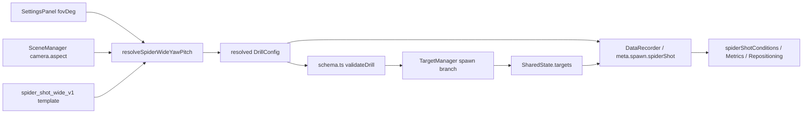

# WP-57（暫用編號）— Spider Shot Wide Flick（大幅度拉槍評測）

> Stage 12 的第二個 Work Package。上游同 stage 參照：[WP-56](../wp-56-micro-flick-test-scene/README.md)（`playerControl.translation` seam、scene 綁定先例）；既有 Spider Shot 家族：[WP-36](../../../completed/stage6/wp-36-spider-shot/README.md)（`spider-shot-v1`，參數已凍結）、[WP-44](../../stage9/wp-44-spider-shot-v2-stratified/README.md)（`spider-shot-v2` 分層排程）。
>
> Companion：[task-checklist.md](task-checklist.md) · [progress.md](progress.md)
>
> 本計畫依 `.claude/skills/engineering-planning/SKILL.md`、`references/design_standards.md` 與 `assets/tech_spec_template.md` 制定。**本 WP 交付 researcher-only／practice 的大幅度拉槍 drill；不修改 `spider-shot-v1`／`v2` 的任何參數或幾何，不晉升為 Assessment、不進 history／compatibility cohort、不新增教練報告指標。**

| | |
|---|---|
| **Problem** | 現有 Spider Shot 幾何是「繞中心視線的圓錐」（azimuth + 離軸 radius），無法表達「周邊目標貼近 FOV 水平極限、但高度限制在中心目標 ±15° 內」的大幅度拉槍刺激；且該圓錐的軸取自世界原點而非眼睛，與玩家實際所見有系統性偏移 |
| **Outcome** | 研究者可載入一個寬場 arena，玩家位置鎖定；目標在「中心 ↔ 貼近水平 FOV 極限的左／右周邊」之間交替，周邊 yaw 幅度由當次 FOV／aspect 在 arm 時解析、pitch 為受地板約束的對稱干擾窗；每次 transition 的刺激幾何可由匯出完整重建 |
| **Truth model** | resolved `DrillConfig` 是 spawn 幾何的唯一來源；`SharedState.targets` 是 live target truth；FOV／aspect 只在 arm 時被讀一次並凍結成 config 常數，sim runtime 不讀任何 render／scene／時鐘狀態 |
| **Construct** | 大幅度拉槍：周邊視野偵測 → 高幅度角位移執行 → 停止控制 → 首發命中。**刺激**的眼睛所見角位移從 v2 的 ~10–25° 提升到 ~40–70°（依 FOV／aspect，見 §2.4）；其餘構念定義完全沿用既有五類指標，不另立第二套公式（C-D4）。⚠️ **匯出的 `angularDistanceDeg` 是 origin-frame，與眼睛所見有系統性偏差**（T0 量化：孤立 arena 選型下最壞 27.9°，`eyeZ: 0` 下收斂到 ≤ 2.4°）——見 §2.5 與 OQ-57.7 |
| **Delivery policy** | v1 = practice／researcher-only。時序參數（`peekTimeoutMs`／`timeLimitMs`）與 yaw 貼邊係數為未校準候選值，晉升 Assessment 是後續獨立 WP 的職責 |
| **Estimate** | 9.5–16 dev-days（T0～T6 + T-exit） |
| **Risk** | High：新增 spawn 幾何進 `TargetManager`（sim 核心）；aspect 進入 spawn 解析與 GD-10「解析度不改 sim」存在直接張力；`DrillConfig` 為約 115 consumers 的跨模組契約 |
| **Status** | 🟡 T0／T1／T2／T3 ✅（2026-09-07，見 [progress.md](progress.md) 各 §evidence）。**T4 已解除阻塞** —— OQ-57.7 於 2026-09-07 由 KI-026／BD-026／[GD-32](../../../DECISIONS.md) 拍板為**選項 (b)** 並落地（匯出角度已統一 eye-frame）；T5 相依 T4；T6 相依 T4 並額外承接 T3 步驟 8 的實機截圖（D-57.T3-3） |

---

## 0. Repository-grounded discovery（2026-09-07；T0 於 2026-09-07 逐項覆驗，見 [progress.md](progress.md) §T0 audit）

1. `SpiderShotScheduleConfig` 目前是兩支 discriminated union（`center-peripheral`、`center-peripheral-stratified`），定義於 `src/drill/DrillConfig.ts`（`SpiderShotCenterPeripheralConfig` line 81、`SpiderShotStratifiedConfig` line 113、union 本體 line 123）；`spiderShot` 為 `DrillConfig` top-level optional 欄位（line 184），`DrillConfig` 本體 line 144。
2. 周邊位置由 `peripheralPos()`（`src/sim/TargetManager.ts:150`）產生：以 `(0, TARGET_Y, -centerDistanceU)` 為中心視線建立正交框，再取 azimuth + 離軸 radius。**該視線向量的起點是世界原點，不是眼睛**（`TARGET_Y = 1.5`，`TargetManager.ts:67`；眼睛 `y = 1.6`，`src/metrics/eyeOrigin.ts:69` 與 `PLAYER_EYE_HEIGHT_U = 1.6`，`src/scene/clearance.ts`）。錐軸因此相對真實視線仰起 `atan(1.5/8) ≈ 10.6°`；一個「radius 45°、azimuth 90°」的點在玩家眼中落在 pitch ≈ −4.0°，不是 0°。
3. 上述偏移在 v1/v2 **兩端一致**：`deriveSpiderShotTransitions()`（`src/metrics/spiderShotConditions.ts`）同樣以 `normalize(targetPoint)`（世界原點）計算 `D_deg`。指標內部自洽、既有結論不因此失效，但幾何語意與玩家所見不同源。本 WP 不回頭改 v1/v2（參數已凍結），差異入帳為 GD-32。
4. 另一套 yaw/pitch 取樣器 `angularSpawnPose()`（`src/sim/TargetManager.ts:102`）是**圓柱**不是球面：`y = TARGET_Y + tan(pitch)·d`，水平半徑恆為 `d`，故 3D 距離 `= d / cos(pitch)`。pitch 15° → 距離 +3.5%、目標角徑 −3.4%。對 `micro_flick` 的 ±12° 影響小，但本 WP 要把 `W_deg` 當條件變因，不能沿用。
5. FOV 是玩家可調 UI 滑桿（`src/ui/SettingsPanel.ts:26-29`：垂直 FOV `60–120`，預設 `75`，step 1），經 `src/main.ts:698` 寫入 `meta.fovDeg`。camera aspect 由 main 於 resize 時餵給 `SceneManager.resize()`（`src/render/SceneManager.ts:57`），**不在任何匯出欄位內**。
6. `src/data/DataRecorder.ts:124` 記載：Lock 鎖定中整組設定隱藏（KI-003）⇒ **drill 進行中 sensitivity/FOV 不可能變動**，單一快照即足夠。這是「arm 時解析一次即可」的既有事實依據。
7. `meta.spawn.spiderShot` 是 opaque `unknown`（`src/data/metadata.ts:25`、`src/data/exportPayloadSchema.ts:482-488`），且 `src/main.ts:741` 已把 `activeDrillConfig.spiderShot` 整塊複製進 metadata。故 **resolved 參數只要進 resolved config 就自動落匯出**，不需要擴充 schema 型別。
8. `meta.dpi` 已存在（`src/data/metadata.ts:137-138`，WP-40 交付，self-reported）。配合 `src/input/mouseGain.ts` 的 gain 模型，`counts/360` 與 `cm/360` 可離線完全推導，不需新增輸入欄位。
9. `schema.ts` 已拒絕 `spiderShot` 與 `targets.population`（line 98–100）以及 `targets.spawnArea`／`sequence.spawnDelayMsRange`／`sequence.seed`（line 101–105）併用；`validateSpiderShotSchedule()`（`schema.ts:233`；分支於 235／248，未知 `kind` 於 268 throw）逐 `kind` 分支驗證 → 新增第三支是既有擴充點，不是新機制。**line 268 的錯誤訊息硬編了兩個合法 `kind` 字串**，T1 新增分支時必須同步更新，否則 typed error 會說謊。
10. 預設 procedural room 為 `roomSize: [10, 10, 3]`、`eyeHeight: 1.6`、`eyeZ = depth/2 − CAMERA_STANDOFF = 4`（`src/scene/eyePose.ts:7-24`）；房間只有地板與四牆、**沒有天花板**（WP-56 discovery item 2）。
11. `validateClearance()`（`src/scene/clearance.ts`）只檢查 target envelope 對 **props** 的淨空，`CLEARANCE_MARGIN_U = 0.5`；**牆與地板不在檢查範圍內**。故「目標穿牆／埋地板」目前無自動閘，本 WP 必須自帶幾何斷言。
12. `playerControl: { translation: 'locked' }` 為 WP-56 交付的既有 additive seam（`src/drill/micro_flick_three_target_test_v1.ts`），預設不變、已有測試覆蓋，可直接沿用。
13. `src/main.ts:179`／`:181`（`spiderShotV1`／`spiderShotV2` 兩列）所在的 drill roster 是**模組載入期的靜態常數陣列**；其項型別 `AvailableDrill` 除 `{ id, label, source, sceneId? }` 外還有 **`loadOptions?: DrillLoadOptions`**（見 `main.ts:124`，`holdClickV1`／`peekClickTransferPilotV1` 等列已使用）。`activeDrillConfig` 有**三個**寫入點：模組載入期初始化 `main.ts:259`，以及 `main.ts:1236`（換 drill）與 `main.ts:1279`（換 scene）兩處 reassign。本 drill 不作為初始 drill，故 arm 時解析落在 1236／1279 兩處即足夠，且必須在 `createTargetManager` 消費 config 之前（消費點 `main.ts:916`／`main.ts:1280`）。
14. `DrillMetricRegistry`（**位於 `src/history/DrillMetricRegistry.ts`，不在 `src/metrics/`**）只註冊 exact `drillId`（`registrationForExactDrill()` line 293–294，near-miss 如 `spider-shot-v2-alt` 明文拒收，見 line 23 註解）。目前註冊兩個 drill：`spider-shot-v2` 有 **5** 個指標（`spider-v2.peripheral-hits-per-minute`／`.peripheral-first-shot-hit-rate`／`.median-peripheral-hit-time-ms`／`.median-fire-angle-error-deg`／`.median-overshoot-deg`，descriptors 於 line 82/90/98/106/114）與 `peek-click-transfer-v1` 有 4 個。practice run 不可達 `buildCompatibilityKey()`（FR-F17）⇒ practice-only 的 v1 **不需要**也**不應該**進 registry。

### 0.1 Planning-time blast radius

> 計數於 **2026-09-07 T0** 以 CodeGraph 覆核（index 當時 auto-sync 停用、狀態凍結；本節符號皆為長期存在、非本 session 修改，故計數採信，並在 [progress.md](progress.md) 記錄 caveat）。原規劃估計一併保留以顯示落差。

- `DrillConfig` / `SpiderShotScheduleConfig`：`DrillConfig`（`DrillConfig.ts:144`）**123 callers／28 模組／16 個測試檔**（原估「約 115」）；`SpiderShotScheduleConfig`（`DrillConfig.ts:123`）只有 **3 callers**（`schema.ts`、`DrillConfig.ts` 自身），且無直接覆蓋測試 —— 它的行為保護實際來自 `spider_shot_v1.test.ts`／`spider_shot_v2.test.ts` 這層 drill-level 測試。新增 union 分支必須 additive、strict validation，且既有 fixtures parse 結果與 v1/v2 spawn 序列逐位不變。屬 **cross-module**。
- `createTargetManager`（`TargetManager.ts:223`）：**44 callers**（production 僅 `src/main.ts` 與 `src/testharness/fpsTestHarness.ts` 兩處，其餘為測試）／**19 個測試檔**（原估「約 39 呼叫／28 consumers」）。是 sim 熱路徑與決定性 fixtures 的交會點。新增 sample 分支必須與既有兩支完全隔離（不共用 `nextSide`、不共用 zone queue 狀態）。屬 **cross-module High risk**。
- `src/metrics/spiderShotConditions.ts`：`deriveSpiderShotTransitions`（line 29）**production caller 為零**——唯一呼叫者是自身的 `spiderShotConditions.test.ts`；`DrillMetricRegistry.ts:125` 只在註解提及它，並在 line 334 註解明言「mirrors their exact semantics rather than inventing a second one」。⇒ 新增 `side` 為 additive optional 欄位的風險比原估更低，**但 `targetConditionCell` 的格式耦合實際落在 `DrillMetricRegistry` 的 `SPIDER_SHOT_V2_CONDITION_CELL`（line 281）**，那才是不得變動的那一份。`quadrant`／`angularDistanceDeg`／`angularSizeDeg` 格式同樣不得變動。屬 **local**。
- Scene registry：**T0 確認沒有獨立的 registry 檔案** —— 場景清單是 `src/main.ts:133-141` 的 `availableScenes: AvailableScene[]`（`{ id, label, config }`），每個場景 config 各自一個 `src/scene/scenes/*.ts` 模組；WP-56 的 `microFlickRoom`（`main.ts:140`）即本 WP 的直接先例。第二個消費面是 `src/testharness/fpsTestHarness.ts:189` 的 `findSceneConfig()`（protocol scene 查表，以 `sceneId` 比對）。`SceneConfig`（`SceneConfig.ts:45`）本身有 84 callers／22 模組 ⇒ **只要不擴充 `SceneConfig` 核心型別**，新增一筆 config + 一列 roster 即屬 **local-to-registry**；一旦要動型別就升級為 cross-module。
- `src/main.ts`：新增一個 roster 項與一段 arm-time resolve；不得把 resolver 邏輯內嵌在 render callback。屬 **local**，但需 E2E 覆蓋。
- `src/metrics/spiderShotMetrics.ts`：**零修改**（T0 已逐函式覆核，見 [progress.md](progress.md) §T0 audit）。全檔 9 個函式對 azimuth／radius／origin-frame 錐軸零引用；唯一與 spawn 相關的耦合是 line 42 的 `event.zone === 'peripheral'` 過濾，且它取眼睛原點的 `resolveEyeOrigin()`／`angularEccentricityDeg()`（`eyeOrigin.ts`）——**已經是 eye-frame**，與本 drill 的新幾何同源。

---

## 1. 需求壓縮（Requirements）

### 1.1 Functional Requirements

| ID | Requirement |
|---|---|
| **FR-57.1** | 系統**必須**在 `SpiderShotScheduleConfig` 新增第三支 `kind: 'center-peripheral-yawpitch'`，並在 `schema.ts` 逐欄位 strict 驗證（含區間非退化、區間方向、pitch 對稱性）。`center-peripheral` 與 `center-peripheral-stratified` 兩支的型別、驗證與 spawn 結果**逐位不變**。 |
| **FR-57.2** | 系統**必須**以 **eye-frame 球面**產生位置：`pos = eye + d·(sin(yaw)·cos(pitch), sin(pitch), −cos(yaw)·cos(pitch))`，`eye = (0, PLAYER_EYE_HEIGHT_U, 0)`。`abs(pos − eye)` 對所有落點恆等於 `d`；`yaw`／`pitch` 即玩家的螢幕水平／垂直視角。中心目標為 `yaw = 0, pitch = 0`，故「相對中心目標 ±p 度」與 `pitch ∈ [−p, p]` 完全等價，不需偏移換算。 |
| **FR-57.3** | 系統**必須**提供純函式 resolver，於 drill **arm 時**呼叫一次，把 `(fovDegVertical, aspect, hitboxDiameterU, distanceU)` 解析成具體 `yawMagDegRange`，寫入 resolved `DrillConfig`。`TargetManager` 只消費解析後的常數；sim runtime **不得**讀取 FOV、aspect、camera、`SceneConfig` 或任何時鐘。 |
| **FR-57.4** | 系統**必須**保證每個 spawn 的目標**完整落在畫面內**：目標外緣的 `ndc_x` 絕對值 ≤ `1 − screenMargin`，且 `abs(ndc_y) ≤ 1 − screenMargin`。判定式沿用直線透視關係 `ndc_x = tan(yaw)/tan(halfHFOV)`、`ndc_y = tan(pitch)/(cos(yaw)·tan(halfVFOV))`。 |
| **FR-57.5** | 周邊目標的 `pitch` **必須**在對稱窗內均勻取樣，且該窗上界由**地板淨空**推導而非任意常數；`pitch` **不得**進入 `targetConditionCell`（干擾項，非條件變因），但必須可由匯出座標離線還原。 |
| **FR-57.6** | 周邊 spawn **必須**取自 seeded、耗盡即重洗的分層佇列，維度為 `side (L/R) × pitchBand`；同一 seed 產生同一序列。`sequence.seed` 不得被讀取（沿用 `spiderShot.seed` 單一 seed 權威）。 |
| **FR-57.7** | 中心 ↔ 周邊交替、`zone` 蓋章與 `centerExemptFromTimeout` 語意**必須**與既有兩支完全一致；`side` 欄位承載真實左右（不再恆為 `'R'`），且該差異必須在匯出語意文件與 `CONTEXT.md` 記名。 |
| **FR-57.8** | drill **必須**鎖定玩家位移（`playerControl: { translation: 'locked' }`）。理由是契約前提而非偏好：yaw/pitch 是相對 `eye = sim 原點` 定義的，玩家一旦橫移，刺激的角度語意即失效。滑鼠視角、Pointer Lock 與開火路徑不受影響。 |
| **FR-57.9** | 系統**必須**新增一個寬場 procedural arena scene config 並綁定到本 drill；該 arena **必須**容納最壞情況（FOV 上限）的周邊落點。同時**必須**有負向證據：預設 `[10, 10, 3]` 房間在任一 FOV 下都會讓目標穿側牆。 |
| **FR-57.10** | resolved 參數（`yawMagDegRange`、`pitchDegRange`、`distanceU`、`hitbox`、`seed`，以及解析所用的 `fovDeg` 與 `aspect`）**必須**全數落入匯出 metadata，使離線分析可在零額外假設下重建刺激幾何。 |
| **FR-57.11** | `deriveSpiderShotTransitions()` **必須** additive 補上 `side: 'L' \| 'R'`（由抵達點的 eye-frame x 符號推導）。`D_deg`／`W_deg`／`quadrant`／`targetConditionCell` 的公式與格式**不得**變動；不得為本 drill 新增第二套夾角或角徑定義（C-D4）。 |
| **FR-57.12** | 系統**必須**提供離線純函式，把「拉槍中途疑似抬滑鼠重新定位」的 transition 標註出來（依 movement 窗內的角速度停滯樣式）。該旗標是**資料品質標註**，不得作為教練報告指標呈現（C-D3）。 |
| **FR-57.13** | drill **必須**可從研究者控制列載入並跑完；`mode: 'practice'`，不得寫入 participant 歷史、不得產生 compatibility cell、不得進 `DrillMetricRegistry`。 |
| **FR-57.14** | 邊界情況**必須**產生 typed error 而非靜默降級：resolver 收到非有限／非正的 FOV 或 aspect、解析後區間退化或反轉、`yawMagDegRange` 下界 ≥ 上界、pitch 窗使目標埋入地板。 |

### 1.2 Non-functional Requirements

| ID | Requirement / measurable gate |
|---|---|
| **NFR-57.1** | **決定性**：同一 resolved config + seed，在 4 種 render FPS（含 rAF 節流）下，tick index 對應的 target position 逐位一致；不斷言 wall-clock 時間戳。 |
| **NFR-57.2** | **v1/v2 零回歸**：`spider-shot-v1`／`spider-shot-v2` 的 spawn 位置序列（前 200 個 spawn，含 seed 重置後）與現況 byte-identical，以 golden fixture 釘死。 |
| **NFR-57.3** | **角徑恆定**：對 ≥ 10,000 個 seeded spawn，`abs(abs(pos − eye) − d) / d ≤ 1e-12`。 |
| **NFR-57.4** | **on-screen**：對 `fovDeg ∈ {60, 75, 90, 120}` × `aspect ∈ {16/9, 21/9, 4/3}` 的 12 組，各 ≥ 10,000 seeded spawn，FR-57.4 兩條 NDC 不等式 100% 成立，失敗數 = 0。 |
| **NFR-57.5** | **GD-10 不變性**：run 進行中改變 camera aspect（resize／解析度模式切換）後，後續 spawn 序列與未 resize 的對照組逐位一致（證明 aspect 只在 arm 時被讀一次）。 |
| **NFR-57.6** | resolver 與投影為純函式：不 import DOM／three／`node:*`／`fs`；無 `Date.now()`、`performance.now()`、`Math.random()`。以 boundary scan 證明。 |
| **NFR-57.7** | sim 熱路徑零額外配置：spawn 分支不 `push` 物件、不建立 per-spawn 陣列；分層佇列在耗盡時重建（與 v2 同一慣例），非 per-tick 配置。 |
| **NFR-57.8** | `npm run build`、browser 與 Node typecheck、全量 Vitest、全量 Playwright、`npm run test:ci` 全部 exit 0。 |

### 1.3 Constraints

- 保持 TypeScript + `three/webgpu` + Vite + 純 DOM overlay（D1）；不新增框架、不新增 render pass。
- 不修改 `spider-shot-v1`／`v2` 的任何參數、幾何或指標；兩者的凍結狀態不因本 WP 改變。
- 不修改 `spiderShotMetrics.ts` 的五類構念定義與輸出 shape。
- 不修改 `targetConditionCell` 格式、`D_deg`／`W_deg` 公式、`quadrant` 分箱門檻。
- arena 為純 procedural（`roomSize` + 顏色 + 燈光），**不引入任何外部資產**，故 GD-9 授權白名單不適用（無資產可稽核）。
- v1 為 practice-only：不新增 Assessment 家族、不改 `TestFamilyId` 封閉詞彙表、不改 `SessionPlanPreset`、不改 `compatibilityKey`。
- 不做「懸空平台／虛空」場景型別（那是解鎖完整 ±15° pitch 的唯一路徑，屬後續 WP）。
- 不做抬滑鼠的**線上**偵測或阻擋；不做感度下限參加門檻；不做 FOV 鎖定或 FOV preset 查表。
- 不做 WP-50 replay profile 註冊、不宣稱 `full`。
- 不做任何 cue 子系統（音源定位、邊緣箭頭）——本 drill 保證目標完整可見，不需要 cue。

### 1.4 Assumptions

- 「高度不能超過中心目標正負 15 度」讀為**上限**而非要求值。實際窗由地板淨空推導後遠小於 15°，仍完全符合該上限。
- FOV／aspect 在單次 run 內為常數（依 discovery item 6 的 KI-003 Lock 行為）。若該行為未來改變，NFR-57.5 的不變性測試會第一時間紅燈。
- 目標為 sphere（`shape: 'sphere'`，沿用 v2 慣例與 GD-30），角徑以 `2·atan((直徑/2)/d)` 定義，命中判定與 `W_deg` 同源於 `TargetState.hitbox`（GD-7）。
- 玩家眼睛在 sim 原點正上方 `PLAYER_EYE_HEIGHT_U = 1.6`。此值為既有 sim 側常數，不從 `SceneConfig.proceduralRoom.eyeHeight` 讀取（GD-6）；arena 必須把 `eyeHeight` 設為同值，並以測試釘死。
- `screenMargin` 以 NDC 比例（非角度）定義，因為裁切發生在 NDC 空間。
- 抬滑鼠偵測是**近似**：它與「玩家刻意停頓」在觀測上不可完全分離，故只作品質標註、不作構念。
- 節奏（rhythm）指標仍把回中心的 `visible` 間隔計入，四類逐目標構念仍只對 `zone: 'peripheral'` 輸出（沿用 D-36.5）。

### 1.5 Planning defaults

`drillId` 與 `pitchDegRange` 已由使用者於 **2026-09-07 確認凍結**（OQ-57.1／57.2，見 [progress.md](progress.md) D-57.P13／P14）：

- **`drillId = 'spider-shot-wide-v1'`**
- **`pitchDegRange = [−6.5, 6.5]`**（`floorClearanceU = 0.5`，沿用 `CLEARANCE_MARGIN_U` 慣例）

其餘數值仍為工程推導的候選值，對應 §1.6 尚未關閉的 Open Question；T1 只能把已凍結的兩項寫成常數，其他待實機校準。

| 參數 | 候選值 | 推導 |
|---|---|---|
| `distanceU`（中心與周邊同值） | `8` | 沿用 v1/v2 血緣；固定距離使角徑恆定 |
| 目標角徑 | `2.0°` | 沿用 v2（Aim Lab Ultimate/Standard 1.8–2.2° 中點） |
| hitbox 直徑 | `2·8·tan(1°) = 0.279281 u` | 由角徑與距離反推，sphere |
| `screenMargin` | `0.04` | NDC 邊界安全餘裕 |
| yaw 貼邊係數 `kLo` | `0.92` | 給約 4° 的 yaw 抖動以防背位置，同時仍「幾乎極限」 |
| `pitchDegRange` | **`[−6.5, 6.5]` ✅ 已凍結** | 地板淨空反推（見 §2.4），`floorClearanceU = 0.5` |
| `grid` | `{ pitchBands: 2 }`（side 恆為 2）→ 4 cells | side 與粗垂直方向平衡；yaw 窗僅約 4° 寬，切 tier 無辨別力 |
| `peekTimeoutMs` | `2500` | Fitts 難度指數由 v2 的 4.09 bit 升到 5.64 bit（≈ +155 ms），窗太窄會右截 RT 分布 |
| `endCondition` | `timeLimit 90000` | 60 s 僅約 37 次周邊到達 ÷ 4 cells ≈ 9/cell，對信度過薄（C-D3）；90 s 約 56 次 ≈ 14/cell |
| `countdownMs` | `3000` | 沿用家族慣例 |
| arena `roomSize` | **`[18, 20, 4]`**（T0 更正，原 `[18, 10, 4]`） | 半寬：最壞側向 7.5322 u + 目標半徑 0.1396 + 0.5 餘裕 → ≥ 8.1719；depth：`eyeZ: 0` 使中心目標落 `z = −8`，需 ≥ 17.28 避開 KI-012 後牆遮擋（見 §2.5.1） |
| arena `eyeZ` | **`0`**（T0 新增，原未指定） | `SceneConfig.ts:18` 對前向目標 drill 的既有契約 + GD-31；`eyeZ: 4` 會讓匯出 `W_deg` 誤差達 43.6%（見 §2.5.1） |

### 1.6 Open Questions

| ID | Question | Recommended default | Owner | Deadline | Impact if unresolved |
|---|---|---|---|---|---|
| **OQ-57.1** | `drillId` 用 `spider-shot-wide-v1` 還是 `spider-shot-v3`？ | ✅ **已確認（2026-09-07，D-57.P13）**：`spider-shot-wide-v1`。它是 v1/v2 的**同輩不同構念**（純水平大幅）而非後繼版本，v1/v2 仍有效；`v3` 會誤示替代關係 | 使用者 | ~~T0 exit、T1 前~~ 已收斂 | 決定 exact-ID 註冊、fixture 命名與未來 registry key |
| **OQ-57.2** | pitch 窗取 `±6.5°`（地板留 0.5 u，沿用 `CLEARANCE_MARGIN_U` 慣例）、`±7.5°`（留 0.25 u），還是做平台／虛空 arena 解鎖完整 `±15°`？ | ✅ **已確認（2026-09-07，D-57.P14）**：`±6.5°`，`floorClearanceU = 0.5`。pitch 是干擾項，13° 總擴散配合 L/R 與 yaw 抖動已足以防背位置；平台場景型別的成本買不到構念價值 | 使用者 | ~~T0 exit、T1 前~~ 已收斂 | 決定 pitch 常數、arena 需求與是否新增場景型別 |
| **OQ-57.3** | `kLo = 0.92` 與 `screenMargin = 0.04` 是否合手？（「幾乎極限」的主觀邊界） | 先以候選值出實機版，由使用者實玩後回填 | 使用者（實機） | T6 前 | 只影響常數，不影響契約；未校準則 yaw 窗寬度無實機依據 |
| **OQ-57.4** | `peekTimeoutMs = 2500` 與 `timeLimitMs = 90000` 是否造成天花板／地板效應？ | 先出實機版，觀察 timeout 率與每 cell 樣本數後回填（比照 stage9 對 v2 的 OQ-S9-1 處理） | 使用者（實機） | T6 前 | 未校準則 `movementTimeMs` 分布可能被右截，指標分布形狀失真 |
| **OQ-57.5** | 抬滑鼠疑慮旗標的門檻（movement 窗內角速度停滯的 ms 與角速度閾值）？ | T5 以真實 run 的 `dYaw` 序列掃參數並輸出敏感度表，不預設凍結 | 使用者 + 工程 | T5 exit | 門檻過鬆會標掉正常停頓，過緊則漏掉真實抬滑鼠 |
| **OQ-57.6** | 若未來晉升 Assessment，`compatibilityKey` 是否必須補 `aspect`？（目前只有 `sensitivity` + `fovDeg`，`buildSensitivityFovKey()` 於 `src/metrics/compatibilityKey.ts:86-90`） | **必須補**：同 FOV 但不同視窗形狀會解析出不同 yaw 窗，合併會是錯的。T0 量化：同 FOV 75 下 4:3 的 `yawMax` = 43.485°、21:9 = 58.809°，**相差 15.3°**。v1 practice-only 故本 WP 不動 key | 使用者 | 晉升 WP 的 T0（不阻塞本 WP） | 若晉升時漏掉，兩個實際刺激不同的 run 會被誤判可合併 |
| **OQ-57.7**（T0 新增） | 匯出的 `angularDistanceDeg`／`angularSizeDeg` 是 origin-frame，對本 drill 系統性偏差（`eyeZ: 0` 下 `D_deg` 低估 0.8–1.6°、`W_deg` 低估約 1.9% 且隨 pitch 在 `[1.9198, 2.0053]` 漂移）。要 **(a)** 照 FR-57.11 原樣不動、只在 `analysis-spider-shot.md` 記載換算方式（真值可由 `meta.scene.eye` + 目標座標經既有 `resolveEyeOrigin()`／`angularEccentricityDeg()` 完全還原）；**(b)** 視為 `spiderShotConditions.ts` 的 bug 並開 KI 修成 eye-frame（會改動 v1/v2 已凍結的匯出值，需重錄 baseline）；還是 **(c)** 為 wide drill 加 drill-scoped 的 eye-frame 欄位（**有 C-D4 第二定義之虞**）？ | **(a)**：偏差在 `eyeZ: 0` 下已收斂到 ≤ 2.4°／4.0%，且**可完全離線還原**、不損失資訊；v1 practice-only 不進教練報告也不進 registry，故偏差不會傳播到任何結論。(b) 是正確的長期解但屬獨立 KI，不該由本 WP 夾帶；(c) 直接牴觸 C-D4 | **使用者** | **T4 前**（不阻塞 T1／T2／T3） | 若不拍板，T4 會在不知道匯出欄位語意的情況下寫 round-trip 測試，把偏差當成正確值釘死 |

---

## 2. 系統架構與設計（Technical Design）

### 2.1 System boundary

#### In scope（planning-time targets）

```text
src/drill/DrillConfig.ts                          MODIFY 新增 SpiderShotYawPitchConfig union 分支
src/drill/schema.ts                               MODIFY validateSpiderShotSchedule 第三分支 + strict 驗證
src/drill/spiderShotWide.ts                       NEW   resolver（FOV/aspect → yawMagDegRange/pitchDegRange）+ 常數
src/drill/spider_shot_wide_v1.ts                  NEW   drill template（未解析）+ sceneId 綁定
src/sim/spiderEyeFrame.ts                         NEW   eye-frame 球面投影純函式 + NDC 判定式
src/sim/TargetManager.ts                          MODIFY 第三個 sample 分支 + side×pitchBand 分層佇列
src/scene/scenes/wide-flick-arena.ts              NEW   寬場 arena procedural config（T0 確認：場景各自一個模組）
src/metrics/spiderShotConditions.ts               MODIFY additive `side` 欄位
src/metrics/spiderShotRepositioning.ts            NEW   抬滑鼠疑慮標註（離線純函式）
src/main.ts                                       MODIFY availableScenes 一列 + availableDrills roster 項 + arm-time resolve 接線
docs/operational/analysis-spider-shot.md          MODIFY 新增 wide 變體的幾何與欄位語意段
CONTEXT.md                                        MODIFY 新術語（eye-frame 球面、`side` 語意變更）
docs/exec-plan/DECISIONS.md                       MODIFY GD-32（eye-frame vs origin-frame 分歧入帳）
tests/regression/spider-wide-*.test.ts            NEW   golden／決定性／on-screen／幾何斷言
tests/e2e/spider-shot-wide.spec.ts                NEW   實機 on-screen 與載入流程
```

T0 開工前需以當時 worktree 與 CodeGraph 重新確認全部路徑（scene registry 的實際檔名尚未固定）。

#### Out of scope

- 修改 `spider-shot-v1`／`v2` 的參數、幾何、指標或凍結狀態。
- 回頭修正 v1/v2 的 origin-frame 錐軸偏移（只入帳 GD-32，不改碼）。
- 修改 `angularSpawnPose()` 的圓柱語意（會動到 `micro_flick` 逐位行為）。
- 懸空平台／虛空場景型別、天花板幾何、GLTF 資產。
- Assessment 晉升、`compatibilityKey` 擴充、history／trend registry、Session Plan 家族、教練報告指標。
- 線上抬滑鼠偵測、感度參加門檻、FOV 鎖定。
- WP-50 replay profile 註冊、`full` 宣稱。
- 任何 cue 子系統。

### 2.2 Data flow



**唯一一次讀 render 狀態**發生在 `Resolver`，位置在 arm 時的 render/session 層。越過那一點之後，`Resolved` 是純資料；`TargetManager` 對 FOV／aspect／camera／場景一無所知。這是同時滿足「依 runtime FOV 比例縮放」與 GD-6／ADR-2 的唯一結構。

### 2.3 Config contract（T1 凍結）

```ts
/** 第三支 spiderShot 排程：純水平大幅拉槍（eye-frame yaw/pitch 參數化）。 */
export interface SpiderShotYawPitchConfig {
  readonly kind: 'center-peripheral-yawpitch';
  readonly seed: number;
  /** 中心與周邊共用同一距離，使目標角徑恆定。 */
  readonly distanceU: number;
  readonly peripheral: {
    /** yaw 幅度（絕對值）區間；左右由分層佇列決定，不編碼在此。 */
    readonly yawMagDegRange: readonly [number, number];
    /** 對稱 pitch 干擾窗，相對中心目標（= eye 水平）。 */
    readonly pitchDegRange: readonly [number, number];
  };
  /** side 恆為 2，故只宣告 pitchBands。 */
  readonly grid: { readonly pitchBands: number };
  readonly centerExemptFromTimeout?: boolean;
  /** Resolver provenance —— 解析當時的顯示狀態，供離線重建與稽核。 */
  readonly resolvedFrom: {
    readonly fovDegVertical: number;
    readonly aspect: number;
    readonly screenMargin: number;
    readonly kLo: number;
    readonly targetAngularDiameterDeg: number;
  };
}
```

`resolvedFrom` 是刻意的冗餘：它讓匯出自帶「這個 yaw 窗是怎麼算出來的」，離線分析不需要反推，也讓 aspect 這個目前不在任何匯出欄位裡的量變成可稽核（discovery item 5）。

### 2.4 Resolver（arm-time，純函式）

```ts
export interface SpiderWideResolveInput {
  readonly fovDegVertical: number;   // SettingsPanel.fov，60–120
  readonly aspect: number;           // camera.aspect = w / h
  readonly distanceU: number;
  readonly hitboxDiameterU: number;
  readonly screenMargin: number;     // NDC 比例
  readonly kLo: number;
  readonly eyeHeightU: number;       // = PLAYER_EYE_HEIGHT_U
  readonly floorClearanceU: number;  // 目標下緣對地板的最小間距
}

export function resolveSpiderWideYawPitch(input: SpiderWideResolveInput): {
  readonly yawMagDegRange: readonly [number, number];
  readonly pitchDegRange: readonly [number, number];
};
```

**yaw 上界**（貼邊但不被切）：

```text
halfHFOV = atan( tan(fovDegVertical / 2) * aspect )
r        = atan( (hitboxDiameterU / 2) / distanceU )        // 目標角半徑
yawMax   = atan( (1 - screenMargin) * tan(halfHFOV) ) - r
yawMagDegRange = [ kLo * yawMax, yawMax ]
```

成立依據：直線透視下 `ndc_x = tan(yaw) / tan(halfHFOV)`，**只含 yaw**。因此水平裁切是一個純 yaw 條件，與 pitch 完全解耦；反過來 `ndc_y = tan(pitch) / (cos(yaw)·tan(halfVFOV))` 雖含 yaw，但在本 drill 的參數下永遠寬鬆（見下表）。以 `yaw + r` 當右緣是**保守**估計（大 yaw 下透視拉伸使實際外緣略小於此），故 FR-57.4 不會被邊界誤判。

> **T0 實測補充（PoC B）——`ndc_x` 的上界是 tight-by-construction。** 代入 `yaw = yawMax` 時，外緣 `tan(yawMax + r)/tan(halfHFOV)` 恰恰**等於** `1 − screenMargin`（12 組 × 10,000 樣本的最壞值量到 `0.96000`）。這是 `yawMax` 定義式的代數必然，不是巧合。⇒ **FR-57.4 的判定必須是 `≤` 且帶浮點容差**（建議 `≤ (1 − screenMargin) + 1e-9`）；若 T1／T2 寫成嚴格 `<` 或零容差 `≤`，測試會因 IEEE-754 尾差隨機紅燈。垂直方向則有大量餘裕（最壞 `abs(ndc_y) = 0.371`，出現在 21:9 × FOV 60），不受此限。

**pitch 上界**（地板淨空）：

```text
sin(pitchMax) <= ( eyeHeightU - hitboxDiameterU/2 - floorClearanceU ) / distanceU
```

代入 `eyeHeightU = 1.6`、`r = 0.139641`、`floorClearanceU = 0.5`、`distanceU = 8` → `sin(p) ≤ 0.120045` → **`p ≤ 6.8947°`** → 取 `±6.5°`（**餘裕 0.395°，非硬貼邊界**；OQ-57.2 已凍結）。

T0（PoC C）修正兩處原規劃數字：

| `floorClearanceU` | 原規劃寫 | **實測** |
|---|---|---|
| 0 | 11.31° | **10.5180°** |
| 0.25 | 7.97° | **8.7020°** |
| 0.5 | 6.89° | **6.8947°** ✅ 相符 |

`floorClearanceU = 0` 一列原本寫成 `atan(1.6/8) = 11.31°`，那是**把「球心貼地的純幾何極限」誤填進「代入公式、已扣球半徑」這一欄**；而且該極限在本 WP 的**球面**參數化（FR-57.2，`y = eye + d·sin(pitch)`）下應為 **`asin(1.6/8) = 11.5370°`**，`atan` 屬 `angularSpawnPose()` 的圓柱參數化——正是 §0 item 4 明確不沿用的那一套。兩個修正都不影響已凍結的 `±6.5°`。結論不變：**完整 ±15° 在 8 u 距離與 1.6 u 眼高下不存在**——它與地板衝突，而非與 FOV 衝突。

**解析結果**（`aspect = 16:9`、`distanceU = 8`、角徑 `2.0°`、`screenMargin = 0.04`、`kLo = 0.92`）。以下為 T0 PoC A 實測值，已取代原規劃表（原表 FOV 75／90／120 三列有 0.01–0.02° 的進位誤差，`abs(ndc_y)` 一欄原本非單調、數值有誤）：

| `fovDeg` | 水平半 FOV | `yawMax` | `yawMagDegRange` | 側向 abs(x) | pitch ±6.5° 外緣的 abs(ndc_y) |
|---|---|---|---|---|---|
| 60 | 45.7464° | 43.5771° | [40.09, 43.58] | 5.515 u | 0.320 |
| 75 | 53.7562° | 51.6343° | [47.50, 51.63] | 6.273 u | 0.282 |
| 90 | 60.6422° | 58.6324° | [53.94, 58.63] | 6.831 u | 0.260 |
| 120 | 72.0083° | 70.3098° | [64.68, 70.31] | 7.532 u | 0.235 |

`abs(ndc_y)` 隨 FOV 增大而**單調遞減**（FOV 越大，同一 pitch 佔畫面比例越小），最壞值 0.320 距 `1 − screenMargin = 0.96` 極遠 ⇒ pitch 永不造成垂直裁切；FR-57.4 的兩條不等式實際由 yaw 條件單獨主導。跨 aspect 的最壞垂直值為 21:9 × FOV 60 的 **0.371**，同樣寬鬆。

`yawMax` 對 aspect **單調遞增**（T0 PoC A：4:3 < 16:9 < 21:9，四個 FOV 檔位皆成立，無 NaN），故 21:9 使用者拿到最貼邊的刺激、4:3 最保守——這正是 OQ-57.6（晉升時 `compatibilityKey` 必須補 `aspect`）的量化依據：同 FOV 75 下 4:3 的 `yawMax` 是 43.485°、21:9 是 58.809°，相差 **15.3°**，遠大於任何合理的合併容差。

### 2.5 Arena geometry

最壞情況側向落點 `7.5322 u`（FOV 120、pitch 0）+ 目標半徑 `0.139641` + `CLEARANCE_MARGIN_U 0.5` → 需半寬 ≥ `8.1719 u`。

側向落點的最壞情況出現在 **pitch = 0**：`x = d·sin(yaw)·cos(pitch)`，`cos(pitch) ≤ 1` ⇒ 任何非零 pitch 都讓目標更靠內。故本表以 pitch 0 取側向極值、另列 pitch 極值檢查垂直方向，兩者不需交叉組合。

#### 2.5.1 ⚠️ T0 更正：`eyeZ` 必須是 `0`，`roomSize` 因此必須加深

原規劃的 `roomSize: [18, 10, 4]` **未指定 `eyeZ`**，於是繼承 fallback `depth/2 − CAMERA_STANDOFF = 4`。T0 發現這條路同時觸犯兩件事：

1. **違反既有 `SceneConfig.eyeZ` 契約。** `src/scene/SceneConfig.ts:18` 明文「radial-spawn drill（前向目標 `z = −distance`）需 `eyeZ: 0`，使實際交戰距離 == config distance」。全 repo 六個場景中，`br-field`／`field-low`（GD-31 修正後）／`peek-corridor`／`peek-ad-corridor`／**`micro-flick-room`（WP-56，本 WP 的直接先例）** 全部設 `eyeZ: 0`；唯一的 `eyeZ: 4` 是 `placeholder-room`，且其註解明說那是為了**不動既有 drill 的交戰距離**而刻意釘住的歷史值。新場景沒有這個包袱。
2. **`eyeZ: 4` 會把匯出的 `D_deg`／`W_deg` 打歪到不可用。** `deriveSpiderShotTransitions()` 以 `normalize(targetPoint)`（**世界原點**）算角度（§0 item 3）。眼睛離世界原點越遠，origin-frame 與 eye-frame 的落差越大：

| arena `eyeZ` | 中心視線離地仰角 | 最壞 `abs(D_origin − D_eye)` | 匯出 `W_deg` 範圍（設計值恆 2.0000°） | `W_deg` 最大相對誤差 |
|---|---|---|---|---|
| `4`（fallback） | 21.801° | **27.937°** | `[1.9995, 2.8727]` | **43.6%** |
| **`0`（採用）** | 11.310° | **2.408°** | `[1.9198, 2.0053]` | **4.0%** |

`eyeZ: 0` 另有一個乾淨的性質：pitch 0 時 `abs(pos)` 恆為 `hypot(8, 1.6) = 8.158 u`，**與 yaw 無關** ⇒ 匯出的 `W_deg` 在 pitch 0 時是常數 `1.9612°`，只隨 pitch 變動。`eyeZ: 4` 下 `abs(pos)` 隨 yaw 從 5.796 掃到 7.810 u，`W_deg` 因此隨**條件變因本身**漂移 —— 那會讓 `targetConditionCell` 的 `w=` 欄位把 yaw 的資訊偷渡進「目標角寬」，是研究效度問題，不只是精度問題。

**代價**：`eyeZ: 0` 把中心目標推到 `z = −8`，後牆必須在它之後 ⇒ 需 `depth ≥ 17.28`（否則正是 `placeholder-room` 註解記載的 **KI-012 後牆遮擋**：牆比目標更靠近相機，視覺上全遮但 `HitDetector` 不查牆遮擋、命中仍過）。原 `depth: 10`（後牆 `z = −5`）**會直接踩中 KI-012**。故 `depth` 取 `20`，沿用 `placeholder-room` 同一理由與同一數值。

#### 2.5.2 更正後的 arena 幾何（T3 據此實作）

| 量 | 值 | 檢查 |
|---|---|---|
| `roomSize` | **`[18, 20, 4]`** | 半寬 9 ≥ 8.1719 ✓；depth 20 ≥ 17.28 ✓（KI-012 淨空） |
| `eyeZ` | **`0`**（明確指定，不吃 fallback） | `SceneConfig.ts:18` 契約 + GD-31 慣例 ✓ |
| `floorY` | 省略（= `0`） | KI-014：省略者逐位維持 `y = 0`；PoC C 的地板淨空推導即以此為前提 |
| `eyeHeight` | `1.6` | 必須等於 `PLAYER_EYE_HEIGHT_U`，否則幾何脫鉤（以測試釘死） |
| `asset` / `propBounds` | `null` / `[]` | 純 procedural，零 props ⇒ KI-011 天然滿足、GD-9 不適用 |
| 中心目標 | `(0, 1.6, −8)` | 後牆 `z = −10`，間距 `2 − 0.1396 = 1.8604 > 0.5` ✓ |
| 周邊最大 yaw（FOV 120） | `(±7.5322, y, −2.6955)` | 側牆 `x = ±9`，間距 `1.4678 − 0.1396 = 1.3281 > 0.5` ✓ |
| 周邊最小 yaw（FOV 60 下界） | `(±5.1520, y, −6.1202)` | 間距 `3.7083 > 0.5` ✓ |
| pitch `+6.5°` | `y = 2.5056`，上緣 `2.6453` | 牆上緣 `roomSize[2] = 4`；房間無天花板 ✓ |
| pitch `−6.5°` | `y = 0.6944`，下緣 `0.5547` | 地板 `y = 0`，間距 `0.5547 > 0.5` ✓ |

側向 `x` 與 pitch 方向的 `y` **完全不受 `eyeZ` 影響**（`eyeZ` 只平移 `z`），故 §2.4 的 yaw 窗、PoC B 的 on-screen 結論、PoC C 的地板推導**全部不變**；只有 `z` 欄與 `depth` 需求改變。

> 原規劃表另有兩處 `z` 小誤（FOV 120 上界寫 `1.32`、`eyeZ: 4` 下實為 `1.3045`；FOV 60 下界寫 `−2.07`、實為 `−2.1202`），已一併由 T0 PoC D 更正。

**負向證據（FR-57.9）**：預設 `[10, 10, 3]` 房間側牆在 `x = ±5`。T0 PoC D 實測 16:9 下**四個 FOV 檔位的整段 `yawMagDegRange`**（不只上界）對應的側向落點：

| `fovDeg` | 側向落點區間 | vs 側牆 5.0 |
|---|---|---|
| 60 | `[5.1520, 5.5146]` | 全區間穿牆 |
| 75 | `[5.8986, 6.2725]` | 全區間穿牆 |
| 90 | `[6.4674, 6.8308]` | 全區間穿牆 |
| 120 | `[7.2318, 7.5322]` | 全區間穿牆 |

⇒ **在 FOV 滑桿的每一格、且在該格 yaw 窗的每一個取樣點都穿側牆**（原規劃寫「最小側向落點是 FOV 60 的 5.52 u」——那是 FOV 60 的**上界**；真正的全域最小是同一檔的**下界** `5.1520 u`，仍 > 5，故結論更強而非更弱）。

**另一處原規劃需更正**：「pitch 亦在原 3 u 牆高下受限」**不成立** —— pitch `+6.5°` 的上緣 `2.6453 < 3`，在預設房間的牆高下**放得進去**。負向證據只能建立在**側牆**上，不得引用牆高。此結論必須成為測試而非註解。

### 2.6 Spawn branch and stratified queue

```ts
type SpiderWideCell = { readonly side: 'L' | 'R'; readonly pitchDegRange: readonly [number, number] };
```

- cells = `2 (side) × grid.pitchBands`，`pitchDegRange` 等寬切分 `peripheral.pitchDegRange`。
- 佇列耗盡時重建並以同一 `spawnRng` 重洗（沿用 v2 的 `buildSpiderZoneCells`／`shuffleInPlace` 慣例，不新建 RNG）。
- `yaw` 在 `yawMagDegRange` 內均勻取樣後套上 cell 的 `side` 符號；`pitch` 在 cell 的子區間內均勻取樣。
- `nextSpiderZone` 交替、`zone` 蓋章、`markKilled()` 後的推進**完全沿用既有 spiderShot 路徑**；本分支不讀寫 `nextSide`。
- `side` 依 cell 決定並寫入 `SpawnPose.side`（與 v1/v2 恆為 `'R'` 的行為不同，見 FR-57.7）。

pitch 分層的用途是**平衡**（避免連續多次落同一半區），不是條件變因；`pitchBands = 2` 只把它切成上／下兩半，`targetConditionCell` 不受影響。

### 2.7 Metrics reuse（零修改路徑）

既有五類構念與大幅度拉槍的對應如下，全部不需新增：

| 構念 | 欄位 | 對本 drill 的意義 |
|---|---|---|
| switchReaction | `tDetectMs` / `reactionMs` | 周邊視野偵測（偏心度越大越吃） |
| movementExecution | `movementTimeMs` / `peakOmegaDegPerSec` | 拉槍本體：多快、峰值角速度 |
| stopControl | `overshootDeg` / `dropCount` / `microAdjustCount` | **大幅拉槍的主要失效模式**：衝過頭與二次修正 |
| firstShot | `hit` / `fireAngleErrorDeg` | 拉完能否一發進 |
| rhythm | `medianMs` / `p95Ms` | 節奏穩定度 |

`deriveSpiderShotMetrics()` 只消費 visible 事件 anchors 與既有 canonical derivations，對「spawn 是怎麼排的」不敏感 ⇒ **本 WP 不修改該檔**。T0 已逐函式覆核（9 個函式，見 [progress.md](progress.md) §T0 audit）：全檔對 azimuth／radius／origin-frame 錐軸零引用，唯一 spawn 相關耦合是 line 42 的 `event.zone === 'peripheral'`，且角度一律走 `resolveEyeOrigin()`／`angularEccentricityDeg()`（`eyeOrigin.ts`）**已是 eye-frame** ⇒ 五類構念本來就與本 drill 的新幾何同源，這是「零修改」成立的真正理由（比原規劃寫的「對 spawn 方式不敏感」更強）。

**但 `spiderShotConditions.ts` 不同源**：它的 `D_deg`／`W_deg` 走世界原點（§0 item 3），故本 drill 的**刺激**是 ~40–70° eye-frame，而**匯出的 `angularDistanceDeg`** 在 `eyeZ: 0` 下會低估 0.8–1.6°、`angularSizeDeg` 低估約 1.9%。詳見 §2.5.1 與 **OQ-57.7**。

`side` 為唯一 additive 欄位變更。T0 已用實測驗證原規劃的退化預測：`quadrantForPeripheral()` 在本 drill 的參數域（4 FOV × yaw 窗上下界 × 5 個 pitch × 左右 = 80 個樣本）**100% 回 `'horizontal'`**，azimuth 落在 `[69.37°, 290.63°]`，距最近的 `45°` 分箱邊界有 **24.37° 餘裕** ⇒ 該標籤是正確的、只是無辨別力，且**不會**因 pitch 抖動意外跳到 `'oblique'`。故左右分區改由新 `side` 欄位承載是必要且充分的。

### 2.8 Repositioning flag（抬滑鼠）

大幅度拉槍必然壓到低感度選手的滑鼠墊行程。單邊 yaw 約 50° 時，中心↔周邊來回的峰對峰接近 100°：

| cm/360 | 單次約需行程 |
|---|---|
| 30 | 8.3 cm |
| 60 | 16.7 cm |
| 80 | 22.2 cm（已超過多數滑鼠墊可用行程） |

被迫抬滑鼠重新定位是**完全不同的運動行為**（中斷 + 重置），會在 `movementTimeMs` 與 `overshootDeg` 產生大離群值，且系統性與感度相關 ⇒ 若不標註，感度會偷渡成混淆因子。

處置（依使用者決策）：**不限制幾何，改為記錄 + 標註**。

```ts
export interface RepositioningSuspicion {
  readonly targetId: string;
  readonly suspected: boolean;
  readonly stallStartMs?: number;
  readonly stallDurationMs?: number;
}

export function deriveRepositioningSuspicion(
  payload: ExportPayload,
  options: { readonly stallMinMs: number; readonly stallOmegaDegPerSec: number },
): readonly RepositioningSuspicion[];
```

- `cm/360` 由 `meta.dpi`（discovery item 8）+ `mouseGain.ts` 的 gain 模型離線推導，**不新增輸入欄位**。
- 偵測窗限定在 movement onset 之後、首次 on-target 之前；判準為角速度長時間近零。
- 這是近似（無法與刻意停頓區分），故只是品質標註；**不得**進教練報告（C-D3）。門檻由 OQ-57.5 以真實資料掃參數決定。

### 2.9 決定性契約衝擊（必填）

| 面向 | 結論 | 證據 |
|---|---|---|
| tick 步長／`SIM_HZ` | 不變 | 本 WP 不觸碰 `SimLoop` |
| 逐 tick 狀態演進 | 只新增 spawn 位置的產生方式；spawn **時機**與推進政策沿用既有 spiderShot 路徑 | NFR-57.1 四 FPS parity |
| 時鐘 | resolver 與投影皆為純函式，禁 `Date.now()`／`performance.now()`（ADR-4） | NFR-57.6 boundary scan |
| 隨機性 | 全數走 `createRan1(spiderShot.seed)`，seed 進匯出（GD-5） | seed 決定性測試 + metadata round-trip |
| 既有 drill | v1/v2 spawn 序列 byte-identical | NFR-57.2 golden fixture |
| **render 狀態進 sim** | **這是本 WP 唯一的張力點**。FOV／aspect 在 arm 時被讀一次並凍結成 config 常數；sim runtime 零讀取。run 內 resize 不重解析 ⇒ 解析度／視窗變化不改 sim | **NFR-57.5**（run 中改 aspect → spawn 序列逐位不變） |

### 2.10 三迴圈邊界（ADR-2，必填）

- **input loop**：零改動。
- **sim loop**：只在 `TargetManager` spawn 取樣新增一支分支，消費 resolved config 常數；不 import `SceneConfig`、camera、`SettingsPanel` 或任何 render 模組。
- **render loop**：resolver 的**呼叫點**在 arm 時（render/session 層，`main.ts` 的 `activeDrillConfig` 賦值處），它讀 `settingsPanel.fov` 與 `sceneManager.camera.aspect`，輸出純資料。render loop 本身不參與 spawn。
- 三者仍只透過 `SharedState` 溝通；resolver 不寫 `SharedState`。
- `PLAYER_EYE_HEIGHT_U` 由 sim 側常數提供（`src/scene/clearance.ts` 既有 export），**不從 `SceneConfig.proceduralRoom.eyeHeight` 讀**——arena 必須把 `eyeHeight` 設為同值，並以測試釘死兩者相等（GD-6）。

### 2.11 硬約束逐條過閘（CLAUDE.md §4）

| 約束 | 判定 | 說明 |
|---|---|---|
| 禁 `Date.now()`（ADR-4） | ✅ 守 | resolver／投影純函式，NFR-57.6 scan |
| `three/webgpu` + async bootstrap | ✅ 不適用 | 無 renderer 新增，只加 procedural scene config |
| cross-origin isolation | ✅ 不適用 | 不改部署 |
| 決定性 | ✅ 守（強化） | NFR-57.1／57.5 |
| 移動目標以 `age` 純函式演進 | ✅ 不適用 | 本 drill 目標 static，無 `motion` |
| 三迴圈只透過 `SharedState`（ADR-2） | ✅ 守 | §2.10 |
| 固定佈局紀律（ring／arena） | ✅ 守 | NFR-57.7，佇列沿用 v2 慣例 |
| UI 純 TS + DOM（D1） | ✅ 守 | 只加 roster 一項 |
| 鎖 Chrome/Edge 桌面 | ✅ 不變 | — |
| sim/recoil 禁 `Math.random()`（GD-5） | ✅ 守 | `createRan1(seed)` |
| spawn 隨機化 seeded + 進 metadata（GD-5/GD-8） | ✅ 守 | FR-57.10 |
| recoil 1/64s 步長 | ✅ 不適用 | 不改 recoil |
| FPSci 授權紅線（GD-11） | ✅ 守 | 無任何 FPSci 程式碼或 config |
| 場景幾何永不進 sim（GD-6） | ⚠️ **需明證** | `eyeHeight` 用 sim 側常數；arena `roomSize` 只被 scene/clearance 讀。以測試釘死 |
| 場景資產授權白名單（GD-9） | ✅ 不適用 | 純 procedural，無資產 |
| **解析度/場景切換不改 sim（GD-6/GD-10）** | ⚠️ **需明證** | aspect 進 resolver，但只在 arm 時。**NFR-57.5 是本 WP 的關鍵閘** |
| 目標 hitbox 單一來源（GD-7/GD-30） | ✅ 守 | sphere，命中與 `W_deg` 同源 `TargetState.hitbox` |
| ADS 只落輸入/render/data（GD-16） | ✅ 不適用 | 本 drill 不用 ADS |
| 彈道 config-gated（GD-17） | ✅ 不適用 | 不設 `bullet`，走 hitscan |
| 子彈不與場景互動（GD-6） | ✅ 守 | 不改彈道 |
| tracer render-only（WP-25） | ✅ 不適用 | — |
| muzzle 偏移不進命中原點（GD-18） | ✅ 不適用 | — |
| C-D1 `research/` ↔ `src/` 單向隔離 | ✅ 守 | 本 WP 不動 `research/` |
| C-D2 `algorithms/` 純函式 | ✅ 不適用 | — |
| C-D3 教練報告紅線（GD-20） | ✅ 守 | 抬滑鼠旗標明確**不進**教練報告；practice-only 不進 registry |
| C-D4 既有構念不得有第二定義 | ✅ 守 | `D_deg`／`W_deg`／`quadrant`／`targetConditionCell` 零修改 |
| C-D5 晉升指標雙實作對表 | ✅ 不適用 | 不觸碰 `seg-v2`/`phase-v1`/`curve-v1`/`sync-v1`/`sg-seg-v2` |

---

## 3. 風險分析（Risk Analysis）

### 3.1 Risk register

| Risk | Level | Evidence / blast radius | Mitigation |
|---|---|---|---|
| aspect 進入 spawn 解析被判違反 GD-10 | **High** | GD-10 明文「解析度/場景切換不改 sim」；spawn 位置是 sim 狀態 | arm-time 一次性解析 + 凍結進 config；NFR-57.5 以「run 內 resize 後序列逐位不變」為硬閘；`resolvedFrom` 讓解析輸入可稽核 |
| `TargetManager` 新分支污染 v1/v2 | **High** | 約 39 呼叫／28 consumers，決定性 fixtures 密集 | 完全獨立的 sample 函式與佇列狀態；NFR-57.2 golden byte-identical |
| eye-frame 與 origin-frame 兩套幾何並存造成誤讀 | **High**（T0 已實證，非理論風險） | v1/v2 的 `peripheralPos` 與 `spiderShotConditions` 都是 origin-based；新 drill 是 eye-based。**T0 量化**：本 drill 的 spawn（eye-frame）與 derivation（origin-frame）**兩端不同源**——這正是 §0 item 3 說 v1/v2 不會發生的事。`eyeZ` 選 fallback `4` 時匯出 `W_deg` 誤差達 43.6%、`D_deg` 達 27.9° | ① arena 強制 `eyeZ: 0`，把偏差壓到 `D_deg` ≤ 2.4°／`W_deg` ≤ 4.0%（§2.5.1，本身即 `SceneConfig.ts:18` 既有契約）；② GD-32 入帳；③ **OQ-57.7 必須在 T4 前由 owner 拍板**匯出欄位語意，否則 T4 會把偏差釘死成期望值；④ `analysis-spider-shot.md` 與 `CONTEXT.md` 明列兩套的適用範圍與離線還原式；⑤ `resolvedFrom` 標明來源 |
| arena 未指定 `eyeZ` 而踩 KI-012 後牆遮擋 | **High**（T0 已攔下） | 原規劃 `[18, 10, 4]` 未指定 `eyeZ`；若改設 `eyeZ: 0`（契約要求）則中心目標落 `z = −8`、後牆在 `z = −5` ⇒ 目標整顆被牆遮住而 `HitDetector` 不查牆遮擋、命中仍過（`placeholder-room.ts:11-14` 記載的同一 bug） | `depth` 改 `20`（沿用 `placeholder-room` 同值同理由）；T3 必須把「後牆 z 在中心目標之後且淨空 > `CLEARANCE_MARGIN_U`」寫成測試，而非只靠截圖 |
| `pitch ±15°` 無法達成被誤認為未實作需求 | Med/High | 幾何極限 `atan(1.6/8) = 11.31°`，非工程取捨 | §2.4 保留完整推導；OQ-57.2 讓 owner 在三個選項間拍板；平台場景明列 Out of scope |
| 抬滑鼠旗標被當成構念使用 | Med/High | 它與刻意停頓不可分離 | 型別與命名皆為 `Suspicion`；C-D3 過閘；不進 registry／教練報告；T5 交付敏感度表而非單一門檻 |
| 時序候選值造成天花板效應 | Med | `peekTimeoutMs` 右截 RT 分布會使 `movementTimeMs` 失真 | OQ-57.4 實機校準；T6 輸出 timeout 率證據 |
| 寬場 arena 的視覺空曠影響偵測難度 | Med | 18 u 寬純色房間缺乏參照物，周邊偵測可能偏易或偏難 | T3 交付實機截圖與對比度證據；OQ-57.3 一併回填 |
| 每 cell 樣本數不足做信度檢定 | Med | 90 s ≈ 14/cell 仍偏薄 | 標記為 practice-only；晉升 WP 必須先解決樣本量，本 WP 不宣稱信度 |
| `side` 語意在家族內不一致 | Med | v1/v2 的 `side` 恆為 `'R'`（僅型別佔位），本 drill 承載真實左右 | FR-57.7 要求同步 `CONTEXT.md`；離線側以 `drillId` 分流，不跨 drill 假設 `side` 語意 |

### 3.2 Conscious technical debt

1. **v1/v2 的 origin-frame 錐軸偏移不修**。觸發條件：若未來要跨 v1/v2/wide 合併分析角度條件，必須先補一層 frame 換算或重錄 v1/v2 baseline。現況以 GD-32 記名，不靜默。
2. **`angularSpawnPose()` 的圓柱語意不修**。觸發條件：`micro_flick` 家族要把 `W_deg` 當條件變因時，必須把它改成球面並重錄 golden。
3. **arena 為單一 `roomSize` 常數**。觸發條件：若 OQ-57.3 校準後要求不同 FOV 用不同房寬，再抽 arena 產生器。
4. **`compatibilityKey` 未含 aspect**。觸發條件：晉升 Assessment 時必須補（OQ-57.6），否則跨 run 合併會錯。
5. **practice-only 不進 registry**。觸發條件：晉升 WP 需一併補 exact-ID 指標註冊與 Session Plan 家族。

### 3.3 Performance considerations

- resolver 每次 arm 呼叫一次，`O(1)`，不在熱路徑。
- spawn 分支與 v2 同階：cell 佇列耗盡時 `O(cells)` 重建 + 洗牌，其餘為常數時間三角函式。
- arena 為 procedural，draw call 與既有 placeholder room 同階；無 GLTF 載入成本。
- 離線標註函式對單 run 線性掃 ticks 一次，不做巢狀掃描。

---

## 4. 任務拆解（Task Breakdown）

| Task | Objective | Dependencies | Risk | Complexity | Definition of Done |
|---|---|---|---|---|---|
| **T0** | Entry gate：discovery 覆驗、幾何 PoC、GD-32 入帳、OQ-57.1/2 覆驗 | 無（不硬相依 WP-56 剩餘 task） | High | 0.5–1d | ✅ **2026-09-07 完成**：§0 十四項逐項有 file:line 證據（3 項已更正）；PoC A～D 可重現（§2.4／§2.5 已依實測更正）；GD-32 已寫入 DECISIONS.md；OQ-57.1/2 凍結值已覆驗；新增 OQ-57.7（匯出角度 frame 語意，T4 前需 owner 拍板）；production diff = 0 |
| **T1** | Config union 分支、strict schema 驗證、resolver 與 eye-frame 投影純函式 | T0 | High | 1.5–2.5d | 新 `kind` 型別／驗證／typed error 全綠；resolver 對 §2.4 表格四列輸出逐位相符；NFR-57.3／57.4／57.6 成立；v1/v2 schema 與 parse 結果不變；**尚未接 `TargetManager`** |
| **T2** | `TargetManager` 第三分支 + side×pitchBand 分層佇列 + 決定性 | T1 | High | 2–3d | NFR-57.1 四 FPS parity、NFR-57.2 v1/v2 golden byte-identical、NFR-57.5 aspect 不變性、NFR-57.7 零額外配置；cell 覆蓋與 L/R 平衡以 ≥ 10,000 spawn 統計證明 |
| **T3** | 寬場 arena scene config + 幾何斷言（含預設房間負向證據） | T1 | Med/High | 1.5–2.5d | §2.5 全表逐列為測試；預設 `[10,10,3]` 房間穿牆有負向測試；`eyeHeight === PLAYER_EYE_HEIGHT_U` 釘死；`validateClearance` 綠；實機截圖含 FOV 60/75/120 三檔 |
| **T4** | 匯出 metadata round-trip + `spiderShotConditions.side` | T2 + **OQ-57.7 拍板** | Med | 1–1.5d | resolved 參數（含 `resolvedFrom`）round-trip 逐位；`D_deg`／`W_deg`／`quadrant`／`targetConditionCell` 對既有 v1/v2 fixture 輸出不變；`side` 由 eye-frame x 符號推導的正負向測試齊全；**依 OQ-57.7 的拍板結果記載匯出角度的 frame 語意**（不得在未拍板的情況下把 origin-frame 偏差當期望值釘進測試） |
| **T5** | 抬滑鼠疑慮標註純函式 + 門檻敏感度表 | T4 | Med | 1–2d | 函式對合成訊號（真停滯／刻意停頓／無停滯）分類正確；對真實 run 輸出門檻敏感度表；C-D3 過閘證據（不進教練報告、不進 registry 的 boundary 測試）；OQ-57.5 收斂或標 blocked |
| **T6** | 研究者控制列接線（arm-time resolve）+ E2E on-screen | T2 + T3 + T4 | High | 1.5–2.5d | 可從控制列載入並跑完；E2E 斷言每個 visible 目標的投影在畫面內；resize 後 spawn 序列不變的實機證據；practice-only（零 history mutation、零 compatibility cell）E2E；OQ-57.3／57.4 回填或標 blocked |
| **T-exit** | WP-57 驗收與晉升 WP handoff | T1～T6 | Med | 0.5–1d | §1.1／§1.2 逐條 traceability 有客觀證據；硬約束表逐條有測試或明確不適用理由；docs／CONTEXT／DECISIONS／graph 對帳完成 |

Task 詳細步驟與 local DoD 見同資料夾 `T*.md`。

### 4.1 Requirements traceability

| Requirement | Tasks | Verification |
|---|---|---|
| FR-57.1 | T1 | union 型別 + `schema.ts` 正負向驗證；v1/v2 parse 不變 |
| FR-57.2 | T1 | `abs(pos − eye) ≡ d` 斷言；yaw/pitch round-trip |
| FR-57.3 | T1/T6 | resolver 純函式測試 + arm-time 接線 E2E |
| FR-57.4 | T1/T2/T6 | NDC 不等式 12 組 × 10,000 樣本 + 實機 E2E |
| FR-57.5 | T1/T2/T4 | pitch 窗由 `floorClearanceU` 推導；`targetConditionCell` 不含 pitch |
| FR-57.6 | T2 | seed 決定性 + cell 覆蓋／平衡統計 |
| FR-57.7 | T2/T4 | `zone`／交替／`centerExemptFromTimeout` parity；`side` 語意文件同步 |
| FR-57.8 | T6 | locked translation 實機證據（位置固定、視角可動） |
| FR-57.9 | T3 | arena 幾何表逐列 + 預設房間負向測試 |
| FR-57.10 | T4 | metadata round-trip 逐位 |
| FR-57.11 | T4 | additive `side`；既有欄位對 v1/v2 fixture 輸出不變 |
| FR-57.12 | T5 | 合成訊號分類 + 敏感度表 + C-D3 boundary 測試 |
| FR-57.13 | T6 | practice-only E2E（零 history／零 compatibility） |
| FR-57.14 | T1 | typed error 正負向矩陣 |
| NFR-57.1／57.2／57.5／57.7 | T2 | 四 FPS parity／golden／aspect 不變性／配置計數 |
| NFR-57.3／57.4 | T1/T2 | 幾何與 on-screen 大樣本斷言 |
| NFR-57.6 | T1/T-exit | boundary scan |
| NFR-57.8 | T-exit | build／typecheck／Vitest／Playwright／`test:ci` |

---

## 5. Handoff（晉升 Assessment 的後續 WP）

WP-57 完成後，晉升 WP 可依賴：

- 凍結的 `center-peripheral-yawpitch` config 契約與 strict 驗證；
- arm-time resolver 與 `resolvedFrom` provenance（含 aspect，目前唯一可稽核來源）；
- eye-frame 球面投影純函式與 on-screen 保證；
- 寬場 arena 與其幾何斷言；
- 實機回填的 `kLo`／`screenMargin`／`peekTimeoutMs`／`timeLimitMs` 校準證據；
- 抬滑鼠疑慮標註與其門檻敏感度表。

晉升 WP **必須**自行解決（本 WP 明確不做）：`compatibilityKey` 補 `aspect`（OQ-57.6）、每 cell 樣本量是否足以做信度檢定、`DrillMetricRegistry` exact-ID 註冊、Session Plan 家族、`protocolVersion` 影響評估。

---

## 6. Execution rules

- 一個 task = 一個垂直切片 = 一個原子 commit；未完成 tests／evidence／progress，不開下一個 task。
- 修改既有 symbol 前執行 CodeGraph impact，並在 `progress.md` 記 affected files/symbols 與 local/cross-module 判定；staleness banner 列出的檔案直接 Read。
- 任何 sim 側改動必須同時附 §2.9 的決定性證據；缺 NFR-57.1／57.2／57.5 任一，task 不算完成。
- resolver 與投影模組不得 import DOM／three／`SceneConfig`／`SettingsPanel`／時鐘／隨機；違反即 T-exit 不通過。
- 不得為了讓測試通過而修改 v1/v2 的常數、fixture 或 golden；若 golden 需要變動，先停手並回 §3.1 重新評估。
- production code 修改後執行 `graphify update .`；T-exit 檢查 `git status --short`、staged names 與 CodeGraph pending。
- 測試資料只用 fixtures／已驗證 temp root，不寫真實 `data/session-history/`。
