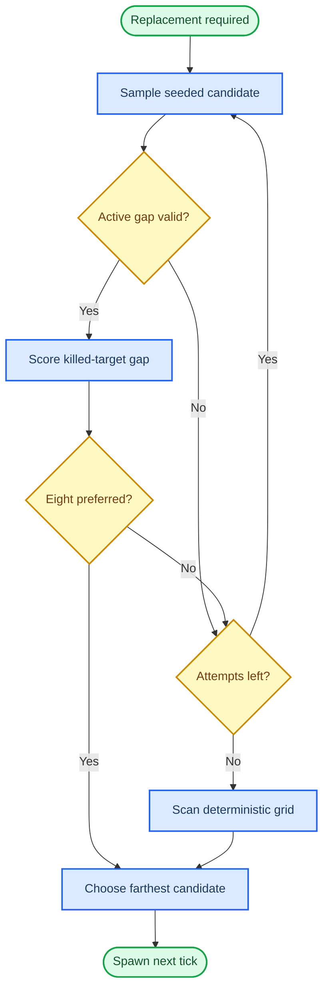

# WP-59 — Micro Flick v8 replacement spacing

_Stage 12 execution plan for removing near-replacement exploits from the fixed Micro Flick v8 spawn field. Created 2026-09-08._

---

> **Status:** Implementation in progress; T0 baseline and T1 additive contract are delivered. This WP depends on the delivered WP-56 three-target population path and keeps Micro Flick v8 researcher-only and practice-only.

| Item | Plan |
| --- | --- |
| **Problem** | A replacement target may spawn on or near the target that was just killed because the current sampler compares candidates only with targets that remain alive |
| **Outcome** | Make immediate replacement strongly avoid the killed bearing while preserving three active targets, bounded seeded sampling, next-tick replacement, and the fixed v8 room envelope |
| **Hard constraint** | Keep v8 `yaw=[-6.5,6.5]`, `pitch=[-5,6]`, and `distance=[24,26]` unchanged |
| **Recommended v8 policy** | Active separation `7° → 5°`; preferred killed-to-replacement separation `2.6°`; rank up to 8 preferred candidates within the existing 32-attempt budget |
| **Delivery policy** | Modify the existing practice-only v8 fixture in place; the additive spawn-area field is exported in `meta.spawn.spawnArea`, so post-change runs remain distinguishable from earlier v8 exports |
| **Estimate** | 3.5–6 engineering days across T0–T4 and T-exit |
| **Risk** | High: `TargetManager` and `DrillConfig` are core cross-module abstractions; determinism and spawn feasibility are blocking gates |

## 📋 Context and planning evidence

WP-56 introduced deterministic concurrent population spawning. The current implementation removes the killed target before sampling its replacement, and `minimumActiveSeparationDeg()` examines only `visible && alive` targets. The killed position is therefore absent from the exclusion set when the next tick calls `samplePopulationSpawnPose()`.

Relevant sources:

- [`TargetManager.ts`](../../../../../src/sim/TargetManager.ts) owns kill removal, population sampling, the 32-attempt cap, and the 9×7 deterministic fallback
- [`DrillConfig.ts`](../../../../../src/drill/DrillConfig.ts) defines `TargetPopulationConfig` and `SpawnAreaConfig`
- [`schema.ts`](../../../../../src/drill/schema.ts) validates population and angular separation contracts
- [`micro_flick_three_target_test_v8.ts`](../../../../../src/drill/micro_flick_three_target_test_v8.ts) freezes the v8 room binding, target size, spawn field, population, and seed
- [WP-56 lifecycle plan](../wp-56-micro-flick-test-scene/T2-three-target-lifecycle.md) defines the existing bounded and deterministic spawn contract

### Planning-time baseline

The diagnostic harness used the real `TargetManager`, v8 seed `56008`, 2,000 deterministic kill-order seeds, and 57 replacement opportunities per completed run. “Unchanged-aim hit” means that the ray aimed at the killed sphere centre still intersects the replacement sphere.

| Metric | Current v8 observation |
| --- | ---: |
| Replacement opportunities per completed run | 57 |
| Unchanged-aim hit rate | 17.66% |
| Completed runs with at least one unchanged-aim hit | 100% |
| Kill-order runs that encountered placement failure | 71 / 2,000 |
| Target apparent diameter at 25u | approximately 2.484° |

These numbers are planning evidence, not a permanent benchmark artifact. T0 must recreate them in a committed, deterministic test harness before production code changes.

### Planning-time blast radius

| Symbol or file | Current dependency evidence | Classification |
| --- | --- | --- |
| `DrillConfig` | 156 callers across drill, sim, metadata, tests, and tooling | Cross-module High |
| `SpawnAreaConfig` | 7 callers in config, schema, and scene clearance | Cross-contract Medium |
| `createTargetManager` | 53 callers; graph report lists it as a god node | Cross-module High |
| `TargetManager` | 30 callers across runner, loop, main, harness, and tests | Cross-module High |
| v8 drill fixture | Registered through the existing variant list in `main.ts` | Local fixture change |

Before each implementation task changes an existing symbol, rerun CodeGraph impact and record the current blast radius. The graphify report is currently older than `HEAD`, so implementation must trust current CodeGraph or direct reads for pending files and run `graphify update .` after code changes.

## 🎯 Requirements and boundaries

### Functional requirements

| ID | Requirement |
| --- | --- |
| **FR-59.1** | v8 must keep `yawDegRange=[-6.5,6.5]`, `pitchDegRange=[-5,6]`, and `distanceURange=[24,26]` exactly unchanged |
| **FR-59.2** | `SpawnAreaConfig` must add optional `preferredReplacementSeparationDeg`; omission must preserve every existing drill's parsed shape, RNG consumption, and spawn trace |
| **FR-59.3** | The v8 fixture must set `minAngularSeparationDeg=5` and `preferredReplacementSeparationDeg=2.6` while keeping target diameter `1.08375u`, population 3, target budget 60, and seed `56008` |
| **FR-59.4** | A successful exact `markKilled()` must copy the killed position into manager-owned temporal state before removing the target; unknown or repeated IDs must not change that state |
| **FR-59.5** | Initial population fill must not apply replacement spacing because no kill has occurred; the temporal rule begins only after the first successful kill |
| **FR-59.6** | Replacement candidates must first satisfy the configured active-target separation, then be ranked by separation from the last killed position |
| **FR-59.7** | The sampler must collect at most 8 preferred candidates and consume at most the existing 32 random attempts per spawn; it must choose the candidate with the greatest killed-to-replacement angle |
| **FR-59.8** | Ties must resolve by greater active-target minimum separation, then earlier deterministic attempt or cell order; no `Math.random()` or wall/render clock may participate |
| **FR-59.9** | The 9×7 fallback must evaluate the same temporal score. If no candidate reaches the preferred 2.6°, it must select the farthest candidate that still satisfies active separation rather than introducing a new failure mode |
| **FR-59.10** | The existing placement error remains legal only when no random or grid candidate satisfies active-target separation; the optional temporal preference alone must never cause a throw |
| **FR-59.11** | `reset()` must clear the remembered killed position and reconstruct the original seeded stream; restart with the same config and kill order must reproduce the complete trace bit-for-bit |
| **FR-59.12** | Exported v8 metadata must retain both separation values through the existing opaque `meta.spawn.spawnArea` snapshot, without a payload schema-version bump |

### Non-functional requirements

| ID | Measurable gate |
| --- | --- |
| **NFR-59.1** | Fixed v8 seed plus 2,000 deterministic kill-order seeds completes 114,000 replacement opportunities with zero unchanged-aim hits and zero temporal-preference fallbacks |
| **NFR-59.2** | The same v8 stress run produces zero placement errors; active targets remain finite, unique, in bounds, and at least 5° apart |
| **NFR-59.3** | Each v8 killed-to-replacement centre angle is at least 2.6° in the acceptance corpus; an exact eye-origin ray aimed at the killed centre misses the replacement sphere |
| **NFR-59.4** | Population spawning remains bounded by 32 seeded attempts plus 63 deterministic grid cells; no unbounded retry is introduced |
| **NFR-59.5** | 30, 60, 144, and 240 render FPS produce identical per-tick v8 traces for the same seed and input sequence |
| **NFR-59.6** | Drills without `preferredReplacementSeparationDeg`, including v1–v7, retain their existing config parse output and golden spawn traces bit-for-bit |
| **NFR-59.7** | The existing Micro Flick performance gate remains below P95 1 ms for `TargetManager.tick + TargetView.sync`; candidate ranking allocates only during a spawn event |
| **NFR-59.8** | Typecheck, full Vitest, full Playwright, and production build exit 0 |

### Constraints

- Do not widen or shift the v8 yaw, pitch, or distance field
- Do not change the v8 room, camera, FOV, target visual size, hitbox size, target count, or next-tick lifecycle
- Do not introduce a v8-specific branch in `TargetManager`; select behavior only through optional config
- Do not change `HitDetector`, `TargetView`, `SimLoop` ordering, weapon cadence, recoil, or event definitions
- Do not add a second RNG stream; spawn candidate sampling continues to use the manager's seeded spawn RNG
- Do not silently weaken active-target separation below the v8-configured 5°
- Do not promote v8 to Assessment, history persistence, or full replay

### Out of scope

- Expanding scene geometry or spawn bounds
- Avoiding more than the immediately previous killed position
- Adding spawn delay, target animation, or fade-in masking
- Retuning v1–v7
- Introducing a general Poisson-disc library or offline-authored spawn sequence
- Changing research metrics or scoring definitions

## ⚙️ Technical design

### Additive configuration contract

The new field belongs in `SpawnAreaConfig` because it describes spatial sampling, not population lifecycle timing.

```ts
export interface SpawnAreaConfig {
  yawDegRange: [number, number];
  distanceURange: [number, number];
  readonly pitchDegRange?: [number, number];
  readonly minAngularSeparationDeg?: number;
  /** Preferred centre-angle from the immediately previous killed target. */
  readonly preferredReplacementSeparationDeg?: number;
}
```

Validation rules:

- Value must be finite, positive, and at most 180°
- Field requires `targets.population`, `targets.spawnArea`, and `sequence.seed`
- Field may coexist only with population modes already accepted by the current schema
- Omission must not inject a default into the parsed object
- Obvious impossibility checking must not claim that a single field-diameter comparison proves multi-target feasibility; stress/property tests own the v8 feasibility proof

The field is a preference rather than an unconditional minimum because live continuity has priority when an adversarial legal configuration has no temporally separated point. The v8 acceptance gate is stricter: its approved parameters must never exercise the soft fallback in the committed corpus.

### Manager-owned temporal state

`createTargetManager()` keeps a reusable position and a boolean rather than placing killed targets back into `SharedState`:

```ts
const lastKilledPos = { x: 0, y: 0, z: 0 };
let hasLastKilledPos = false;
```

On an exact live-target kill, copy the three coordinates before `splice()`, then set the boolean. Unknown and duplicate kills are no-ops. `reset()` clears the boolean; there is no need to zero the coordinates because they are unread while the boolean is false.

This state remains private because it is a sampling input, not a visible game entity. Export provenance comes from the configured policy and the existing visible/hit event coordinates.

### Replacement selection flow



Candidate ranking is lexicographic and deterministic:

1. Reject candidates below `minAngularSeparationDeg` from any active target
2. Prefer candidates at or above `preferredReplacementSeparationDeg` from the killed position
3. Maximize killed-to-replacement angular separation
4. Break ties by greater minimum active separation
5. Break exact numeric ties by earlier attempt or fixed yaw-major/pitch-minor cell order

For initial population fill or configs without the optional field, retain the current first-valid path exactly. This prevents the new ranking budget from perturbing legacy RNG streams.

### V8 geometry budget

| Quantity | Frozen value | Rationale |
| --- | ---: | --- |
| Yaw field | −6.5° to 6.5° | Hard scene constraint |
| Pitch field | −5° to 6° | Hard scene constraint |
| Distance | 24u to 26u | Existing corridor placement |
| Sphere diameter | 1.08375u | Existing v8 hit and visual size |
| Maximum apparent diameter | approximately 2.588° at 24u | Defines the conservative replacement preference |
| Active-target separation | 5° | Leaves more feasible area while remaining greater than one full sphere diameter |
| Preferred replacement separation | 2.6° | Slightly exceeds the maximum apparent sphere diameter |
| Preferred candidate pool | 8 | Adds spatial choice while staying inside the 32-attempt cap |

The 5° active spacing is a deliberate v8 task retune, not an engine default. At the nearest 24u depth it still leaves more than one apparent sphere diameter between target centres, so active spheres remain visibly distinct while the temporal constraint gains enough feasible area.

### Failure and observability policy

- A temporal preference miss must not throw; choose the farthest active-valid candidate
- No active-valid random candidate triggers the existing 9×7 grid scan
- No active-valid random or grid candidate preserves the existing deterministic placement error
- v8 acceptance requires zero preference misses, making any observed soft fallback a failing test rather than a silent quality regression
- Error text must distinguish active-spacing infeasibility from temporal-preference fallback diagnostics used by tests
- Do not add production console logging; deterministic tests derive fallback use from returned placement or a narrow test-only diagnostic seam if necessary

### Versioning and provenance

This plan updates v8 in place because it remains researcher-only and practice-only. The behavioral revision is still auditable:

- `meta.spawn.spawnArea.minAngularSeparationDeg` changes from 7 to 5
- `meta.spawn.spawnArea.preferredReplacementSeparationDeg` becomes 2.6
- Seed remains 56008
- The exact config snapshot distinguishes pre-WP-59 and post-WP-59 exports despite the stable drill ID

If any existing v8 export is being used as a frozen research cohort, T0 must stop and convert this plan to a new v9 fixture instead. That is the only pre-implementation owner gate.

## 🧪 Verification strategy

### Correct regression seam

The primary seam is `TargetManager.population.test.ts` or a colocated replacement-spacing test that calls the real manager through `tick()`, `markKilled()`, and `reset()`. A shallow unit test of the angle helper alone is insufficient because the defect depends on removal order, survivor state, RNG consumption, and next-tick refill.

### Test matrix

| Layer | Required evidence |
| --- | --- |
| Schema | Valid optional field, invalid type/range/combinations, omission parity, metadata round trip |
| Geometry | Angle symmetry, boundary epsilon, 2.6° threshold, exact old-aim ray misses replacement sphere |
| Lifecycle | Initial three, exact-ID kill, next-tick replacement, unknown/double kill, reset clears temporal state |
| V8 stress | 2,000 kill-order seeds × 57 replacements; zero overlap, zero soft fallback, zero placement error |
| Adversarial | Always kill newest, always kill index 0, alternating indices, random order, tight/impossible synthetic fields |
| Determinism | Same seed/order hash equality; different kill order anti-vacuous; 30/60/144/240 FPS parity |
| Legacy | v1–v7 and non-population golden traces unchanged without editing expected outputs |
| Integration | Browser harness loads v8, kills a target, observes exactly one replacement, and confirms bounds/cardinality |
| Performance | Existing 10,000-replacement and P95 spawn/render gates remain green |

### Blocking acceptance criteria

- [ ] V8 yaw, pitch, distance, target size, scene, and target budget remain exact
- [ ] All active v8 targets are at least 5° apart
- [ ] All accepted v8 replacements in the committed stress corpus are at least 2.6° from the killed centre
- [ ] Reusing the killed-centre aim ray produces zero replacement hits
- [ ] V8 stress produces zero temporal soft fallbacks and zero placement errors
- [ ] Unknown and duplicate kills do not perturb temporal state or RNG
- [ ] Same seed and kill order reproduce the exact trace after reset
- [ ] V1–v7 and non-population traces remain bit-identical
- [ ] Attempt and fallback work remain bounded
- [ ] Focused tests, typecheck, full tests, E2E, build, and graph update pass

## ✍️ Task breakdown

### Progress

- [ ] **T0 — Reproduction and parameter freeze:** baseline harness committed in `8a74e9b`; the post-policy 114,000-replacement acceptance run remains part of T3.
- [x] (2026-09-08 09:32Z) **T1 — Additive contract:** added the optional replacement-separation field, exact-path validation, omission parity, and opaque metadata provenance tests.
- [x] (2026-09-08 12:03Z) **T2 — Temporal sampler:** captures exact killed coordinates, ranks up to eight preferred random candidates, scores the deterministic grid on exhaustion, preserves active-spacing failure semantics, and clears temporal state on reset.
- [ ] **T3 — V8 integration**
- [ ] **T4 — Full-system evidence**
- [ ] **T-exit — Audit and handoff**

### Decision Log

- **2026-09-08 — Freeze the committed T0 corpus as kill-order seeds 0–1999.** The harness uses the real v8 manager and an exact eye-origin ray/sphere intersection. **Alternatives considered:** depend on the uncommitted planning harness or preserve only rounded planning metrics; rejected because neither would give future runs a reproducible executable oracle.
- **2026-09-08 — Keep metadata pass-through opaque.** `collectMeta()` already preserves the exact `spawnArea` object, so the contract change requires a provenance test but no payload schema change. **Alternatives considered:** add a parallel metadata field or increment `schemaVersion`; rejected because both would duplicate an existing single source.
- **2026-09-08 — Rank random and grid candidates with one stable lexicographic score.** The implementation retains the first candidate unless killed separation improves, or an exact killed-separation tie improves active separation; iteration order therefore supplies the final deterministic tie-break without storing an order field. **Alternatives considered:** sort candidate arrays or add a separate grid-only selector; rejected because stable single-pass selection is smaller, bounded, and avoids unnecessary allocation.

### Surprises & Discoveries

- The committed seed range produced 77 placement failures and 19,429 unchanged-aim hits across 112,114 successful replacements (17.33%), rather than the planning harness's 71 failures and 17.66%. Evidence: `npx.cmd vitest run src/sim/TargetManager.replacement-spacing.test.ts`. The discrepancy is limited to the previously unspecified kill-order corpus; every one of the 1,923 completed runs still reproduced the exploit.

### Open Questions

- **OQ-59.1:** implementation is proceeding with the documented default that v8 has no frozen research cohort. If that assumption changes before T3, deliver the policy as v9 instead of modifying v8 in place.

| Task | Objective | Main files | Exit gate |
| --- | --- | --- | --- |
| **T0 — Reproduction and parameter freeze** | Commit the failing feedback loop, reproduce current v8 rates, sweep 5°/2.6°/8-candidate policy, and decide in-place v8 versus v9 if a frozen cohort exists | New diagnostic/regression test; this plan; proposed GD-34 | Baseline fails for the reported symptom; proposed policy passes 114,000 replacements with zero overlap/fallback/error |
| **T1 — Additive contract** | Add and validate `preferredReplacementSeparationDeg`; prove omission parity and metadata provenance | `DrillConfig.ts`, `schema.ts`, schema/config tests | Invalid inputs fail with field paths; all old parsed configs and traces remain unchanged |
| **T2 — Temporal sampler** | Capture exact killed position, implement bounded best-candidate ranking and deterministic grid fallback, clear state on reset | `TargetManager.ts`, population/replacement tests | Lifecycle, boundary, fallback, reset, and deterministic hash tests pass |
| **T3 — V8 integration** | Set v8 active spacing to 5° and replacement preference to 2.6° without changing its room envelope or other task parameters | v8 fixture and variant tests | Exact config assertions and v8 stress corpus pass |
| **T4 — Full-system evidence** | Run FPS parity, performance, browser replacement, legacy regression, typecheck, build, and full suite | Existing performance/E2E tests; evidence notes | All automated gates pass; no expected-output edits outside intentional v8 fixtures |
| **T-exit — Audit and handoff** | Reconcile requirements, review diffs/staging, update graph/docs, and record final decision/evidence | Stage 12 docs, `DECISIONS.md`, graphify artifacts | Every FR/NFR has evidence; only intended files are staged |

### Recommended commit boundaries

```text
test(stage12): reproduce v8 near-replacement exploit
feat(stage12): add replacement spacing spawn contract
feat(stage12): rank population replacements away from kills
fix(stage12): retune v8 spacing for bounded replacements
test(stage12): close v8 replacement spacing gates
```

Each commit must remain independently type-correct and testable. T0 may contain a deliberately failing test only on a temporary working branch; the mergeable T0 commit should encode the baseline as a quantified assertion or fixture that does not leave the default branch red.

## ⚠️ Risks and mitigations

| Risk | Impact | Mitigation |
| --- | --- | --- |
| Narrow field remains infeasible | Runtime placement error | T0 stress gate across kill orders; active spacing retuned to 5°; temporal preference never introduces throws |
| Active targets become too close | Easier target switching | Keep 5° above maximum 2.588° apparent diameter; require manual v8 review before T3 exit |
| Legacy RNG streams change | Research reproducibility regression | Optional field uses a separate branch; omitted path remains byte-for-byte behavior compatible |
| Candidate ranking changes v8 seed trace | Old and new runs differ under same drill ID | Export new field and changed active spacing in spawn metadata; use v9 if a frozen cohort exists |
| Soft fallback hides quality loss | Exploit returns silently | V8 stress requires fallback count zero; add explicit test observability without production logging |
| Extra sampling affects frame time | Sim hitch on replacement tick | Preserve 32/63 bounds and existing P95 <1 ms gate |
| Multiple kills occur before refill | Only latest kill is protected | T0 must verify weapon/sim ordering; if multi-kill is reachable, replace the single position with a fixed-capacity pending-kill ring before T2 exit |

## 🔗 Traceability and exit commands

| Requirement group | Evidence owner |
| --- | --- |
| FR-59.1–3 | Schema, fixture, metadata tests |
| FR-59.4–11 | TargetManager lifecycle and deterministic tests |
| FR-59.12 | Export metadata round-trip test |
| NFR-59.1–4 | V8 stress/property harness |
| NFR-59.5–7 | FPS parity, legacy golden, and performance tests |
| NFR-59.8 | Repository-wide verification commands |

Minimum T-exit command set:

```powershell
npx.cmd vitest run src/sim/TargetManager.population.test.ts
npx.cmd vitest run src/drill/micro_flick_three_target_test_variants.test.ts
npm.cmd run typecheck
npm.cmd test
npm.cmd run test:e2e
npm.cmd run build
graphify update .
git status --short
git diff --cached --stat
git diff --cached --name-only
```

The implementer must use the final file names selected during T0 and add the dedicated v8 replacement-spacing test to the focused commands.

## 📍 Open gate

| ID | Question | Recommended default | Owner | Deadline |
| --- | --- | --- | --- | --- |
| **OQ-59.1** | Are any existing v8 exports part of a frozen cohort whose drill ID must retain identical spawn behavior? | No: update practice-only v8 in place because spawn metadata distinguishes the policy; otherwise create v9 | Research owner | T0 exit |

No other parameter decision is left open: fixed field bounds, 5° active spacing, 2.6° preferred replacement spacing, candidate pool 8, attempt cap 32, and 9×7 fallback are the execution defaults.
