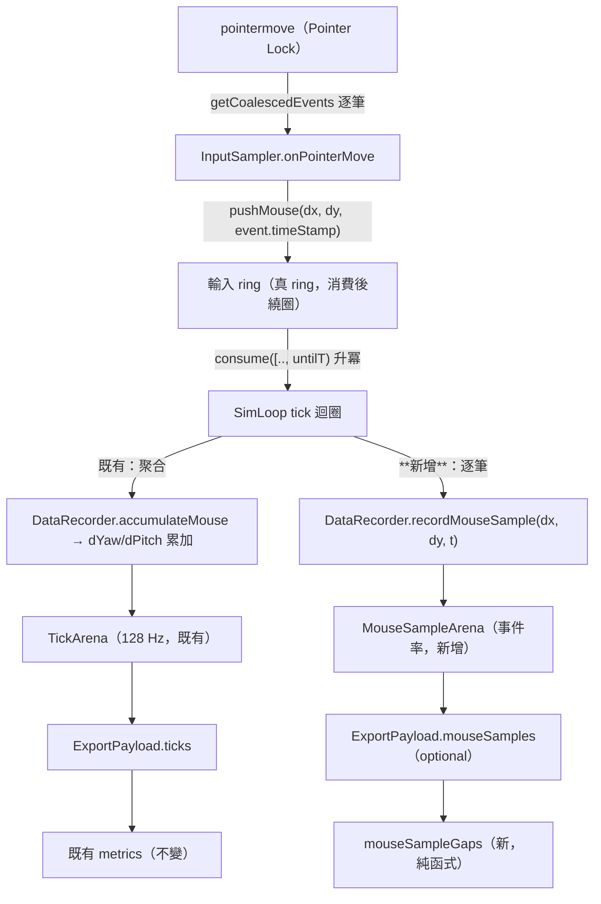

# WP-60 — Raw Mouse Sample Capture（原始滑鼠取樣匯出）

> Stage 索引：[`../README.md`](../README.md) · 清單：[task-checklist.md](task-checklist.md) · 執行紀錄：[progress.md](progress.md)
> 上游背景：WP-57 §T5-real（抬滑鼠標註的真人校準與其極限）· `performance_analysis` ADR-002（LOD v3）

---

## 0. Repository-grounded discovery（2026-09-08）

以下每一條都以實際讀檔為準，**規劃期即已覆核**；T0 需重新覆驗（檔案可能被平行 session 動過）。

| # | 事實 | 出處 |
|---|---|---|
| 1 | 輸入層**已經**逐筆收 sub-frame 樣本，每筆帶自己的 `event.timeStamp` | [`InputSampler.ts:136-141`](../../../../../src/input/InputSampler.ts#L136-L141)：`e.getCoalescedEvents?.() ?? [e]` → `ring.pushMouse(ev.movementX, ev.movementY, ev.timeStamp)` |
| 2 | 未 Pointer Lock 時**整筆丟棄**（`if (!isLocked()) return;`），不進 ring | 同上 `:136`。⇒ lock 中斷會產生與抬滑鼠**同形**的事件空洞（FR-60.6 的成因）|
| 3 | sim 消費點把每筆事件餵給 recorder 並**聚合**成逐 tick 值 | [`SimLoop.ts:96-99`](../../../../../src/loop/SimLoop.ts#L96-L99)：`recorder.accumulateMouse(ev.dx, ev.dy, state.heldAds)` |
| 4 | 聚合實作：`dYawAccum += delta.dYaw`，逐 tick 由 `recordTick` 消費清零 | [`DataRecorder.ts:193-201`](../../../../../src/data/DataRecorder.ts#L193-L201) |
| 5 | 事件層時間戳在 ③ 之後**無任何保留路徑**；`DrillEvent` union 只有 `visible`／`fire`／`hit`／`target_motion_change`（+ optional `key`）| [`DataRecorder.ts:12/44/63/77`](../../../../../src/data/DataRecorder.ts#L12) |
| 6 | tick arena 為 preallocated typed arrays，容量 `capacityForDrill(simHz, maxDrillSeconds, extraTicks)` | [`RingBuffer.ts:157-178`](../../../../../src/data/RingBuffer.ts#L157-L178)、[`DataRecorder.ts:151`](../../../../../src/data/DataRecorder.ts#L151) |
| 7 | **既有先例**：WP-50 T1 在 arena 加 `replayTargetId` 時，用「固定長度 plain array、hot path 不 push」明文對齊固定佈局紀律 | [`RingBuffer.ts:147-150`](../../../../../src/data/RingBuffer.ts#L147-L150) 註解 |
| 8 | **既有先例**：WP-29 T3 的 `recordKeyEvents?: boolean` 預設 `false` 的 additive 選配錄製 | [`DataRecorder.ts:144-145`](../../../../../src/data/DataRecorder.ts#L144-L145) |
| 9 | Pointer Lock 以 `unadjustedMovement: true` 取鎖（關 OS 加速）⇒ `movementX/Y` 為**原始 counts** | [`PointerLock.ts:11`](../../../../../src/input/PointerLock.ts#L11) |
| 10 | Pointer Lock 狀態由 `pointerlockchange` 追蹤，但**不進匯出** | [`PointerLock.ts:56`](../../../../../src/input/PointerLock.ts#L56)；`Meta` 無對應欄位 |
| 11 | tick 窗消費為半開窗 `[.., untilT)` 且依 `timeStamp` **升冪、無遺漏** | [`consume.test.ts:10`](../../../../../src/input/consume.test.ts#L10)（GD-3）⇒ 在消費點錄製即得全域時間有序串流 |
| 12 | PA 的 LOD v3 三階段與參數（`TIME_GAP_THRESHOLD_MS: 30` 等 14 個）為 Python↔Go 共用 config | `performance_analysis/contracts/modules/input/lod_v3_default_config.json` |
| 13 | PA 的 ADR-002 自承：**ground truth 缺席，F1 從未對標註資料量測** | `performance_analysis/docs/architecture/adr/002_lod_v3_design.md` Consequences |
| 14 | `performance_analysis` **無 LICENSE 檔**、`go.mod`／`package.json` 無 license 欄位 | 實地檢查（2026-09-08）⇒ 授權狀態未宣告，T0 必須拍板（見 §2b GD-11 列）|

### 0.1 Planning-time blast radius

| 符號／檔案 | 變更性質 | 風險 |
|---|---|---|
| `ExportPayload`（[`export.ts:5`](../../../../../src/data/export.ts#L5)）| **additive optional** 新增第四個頂層欄位 | Med — 型別被全 repo 消費，但 optional 不破壞既有 consumer |
| `TickArena`（`RingBuffer.ts`）| **不修改**；新增獨立的 `MouseSampleArena` | Low — 不動既有欄位即不動既有 golden |
| `DataRecorder`（`DataRecorder.ts`）| 新增 `recordMouseSample()` + option flag，`accumulateMouse` **一行不動** | Med — 核心錄製契約，但比照 discovery ⑧ 的既有先例 |
| `SimLoop`（`SimLoop.ts:96-99`）| **加一行**呼叫，與既有 `accumulateMouse` 並列 | High — 位於 sim 熱路徑；決定性與零配置必須逐位證明 |
| `exportPayloadSchema.ts` | additive strict parse；缺席合法 | Med — 比照 WP-50 `meta.replay` 的 strict/absent 先例 |
| `src/metrics/`（新模組）| 純新增 | Low |

---

## 1. 需求壓縮（Requirements）

### 1.1 Functional Requirements

- **FR-60.1** 系統必須能把 Pointer Lock 期間收到的**每一筆** sub-frame 滑鼠樣本（`dx`、`dy`、事件時間戳）保留到匯出，不做跨事件聚合。
- **FR-60.2** 原始取樣的錄製必須是**選配**且**預設關閉**；關閉時匯出內容與行為必須與本 WP 之前**逐位相同**。
- **FR-60.3** 匯出必須自帶取樣 provenance：實際錄到的樣本數、容量上限、是否溢位、時間戳的來源與單位。
- **FR-60.4** 匯出中缺少原始取樣區塊必須是**合法**的；宣稱有但形狀不符必須產生**指名欄位的 typed error**（不得靜默通過）。
- **FR-60.5** 系統必須提供純函式，把原始取樣切成以**時間間隙**（`dt > 門檻`）分隔的區段，並回報每個間隙的起訖與長度。
- **FR-60.6** 系統必須讓離線分析能分辨三種事件空洞：**感測器離地**、**Pointer Lock 中斷**、**drill 尚未開始／已結束**。
- **FR-60.7** 原始取樣的時間戳必須與既有 tick 時間戳落在**同一時鐘域**，使兩者可逐筆對齊（同一次拉槍的 tick 窗與其內含的原始樣本可互相索引）。
- **FR-60.8** 操作者入口（`npm run analyze:spider-wide`）必須能報告每份 run 的取樣健康度：實際事件率、時間間隙分布、Pointer Lock 中斷次數。
- **FR-60.9** 溢位（樣本數超過容量）必須以**獨立旗標**呈現，且**不得**污染既有的 `meta.suspect`（tick 資料仍然有效，只有原始取樣退化）。

### 1.2 Non-functional Requirements

- **NFR-60.1（決定性）** 開啟原始取樣後，同一輸入序列的 sim 狀態（tick index 對應的 position／velocity／命中／`dYaw`／`dPitch`）必須與關閉時**逐位一致**；以既有四 FPS parity harness 加測一組對照。
- **NFR-60.2（零額外配置）** 每筆樣本的錄製在 sim 熱路徑上必須是 **0 次** `Array.prototype.push` 與 0 次物件配置；以既有 `push` 計數手法（D-57.T2-4 先例）證明。
- **NFR-60.3（容量）** 預設容量必須容納 **1000 Hz × `maxDrillSeconds`** 的樣本；超出以 FR-60.9 的旗標呈現而非丟棄末端且不告知。
- **NFR-60.4（匯出體積）** 60 秒 / 1000 Hz 的 run，原始取樣區塊序列化後必須 **≤ 1.0 MB**（現行匯出 3.4–3.8 MB，即增幅 ≤ 30%）。T0 以實機 PoC 量測後可調，但必須有數字。
- **NFR-60.5（時間精度）** 樣本間 `dt` 的量化誤差必須 ≤ **10 µs**，否則 30 ms 級的時間間隙判定會被捨入雜訊污染。
- **NFR-60.6（純度）** 新增的離線純函式不得 import DOM／`three`／`node:*`／`fs`，不得讀 `Date.now()`／`performance.now()`／`Math.random()`；以既有 boundary scan 手法釘死。
- **NFR-60.7（零回歸）** 既有全量 Vitest、typecheck ×2、`vite build` 維持 exit 0；既有 golden／determinism／export round-trip 期望值**零修改**。

### 1.3 Constraints

- 階段 A 鎖 Chrome/Edge 桌面版；`event.timeStamp` 與 `performance.now()` 同源可減僅 Chromium 成立（`CLAUDE.md §4`）。
- `crossOriginIsolated === true` 是時間戳精度的前提；未生效時原始取樣的 `dt` 會被鈍化到 100 µs 級，NFR-60.5 不成立。
- 未 Pointer Lock 的移動**不採計**是既有的量測紀律（KI-005 / A，FR-A-8），本 WP **不得**放寬。
- 高輪詢率滑鼠（4000／8000 Hz）已存在於市場；容量策略必須明說它的行為，不得假裝不存在。

### 1.4 Assumptions

- 受測者使用的滑鼠輪詢率 ≤ 1000 Hz（NFR-60.3 的預設容量依此設定）。違反時走 FR-60.9 溢位旗標。
- `getCoalescedEvents()` 在 Chromium + Pointer Lock 下確實回傳次幀樣本而非單筆。**這是 T0 必須實機驗證的假設** —— 若瀏覽器實際只回一筆／幀，本 WP 的整個前提不成立（見 §3.1 R1）。
- 抬起滑鼠時感測器完全停止回報（產生真實時間間隙）。此為 PA 管線的物理前提，T0 需在本專案的硬體上復驗。

### 1.5 Open Questions

| ID | Question | Recommended default | Owner | Deadline | Impact if unresolved |
|---|---|---|---|---|---|
| **OQ-60.1** | 從 `performance_analysis` 移植 LOD 方法學的**授權狀態**為何？該 repo 無 LICENSE 檔、無 license 欄位（discovery ⑭）| **移植方法學與參數語意、不複製任何 Go／Python 原始碼**，並在 `progress.md` 記名來源與比對方式。理由：這與 GD-11 對 FPSci 的處置同構（可參考方法學、禁複製程式碼），是本 repo 已有的紀律；即使兩者同屬 BenQ，「未宣告授權」不等於「可自由複製」| 使用者 | **T0 exit（阻塞 T3）** | T3/WP-61 的實作合法性未定；事後才發現要重寫成本極高 |
| **OQ-60.2** | 原始取樣的序列化格式：**columnar + µs 整數 delta**，還是 array-of-objects？ | **columnar + µs 整數**（`{ t0Us, dtUs: number[], dx: number[], dy: number[] }`）。理由：60,000 筆下 array-of-objects 約 1.8 MB、columnar 約 0.66 MB，直接決定 NFR-60.4 成敗；µs 整數同時滿足 NFR-60.5 並與 PA 的 `ts_us` 同單位 | Engineering | **T1 開工前** | T1 的型別與 parser 全部要重寫 |
| **OQ-60.3** | Pointer Lock 中斷如何入匯出（FR-60.6）？ | **additive optional `pointer_lock` DrillEvent**（`{ type, locked, t }`），比照 WP-29 T3 的 `key` 事件（選配、預設關閉、不改既有 union 語意）。理由：它是離散狀態變化而非逐 tick 量，做成事件比做成 tick 欄位省 7,680 個布林 | Engineering + 使用者 | **T1 凍結前** | FR-60.6 無法滿足 ⇒ lock 中斷會被 LOD 誤判為抬滑鼠，重蹈「兩種原因混成一個」的覆轍（WP-57 Surprises 6）|
| **OQ-60.4** | 未來的抬滑鼠判準與既有 `deriveRepositioningSuspicion()` 的關係 —— **取代**還是**並存**？ | **並存但語意分離**：`deriveRepositioningSuspicion()` 維持「角速度停滯」語意不動（WP-57 已交付、已校準）；新判準是**不同構念**（感測器離地），用不同名稱與不同型別。理由：C-D4 禁的是「同一構念兩套定義」，不是「兩個不同構念」；但若兩者都叫「抬滑鼠」就會踩線 ⇒ 命名必須在 `CONTEXT.md` 分開定義 | 使用者 + 研究 | **WP-61 T0（不阻塞 WP-60）** | 兩個模組都宣稱偵測抬滑鼠 ⇒ C-D4 違規，且教練報告端無從選擇 |
| **OQ-60.5** | 高輪詢率（4000／8000 Hz）滑鼠是否要支援？ | **不支援，但要偵測並具名**：容量固定為 1000 Hz 假設，溢位時 FR-60.9 旗標 + 實測事件率一起寫進匯出，讓分析端知道這份資料為何退化。理由：把容量開到 8000 Hz 會讓 RAM 與匯出體積各漲 8 倍，為一個尚未出現的受測者付費 | 使用者 | T1 | 容量常數選錯，之後改要動 arena 配置 |
| **OQ-60.6** | 這個 schema 是否要同步進 `research/` 的 Python 側？ | **不要（本 WP 內）**。C-D5 的雙實作對表紀律只綁「晉升指標」；原始取樣目前沒有任何晉升指標消費它。等 WP-61 判準穩定再議 | Engineering | WP-61 | 過早建立雙實作 = 每次改判準都要兩端同步 + 升版，成本遠大於收益 |

---

## 2. 系統架構與設計（Technical Design）

### 2.1 System boundary

**In scope**

| 層 | 檔案 | 變更 |
|---|---|---|
| data | `src/data/mouseSampleArena.ts`（新）| preallocated typed-array arena |
| data | `src/data/DataRecorder.ts` | 新增 `recordMouseSample()` + `recordMouseSamples?: boolean` option；`accumulateMouse` 不動 |
| data | `src/data/export.ts`、`src/data/metadata.ts` | additive optional `mouseSamples` 區塊 + provenance meta |
| data | `src/data/exportPayloadSchema.ts` | additive strict parse（缺席合法、宣稱但不符 → typed error）|
| loop | `src/loop/SimLoop.ts` | 消費點加一行錄製呼叫 |
| input | `src/input/PointerLock.ts` + `DataRecorder` | lock 狀態變化事件（依 OQ-60.3）|
| metrics | `src/metrics/mouseSampleGaps.ts`（新）| 時間間隙切段純函式（FR-60.5）|
| scripts | `scripts/spiderWideRepositioningRunner.ts` | 取樣健康度報告（FR-60.8）|

**Out of scope**

- **LOD Stage 2（Kinematic Spike Trimming）與 Stage 3（Hover Jitter Rejection）** —— 需要以真人標註資料重推參數，屬 WP-61。
- **`deriveRepositioningSuspicion()` 的任何修改** —— WP-57 已交付並校準，本 WP 只讀不改（OQ-60.4）。
- **KI-031 的修復** —— 正交問題，且屬 C-D5 雙實作範圍。
- **`research/` Python 側的對應實作**（OQ-60.6）。
- **既有 `dYaw`／`dPitch` 的語意變更** —— 原始取樣是**新增的第二個視角**，不是取代。
- **重錄真人資料** —— 規格已於 [`spider-wide-recording-spec.md`](../../../../operational/spider-wide-recording-spec.md) 交付，執行屬使用者。

### 2.2 Data flow



**關鍵**：新資料流與既有資料流在 `SimLoop` 的**同一個消費點**分叉，共用同一批已排序事件。這保證兩者**必然對齊** —— 不會出現「tick 說有移動但原始取樣沒有」的分歧（FR-60.7 因此是結構性成立，而非靠斷言維持）。

### 2.3 Interface contracts

```ts
// ── src/data/mouseSampleArena.ts ────────────────────────────────────────────
/**
 * 原始滑鼠取樣 arena。preallocated typed arrays、drill 內不繞圈（非 ring）——
 * 與 TickArena 同一紀律：固定欄位、物件重用、hot path 零 push。
 */
export class MouseSampleArena {
  constructor(readonly capacity: number);
  /** @returns false = 已滿（呼叫端設 overflow 旗標）；滿了之後**丟棄末端**而非覆寫開頭。 */
  record(dx: number, dy: number, tMs: number): boolean;
  get count(): number;
  get overflow(): boolean;
  snapshot(): MouseSampleSnapshot;
  reset(): void;
}

/** 容量策略：1000 Hz 假設 × drill 長度 × headroom（OQ-60.5）。 */
export function mouseSampleCapacityForDrill(maxDrillSeconds: number): number;

// ── src/data/export.ts（additive）────────────────────────────────────────────
export interface ExportPayload {
  meta: Meta;
  ticks: TickRecord[];
  events: DrillEvent[];
  /** WP-60：原始滑鼠取樣。**缺席合法**（未開啟錄製、或 pre-WP-60 匯出）。 */
  mouseSamples?: MouseSampleBlock;
}

/**
 * Columnar + µs 整數（OQ-60.2）。三個陣列**等長**，index i 為同一筆樣本。
 * `dtUs[0]` 恆為 0（第一筆沒有前一筆）；絕對時間 = `t0Ms + Σ dtUs[0..i] / 1000`。
 */
export interface MouseSampleBlock {
  /** 第一筆樣本的絕對時間（ms，`performance.now()` 時鐘域，與 `ticks[].t` 同源）。 */
  readonly t0Ms: number;
  /** 與前一筆的間隔（µs 整數，非負）。NFR-60.5 的量化單位。 */
  readonly dtUs: readonly number[];
  /** 原始 counts（`unadjustedMovement: true`）。 */
  readonly dx: readonly number[];
  readonly dy: readonly number[];
}

// ── src/data/metadata.ts（additive）─────────────────────────────────────────
export interface MouseSamplingMeta {
  readonly recorded: number;
  readonly capacity: number;
  /** FR-60.9：獨立旗標，**不**進 `meta.suspect`。 */
  readonly overflow: boolean;
  /** provenance：時間戳來源與單位，讓分析端不必猜。 */
  readonly timeSource: 'event.timeStamp';
  readonly deltaUnit: 'counts';
  /** 實測平均事件率（Hz），供 FR-60.8 與資格判斷。 */
  readonly observedRateHz: number;
}

// ── src/metrics/mouseSampleGaps.ts（新，純函式）──────────────────────────────
export interface SampleGap {
  /** 間隙前最後一筆樣本的時間（ms）。 */
  readonly startMs: number;
  readonly endMs: number;
  readonly durationMs: number;
  /** 間隙前後樣本在 block 中的 index，供呼叫端取用鄰近運動學。 */
  readonly beforeIndex: number;
  readonly afterIndex: number;
}

export interface SampleSegmentation {
  /** 依 `gapThresholdMs` 切出的連續區段（PA 語彙的 stroke）。 */
  readonly segments: readonly { readonly startIndex: number; readonly endIndex: number }[];
  readonly gaps: readonly SampleGap[];
  /** 與 Pointer Lock 中斷重疊的間隙 index（FR-60.6）——**這些不是抬滑鼠**。 */
  readonly lockGapIndices: readonly number[];
}

/**
 * 依時間間隙切段（FR-60.5，= PA LOD Stage 1）。
 * @param block         匯出的原始取樣區塊
 * @param gapThresholdMs 間隙門檻（ms，正有限）。**不凍結預設值** —— 由 T0 PoC 的實機事件率決定，
 *                       呼叫端必填（比照 `RepositioningSuspicionOptions` 的紀律）。
 * @param lockIntervals  Pointer Lock 中斷區間（由 `pointer_lock` 事件推導，缺席即空陣列）
 * @throws `gapThresholdMs` 非正有限、或三個 columnar 陣列不等長時擲錯（指名欄位）。
 */
export function segmentByTimeGap(
  block: MouseSampleBlock,
  gapThresholdMs: number,
  lockIntervals?: readonly { readonly startMs: number; readonly endMs: number }[],
): SampleSegmentation;
```

### 2.4 容量與體積推算（NFR-60.3／60.4 的依據）

| 情境 | 樣本數 | RAM（3 × Float64）| JSON columnar | JSON array-of-objects |
|---|---|---|---|---|
| 1000 Hz × 60 s | 60,000 | 1.44 MB | **≈ 0.66 MB** | ≈ 1.8 MB |
| 1000 Hz × 60 s × 1.2 headroom | 72,000 | 1.73 MB | ≈ 0.79 MB | ≈ 2.2 MB |
| 8000 Hz × 60 s（溢位情境）| 480,000 | 11.5 MB | ≈ 5.3 MB | ≈ 14 MB |

- columnar 估算：`dtUs` 多為 4 位數（`1000`）→ ~5 B/筆；`dx`/`dy` 多為 1–2 位數帶號 → ~3 B/筆。
- ⇒ **OQ-60.2 選 columnar 是 NFR-60.4 能否成立的分水嶺**，不是風格偏好。
- ⇒ 8000 Hz 若要支援，columnar 也會讓匯出從 3.6 MB 漲到 ~9 MB（+147%），故 OQ-60.5 建議不支援。

### 2.5 決定性契約衝擊（ADR-2 / 決定性）

| 面向 | 設計 | 釘死方式 |
|---|---|---|
| **決定性** | 錄製是**唯寫旁路**：`recordMouseSample()` 不回傳值給 sim、不改 `state`、不影響 `accumulateMouse` 的呼叫順序或參數 | NFR-60.1：既有四 FPS parity fixture 各跑「開／關」兩次，逐 tick `replayTargetId` + `tx/ty/tz` + `dYaw/dPitch` **逐位一致** |
| **三迴圈邊界（ADR-2）** | 資料方向不變：input loop 寫 ring → sim loop 讀 ring → sim loop 寫 recorder。**沒有新的跨迴圈通道**，recorder 本來就由 sim loop 呼叫 | 架構掃描：`src/input/**` 不得 import `mouseSampleArena`；render 層不得讀它 |
| **固定佈局** | `MouseSampleArena` = **preallocated arena（非 ring）**，drill 內不繞圈、滿了設旗標並丟棄末端。三個 `Float64Array` 固定配置於建構期 | NFR-60.2：`Array.prototype.push` 計數在 `tick()` 前後恆為既有值（D-57.T2-4 手法）|
| **時鐘域** | 時間戳一律沿用事件自帶的 `event.timeStamp`（與 `performance.now()` 同 time origin，ADR-4/7）。sim 內**不新增任何時鐘讀取** | boundary scan：新模組零 `Date.now`／`performance.now` 命中 |
| **seeded RNG** | 不觸及 | — |

**為什麼「滿了丟棄末端」而不是繞圈**：繞圈會讓匯出的第一筆樣本不是 drill 的第一筆，而 `t0Ms + Σ dtUs` 的重建假設是連續的。丟棄末端 + 明示旗標，語意單純且不會靜默說謊 —— 與 `TickArena` 的 `recorderOverflow` 同一慣例。

### 2.6 Failure modes

| # | 觸發條件 | 影響 | 處理策略 |
|---|---|---|---|
| **F1** | `getCoalescedEvents()` 實際每幀只回一筆（假設 ③ 不成立）| 事件率退化到 rAF 率（60–144 Hz），時間間隙解析度不足以偵測抬滑鼠 ⇒ **整個 WP 的前提崩塌** | **T0 必須實機量測 `observedRateHz`**；< 500 Hz 即停止並回報，不進 T1 |
| **F2** | Pointer Lock 中斷造成事件空洞 | 被 LOD 誤判為抬滑鼠（與 WP-57 Surprises 6「兩個原因混成一個」同型）| FR-60.6：`lockGapIndices` 明確標出；`segmentByTimeGap` 把它們**排除在候選之外**而非標記為間隙 |
| **F3** | 樣本數溢位 | 末端資料缺失，分析端若不察會以為 drill 提早結束 | FR-60.9 獨立旗標 + `recorded`/`capacity` 一併匯出；FR-60.8 的報告把它列為 blocker |
| **F4** | `crossOriginIsolated === false` | `event.timeStamp` 鈍化到 100 µs 級，NFR-60.5 不成立、30 ms 間隙判定被雜訊污染 | 既有 metadata 已記 `crossOriginIsolated`；`segmentByTimeGap` 不自行檢查（純函式），由 FR-60.8 的報告列為 blocker |
| **F5** | 匯出體積超出 NFR-60.4 | 使用者傳輸／儲存成本上升；若同時多份 run 會很痛 | T0 以實機 PoC 量測真實體積後才凍結格式；超標即回頭調 OQ-60.2 |
| **F6** | 開啟錄製後掉 tick／GC 卡頓 | 破壞量測效度（比缺資料更糟：資料看起來正常但時序失真）| NFR-60.2 零配置 + T2 以既有 frame log 對照「開／關」兩組 p95 |

---

## 2b. 硬約束衝擊（Hard-constraint impact）

> 出處 [`CLAUDE.md §4`](../../../../../CLAUDE.md)。逐條過閘，不得留白。

| 約束 | 是否觸及 | 說明 / 緩解 |
|---|---|---|
| 時鐘域：禁 `Date.now()`，一律 `performance.now()`（ADR-4）| **觸及（不新增讀取）** | 時間戳一律沿用事件自帶的 `event.timeStamp`（與 `performance.now()` 同 time origin）。sim 內**不新增任何時鐘讀取**；`segmentByTimeGap()` 是純函式，時間由 payload 提供。T3 以 boundary scan 釘死零 `Date.now`／`performance.now` 命中 |
| cross-origin isolation 生效（`crossOriginIsolated === true`）| **觸及（是本 WP 的前提）** | 未生效時 `event.timeStamp` 鈍化到 100 µs 級 ⇒ NFR-60.5（≤ 10 µs）不成立、30 ms 間隙判定被捨入雜訊污染。列為 **F4**；既有 metadata 已記 `crossOriginIsolated`，由 T4 的報告列為 blocker。純函式不自行檢查 |
| **決定性**：同輸入序列跨 render FPS，sim 狀態逐位一致 | **觸及（最高風險項）** | 錄製為**唯寫旁路**：不回傳值給 sim、不讀／改 `state`、不改 `accumulateMouse` 的呼叫順序或參數。NFR-60.1／A-60.3 以既有四 FPS parity fixture 跑「開／關」兩組，逐 tick `replayTargetId` + `tx/ty/tz` + `dYaw`/`dPitch` + spawn 序列**逐位一致**（`Object.is` 級，非 `toBeCloseTo`）|
| **三迴圈邊界**：input / sim / render 只透過 `SharedState` 溝通（ADR-2）| **觸及（方向不變）** | 資料方向仍是 input loop 寫 ring → sim loop 讀 ring → sim loop 寫 recorder。recorder 本來就由 sim loop 呼叫 ⇒ **不新增跨迴圈通道**。這正是 D-60.P3 選擇錄在消費點而非 `InputSampler` 的理由。T2 以架構掃描釘死 `src/input/**` 與 render 層對 `mouseSampleArena` 的 import 命中數為 0 |
| 固定佈局：輸入 ring + `DataRecorder` arena，不 `push` 物件 | **觸及（新增一個 arena）** | `MouseSampleArena` = **preallocated arena（非 ring）**，三個 `Float64Array` 於建構期一次配置，drill 內不繞圈；滿了設旗標並丟棄末端（D-60.P6 有理由）。NFR-60.2／A-60.5 以 `Array.prototype.push` 計數（D-57.T2-4 手法）證明開啟錄製後計數與關閉時相同 |
| seeded RNG：sim/recoil 禁 `Math.random()`，seed 入 metadata（GD-5）| **不觸及** | 本 WP 不引入任何隨機性；錄製與切段皆為決定性純運算。T3 的純度掃描含 `Math.random` 零命中 |
| **GD-6**：場景幾何永不進 sim runtime／解析度與場景切換不改 sim | **不觸及** | 原始滑鼠取樣是輸入域資料，與場景幾何無關；不讀 `propBounds`／GLTF／`SceneConfig`，也不改 `SIM_HZ`、目標演進或命中判定 |
| **GD-9**：場景資產僅 CC0 或 CC-BY，且 `ATTRIBUTIONS.md` 可稽核 | **不觸及** | 本 WP 不新增任何場景資產 |
| **GD-11**：FPSci（CC BY-NC-SA）程式碼／config 禁止進 repo | **不觸及 FPSci，但同構問題成立** | 本 WP 不碰 FPSci。**但移植來源 `performance_analysis` 無 LICENSE 檔、無 license 欄位**（§0 ⑭）⇒ 「未宣告授權」不等於「可自由複製」。開 **OQ-60.1** 交使用者拍板，建議處置與 GD-11 同構：**參考方法學與參數語意，禁複製任何原始碼**。設為 T3 的阻塞條件 |
| hitbox 單一來源（`TargetState.hitbox`），命中與離線推導共用（GD-7）| **不觸及** | 本 WP 不碰命中幾何、不讀 hitbox；T3 的 C-D4 掃描含 `hitbox` 零命中 |
| C-D1／C-D5：`research/` ↔ `src/` 單向隔離、晉升指標雙實作對表 | **觸及（刻意不觸發 C-D5）** | **C-D1**：本 WP 只動 `src/`、`scripts/`、`docs/`，不 import 任何 Python 產物，`research/` 不讀 TS 模組 ⇒ 單向隔離不變。**C-D5**：雙實作對表紀律只綁**晉升指標**；原始取樣目前無任何晉升指標消費它，故本 WP **刻意不建立** Python 側實作（OQ-60.6）—— 過早雙實作會讓每次改判準都要兩端同步 + 升版。<br>**C-D4 是本 WP 真正的風險**：若新判準與既有 `deriveRepositioningSuspicion()` 都宣稱偵測「抬滑鼠」即為同一構念兩套定義。緩解：T3 只交付**中性命名**的時序原語（`gap`／`segment`，禁 `lift`／`reposition`／`suspicion`），並以掃描釘死模組原始碼對三個既有判準符號零命中；構念歸屬由 OQ-60.4 於 WP-61 拍板 |

---

## 3. 風險分析（Risk Analysis）

### 3.1 Risk register

| ID | 風險 | 等級 | 依據 | 緩解 |
|---|---|---|---|---|
| **R1** | `getCoalescedEvents()` 在 Pointer Lock 下不回次幀樣本 ⇒ 前提崩塌 | **High** | 假設，未實測。既有註解宣稱「1000 Hz 滑鼠下不遺失中間軌跡」但**repo 內無實機證據** | T0 step 3 實機量測，設為**硬性 go/no-go 閘**（F1）|
| **R2** | 抬起滑鼠時感測器並非完全靜默（部分滑鼠有 lift-off 後的殘留回報）| **High** | PA 的物理前提，但未在本專案硬體上驗過 | T0 step 4：使用者實機做「刻意抬起 5 次」，量測空洞長度分布 |
| **R3** | sim 熱路徑加一行造成掉 tick | Med | 每筆事件多一次 typed-array 寫入；1000 Hz 下每 tick 約 8 筆 | NFR-60.2 + F6 的 frame log 對照 |
| **R4** | `ExportPayload` 新增頂層欄位破壞既有 consumer | Med | 型別被全 repo 消費 | optional 欄位 + T1 跑全量既有 fixture round-trip，期望值零修改 |
| **R5** | 授權未拍板即開始移植 | Med | discovery ⑭：PA 無 LICENSE | OQ-60.1 設為 T0 exit 的阻塞條件 |
| **R6** | 新舊兩套「抬滑鼠」構念並存造成 C-D4 違規 | Med | WP-57 已有 `deriveRepositioningSuspicion()` | OQ-60.4 + T3 只交付**中性命名**的時間間隙原語（不叫抬滑鼠）|
| **R7** | 命名 `LOD` 與 `THREE.LOD`（Level of Detail）衝突 | Low | Three.js 標準類別；本專案 `import * as THREE from 'three/webgpu'` | **不採用 `LOD` 縮寫**；一律拼寫 `liftOff`／`sensorLift`，於 `CONTEXT.md` 定義 |

### 3.2 Conscious technical debt

| 妥協 | 原因 | 觸發重構的條件 |
|---|---|---|
| 容量固定為 1000 Hz 假設 | 支援 8000 Hz 要付 8× RAM 與匯出體積（§2.4），為尚未出現的受測者付費 | 出現實際使用 > 1000 Hz 輪詢的受測者，且其 `overflow` 旗標為 true |
| 只交付 LOD Stage 1（時間間隙），Stage 2／3 留給 WP-61 | Stage 2／3 的參數在 px/s 空間，必須以真人標註資料重推，而那批資料不存在 | 高刷真人 cohort 錄製完成 |
| columnar 格式與既有 `ticks`（array-of-objects）不一致 | 60k 筆下差 1.1 MB，一致性買不起 | 若日後 `ticks` 也改 columnar，兩者統一 |
| 不做 Python 側對應實作 | C-D5 只綁晉升指標，過早雙實作成本 > 收益 | 任何原始取樣衍生指標進入晉升流程 |

### 3.3 Performance bottlenecks

- **錄製熱路徑**：1000 Hz ÷ 128 Hz ≈ 每 tick 8 筆 × 3 次 `Float64Array` 寫入 = 24 次索引寫入／tick。相對既有 tick 記錄（~18 個欄位）屬同量級，預期不可觀測；仍以 F6 量測。
- **序列化**：60,000 × 3 個數字的 `JSON.stringify`。發生在 drill 結束後（非熱路徑），但可能造成一次數百 ms 的卡頓 ⇒ T1 需量測並記入 `progress.md`。
- **記憶體**：1.73 MB 的常駐 arena，於 recorder 建構期一次配置，不隨 drill 進行成長。

---

## 4. 任務拆解（Task Breakdown）

| Task | Objective | Dependencies | Risk | Complexity | Definition of Done（可驗證證據）| Commit |
|---|---|---|---|---|---|---|
| **T0** | Entry gate／取樣充分性稽核／實機 PoC | — | **High** | Med | 見 [T0-entry-gate.md](T0-entry-gate.md) | `docs(stage13): complete WP-60 raw sampling entry gate` |
| **T1** | 擷取契約：arena + 型別 + strict parser | T0 ✅ | Med | Med | 見 [T1-capture-contract.md](T1-capture-contract.md) | `feat(data): add raw mouse sample capture contract` |
| **T2** | Recorder／SimLoop 接線 + 決定性證明 | T1 | **High** | Med | 見 [T2-recorder-wiring.md](T2-recorder-wiring.md) | `feat(data): capture raw mouse samples on the sim consumption seam` |
| **T3** | 時間間隙切段原語 + Pointer Lock 消歧 | T1（可與 T2 並行）| Med | Med | 見 [T3-time-gap-primitive.md](T3-time-gap-primitive.md) | `feat(metrics): segment raw mouse samples by hardware time gap` |
| **T4** | 操作者可見度：取樣健康度報告 | T2 + T3 | Low | Low | 見 [T4-operator-visibility.md](T4-operator-visibility.md) | `feat(scripts): report raw sampling health per run` |
| **T-exit** | 驗收 + WP-61 handoff | T1–T4 | — | Low | 見 [T-exit-gate.md](T-exit-gate.md) | `docs(stage13): close WP-60 raw mouse sample capture` |

**排程**：T1 綠燈後 **T2 與 T3 可並行**（T3 只吃匯出型別，不需要擷取路徑真的在跑；以合成 block 測試）。T4 需要兩者都在。

### 4.1 Requirements traceability

| FR / NFR | Task |
|---|---|
| FR-60.1 逐筆保留 | T1（型別）+ T2（擷取）|
| FR-60.2 選配、預設關閉、關閉時逐位相同 | T1（option）+ T2（零回歸斷言）|
| FR-60.3 provenance | T1 |
| FR-60.4 缺席合法／宣稱不符 typed error | T1 |
| FR-60.5 時間間隙切段 | T3 |
| FR-60.6 三種空洞可分辨 | T1（`pointer_lock` 事件，OQ-60.3）+ T3（`lockGapIndices`）|
| FR-60.7 同時鐘域可對齊 | T2（結構性：同一消費點）+ T2 的對齊斷言 |
| FR-60.8 操作者報告 | T4 |
| FR-60.9 溢位獨立旗標、不污染 suspect | T1（型別）+ T2（斷言 `suspect` 不變）|
| NFR-60.1 決定性 | T2 |
| NFR-60.2 零額外配置 | T2 |
| NFR-60.3 容量 | T1 |
| NFR-60.4 匯出體積 | T0（量測）+ T1（格式）|
| NFR-60.5 時間精度 | T0（量測）+ T1（µs 量化）|
| NFR-60.6 純度 | T3 |
| NFR-60.7 零回歸 | T1／T2／T3／T-exit 各自跑全量 |

---

## 5. WP-61 handoff（LOD 判準移植）

WP-60 T-exit 必須交出下列四項，否則 WP-61 無法開工：

1. **實機事件率分布**（T0）—— 決定 `gapThresholdMs` 的可行範圍。PA 用 30 ms 是建立在 1 ms nominal dt 上的，本專案必須自己推。
2. **抬起／停頓的空洞長度分布**（T0 R2）—— WP-61 判準的分離軸候選。
3. **OQ-60.1 的授權結論**（T0）—— 決定 WP-61 能否參考 PA 的參數表。
4. **OQ-60.4 的構念歸屬結論** —— 決定新判準叫什麼、與 `deriveRepositioningSuspicion()` 的關係。

**WP-61 另需但 WP-60 不提供**：高刷（≥ 144 Hz）真人標註 cohort。錄製規格見 [`spider-wide-recording-spec.md`](../../../../operational/spider-wide-recording-spec.md)。

---

## 6. Execution rules

沿用 [`CLAUDE.md §3`](../../../../../CLAUDE.md)：

1. 一 task = 一垂直切片 = 一原子 commit；先驗證再 commit。
2. T0 未通過**不得**開始 T1～T4（R1 是 go/no-go 閘）。
3. 每個 task 完成同步 [progress.md](progress.md)（Progress / Decision Log / Surprises / Open Questions）與 [task-checklist.md](task-checklist.md)。
4. 跨 WP／跨文件的決策寫 [`DECISIONS.md`](../../../DECISIONS.md)（預留 **GD-35**）；per-WP 的寫 `progress.md`。
5. **worktree 紀律**：本 repo 目前有平行 session 在 stage12 作業。stage 層索引檔（`docs/exec-plan/README.md`、`stage12/*`）可能帶著他人的未提交變更 —— 只 stage 自己的檔案，絕不整檔 `git add`。
