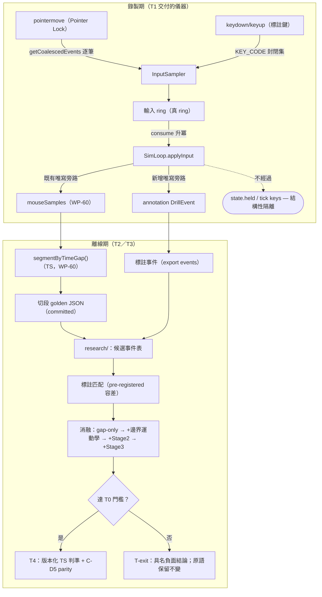

# WP-61 — 抬滑鼠判準可分性驗證與校準（Lift-off Validation）

> Stage 索引：[`../README.md`](../README.md) · 清單：[task-checklist.md](task-checklist.md) · 執行紀錄：[progress.md](progress.md)
> 上游：[WP-60 T-exit](../wp-60-raw-mouse-sample-capture/T-exit-gate.md)（原始滑鼠取樣管線 + 中性時序原語）· [WP-57 §T5-real](../../stage12/wp-57-spider-shot-wide-flick/progress.md)（角速度停滯構念與其極限）· `performance_analysis` ADR-002（LOD v3）
>
> 本計畫依 `.claude/skills/engineering-planning/SKILL.md`、`references/design_standards.md`、`assets/tech_spec_template.md` 制定。
> **本 WP 先驗證「能不能分」，再決定「要不要做」。分不開是一級交付物，不是失敗。**

| | |
|---|---|
| **Problem** | 匯出已有逐筆滑鼠取樣與中性的時間間隙原語（WP-60），但**沒有任何證據**顯示一個空洞是感測器離地還是手停著不動。R2 實測兩者的空洞長度範圍重疊 |
| **Outcome** | 一份以**獨立標註**真人資料做出的可分性判定：要嘛交付一個經 held-out 驗證的版本化判準，要嘛交付「本條件下不可靠分離」的具名負面結論 |
| **Truth model** | ground truth 來自**與空洞無關的標註通道**；任何由 gap 反推的標籤都不算 ground truth |
| **Pre-registration** | 事件匹配容差、資料分割、指標與門檻**必須在看特徵分布之前凍結**（GD-20 先例） |
| **Estimate** | 9–15 dev-days（T4 為條件式；若判定為負向結論則 6.5–11） |
| **Risk** | High：cohort 尚未錄製、標註本身有噪、最可能的結果是分不開（硬體風險已於 2026-09-09 消除，R1 降為 Med） |
| **Status** | 🟡 **T2 判定 `blocked-by-data` 2026-09-09** —— 缺的是資料，不是程式。T2 的**全部儀器已落地並驗證**（逐份可用性六閘、標註完整性三閘、F3 檢定、Stage 1 golden + 逐位重現斷言、Python 候選事件表、`analyze:lift-cohort` 與 `analyze:spider-wide` 兩支 operator 入口）；缺 step 1：240 Hz 真人標註 run **一份都還沒有**（真人 session 0／2、lift 標註 0／30、pause 標註 0／30）⇒ **不得開 T3**。<br>✅ T1 標註通道儀器已完成 2026-09-09。 |

---

## 0. Repository-grounded discovery（2026-09-09）

以下每一條以實際讀檔為準；T0 需重新覆驗（平行 session 常態存在）。

| # | 事實 | 出處 |
|---|---|---|
| 1 | 逐筆原始取樣已可匯出：`ExportPayload.mouseSamples`（columnar `t0Ms`／`dtUs`／`dx`／`dy`）+ `meta.mouseSampling` provenance，**成對出現**、缺席合法 | `src/data/export.ts`、`src/data/metadata.ts`（WP-60 T1，D-60.T1-2） |
| 2 | 錄製為 **opt-in 預設關閉**，app 佈線層以 `?rawMouse=1` 顯式開啟 | `src/main.ts`（D-60.T2-1） |
| 3 | 中性時序原語已交付：`segmentByTimeGap(block, gapThresholdMs, lockIntervals)` → `{ segments, gaps, lockGapIndices }`；`gapThresholdMs` **呼叫端必填、無預設值** | [`src/metrics/mouseSampleGaps.ts:102`](../../../../../src/metrics/mouseSampleGaps.ts#L102) |
| 4 | Pointer Lock 中斷可從 `pointer_lock` 事件推導為區間：`deriveUnlockedIntervals(events, lastSampleMs)` | [`src/metrics/mouseSampleGaps.ts:193`](../../../../../src/metrics/mouseSampleGaps.ts#L193) |
| 5 | 該模組**刻意零構念語彙**（`gap`／`segment`／`unlocked`，禁 `lift`／`reposition`／`suspicion`），由 boundary scan 釘死 —— 構念歸屬留給本 WP | 同上檔頭註解；GD-36 |
| 6 | 既有構念 `deriveRepositioningSuspicion(payload, options)` 為**角速度停滯**語意，真人校準值 `stallMinMs=150`／`stallOmegaDegPerSec=2`，且 `src/` 內**零 importer**（品質標註，非構念，C-D3） | [`src/metrics/spiderShotRepositioning.ts:86`](../../../../../src/metrics/spiderShotRepositioning.ts#L86)；[CONTEXT.md](../../../../../CONTEXT.md) |
| 7 | 輸入採集鍵為**封閉集** `KEY_CODE = { KeyA:0, KeyD:1, KeyW:2, KeyS:3, KeyL:4 }`；`KeyL` 只供 WP-61 標註事件使用，非集合內的鍵**整筆不入 ring** | [`src/state/types.ts:45`](../../../../../src/state/types.ts#L45)、[`InputSampler.ts:60-61`](../../../../../src/input/InputSampler.ts#L60-L61) |
| 8 | `applyInput` 的 key 分支**只對 `KeyD`／`KeyA` 有作用**；`KeyW`／`KeyS` 已進 ring 但無任何 sim 分支消費 ⇒ **「被採集但 sim 不消費的鍵」是既有結構** | [`SimLoop.ts:73-84`](../../../../../src/loop/SimLoop.ts#L73-L84) |
| 9 | `TickRecord.keys` 為固定 4 bit（A/D/W/S）遮罩，由 `state.held` 推導 ⇒ 第五個 code **結構上不可能進 tick 記錄** | [`RingBuffer.ts:97-120`](../../../../../src/data/RingBuffer.ts#L97) |
| 10 | **既有先例**：`recordKeyEvents?: boolean`（預設 `false`）的 additive 選配事件錄製，`applyInput`／`simStep` 簽章不變 | [`DataRecorder.ts:126-129/157-158`](../../../../../src/data/DataRecorder.ts#L126) |
| 11 | `research/` 為 Python 3.12 離線層，**只讀** export JSON/CSV 與 committed golden/parity fixture；`algorithms/` 禁 plot／print／file I/O | [`research/README.md`](../../../../../research/README.md)（C-D1／C-D2） |
| 12 | committed 真人 export ≤ 30 s、`participantId` 須匿名化；更長的留在本機不進 repo | 同上；D-57.T5-8 |
| 13 | PA 十四個 LOD 參數已取用並記名，含「哪些在 px/s 空間需重推」標註（`ACCEL_UP_THRESHOLD_PX_S2`、`START_SPEED_GATE_PX_S`、`HOVER_VELOCITY_THRESHOLD_PX_S` 三項） | [WP-60 progress §PA LOD v3 parameter source copy](../wp-60-raw-mouse-sample-capture/progress.md) |
| 14 | PA ADR-002 自承 v1 的兩個系統性偽陽為「目標捕獲時的急停」與「目標中心附近的生理性顫抖」，且**其 F1 從未對標註資料量測過** | 同上；[`../README.md`](../README.md) §1 |

### 0.1 R1／R2 的實機基線（本 WP 的起點數字）

| 量 | 值 | 來源 |
|---|---|---|
| 連續移動期間事件率 | **≈ 1005 Hz**；`dtUs` p50 995 ／ p95 1660 ／ p99 2235 | WP-60 T0 R1 Run B |
| 連續移動期間空洞上限（雜訊底線） | **18.2 ms**（其餘 6–15 ms）⇒ PA 的 30 ms 有 ≈1.7× headroom，**prior 非校準值**（n = 11） | 同上 |
| lift 的 >1 s 空洞（10 次） | 1257.4 – 1850.4 ms（9 筆），另 245.5 ／ 347.0 ms | WP-60 T0 R2 ④ |
| pause 的 >1 s 空洞（10 次） | 1066.0 – 1363.3 ms（8 筆），另 859.9 ms | WP-60 T0 R2 ⑤ |
| oneshot 最大空洞 | 270.4 ms，無 >1 s 空洞 | WP-60 T0 R2 ⑥ |
| **判定** | **D-60.R2-1：空洞長度不足以可靠分離 lift／pause**（範圍重疊） | WP-60 progress |
| 真人 60 s run 的門檻敏感度（18／30／50 ms sweep） | 區段數 333／232／133；間隙 p50 39.8／55.2／75.0 ms；max 739.1 ms；lock gaps 0 | WP-60 TF2 |

**R2 的四項具名限制**（本 WP 的設計必須逐條擋掉，否則重蹈覆轍）：① 每組只有一輪；② **無逐次時間標註**，九個長空洞不能當九次成功偵測；③ `allGapsMs` 已排序、無法定位起始空洞；④ 未取得完整 `dtUs`／`dx`／`dy` 與 Pointer Lock 時序，無法分析前後運動學。

### 0.2 Planning-time blast radius

| 符號／檔案 | 變更性質 | 本次 CodeGraph 實測 blast radius（2026-09-09）與風險 |
|---|---|---|
| `KEY_CODE`（`src/state/types.ts:45`） | **additive**：T1 新增第五個 code `KeyL`（標註鍵） | Med — CodeGraph：3 callers（`src/input/InputSampler.ts`、`src/testharness/fpsTestHarness.ts`）；覆蓋測試含 `src/input/InputSampler.test.ts`。新增 key 不改既有四項值，但 `CODE_KEY` 必須同序擴充。 |
| `CODE_KEY`（`src/state/types.ts:46`） | **additive**：新增反向解碼項 | Med — CodeGraph：1 caller（`src/state/SharedState.ts` 的 `createInputRing().dequeueInto()`）；未列 covering tests，T1 必須補 round-trip 測試證明 `KeyL` 可入 ring 且不進 `TickRecord.keys`。 |
| `InputSampler.onKeyDown`／`onKeyUp` | **不修改邏輯**：新 code 因 `KEY_CODE` 有定義而自動入 ring | Med — 走既有 `KEY_CODE[e.code]` 分支，無新分支；風險在熱路徑事件量，T1 以 `push` 計數證明只有實際標註次數增加。 |
| `keyMaskFromKeys`（`src/data/RingBuffer.ts:97`） | **不修改語意**：仍只輸出 A/D/W/S 四 bit | Med — CodeGraph：1 caller（`TickArena.recordTick()`）；未列 covering tests。T1 必須釘死 `KeyL`／`SensorLift` 標註不會進 tick `keys`。 |
| `SimLoop.applyInput` key 分支 | **加一個 else-if**，只呼叫 recorder、**不寫 `state`** | **High** — CodeGraph：2 callers（`simStep`、`createSimLoop`）；未列 covering tests。T1 的四 FPS parity 必須攤平 `TickRecord` 全欄位 `Object.is`，並以故意寫 `state` 的突變證明斷言抓得到。 |
| `DrillEvent` union（`DataRecorder.ts`） | **additive** 新 `annotation` 事件型別 + option flag | Med — CodeGraph 將 `createDataRecorder()` 標為 god node之一：68 graph edges；`recordEvent()` 既有 `events.push` 路徑可重用，但 parser／CSV／round-trip 需逐項補測。 |
| `createDataRecorder`（`src/data/DataRecorder.ts:167`） | **additive option**：`recordAnnotationEvents?: boolean` 預設 false | Med — CodeGraph：`createDataRecorder → recordTick → keyMaskFromKeys`；graph report 列為 god node（68 edges）。預設關閉時匯出必須逐位不變。 |
| `parseExportPayload`（`src/data/exportPayloadSchema.ts:41`） | additive strict parse；缺席合法 | Med — CodeGraph：18 callers（含 history server、history API、tracking scripts、replay compatibility、export round-trip tests）。T1 parser 必須拒絕 malformed annotation event，但 legacy events 仍合法。 |
| `research/`（新模組） | 純新增；不 import 任何 TS | Low — 不觸及 runtime；T2/T3 以 committed golden JSON 跨界，遵守 C-D1／C-D2。 |
| `src/metrics/sensorLiftCriterion.ts`（**僅 T4 條件式**） | 新增版本化判準，`src/` importer 終局為 0 | Med — 觸發 C-D5 雙實作對表；依 D-61.U4，即使通過也維持 `research_only`，不得接教練報告。 |

> CodeGraph 查詢：`KEY_CODE CODE_KEY keyMaskFromKeys applyInput DrillEvent createDataRecorder parseExportPayload InputSampler RingBuffer DataRecorder exportPayloadSchema mouseSampleGaps deriveRepositioningSuspicion` 與 `src/state/types.ts KEY_CODE CODE_KEY InputEvent InputRing pushKey`。本節數字為 WP-61 T0 實測，不沿用 WP-60 的 `ExportPayload`／`createSimLoop` 舊 blast radius。

---

## 1. 需求壓縮（Requirements）

### 1.1 Functional Requirements

- **FR-61.1** 系統必須提供一個**事件級標註通道**，讓操作者在 drill 進行中逐次記錄「抬起／落下」與「停住／恢復」的時刻，且時間戳與 `mouseSamples`／`ticks` 落在**同一時鐘域**。
- **FR-61.2** 標註通道必須是**選配且預設關閉**；關閉時 sim 狀態、`ticks`、既有事件與匯出內容必須與本 WP 之前**逐位相同**。
- **FR-61.3** 標註必須**在結構上無法由取樣空洞反推** —— 標註來源是獨立的鍵盤事件流，且評估程式碼不得以 gap 的存在與否生成或修正標籤。
- **FR-61.4** 系統必須提供純函式，對每一個候選空洞輸出其**前後運動學特徵**（進入空洞前與離開空洞後的速度／加速度／樣本密度／微小位移比例），特徵一律用**中性命名**。
- **FR-61.5** 評估契約必須**先凍結再看資料**：事件匹配容差、資料分割、指標（precision／recall／F1／各對照組誤報率）與**通過門檻**在 T0 寫定，事後不得調整。
- **FR-61.6** 可分性稽核必須是**消融式**且逐層可歸因：① gap-only baseline → ② + 空洞前後運動學 → ③ + Stage 2 類比（kinematic spike trimming）→ ④ + Stage 3 類比（hover jitter rejection）；每一層各自出混淆矩陣。
- **FR-61.7** 校準集與驗證集必須依 **session（或受測者）隔離**；同一 session 的 trial 不得同時出現在兩側。
- **FR-61.8** 未達 T0 凍結門檻時，系統必須交付「**不可靠分離**」或「**證據不足**」的具名結論，並**保留** WP-60 的 gap／segment 原語不變；不得晉升任何抬滑鼠指標。
- **FR-61.9** 達到門檻時，判準必須是**版本化純函式**，參數由呼叫端或具名 config 注入；不得在模組內硬編未經校準的常數。
- **FR-61.10** 任何取自 `performance_analysis` 的參數、fixture 或語意必須**記名來源檔與版本**（D-60.P7 的稽核要求）。
- **FR-61.11** 操作者入口必須能報告每份 cohort run 的**標註完整性**：標註數、與 trial 數的差額、落在 unlocked 區間內的標註數、成對性（抬起↔落下）違規數。

### 1.2 Non-functional Requirements

- **NFR-61.1（決定性）** 開啟標註通道後，同一輸入序列的 sim 狀態必須與關閉時**逐位一致**；以 `TickRecord` **全欄位** `Object.is` 級比對（D-60.T2-2 的手法，非窄 trace）跨四 FPS parity fixture 釘死。
- **NFR-61.2（零額外配置）** 標註事件的錄製在 sim 熱路徑上不得新增每 tick 的 `Array.prototype.push` 或物件配置；「開／關」兩組的 `push` 計數差額必須**等於實際標註次數**（數十次／run），而非隨 tick 增長。以 D-57.T2-4 的計數手法證明。
- **NFR-61.3（純度）** 新增的離線純函式（TS 側）不得 import DOM／`three`／`node:*`／`fs`，不得讀 `Date.now()`／`performance.now()`／`Math.random()`；以既有 boundary scan 釘死。Python 側 `algorithms/` 不得 plot／print／file I/O（C-D2）。
- **NFR-61.4（零回歸）** 既有全量 Vitest、typecheck ×2、`vite build` 維持 exit 0；既有 golden／determinism／export round-trip 期望值**零修改**。`research/` 側 `uv run pytest` exit 0。
- **NFR-61.5（可重現）** 評估腳本以同一批輸入與同一 config 重跑，必須產出**逐位相同**的報表（含混淆矩陣數字）；任何隨機性（如 bootstrap CI）須注入 seed 並寫入報表。
- **NFR-61.6（標註時間誤差）** 自報標註相對真實動作的時間誤差必須被 T0 凍結的**匹配容差**吸收，且該容差必須有經驗依據（T2 的標註完整性稽核）；容差**不得**在看過分類結果後放寬。
- **NFR-61.7（cohort 規模）** 進入 T3 的最低資料量：**≥ 2 個獨立 session** × **≥ 30 個有標註的候選事件／類別**，且顯示更新率 **≥ 120 Hz**（見 §1.3）。低於此值 T2 判 `blocked-by-data` 並停止，不得以「先看看」為由續行。

### 1.3 Constraints

- 階段 A 鎖 Chrome/Edge 桌面版；`event.timeStamp` 與 `performance.now()` 同源可減僅 Chromium 成立（`CLAUDE.md §4`）。
- `crossOriginIsolated === true` 是時間戳精度的前提；未生效時 `dt` 鈍化到 100 µs 級，整份 cohort 作廢（WP-60 F4）。
- **cohort 一律錄在 240 Hz 顯示器**（D-61.U3）。本專案有**兩個不同的顯示更新率門檻**，兩者都成立、管的事不同：<br>① **資格閘地板 ≥ 120 Hz**（`PERF_FLOOR_MS = 8.33`）—— 低於此 `meta.suspect` 被 frame floor 判紅；<br>② **KI-031 完全緩解 ≥ 144 Hz**（aim 更新率 ≥ 128 Hz）—— [KI-031](../../../../known_issue/KI-031-detection-sustained-ticks-dies-when-aim-updates-slower-than-sim.md) §2 的失效邊界：零樣本比例 ≈ `1 − f/128`，`f ≈ 120 Hz` 仍約 **6% 零樣本 ⇒ 偶發漏檢**，60 Hz 為懸崖（113/113 全滅）。<br>本 WP 的空洞分析**本身**不依賴 detection 窗，但 cohort 的其餘品質欄位會 ⇒ 取較嚴者。240 Hz 的 frame budget 為 4.17 ms ≪ 8.33、aim 更新率 240 Hz ≫ 128 Hz，**兩個門檻同時滿足**。
- **禁止混合顯示更新率**：同一批分析內的所有 run 必須同一台顯示器。顯示更新率同時改變 aim 更新率與 `meta.suspect`，混入 60 Hz 的 run 是顯性 confound；`meta.displayHz` 為必填欄位（[`metadata.ts:154`](../../../../../src/data/metadata.ts#L154)），T2 逐份覆核。既有 WP-57／WP-60 的 60 Hz 真人資料**不得**併入本 WP 的 cohort。
- 未 Pointer Lock 的移動**不採計**（KI-005 / A，FR-A-8）—— 本 WP 不得放寬；lock 中斷的空洞一律由 `lockGapIndices` 排除。
- **真人逐筆軌跡不進 repo**（D-57.T5-8）；只有統計摘要、匿名化 ≤ 30 s 的 committed fixture 與 golden JSON 可入 repo（C-D1 ／ `research/README.md`）。
- **C-D3**：未通過構念驗證的指標不得進教練報告。本 WP 交付的一切在通過 §2.4 的 gate 之前一律 `research_only`。

### 1.4 Assumptions

- 標註者（操作者本人或第二人）能在動作發生後 **≤ 300 ms** 內按下標註鍵，且該延遲的分布在 lift 與 pause 兩組**無系統性差異**。⇒ **T2 必須實測並否證這個假設**（若 lift 的標註延遲系統性長於 pause，匹配容差本身就會引入可分性假象）。
- 抬起滑鼠時感測器完全停止回報（WP-60 R2 已在本硬體上觀察到秒級空洞，成立）。
- 手停著不動時的生理性微顫**低於本感測器閾值**（R2 的 pause 也產生 1066–1363 ms 空洞 ⇒ 在本硬體上成立）。⇒ **這正是兩者難分的物理原因**：分離訊號若存在，必在空洞的**邊界**（進入的減速輪廓、離開的加速輪廓），不在空洞**內部**。
- 受測者滑鼠輪詢率 ≤ 1000 Hz（否則 `mouseSampling.overflow` 為 true，該 run 的尾段不可用）。

### 1.5 Open Questions

| ID | Question | Recommended default | Owner | Deadline | Impact if unresolved |
|---|---|---|---|---|---|
| **OQ-61.1**（＝ OQ-60.4） | 新判準與既有 `deriveRepositioningSuspicion()` 是**取代**還是**並存**？各自叫什麼？ | ✅ **已收斂 2026-09-09（使用者）：並存但語意分離**（D-61.U1）。既有者維持「角速度停滯（repositioning suspicion）」不動；新者為**不同構念**「**感測器離地（sensor lift）**」，用不同名稱、不同型別、不同模組。C-D4 禁的是「同一構念兩套定義」，不是「兩個不同構念」—— 但兩者都叫「抬滑鼠」就會踩線 ⇒ 兩個構念必須在 [CONTEXT.md](../../../../../CONTEXT.md) **分開定義並互相指名** | ~~使用者 + 研究~~ 已收斂 | ~~T0 exit~~ 已收斂 | — |
| **OQ-61.2** | 標註通道的具體形式：**自報鍵**（受測者本人按）、**第二人標註鍵**，還是**兩者都收**？ | ✅ **已收斂 2026-09-09（使用者）：自報鍵為主 + block 設計為冗餘**（D-61.U2）。自報鍵與匯出同時鐘域、零額外硬體；其延遲以 T0 凍結的容差吸收（NFR-61.6）。block 設計（「本 run 每個 trial 都抬」）提供 trial 級的冗餘標籤，用來稽核自報鍵的漏按。<br>⚠️ **隨此決定生效的宣稱界線**：自報鍵可支撐**事件級匹配**（「哪一個空洞是抬滑鼠」），**不可**支撐**起點精度**宣稱（反應時間 ≈ 200 ms 與 lift 事件 180–225 ms 同量級）。T3／T-exit 不得作後者的宣稱 | ~~使用者~~ 已收斂 | ~~T0 exit~~ 已收斂 | — |
| **OQ-61.3** | 標註鍵選哪個 code？（`KEY_CODE` 封閉集需擴充） | ✅ **T0 已收斂（D-61.T0-2）：`KeyL`**（lift 的字首，且不與 WASD／Space／Esc／R／滑鼠鍵衝突）。單一鍵、`down`／`up` 各記一次事件 ⇒ 一段自報 annotation interval；實際類別由 block/run manifest 的 `instructionClass` 指定 | ~~Engineering~~ 已收斂 | ~~T1 凍結前~~ | — |
| **OQ-61.4** | 特徵萃取與判準實作落 **Python `research/`** 還是 **TS `src/metrics/`**？何時觸發 C-D5？ | ✅ **T0 已收斂（D-61.T0-2）：T2／T3 只做 Python 側**（探索期，含繪圖）；**T4（條件式）才在 `src/metrics/sensorLiftCriterion.ts` 建 TS 實作並補 golden parity ⇒ C-D5 於 T4 才觸發**。Stage 1 切段**不重寫**：T2 由 TS `segmentByTimeGap()` 產出 committed golden JSON，Python 側讀它（C-D1 允許讀 committed golden），**不另寫一套切段** | ~~Engineering~~ 已收斂 | ~~T0 exit~~ | — |
| **OQ-61.5** | 是否存在合格的錄製機器？門檻是多少？ | ✅ **已收斂 2026-09-09（使用者）：cohort 一律錄在 240 Hz 顯示器**（D-61.U3）。<br>⚠️ **「≥ 120」與「≥ 144」不是矛盾，是兩個不同的門檻，兩個都對**：<br>　• **≥ 120 Hz** ＝ 資格閘地板（`PERF_FLOOR_MS = 8.33`，[`constants.ts:13`](../../../../../src/display/constants.ts#L13)）—— 管 `meta.suspect` 是否被 frame floor 判紅；<br>　• **≥ 144 Hz** ＝ KI-031 完全緩解點（aim ≥ 128 Hz；[KI-031](../../../../known_issue/KI-031-detection-sustained-ticks-dies-when-aim-updates-slower-than-sim.md) §2：`f ≈ 120 Hz` 仍約 **6% 零樣本 ⇒ 偶發漏檢**）—— 管 `deriveDetectionMetrics()` 會不會靜默失效。<br>**240 Hz 同時滿足兩者**，故本 WP 的可用性條件直接寫成 **`meta.displayHz === 240`**，不引用任何一個下限。**禁止**與 60 Hz 的 run 混入同一批分析 —— 顯示更新率會同時改變 aim 更新率與 `suspect`，是顯性 confound | ~~使用者~~ 已收斂 | ~~T0 exit~~ 已收斂 | — |
| **OQ-61.6** | 若 cohort 只有 **n = 1 受測者**（極可能），通過門檻的結論可以宣稱到什麼程度？ | ✅ **已收斂 2026-09-09（使用者）**（D-61.U4）：**上限為「本操作者 × 本硬體 × 本 drill 條件下成立」**，一律 `research_only`，**不得**進教練報告（C-D3／GD-20）。跨人泛化需另立 WP 與另一批 cohort。⇒ 即使 T3 判定 `promote`、T4 交付判準，**也不會有任何教練報告端的消費者**；T4 的「`src/` 零 importer」因此不是暫時措施而是**終局狀態** | ~~使用者 + 研究~~ 已收斂 | ~~T0 exit~~ 已收斂 | — |
| **OQ-61.7** | `gapThresholdMs` 最終取什麼值？ | **T0 不凍結**。以 18／30／50 ms sweep 進入 T3，門檻本身作為消融的一個維度；最終值（若有）由 T4 依 held-out 結果決定並記名 | Engineering | T4 | 提前凍結 = 用本輪最大值調出剛好分開的門檻（[`../README.md`](../README.md) 明文禁止） |

---

## 2. 系統架構與設計（Technical Design）

### 2.1 System boundary

**In scope**

| 層 | 檔案 | 變更 | Task |
|---|---|---|---|
| state | `src/state/types.ts` | `KEY_CODE` additive 第五個 code（OQ-61.3） | T1 |
| data | `src/data/DataRecorder.ts` | additive `annotation` DrillEvent + `recordAnnotationEvents?: boolean`（預設 `false`） | T1 |
| loop | `src/loop/SimLoop.ts` | `applyInput` key 分支加一個 else-if，**只呼叫 recorder、不寫 `state`** | T1 |
| data | `src/data/exportPayloadSchema.ts` | additive strict parse（缺席合法、宣稱但不符 → 指名欄位 typed error） | T1 |
| app | `src/main.ts` | opt-in query flag（比照 `?rawMouse=1`） | T1 |
| docs | `docs/operational/spider-wide-recording-spec.md` | 新增 cohort 錄製協定小節（block 設計 + 標註鍵操作） | T1 |
| scripts | `scripts/spiderWideRepositioningRunner.ts` | 標註完整性報告（FR-61.11） | T2 |
| research | `research/src/lift/…`（新） | golden 讀取、候選事件表、標註匹配、特徵萃取、消融評估 | T2／T3 |
| research | `research/fixtures/golden/…`（新） | 由 TS `segmentByTimeGap()` 產出的切段 golden（OQ-61.4） | T2 |
| metrics | `src/metrics/sensorLift*.ts`（**條件式**） | 版本化純函式判準 + C-D5 parity | T4 |

**Out of scope**

- **`deriveRepositioningSuspicion()` 的任何修改** —— WP-57 已交付並校準，本 WP 只讀不改（OQ-61.1 的「並存」前提）。
- **`mouseSampleGaps.ts` 的語意變更** —— WP-60 已凍結的中性原語，本 WP 只消費不改。
- **KI-031 的修復** —— 正交問題；本 WP 以 ≥ 120 Hz 硬體迴避，不修。
- **跨受測者泛化** —— OQ-61.6 明列為另一個 WP。
- **教練報告整合** —— C-D3 紅線，非本 WP。
- **`?rawMouse=1` 改為預設開啟** —— 匯出體積政策未定（OQ-60.7），本 WP 不動。
- **重錄 WP-57 的方向性 cohort** —— 那是 OQ-57.5 ③ 的事，與本 WP 共用錄製規格但不共用目的。

### 2.2 Data flow



**兩條關鍵性質**：

1. **標籤與空洞的獨立性是結構性的**（FR-61.3）：標註來自鍵盤事件流，滑鼠取樣來自 pointer 事件流，兩者在 `InputSampler` 之後才匯流，且匯流點只是「按時間排序」。**沒有任何程式路徑**能讓一個空洞生成一個標註。
2. **標註鍵對 sim 是結構性 inert**（NFR-61.1）：`applyInput` 的 key 分支只對 `KeyD`／`KeyA` 有作用（discovery ⑧），`TickRecord.keys` 是固定 4 bit 遮罩且由 `state.held` 推導（discovery ⑨）。第五個 code **無法**進入 `state`、`keys` 或任何 sim 狀態 —— 這與 `KeyW`／`KeyS` 今天的處境完全相同。決定性斷言是**覆核**這件事，不是**維持**它。

### 2.3 Interface contracts

```ts
// ── src/state/types.ts（additive，T1）────────────────────────────────────────
/** WP-61：第五個採集鍵 = 標註鍵。sim **不消費**（比照既有的 KeyW/KeyS），只走 recorder 旁路。 */
export const KEY_CODE: Readonly<Record<string, number>> =
  { KeyA: 0, KeyD: 1, KeyW: 2, KeyS: 3, KeyL: 4 };
// ⚠️ `CODE_KEY` 與 `keyMaskFromKeys()` 維持四元素／四 bit —— T1 須以測試釘死第五個 code
//    不出現在 `TickRecord.keys`、不改 `keyMaskFromKeys()` 的任何輸出。

// ── src/data/DataRecorder.ts（additive，T1）─────────────────────────────────
/**
 * 操作者標註事件。**這不是一個判定，是一個人的自報。** 型別名刻意用 `annotation`
 * 而非 `lift` —— 它記錄的是「標註者在此刻按下了標註鍵」，而「那代表什麼」由錄製協定
 * （`spider-wide-recording-spec.md`）決定，不由本型別宣稱（C-D4 / OQ-61.1）。
 */
type AnnotationEvent = {
  readonly type: 'annotation';
  /** 標註鍵的 canonical 名（對齊 `CODE_KEY` 慣例，不引入第二套鍵名）。 */
  readonly code: string;
  readonly down: boolean;
  /** 事件自身的 `event.timeStamp`（`performance.now()` 時鐘域，與 `ticks[].t`／`mouseSamples` 同源）。 */
  readonly t: number;
};

export interface DataRecorderOptions {
  /** WP-61 / T1：啟用 additive `annotation` 事件記錄（預設 `false`）。 */
  recordAnnotationEvents?: boolean;
}

// ── src/metrics/mouseSampleBoundaryKinematics.ts（新；T4 條件式，T3 先在 Python 驗證）──
/**
 * 候選空洞的**邊界運動學**（FR-61.4）。中性命名：不出現 lift／reposition／suspicion。
 * 純函式：不讀時鐘、不讀隨機、不 I/O。
 *
 * @param block    匯出的原始取樣區塊
 * @param gap      `segmentByTimeGap()` 回的其中一個間隙
 * @param windowMs 邊界窗長度（ms，正有限）。**無預設值** —— 呼叫端必填（比照 `gapThresholdMs`）。
 * @throws windowMs 非正有限、gap 的 index 越界、或 block 三陣列不等長時，擲出**指名欄位**的錯誤。
 */
export function deriveGapBoundaryKinematics(
  block: MouseSampleBlock,
  gap: SampleGap,
  windowMs: number,
): GapBoundaryKinematics;

export interface GapBoundaryKinematics {
  /** 進入空洞前 `windowMs` 內的 counts/s 速度大小；窗內樣本 < 2 時為 undefined 而非 0。 */
  readonly speedBeforeCountsPerSec?: number;
  readonly speedAfterCountsPerSec?: number;
  /** 邊界加速度大小（counts/s²）；PA `ACCEL_UP_THRESHOLD_PX_S2` 的 counts 空間類比。 */
  readonly accelEnterCountsPerSec2?: number;
  readonly accelExitCountsPerSec2?: number;
  /** 邊界窗內的樣本密度（Hz）—— 用來分辨「真的沒樣本」與「樣本稀疏」。 */
  readonly densityBeforeHz?: number;
  readonly densityAfterHz?: number;
  /** 邊界窗內 `abs(dx)+abs(dy) <= tinyCounts` 的樣本占比（微顫代理量）。 */
  readonly tinyFractionBefore?: number;
  readonly tinyFractionAfter?: number;
  /** 窗內樣本數，供呼叫端判斷上列各量的可信度。 */
  readonly nBefore: number;
  readonly nAfter: number;
}
```

**Python 側（T2／T3，`research/src/lift/`）** 以 `algorithms/` 純函式 + `notebooks/` 繪圖分層（C-D2）；輸入為 committed golden JSON + 本機 export JSON，輸出為 `out/`（git-ignored）下的 CSV／JSON 報表。**不 import 任何 TS**（C-D1）。

### 2.4 評估契約（T0 凍結，FR-61.5）

**凍結於 2026-09-09（D-61.T0-1）；事後只能以新版本重開 pre-registration，不得就地改值。** 自報鍵只支撐事件級匹配，不支撐起點精度宣稱（D-61.U2）。

| 項目 | 定義 | T0 凍結值 |
|---|---|---|
| 候選事件 | `segmentByTimeGap(block, θ, unlocked).gaps` 中**排除** `lockGapIndices` 者，θ ∈ {18, 30, 50} ms | θ sweep = **18 / 30 / 50 ms**。18 ms = WP-60 R1 連續移動空洞上限 18.2 ms 的敏感下界近似；30 ms = PA v3 `TIME_GAP_THRESHOLD_MS` prior；50 ms = 保守上界。三個 θ 都報，不在 T3 前選單值。 |
| 標註與 block | 標註通道與 block 設計 | 標註鍵 code = **`KeyL`**。單一鍵 down/up 表達一段操作者自報 interval；每個 run/block 在 manifest 中標 `instructionClass ∈ {'lift','pause','oneshot'}`。建議一個 run 只含一種指示；若 run 內分段，manifest 必須列出 block time range，否則該 run 作廢。Trial 邊界以 `visible` peripheral event 開始；同 `targetId` 第一個 `hit`、下一個 peripheral `visible`、或 run end 中最早者為結束。 |
| 正例（lift） | 標註區間與候選空洞的重疊符合匹配規則 | `instructionClass='lift'` 的有效 annotation interval。將 annotation interval 兩側各擴張 **300 ms** 後，與候選 gap interval 有實質重疊（overlap > 0）即可匹配；每個 annotation 與 gap 皆最多匹配一次，按 annotation start 升冪、取最近 gap center 的貪婪 one-to-one pairing。 |
| 負例 | pause 標註區間內的候選空洞 + 無標註區間內的候選空洞（正常急停） | `instructionClass='pause'` 的有效 annotation interval 依同一 300 ms expansion 匹配到的 gap = pause 負例；`instructionClass='oneshot'` 的所有候選 gap = oneshot 負例；lift run 中未匹配到 lift annotation 的候選 gap 另列 `background`，不併入 pause/oneshot FPR，但列入 precision 的 FP。 |
| 匹配容差 | 標註時刻與空洞邊界的最大允許偏移（ms） | **300 ms**。依據：D-61.U2 的自報反應時間量級約 200 ms，WP-57 §T5-real 的 lift 事件長度約 180–225 ms；容差吸收事件級匹配延遲，但明文禁止起點精度宣稱。 |
| 資料充分性 | 進入 T3 前的最低資料量與品質 | 至少 **2 個獨立 session**；全 cohort 至少 **30 個有效 lift annotation intervals** 與 **30 個有效 pause annotation intervals**，且 held-out 端各至少 10 個。每份 run：`meta.displayHz === 240`、`meta.crossOriginIsolated === true`、active event rate ≥ 500 Hz、`mouseSampling.overflow === false`、Pointer Lock 中斷為 0；任一不符即作廢。 |
| 標註完整性 | F2/F3 gate | 每個 run 的有效 annotation interval 數與 manifest expected trial 數差額 ≤ **max(1, floor(0.05 × expectedTrials))**；down/up 成對違規 = **0**；落在 unlocked interval 內的 annotation = **0**。lift 與 pause 的 `annotationStart - nearestGapBoundary` median 差異 > **150 ms** 或 p90 差異 > **300 ms** ⇒ 自報通道判 `annotation-channel-unusable`，直接 T-exit，不跑 T3。 |
| 分割 | 依 session 隔離；哪些 session 進校準、哪些進 held-out | 以 manifest 的 `recordedAt`（缺席則檔名時間，仍缺則 manifest order）排序 session；前半為 calibration、後半為 held-out，比例 **50/50**，每側至少 1 session。同一 session 不得跨兩側；若 held-out lift 或 pause 有效數 < 10，T2 判 `blocked-by-data`。 |
| 指標 | precision／recall／F1（lift 為正類）+ **pause 組誤報率** + **oneshot 組誤報率**（分開報，不併入 F1） | 每個 θ × 每個 ablation layer 各報：TP/FP/FN/TN、precision、recall、F1、pause FPR、oneshot FPR、background FP count。calibration 與 held-out 分開報；held-out 只看一次。 |
| 通過門檻 | 上列各值的下限／上限 | **held-out precision ≥ 0.90、recall ≥ 0.80、F1 ≥ 0.85、pause FPR ≤ 0.10、oneshot FPR ≤ 0.05**，且 `calibrationF1 - heldOutF1 ≤ 0.10`。任何一項未達即不得 promote。 |
| 決策規則 | 「達門檻 ⇒ 進 T4；未達 ⇒ 走 FR-61.8 的負面結論」的**字面條件** | 若至少一個 θ × ablation layer 同時滿足通過門檻，且標註通道與資料充分性 gate 皆通過 ⇒ T3 判 `promote`，T4 凍結該 θ/layer/config 並做 TS parity。若資料充分性不足 ⇒ T-exit 結論 `blocked-by-data`。若標註通道不可用 ⇒ T-exit 結論 `annotation-channel-unusable`。若資料與標註都足夠但無 layer 達標 ⇒ T-exit 結論 `not-reliably-separable`，保留 WP-60 gap/segment 原語不變。 |

⚠️ **凍結後只能升版不能改值**（C-D5 的同一紀律）。若 T3 發現契約本身有缺陷（例如容差定義在物理上不可能滿足），處置是**入帳一個具名決策並重新 pre-register 一輪**，不是就地調數字。

### 2.5 決定性契約衝擊（ADR-2 ／ 決定性）

| 面向 | 設計 | 釘死方式 |
|---|---|---|
| **決定性** | 標註鍵是**唯寫旁路**：`applyInput` 的新 else-if 只呼叫 `recorder.recordEvent()`，不讀不寫 `state`、不改既有分支的順序或參數。第五個 code 結構上無法進 `state.held` 或 `TickRecord.keys`（discovery ⑧⑨） | NFR-61.1：既有四 FPS parity fixture 各跑「開／關」兩次，`TickRecord` **全欄位** `Object.is` 比對（**不是** `toEqual`：後者不區分 ±0，D-60.T2-2）。另加**突變驗證**：在旁路裡故意寫 `state.player.x += 1e-12`，斷言必須抓到 |
| **三迴圈邊界（ADR-2）** | 資料方向不變：input loop 寫 ring → sim loop 讀 ring → sim loop 寫 recorder。**不新增跨迴圈通道**；render 層不讀標註 | 架構掃描：`src/input/**` 與 render 層對新 recorder API 的 import 命中數為 0 |
| **固定佈局** | 標註事件走**既有** `recordEvent()` 路徑（與 `key`／`ads` 事件同一條），不新增 arena、不新增 ring | NFR-61.2：`Array.prototype.push` 計數在「開／關」兩組的差額 = 實際標註次數（而非每 tick 增長）；hot path 無新增物件配置 |
| **時鐘域** | 時間戳一律沿用 `event.timeStamp`（與 `performance.now()` 同 time origin）。sim 內**不新增任何時鐘讀取** | boundary scan：新模組零 `Date.now`／`performance.now` 命中 |
| **seeded RNG** | 本 WP 不引入 sim 隨機性。離線評估若用 bootstrap，seed 必須注入並寫進報表（NFR-61.5） | 報表 schema 含 `seed` 欄位；同 seed 重跑逐位相同 |

### 2.6 Failure modes

| # | 觸發條件 | 影響 | 處理策略 |
|---|---|---|---|
| **F1** | ~~高刷（≥ 120 Hz）錄製機器不存在~~ ⇒ **改為**：cohort 誤錄在 60 Hz 顯示器，或一批分析混入兩種更新率 | 品質欄位全紅、canonical detection 需 KI-031 繞道；混合更新率則是顯性 confound ⇒ 結論不可歸因 | ✅ 硬體閘**已於 2026-09-09 通過**（D-61.U3：使用者有 240 Hz 機器）。殘餘風險改由 **T2 逐份覆核 `meta.displayHz`** 承接：不等於 240 即作廢該 run，不加註腳、不混批 |
| **F2** | 自報標註的漏按／誤按／延遲 ⇒ ground truth 本身有噪 | 「分不開」變成不可歸因（是訊號沒有，還是標籤太髒？） | **T2 的標註完整性稽核為硬閘**（FR-61.11）：標註數與 block 設計 trial 數的差額 > T0 凍結上限 ⇒ 該 run 作廢重錄，不進 T3 |
| **F3** | lift 與 pause 的標註延遲**有系統性差異** | 匹配容差本身製造可分性假象（分開的是標註習慣，不是滑鼠行為） | T2 必須分別報兩組的「標註時刻 − 最近空洞邊界」分布，並以 T0 凍結的規則檢定；有系統性差異即宣告**該標註通道不可用**，不得續行 T3 |
| **F4** | 特徵數多、n 小 ⇒ 過度擬合 | held-out 崩潰；或更糟：held-out 剛好也過，得到一個不可泛化的「判準」 | 分割隔離（FR-61.7）+ 消融只准**往上加**不准回頭調前一層 + held-out 只看一次；OQ-61.6 的宣稱上限 |
| **F5** | PA 的 px/s 參數被直接搬進 counts 空間 | 門檻靜默錯一個數量級，結果看起來「差一點就過」 | FR-61.10 記名 + T3 明文標註每個參數的空間與換算依據；**任何未經換算的 PA 常數不得出現在程式碼裡** |
| **F6** | 兩套「抬滑鼠」構念並存 ⇒ C-D4 違規 | 教練報告端無從選擇，且 `CONTEXT.md` 出現兩個同名不同義的詞 | OQ-61.1 於 T0 拍板 + T1／T4 的**雙向**命名掃描（新模組對 `reposition`／`suspicion` 零命中；既有模組對新構念名零命中） |
| **F7** | Python 側另寫一套切段 ⇒ 結果無法歸因 | 「差異來自特徵還是來自切段」永遠說不清 | OQ-61.4：Stage 1 切段由 TS 產 committed golden，Python 只讀不算；T2 以 fixture 對照釘死 |
| **F8** | 匯出體積：cohort 每份都開 `?rawMouse=1` | 多份 run 的傳輸／儲存成本；長 run 觸及 OQ-60.7 | 錄製協定限制單 run ≤ 120 s（0.57–1.1 MB／份，WP-60 實測）；> 200 s 觸發 OQ-60.7 的處置 |

---

## 2b. 硬約束衝擊（Hard-constraint impact）

> 出處 [`CLAUDE.md §4`](../../../../../CLAUDE.md)。逐條過閘，不得留白、不得裸「N/A」。

| 約束 | 是否觸及 | 說明 ／ 緩解 |
|---|---|---|
| 時鐘域：禁 `Date.now()`，一律 `performance.now()`（ADR-4） | **觸及（不新增讀取）** | 標註事件沿用 `event.timeStamp`（與 `performance.now()` 同 time origin）。sim 內不新增時鐘讀取；離線特徵函式為純函式，時間由 payload 提供。T1／T4 以 boundary scan 釘死零 `Date.now`／`performance.now` 命中 |
| `import * as THREE from 'three/webgpu'`；bootstrap async | **不觸及** | 本 WP 不新增任何 render／scene 程式碼；新模組禁 import `three`（NFR-61.3 掃描） |
| cross-origin isolation 生效 | **觸及（是前提）** | 未生效時 `event.timeStamp` 鈍化到 100 µs 級 ⇒ 整份 cohort 作廢。錄製協定列為硬性前提；T2 逐份覆核 `meta.crossOriginIsolated === true`，false 即**作廢該 run**（不是加註腳） |
| **決定性**：同輸入序列跨 render FPS，sim 狀態逐位一致 | **觸及（最高風險項）** | 標註鍵為唯寫旁路，且第五個 code 結構上無法進 `state`／`TickRecord.keys`。NFR-61.1 以四 FPS parity fixture 的「開／關」兩組 `TickRecord` **全欄位** `Object.is` 比對釘死，並以故意突變驗證斷言的偵測力（D-60.T2-2 的教訓） |
| **三迴圈邊界**：input／sim／render 只透過 `SharedState` 溝通（ADR-2） | **觸及（方向不變）** | 標註走既有 input ring → sim consume → recorder 這條既成路徑，**不新增跨迴圈通道**（與 D-60.P3 同一理由）。架構掃描釘死 `src/input/**` 與 render 層對新 recorder API 的零 import |
| 固定佈局：輸入 ring 為真 ring、`DataRecorder` 為 preallocated arena、不 `push` 物件 | **觸及（不新增緩衝）** | 標註事件走**既有** `recordEvent()`，不新增 arena／ring。NFR-61.2 以 `push` 計數證明差額等於實際標註次數（每 run 數十次），而非隨 tick 增長 |
| UI = 純 TS + DOM overlay（D1） | **觸及（極小）** | 若需「標註已記錄」的視覺回饋，一律純 DOM overlay，不引入框架。**建議不做** —— 視覺回饋會誘導標註者看畫面而非專注操作，反而放大 F3 的系統性延遲 |
| 階段 A 鎖 Chrome/Edge 桌面版 | **觸及（是前提）** | `event.timeStamp` 同源可減僅 Chromium 成立；錄製協定明列瀏覽器與版本，T2 逐份記入報表 |
| seeded RNG：sim／recoil 禁 `Math.random()`，seed 入 metadata（GD-5） | **不觸及 sim；觸及離線** | 本 WP 不引入 sim 隨機性。離線評估若用 bootstrap／重採樣，seed 必須注入並寫進報表（NFR-61.5）；`algorithms/` 內禁裸 `random` |
| spawn 隨機化一律 seeded（GD-5／GD-8） | **不觸及** | 本 WP 不改 spawn；cohort 沿用既有 drill 的既有 seed，並逐份記入報表以供稽核 |
| recoil 衰減以 1/64s 步長定義（GD-5） | **不觸及** | 本 WP 不碰 recoil |
| **GD-6**：場景幾何永不進 sim runtime；解析度／場景切換不改 sim | **不觸及** | 標註是輸入域資料，與場景幾何無關；不讀 `propBounds`／GLTF／`SceneConfig`，不改 `SIM_HZ`、目標演進或命中判定 |
| **GD-7**：目標 hitbox 單一來源 | **不觸及** | 本 WP 不碰命中幾何、不讀 hitbox；命名掃描含 `hitbox` 零命中 |
| **GD-9**：場景資產僅 CC0／CC-BY 且 `ATTRIBUTIONS.md` 可稽核 | **不觸及** | 不新增任何場景資產 |
| **GD-11**：FPSci（CC BY-NC-SA）程式碼／config 禁進 repo | **不觸及** | 不碰 FPSci。移植來源為 `performance_analysis`，授權已於 **D-60.P7** 收斂為無問題（同一作者、同一組織）；但 FR-61.10 的記名義務仍在 |
| **GD-16**：ADS 只落輸入／render／data 層 | **不觸及** | 標註與 ADS 無關；不改 `heldAds` 語意 |
| **GD-17／GD-18**：彈道／tracer 邊界 | **不觸及** | 本 WP 不碰彈道、命中或 tracer |
| **C-D1**：`research/` ↔ `src/` 單向隔離 | **觸及（刻意守線）** | Python 側只讀 export JSON 與 **committed golden JSON**（OQ-61.4 的切段 golden 正是這個例外的合法用法）；不 import 任何 TS。`src/` 不 import Python 產物 |
| **C-D2**：`algorithms/` 純函式紀律 | **觸及** | 特徵萃取與評估的純運算落 `research/src/lift/algorithms/`（禁 matplotlib／print／file I/O）；繪圖與 I/O 落 `notebooks/` 與 `report/` |
| **C-D3**：未通過構念驗證的指標不得進教練報告（GD-20） | **觸及（本 WP 的核心紅線）** | 本 WP 交付的一切在通過 §2.4 的凍結門檻之前一律 `research_only`；即使通過，n = 1 的宣稱上限由 OQ-61.6 界定，仍**不得**進教練報告。T-exit 必須明文寫出判定與其宣稱範圍 |
| **C-D4**：既有構念不得有第二定義 | **觸及（第二條紅線）** | 「感測器離地」與既有「角速度停滯（repositioning suspicion）」是**兩個不同構念**，OQ-61.1 於 T0 拍板後在 [CONTEXT.md](../../../../../CONTEXT.md) 分開定義並互相指名。命名掃描雙向釘死。ε(t)／on-target／t_detect 等既有構念本 WP **不碰、不重定義** |
| **C-D5**：晉升指標雙實作對表 | **觸及（僅在 T4）** | T2／T3 為 Python 單側探索，**刻意不觸發**（OQ-61.4）。T4 若晉升，才在 `src/metrics/` 建 TS 實作、產 `research/fixtures/golden/` 並讓 parity 測試全綠；版本字串只能升版不得原地改語意 |

---

## 3. 風險分析（Risk Analysis）

### 3.1 Risk register

| ID | 風險 | 等級 | 依據 | 緩解 |
|---|---|---|---|---|
| **R1** | 高刷真人標註 cohort 取不到 ⇒ 整個 WP 停在 T2 | ~~High~~ → **Med**（2026-09-09 降級） | **硬體風險已消除**（D-61.U3：240 Hz 機器存在）。殘餘風險只剩「錄製時間與品質」—— WP-60 T-exit 明列「本 WP 不提供 cohort」，且錄製屬使用者 | T1 的儀器先交付 —— 即使 cohort 延後，儀器本身可獨立驗收（比照 D-60.T2-1：被 gate 阻塞時先問「這個 task 的產出能不能變成解 gate 的儀器」）。T2 的作廢規則由 T0 凍結，避免「錄了但不能用」到分析期才發現 |
| **R2** | 自報標註本身有噪（漏按、誤按、延遲），ground truth 不可信 | **High** | 反應時間 ≈ 200 ms，與 lift 事件 180–225 ms（WP-57）同量級 | F2／F3 的雙重稽核為硬閘；block 設計提供 trial 級冗餘；**容差 pre-register 且不得事後放寬**（NFR-61.6） |
| **R3** | **真的分不開** —— 最可能的單一結果 | **High** | D-60.R2-1 已在空洞長度軸上得到負面結論；物理上 lift 與 pause 在本硬體都產生「零樣本」區間（§1.4） | 負面結論是**一級交付物**（FR-61.8）。T-exit 的 DoD 對「通過」與「不通過」給**同樣客觀**的驗收條件 |
| **R4** | 過度擬合：特徵 8+ 維、事件數可能只有數十 | **High** | NFR-61.7 的下限是 30 事件／類別，維度比很差 | 分割隔離 + pre-registration + 消融單向 + held-out 只看一次；報表必須同時給校準集與 held-out 兩組數字（差距大即為過擬合證據） |
| **R5** | C-D4 違規：兩套「抬滑鼠」構念 | Med | WP-57 已有 `deriveRepositioningSuspicion()`；WP-60 刻意留白 | OQ-61.1 T0 拍板 + 雙向命名掃描（F6） |
| **R6** | 標註鍵進輸入鏈破壞決定性 | Med | 觸及 `KEY_CODE` 與 `applyInput` 熱路徑 | 結構性 inert（discovery ⑧⑨）+ 全欄位 `Object.is` 對照 + **突變驗證斷言的偵測力**（D-60.T2-2） |
| **R7** | PA 的 px/s 參數被靜默搬用 | Med | 三個參數在 px/s 或 px/s² 空間（discovery ⑬）；PA 的 Go 實作另綁 1 ms nominal dt（D-60.P7） | F5：程式碼內不得出現未換算的 PA 常數；每個引用記名來源檔 + 版本 + 換算依據 |
| **R8** | Python 側另寫一套 Stage 1 切段 | Med | C-D1 禁 import TS，最省事的做法就是重寫 | OQ-61.4 的 golden fixture 設計（F7）；T2 以 fixture 對照釘死 |
| **R9** | cohort 只有 n = 1 受測者 ⇒ 即使通過也不可泛化 | Med | 本專案歷次真人資料皆為 n = 1 | OQ-61.6 界定宣稱上限；T-exit 必須把它寫成結論的一部分，而非腳註 |
| **R10** | 匯出體積：多份 `?rawMouse=1` run | Low | 9.46 bytes/sample；60 s ≈ 571 KB | F8：單 run ≤ 120 s；> 200 s 觸發 OQ-60.7 |

### 3.2 Conscious technical debt

| 妥協 | 原因 | 觸發重構的條件 |
|---|---|---|
| 只做 Python 單側實作（T2／T3） | C-D5 只綁晉升指標；探索期雙實作的同步成本 > 收益（同 OQ-60.6 的理由） | T4 判定晉升 ⇒ 立刻補 TS 實作 + golden parity |
| 標註為**自報**而非客觀量測（無高速攝影／無感測器） | 客觀 ground truth 需要外部硬體與跨時鐘域對齊，成本遠大於本 WP 的問題規模 | 若 F3 判定自報通道不可用（有系統性延遲差異），則必須升級為客觀量測，另立 WP |
| 標註鍵擴充 `KEY_CODE` 封閉集，而非另開一條通道 | 另開通道要動 ring 的槽位語意（`type,t,a,b`），成本與風險都遠高於加一個 code | 若日後需要 > 4 種標註語意，再考慮獨立事件型別 |
| `gapThresholdMs` 以 sweep 而非單值進入評估 | 提前凍結 = 用本輪資料調出剛好分開的門檻 | T4 若晉升，須凍結單值並記名依據 |

### 3.3 Performance bottlenecks

- **錄製熱路徑**：標註事件每 run 數十次（vs `mouseSamples` 的數萬筆），對 sim 熱路徑的相對成本可忽略；仍以 NFR-61.2 的 `push` 計數釘死。
- **離線評估**：單份 60 s run 約 31,621 個樣本、θ = 30 ms 下 232 個區段（WP-60 TF2 實測）。特徵萃取為 O(樣本數)，數份 run 的全量評估預期為秒級；不需最佳化，但 T3 須記錄實際耗時。
- **記憶體**：不新增常駐配置。

---

## 4. 任務拆解（Task Breakdown）

| Task | Objective | Dependencies | Risk | Est.（d） | DoD | Commit |
|---|---|---|---|---|---|---|
| **T0** | Entry gate：構念歸屬拍板、評估契約 pre-registration、WP-60 handoff 覆驗、硬體 go／no-go | WP-60 T-exit ✅ | **High** | 1–1.5 | [T0-entry-gate.md](T0-entry-gate.md) | `docs(stage13): complete WP-61 lift-off validation entry gate` |
| **T1** | 標註通道儀器：additive `annotation` 事件 + 錄製協定 | T0 ✅ | **High** | 1.5–2.5 | ✅ 完成 2026-09-09；[T1-annotation-channel.md](T1-annotation-channel.md) | `feat(data): add opt-in operator annotation events` |
| **T2** | Cohort 取得、標註完整性稽核、切段 golden、候選事件表 | T1 ✅ + 實際 cohort | **High** | 1.5–2.5 | [T2-cohort-and-label-audit.md](T2-cohort-and-label-audit.md) | `feat(research): ingest and audit the annotated lift-off cohort` |
| **T3** | 可分性消融：gap-only → +邊界運動學 → +Stage 2 → +Stage 3 | T2 ✅（含資料充分性閘） | **High** | 2–3.5 | [T3-separability-ablation.md](T3-separability-ablation.md) | `feat(research): ablate lift-off separability on annotated gaps` |
| **T4** | **條件式**：判準凍結 + held-out 驗證 + TS 實作 + C-D5 parity | T3 達 §2.4 門檻 | **High** | 2.5–4 | [T4-conditional-criterion.md](T4-conditional-criterion.md) | `feat(metrics): add versioned sensor-lift criterion` |
| **T-exit** | 結論、去向、帳本同步 | T3（或 T4） | Med | 0.5–1 | [T-exit-gate.md](T-exit-gate.md) | `docs(stage13): close WP-61 lift-off validation` |

**排程**：T0 → T1 為序列（構念名決定事件命名）。**T1 可在 cohort 尚未錄製時先行交付** —— 它就是錄製所需的儀器。T2 需要真人操作，屬使用者。**T4 不保證發生**。

### 4.1 Requirements traceability

| FR ／ NFR | Task |
|---|---|
| FR-61.1 事件級標註通道 | T1 |
| FR-61.2 選配、預設關閉、關閉時逐位相同 | T1 |
| FR-61.3 標註不可由空洞反推 | T1（結構性）+ T2（稽核） |
| FR-61.4 邊界運動學純函式 | T3（Python）+ T4（TS，條件式） |
| FR-61.5 pre-registration | T0 |
| FR-61.6 消融比較 | T3 |
| FR-61.7 分割隔離 | T0（規則）+ T3（執行） |
| FR-61.8 負面結論為一級交付 | T3（判定）+ T-exit（交付） |
| FR-61.9 版本化純函式判準 | T4 |
| FR-61.10 PA 來源記名 | T3 + T4 |
| FR-61.11 標註完整性報告 | T2 |
| NFR-61.1 決定性 | T1 |
| NFR-61.2 零額外配置 | T1 |
| NFR-61.3 純度 | T3（Python）+ T4（TS） |
| NFR-61.4 零回歸 | T1／T2／T3／T4／T-exit 各自跑全量 |
| NFR-61.5 可重現 | T3 |
| NFR-61.6 標註時間誤差 | T0（凍結）+ T2（實測） |
| NFR-61.7 cohort 規模 | T0（凍結）+ T2（閘） |

---

## 5. 交付物與去向

| 情境 | 交付物 |
|---|---|
| **通過門檻** | ① 版本化 TS 判準 + 合成邊界 fixture + C-D5 golden parity；② held-out 混淆矩陣；③ [CONTEXT.md](../../../../../CONTEXT.md) 的「感測器離地」構念定義（與既有 repositioning suspicion 互相指名）；④ 宣稱範圍（OQ-61.6）明文寫入 |
| **未達門檻** | ① 「本條件下不可靠分離」的具名結論 + 各消融層的混淆矩陣與增益；② 漏報／誤報的具名成因；③ WP-60 的 gap／segment 原語**保持不變**；④ 若要再試，需要什麼樣的資料或儀器 —— 寫成下一個 WP 的 entry 條件 |
| **證據不足** | ① `blocked-by-data` 判定 + 差多少（事件數／session 數／硬體）；② 錄製協定的具名缺陷（若有）；③ 不對可分性作任何宣稱 |

三種情境都必須同步：本 WP `progress.md`／`task-checklist.md`、[`../README.md`](../README.md) §2、[`docs/exec-plan/README.md`](../../../README.md) §2 的 stage13 區塊，以及（跨 WP／跨文件的部分）[`DECISIONS.md`](../../../DECISIONS.md)。

**編號**：本 WP 預留 **GD-37**（撰寫時 `DECISIONS.md` 現行最高為 GD-36）。⚠️ 依 [GD-35](../../../DECISIONS.md) ② 的紀律，**規劃文件裡寫定的號碼一律視為佔位符** —— 入帳當下必須重新查最大值（GD-32／33／34／35／36 已各撞過一次）。里程碑：本 stage 尚未指派，T-exit gate 即交付判定；下一個可用為 **M22**。

---

## 6. Execution rules

沿用 [`CLAUDE.md §3`](../../../../../CLAUDE.md) 與 [`exec-plan/README.md §5`](../../../README.md)：

1. 一 task = 一垂直切片 = 一原子 commit；先驗證再 commit；當前 task 未 commit 不開下一個。
2. **T0 未通過不得開始 T1～T4**；**T2 的資料充分性閘未過不得開 T3**；**T3 未達門檻不得開 T4**。
3. 每個 task 完成同步 [progress.md](progress.md)（Progress／Decision Log／Surprises／Open Questions）與 [task-checklist.md](task-checklist.md)。
4. 跨 WP／跨文件的決策寫 [`DECISIONS.md`](../../../DECISIONS.md)（預留 GD-37，見 §5）；per-WP 的寫 `progress.md`。
5. **突變驗證紀律**：任何宣稱「有偵測力」的斷言，寫完必須用故意的突變證明它抓得到；還原突變**一律用 `cp` 備份，禁用 `git checkout --`／`git restore`**（WP-60 Surprises 8：那會連未提交的整個切片一起還原）。
6. **fixture 來源紀律**：閘的測試 fixture 必須從**真實資料的形狀**倒推，不得從**閘的閾值**倒推（WP-60 Surprises 9：從閾值倒推的 fixture 恆定會通過，因為它是照著實作寫的）。
7. **worktree 紀律**：本 repo 常有平行 session。stage 層索引檔（`docs/exec-plan/README.md`、`stage13/README.md`、`graphify-out/`）可能帶著他人的未提交變更 —— **只 stage 自己的檔案，絕不整檔 `git add`**。
8. **e2e port 紀律**：跑 Playwright 前先確認 5173／4173 無他人的 dev server（WP-60 TF3：27 支 spec 硬編 `localhost:5173`，占用時會沉默地測錯的樹並寫進真實 history root）。**不得自行終止他人的 server**。
