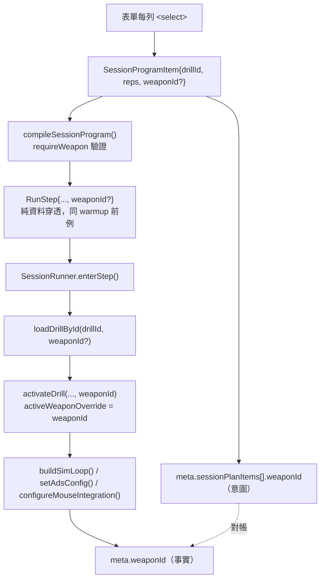

# WP-62 — Session Plan 逐列武器指定（per-item weapon）

> 讓研究者在 Session Plan 的**自訂 program 軌**上，替每一列 `(drillId, reps)` 事先指定本輪要用的武器。
>
> Companion：[task-checklist.md](task-checklist.md) · [progress.md](progress.md) · 決策 [GD-38](../../../DECISIONS.md)
>
> 本計畫依 `.claude/skills/engineering-planning/SKILL.md`、`references/design_standards.md` 與 `assets/tech_spec_template.md` 制定，結構參照 [WP-58](../../stage12/wp-58-session-program-scheduler/README.md)。**本 WP 只做排程層與其接線；不新增武器、不改 sim/命中/彈道語意、不改 frozen 軌。**

| | |
|---|---|
| **Problem** | 武器目前是 drill 的隱含屬性：`activeWeaponConfig()`（[main.ts:391-393](../../../../../src/main.ts)）解析鏈為 `activeWeaponOverride ?? activeDrillConfig.weaponId ?? 'ak47'`，而 `activateDrill()` 在每次啟用時無條件 `activeWeaponOverride = undefined`（[main.ts:1397](../../../../../src/main.ts)，WP-47/T2 reset-per-drill）。Session Plan 換 drill 走的正是這條路徑，所以研究者在 Controls 面板手選的武器**會在 program 的每一步被清掉**。要跑一輪「同一批 drill、指定武器」的測試，現行系統無法表達 |
| **Outcome** | 自訂 program 的每一列可在**跑之前**選一把武器；該列的每一輪 rep 都用同一把；選擇進入匯出稽核，且與逐 run 實際生效的武器可對帳 |
| **Truth model** | 武器是 **program item 的資料**，不是 runtime 的隱藏狀態。`compileSessionProgram()` 產出的 `RunStep.weaponId` 是該步武器的唯一真相；`activateDrill()` 只是套用它，不再自行決定 reset 成什麼 |
| **Delivery policy** | 加法：`weaponId` 全程 optional，省略時**逐位等同**現行行為。frozen 軌完全不開放此欄位，其編譯結果／runtime／匯出逐位不變 |
| **Estimate** | 8.5 dev-days（T0～T6 + T-exit） |
| **Risk** | Med/High：`activateDrill()` 是全 app 唯一的 drill 啟用路徑，武器賦值點與 `buildSimLoop()` 的先後決定 recoil RNG／彈匣／ADS／感度 gain 是否一致；`sessionProgram.ts` 帶純函式 source-scan 契約 |
| **Milestone** | 無獨立里程碑，**T-exit gate 即交付判定**（比照 WP-27／WP-58） |
| **Status** | 🟡 **T0 entry gate ✅（2026-09-10）**，T1 未開工。基線見 [progress.md §T0.1](progress.md) |

### 落點說明（stage 主題不符，明帳記錄）

stage13（階段 M）的主題是「原始輸入取樣與抬滑鼠判準驗證」，本 WP 屬 **session 排程層**，主題上更接近 stage12（WP-58 的延伸）。**依使用者 2026-09-10 指示落在 stage13**，編號 WP-62 亦承 stage13 的 WP-60／61 之後。記錄於此以免後續讀者誤判為歸檔錯誤；決策同步入 [GD-38](../../../DECISIONS.md)。

---

## 0. Repository-grounded discovery（2026-09-10）

1. **可排程 drill 中只有 4 個宣告武器。** [drillFamily.ts:49-88](../../../../../src/session/drillFamily.ts) 的 `FAMILY_ROSTER` 共 36 個 drill，其中僅 `trackingBrVariants`（4 個 `ak47_br_{hip,ads}_{hitscan,projectile}` BR 實驗格，[tracking_br_v1.ts:72](../../../../../src/drill/tracking_br_v1.ts)）有 `weaponId`。其餘 32 個 `weaponId === undefined` ⇒ 一律吃 `main.ts` 的預設 `ak47`。
2. **綁 `tracking_pilot_hold` 的兩個 pilot drill 不可排程。** `tracking_core_pr_pilot_v1` / `tracking_reversal_pilot_v1` 不在 `FAMILY_ROSTER` 內，走 `loadDrillConfigDirect()`（[main.ts:1435](../../../../../src/main.ts)）。因此本 WP 的「武器鎖」範圍是 4 列，不是一整套機制。
3. **`drillFamily.ts` 已經 import 每一個 drill 模組**（第 1–29 行），故「該 drill 宣告了哪把武器」可由既有 import **推導**，不需要第二份手寫清單（KI-016 紀律）。
4. **`SessionProgramItem` 已有純資料穿透前例。** `warmup?` 由編譯器原樣帶進 `RunStep`，不影響 boundary／rest（[sessionProgram.ts:18-31, 168-170](../../../../../src/session/sessionProgram.ts)）。`weaponId?` 是同一個形狀。
5. **編譯器的既有契約就是「非法輸入不得抵達 runtime」**（`sessionProgram.ts` 檔頭 + `SessionProgramCompileError` 註解）。武器 id 驗證放在這裡與 `requireFamily()` 同層，是既有紀律的延伸而非新增概念。
6. **`activateDrill()` 的賦值順序已經正確。** `activeWeaponOverride` 在 [main.ts:1397](../../../../../src/main.ts) 被清掉，遠早於 [main.ts:1415-1417](../../../../../src/main.ts) 的 `buildSimLoop()` / `setAdsConfig()` / `configureMouseIntegration()`。把「清成 undefined」換成「設成本步指定值」不需要移動任何其他行。
7. **`state.weapon.ammo` 只在 `createSimLoop()` 設一次**（[SimLoop.ts:815](../../../../../src/loop/SimLoop.ts)），全 repo **沒有 reload 路徑**；打空即 `heldFire = false`、`nextFireT = Infinity`（[SimLoop.ts:541-544](../../../../../src/loop/SimLoop.ts)）。換武器等於換彈匣容量，這是 FM-3 的成因。
8. **`CompatibilityKey` 已含 `weaponId`**（[compatibilityKey.ts:8-9, 34-43](../../../../../src/metrics/compatibilityKey.ts)，且 `weaponMode = weaponId` 為 OQ-S6-10 的「單武器現況佔位」）。不同武器的 run **不會**被誤併進同一條趨勢線 ⇒ 本 WP 對 history/trend **零程式修改**；代價是逐列換武器會讓趨勢線碎裂（FM-5）。
9. **散佈公式**：`totalInaccuracy = inaccuracy.stand + s.inaccuracyFire + speedRatio ** 0.25 * inaccuracy.move`（[spread.ts:41](../../../../../src/recoil/spread.ts)），三項全 0 時 `sampleSpread` 恆回 `{0,0}`（[spread.ts:29](../../../../../src/recoil/spread.ts)）。⇒ **`inaccuracy.move === 0` 的武器會讓 counter-strafe 的「急停時機 → 首發命中」因果通道消失**。這不是本 WP 要修的東西，但必須是操作員在表單上看得到的資訊（見 §2.4）。
10. **`main.ts` 已有 `loadWeaponById()`**（[main.ts:1341-1351](../../../../../src/main.ts)）示範了換武器需要的完整動作序列（重建 loop → setAdsConfig → configureMouseIntegration → 重啟 drill）。本 WP 不新增第二條換武器路徑，而是讓 `activateDrill()` 一次做完。
11. `tests/e2e/session-orchestrator.spec.ts` 已有 Session Plan 真實 DOM 端到端（WP-58 T6 擴充為 4 條表單案例 + 3 條 live run，含只跳過資格閘拒入的 dev-only seam）。UI 改版必須更新這條，不新開平行 spec。
12. `SessionPlanSetup.renderItems()` 對 `reps` 輸入刻意**不重繪該列**（[SessionPlanSetup.ts:348-353](../../../../../src/ui/SessionPlanSetup.ts)），否則會在真實瀏覽器裡每敲一鍵就失焦。武器 `<select>` 的 `change` 同理必須只刷新預覽。

### 0.1 Planning-time blast radius

| Symbol / file | 依賴面 | 分級 |
|---|---|---|
| `main.ts` `activateDrill()` / `activeWeaponOverride` | `activateDrill()` 有 **2 個直接呼叫端**（`loadDrillById` [main.ts:1428](../../../../../src/main.ts)、`loadDrillConfigDirect` [main.ts:1436](../../../../../src/main.ts)）。`activeWeaponOverride` 另有 **3 個寫入點**：`activateDrill`（清空）、`loadSceneById`（清空，[main.ts:1444](../../../../../src/main.ts)）、`loadWeaponById`（設值）——後兩者**不經** `activateDrill`，而是各自重做一次動作序列 | **cross-module High** |
| `sessionProgram.ts`（`SessionProgramItem`／`RunStep`／`compileSessionProgram`） | `SessionRunner.ts`、`SessionPlanSetup.ts`、`main.ts`、`sessionProgram.test.ts`（含純度 source-scan）、`SessionRunnerProgram.test.ts`、`SessionPlanSetup.test.ts`、`sessionProgramExport.test.ts` | **cross-module High** |
| `SessionRunner.ts`（`loadDrillById` callback 簽名） | `main.ts`、`SessionRunner.test.ts`、`SessionRunnerProgram.test.ts`、`SessionRunnerPoll.test.ts` | cross-module Med |
| `drillFamily.ts` | `sessionProgram.ts`、`SessionPlanSetup.ts`、`metadata.ts`、`drillFamily.test.ts` | cross-module Med |
| `metadata.ts`（`SessionPlanItemMeta`） | **`src/data/exportPayloadSchema.ts`**（具名：import 該型別於第 11 行，並以 `parseSessionPlanItems()` [exportPayloadSchema.ts:529](../../../../../src/data/exportPayloadSchema.ts) 逐列驗證、第 352-355／430 行組裝）、`research/` ingest、history/trend | **cross-module High**（schema 相容性） |
| `weapons.ts`（新匯出 `isWeaponId`） | 純加法，既有 `getWeapon` 語意不變 | local |
| `SessionPlanSetup.ts` | `main.ts`、`SessionPlanSetup.test.ts`、`session-orchestrator.spec.ts` | local + 1 E2E |

---

## 1. Requirements

### 1.1 Functional

| FR | 內容 | Task |
|---|---|---|
| **FR-62.1** | 系統必須允許操作員在自訂 program 軌的**每一列** item 上指定一把武器，或留空表示沿用該 drill 自帶的 `weaponId`（再退回 app 預設 `ak47`） | T2, T4 |
| **FR-62.2** | 系統必須在**編譯期**拒絕未知的武器 id，並拒絕替已宣告武器的 drill 指定不同武器；錯誤必須可定位到 item 索引 | T2 |
| **FR-62.3** | 系統必須讓同一列的**每一輪 rep** 使用同一把指定武器 | T2, T3 |
| **FR-62.4** | 系統必須把逐列武器選擇寫入匯出 `meta.sessionPlanItems[].weaponId`（意圖），與既有逐 run `meta.weaponId`（事實）並存且可對帳 | T5 |
| **FR-62.5** | 預覽表的每個 run 步驟必須顯示該步實際會用的武器 | T4 |
| **FR-62.6** | frozen 軌的編譯結果、runtime 行為與匯出必須**逐位不變** | T2, T5, T6 |
| **FR-62.7** | 武器選單必須顯示每把武器的彈匣容量，並註明「無 reload：打完該輪即停火」 | T4 |

### 1.2 Non-functional

| NFR | 量化指標 | Task |
|---|---|---|
| **NFR-62.1** | `compileSessionProgram()` 維持純函式：既有 source-scan 測試（禁 DOM／Three／`node:*`／時鐘／亂數／模組級可變狀態）**不得放寬任何一條** | T2 |
| **NFR-62.2** | 同一 program + 同一輸入序列，跨 render FPS（至少 4 種）的 sim 狀態逐位一致 | T3 |
| **NFR-62.3** | 既有測試零修改全綠：全量 Vitest **2,822 passed／2 skipped**（252 檔 passed／1 skipped）+ 全量 Playwright **103 passed**（`--workers=1`，13.8m）+ `vite build` + 兩個 typecheck 皆 exit 0。**以上為 T0 實測基線（2026-09-10）**，已取代規劃期引述的 WP-58 T-exit 舊值（2,688／99）——見 [progress.md §T0.1](progress.md) | T0, T6 |
| **NFR-62.4** | `weaponId` 省略時，`compileSessionProgram()` 的輸出與本 WP 前 HEAD **逐位相同**（物件鍵集合亦相同，不得多出 `weaponId: undefined`） | T2 |

### 1.3 Constraints

- 階段 A 鎖 Chrome/Edge 桌面版；本 WP 不改變此前提。
- UI = 純 TS + DOM overlay（D1），不引入框架。
- 命名前對齊 [CONTEXT.md](../../../../../CONTEXT.md) §G（武器抽象術語：`WeaponConfig`／`WEAPONS`／`getWeapon`／`cycletime`／彈道表）。

### 1.4 凍結決策（GD-38，本 WP 的前提）

| # | 決定 | 理由 |
|---|---|---|
| **D-62-1** | 已宣告 `weaponId` 的 drill（現況＝ BR 四格）**不可覆蓋**：指定不同武器 → 編譯錯誤並標紅該列。不做鎖定 UI、不靜默忽略 | 武器是那 2×2 實驗格的自變項；覆蓋等於毀掉實驗格。用既有 `SessionProgramCompileError` 定位到列，錯誤訊息本身即說明 |
| **D-62-2** | frozen 軌**不開放**逐列武器 | frozen = pre-registered 協定，武器是協定的一部分；要換就定義新 preset。同時保住 FR-58.10「frozen 匯出逐位不變」 |
| **D-62-3** | 下拉列出 `WEAPONS` **全部 9 把**，不做策展白名單 | KI-016 的教訓：第二份手維護白名單必然 rot。實際跑的武器已逐 run 進 `meta.weaponId`，離線可篩 |
| **D-62-4** | 彈匣容量寫進選項標籤 + 一行「無 reload」說明；**不擋**任何武器×drill 組合 | 全 repo 無 reload 路徑（§0.7）。給資訊而非猜門檻，不替研究者決定 |

### 1.5 Open Questions

| OQ | 問題 | Owner | Deadline | Impact |
|---|---|---|---|---|
| **OQ-62.1** | 留空（`—`）在預覽表要顯示 drill 自帶武器的**實名**，還是顯示「預設」？顯示實名需要在表單解析 drill config，而部分 roster 項目是 lazy binding（`spiderShotV3Binding`／`spiderShotWideV1Binding`）或 `{ id, drill }` 包裝 | 研究者 | T4 開工前 | T4 範圍。**預設假設**：顯示「預設」字樣；BR 四格因 T1 的 `DECLARED_WEAPON_BY_DRILL_ID` 而能顯示實名 |
| **OQ-62.2** | FM-4（有 `ads` 的武器 × 禁 ADS 的 drill）是否要在表單出非阻塞警告？ | 研究者 | T4 開工前 | T4。**預設假設**：不做第二套 guard，只在 `progress.md` 記為已知限制；`ads` 事件與 `meta.weapon.ads` 已逐 run 記錄，事後可稽核 |
| **OQ-62.3** | T1 的對表測試要覆蓋全部 36 個 schedulable drill（需為 lazy binding 準備 fov/aspect 與場景），還是只覆蓋 source 物件可直接取得的子集？ | 實作者 | T1 開工時 | T1 的 DoD 強度。**預設假設**：全覆蓋；若某項解析成本過高則於 `progress.md` 具名豁免並說明，不得靜默略過 |

---

## 2. Technical Design

### 2.1 System boundary

**In scope**
- `src/weapon/weapons.ts` — 匯出既有的 `isWeaponId`（目前是模組私有）。
- `src/session/drillFamily.ts` — 新增由既有 drill import 推導的 `DECLARED_WEAPON_BY_DRILL_ID`。
- `src/session/sessionProgram.ts` — `SessionProgramItem.weaponId?` / `RunStep.weaponId?` + `requireWeapon()`。
- `src/session/SessionRunner.ts` — `loadDrillById` callback 加第二參數。
- `src/main.ts` — `activateDrill()` 加 weapon 參數，取代第 1397 行的無條件 reset。
- `src/ui/SessionPlanSetup.ts` — 每列武器 `<select>`、預覽顯示武器、錯誤定位。
- `src/data/metadata.ts` — `SessionPlanItemMeta.weaponId?` + validation。
- `src/data/exportPayloadSchema.ts` — `parseSessionPlanItems()` 的逐列 `weaponId` 驗證（T0 CodeGraph 對帳補入：型別在 `metadata.ts`，**但實際 runtime 驗證在此檔**，兩處必須同步否則 schema 會接受未驗證的欄位）。

**Out of scope**
- frozen track（D-62-2）。
- Controls 面板既有的武器下拉與 `loadWeaponById()`：維持 reset-per-drill 語意不變。
- 新增／修改任何 `WeaponConfig`（不新增武器、不改 `usp_s_laser` 的 `magSize`／`inaccuracy`）。
- reload 機制。
- `CompatibilityKey` 改版（`weaponId` 已在鍵內；`weaponMode` 佔位的拆分仍屬 WP-33/OQ-S6-10）。
- 任何 sim／命中／彈道／指標語意。

### 2.2 Data flow



關鍵順序：`activeWeaponOverride` 的賦值必須發生在 `buildSimLoop()` **之前**（§0.6），否則該步的 recoil RNG stream、彈匣容量、ADS 光學與滑鼠 gain 會各自取到不同世代的武器。

### 2.3 Interface contracts

```ts
// src/weapon/weapons.ts — 既有私有函式改為匯出，語意不變
export function isWeaponId(id: string): id is WeaponId;

// src/session/drillFamily.ts
/**
 * drill -> 該 drill 自己宣告的武器。**由本檔已 import 的 drill 模組推導**，不是第二份手寫清單
 * （KI-016）。不在 map 內 = 該 drill 未宣告武器，可由 Session Plan 逐列指定。
 * 現況恰 4 筆（BR 2x2 實驗格）；`drillFamily.test.ts` 以逐 drill 對表釘死。
 */
export const DECLARED_WEAPON_BY_DRILL_ID: ReadonlyMap<string, WeaponId>;

// src/session/sessionProgram.ts — 全部 additive optional
export interface SessionProgramItem {
  readonly drillId: string;
  readonly reps: number;
  readonly warmup?: boolean;
  /** 省略 = 沿用 drill 自帶 weaponId，再退回 app 預設。編譯器只驗證與穿透，不解析武器資料。 */
  readonly weaponId?: WeaponId;
}

export interface RunStep {
  readonly kind: 'run';
  readonly drillId: string;
  readonly family: SessionFamilyId;
  readonly itemIndex: number;
  readonly repIndex: number;
  readonly repCount: number;
  readonly warmup?: boolean;
  /** 與 item 同值；同一列的每一輪 rep 都帶同一把（FR-62.3）。省略時本鍵不存在（NFR-62.4）。 */
  readonly weaponId?: WeaponId;
}

export type SessionProgramErrorField =
  | 'items' | 'drillId' | 'reps' | 'drillRestSeconds' | 'familyRestSeconds'
  | 'weaponId';   // 新增

// src/session/SessionRunner.ts
export interface SessionRunnerOptions {
  /** WP-62：第二參數為該步的指定武器；省略 = 沿用 drill 自帶／app 預設。 */
  readonly loadDrillById: (drillId: string, weaponId?: WeaponId) => Promise<void>;
  readonly onStatus?: (text: string) => void;
  readonly onPhaseChange?: (phase: SessionRunnerPhase) => void;
}

// src/data/metadata.ts
export interface SessionPlanItemMeta {
  readonly drillId: string;
  readonly reps: number;
  /** WP-62：操作員在該列指定的武器（意圖）。缺席 = 未指定。對 `WEAPONS` 驗證，同編譯器單一來源。 */
  readonly weaponId?: string;
}
```

錯誤情境（`SessionProgramCompileError`，`field: 'weaponId'` + `itemIndex`）：

| 觸發 | 訊息骨架 |
|---|---|
| 未知武器 id | `` `${weaponId} 不是已知武器` `` |
| 覆蓋已宣告武器的 drill | `` `${drillId} 由實驗格固定為 ${declared}，不可指定其他武器` `` |

呼叫端**不得** parse 訊息；分類一律走 `field` + `itemIndex`（沿用 WP-58 T2 契約）。

### 2.4 表單顯示要求（FR-62.7）

武器選項標籤格式：`` `${id}（${magSize} 發）` ``，例如 `usp_s_laser（12 發）`、`ak47（30 發）`、`tracking_pilot_hold（512 發）`。彈匣數直接讀 `WEAPONS[id].magSize`，不另存常數。清單下方固定一行說明：

> 無 reload：彈匣打完該輪即停火，且受測者的「按住」意圖會被記成放開。

選這個呈現而非「猜一個門檻然後警告」，是因為「這個 drill 需要幾發」取決於受測者的失誤數，系統無從預知；顯示事實比顯示猜測誠實（D-62-4）。

### 2.5 決定性契約與三迴圈邊界

- **決定性**：武器換裝走既有 `buildSimLoop()` 重建路徑，該路徑已重置 recoil RNG stream、`tickIndex` 與 `state.weapon.ammo`。本 WP 不新增亂數來源。以「同一 program + 同一輸入序列，跨 4 種 render FPS 的 sim 狀態逐位一致」斷言釘死（T3 DoD）。
- **三迴圈邊界（ADR-2）**：武器是 sim 的**建構參數**（`createSimLoop(..., weapon)`），不是跨迴圈通道；本 WP **不新增任何 `SharedState` 欄位**。表單→編譯器→runner→activateDrill 全在 render/UI 執行緒的啟用階段完成，drill 執行中不改武器。
- **固定佈局**：不新增緩衝。`RunStep.weaponId` 是編譯期一次性產生的不可變陣列元素，非每 frame／每 tick 熱路徑配置。
- **時鐘域**：本 WP 不讀任何時鐘。
- **seeded RNG**：seed 來源不變（`spiderShot?.seed ?? sequence.seed`）；換武器只換彈道表參數（`recoil.seed` 屬武器資料，已隨 `meta.weaponSeed` 入匯出）。

### 2.6 硬約束衝擊（`CLAUDE.md §4` 逐條）

| 約束 | 是否觸及 | 說明 / 緩解 |
|---|---|---|
| 禁 `Date.now()`，一律 `performance.now()`（ADR-4） | ❌ 不觸及 | 本 WP 不新增任何時間讀取或時間戳欄位 |
| cross-origin isolation 生效 | ❌ 不觸及 | 不動 COOP/COEP、不動計時精度路徑 |
| **決定性**：同輸入序列跨 render FPS 逐位一致 | ✅ 觸及 | 見 §2.5；賦值點早於 `buildSimLoop()`，以跨 FPS 逐位斷言釘死（T3） |
| **三迴圈邊界（ADR-2）** | ❌ 不觸及 | 不新增 `SharedState` 欄位；武器為 sim 建構參數而非跨迴圈通道 |
| 固定佈局：輸入 ring + `DataRecorder` arena | ❌ 不觸及 | 不新增緩衝、不在熱路徑配置物件 |
| seeded RNG，seed 入 metadata（GD-5） | ✅ 觸及（弱） | 不新增亂數；`recoil.seed` 隨武器改變，已由既有 `meta.weaponSeed` 記錄 ⇒ 零新增欄位即可稽核 |
| **GD-6** 場景幾何永不進 sim / 解析度與場景切換不改 sim | ❌ 不觸及 | 不讀 `propBounds`、不改 `SIM_HZ`、不改場景切換路徑 |
| **GD-9** 場景資產授權白名單 | ❌ 不觸及 | 不新增資產 |
| **GD-11** FPSci 授權紅線 | ❌ 不觸及 | 不引用 FPSci 程式碼或 config |
| **GD-7** hitbox 單一來源 | ❌ 不觸及 | 不改命中幾何或 `TargetState.hitbox` |
| **GD-16** ADS 只落 input/render/data 層 | ✅ 觸及 | 選到有 `ads` 的武器會讓右鍵在該 drill 生效，但作用點仍只在 `CameraController` FOV/gain；**不改** `SIM_HZ`／目標演進／命中幾何／彈道語意。protocol 相容性見 FM-4 |
| **GD-17** 彈道模型 config-gated | ✅ 觸及（弱） | BR projectile 武器已 config-gated；本 WP 不新增 `bullet` 參數，只是讓既有武器可被排程層選中。省略 `bullet` 的武器仍走 hitscan 路徑逐位不變 |
| **C-D1** `research/` ↔ `src/` 單向隔離 | ✅ 觸及 | `sessionPlanItems[].weaponId` 為 additive optional ⇒ Python `load_export()` 應零修改；T5 須以**真實** `load_export()` 驗證，若需改 Python 則停下入帳 |
| **C-D4** 既有構念不得有第二定義 | ✅ 觸及（風險） | 換武器會改變 `inaccuracy.move`／`recoil`，進而改變 counter-strafe 與 tracking 構念的量測內容（§0.9）。本 WP **不**新增第二套定義；但操作員可組出讓構念失效的組合 ⇒ 以 §2.4 的資訊揭露 + FM-3/FM-4 的稽核路徑處理，並在 `progress.md` 記為明帳限制 |
| **C-D5** 晉升指標雙實作對表 | ❌ 不觸及 | 不改 `seg-v2`／`phase-v1`／`curve-v1`／`sync-v1`／`sg-seg-v2` 任一端 |

---

## 3. Failure modes

| # | 觸發條件 | 影響範圍 | 處理策略 |
|---|---|---|---|
| **FM-1** | 未知武器 id 抵達 runtime | `getWeapon()` 在 `buildSimLoop()` 內拋錯，留下半啟用的 drill（場景已換、`activeDrillConfig` 已改） | 編譯期擋掉（FR-62.2）；表單走既有 `setCompileFailure()` 禁止送出。T2 以負向測試釘死 |
| **FM-2** | 替 BR 四格指定不同武器 | 2×2 實驗格的自變項被污染，且匯出看起來完全合法 | 編譯錯誤 + 標紅該列（D-62-1）。T2 負向測試 + T4 的列定位測試 |
| **FM-3** | 選中的武器 `magSize` 不足該 run 實際需要的發數 | **靜默停火**；受測者的「按住」意圖旗標被 `SimLoop` 清成 false，被記成放開 | 選項標籤顯示彈匣容量 + 無 reload 說明（§2.4）。**殘留風險，明帳接受**（D-62-4）。`meta` 已記 `ammo` 逐發，離線可偵測 |
| **FM-4** | 選到有 `ads` 的武器，配上 protocol 禁 ADS 的 drill | 右鍵變成有效，可能產生 protocol violation | 不做第二套 guard（OQ-62.2 預設假設）；`ads` 事件與 `meta.weapon.ads` 已逐 run 記錄 ⇒ 事後可稽核。列入 `progress.md` 已知限制 |
| **FM-5** | 逐列換武器 → `CompatibilityKey.weaponId` 不同 ⇒ trend cohort 碎裂 | history 趨勢線變空或變短，外觀像 bug | **零程式修改**（行為正確：不同武器本就不該併池）。在表單說明文字寫明；T4 DoD 含該文字存在的斷言 |
| **FM-6** | 平行 session 同時改 `src/session/*` 或 stage README | 合併衝突、索引檔互相覆蓋 | T0 開工前檢查；索引檔衝突時只 stage 自己那幾行 |

### 3.1 Technical debt

`weaponMode = weaponId` 的佔位（[compatibilityKey.ts:42-43](../../../../../src/metrics/compatibilityKey.ts) 的 `TODO(WP-33/OQ-S6-10)`）在多武器成為常態後，語意退化為與 `weaponId` 重複的欄位。**本 WP 不動它**。觸發重構條件：當 Assessment 需要區分同一把武器的 hip / ADS 兩種模式時，依原 TODO 拆開並升版 `CompatibilityKey`。

---

## 4. Task 索引

| Task | Objective | Dep | Risk | 估時（d） |
|---|---|---|---|---|
| [T0](T0-entry-gate.md) | Entry gate：基線復現、編號重查、D-62-1~4 入帳、平行 session 檢查 | — | Low | 0.5 |
| [T1](T1-declared-weapon-registry.md) | `isWeaponId` 匯出 + `DECLARED_WEAPON_BY_DRILL_ID` 推導註冊表 | T0 | Low | 1 |
| [T2](T2-compiler-weapon-passthrough.md) | 編譯器 `weaponId` 穿透 + `requireWeapon()` 驗證 | T1 | Med | 1 |
| [T3](T3-runner-and-activation-wiring.md) | `SessionRunner` + `activateDrill()` 接線與決定性斷言 | T2 | **High** | 1.5 |
| [T4](T4-setup-ui-weapon-picker.md) | 表單每列武器 `<select>` + 預覽顯示 + 列定位錯誤 | T2 | Med | 1.5 |
| [T5](T5-metadata-and-export.md) | `SessionPlanItemMeta.weaponId` + validation + 意圖/事實對帳 | T3 | Med | 1 |
| [T6](T6-e2e-and-regression.md) | E2E 整合 + frozen 逐位不變回歸 | T3+T4+T5 | Med | 1.5 |
| [T-exit](T-exit-gate.md) | 驗收：A-62.1～7 逐項具名證據 | T1–T6 | Low | 0.5 |

```
T0 → T1 → T2 → T3 → T5 ─┐
               └→ T4 ────┴→ T6 → T-exit
```

T4 只需要 T2 的型別與編譯器，**可與 T3 並行**。

## 5. 驗收條目（T-exit 對照）

| # | 條目 |
|---|---|
| **A-62.1** | 自訂 program 可在每列選武器，該列每一輪 rep 都用同一把（FR-62.1／62.3） |
| **A-62.2** | 未知武器 id 與覆蓋 BR 四格皆為編譯錯誤且定位到列（FR-62.2） |
| **A-62.3** | 省略 `weaponId` 時編譯輸出與本 WP 前 HEAD 逐位相同，鍵集合亦相同（NFR-62.4） |
| **A-62.4** | frozen 軌編譯／runtime／匯出逐位不變（FR-62.6） |
| **A-62.5** | 匯出可對帳：`sessionPlanItems[].weaponId`（意圖）vs `meta.weaponId`（事實）（FR-62.4） |
| **A-62.6** | 同 program 跨 4 種 render FPS 的 sim 狀態逐位一致（NFR-62.2） |
| **A-62.7** | 選單顯示彈匣容量 + 無 reload 說明 + trend 碎裂提示（FR-62.7／FM-5） |
