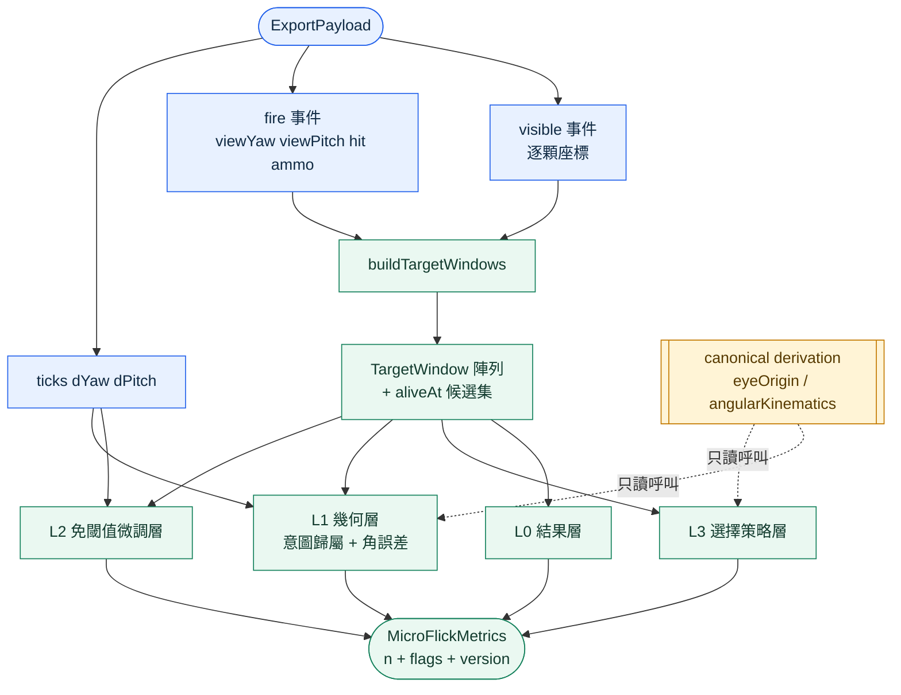
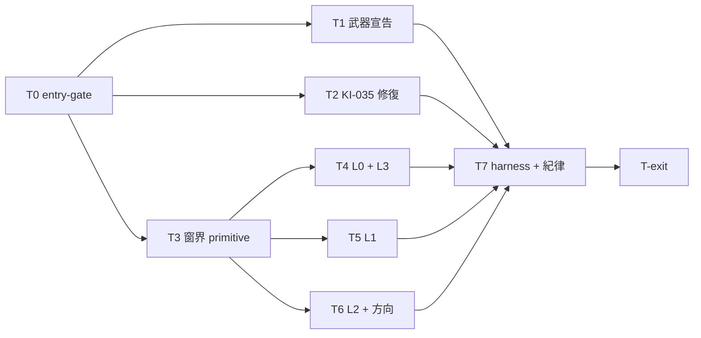

# WP-63 — Micro Flick v8 量測基礎層（per-target 窗界 + 事件錨定指標）

> 讓 `micro_flick_three_target_test_v8`（**三顆同時存活**）第一次有可宣稱的量測指標：補上缺失的**離線重建層**，並把量測儀器（武器、感度 gain）的兩個效度缺口補起來。
>
> Companion：[task-checklist.md](task-checklist.md) · [progress.md](progress.md) · 決策 [GD-39](../../../DECISIONS.md) · bug [KI-035](../../../../known_issue/KI-035-mouse-gain-stale-after-sensitivity-or-fov-change.md)
>
> 本計畫依 `.claude/skills/engineering-planning/SKILL.md`、`references/design_standards.md` 與 `assets/tech_spec_template.md` 制定，結構參照 [WP-62](../wp-62-session-plan-per-item-weapon/README.md)。**本 WP 不改 sim 演進、不改命中判定、不改 spawn 分布。**

| | |
|---|---|
| **Problem** | v8 是全 repo 唯一「場上同時三顆」的 drill，但既有分析棧從 [`firstShot.ts:22-28`](../../../../../src/sim/firstShot.ts) 到 [`peekWindows.ts:47-50`](../../../../../src/metrics/peekWindows.ts) 都建立在「一次只一個 active 目標」這個從未寫下的前提上。後果不是報錯，是**四個靜默錯誤**——數字看起來合理，但歸屬到錯的目標（§0.1）。加上 v8 沒有 `weaponId` ⇒ 吃預設 `ak47`（有後座、有散布、右鍵縮 FOV），與 [micro-flick 指標設計](../../../../algorithm/micro-flick/README.md) 明文要求的「零散布、零後座」直接矛盾 |
| **Outcome** | v8 有一套**完全事件錨定**、可離線重算、不重寫任何既有幾何的指標族；三顆的窗界由一個新 primitive 負責，`ε(t)`／on-target／eye origin／`ω(t)` 一律續用既有 canonical derivation |
| **Truth model** | v8 的三顆目標**位置在存活期恆定**（config 無 `motion`）⇒ `visible` 事件的 `targetX/Y/Z` 就是全部幾何真相；存活集合 = `visible` 減去已擊殺。**蒐集層已經夠了，缺的是離線重建層** |
| **Delivery policy** | 加法為主：新增 `src/metrics/targetWindows.ts` 與 v8 指標模組，**不改** `peekWindows.ts` / `trackingDerivation.ts` / `detectionDerivation.ts` 任何一行。唯二的既有檔案異動是 v8 fixture 的 `weaponId`（T1，明帳斷代）與 [KI-035](../../../../known_issue/KI-035-mouse-gain-stale-after-sensitivity-or-fov-change.md) 的接線修復（T2） |
| **Estimate** | 12–16.5 dev-days（T0～T7 + T-exit） |
| **Risk** | Med：主要風險在**構念邊界**而非實作。`buildTargetWindows()` 若被寫成第二套幾何就踩 C-D4；v8 換武器會讓既有 v8 匯出與新資料不可混比 |
| **Milestone** | 無獨立里程碑，**T-exit gate 即交付判定**（比照 WP-60／62） |
| **Status** | ⬜ **未開工**（2026-09-10 規劃完成） |

### 落點說明（stage 主題部分相符，明帳記錄）

stage13（階段 M）的主題是「原始輸入取樣與抬滑鼠判準驗證」。本 WP **有一半屬於這個主題** —— [KI-035](../../../../known_issue/KI-035-mouse-gain-stale-after-sensitivity-or-fov-change.md) 是 `dYaw`/`dPitch` 這條原始輸入積分流的效度缺口，`?rawMouse=1` 的採集紀律也承 WP-60 的交付；**另一半（v8 窗界與指標族）主題上更接近 [stage14 草案](../../stage14/README.md)**。依使用者 2026-09-10 指示落在 stage13，承 [WP-62](../wp-62-session-plan-per-item-weapon/README.md) 的同一先例。記錄於此以免後續讀者誤判為歸檔錯誤；決策同步入 [GD-39](../../../DECISIONS.md) ①。

---

## 0. Repository-grounded discovery（2026-09-10）

### 0.1 四個靜默錯誤（本 WP 存在的理由）

| # | 位置 | 靜默錯誤 |
|---|---|---|
| 1 | [`RingBuffer.ts:214-222`](../../../../../src/data/RingBuffer.ts) | `recordState` 掃到第一個 `visible && alive` 就停 ⇒ `ticks[].tx/ty/tz` 與 `replayTargetId` 只描述三顆中的一顆，而且**由陣列順序這個實作產物決定** |
| 2 | [`trackingDerivation.ts:284`](../../../../../src/metrics/trackingDerivation.ts) | `targetForTick()` **優先**讀 `tick.tx`。v8 的 `tx` 恆非 null ⇒ 另外兩顆的 `ε(t)` 與 `onTarget` 是對錯的目標算的 |
| 3 | [`peekWindows.ts:47-50`](../../../../../src/metrics/peekWindows.ts) | 窗界 `windowEnd = nextVisible.t`。v8 的下一個 `visible` 通常屬於另一顆 ⇒ 每顆的分析窗被別人的 spawn 截斷 |
| 4 | [`SimLoop.ts:429-431, 451`](../../../../../src/loop/SimLoop.ts) | `offsetDeg` **永遠**對 `currentPeekId`（陣列首顆）算；`targetId` 只在**命中時**被 raycast 結果覆寫，失手時仍是首顆；`firstShot` 也以首顆為鍵 ⇒ **首發語意崩壞**（陣列首顆存活期間，後續 fire 的 `firstShot` 恆 `false`） |

### 0.2 蒐集層已經足夠（本 WP 不需要改 recorder 或 schema 的理由）

| 需要 | 來源 | 狀態 |
|---|---|---|
| 三顆各自的位置 | [`SimLoop.ts:555-570`](../../../../../src/loop/SimLoop.ts) `recordVisibleEvents` **逐顆**記錄，每顆帶 `targetX/Y/Z` | ✅ |
| 位置在存活期恆定 | v8 config 無 `motion` ⇒ [`TargetManager.ts`](../../../../../src/sim/TargetManager.ts) 的 motion drive 整段跳過（GD-7／WP-18 契約保證逐位不變） | ✅ |
| 存活窗閉合 | v8 無 `peekTimeoutMs`，目標只會被打掉 ⇒ 窗 = `[visible.t, 該顆命中 fire.t]` | ✅ |
| 開火當下的視角 | `fire` 事件恆帶 `viewYaw` / `viewPitch`（[`SimLoop.ts:486-487`](../../../../../src/loop/SimLoop.ts)，無條件欄位）⇒ 對**任一顆**的角誤差都能離線重算 | ✅ |
| 命中歸屬 | 命中時 `fire.targetId` 被 raycast 結果覆寫（[`SimLoop.ts:451`](../../../../../src/loop/SimLoop.ts)） | ✅ |
| eye origin | `meta.scene.eye` 由 [`main.ts:867`](../../../../../src/main.ts) 的 `resolveEyeWorldBase()` **決定性算出**（不讀 camera，ADR-2）⇒ [`resolveEyeOrigin()`](../../../../../src/metrics/eyeOrigin.ts) 回 `source: 'meta'` | ✅ |
| 逐 tick 角位移 | `mouseIntegration` **全域常開**（[`main.ts:744`](../../../../../src/main.ts)）⇒ `ticks[].dYaw`/`dPitch` 恆存在，且依**事件自身 `timeStamp`** 分桶進 tick 窗（[`SimLoop.ts:101-106`](../../../../../src/loop/SimLoop.ts)）⇒ **真 128 Hz，與顯示率無關** | ⚠️ 見 [KI-035](../../../../known_issue/KI-035-mouse-gain-stale-after-sensitivity-or-fov-change.md) |

⇒ **v8 缺的是離線重建層，不是蒐集層。**

### 0.3 hitscan 不發 `hit` 事件（會讓照抄的公式拿到空陣列）

[`SimLoop.ts:354`](../../../../../src/loop/SimLoop.ts) 的 `type: 'hit'` 事件**只在 projectile 分支**發射。v8 的武器（現況 `ak47`、T1 後 `usp_s_laser`）皆無 `bullet` ⇒ 純 hitscan ⇒ **整場 0 個 `hit` 事件**，命中只寫在 `fire` 事件的 `hit: true` 上。

⇒ [micro-flick 指標設計](../../../../algorithm/micro-flick/README.md) 裡所有寫成 `t_hit[i] − t_hit[i-1]` 的公式，以及 [`compute.ts`](../../../../../src/metrics/compute.ts) 的 `hitEvents` 路徑，**在 v8 上會拿到空陣列**。本 WP 一律以 `fire.t where fire.hit === true` 為擊殺時刻。

### 0.4 `GD-38 ②(b)` 的前提有誤（本 WP 必須入帳的修正）

[GD-38](../../../DECISIONS.md) ②(b) 寫：

> 「`state.weapon.ammo` 只在 `createSimLoop()` 設一次（SimLoop.ts:815），全 repo **無 reload 路徑**」

**實況**：[`TargetManager.ts:585`](../../../../../src/sim/TargetManager.ts) 的 `spawn()` 每次都執行 `state.weapon.ammo = state.weapon.magSize`，而 `spawn()` 有 **3 個呼叫點**（`TargetManager.ts:617, 644, 647`），涵蓋 legacy 與 population 兩條路徑。

⇒ **每一次目標生成都會補滿彈匣**。v8 每殺一顆就 spawn 一顆 ⇒ `magSize 12` 只在「連續 12 發都沒殺掉任何目標」時才會空倉。GD-38 ②(b) 描述的「2.04 秒後靜默停火」在**任何 spawn-driven drill 上都不成立**；它成立的前提是整段期間零 spawn。

同時 GD-38 ②(a)（counter-strafe 因果通道消失）**對 v8 不適用**：v8 是 `playerControl.translation: 'locked'` ⇒ `residualSpeed` 恆 0 ⇒ `speedRatio` 恆 0 ⇒ `inaccuracy.move` 從不參與 `totalInaccuracy`（[`spread.ts:41`](../../../../../src/recoil/spread.ts)），且 v8 不量測任何 counter-strafe 構念。

⇒ 兩個 blocker 都不落在 v8 上，故 T1 可以替 v8 宣告零後座零散布武器。**這不是推翻 GD-38 ②「不做全域 pin」的結論** —— 那個結論仍然成立；修正的是它引用的機制事實與適用範圍。詳見 [GD-39](../../../DECISIONS.md) ③。

### 0.5 v8 的幾何預算（供指標定義引用）

| 量 | 值 | 出處 |
|---|---|---|
| 同時存活 | 3（`next-tick` 補位） | [`micro_flick_three_target_test_v8.ts`](../../../../../src/drill/micro_flick_three_target_test_v8.ts) |
| 目標總數 / 結束條件 | 60 kills，無時限 | 同上 |
| 球體直徑 | 1.08375 u | 同上 |
| 視角寬 W | 2.588°@24u · **2.483°@25u** · 2.388°@26u | 由直徑與距離推導 |
| spawn 場域 | yaw ±6.5° · pitch −5~+6° · 24–26 u | 同上（WP-59 硬約束，不得更動） |
| active 間距 / replacement 間距 | ≥5° / ≥2.6° | [WP-59](../../stage12/wp-59-micro-flick-v8-replacement-spacing/README.md) |
| ⇒ flick 角距 D | **2.6° ~ 約 17°**（場域對角） | 由上兩列推導 |
| ⇒ Fitts `ID = log2(1+D/W)` | **約 1.0 ~ 3.0 bits** | 同上 |

> ID 跨度僅約 2 bits ⇒ Fitts throughput 在 v8 上只能作 covariate 正規化，**不得**當 KPI。本 WP 不交付 Fitts 量。

### 0.6 Planning-time blast radius

| Symbol / file | 依賴面 | 分級 |
|---|---|---|
| `src/metrics/targetWindows.ts`（**新檔**） | 零既有 importer；本 WP 內由 T4/T5/T6 消費 | **local（新增）** |
| `peekWindows.ts` `buildPeekWindows()` | counterstrafe／peek／tracking 全家族錨點，帶 golden fixture 與 C-D5 promoted parity 測試 | **不觸及**（見 §2.3 否決方案 C） |
| `trackingDerivation.ts` / `detectionDerivation.ts` / `eyeOrigin.ts` / `angularKinematics.ts` | ε(t)／on-target／eye origin／ω(t) 的**唯一** TS 實作 | **只讀不改**（C-D4 硬紀律） |
| `micro_flick_three_target_test_v8.ts` fixture | [`main.ts:313`](../../../../../src/main.ts) 變體清單、[`drillFamily.ts:85`](../../../../../src/session/drillFamily.ts) family roster、`micro_flick_three_target_test_variants.test.ts` | local fixture + 3 個 consumer |
| `main.ts` `onSensitivityChange`／`onFovChange`（`main.ts:493-494`） | KI-035 修復點；`createSettingsPanel` 的 2 個 callback | local |
| `src/data/*` recorder／schema | **零修改**（§0.2） | **不觸及** |

⇒ T0 開工時須以 CodeGraph 重跑 impact 並把當下數字記入 `progress.md`（graphify 報告可能落後 HEAD）。

---

## 1. Requirements

### 1.1 Functional

| FR | 內容 | Task |
|---|---|---|
| **FR-63.1** | 系統必須提供一個 population-aware 的窗界原語，對一份匯出輸出**每一顆目標**的 `[t_visible, t_kill]` 窗與其固定世界座標，窗數恆等於 `visible` 事件數，不丟窗、不合併窗 | T3 |
| **FR-63.2** | 該原語必須能回答「某時刻誰活著」（該時刻 `visible` 過且未被擊殺的目標 id 與座標），供「候選集」語意使用 | T3 |
| **FR-63.3** | 該原語**不得**自行計算 `ε(t)`、on-target、eye origin 或 `ω(t)`；需要這些量時必須呼叫既有 canonical derivation | T3 |
| **FR-63.4** | 系統必須對每一次擊殺輸出「被殺目標 → 最近存活目標」的角距，且**同時**以兩種候選集計算：`nearest-2`（擊殺瞬間的倖存者）與 `nearest-3`（含下一 tick 才 spawn 的 replacement） | T4 |
| **FR-63.5** | 系統必須輸出選擇策略層四量：`nearestFirstRate`、`selectionCostRatio`（實際擊殺順序總角距 / 貪婪最近鄰總角距）、`selectionRankEntropy`、`replacementEngagedRate` | T4 |
| **FR-63.6** | 系統必須輸出結果層五量：`killRateHz`、`shotsPerKill`、`shotAccuracy`、`killIntervalP50Ms`、`killIntervalP90Ms`，且擊殺時刻一律取 `fire.hit === true` 的 `fire.t`（**不得**依賴 `hit` 事件，§0.3） | T4 |
| **FR-63.7** | 系統必須離線重算每一發的**意圖目標**與開火角誤差：對該 fire 時刻的存活集合逐顆以 `fire.viewYaw`/`viewPitch` 計算角誤差，取最小者為意圖目標；**不得**採用 `fire.targetId` 或 `fire.offsetDeg`（§0.1 #4） | T5 |
| **FR-63.8** | 系統必須以 FR-63.7 的意圖歸屬重新定義首發：每顆目標**第一發朝它**的射擊即為該目標的首發，並輸出 `firstShotHitRate` | T5 |
| **FR-63.9** | 系統必須輸出「首發失手 → 該目標被擊殺」的時間，並拆成 `settlingMs` 與 `cadenceWaitMs` 兩段（後者 = 被 `cycletimeSec` 排程擋住的等待） | T5 |
| **FR-63.10** | 系統必須輸出**免閾值**的微調描述子：`reEntryCount`、`dwellPathRatio`、`signReversalCount`、`approachToFireMs`；四者皆不得引入速度門檻或平滑窗參數 | T6 |
| **FR-63.11** | 系統必須輸出「擊殺後方向預測」曲線：對一組固定窗長 `W ∈ {30, 60, 90, 120} ms`，以窗內累積角位移的方位角預測下一個被擊殺目標，回報逐 `W` 的預測命中率與樣本數 | T6 |
| **FR-63.12** | v8 fixture 必須宣告 `weaponId: 'usp_s_laser'`，且該變更必須在匯出以 `meta.weaponId` 可稽核 | T1 |
| **FR-63.13** | 系統必須在離線端偵測「彈匣打空」（逐發 `fire.ammo` 觸底）並以旗標呈現，不靜默忽略 | T1（契約）, T3（`ammo_exhausted_in_window` 實作） |
| **FR-63.14** | 感度或 FOV 變更後，`ticks[].dYaw`/`dPitch` 必須使用變更後的 gain，且與匯出的 `meta.mouseIntegration` 一致（[KI-035](../../../../known_issue/KI-035-mouse-gain-stale-after-sensitivity-or-fov-change.md)） | T2 |
| **FR-63.15** | 每個指標輸出必須攜帶樣本數 `n`、封閉詞彙表旗標與版本字串；缺失一律 `undefined` + 具名旗標，**不補零、不吞成 NaN** | T4, T5, T6 |

### 1.2 Non-functional

| NFR | 量化指標 | Task |
|---|---|---|
| **NFR-63.1** | v1–v7 與所有非 population drill 的既有 golden 輸出、config 解析與 spawn trace **逐位不變**（`Object.is` 全欄位比對） | T1, T7 |
| **NFR-63.2** | 同一 seed 與輸入序列，在 30／60／144／240 render FPS 下，v8 的逐 tick trace 與本 WP 全部指標輸出**逐位一致** | T7 |
| **NFR-63.3** | `buildTargetWindows()` 對 60-kill v8 匯出（約 180 個 `visible` 事件、約 7,700 ticks）的執行時間 < 50 ms（Node，單執行緒） | T3 |
| **NFR-63.4** | `buildTargetWindows()` 原始碼對 `epsilon`／`onTarget`／`eyeHeight`／`SIM_TO_WORLD`／`acos` 五個符號的**直接**出現次數為 0（以掃描測試釘死 C-D4） | T3 |
| **NFR-63.5** | 全部新指標對 tick rate 的敏感度：以 64／128／256 Hz 重採樣同一條合成軌跡，免閾值描述子（FR-63.10）的相對變異 < 5% | T7 |
| **NFR-63.6** | 既有測試零修改全綠：`npm run typecheck`（×2）、全量 Vitest、全量 Playwright（`--workers=1`）、`vite build` 皆 exit 0。T0 須先實測並記錄基線數字 | T0, T7 |
| **NFR-63.7** | T1 之後，v8 的 `sampleSpread()` 恆回 `{0,0}`（`inaccuracy` 三項全 0 ⇒ [`spread.ts:29`](../../../../../src/recoil/spread.ts) 早退）且**不消耗 recoil RNG** ⇒ 換武器不擾動任何 seeded 串流，以 spawn trace 逐位比對釘死 | T1 |

### 1.3 Constraints

- **不得**更動 v8 的 spawn 場域、間距、目標數、球體尺寸、場景或 next-tick 生命週期（WP-59 硬約束）
- **不得**修改 `peekWindows.ts`／`trackingDerivation.ts`／`detectionDerivation.ts`／`eyeOrigin.ts`／`angularKinematics.ts` 任何一行
- **不得**在 v8 側重寫任何幾何（C-D4）
- **不得**新增 `SharedState` 欄位、不得改 `DataRecorder` 或匯出 schema
- **不得**把 v8 提升為 Assessment、history 持久化或 replay
- **不得**引入第二個 movement-onset 判準（§2.2）
- 階段 A 鎖 Chrome/Edge 桌面版；本 WP 不改變此前提

### 1.4 Open Questions

| OQ | 問題 | 預設假設（非阻塞） | Owner | Deadline | 影響 |
|---|---|---|---|---|---|
| **OQ-63.1** | 既有 v8 匯出是否屬於某個已凍結的研究 cohort？ | **否** —— v8 為 practice/researcher-only，未進 history。T1 直接改 fixture 並以 `meta.weaponId` 斷代 | 研究者 | **T1 開工前** | 決定 T1 是改 v8 還是另開 v9 |
| **OQ-63.2** | `selectionCostRatio` 的貪婪基準線起點，用「擊殺瞬間的瞄準點」還是「被殺目標中心」？ | **被殺目標中心** —— 兩者在 replacement ≥2.6° 約束下會給出不同最優序；目標中心是幾何量、瞄準點含執行誤差，基準線不該被執行品質污染 | 研究者 | **T4 開工前** | 決定 FR-63.5 的基準線定義與其版本字串 |
| **OQ-63.3** | `?rawMouse=1` 是否列為 v8 的**強制**採集條件？ | **否，但預設開啟** —— §3.2 的免閾值描述子在 128 Hz 已足夠；raw sample 先收著作為後續校準的參考真值，不進本 WP 任何指標定義 | 研究者 | **T7 開工前** | 決定採集紀律是硬閘還是建議 |
| **OQ-63.4** | KI-035 的修法取 (a)、(b) 或兩者併行？ | **(a)+(b) 併行** —— (a) 補接線讓 gain 恆為最新，(b) run 內鎖定設定讓一次 run 只有一組 gain | 實作者 | **T2 開工時** | 決定 T2 是否觸及 UI 行為與既有 E2E |

---

## 2. Technical Design

### 2.1 System boundary

**In scope**

- 新增 `src/metrics/targetWindows.ts`：population-aware per-target 窗界原語
- 新增 `src/metrics/microFlickMetrics.ts`：v8 指標族（結果／幾何／免閾值微調／選擇策略四層）
- v8 fixture 加 `weaponId: 'usp_s_laser'`
- [KI-035](../../../../known_issue/KI-035-mouse-gain-stale-after-sensitivity-or-fov-change.md) 的接線修復
- 合成驗證 harness 與採集紀律文件

**Out of scope**

- 修改任何既有 derivation 的幾何或窗界（C-D4）
- 修改 recorder／匯出 schema／`SharedState`
- v8 進 Assessment／history／trend／replay
- movement onset 判準（§2.2 說明為何整段不需要）
- 教練報告呈現層（C-D3 信度閘未過，本 WP 不宣稱任何指標可進教練報告）
- 真人 pilot 錄製與時序參數校準
- Fitts throughput（§0.5：ID 跨度不足）
- spider-shot 家族的任何改動

### 2.2 為什麼本 WP 不需要任何 movement-onset 判準

CONTEXT.md §48 已把「瞄準移動 onset」定義為 **`t_detect`** 這個既有構念，由 [`detectionDerivation.ts`](../../../../../src/metrics/detectionDerivation.ts) 權威實作。任何在 v8 側另立的 ω 門檻都會是**同一構念的第二定義 ⇒ 直接踩 C-D4**。

而 `t_detect` 在 v8 上有兩個結構性障礙：

| 障礙 | 說明 |
|---|---|
| [KI-031](../../../../known_issue/KI-031-detection-sustained-ticks-dies-when-aim-updates-slower-than-sim.md) 🔴 | `firstSustainedDecrease()` 要求連續 N 個合格樣本；`aim` 由 render thread 寫 ⇒ 更新率 = 顯示率，60 Hz 下零值規則交替 ⇒ 100% 失敗 |
| [KI-034](../../../../known_issue/KI-034-prestimulus-baseline-overlaps-prior-engagement.md) 🔴 | 雜訊底以「per-trial 前刺激窗口」校準；v8 的每一次擊殺**前面必然是上一次拉槍** ⇒ 基線窗 100% 被污染，這不是參數問題 |

**本 WP 的解法是把構念換掉，而不是把判準改掉**：v8 在意的四項計算（使用者 2026-09-10 指定）全部可以錨在**事件**上——

| 需要的量 | 事件錨 | 不需要 onset 的理由 |
|---|---|---|
| flick 起點 | 擊殺那一發的 `fire.viewYaw`/`viewPitch` | 玩家在擊殺瞬間的視角是**精確已知的**，不需要偵測 |
| flick 終點 | 下一顆的擊殺 `fire` | 同上 |
| 路徑長 L | 兩事件之間 `ticks[].dYaw`/`dPitch` 累加 | 積分不需要門檻 |
| 方向預測 | 擊殺後固定窗長 `W` 的累積位移方位角 | `W` 是**掃描出來的自變項**，不是凍結的門檻；輸出是逐 `W` 的準確率曲線 |
| 微調品質 | 進入角半徑（與命中判定同一 `TargetState.hitbox`，GD-7）後的計數與比值 | FR-63.10 四量皆免閾值 |

⇒ **[GD-39](../../../DECISIONS.md) ② 把這條寫成硬紀律**：v8 指標一律事件錨定；要引入任何偵測式錨點，必須先解決 KI-031／KI-034 並走 `t_detect` 的既有實作，不得另立。

> **對 [stage14 草案](../../stage14/README.md) P14-3／P14-4 的關係**：該草案凍結「trial = 軌跡意圖歸因」並要求以合成 harness 驗證歸因規則。本 WP **保留意圖歸屬**（FR-63.7 的 argmin ε），但把它從「需要驗證的規則」降級為「事件時刻的幾何推定」，並把原本要靠歸因規則回答的「玩家想去哪」改由 FR-63.11 的**預測準確率曲線**直接量測 —— ground truth 就是實際的下一次擊殺，不需要合成已知意圖。stage14 為未批准草案，此處不構成決策衝突，但記錄差異以免後續讀者誤判。

### 2.3 為什麼是「新增 primitive」而不是改既有的

| 方案 | 否決理由 |
|---|---|
| **B — v8 完全獨立管線**（自己一套窗界 + 自己一套幾何） | blast radius 表面上最小，但只要有人在 v8 側順手重算 `on-target` 或 `ε`，就直接踩 **C-D4**。把紅線風險藏進未來每一次修改 |
| **C — 改造 `buildPeekWindows()` 支援並發** | 它是 counterstrafe／peek／tracking 全家族的錨點，身上有 golden fixture 與 C-D5 promoted parity 測試。為一個 practice-only drill 動已凍結協定，風險不對價 |

**硬紀律**：新 primitive 只負責**窗界與候選集**（哪些 tick 屬於哪顆目標的哪一段、某時刻誰活著）。`ε(t)`／on-target／eye origin／`ω(t)` 一律呼叫既有 canonical derivation。NFR-63.4 的符號掃描測試是這條紀律的機械化判準。

> CONTEXT.md §16 的 **peek** 定義為「1 個目標 presentation ⇄ 1 個 peek」，是單目標概念。新原語一律使用 **target window** 語彙，不重用 `peek`，避免與既有構念混淆。

### 2.4 Data flow



### 2.5 Interface contracts

```ts
// src/metrics/targetWindows.ts —— 只做窗界與候選集，零幾何（NFR-63.4）

/** 一顆目標的完整存活窗。窗數恆等於 visible 事件數（FR-63.1）。 */
export interface TargetWindow {
  readonly index: number;
  readonly targetId: string;
  readonly side: 'L' | 'R';
  /** visible 事件時刻（量測時鐘域 ms）。 */
  readonly tVisibleMs: number;
  /** 擊殺時刻 = fire.hit === true 且 raycast 歸屬為本目標的那一發；未被擊殺時 undefined。 */
  readonly tKillMs?: number;
  /** 世界座標（source unit）。v8 無 motion ⇒ 存活期恆定（§0.2）。 */
  readonly pos: { readonly x: number; readonly y: number; readonly z: number };
  /** 該窗涵蓋的 ticks 索引半開區間 [start, end)。 */
  readonly tickRange: { readonly start: number; readonly end: number };
  readonly flags: readonly TargetWindowFlag[];
}

/** 某一時刻的存活集合快照（FR-63.2）。用於「候選集」語意。 */
export interface AliveSnapshot {
  readonly tMs: number;
  readonly targets: readonly Pick<TargetWindow, 'targetId' | 'pos'>[];
}

export const TARGET_WINDOW_FLAG_VOCABULARY = [
  'never_killed',             // drill 結束時仍存活
  'no_position',              // visible 事件缺座標（pre-WP-56 匯出）
  'empty_tick_range',         // 窗內零 tick
  'ammo_exhausted_in_window', // 窗內 fire.ammo 觸底（FR-63.13）
  'multiple_kill_candidates', // 同一 fire 有多顆等距最小角誤差（數值容差內）
] as const;
export type TargetWindowFlag = (typeof TARGET_WINDOW_FLAG_VOCABULARY)[number];

export interface TargetWindowResult {
  readonly windows: readonly TargetWindow[];
  readonly version: 'target-windows-v1';
  readonly traceFlags: readonly TargetWindowFlag[];
}

/**
 * 重建每一顆目標的存活窗。
 *
 * @param payload  匯出 payload（只讀 events 與 ticks）
 * @returns 窗陣列 + trace 旗標。窗數 === visible 事件數，不丟窗不合併窗。
 * @throws 不拋錯。所有異常狀況一律以封閉詞彙表旗標表達（缺失是資料，不是例外）。
 */
export function buildTargetWindows(
  payload: Pick<ExportPayload, 'ticks' | 'events'>,
): TargetWindowResult;

/** 查某時刻誰活著。t 落在多個窗內 ⇒ 全部回傳（v8 正常情況恆為 2 或 3 顆）。 */
export function aliveAt(
  windows: readonly TargetWindow[],
  tMs: number,
): AliveSnapshot;
```

```ts
// src/metrics/microFlickMetrics.ts —— 四層指標，全部事件錨定

export interface MicroFlickMetricsOptions {
  /** eye origin 解析；研究側入口必須傳 strictEyeOrigin: true。 */
  readonly eye?: EyeOriginOptions;
  /** 方向預測的窗長掃描（FR-63.11）。預設 [30, 60, 90, 120]。 */
  readonly directionWindowsMs?: readonly number[];
}

export interface MicroFlickMetrics {
  readonly outcome: {                // L0（FR-63.6）
    readonly killRateHz?: number;
    readonly shotsPerKill?: number;
    readonly shotAccuracy?: number;
    readonly killIntervalP50Ms?: number;
    readonly killIntervalP90Ms?: number;
    readonly n: number;
  };
  readonly geometry: readonly {      // L1（FR-63.7~63.9）
    readonly targetId: string;
    readonly intendedFirstShotErrorDeg?: number;
    readonly firstShotHit?: boolean;
    readonly correctionMs?: number;
    readonly settlingMs?: number;
    readonly cadenceWaitMs?: number;
    readonly flags: readonly string[];
  }[];
  readonly microAdjust: readonly {   // L2（FR-63.10，免閾值）
    readonly targetId: string;
    readonly reEntryCount?: number;
    readonly dwellPathRatio?: number;
    readonly signReversalCount?: number;
    readonly approachToFireMs?: number;
    readonly flags: readonly string[];
  }[];
  readonly selection: {              // L3（FR-63.4~63.5）
    readonly nearest2Deg: readonly number[];
    readonly nearest3Deg: readonly number[];
    readonly nearestFirstRate?: number;
    readonly selectionCostRatio?: number;
    readonly selectionRankEntropy?: number;
    readonly replacementEngagedRate?: number;
    readonly n: number;
  };
  readonly direction: readonly {     // FR-63.11
    readonly windowMs: number;
    readonly predictionAccuracy?: number;
    readonly n: number;
  }[];
  readonly version: 'micro-flick-v1';
  readonly eyeOriginSource: EyeOriginSource;
}

export function deriveMicroFlickMetrics(
  payload: ExportPayload,
  options?: MicroFlickMetricsOptions,
): MicroFlickMetrics;
```

### 2.6 Failure modes

| FM | 觸發條件 | 影響範圍 | 處理策略 |
|---|---|---|---|
| **FM-1** | `visible` 事件缺座標（pre-WP-56 匯出） | 該窗無幾何 ⇒ L1/L2/L3 全部無法算 | 標 `no_position`，該窗不進任何幾何聚合；**不**猜位置、**不**回退到 `ticks[].tx`（那正是 §0.1 #1 的錯誤來源） |
| **FM-2** | 同一 fire 有多顆目標的角誤差在數值容差內相等 | 意圖歸屬不唯一 | 標 `multiple_kill_candidates`，該發不進 L1 聚合。**不**以陣列順序或 id 序決勝（那正是 §0.1 #4 的錯誤形態） |
| **FM-3** | eye origin 落到 `legacy-default`（`meta.scene.eye` 缺席） | 全部角度量偏移 | 研究側入口一律 `strictEyeOrigin: true` ⇒ **拋錯**，不靜默算出一組偏掉的角度 |
| **FM-4** | 窗內 `fire.ammo` 觸底 | 該窗有一段「按住但不出彈」的時間洞，`shotsPerKill` 少算 | 標 `ammo_exhausted_in_window`（FR-63.13），該窗不進 L0 的 `shotsPerKill` 分母；明帳接受為殘留風險（承 [GD-38](../../../DECISIONS.md) ⑥） |
| **FM-5** | `meta.displayHz < 144` | `aim` 更新率不足；方向預測窗內樣本稀疏 | 離線端以 `meta.displayHz`（實測非自述）硬閘，低於 144 一律**拒收**並具名原因；方向預測本就走 `dYaw`/`dPitch`（真 128 Hz），故降級路徑存在但仍標旗標 |
| **FM-6** | [KI-035](../../../../known_issue/KI-035-mouse-gain-stale-after-sensitivity-or-fov-change.md) 未修 + 操作員 run 中改感度 | `dYaw`/`dPitch` 與 `meta.mouseIntegration` 發散，離線不可察覺 | T2 修復為主；修復前的採集紀律 = 「先設定感度／FOV，再載 drill」 |
| **FM-7** | drill 結束時仍有 3 顆未擊殺 | 3 個窗無 `tKillMs` | 標 `never_killed`，窗仍在（不丟窗，FR-63.1），但不進任何需要擊殺時刻的量 |

---

## 2b. 硬約束衝擊（`CLAUDE.md §4` 逐條過閘）

| 約束 | 是否觸及 | 說明 / 緩解 |
|---|---|---|
| 時鐘域：禁 `Date.now()`，一律 `performance.now()`（ADR-4） | **不觸及** | 本 WP 只消費既有匯出的時間戳（已在量測時鐘域）；新程式碼不讀任何時鐘 |
| cross-origin isolation 生效（`crossOriginIsolated === true`） | **觸及（採集端）** | 列為 v8 採集紀律硬閘（T7）；離線端讀 `meta.crossOriginIsolated`，`false` 一律拒收 |
| **決定性**：同輸入序列跨 render FPS，sim 狀態逐位一致 | **觸及（T1）** | T1 換武器會改 `state.weapon.ammo` 初值與 recoil 表。以 NFR-63.7 釘死：`inaccuracy` 三項全 0 ⇒ `sampleSpread` 早退不消耗 RNG（[spread.ts:29](../../../../../src/recoil/spread.ts)）；`recoil.magnitude` 0 ⇒ 彈道表逐筆 0。以 4 FPS × 同 seed 的 spawn trace 與全欄位 `Object.is` 比對釘死（NFR-63.2） |
| **三迴圈邊界**：input／sim／render 只透過 `SharedState` 溝通（ADR-2） | **不觸及** | 新程式碼全在**離線分析層**（`src/metrics/`），不在任何迴圈內、不讀寫 `SharedState`。T2 的 KI-035 修復只在 app 佈線層加 callback，不新增跨迴圈通道 |
| 固定佈局：輸入 ring + `DataRecorder` arena，不 `push` 物件 | **不觸及** | 不改 recorder；離線分析不在熱路徑，允許一般陣列配置（比照既有 `src/metrics/*`） |
| seeded RNG：sim/recoil 禁 `Math.random()`，seed 入 metadata（GD-5） | **觸及（T1／T7）** | 不新增任何 RNG。T1 換武器後 recoil RNG **零消耗**（NFR-63.7）；T7 合成 harness 若需隨機軌跡，一律注入 seeded RNG 並把 seed 寫入 fixture |
| **GD-6**：場景幾何永不進 sim runtime／解析度與場景切換不改 sim | **不觸及** | 本 WP 不讀 `propBounds`、不讀 GLTF mesh；v8 為 hitscan 無 occlusion context，射線只測目標 hitbox |
| **GD-9**：場景資產僅 CC0 或 CC-BY，且 `ATTRIBUTIONS.md` 可稽核 | **不觸及** | 不新增任何場景資產 |
| **GD-11**：FPSci（CC BY-NC-SA）程式碼／config 禁止進 repo | **不觸及** | 指標定義源自本 repo 既有設計文件與公開文獻（Fitts 1954／Meyer 1988），不引用 FPSci 任何程式碼或 config |
| hitbox 單一來源（`TargetState.hitbox`），命中與離線推導共用（GD-7） | **觸及** | L2 的「進入角半徑」必須讀 `meta.targets.hitbox`（v8 為 `shape: 'sphere'`），與 `HitDetector` 同一來源。**不得**使用 `targetHitboxRadius()` —— 它對 sphere 高估 √3×（[KI-029](../../../../known_issue/KI-029-prop-clearance-inflates-sphere-hitbox-to-box-corner-radius.md)），那是 clearance 專用路徑。以測試釘死 L2 讀到的半徑等於命中判定半徑 |
| C-D1/C-D5：`research/` ↔ `src/` 單向隔離、晉升指標雙實作對表 | **觸及（邊界宣告）** | 本 WP 的指標**不進晉升流程**（`DrillMetricRegistry` 只接受 exact assessment drillId，v8 為 practice ⇒ 自動排除）⇒ **C-D5 不觸發**，不建立 Python 對表。`research/` 側零改動。⚠️ 任何未來要把 v8 指標推進教練報告的 WP，C-D5 立即生效並須補雙實作 |

---

## 3. 風險分析

### 3.1 Validity risk

| 風險 | 影響 | 緩解 |
|---|---|---|
| **v8 換武器造成資料斷代** | 既有 v8 匯出與 T1 後的資料**不可混比** —— 變的不是 spawn 分布（WP-59 的等級），而是**命中判定的隨機性本身**（有散布 → 零散布） | OQ-63.1 為 T1 的 owner gate；`meta.weaponId` 讓兩批資料可機械區分；若 OQ-63.1 答「是」則改開 v9 |
| **天花板效應** | 60 kills × 2.483° 靶徑 × 零散布，可能讓所有受試者 hit rate 貼頂 ⇒ 指標無鑑別力 | **本 WP 無法緩解** —— 這需要真人資料。明帳記為交付限制：本 WP 交付的是**可算的指標**，不是**有鑑別力的指標** |
| **`selectionCostRatio` 混入 Fitts 的 D 效應** | replacement 與倖存者兩群的角距分布若不可比，比較會混淆 | T4 必須先以 [WP-59](../../stage12/wp-59-micro-flick-v8-replacement-spacing/README.md) 既有 stress harness 驗證兩群角距分布可比，並把分布記入 `progress.md`；不可比則只出分層值不出總量 |
| **意圖歸屬的生態效度** | argmin ε 只證明「開火那一刻離誰最近」，不證明玩家想打誰 | 明帳限制：FR-63.7 的產出一律稱 `intended*`（推定）不稱 `target`；「半路改主意」的 trial 由 FM-2 與 L2 的 `signReversalCount` 觀察，不宣稱能分類 |

### 3.2 Technical debt risk

| 妥協 | 原因 | 觸發重構的條件 |
|---|---|---|
| 不做 movement onset ⇒ 沒有 `movementTimeMs`／`peakOmega` 的 canonical 對應 | KI-031／KI-034 未修，且 C-D4 禁止第二定義（§2.2） | **KI-031 與 KI-034 皆修復後**，可另開 WP 用既有 `t_detect` 補這兩量 |
| 免閾值描述子取代 `seg-v2` submovement 分段 | [`SEG_V2_PARAMS`](../../../../../src/metrics/submovement.ts) 的 `sgWindow: 11` 在 128 Hz 是約 78 ms 跨度，比 v8 的微調事件（30–80 ms）還長；`peakFloorDegPerSec: 60` 會讓 1°/50 ms 的修正（minimum-jerk 峰值約 38 deg/s）整段判 `below_floor` ⇒ `correction-free-rate` **系統性高估**（偏誤方向對玩家有利，會讓教練報告說錯話） | 取得真人 `?rawMouse=1` cohort 後，以 raw sample 當**參考真值**量出「免閾值描述子在 128 Hz 漏掉多少微調」；若漏檢率不可接受，再評估是否付 C-D5 雙實作代價開 v8 專用分段版本 |
| FM-4 的彈匣空倉列為明帳接受的殘留風險 | 承 [GD-38](../../../DECISIONS.md) ⑥ 同一紀律（顯示事實優於顯示猜測） | 若真人資料顯示空倉率 > 1% 的 run，改為替 v8 定義專用武器（比照 `tracking_pilot_hold` 的 `magSize: 512` 先例） |

### 3.3 Performance

離線分析層，不進 sim 熱路徑，無 draw call／三角形數影響。唯一量化門檻為 NFR-63.3（< 50 ms）。T2 的 KI-035 修復只在既有 UI callback 加一行，不進 tick 迴圈。

---

## 4. 任務拆解

*一 task = 一垂直切片 = 一原子 commit（協議 §3.1）。*

| Task | Objective | Dependencies | Risk | Est.(d) | Definition of Done（可驗證證據） | Commit |
|---|---|---|---|---|---|---|
| **T0** | entry-gate：重查 WP／GD 編號、驗上游 gate、實測基線、收斂 OQ-63.1 | — | Low | 0.5 | `DECISIONS.md` 與 `exec-plan/README.md §2` 的當下最大 WP／GD 號記入 `progress.md`；typecheck ×2／全量 Vitest／全量 Playwright（`--workers=1`）／`vite build` 四項 exit 0 且**數字**記入 `progress.md`；CodeGraph impact 重跑並記錄 §0.6 的當下值；OQ-63.1 由研究者回答或以預設假設明帳推進 | `docs(wp-63): T0 entry-gate` |
| **T1** | v8 宣告 `weaponId: 'usp_s_laser'` + 斷代標記 + 彈匣旗標契約 | T0 | Med | 1.5 | `micro_flick_three_target_test_variants.test.ts` 斷言 v8 的 `weaponId === 'usp_s_laser'` 且 v1–v7 的 config 物件鍵集合逐位不變；新增測試以同 seed 同輸入序列比對 T1 前後的 **spawn trace 逐位相同**（證明 recoil RNG 零消耗，NFR-63.7）；新增測試斷言 v8 條件下 `sampleSpread()` 回 `{0,0}`；`meta.weaponId` round-trip 測試綠 | `feat(wp-63): T1 declare zero-spread weapon for micro flick v8` |
| **T2** | 修 [KI-035](../../../../known_issue/KI-035-mouse-gain-stale-after-sensitivity-or-fov-change.md)：感度／FOV 變更後重設 mouse gain | T0 | Med | 1 | 新增測試：變更 sensitivity 後積分 mouse delta，斷言 `ticks[].dYaw` 用新 gain 且與 `meta.mouseIntegration.hipStep` 對得上；FOV 同理；既有 `dYaw`/`dPitch` golden 與四 FPS parity 斷言**逐位不變**；`BD-035` 入 [BUGFIX-DECISIONS.md](../../../../known_issue/BUGFIX-DECISIONS.md) 並翻 KI-035 狀態 | `fix(wp-63): T2 refresh mouse gain on sensitivity and fov change` |
| **T3** | `buildTargetWindows()` primitive + `aliveAt()` | T0 | **High** | 2.5 | 介面符合 §2.5 簽名；窗數 === `visible` 事件數的不變式測試（含 3 顆並發、`never_killed`、`no_position` 三種 fixture）；**NFR-63.4 符號掃描測試**（五個符號直接出現次數為 0）綠；NFR-63.3 效能斷言（60-kill fixture < 50 ms）綠；`peekWindows.ts` 等五個 canonical 檔案 `git diff` 為空 | `feat(wp-63): T3 add population-aware target window primitive` |
| **T4** | L0 結果層 + L3 選擇策略層（含 `nearest-2` / `nearest-3`） | T3 | Med | 2 | FR-63.4/5/6 逐條有測試；擊殺時刻取 `fire.hit === true` 的斷言（以一份**零 `hit` 事件**的 hitscan fixture 釘死 §0.3）；`selectionCostRatio` 的貪婪基準線以手算 3-target 小案例驗證；兩群角距分布可比性檢查結果記入 `progress.md` | `feat(wp-63): T4 add micro flick outcome and selection metrics` |
| **T5** | L1 幾何層：意圖歸屬 + 角誤差 + 首發重定義 + 修正時間拆解 | T3 | **High** | 2.5 | FR-63.7/8/9 逐條有測試；**對抗性 fixture**：一發同時對兩顆等距（FM-2 標旗標且不入聚合）、一發的 `fire.targetId` 與 argmin 角誤差不同（斷言採用 argmin 而非 `targetId`）；`strictEyeOrigin` 缺 `meta.scene.eye` 時拋錯（FM-3）；`cadenceWaitMs` 以 `cycletimeSec` 手算案例驗證 | `feat(wp-63): T5 add intent-attributed shot geometry metrics` |
| **T6** | L2 免閾值微調描述子 + 方向預測曲線 | T3 | Med | 2.5 | FR-63.10/11 逐條有測試；四個描述子的原始碼對速度門檻／平滑窗常數的掃描為零命中；「進入角半徑」讀到的半徑等於命中判定半徑的斷言（GD-7，且**不**經 `targetHitboxRadius()`，KI-029）；方向預測以合成的已知意圖軌跡驗證逐 `W` 準確率單調性 | `feat(wp-63): T6 add threshold-free micro adjust and direction metrics` |
| **T7** | 合成 harness（七種故障型態）+ FPS parity + tick-rate 敏感度 + 採集紀律文件 | T1–T6 | Med | 2.5 | 七種故障型態 fixture（§4.2）各有具名測試；NFR-63.2 四 FPS 逐位一致斷言綠；NFR-63.5 三種 tick rate 相對變異 < 5% 斷言綠；`docs/operational/analysis-micro-flick.md` 交付（含採集紀律硬閘與排除規則） | `test(wp-63): T7 close micro flick metric gates with synthetic harness` |
| **T-exit** | exit-gate：FR／NFR 逐條對帳、diff 稽核、帳本與索引更新 | T0–T7 | — | 0.5 | 每條 FR／NFR 有指令與輸出（非「已完成」）；`git diff --cached --name-only` 只含預期檔案；`GD-39` 入帳、stage13 README §2 與 `exec-plan/README.md §2` 狀態翻新；`graphify update .` 執行 | `docs(wp-63): T-exit gate and evidence reconciliation` |

**估時合計**：12–16.5 dev-days（含 20–30% 緩衝）。

### 4.1 相依圖



T1／T2／T3 互不相依，可完全並行。

### 4.2 T7 的七種故障型態（合成 harness 必須生成）

| # | 型態 | 針對哪個弱點 |
|---|---|---|
| 1 | **慢速滑移**：全程低角速度，300 ms 慢慢滑過去 | 免閾值描述子是否仍給出合理值（無門檻 ⇒ 不應退化） |
| 2 | **半路改主意**：先朝 A 加速，中途轉向 B 並殺掉 B | 方向預測在小 `W` 應命中 A、大 `W` 應命中 B ⇒ 準確率曲線非單調即為訊號 |
| 3 | **一路修正**：無明確彈道段，全是碎步 | `signReversalCount` 應顯著偏高；`dwellPathRatio` 應大 |
| 4 | **過衝後回頭再殺**：跨過中心 → 反向 → 命中 | `reEntryCount ≥ 1` 且 `signReversalCount ≥ 1` |
| 5 | **零值交替**（模擬 60 Hz aim 更新） | 直接壓測「本 WP 不依賴 `aim` 連續性」；把 KI-031 的懸崖變成一條**會紅的測試** |
| 6 | **停頓再啟動**：flick → 停 80 ms → 微調 → 開火 | `approachToFireMs` 不應把停頓吞掉 |
| 7 | **replacement 落在瞄準點附近**（2.6° 邊界） | `nearest3Deg` 的下界；`replacementEngagedRate` 的敏感度 |

---

## 5. 真人資料需求（誠實邊界）

承 [stage14 §6](../../stage14/README.md) 的同一分界，並依本 WP 的範圍收窄：

**本 WP 不需要真人資料**：指標的運算定義、窗界原語的正確性、意圖歸屬的機械正確性、決定性、單位換算、幾何同源性（GD-7）、tick rate／render FPS 敏感度、彈匣與 RNG 的零消耗證明。

**非真人不可（本 WP 明確不宣稱）**：

| # | 項目 | 為什麼合成資料辦不到 |
|---|---|---|
| 1 | **地板／天花板效應** | 60 kills × 2.483° 靶徑 × 零散布是否讓受試者貼頂 ⇒ 指標有無鑑別力，只有人知道 |
| 2 | 意圖歸屬的**生態效度** | argmin 角誤差只是幾何推定；人類是否真的「一次瞄一顆」只有真人軌跡知道 |
| 3 | 免閾值描述子的**漏檢率** | 需要 `?rawMouse=1` 的真人 cohort 當參考真值（§3.2） |
| 4 | 信度／構念驗證（**C-D3 閘**） | test-retest、split-half 定義上需要人 ⇒ **本 WP 交付的指標一律不得進教練報告** |
| 5 | 選擇策略的**常模** | 「`selectionCostRatio` 多少算好」需要族群分布 |
| 6 | **「找尋下一個目標的時間」** | 視覺搜尋與決策不可觀測，且可能發生在擊殺**之前**（三顆全程可見、無 pop-in、無 cue）⇒ 同一個數字有兩種語意，資料無法分辨。使用者 2026-09-10 已決定**放棄**此宣稱 |

⇒ **本 WP 的交付宣稱上限 = 「可算、可重現、可稽核」，不含「有效度」。**

> §5 #6 的補充：若日後要真的量搜尋時間，三條路為 (a) eye tracking、(b) cued v9 協定（擊殺後才提示下一顆有效目標）、(c) 以「replacement 被選中」對比「倖存者被選中」的組內對照取搜尋成本下界（replacement 在擊殺當下才出現 ⇒ 不可能預先規劃）。(c) 用本 WP 的 `replacementEngagedRate` 與 `nearest3Deg` 即有原料，但其前提是兩群角距分布可比（§3.1）。

---

## 6. Traceability

| 需求群 | 證據 owner |
|---|---|
| FR-63.1–3 | T3 窗界不變式測試 + NFR-63.4 符號掃描 |
| FR-63.4–6 | T4 選擇／結果層測試（含零 `hit` 事件 fixture） |
| FR-63.7–9 | T5 意圖歸屬對抗性 fixture |
| FR-63.10–11 | T6 免閾值掃描 + 合成已知意圖軌跡 |
| FR-63.12 | T1 fixture 與 `meta.weaponId` round-trip 測試 |
| FR-63.13 | T1 契約記錄（`progress.md`）+ T3 `ammo_exhausted_in_window` 旗標測試 |
| FR-63.14 | T2 gain round-trip 測試 |
| FR-63.15 | T4／T5／T6 各自的 flags 詞彙表測試 |
| NFR-63.1–2 | T1／T7 逐位與四 FPS parity |
| NFR-63.3–5 | T3 效能 + T6 掃描 + T7 敏感度 |
| NFR-63.6–7 | T0 基線 + T7 全量閘 |

### 最小 T-exit 指令集

```powershell
npx.cmd vitest run src/metrics/targetWindows.test.ts
npx.cmd vitest run src/metrics/microFlickMetrics.test.ts
npx.cmd vitest run src/drill/micro_flick_three_target_test_variants.test.ts
npx.cmd vitest run src/data/DataRecorder.test.ts
npm.cmd run typecheck
npm.cmd test
npm.cmd run test:e2e
npm.cmd run build
graphify update .
git status --short
git diff --cached --stat
git diff --cached --name-only
```
