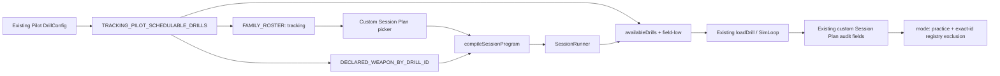

# WP-64 — Tracking Pilot Drill 可排程化（Session Plan ad hoc research drills）

> Stage index：[../README.md](../README.md) · 上游 [WP-54](../../stage11/wp-54-tracking-pilot/README.md) / [WP-62](../wp-62-session-plan-per-item-weapon/README.md) · checklist：[task-checklist.md](task-checklist.md) · progress：[progress.md](progress.md)
>
> 本計畫依 `.claude/skills/engineering-planning/SKILL.md`、`references/design_standards.md` 與 `assets/tech_spec_template.md` 制定。**只建立執行計畫，不修改 production code。**

| | |
|---|---|
| **Problem** | Tracking Pilot 的九個 `DrillConfig` 只能由專用 manifest/runner 載入；Session Plan 的 custom picker、compiler 與 runtime registry 都看不到它們。研究者因此無法把其中一至兩個條件插入一般 session program 做接線、手感或設備測試。 |
| **Outcome** | 研究者明確挑選的 Pilot `DrillConfig` 成為「可排程的研究用 drill」：出現在 custom Session Plan、以 `tracking` family 編譯、固定使用自身 `tracking_pilot_hold` 武器、在 `field-low` 真實載入並沿用一般 Session Plan 的休息、重複與匯出稽核。 |
| **Non-goal** | 不把整套 Tracking Pilot manifest 移植到 Session Plan；不提供 counterbalance、alternate seed、pilot retry/abort、live eligibility 或正式研究證據語意。 |
| **Primary user** | 研究者／測試操作員；受試者只看見既有 drill/runtime 畫面。 |
| **Estimate** | 4.5–6 dev-days（T0～T3 + T-exit）。 |
| **Risk** | Med：程式改動集中在低頻 registry/UI orchestration，但若沒有把「ad hoc Session Plan」與「正式 Pilot manifest」分清楚，會造成研究資料誤用。 |
| **IDs** | ✅ **`WP-64` / `GD-40` 已於 T0 重查確認可用（2026-09-10）**。WP-63/GD-39 已由 micro-flick v8 WP 佔用（已入 `exec-plan/README.md` §2 索引）；stage14 §3 的三個候選為未採納草稿，依 GD-15 不構成佔用。證據見 [progress.md](progress.md) T0 §1。 |
| **Status** | 🟡 **T0 ✅ / T1 ✅（2026-09-10），T2 可開工**。四個 OQ 全數以 README 預設關閉；選中集合 = `tracking_core_pr_pilot_v1_2deg_5dps`（seed 54012）+ `tracking_reversal_pilot_v1_high`（seed 54101）。T1 因 roster coherence 閘把 `main.ts` runtime entry + Controls surface filter 由 T2 提前落地（D-64-T1-1，見 [progress.md](progress.md) T1 §2）。 |

### 落點說明

本主題屬 Session Plan／研究工具層，與 stage13 原始輸入取樣主題不符；依使用者指示放在 `active/stage13/`。比照 WP-62 明帳記錄，不改寫 stage13 的主敘事或 WP-60/61 相依圖。

---

## 0. Repository-grounded discovery

### 0.1 現況資料流

1. [`SCHEDULABLE_DRILL_IDS`](../../../../../src/session/drillFamily.ts) 由 `FAMILY_ROSTER` 產生，是 custom Session Plan picker 與 compiler 的排程 allowlist。
2. [`createSessionPlanSetup()`](../../../../../src/ui/SessionPlanSetup.ts) 自動按 `FAMILY_BY_DRILL_ID` 分組；只要 roster 正確，picker 不需要第二份 drill id 清單。
3. [`compileSessionProgram()`](../../../../../src/session/sessionProgram.ts) 以同一張 family map 驗證 drill，並由 WP-62 的 `DECLARED_WEAPON_BY_DRILL_ID` 阻止覆蓋 drill 自宣告武器。
4. [`SessionRunner`](../../../../../src/session/SessionRunner.ts) 最終呼叫 `main.ts` 的 `loadDrillById()`；該函式只搜尋 `availableDrills`。因此「可編譯」與「可載入」目前是兩個需對表的 registry。
5. Tracking Pilot 走另一條 [`loadDrillConfigDirect()`](../../../../../src/main.ts) 路徑，固定 `field-low`，並由 [`TrackingPilotRunner`](../../../../../src/session/TrackingPilotRunner.ts) 處理 manifest、primary/alternate seed、rest、retry/abort 與 eligibility。
6. WP-54 九個 config 全部是 `mode: 'practice'` 且宣告 `weaponId: 'tracking_pilot_hold'`；[`trackingPilotHistoryExclusion.test.ts`](../../../../../src/pilot/trackingPilotHistoryExclusion.test.ts) 已釘死它們不進正式 history registry。

### 0.2 Planning-time blast radius

CodeGraph 於 2026-09-10 顯示：

- `SCHEDULABLE_DRILL_IDS` 被 `SessionPlanSetup.ts` 與 session tests 消費；`FAMILY_BY_DRILL_ID` 另被 `metadata.ts`、compiler 與 UI 消費。
- `availableDrills` 同時服務 `loadDrillById()` 與 researcher Controls 的 drill 下拉；直接加 entry 會意外擴大顯示面。
- `TrackingPilotManifest`／`TrackingPilotRunner`／`trackingPilotSession` 是獨立高階流程；本 WP 不需要修改其任何 symbol。
- WP-62 尚在執行且已完成 T1～T3，正在修改同一批 `drillFamily.ts`／`sessionProgram.ts`／`main.ts` 熱區。**WP-64 T1 不得與 WP-62 未合併 task 平行開工。**

### 0.3 核心語意

本 WP 採用的正規術語為「**可排程的研究用 drill**」（research-schedulable drill）：

- 「可排程」只代表可被 custom Session Plan 編譯與載入。
- 「研究用」由原 config 的 `mode: 'practice'` 與 history exact-id registry 維持；不等於 Assessment。
- Session Plan run 是 **ad hoc 刺激測試**，不是 `tracking-pilot-v2` manifest 的一部分。
- 相同 item 的 reps 重播同一個 primary seed，屬 repeated exposure，不是獨立樣本。

---

## 1. 需求壓縮（Requirements）

### 1.1 Functional Requirements

| ID | Requirement | 驗收摘要 | Task |
|---|---|---|---|
| **FR-64.1** | 系統**必須**只讓 T0 明確核准的 1–2 個 Tracking Pilot `DrillConfig` 出現在 custom Session Plan 的 `tracking` 群組 | picker 精確包含核准集合；其餘 Pilot block 全部缺席 | T1/T2 |
| **FR-64.2** | 系統**必須**以原 config 的 drill id、primary seed、trajectory、hitbox、timing、`protocolGuard` 與 `weaponId` 執行所選 drill | registry entry 與來源 config 對表；禁止 clone 後改刺激 | T1/T2 |
| **FR-64.3** | 系統**必須**讓所選 drill 沿用 custom program 的 reps、同 family drill rest、跨 family rest 與逐步推進語意 | compiler/runner tests 覆蓋同 family 與跨 family boundary | T1/T2 |
| **FR-64.4** | 系統**必須**把所選 drill 的 `tracking_pilot_hold` 視為固定研究因子；不同武器 override 必須在編譯期失敗，相同值可通過 | `SessionProgramCompileError.field === 'weaponId'` 且定位 item | T1 |
| **FR-64.5** | 系統**必須**固定在 `field-low` 載入所選 drill，且未知／未註冊 drill 必須在改動 active run 前 fail fast | 真實 load/clearance E2E 完成；registry coherence test 全綠 | T2/T3 |
| **FR-64.6** | 系統**必須**沿用既有 custom Session Plan 匯出稽核：`sessionPlanMode/items/rest/familyOrder/itemIndex/repIndex` 可回溯本次 run | writer/parser/export tests 由 payload 回指同一 program item | T2/T3 |
| **FR-64.7** | 系統**必須**保留正式 Tracking Pilot 入口與 manifest 語意；Session Plan 不產生 counterbalance、alternate seed、pilot role、retry/abort 或 live eligibility 結論 | 專用 pilot tests expected 不改；ad hoc export 不冒充 manifest | T2/T3 |
| **FR-64.8** | 系統**必須**讓所選 drill 保持 `mode: 'practice'` 並排除於正式 history/trend/Assessment | 全部選中 id 的 history projection 仍為 `unregistered-drill`，無 `meta.assessment` | T1/T3 |
| **FR-64.9** | 系統**必須**避免 runtime、family、weapon 三份登錄靜默漂移 | 單一 curated config source + 正負向 coherence tests | T1/T2 |

### 1.2 Non-functional Requirements

| ID | Requirement | 量化判準 | Task |
|---|---|---|---|
| **NFR-64.1 決定性** | 排程化不得改變刺激或 sim | 所選 config 的 seed/trajectory/hitbox/protocol/weapon deep-equal；既有跨 60/144/240 Hz 與抖動 pump 測試全綠 | T1/T3 |
| **NFR-64.2 Registry 精確性** | allowlist 不得擴散到整套 Pilot | `selected = 1..2`、`schedulablePilotIds === selectedIds`、`allPilotIds - selectedIds` 全不在 family map | T1 |
| **NFR-64.3 效能** | 不得增加 per-tick、per-frame 工作 | 所有新 mapping 只在 module/bootstrap/UI render 低頻路徑執行；`src/sim`、`SharedState`、render loop 零 diff | T1/T2 |
| **NFR-64.4 相容性** | 既有 Session Plan 與正式 Pilot 行為不得改變 | focused + full Vitest exit 0；既有 `session-orchestrator.spec.ts` 與 `tracking-pilot-live.spec.ts` expected 不放寬 | T3 |
| **NFR-64.5 可稽核性** | 每個 ad hoc run 可辨識其來源與位置 | export 同時含原 drill/seed/weapon 事實與 custom plan item/rep 座標；無新增必填 schema | T2/T3 |
| **NFR-64.6 可存取性** | 新選項可沿用鍵盤選取與既有非色彩提示 | `SessionPlanSetup.test.ts` 鍵盤/label 斷言全綠；不新增 pointer-only control | T2 |

### 1.3 In scope

- 由 T0 選定 1–2 個既有 Tracking Pilot config；建議預設為一個 core cell與一個 reversal cell。
- 單一 curated registry，供 family、declared weapon、runtime load entry 推導。
- custom Session Plan picker、compiler、runner、`field-low` 載入與既有 metadata/export 的整合驗證。
- 若採「Session Plan-only」顯示政策，替 `availableDrills` 增加低頻 selection-surface 欄位並過濾 researcher Controls。
- 更新本 WP、必要的操作文件與全域決策帳本。

### 1.4 Out of scope

- practice、horizontal/vertical calibration 與全部 core/reversal block 一鍵匯入。
- `TrackingPilotManifest`、counterbalance、`sessionIndex`、alternate seed `+10000`、pilot retry/abort/rest/eligibility。
- 修改 Pilot config 值、drill id、trajectory generator、seed、hitbox、timing、protocol guard 或武器。
- 正式 Assessment、history/trend 註冊、常模、coach report、composite score。
- 新 metadata schema；既有 `sessionPlan*` + drill/meta facts 已足以區分 ad hoc run。
- sim、輸入、命中、彈道、render、場景資產或 Python 分析變更。

### 1.5 Constraints and assumptions

- 預設選擇（若 T0 前研究者未另指定）：`buildTrackingCorePrPilotV1Cell(2, 5)` 與 `trackingReversalPilotV1High`，分別覆蓋 steady pursuit 與 reactive correction；T0 將實際 id/seed 快照入帳。
- 核心 cell 必須透過 exported builder/constant 取得，不以陣列 index 或手寫 drill id 選取。
- ad hoc Session Plan 一律使用 config 內 primary seed；要測 alternate seed 必須另立需求，不能假借 rep。
- frozen Session Plan family representative 不變，仍是 `tracking_scene_v1`。
- 若選中 scored block，`requireFire`／`noMovement` 仍會記錄 protocol violation；Session Plan 不替代 WP-54 eligibility 判定。

### 1.6 Open Questions

✅ **四項全數於 T0 關閉（2026-09-10），全部採本表預設** ⇒ scope / estimate 不變。關閉紀錄見 [progress.md](progress.md) T0 §4–§5。

| ID | Question | Owner | Deadline | Impact / default | 決議 |
|---|---|---|---|---|---|
| **OQ-64.1** | 最終核准哪 1–2 個 config？ | 研究者／使用者 | T0 結束前 | 阻塞 T1。預設：`2deg × 5dps` core + `reversal high`。 | ✅ 採預設：`buildTrackingCorePrPilotV1Cell(2, 5)` + `trackingReversalPilotV1High` |
| **OQ-64.2** | 選中項目是否也顯示在 researcher Controls 的單 drill 下拉？ | 產品 owner／研究者 | T2 開工前 | 影響 `AvailableDrill` surface filter。預設：**只顯示於 Session Plan**，避免無意擴大入口。 | ✅ 採預設（Session Plan-only） |
| **OQ-64.3** | ad hoc run 是否需要 live 顯示 WP-54 eligibility？ | 指標 owner | T0 結束前 | 影響是否擴大 runner/export 邊界。預設：**不需要**；既有事件仍可離線分析，但 Session Plan 不宣告 eligible。 | ✅ 採預設（不做） |
| **OQ-64.4** | 是否需要 alternate seed 測試？ | 研究者 | T0 結束前 | 若需要，超出本 WP，另開 manifest-aware 設計。預設：只用 primary seed。 | ✅ 採預設（primary only） |

---

## 2. 系統架構與設計（Technical Design）

### 2.1 Boundary and ownership

| Layer | Owner / change |
|---|---|
| Pilot stimulus source | `src/drill/tracking_*_pilot_v1.ts` 是 config 真相；原值不改，只取 exported constant/builder 結果 |
| Research scheduling policy | 新增 `src/session/trackingPilotSchedulableDrills.ts`，唯一列出核准 config 與固定 scene/surface policy |
| Session family + fixed weapon | `src/session/drillFamily.ts` 從 curated registry 推導 `tracking` ids 與 declared weapon entries |
| Runtime load registry | `src/main.ts` 從同一 curated registry 建立 `AvailableDrill` entries，固定 `field-low` |
| Picker/compiler/runner | 沿用 `SessionPlanSetup` → `compileSessionProgram` → `SessionRunner`，只做必要顯示過濾與測試 |
| Export/history | 沿用 `sessionPlanAuditFields()`、`collectMeta()` 與既有 history exact-id gate；不新增 schema |

### 2.2 Data flow



`Curated` 只決定「哪些既有 config 可走這條路」，不加工 config。正式 Pilot 入口仍走 `buildTrackingPilotManifest()` → `resolveTrackingPilotBlockConfig()` → `TrackingPilotRunner`，兩條 orchestration 在 config 之後才共用既有 load/export 基礎設施。

### 2.3 Interface contracts

規劃契約；T0 讀碼後可調整檔名，但責任不得拆散：

```ts
import type { DrillConfig } from '../drill/DrillConfig.ts';
import type { SessionFamilyId } from './sessionSchedule.ts';

export interface ResearchSchedulableDrill {
  readonly config: DrillConfig;
  readonly family: SessionFamilyId;
  readonly sceneId: 'field-low';
  readonly selectionSurface: 'session-plan-only' | 'session-plan-and-controls';
}

export const TRACKING_PILOT_SCHEDULABLE_DRILLS:
  readonly ResearchSchedulableDrill[];
```

建構期 invariants：

- 長度必須為 1–2；每個 `drillId` 唯一，且存在於 WP-54 全 Pilot config 集合。
- `family === 'tracking'`、`sceneId === 'field-low'`、`mode === 'practice'`。
- `weaponId === 'tracking_pilot_hold'` 且是已知 `WeaponId`。
- registry 保留 config reference/建構結果；不得 spread 後改 seed、trajectory、hitbox、timing 或 guard。
- 任一 invariant 失敗於 module construction fail fast；不得讓 picker 可選後才在 activation 中失敗。

若 OQ-64.2 採預設，`AvailableDrill` 加法契約為：

```ts
interface AvailableDrill {
  // existing fields unchanged
  readonly showInResearcherControls?: boolean; // absent = true; selected Pilot entries = false
}
```

`loadDrillById()` 搜尋完整 registry；`createControls({ drills })` 只映射 `showInResearcherControls !== false` 的 entries。這讓 runtime loadability 與 UI exposure 明確分離，不建立第二套 id allowlist。

錯誤契約：

- 未排程 Pilot id：`compileSessionProgram()` 保持 `SessionProgramCompileError('drillId', ...)`。
- 不同武器 override：保持 `SessionProgramCompileError('weaponId', ...)` 並帶 `itemIndex`。
- runtime registry 漂移：測試在啟動前失敗；production 保留 `Unknown drill: <id>` loud failure。
- clearance 不符：保留 `loadDrill()` 原始錯誤並中止 session，不 fallback 到其他場景/config。

### 2.4 Session semantics and export contract

| Concern | Ad hoc Session Plan | Formal Tracking Pilot |
|---|---|---|
| Ordering | 操作員自訂 items/reps | manifest counterbalance |
| Seed | config primary seed；rep 完全相同 | session 0 primary／session 1 alternate |
| Rest | custom drill/family rest | manifest `restSeconds` |
| Completion owner | `SessionRunner` | `TrackingPilotRunner` |
| Retry/abort reason | 無 pilot-specific log | runner record |
| Eligibility | 不做 live 判定、不宣告 eligible | 每 block 正式判定 |
| Audit marker | `sessionPlanMode === 'custom'` + `sessionPlanItems` + item/rep index | `meta.session.sessionLabel` 對應 manifest cell |
| History | `mode:'practice'` + exact-id 未註冊 | 同樣排除 |

不新增 `adHocPilot: true` 欄位：既有 custom-plan audit block 已是充分、互斥且向後相容的識別。若未來第三條 runner 也需使用同一 config，才以新 WP 評估版本化 execution-context 欄位。

### 2.5 決定性契約與三迴圈邊界

- **sim/input/render 皆不改。** 新 registry 只影響 bootstrap、表單與 drill activation 前的選擇。
- config 的 motion 仍由 `(config, seed, age)` 純函式驅動；Session Plan 不重算或重設 seed。
- `SessionRunner.poll(nowMs)` 與既有 rest overlay 時鐘語意不變；不新增 `Date.now()` 或新時鐘讀取。
- 不新增 `SharedState` 欄位、ring、arena 或跨迴圈訊息。
- NFR-64.1 以 config identity/deep equality、既有 motion determinism 與跨 render FPS regression 作證，不以 wall-clock timestamp 作斷言。

### 2.6 硬約束衝擊（`CLAUDE.md §4` 逐條）

| 約束 | 是否觸及 | 說明／緩解 |
|---|---|---|
| 禁 `Date.now()`，量測用 `performance.now()` | ❌ 不觸及 | 不新增時鐘；沿用 `SessionRunner.poll()`。 |
| Three.js WebGPU import / async bootstrap | ❌ 不觸及 | 不改 renderer/import/bootstrap。 |
| cross-origin isolation | ❌ 不觸及 | eligibility gate 與 headers 零修改。 |
| 跨 render FPS 決定性 | ✅ 間接觸及 | 刺激入口改變但 sim 不改；T3 重跑四 pump 逐位一致證據。 |
| 移動目標只以 sim age 純函式演進 | ✅ 間接觸及 | 直接重用原 `DrillConfig`，不 clone 改 trajectory/seed。 |
| 三迴圈只經 `SharedState` | ❌ 不觸及 | registry/orchestration 位於迴圈外；`SharedState` 零 diff。 |
| input ring / recorder arena 固定佈局 | ❌ 不觸及 | 不改 input 或 recorder schema/layout。 |
| UI 純 TS + DOM overlay | ✅ 觸及 | 僅擴充既有 TS/DOM picker/Controls 過濾，不引入框架。 |
| Chrome/Edge 桌面版 | ✅ 沿用 | E2E 使用既有 Edge project；不擴瀏覽器矩陣。 |
| sim/recoil 禁 `Math.random()` | ❌ 不觸及 | 不新增 RNG。 |
| spawn 隨機化 seeded 且 seed 入 metadata | ✅ 間接觸及 | 沿用原 primary seed與既有 metadata；rep 不重新取樣。 |
| recoil 1/64s 子節奏 | ❌ 不觸及 | 不改 weapon/sim；固定 `tracking_pilot_hold`。 |
| FPSci 授權紅線 | ❌ 不觸及 | 不引入外部程式碼/config。 |
| GD-6 場景幾何不進 sim | ✅ 間接觸及 | `field-low` 只在 runtime registry/load validation 指定，sim 不讀場景。 |
| GD-9 場景資產白名單 | ❌ 不觸及 | 不新增/修改資產。 |
| 解析度/場景切換不改 sim | ✅ 間接觸及 | 只固定既有 `field-low`；不改 `SIM_HZ`、輸入或命中。 |
| hitbox 單一來源 | ✅ 間接觸及 | 完整重用 config 的 sphere hitbox；不新增視覺/命中閾值。 |
| ADS 僅 input/render/data | ❌ 不觸及 | `tracking_pilot_hold` 無 ADS；既有事件記錄不變。 |
| projectile config gate / 子彈不碰場景 | ❌ 不觸及 | 不改彈道或命中。 |
| tracer render-only / muzzle origin 分離 | ❌ 不觸及 | 不改 tracer。 |
| C-D1 research ↔ src 單向隔離 | ❌ 不觸及 | 不改 `research/`，不匯入 Python 產物。 |
| C-D2 algorithms 純函式 | ❌ 不觸及 | 不改 Python algorithms/notebooks。 |
| C-D3 未驗證指標不得進報告 | ✅ 觸及語意 | ad hoc run 不產生 eligibility/coach claim；文件與測試明文限制。 |
| C-D4 既有構念不得第二定義 | ✅ 觸及語意 | 不新增 tracking metric；沿用原 config與既有 derivation。 |
| C-D5 晉升指標雙實作對表 | ❌ 不觸及 | 不改任何 promoted metric/version。 |

---

## 3. 風險分析與 Failure Modes

| # | 等級 | 觸發條件 | 影響 | 處理策略 |
|---|---|---|---|---|
| **FM-64.1** | High validity | ad hoc Session Plan 匯出被當成正式 manifest evidence | counterbalance、seed family、eligibility 缺失卻進研究結論 | UI/文件標示 ad hoc；不寫 pilot eligibility；T3 斷言 audit shape 互斥 |
| **FM-64.2** | Med | 只加 family roster、漏加 runtime registry | picker/preview 可用，開始時 `Unknown drill` 中止 | 單一 curated source + runtime/family coherence test + real E2E |
| **FM-64.3** | Med | 只加 runtime entry、漏加 declared weapon | 操作員可用其他武器污染 `requireFire` 刺激 | 从相同 config 推導 weapon map；compiler 正負向測試 |
| **FM-64.4** | Med | 直接展開全部九個 Pilot configs | picker 被 calibration/practice/所有條件污染，超出研究者選擇 | registry 長度 1–2 + complement negative assertions |
| **FM-64.5** | Med | runtime entry 未 pin `field-low` | 繼承先前場景，clearance 可能拒載或刺激視覺改變 | descriptor 的 `sceneId: 'field-low'` literal type + 真實 load E2E |
| **FM-64.6** | Med | 加入 `availableDrills` 後自動出現在 Controls | 額外入口與操作語意無意擴張 | OQ-64.2；預設 surface filter 隱藏，測試完整/可見集合 |
| **FM-64.7** | High validity | 把 rep 當不同 seed／獨立樣本 | 重複暴露被錯誤池化 | metadata 既有警語 + docs；測試每 rep seed/config 相同 |
| **FM-64.8** | High validity | 為了 Session Plan 呼叫 `resolveTrackingPilotBlockConfig()` 或仿造 manifest | alternate seed/role 語意與 program 混雜 | 架構測試禁止新 Session Plan 模組 import manifest/runner；只接受 curated config |
| **FM-64.9** | Med | 選中 id 被註冊到 history 或改為 assessment | pilot/ad hoc 資料污染正式趨勢 | 擴充全 Pilot history exclusion test；`mode`/registry negative assertions |
| **FM-64.10** | Med delivery | WP-62 或 WP-63 同時修改 `main.ts`/session 熱區 | 合併衝突或契約基線過期 | T0 重查 worktree/active WP；WP-62 相關 task 未落地前不開 T1 |

### 3.1 Technical debt

`availableDrills` 同時承擔 runtime registry 與 Controls 顯示清單，是本次需要 surface flag 的根因。本 WP 不進行全面 registry 重構；當第二種以上 hidden/loadable audience 出現，或 `availableDrills` 再被第三個 selection surface 消費時，觸發另立 WP，拆成 canonical runtime registry + 各 UI projection。現在只加一個 backward-compatible optional 欄位，既有 entry 缺席即顯示。

效能風險為 Low：新增最多兩個 bootstrap descriptors 與一次 UI filter；沒有 per-tick、per-frame、draw-call、triangle 或 arena 成本。

---

## 4. Task 索引

| Task | Objective | Dependencies | Risk | 估時（d） | Commit |
|---|---|---|---|---|---|
| [T0](T0-entry-gate.md) ✅ | entry gate：重查編號/熱區、收斂選中 config 與四個 OQ、復現上游基線 | — | Low | 0.5–1 | `docs(wp-64): complete tracking pilot scheduling entry gate` |
| [T1](T1-curated-scheduling-contract.md) ✅ | 建立 curated registry，接 family/declared weapon/history invariants（**+ 提前落地 runtime entry / Controls surface**） | T0 ✅；WP-62 已全數提交（含 T-exit，`035a637`）⇒ **不阻塞** | Med | 1–1.5 | `feat(wp-64): register curated tracking pilot session drills` |
| [T2](T2-runtime-and-session-plan-wiring.md) | picker/preview DOM 與 a11y、`AvailableDrill` 測試 seam（OQ-64.5）、custom export contract（runtime entry 與 surface filter 已於 T1 落地） | T1 ✅ | Med | 1.5 | `feat(wp-64): wire pilot drills into session plans` |
| [T3](T3-e2e-and-regression.md) | 真瀏覽器走完選取→執行→匯出，並回歸正式 Pilot 與 history 隔離 | T2 | **High validity** | 1–1.5 | `test(wp-64): verify ad hoc tracking pilot session plans` |
| [T-exit](T-exit-gate.md) | 驗收 A-64.1～A-64.9、同步索引/決策/操作文件 | T1–T3 | Low | 0.5 | `docs(wp-64): close tracking pilot scheduling work package` |

```text
T0 → T1 → T2 → T3 → T-exit
```

每一 task 是可獨立回復的垂直切片，完成時更新 `progress.md` 與 `task-checklist.md`，並以表中 conventional commit 單獨提交。

## 5. 驗收條目（T-exit 對照）

| ID | Objective evidence |
|---|---|
| **A-64.1** | custom picker 在 `tracking` 群組只多出 T0 核准的 1–2 個 Pilot ids；其餘 Pilot ids 皆不存在 |
| **A-64.2** | 每個選中 entry 的 config 核心欄位與 WP-54 canonical source deep-equal，scene 固定 `field-low` |
| **A-64.3** | compiler 正確產生 reps/rest/family boundaries，未知 Pilot id 與武器覆蓋均 fail fast |
| **A-64.4** | 真實 Edge E2E 從 DOM picker 啟動至少一個選中 drill，完成後 SessionRunner 推進且下載一份 payload |
| **A-64.5** | payload 可由 `sessionPlanItems[itemIndex]` 回指 `meta.drillId`，rep index 合法，weapon/seed/scene 事實可稽核 |
| **A-64.6** | ad hoc path 不呼叫/仿造 manifest alternate seed、retry/abort、eligibility；正式 Tracking Pilot E2E 仍綠 |
| **A-64.7** | 所選 drill 仍是 practice、無 assessment metadata、history projection 為 `unregistered-drill` |
| **A-64.8** | typecheck ×2、build、focused/full Vitest 與既有 Session Plan/Tracking Pilot Playwright 全部 exit 0 |
| **A-64.9** | `src/sim`、`SharedState`、input、hit detection、trajectory/config values 與 research Python 零 diff；`graphify update .` 已於 code task 後執行 |

