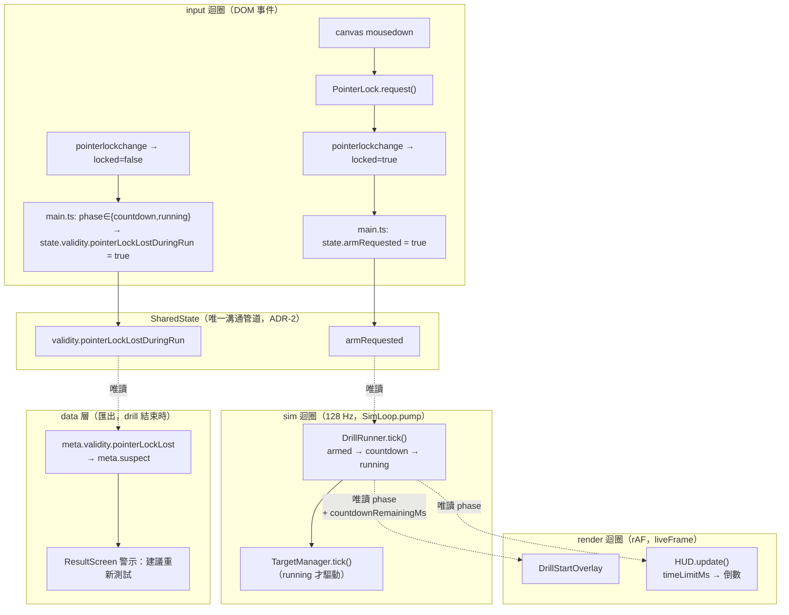

# WP-65 — Drill 開場待命閘、倒數呈現與 Pointer Lock 效度標記

> Stage index：[../README.md](../README.md) · checklist：[task-checklist.md](task-checklist.md) · progress：[progress.md](progress.md)
>
> 本計畫依 `.claude/skills/engineering-planning/SKILL.md`、`references/design_standards.md` 與 `assets/tech_spec_template.md` 制定。**只建立執行計畫，不修改 production code。**

| | |
|---|---|
| **Problem** | ① `drillRunner.start()` 在 app 開機／換 drill 當下就被呼叫，`countdown` 自**第一個 sim tick** 起算（[DrillRunner.ts:184](../../../../../src/drill/DrillRunner.ts#L184)），受試者還在看「點擊以鎖定滑鼠視角」提示時 3 秒早已數完、drill 已進 `running`；且倒數**完全沒有畫面呈現**。② HUD `Time` 卡恆為正計時，時限型 drill 看不到剩餘時間。③ drill 錄製中掉 Pointer Lock（ESC／alt-tab）時 sim 照跑、目標照 spawn、時間照算，而現有的 fullscreen suspect 機制在此情境**不會觸發**（見 §0.3）。 |
| **Outcome** | drill 載入後停在**待命**相位；受試者點左鍵取得 Pointer Lock 才起算 3 秒倒數，倒數可見；倒數歸零才 spawn 首目標並開始計時。時限型 drill 的 `Time` 卡改為倒數。錄製中掉鎖 → 本場資料帶具名效度旗標並在 Result 畫面告知建議重測（**不中斷 sim**）。 |
| **Non-goal** | 不改 `timing.countdownMs` 的值（維持各 drill 現行 3000 ms）；不改 `endCondition` 語意；不做暫停／續跑；不做「掉鎖即作廢」；不改 `targetCount` 型 drill 的 Time 顯示。 |
| **Primary user** | 受試者（待命／倒數／Time 卡／重測提示）；研究者與分析端（`meta.validity` 新旗標）。 |
| **Estimate** | 6.5–9 dev-days（T0～T6 + T-exit）。 |
| **Risk** | **High**：T1 改 `DrillPhase` 狀態機（`createDrillRunner` 有 35 個 caller、17+ 測試與 golden fixture 覆蓋）；T6 的 live e2e 目前全數假設「載入即開始」。 |
| **IDs** | ✅ **`WP-65` / `GD-41` 已於 T0 重查確認可用（2026-09-11）**，不需順延；證據見 [progress.md §T0.1](progress.md)。規劃期寫入當下：`exec-plan/README.md §2` 最大 WP = **WP-63**、`active/stage13/` 實際最大 = **WP-64**（[wp-64](../wp-64-tracking-pilot-session-plan-drills/README.md) 已落 code，尚未入 §2 索引）、`DECISIONS.md` 最大 GD = **GD-39**、WP-64 已於其 T0 佔用 **GD-40**（尚未落帳）。依 [GD-35](../../../DECISIONS.md) ② 紀律，二號**必須於 T0 重查**；被平行 session 取用則依 [GD-15](../../../DECISIONS.md)「先採納先得」順延，不爭號。 |
| **Status** | ✅ **T-exit 完成（2026-09-11）**。使用者確認需要 `meta` 版本標記；依 scope 它將由後續獨立 WP 處理，未夾帶於本 WP。證據見 [progress.md §T-exit](progress.md#t-exit-驗收2026-09-11)。 |

### 落點說明

本主題屬 drill 生命週期／受試者體驗層，**不屬 stage13 原本的「原始輸入取樣與抬滑鼠判準驗證」主題**；依使用者 2026-09-11 指示落於 `active/stage13/`，承 [WP-62](../wp-62-session-plan-per-item-weapon/README.md)／[WP-63](../wp-63-micro-flick-v8-measurement-foundation/README.md)／[WP-64](../wp-64-tracking-pilot-session-plan-drills/README.md) 同一先例。比照明帳記錄，**不改寫** stage13 的 §1 主敘事、§4 相依圖或 WP-60/61 的相依關係；本 WP 與 WP-60～64 全數無相依、可完全並行。

---

## 0. Repository-grounded discovery（2026-09-11 codegraph + 讀碼）

### 0.1 現況：倒數其實已經存在，錯的是起算時機

1. [`DrillPhase`](../../../../../src/drill/DrillRunner.ts#L27) 已是 `'idle' | 'countdown' | 'running' | 'ended'`，且 roster 內**每個** drill 的 `timing.countdownMs` 都是 `3000`。
2. `start(cfg)` 直接 `phase = 'countdown'`（[DrillRunner.ts:173-177](../../../../../src/drill/DrillRunner.ts#L173-L177)）；`tick()` 在第一個 countdown tick 以 sim clock 起算（[DrillRunner.ts:183-192](../../../../../src/drill/DrillRunner.ts#L183-L192)）。
3. [`main.ts:1036`](../../../../../src/main.ts#L1036) 在模組求值階段就 `drillRunner.start(activeDrillConfig)`；`renderLoop.start()` 之後 `liveFrame` 每幀無條件 `simLoop.pump(now)`。⇒ **倒數與 Pointer Lock 完全無關，開機即走完**。
4. 換 drill／換武器／換場景／restart 四條路徑（`restartActiveDrill` / `loadWeaponById` / `loadSceneById` / `activateDrill`）末端都是同一個 `drillRunner.start(activeDrillConfig)`，行為一致。
5. **HUD 沒有任何倒數呈現**：[`createHUD()`](../../../../../src/ui/HUD.ts#L35) 只有 Score / Time / Hit rate / Velocity 四張卡。

### 0.2 現況：Time 卡與 endCondition 的型別分歧

- `hudElapsedMs` 由 [`liveFrame`](../../../../../src/main.ts#L1774-L1780) 以 **rAF 時鐘**在 `phase === 'running'` 起算，經 `createHUDStats()` → [`formatElapsed()`](../../../../../src/ui/HUD.ts#L189) 呈現。純顯示值，**不進 sim、不進匯出**。
- `endCondition` 兩型並存（[DrillConfig.ts:280](../../../../../src/drill/DrillConfig.ts#L280)）：
  - `timeLimit`：`spider_shot_v2`／`v3`（60 000 ms）、`tracking_core_pr_pilot_v1` 與 `tracking_reversal_pilot_v1` 家族。**有總時長可倒數。**
  - `targetCount`：`counterstrafe_*`／`detection_popin_v1`／`tracking_v1`／`peek_click_transfer_*`／`micro_flick_*`。**無總時長**；唯一時間上限是 `timing.timeLimitMs = 120 000` 的**後援閘**（[DrillRunner.ts:237-242](../../../../../src/drill/DrillRunner.ts#L237-L242)），實際多在 20–40 秒結束 ⇒ 顯示「還剩 118 秒」會誤導。
    > **T0 更正（2026-09-11）**：「唯一時間上限是 `timing.timeLimitMs = 120 000`」對 roster 多數成立，但 **app 開機載入的預設 drill [`drills/counterstrafe_ad_v1.json`](../../../../../drills/counterstrafe_ad_v1.json) 沒有 `timeLimitMs`** ⇒ `backstopMs === undefined`、`reachedBackstop` 恆 false，閒置的 app 會永遠停在 `running`。實測與影響見 [progress.md §T0.4 / Surprise 3](progress.md)。此為既有條件，不在本 WP 範圍。

### 0.3 現況：掉鎖 / 退出全螢幕的效度機制有兩個缺口

[`main.ts:576-584`](../../../../../src/main.ts#L576-L584) 監聽 `fullscreenchange`，於 `phase === 'countdown' || 'running'` 時呼叫 [`experimentSession.handleFullscreenChange()`](../../../../../src/display/experimentSession.ts#L61) 翻 `suspect`（KI-007 / WP-20 T2）。兩個缺口：

| # | 缺口 | 證據 |
|---|---|---|
| G1 | 只在「實驗 session」內武裝 | `handleFullscreenChange` 首行 `if (!active \|\| ...) return`；`active` 僅由 `enter(report)` 設 true，而 `enter()` 只在 eligibility gate 通過後呼叫 ⇒ 選手測試／研究員模式的一般 drill **完全不會被標記** |
| G2 | ESC 通常不觸發 `fullscreenchange` | Chromium 在「同時 pointer-locked + fullscreen」時，單次 ESC 只解除 Pointer Lock，全螢幕保留（需長按才退）⇒ 使用者描述的「按到 ESC」在實機上多半只掉 lock，現有鏈路整條不動 |

⇒ 正確判準必須掛在 **Pointer Lock 遺失**，且不得以 `experimentSession.active` 為前提。

### 0.4 現況：可直接沿用的既有結構

| 既有物 | 位置 | 本 WP 如何沿用 |
|---|---|---|
| `SharedState.validity` | [SharedState.ts:309](../../../../../src/state/SharedState.ts#L309) | 「純觀測旗標，不 clamp、不改 sim 演進」，`resetState()` 已負責清零 ⇒ 新旗標的天然歸屬 |
| `meta.validity` | [metadata.ts:723-731](../../../../../src/data/metadata.ts#L723-L731) | 已是 `{ corridorExceeded, perfFloor, recorderOverflow, bufferOverflow }` 四旗標物件 ⇒ additive 第五欄 |
| `pointer_lock` event | [DataRecorder.ts:55](../../../../../src/data/DataRecorder.ts#L55) + [exportPayloadSchema.ts:1085](../../../../../src/data/exportPayloadSchema.ts#L1085) | WP-60 T1 已有完整 schema 與 parser，**但只在 `?rawMouse=1` 時記錄** ⇒ 本 WP 的旗標不依賴它 |
| e2e 取鎖模擬 | [raw-mouse-sampling.spec.ts:60-73](../../../../../tests/e2e/raw-mouse-sampling.spec.ts#L60-L73) | `Object.defineProperty(document, 'pointerLockElement', …)` + `dispatchEvent('pointerlockchange')`，走生產 `PointerLock` 模組 ⇒ **不需要新增 dev-only auto-arm 縫**（見 FM-4） |
| `resetRunPresentation()` | [main.ts:1309-1320](../../../../../src/main.ts#L1309-L1320) | 已含 `recorder.reset()` + `hudRunStartMs = null` ⇒ 待命期 arena 累積的緩解掛點（見 FM-2） |

### 0.5 Planning-time blast radius（codegraph，2026-09-11）

- `createDrillRunner` — **35 個 caller**（`src/main.ts`、`src/testharness/fpsTestHarness.ts`），覆蓋測試含 `tests/regression/longrangeTrackingDeterminismFixture.ts`、`src/loop/__tests__/wp22-determinism.test.ts`、`tests/regression/movingTargetDeterminismFixture.ts`、`tests/regression/br-tracking-invariants.test.ts` 等 16+ 檔。
- `DrillPhase` 為 `HUDStats.phase` 的型別（[HUD.ts:7](../../../../../src/ui/HUD.ts#L7)）；`SessionRunnerPhase` 是**另一個**無關的 union（[SessionRunner.ts:43](../../../../../src/session/SessionRunner.ts#L43)），不得混淆。
- `SharedState` — 87 個 caller、17+ 覆蓋測試；`createSharedState` — 83 個 caller、37+ 覆蓋測試。新增欄位屬 additive。
- T6 更正了規劃期的分類軸：是否會受影響取決於 spec **是否驅動 live drill runtime**，不是是否使用 `window.__fps`。需要 arm 的五個 workflow 為 `raw-mouse-sampling`、`tracking-pilot-live`、`session-orchestrator`、`micro-flick-live`、`spider-shot-wide`；`overlay-layering` 與 `stage10-accessibility` 則擴充新 UI coverage。其餘原列的 live spec 不驅動 drill 或驗負向路徑，保持零修改；詳見 [progress.md §T6.3/§T6.7](progress.md)。

---

## 1. 需求壓縮 (Requirements)

### 1.1 Functional Requirements

| FR | 內容 | Task |
|---|---|---|
| **FR-65.1** | 系統**必須**在 `DrillPhase` 新增一個「待命」相位，位於 `idle` 與 `countdown` 之間；處於該相位時 `DrillRunner.tick()` 不得推進 `TargetManager`、不得 spawn 目標、不得蓋 `tVisible`、不得判定 `endCondition`。 | T1 |
| **FR-65.2** | 系統**必須**只在 `SharedState` 的具名待命解除旗標為 true 時，才由待命相位轉入 `countdown`；該旗標由 input 層寫入、sim 層唯讀（ADR-2）。 | T1 |
| **FR-65.3** | 系統**必須**讓待命閘為 `createDrillRunner()` 的**選擇性**行為；省略該選項時 `start()` 逐位維持現行「直接進 `countdown`」語意。 | T1 |
| **FR-65.4** | 應用程式**必須**在每次 `drillRunner.start()`（含 restart／換武器／換場景／換 drill／Session Plan 自動接的每個 block）都進入待命相位，並要求一次新的取鎖動作才解除。 | T2 |
| **FR-65.5** | 解除待命的手勢**必須不得**被 `InputSampler` 記為一次開火事件。 | T2 |
| **FR-65.6** | 系統**必須**在待命相位顯示「點擊左鍵開始」提示，並在 `countdown` 相位顯示剩餘整數秒（3 → 2 → 1）；兩者皆為 DOM overlay，於 `running` 相位移除。 | T3 |
| **FR-65.7** | `endCondition.type === 'timeLimit'` 的 drill，HUD `Time` 卡**必須**顯示 `endCondition.value − 已經過時間`（下限 0）；`targetCount` 型**必須**維持現行正計時。 | T4 |
| **FR-65.8** | 待命與 `countdown` 相位的 `Time` 卡**必須**顯示該 drill 的起始值（倒數型 = 總時長，正計時型 = `00:00.0`），不得閃動或提早歸零。 | T4 |
| **FR-65.9** | 系統**必須**在 `phase === 'countdown' \|\| 'running'` 期間偵測到 Pointer Lock 由 true 轉 false 時，於 `SharedState.validity` 翻起具名旗標；該偵測**不得**以 `experimentSession.active` 為前提，且**不得**中斷 sim、不得改變 drill 結束條件。 | T5 |
| **FR-65.10** | 該旗標**必須**進入匯出 `meta.validity`，並**必須**併入 `meta.suspect`。 | T5 |
| **FR-65.11** | Result 畫面**必須**在該旗標為 true 時顯示具名警示文字，內容包含「本場資料可能失效」與「建議重新測試」。 | T5 |
| **FR-65.12** | 待命／`ended`／`idle` 相位的掉鎖（含系統於 `start()` 主動釋放的鎖）**不得**翻起 FR-65.9 的旗標。 | T5 |

### 1.2 Non-functional Requirements

| NFR | 量化指標 | 驗證 |
|---|---|---|
| **NFR-65.1** | 省略待命選項時，`DrillRunner` 對同一輸入序列在 ≥ 4 種 render FPS 下的 sim 狀態**逐位一致**，且與本 WP 前的既有 golden fixture **逐位相同**（零 fixture 修改）。 | T1 DoD |
| **NFR-65.2** | `fpsTestHarness` 與 `tests/regression/` 下全部 determinism fixture **零修改**通過。 | T1 DoD |
| **NFR-65.3** | 待命相位每 sim tick 的新增工作量 = 1 次 boolean 讀取；不新增任何堆配置（GC 紀律 §4）。 | T1 DoD（`resetState` diff 檢視 + 無 `push`／無物件字面值斷言） |
| **NFR-65.4** | 待命期間 `DataRecorder` arena 佔用在解除待命當下歸零，`meta.recorderOverflow` 於 ≥ 10 分鐘待命後仍為 `false`。 | T2 DoD |
| **NFR-65.5** | 未帶新旗標的舊匯出 JSON 仍可被 `parseExportPayload()` 與 Python `load_export()` 讀取（向後相容）；新旗標存在時 Python 端零修改可讀（C-D1 additive）。 | T5 DoD |
| **NFR-65.6** | 全量 Playwright `--workers=1` 通過數 ≥ 本 WP 前基線，`0 failed`。 | T6 DoD |
| **NFR-65.7** | 倒數 overlay 只在 rAF 讀取，**不進** sim tick；不新增每幀堆配置（文字節點重用）。 | T3 DoD |

### 1.3 Constraints

- **UI = 純 TS + DOM overlay**（D1），階段 A 不引入 React/Vue/Lit。
- 階段 A 鎖 Chrome/Edge 桌面版；ESC 與 Pointer Lock / fullscreen 的交互行為以 Chromium 為準（§0.3 G2）。
- `research/` ↔ `src/` 單向隔離（C-D1）：Python 端只讀匯出 JSON，不得 import TS。
- 既有構念不得有第二定義（C-D4）：本 WP 不新增任何與 `t_acquire`／`t_detect`／on-target 相關的時間定義。

### 1.4 Open Questions

| OQ | 問題 | README 預設（未另行推翻即照此執行） | Owner | Deadline | Impact |
|---|---|---|---|---|---|
| **OQ-65.1** | 新旗標是否併入 `meta.suspect`？`corridorExceeded` 目前**不**併入（[metadata.ts:427](../../../../../src/data/metadata.ts#L427)）。 | **併入**。理由：掉鎖期間受試者的滑鼠位移完全沒進輸入鏈（`onMouseMove` 在 `!locked` 時直接 return），這是條件失效而非行為觀測，性質同 `frameFloorSuspect`。 | 使用者 | T5 開工前 | T5 |
| **OQ-65.2** | 待命提示與倒數數字的視覺形式（畫面中央大字 vs HUD 第五張卡）。 | **畫面中央大字**，`z-index` 低於 Result dialog、高於 HUD；`pointer-events:none` 讓點擊穿透至 canvas。 | 使用者 | T3 開工前 | T3 |
| **OQ-65.3** | `restartActiveDrill()` 之後是否也要求重新取鎖？ | **要求**。Result 顯示時 [main.ts:1810](../../../../../src/main.ts#L1810) 已 `exitPointerLock()`，重測本就需重新點擊 ⇒ 與 FR-65.4 天然一致，不開例外。 | 規劃內定 | T2 | T2 |
| **OQ-65.4** | 掉鎖後是否也要在 HUD 即時提示（而非只在 Result）？ | **不做**。掉鎖時滑鼠游標已回到桌面、受試者看得見自己掉出遊戲；即時提示會增加一個每幀分支卻不增資訊。留待實機回饋。 | 使用者 | T-exit | 無（非阻塞） |

---

## 2. 系統架構與設計 (Technical Design)

### 2.1 System boundary

**In scope**

| 模組 | 改動性質 |
|---|---|
| `src/drill/DrillRunner.ts` | `DrillPhase` 增一相位、`createDrillRunner` 增選擇性 option、`tick()` 增待命分支、增 `countdownRemainingMs` 唯讀 getter |
| `src/state/SharedState.ts` | `armRequested: boolean` 新欄位 + `validity.pointerLockLostDuringRun` 新旗標（含 `createSharedState`／`resetState`） |
| `src/ui/DrillStartOverlay.ts` | **新檔**：待命提示 + 倒數數字 DOM overlay |
| `src/ui/HUD.ts` | `HUDStats` 增 optional `timeLimitMs`；`fillHUDSummary` 分支 |
| `src/data/metadata.ts` | `requireValidity` 增第五旗標（additive，optional-in/required-out 策略見 §2.3） |
| `src/data/exportPayloadSchema.ts` | `parseValidity` 對應 additive |
| `src/ui/ResultScreen.ts` | 增 `setValidityWarning(text: string \| null)` |
| `src/main.ts` | 取鎖 → 解除待命的接線、arm 手勢的開火閘、`start()` 前釋鎖、掉鎖旗標寫入、Time 卡 `timeLimitMs` 供給、overlay 建構與每幀更新、Result 警示接線 |
| `tests/e2e/` | 新增共用取鎖 helper；9 個 live spec 補 arm 步驟 |

**Out of scope**（刻意排除，防範圍蔓延）

- 不改 `timing.countdownMs`／`peekTimeoutMs`／`presentationMs`／`timeLimitMs` 的任何**數值**或語意。
- 不改 `endCondition` 判定（`reachedCount` / `reachedTime` / `reachedBackstop` 三條式逐位不變）。
- 不做暫停／續跑／掉鎖即作廢；掉鎖後 sim 一路跑到自然結束（使用者 2026-09-11 拍板）。
- 不改 `experimentSession` 既有 fullscreen suspect 語意（KI-007 保留原樣；本 WP 的旗標與它**並存**，不合併、不取代）。
- 不改 `targetCount` 型 drill 的 Time 顯示。
- 不動 `window.__fps` 合成 harness 的行為（19 個走 `__fps` 的 e2e 因此零修改）。
- 不引入 dev-only auto-arm 旁路（e2e 走既有取鎖模擬，見 FM-4）。
- 不改 `research/` 任何 Python 程式（只驗相容）。

### 2.2 Data flow



**一句話**：解除待命的訊號由 input 層產生、寫入 `SharedState`、由 sim 唯讀推進相位；相位與剩餘倒數由 render 唯讀呈現；效度旗標由 input 層寫入 `SharedState`、由 data 層於匯出時唯讀。**沒有任何一個方向是 render 或 data 寫回 sim。**

### 2.3 Interface contracts

```ts
// ── src/drill/DrillRunner.ts ──────────────────────────────────────────────

/**
 * WP-65：`'armed'` 插在 `idle` 與 `countdown` 之間。
 * 語意：config 已載入、狀態已 reset，但尚未取得受試者的開始手勢 ⇒ 不推進任何目標、不計時。
 */
export type DrillPhase = 'idle' | 'armed' | 'countdown' | 'running' | 'ended';

export interface DrillRunnerOptions {
  /**
   * true ⇒ `start()` 進入 `'armed'`，需 `SharedState.armRequested === true` 才轉 `countdown`。
   * 省略／false ⇒ `start()` 逐位維持現行語意（直接進 `countdown`）。
   * 僅 `src/main.ts` 傳 true；全部測試與 `fpsTestHarness` 省略（FR-65.3 / NFR-65.2）。
   */
  readonly requireArm?: boolean;
}

export interface DrillRunner {
  start(config: DrillConfig): void;
  tick(state: SharedState, nowMs: number): void;
  restart(): void;
  readonly phase: DrillPhase;
  /**
   * WP-65：`countdown` 相位的剩餘毫秒（sim clock 域，[0, timing.countdownMs]）。
   * 其他相位一律回 0。render 層唯讀呈現用（比照既有 `phase` 的 sim→render 唯讀先例）。
   * **不**寫入匯出、**不**參與任何指標推導。
   */
  readonly countdownRemainingMs: number;
}

export function createDrillRunner(
  state: SharedState,
  targetManager: TargetManager,
  options?: DrillRunnerOptions,
): DrillRunner;

// ── src/state/SharedState.ts ──────────────────────────────────────────────

export interface SharedState {
  // …既有欄位不變…

  /**
   * WP-65（FR-65.2）：待命解除請求。**input 層寫、sim 層唯讀**（ADR-2）。
   * `resetState()` 置 false ⇒ 每次 `start()` 都重新要求一次開始手勢。
   * `DrillRunnerOptions.requireArm` 未啟用時此欄不被讀取（對既有 fixture 無影響）。
   */
  armRequested: boolean;

  validity: {
    playerCorridorExceeded: boolean;
    /**
     * WP-65（FR-65.9）：錄製中（`countdown`/`running`）曾失去 Pointer Lock。
     * 純觀測旗標——不 clamp、不中斷 sim、不改 drill 結束條件。
     * 與 `experimentSession.suspect`（fullscreen 退出，KI-007）**並存不合併**：
     * 前者管「鍵鼠輸入是否真的進得來」，後者管「顯示條件是否成立」。
     */
    pointerLockLostDuringRun: boolean;
  };
}

// ── src/ui/HUD.ts ─────────────────────────────────────────────────────────

export interface HUDStats {
  // …既有欄位不變…
  /**
   * WP-65（FR-65.7）：設定時 Time 卡改顯示 `max(0, timeLimitMs − elapsedMs)`。
   * additive optional ⇒ 省略時 `formatElapsed(elapsedMs)` 逐位不變（replay 的
   * `createHUDSummary()` 路徑因此零修改）。
   */
  readonly timeLimitMs?: number;
}

// ── src/ui/DrillStartOverlay.ts（新檔）────────────────────────────────────

export interface DrillStartOverlayHandle {
  /**
   * 每 rAF 呼叫一次。`armed` → 顯示開始提示；`countdown` → 顯示 `ceil(remainingMs/1000)`；
   * 其餘相位 → 隱藏。文字節點重用，無每幀配置（NFR-65.7）。
   */
  update(phase: DrillPhase, countdownRemainingMs: number): void;
  dispose(): void;
}

export function createDrillStartOverlay(options?: { parent?: HTMLElement }): DrillStartOverlayHandle;

// ── src/ui/ResultScreen.ts ────────────────────────────────────────────────

export interface ResultScreenHandle {
  // …既有成員不變…
  /**
   * WP-65（FR-65.11）：null 清除警示；字串顯示於結果數值之上的警示條。
   * 純呈現——本畫面不擁有 payload、不決定 suspect。
   */
  setValidityWarning(text: string | null): void;
}

// ── src/data/metadata.ts ──────────────────────────────────────────────────

/**
 * WP-65 additive：`pointerLockLost` **輸入可省略**（舊 payload 向後相容，預設 false），
 * **輸出必填**（新匯出一律帶欄）。與既有四個旗標的 required 語意不同，理由見 §2.5 D-65-3。
 */
function requireValidity(value: unknown): NonNullable<Meta['validity']>;
```

### 2.4 決定性契約與三迴圈邊界（ADR-2 / GD-5，必填章節）

| 項目 | 說明 |
|---|---|
| **決定性** | 待命閘**不引入任何新的時間或隨機來源**。`requireArm` 省略時 `start()`／`tick()` 的控制流與本 WP 前完全相同 ⇒ 既有 golden fixture 與 determinism 測試**零修改**必須全綠（NFR-65.1/65.2）。`requireArm` 啟用時，`armRequested` 翻 true 之後的第一個 tick 才起算 `countdownStartMs`，其後的相位推進與現行**同一段程式碼**、同一時鐘來源（`nowMs` = sim clock）。釘死斷言：`src/loop/__tests__/wp65-arm-determinism.test.ts` — 同一輸入序列 + 同一 tick index 解除待命，跨 4 種 render FPS 的 `TickRecord[]` 逐位一致。 |
| **三迴圈邊界 (ADR-2)** | `armRequested`：**input 寫 → sim 唯讀**，走 `SharedState`。`validity.pointerLockLostDuringRun`：**input 寫 → data 唯讀**，走 `SharedState`（方向同既有 `validity.playerCorridorExceeded`，差別只在寫入者是 input 層而非 sim 的 `afterTick`）。`phase` 與 `countdownRemainingMs`：**sim 擁有 → render 唯讀**，沿用 `liveFrame` 既有的 `drillRunner.phase` 讀取先例（[main.ts:1773](../../../../../src/main.ts#L1773)）——**這是既有偏離的延續，不是新開的洞**，須在 `progress.md` 明帳記錄。render 與 data **不寫入**任何 sim 狀態。 |
| **固定佈局** | 不新增任何緩衝。`armRequested` 與 `pointerLockLostDuringRun` 皆為既有物件上的 boolean 欄位，`resetState()` **原地**歸零、不 realloc（GC 紀律 §4）。overlay 的 DOM 節點於建構期一次配置、每幀只寫 `textContent` 與 `style.display`。 |
| **時鐘域** | 全程 `performance.now()` 族：相位推進用 sim clock `nowMs`（`SimLoop` 的 `simTimeMs`）；overlay 與 HUD 用 rAF `now`。**禁 `Date.now()`**。`countdownRemainingMs` 由 sim clock 導出，render 只讀不算。 |
| **seeded RNG** | 不觸及。本 WP 不引入任何隨機性，`sequence.seed` → `createRan1` 鏈路逐位不變。 |

### 2.5 關鍵設計決策

| # | 決策 | 理由 / 被推翻的替代方案 |
|---|---|---|
| **D-65-1** | 解除待命的訊號 = **取得 Pointer Lock**，且 `start()` 時若仍持鎖則先 `document.exitPointerLock()`。 | 統一兩種情境（未持鎖 / 連續 session 仍持鎖）為單一規則。**關鍵副效果**：取鎖那一下的 mousedown 本來就被 `createInputSampler(state, () => pointerLock.locked)` 的閘擋掉（[main.ts:989](../../../../../src/main.ts#L989)），故 FR-65.5 **不需要新增任何開火閘** ⇒ 這是全部候選中對輸入鏈改動最小者。被推翻的替代：「持鎖時另認一次 mousedown 為 arm」——需要在 `InputSampler` 的閘再疊一個條件，且那一下與真開火在時序上不可分。 |
| **D-65-2** | 待命閘是 `createDrillRunner()` 的 **opt-in option**，而非 `SharedState` 預設值翻轉。 | 35 個 caller 中只有 `main.ts` 需要新行為；opt-in 讓其餘 34 個（全部測試 + `fpsTestHarness`）**一個字都不用改**，且「舊行為逐位不變」由型別預設值保證而非靠測試發現。被推翻的替代：`armRequested` 預設 true——`resetAll()` 會在 `start()` 內把它重設，語意自相矛盾。 |
| **D-65-3** | `meta.validity.pointerLockLost` **輸入 optional、輸出 required**。 | 既有四旗標在 `requireValidity` 皆為 required；若第五欄也 required，所有既存 golden／fixture payload 會整份被拒（WP-61 踩過同型的坑：Python `load_export` 曾整份拒收未知 event）。optional-in 保向後相容，required-out 保新資料無缺欄。 |
| **D-65-4** | `experimentSession` 的 fullscreen suspect **保留原樣、不合併**。 | 兩者量測不同構念：fullscreen 管「顯示條件」、pointer lock 管「輸入是否進得來」。合併會讓 KI-007 刻意區分的 `recording` 判準失去意義，且 C-D4 禁止既有構念的第二定義。 |
| **D-65-5** | 解除待命當下呼叫 `recorder.reset()`。 | `simStep` 末端的 `recorder?.recordTickFromState()` **不看相位**（[SimLoop.ts:766](../../../../../src/loop/SimLoop.ts#L766)），待命期每 tick 仍吃一格 arena。容量 = `300 × (128+10) + 128 = 41 528` ⇒ 約 324 秒後 `recorderOverflow` 翻 true 並直接污染 `meta.suspect`。被推翻的替代：在 `simStep` 對相位加閘——會改變 `countdown` 期間的既有錄製行為，讓所有既有匯出逐位改變。 |

### 2.6 Failure modes

| FM | 觸發條件 | 影響範圍 | 處理策略 | 對應 Task |
|---|---|---|---|---|
| **FM-1** | `requireArm` 意外洩漏到 `fpsTestHarness` 或任一測試路徑 | 全部 determinism／golden fixture 永久停在 `armed`，17+ 測試檔同時紅且錯因不明顯（測試「卡住」而非「數值錯」） | T1 加一條**正向反證**：斷言 `createDrillRunner(state, tm)`（無第三參數）在 `start()` 後 `phase === 'countdown'`；另於 `fpsTestHarness` 加一條「本 harness 永不傳 `requireArm`」的結構斷言 | T1 |
| **FM-2** | 受試者停在待命畫面數分鐘（去倒水） | arena 被待命 tick 吃滿 → `recorderOverflow` → `meta.suspect` 恆 true，資料看似有效實則被標紅 | D-65-5：解除待命當下 `recorder.reset()`；T2 DoD 以 ≥ 10 分鐘待命的實測證明 `recorderOverflow === false` | T2 |
| **FM-3** | `start()` 內的主動 `exitPointerLock()` 被 FR-65.9 的偵測抓成「錄製中掉鎖」 | 每一場 drill 都被誤標效度旗標 ⇒ 旗標完全失去鑑別力（比沒有更糟） | FR-65.12：偵測只在 `phase === 'countdown' \|\| 'running'` 武裝；T5 以「連續三場乾淨 run 的 `pointerLockLost` 皆為 false」的實測釘死 | T5 |
| **FM-4** | Chromium headless 無法真正取得 Pointer Lock ⇒ 9 個 live e2e 永久停在 `armed` | Playwright 全量由綠轉紅，且會被誤讀為「功能壞了」 | 沿用 [raw-mouse-sampling.spec.ts:60-73](../../../../../tests/e2e/raw-mouse-sampling.spec.ts#L60-L73) 已驗證的取鎖模擬（改寫 `pointerLockElement` getter + 派發真實 `pointerlockchange`，走**生產** `PointerLock` 模組）。T6 第一步即為此模式的可行性驗證；**驗證失敗才**退回 dev-only `?autoArm=1` 縫，且該縫只跳過待命、不偽造倒數或任何量測值 | T6 |
| **FM-5** | 倒數改為取鎖後起算 ⇒ 既有 e2e 對「目標何時出現」的等待時間全部往後推 3 秒 | 既有 spec 的 `waitForFunction` timeout 邊緣者由綠轉紅（偽陽） | T6 逐一檢視 9 個 live spec 的等待窗，把「載入後等待」改為「arm 後等待」，並在 `progress.md` 記錄每個被調整的 timeout 與調整前後值 | T6 |
| **FM-6** | `DrillPhase` 新增成員後，對該 union 做窮舉 `switch` 的既有程式漏掉 `'armed'` | 靜默走 default 分支（例如 HUD 顯示成 idle 樣貌） | T1 以 TypeScript 窮舉檢查（`never` 斷言）釘死全部消費點；`npm run typecheck` ×2 必須 exit 0。**注意** `npm run typecheck` 只掃 `src/` 與 `server/`，`scripts/`／`tests/` 不在範圍 ⇒ T6 須另以 `npx vitest run` + Playwright 覆蓋 | T1 / T6 |

---

## 2b. 硬約束衝擊 (Hard-constraint impact) — 逐條過閘

| 約束 | 是否觸及 | 說明 / 緩解 |
|---|---|---|
| 時鐘域：禁 `Date.now()`，一律 `performance.now()`（ADR-4） | **觸及** | 相位推進續用 sim clock `nowMs`；overlay／HUD 用 rAF `now`。新程式零 `Date.now()`，以 T-exit 的 `grep -rn "Date.now" src/` diff 檢視釘死（既有 `recorderStartedAt = new Date().toISOString()` 屬 ISO 標籤非量測時鐘，不在本 WP 改動範圍）。 |
| cross-origin isolation 生效（`crossOriginIsolated === true`） | 不觸及 | 本 WP 不改 COOP/COEP header、不改 `vite.config`、不改 `server/`。`isolation.spec.ts` 屬 T6 的回歸範圍而非改動範圍。 |
| **決定性**：同輸入序列跨 render FPS，sim 狀態逐位一致 | **觸及** | 見 §2.4。`requireArm` 省略時控制流逐位不變；啟用時以 `wp65-arm-determinism.test.ts` 跨 4 種 FPS 釘死。既有 golden fixture **零修改**為 T1 的硬 DoD。 |
| **三迴圈邊界**：input / sim / render 只透過 `SharedState` 溝通（ADR-2） | **觸及** | 見 §2.4。兩個新旗標皆走 `SharedState`。`phase`／`countdownRemainingMs` 的 sim→render 直讀是**既有偏離的延續**（`liveFrame` 早已讀 `drillRunner.phase`），須在 `progress.md` 明帳，不得假裝不存在。 |
| 固定佈局：輸入 ring + `DataRecorder` arena，不 `push` 物件 | **觸及** | 不新增緩衝；新增皆為既有物件上的 boolean 欄位，`resetState()` 原地歸零。D-65-5 的 `recorder.reset()` 走既有 `TickArena.reset()`（游標歸零、typed-array 不 realloc）。 |
| seeded RNG：sim/recoil 禁 `Math.random()`，seed 入 metadata（GD-5） | 不觸及 | 本 WP 零隨機性；`sequence.seed → createRan1` 與 `spawnDelayMsRange` 取樣鏈路一個字不改。以 T-exit 的 `grep -rn "Math.random" src/` diff 檢視佐證。 |
| **GD-6**：場景幾何永不進 sim runtime / 解析度與場景切換不改 sim | 不觸及 | 新增旗標與 overlay 皆不讀 `propBounds`／GLTF mesh／`SceneConfig`。`loadSceneById()` 的改動僅止於「換場景後同樣進待命」，不改 `SIM_HZ`、不改目標演進、不改命中判定。 |
| **GD-9**：場景資產僅 CC0 或 CC-BY，且 `ATTRIBUTIONS.md` 可稽核 | 不觸及 | 本 WP 不新增任何場景資產、貼圖或字型（overlay 用 `system-ui`，同既有 HUD）。 |
| **GD-11**：FPSci（CC BY-NC-SA）程式碼/config 禁止進 repo | 不觸及 | 待命／倒數為本 repo 自有設計，未參考亦未複製 FPSci 任何程式碼或 config。 |
| hitbox 單一來源（`TargetState.hitbox`），命中與離線推導共用（GD-7） | 不觸及 | 不改 `HitDetector`、`resolveTargetHitbox()`、`trackingDerivation`，亦不新增任何尺寸或閾值常數。 |
| C-D1/C-D5：`research/` ↔ `src/` 單向隔離、晉升指標雙實作對表 | **部分觸及（C-D1）** | 只新增一個 `meta.validity` 布林欄。`_validate_meta()` 僅檢查 `_META_REQUIRED_TYPES` 的必填欄，additive 欄位不觸發拒收；且 `research/src/` 全域 grep 對 `corridorExceeded`／`perfFloor` **零命中** ⇒ Python 端目前完全不讀 `validity`。T5 以真實 `load_export()` 跑一份帶新欄的匯出佐證。**C-D5 不觸及**：本 WP 不改任何晉升指標（`seg-v2`／`phase-v1`／`curve-v1`／`sync-v1`／`sg-seg-v2`）的語意或參數，不需重跑 `research/fixtures/golden/`。 |

---

## 3. 風險分析 (Risk Analysis)

### 3.1 Validity risk（量測效度）

1. **最大效度風險是「旗標誤報」而非「漏報」**（FM-3）。一個每場都亮的旗標會讓研究者學會忽略它，等於把 FR-65.9 做成負資產。故 T5 的 DoD 要求**兩個方向**都有證據：乾淨 run 三場皆 false、刻意掉鎖 run 為 true。
2. **待命相位不得產生任何「偷跑」的量測語意**。`tVisible`／`tStop`／`tScoredStart` 在 `armed` 期間必須維持空集合，否則 `t_acquire`／`t_detect`／on-target 的窗界基準會被污染（C-D4）。T1 以直接斷言三個 Map 的 `size === 0` 釘死。
3. **倒數改為取鎖後起算，會改變受試者的生理準備狀態**（現行是「點擊時 drill 已在跑」，改後是「點擊後有 3 秒可調整握姿」）。這是**刻意的效度改善**（消除白丟的開場），但意味著本 WP 前後的資料在「開場段」不可直接混池比較。須於 `progress.md` 記錄，並由使用者決定是否需要在 `meta` 留下版本標記（列為 T-exit 的觀察項，非阻塞）。
4. 掉鎖期間 `onMouseMove` 直接 return（[PointerLock.ts:43](../../../../../src/input/PointerLock.ts#L43)）⇒ 滑鼠位移**完全沒進輸入鏈**，而 sim 照跑、目標照 spawn。這正是 OQ-65.1 預設「併入 `suspect`」的依據。

### 3.2 Technical debt risk（有意識的妥協）

| 妥協 | 原因 | 觸發重構的條件 |
|---|---|---|
| `phase`／`countdownRemainingMs` 由 render 直讀 `DrillRunner` 而非走 `SharedState` | 與既有 `liveFrame` 讀 `drillRunner.phase` 保持一致；為單一欄位把相位搬進 `SharedState` 會擴大 87 個 caller 的改動面 | 當第三個 sim→render 的直讀欄位出現時，一次把相位族搬進 `SharedState` |
| `requireArm` 是 boolean option 而非獨立的 runner 型別 | 兩種行為只差一個相位轉移條件，拆型別會製造兩套需同步維護的狀態機 | 若未來出現第三種開場模式（例如語音／腳踏板觸發），改為策略注入 |
| e2e 以改寫 `pointerLockElement` getter 模擬取鎖 | 真實 Pointer Lock 在 headless 不可靠；此模式已由 WP-60 驗證且走生產模組 | 若 Playwright 日後支援真實 Pointer Lock 授權，改用真實取鎖 |

### 3.3 Performance bottlenecks

- 待命相位每 tick 新增 1 次 boolean 讀取（`state.armRequested`），量級遠低於既有的目標迴圈，對 128 Hz sim 無可測影響。
- overlay 每幀 2 次 DOM 寫入（`textContent` + `display`），且 `running` 之後恆走隱藏分支。以 `frameLog` 的 p95 比對佐證「未新增 over-budget window」（T3 DoD）。
- 不新增 draw call、不新增三角形、不新增每幀堆配置 ⇒ 不引入 GC 卡頓或掉 tick 風險。

---

## 4. 任務拆解 (Task Breakdown)

*一 task = 一垂直切片 = 一原子 commit（協議 §3.1）。*

| Task | Objective | Dependencies | Risk | Complexity | Definition of Done（可驗證證據） | Commit |
|---|---|---|---|---|---|---|
| **T0** | Entry gate：重查 WP/GD 編號、建立基線數字、凍結四個 OQ | — | Low | Low | 見 [T0-entry-gate.md](T0-entry-gate.md) | `docs(wp-65): T0 entry gate for drill arming and countdown` |
| **T1** | `'armed'` 相位 + `armRequested` + `countdownRemainingMs`（sim 層，純單元） | T0 | **High** | Med | 見 [T1-armed-phase.md](T1-armed-phase.md) | `feat(drill): add an opt-in armed phase before countdown` |
| **T2** | app 接線：取鎖→解除待命、`start()` 前釋鎖、`recorder.reset()` | T1 | **High** | Med | 見 [T2-app-arming-wiring.md](T2-app-arming-wiring.md) | `feat(app): require a fresh pointer lock before each drill starts` |
| **T3** | 待命提示 + 倒數數字 overlay | T1（可與 T2 並行） | Low | Low | 見 [T3-countdown-overlay.md](T3-countdown-overlay.md) | `feat(ui): show the arming prompt and countdown on screen` |
| **T4** | HUD `Time` 卡的時限型倒數 | T1（可與 T2/T3 並行） | Low | Low | 見 [T4-hud-remaining-time.md](T4-hud-remaining-time.md) | `feat(ui): count the HUD time card down for time-limited drills` |
| **T5** | Pointer Lock 掉鎖效度旗標 → `meta.validity` → Result 警示 | T2 | Med | Med | 見 [T5-pointer-lock-validity.md](T5-pointer-lock-validity.md) | `feat(data): flag runs that lost pointer lock while recording` |
| **T6** | live e2e arm helper + 9 個 spec 補接 + 全量回歸 | T2 + T3 + T4 + T5 | **High** | Med | 見 [T6-e2e-and-regression.md](T6-e2e-and-regression.md) | `test(e2e): arm live drills through the production pointer lock` |
| **T-exit** | WP-65 驗收：A-65.1～A-65.12 具名證據 | T1–T6 | — | Low | 見 [T-exit-gate.md](T-exit-gate.md) | `docs(wp-65): T-exit gate evidence for drill arming and countdown` |

### FR → Task 對照（完整性檢查）

| FR | Task | | FR | Task |
|---|---|---|---|---|
| FR-65.1 | T1 | | FR-65.7 | T4 |
| FR-65.2 | T1 | | FR-65.8 | T4 |
| FR-65.3 | T1 | | FR-65.9 | T5 |
| FR-65.4 | T2 | | FR-65.10 | T5 |
| FR-65.5 | T2（由 D-65-1 自動滿足，仍須 T2 具名斷言）| | FR-65.11 | T5 |
| FR-65.6 | T3 | | FR-65.12 | T5 |

**12 條 FR 全數有對應 Task，無孤兒。**

---

## 5. 假設（Assumptions）

1. 使用者 2026-09-11 拍板的三條語意為權威：① `timeLimit` 型倒數、`targetCount` 型維持正計時；② 掉鎖**繼續跑到自然結束**、只標記；③ Session Plan 每個 block 都要重新點左鍵。
2. 階段 A 鎖 Chromium ⇒ §0.3 G2 的「ESC 只解鎖不退全螢幕」以 Chromium 行為為準；其他瀏覽器不在範圍。
3. `timing.countdownMs` 現行全 roster 皆為 3000 ms，本 WP 不改值 ⇒ 使用者需求的「3 秒」由既有 config 直接滿足，不需新常數。
