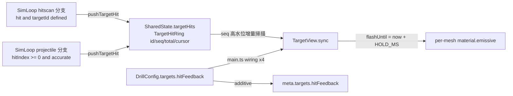

# WP-66 — 命中視覺回饋：`targetHits` 環形格與 `TargetView` 命中亮起

> Stage index：[../README.md](../README.md) · checklist：[task-checklist.md](task-checklist.md) · progress：[progress.md](progress.md)
>
> 本計畫依 `.claude/skills/engineering-planning/SKILL.md`、`references/design_standards.md` 與 `assets/tech_spec_template.md` 制定。**只建立執行計畫，不修改 production code。**

| | |
|---|---|
| **Problem** | tracking 家族的目標是 `persistent: true`——命中**不撤除**（[SimLoop.ts:352](../../../../../src/loop/SimLoop.ts#L352) / [SimLoop.ts:456](../../../../../src/loop/SimLoop.ts#L456)）。非 tracking 的 peek drill 靠「目標消失」當命中回饋，tracking 沒有這個事件 ⇒ 受試者在整個呈現窗內**完全看不出自己有沒有打中**。既有的三條 render 通道都補不上這個缺口：`ImpactView` 的彈著格**命中與脫靶都會寫**（[SimLoop.ts:466](../../../../../src/loop/SimLoop.ts#L466)），`TracerView` 只畫軌跡，`TargetView` 只讀 `visible`/`pos`/`hitbox`。 |
| **Outcome** | 指名的 tracking drill 在**命中當下目標亮起、未命中時不亮**；亮起是 render-only 的視覺狀態，由 sim 在既有命中判定點多寫一筆環形格提供訊號。未指名的 drill 逐位不變。 |
| **Non-goal** | 不改命中判定、不改 hitbox、不改目標推進政策；不做 replay 側的同步（使用者 2026-09-11 決定「先不同步」）；不做音效／HUD 命中提示；不把亮起狀態寫進匯出資料或任何指標；不改 tracer 的開關語意。 |
| **Primary user** | 受試者（命中回饋）；研究者（哪幾個 drill 帶回饋、何時斷代）。 |
| **Estimate** | 6–8.5 dev-days（T0～T5 + T-exit）。 |
| **Risk** | **Med**。單一最高風險點在 T4 的**效度斷代**（改視覺＝改刺激，已收資料與新資料不可混池），不在程式。T1 觸及 `SimLoop` 命中路徑與 `SharedState`（91 callers），但屬 additive。 |
| **IDs** | 規劃期（2026-09-11）：`exec-plan/README.md §2` 最大 WP = **WP-65**、`active/*/` 實際最大 = **WP-65**、`DECISIONS.md` 最大 GD = **GD-41**；[stage14 §3](../../stage14/README.md) 的三個候選（WP-66/67/68）**尚未採納**。依 [GD-15](../../../DECISIONS.md)「先採納先得」取用 **WP-66 / GD-42**，stage14 候選順延為 WP-67/68/69。⚠️ 依 [GD-35](../../../DECISIONS.md) ② 紀律，二號**必須於 T0 重查**；被平行 session 取用則順延、不爭號。 |
| **Status** | ⬜ **未開工**（2026-09-11 規劃完成）。決策草稿 GD-42（D-66-1～D-66-6），**本體於 T-exit 入帳**（承 [WP-63](../wp-63-micro-flick-v8-measurement-foundation/README.md) D-63-P6 先例，規劃期只留草稿）。 |

### 落點說明

本主題屬 render 視覺回饋／受試者體驗層，**不屬 stage13 原本的「原始輸入取樣與抬滑鼠判準驗證」主題**；依使用者 2026-09-11 指示落於 `active/stage13/`，承 [WP-62](../wp-62-session-plan-per-item-weapon/README.md)／[WP-63](../wp-63-micro-flick-v8-measurement-foundation/README.md)／[WP-64](../wp-64-tracking-pilot-session-plan-drills/README.md)／[WP-65](../wp-65-drill-arming-and-countdown/README.md) 同一先例。比照明帳記錄，**不改寫** stage13 的 §1 主敘事、§4 相依圖或 WP-60/61 的相依關係；本 WP 與 WP-60～65 全數無相依、可完全並行。

---

## 0. Repository-grounded discovery（2026-09-11 codegraph + 讀碼）

### 0.1 現況：tracking 沒有命中回饋，是結構造成的，不是漏做

| # | 事實 | 證據 |
|---|---|---|
| 1 | tracking 目標 `persistent: true` ⇒ 命中只記事件、**不** `markKilled` | [SimLoop.ts:352](../../../../../src/loop/SimLoop.ts#L352)（projectile）、[SimLoop.ts:455-460](../../../../../src/loop/SimLoop.ts#L455-L460)（hitscan） |
| 2 | `TargetView.sync()` 只消費 `visible` / `posPrev` / `pos` / `hitbox` ⇒ 命中前後**輸入完全相同** | [TargetView.ts:69-89](../../../../../src/render/TargetView.ts#L69-L89) |
| 3 | `TargetView` 整個 mesh pool **共用一份 material** ⇒ 目前在架構上無法逐目標上色 | [TargetView.ts:31](../../../../../src/render/TargetView.ts#L31)、[TargetView.ts:100](../../../../../src/render/TargetView.ts#L100) |
| 4 | `impacts` 環形格**不是命中訊號**：脫靶也寫（交戰平面投影彈孔，WP-13 T4） | [SimLoop.ts:464-470](../../../../../src/loop/SimLoop.ts#L464-L470) |
| 5 | 命中的權威判定已含 `accurate` 速度閘與 WP-45 occlusion blocker ⇒ 「隔牆／未過閘的射擊不該亮」是**免費**拿到的 | [SimLoop.ts:445-453](../../../../../src/loop/SimLoop.ts#L445-L453) |

⇒ 缺的只有**一條 sim → render 的「這一發打中了誰」訊號**，以及 `TargetView` 的逐目標上色能力。**不需要**新的命中判定（守 GD-7 單一來源）。

### 0.2 現成的同型先例：WP-25 tracer 雙軌分離

[CONTEXT.md §205-213](../../../../CONTEXT.md) 已經把這條路走完並定名：

> **(a) tracer 軌跡顯示**是 render-only 顯示層（sim 演進零改動）；**(b) projectile 彈道模型**才動命中語意，且 config-gated。

- `shotRays`（`ShotRayRing`：並行 typed-array + 單調 `seq` + `total`/`cursor`，容量 `TRACER_CAP`）＝ **sim 唯寫 / render 唯讀**的固定佈局環形格。
- `TracerView` 以 `seq` 高水位增量同步、scratch 重用、**不得回寫 sim／不記錄 export**。

本 WP 是同一個模式的第三個實例（`impacts` → `shotRays` → `targetHits`），**不新增架構慣例**。

### 0.3 現況：config-gated additive 欄位的既有慣例

| 先例 | 欄位 | 省略時 |
|---|---|---|
| WP-25 彈道模型 | `WeaponConfig.bullet` | 走 hitscan，逐位不變 |
| WP-46 球形 hitbox | `targets.hitbox.shape` | `'box'`，逐位不變 |
| WP-52 masked visual | `targets.hitbox.visualSize` | 視覺讀 hitbox 尺寸，逐位不變 |
| WP-65 待命閘 | `createDrillRunner(…, { requireArm })` | 直接進 `countdown`，逐位不變 |

⇒ 本 WP 的 `targets.hitFeedback?` 沿用同一形狀：**省略＝現行行為逐位不變**，且省略時**不寫入匯出 metadata**（守「optional-in 預設值會移動 canonical 位元組」的既有紀律）。

### 0.4 現況：`TargetView` 的建構與設定點（承 WP-65 FM-1 的教訓）

`targetView` 在 `main.ts` 有**一個初始建構點 + 三個 `setShape()` 呼叫點**，另有場景重載時的**重建**：

| # | 位置 | 情境 |
|---|---|---|
| 1 | [main.ts:346-347](../../../../../src/main.ts#L346-L347) | 開機初始 drill |
| 2 | `activateDrill()` 內 `targetView.setShape(...)` | 換 drill／換武器 |
| 3 | [main.ts:1537](../../../../../src/main.ts#L1537) `loadSceneById()` | 換場景 |
| 4 | `installSceneLoad()` 內 `new TargetView(...)` | 場景重載 ⇒ **view 重建**，逐目標 material 與命中態一併歸零 |

WP-65 的 FM-1 正是「三處 wiring 漏一處 ⇒ 換 drill 後行為不一致」。本 WP 的 `setHitFeedback()` **必須**在同樣四處全部到位（T3 的窮舉步驟 + T5 的 e2e 覆蓋）。

### 0.5 Planning-time blast radius（codegraph，2026-09-11）

- `SharedState` — 91 callers（`InputSampler` / `fpsTestHarness` / `TargetManager` / `SimLoop` + 4 more），18+ 覆蓋測試（`tests/regression/determinism.test.ts`、`br-tracking-invariants.test.ts`、`muzzle-tracer-invariants.test.ts` …）。新增欄位屬 additive。
- `TargetView` — 5 callers（全在 `src/main.ts`），覆蓋測試 `src/render/TargetView.test.ts`、`src/scene/scenes/micro-flick-room.test.ts`、`src/sim/micro-flick-performance.test.ts`。`TargetView.test.ts` 直接建構真實 `THREE.Scene`／`Mesh` ⇒ **材質色值可直接斷言**，不需要 render harness。
- `TargetState` — 44 callers、12+ 覆蓋測試。**本 WP 不改 `TargetState`**（理由見 §2.3）。
- `ReplayTargetView` — 6 callers（`ReplayPresentationSession`）。**本 WP 零修改**（使用者決定先不同步）。

---

## 1. 需求壓縮 (Requirements)

### 1.1 Functional Requirements

| FR | 內容 | Task |
|---|---|---|
| **FR-66.1** | `SharedState` **必須**具備一個固定佈局的命中環形格，由 sim 在**既有**命中判定成立時寫入被命中目標的身分，render 唯讀（ADR-2）。該環形格**不得**新增任何命中判定。 | T1 |
| **FR-66.2** | 系統**必須**在 hitscan 與 projectile **兩條**命中路徑都寫入該環形格，且寫入條件與既有 `fire.hit` / `hit` 事件的成立條件**逐條相同**（含 `accurate` 速度閘與 occlusion blocker）。 | T1 |
| **FR-66.3** | 未命中（含脫靶、被 scene prop 擋下、未過速度閘、彈道逾 `maxRangeU` 消滅）**不得**寫入該環形格。 | T1 |
| **FR-66.4** | `TargetView` **必須**能逐目標呈現兩種視覺狀態（未命中態／命中態），且兩態的差異**必須**可由單元測試以具名材質屬性斷言。 | T2 |
| **FR-66.5** | 目標**必須**在被命中時進入命中態，並在最後一次命中後經過具名常數時長回到未命中態；期間再次命中**必須**重新起算該時長。 | T2 |
| **FR-66.6** | 命中態**必須**跟隨目標身分（`TargetState.id`），**不得**跟隨 mesh pool 槽位；同一幀內多個目標**必須**各自獨立呈現。 | T2 |
| **FR-66.7** | `TargetView` **必須不得**寫入 `SharedState` 的任何欄位（含環形格游標）。 | T2 |
| **FR-66.8** | 命中回饋**必須**為 `DrillConfig` 的選擇性設定；省略時 `TargetView` 的輸出與本 WP 前**逐位相同**，且匯出 `meta` 的鍵集合零增減。 | T3 |
| **FR-66.9** | 該設定**必須**在 drill 載入、換 drill、換武器、換場景四條路徑都生效（§0.4 的四個點）。 | T3 |
| **FR-66.10** | 啟用該設定的 run **必須**在匯出 metadata 帶具名欄位，使分析端能判別本場是否帶命中回饋。 | T3 |
| **FR-66.11** | 系統**必須**在指名的 tracking drill 集合上啟用該設定，該集合由 T0 收斂並逐一列名；未列名的 drill 一律不啟用。 | T4 |
| **FR-66.12** | 環形格內容**必須不得**進入 `DataRecorder`、匯出 payload、`src/metrics/` 或 `research/`（render-only，比照 tracer 的 WP-25 硬約束）。 | T1 · T5 |

### 1.2 Non-functional Requirements

| NFR | 量化指標 | 驗證 |
|---|---|---|
| **NFR-66.1** | 同一輸入序列在 ≥ 4 種 render FPS 下，同一 tick index 的環形格內容（`total` 與各槽 `id`/`seq`）**逐位一致**。 | T1 DoD（新檔 `wp66-hit-ring-determinism.test.ts`） |
| **NFR-66.2** | `tests/regression/` 下全部 determinism / golden fixture **零修改**通過，通過數 ≥ T0 基線。 | T1 · T3 · T5 DoD |
| **NFR-66.3** | 命中時每 tick 的新增工作量 = 1 次 slot 寫入（1 個 `number` + 1 個既有 `string` 參考）；**零堆配置**。render 端每幀新增工作量 = O(本幀新命中數) + O(顯示中目標數)。 | T1 · T2 DoD（熱路徑無 `push` / 無物件字面值 / 無 `new` 的 diff 檢視 + 斷言） |
| **NFR-66.4** | 啟用命中回饋的 drill，實機 frame-time p95 相對同 drill 關閉時的增量 **≤ 0.2 ms**，且 over-budget window 數不增加（比照 WP-60 F6 的 A/B 量測法）。 | T5 DoD |
| **NFR-66.5** | draw call 數在啟用前後**不變**（目標本來就是各自的 `Mesh`，共用 material 不會合批）。 | T2 DoD（`renderer.info.render.drawcalls` 記入 `progress.md`） |
| **NFR-66.6** | 未帶新 metadata 欄位的舊匯出 JSON 仍可被 `parseExportPayload()` 與 Python `load_export()` 讀取；新欄位存在時 Python 端零修改可讀（C-D1 additive）。 | T3 DoD |
| **NFR-66.7** | 全量 Playwright `--workers=1` 通過數 ≥ 本 WP 前基線，`0 failed`。 | T5 DoD |

### 1.3 Constraints

- **UI = 純 TS + DOM overlay**（D1）；本 WP 的視覺變更全在 three.js 材質層，不引入任何 UI 框架。
- `import * as THREE from 'three/webgpu'`；命中態不得引入第二種 material 型別（避免 WebGPU pipeline 重編，見 FM-6）。
- 階段 A 鎖 Chrome/Edge 桌面版。
- `research/` ↔ `src/` 單向隔離（C-D1）：本 WP 的 `research/` diff **必須為空**。
- 既有構念不得有第二定義（C-D4）：命中回饋**不是** on-target 構念的第二定義，也不得被任何指標讀取（FR-66.12）。

### 1.4 Open Questions

| OQ | 問題 | 預設 | Owner | Deadline | 影響 |
|---|---|---|---|---|---|
| **OQ-66.1** | 哪些 drill 啟用命中回饋？ | **預設**：`tracking_br_v1` 八個 variant（[tracking_br_v1.ts:94-103](../../../../../src/drill/tracking_br_v1.ts#L94-L103)）＋ WP-64 策展的兩個 Tracking Pilot config。**排除** `hold_track_v1`——它屬 stage6 已凍結的 assessment 協定（`protocolVersion = 1.0.0`，[GD-23](../../../DECISIONS.md)），改視覺等同改協定、需升版本字串，不在本 WP 範圍。 | 使用者 | **T0** | T4 範圍；若改判納入 `hold_track_v1` ⇒ T4 需追加 `protocolVersion` 升版切片 |
| **OQ-66.2** | 命中態維持時長（`HIT_FEEDBACK_HOLD_MS`）取值？ | **預設 120 ms**。使用者已定義語意為「命中才亮、沒中不亮」；tracking pilot 的射速約 10 Hz（≈100 ms 間隔）⇒ 120 ms 使**連續命中呈連續亮起**、**一次未命中在 ≤120 ms 內熄滅**，最貼合該語意且不閃爍。 | 使用者 | **T0** | T2 的常數值與其測試期望值 |
| **OQ-66.3** | 命中態以 `emissive` 呈現（目標自體發光）還是換 `color`？ | **預設 `emissive`**：`MeshStandardMaterial.emissive` 預設即 `0x000000` ⇒ 未啟用時**逐位不變**；且保留目標原色身分，亮起語意最直觀。 | 規劃者（已定） | T0 | T2 的斷言屬性 |
| **OQ-66.4** | 是否需要 `meta` 層級的效度斷代版本標記？ | **預設否**——本 WP 以 `meta` 的 additive 欄位（FR-66.10）逐 run 自述是否帶回饋，已足以讓分析端分池。[WP-65 T-exit](../wp-65-drill-arming-and-countdown/progress.md) 確認的 `meta` 版本標記工作屬**另一個獨立 WP**，本 WP 不夾帶。 | 使用者 | **T0** | 若改判為是 ⇒ 本 WP 需等該 schema WP，改為相依而非並行 |

---

## 2. 系統架構與設計 (Technical Design)

### 2.1 System boundary

**In scope**

- `src/state/SharedState.ts`：新增 `TargetHitRing` 型別、`createTargetHitRing()`、`pushTargetHit()`、`resetTargetHitRing()`，併入 `createSharedState()` / `resetState()`。
- `src/loop/SimLoop.ts`：**兩處**既有命中分支各加一行寫入。
- `src/render/TargetView.ts`：逐 mesh material、命中態消費與衰減。
- `src/drill/DrillConfig.ts` + `src/drill/schema.ts`：`targets.hitFeedback?` 設定與 JSON 驗證。
- `src/data/metadata.ts`：`meta.targets` 的 additive 欄位。
- `src/main.ts`：§0.4 的四個 wiring 點。
- 指名 tracking drill config（T4）。
- `CONTEXT.md`：新術語入語意記憶。

**Out of scope**

- `HitDetector` / `ballisticRaycast` / `targetAabb` / `sweptHitTest`：命中判定**零修改**。
- `TargetState`：**零修改**（理由見 §2.3）。
- `ReplayTargetView` / `sampleReplay` / replay contracts：**零修改**（使用者決定先不同步）。
- `DataRecorder` / `exportPayloadSchema` 的 event 與 tick 形狀：**零修改**（只動 `meta`）。
- `src/metrics/` / `research/`：**零修改**。
- 音效、HUD 命中提示、準心命中標記（hitmarker）：不在本 WP。
- `hold_track_v1` 及任何 formal assessment 協定的參數（除非 OQ-66.1 改判）。

### 2.2 Data flow



寫入方向：**sim 唯寫 → render 唯讀**，與 `impacts` / `shotRays` 同向（ADR-2）。

**關鍵：兩個時鐘域不交會。** 環形格**不帶時間戳**——它只帶身分與 `seq`。衰減完全由 render 以 rAF 的 `now`（wall clock）計算：`flashUntil = now + HOLD_MS`。這是刻意的設計，用來從結構上消除「拿 sim clock 的 `t` 減 wall clock 的 `performance.now()`」——那種相減會得到看似合理、卻隨負載漂移的數字。

### 2.3 為什麼不把命中寫進 `TargetState`

替代方案是在 `TargetState` 加 `lastHitSeq?`（先例：`fireLocked`，[CONTEXT.md:52](../../../../CONTEXT.md)）。**不採用**，三個理由：

1. `TargetState` 是 sim 契約（44 callers、12+ 覆蓋測試），而本 WP 的資料是**純顯示訊號**——放進 sim 契約會讓後續讀者以為它有 sim 語意。
2. `shotRays` 先例已經明確：render-only 訊號走**獨立環形格**，不污染狀態物件（WP-25 硬約束）。
3. 環形格天然攜帶「**這是一個事件**」的語意（單調 `seq`），`TargetState` 上的欄位則是「狀態」，render 要自己做邊緣偵測，反而更容易寫錯。

### 2.4 Interface contracts

```ts
// src/state/SharedState.ts

/** 命中回饋環形格容量。比照 IMPACT_CAP / TRACER_CAP；render 每幀消費，不宣稱零丟失。 */
export const TARGET_HIT_CAP = 64;

/**
 * 命中目標環形格（WP-66 / T1）：sim 在既有命中判定成立時寫入被命中目標的 id，render
 * （`TargetView`）唯讀。**不新增命中判定**——寫入條件與既有 `fire.hit` / `hit` 事件逐條相同。
 *
 * 固定佈局（CLAUDE.md §4）：`id` 為 preallocated `string[]`，槽位**就地覆寫既有參考**
 * （非 `push`、非物件配置；寫入的是 `TargetState.id` 這個既有字串的參考，熱路徑零配置）。
 * `seq[i]` = 該槽的單調寫入序號（1 起；0 = 空槽哨兵），供 render 偵測新命中做增量同步。
 *
 * **不帶時間戳**：render 的衰減一律以 rAF `now` 起算，避免 sim clock 與 wall clock 相減（見 §2.2）。
 */
export interface TargetHitRing {
  /** 被命中目標的 `TargetState.id`；空槽為 ''。 */
  readonly id: string[];
  readonly seq: Float64Array;
  /** 累計命中總數（單調遞增；render 據此早退）。 */
  total: number;
  /** 下一寫入槽位 [0, TARGET_HIT_CAP)。 */
  cursor: number;
}

export function createTargetHitRing(): TargetHitRing;

/** sim 唯寫。`targetId` 為既有 `TargetState.id` 參考（不得在此組字串）。空字串為 no-op。 */
export function pushTargetHit(ring: TargetHitRing, targetId: string): void;

/** 原地清空（重開 drill / reset）：重用既有陣列，不 realloc。 */
export function resetTargetHitRing(ring: TargetHitRing): void;
```

```ts
// src/render/TargetView.ts

/** 命中態維持時長（ms，render-only；OQ-66.2）。 */
export const HIT_FEEDBACK_HOLD_MS = 120;

export class TargetView {
  /**
   * 啟用／停用命中視覺回饋（drill 層設定；main.ts 於載入／換 drill／換武器／換場景四處呼叫）。
   * 停用時 `sync()` 不讀環形格、不改任何材質，輸出與本 WP 前逐位相同。
   */
  setHitFeedback(enabled: boolean): void;

  /**
   * @param targets 唯讀目標快照
   * @param alpha   render 內插係數（既有）
   * @param hits    命中環形格（唯讀；省略＝不做命中回饋，既有呼叫端逐位相容）
   * @param nowMs   rAF 時間戳（wall clock，與 `performance.now()` 同域）；`hits` 提供時必填
   */
  sync(targets: readonly TargetState[], alpha?: number, hits?: TargetHitRing, nowMs?: number): void;
}
```

```ts
// src/drill/DrillConfig.ts — DrillConfig['targets'] 內新增

/**
 * WP-66：命中視覺回饋（render-only）。省略＝不顯示回饋，且**不寫入匯出 metadata**
 * （既有 drill 逐位不變）。'flash' = 命中時目標亮起、HIT_FEEDBACK_HOLD_MS 內未再命中即熄滅。
 * 本欄位**不得**影響命中判定、目標推進、hitbox 或任何指標（C-D3/C-D4）。
 */
readonly hitFeedback?: 'flash';
```

```ts
// src/data/metadata.ts — Meta['targets'] 內新增（additive，optional-in）
/** WP-66：本場是否帶命中視覺回饋。省略＝無（既有 payload 鍵面不變）。 */
hitFeedback?: 'flash';
```

**Error 情境**：`schema.ts` 對 JSON drill 的 `targets.hitFeedback` 只接受 `undefined` 或字面量 `'flash'`；其他值 ⇒ 拋出帶欄位名的錯誤（比照既有 `requireHitboxShape`）。`pushTargetHit` 對空字串 id 為 no-op（防呆，不拋）。

### 2.5 Failure modes

| FM | 觸發條件 | 影響範圍 | 處理策略 | Task |
|---|---|---|---|---|
| **FM-1** | 未啟用的 drill 行為被改變（例如 `sync()` 在 `hits === undefined` 時仍走新路徑，或 material 建構參數被動到） | 全 repo 所有既有 drill 的視覺與 golden fixture | `sync()` 的 `hits === undefined` 早退分支 + `tests/regression/` **零修改**通過 + 未啟用時材質屬性逐位斷言 | T2 · T3 |
| **FM-2** | mesh pool 槽位重用把上一個目標的命中態洩漏給下一個目標（`#acquire(i)` 的 `i` 是**本幀第 n 個顯示中的目標**，不是目標身分） | 受試者看到「沒打中卻亮」——**直接污染刺激** | 命中態以 `TargetState.id` 為鍵（FR-66.6）；專測：目標 A 命中後撤除、目標 B 佔用同一槽位 ⇒ B 不得亮 | T2 |
| **FM-3** | §0.4 的四個 wiring 點只改了一部分 ⇒ 換 drill／換場景後回饋消失或殘留 | 受試者體驗不一致；research run 之間刺激不同 | T3 窮舉全部 `targetView` 參考點並記入 `progress.md`；e2e 覆蓋「換 drill 後仍生效」 | T3 · T5 |
| **FM-4** | `TargetView` 回寫 `SharedState`（例如就地推進 `hits.cursor` 當作「已消費」標記） | 破壞 ADR-2 三迴圈邊界；sim 的環狀語意被 render 竄改 | render 只維護**自己的** `#syncedSeq` 高水位（`ImpactView` 既有慣例）；測試：`sync()` 前後 ring 全欄位 `Object.is` 不變 | T2 |
| **FM-5** | 命中亮起被後續讀者當成 on-target 指示、被某個指標或分析讀取 | 違反 C-D3（未過構念驗證不得進報告）與 C-D4（既有構念第二定義） | FR-66.12：`targetHits` 於 `src/data/`、`src/metrics/`、`research/` 零 importer；T5 以符號掃描斷言釘死 | T1 · T5 |
| **FM-6** | 命中態用「換一顆 material 物件」實作 ⇒ WebGPU 首次命中才編 pipeline，造成一次性卡頓 | 命中當下掉幀，污染 frame-time 與受試者手感 | 每個 pool mesh 在 `#acquire()` 時 **clone 一份自己的 material**（型別/defines 完全相同 ⇒ 同 pipeline），執行期只改 `emissive` uniform；NFR-66.4 的 A/B frame-time 量測 | T2 · T5 |
| **FM-7** | 效度斷代被靜默：啟用回饋後的 run 與先前已收資料混入同一池 | 研究結論失效（刺激不同卻當同條件比較） | FR-66.10 的 `meta` 欄位逐 run 自述；T4 在 `progress.md` 與 stage README 明帳列出啟用 drill 與生效日期；未列名 drill 一律不啟用 | T3 · T4 |
| **FM-8** | 單幀內命中數 > `TARGET_HIT_CAP` ⇒ 舊槽被覆寫 | 極端連射下漏掉一次亮起（視覺瑕疵，非資料問題） | 明確**不宣稱零丟失**（比照 `ImpactRing` 的環狀覆寫語意）；CAP=64 相對 128 Hz sim 與 ≤20 Hz 射速有數量級餘裕，記入 `progress.md` 而非加防護 | T1 |

---

## 2b. 硬約束衝擊 (Hard-constraint impact) — 逐條過閘

| 約束 | 是否觸及 | 說明 / 緩解 |
|---|---|---|
| 時鐘域：禁 `Date.now()`，一律 `performance.now()`（ADR-4） | **觸及** | render 的衰減以 rAF `now`（`performance.now()` 同域）起算，由呼叫端傳入、`TargetView` 內**不讀時鐘**（比照 `CameraController.setAds(active, nowMs)` 既有慣例）。環形格**刻意不帶時間戳**，從結構上消除 sim clock ↔ wall clock 相減（§2.2） |
| cross-origin isolation 生效（`crossOriginIsolated === true`） | **不觸及** | 本 WP 不改 COOP/COEP、不新增跨源資源；命中回饋不參與任何計時量測 |
| **決定性**：同輸入序列跨 render FPS，sim 狀態逐位一致 | **觸及** | 環形格由 sim 寫 ⇒ 納入決定性契約。NFR-66.1 以新檔 `wp66-hit-ring-determinism.test.ts` 在 ≥ 4 種 render FPS 下斷言 `total` 與各槽 `id`/`seq` 逐位一致；`TickRecord` 不含環形格，既有 fixture 因此零修改（NFR-66.2） |
| **三迴圈邊界**：input / sim / render 只透過 `SharedState` 溝通（ADR-2） | **觸及** | 新資料方向 = **sim 唯寫 → render 唯讀**，與 `impacts`／`shotRays` 同向。`TargetView` 只維護自己的 `#syncedSeq`，不回寫任何 ring 欄位（FM-4 專測） |
| 固定佈局：輸入 ring + `DataRecorder` arena，不 `push` 物件 | **觸及** | `TargetHitRing` = **真 ring**（消費後繞圈，比照 `ImpactRing`／`ShotRayRing`），固定容量 `TARGET_HIT_CAP`、固定欄位、槽位就地覆寫。`id` 為 preallocated `string[]`，寫入的是既有 `TargetState.id` 的**參考**（不組字串、不配置物件）；`SharedState` 既有的 `tVisible: Map<string, number>` 已是字串身分入 state 的先例。render 端的 `Map<string, number>` 於暖機後不再配置，且逐幀刪除過期鍵 |
| seeded RNG：sim/recoil 禁 `Math.random()`，seed 入 metadata（GD-5） | **不觸及** | 本 WP 零隨機性：亮起與否完全由既有命中判定決定，不取樣 |
| **GD-6**：場景幾何永不進 sim runtime／解析度與場景切換不改 sim | **觸及（守住）** | 命中回饋純屬 render 層；`propBounds`／GLTF mesh 不進任何新路徑。場景切換只重建 `TargetView`（§0.4 #4）與重設 `setHitFeedback()`，**不改** `SIM_HZ`、目標演進、輸入鏈或命中判定 |
| **GD-9**：場景資產僅 CC0 或 CC-BY，且 `ATTRIBUTIONS.md` 可稽核 | **不觸及** | 不新增任何外部資產；命中態只改既有 `MeshStandardMaterial` 的 `emissive` 數值 |
| **GD-11**：FPSci（CC BY-NC-SA）程式碼/config 禁止進 repo | **不觸及** | 全部實作衍生自本 repo 既有的 `ImpactView`／`TracerView` 模式，未參照 FPSci 任何程式碼或 config |
| hitbox 單一來源（`TargetState.hitbox`），命中與離線推導共用（GD-7） | **觸及（守住）** | 命中回饋**不新增任何幾何或閾值**——它消費的是既有命中判定的布林結果。`hitbox`／`visualSize` 零修改；`TargetView` 的 mesh 尺寸邏輯不動 |
| C-D1/C-D5：`research/` ↔ `src/` 單向隔離、晉升指標雙實作對表 | **不觸及（須驗證）** | `research/` diff 必須為空；`meta.targets.hitFeedback` 為 additive，Python `load_export()` 零修改可讀（NFR-66.6）。本 WP 不新增、不修改任何晉升指標 ⇒ 不觸發 C-D5 的雙實作重跑 |
| **C-D3**：未過構念驗證的指標不得進教練報告 | **觸及（守住）** | 命中回饋**不是指標**，且 FR-66.12 明令它不得進入 `DataRecorder`／export events／`src/metrics/`；T5 以零 importer 符號掃描釘死（FM-5） |

---

## 3. 風險分析 (Risk Analysis)

### 3.1 Validity risk（本 WP 的主要風險，不在程式）

1. **改視覺＝改刺激。** 命中回饋會改變受試者的行為（校正策略、注意力分配），**啟用前後的資料不可混池比較**。緩解：(a) 只在 T0 指名的 drill 啟用；(b) 逐 run 於 `meta` 自述（FR-66.10）；(c) 在 `progress.md` 與 stage README 明帳記錄啟用清單與生效日期（FM-7）。
2. **排除已凍結協定。** `hold_track_v1` 屬 stage6 `protocolVersion = 1.0.0` 凍結範圍（GD-23）；預設不啟用（OQ-66.1）。若改判納入，必須另開 `protocolVersion` 升版切片，不得靜默改視覺。
3. **projectile 條件的回饋延遲是刺激的一部分。** 使用者 2026-09-11 確認**可接受**：`tracking_br_v1` 的 projectile variant 亮起會晚於扣板機一個飛行時間（`hit` 事件的 `timeOfFlightMs`）。這在物理上正確，但 ads × ballistic 條件矩陣的**回饋延遲因此不再跨條件相等**——列為已知且已接受的條件差異，記入 GD-42。
4. **不得被讀成 on-target 指示。** 亮起只代表「這一發判定命中」，不代表「準心現在在目標上」；兩者在 projectile 條件下時間點完全不同。C-D4 紅線由 FR-66.12 + FM-5 的零 importer 掃描守住。

### 3.2 Technical debt risk

| 妥協 | 原因 | 後續處理／觸發條件 |
|---|---|---|
| replay 不同步（命中回饋只在 live 出現，replay 播放同一場不會亮） | 使用者 2026-09-11 明確決定「先不同步」；replay 需另從錄下的 `fire.hit`／`hit` 事件重建，屬獨立切片 | 觸發條件：當 replay 被用於**向受試者回放**（而非研究者檢視）時必須補齊，否則兩個呈現通道對同一場的描述不一致。屆時另開 WP，消費既有事件、不新增 schema |
| `TARGET_HIT_CAP` 不宣稱零丟失 | 與 `ImpactRing`／`ShotRayRing` 一致的既有語意；加防護等於為視覺瑕疵付出狀態複雜度 | 觸發條件：若日後有 drill 射速 > 100 Hz 或單幀命中數 > 64 |
| 命中態為單一固定樣式（無強度／顏色分級，不分 `hitbox.part`） | `part` 目前全 roster 未使用；分級會引入「哪種命中比較好」的價值判斷，屬協定設計而非視覺層 | 觸發條件：`hitbox.part`（head/body）實際被某個 drill 啟用時 |

### 3.3 Performance bottlenecks

- **draw call**：不變（NFR-66.5）。目標本來就是各自的 `Mesh`，共用 material 在 three 不會合批。
- **material clone**：每個 pool mesh 一份，於 `#acquire()` 一次性建立。pool 大小 = 歷史上單幀最多顯示的目標數（tracking = 1，v8 = 3）⇒ 至多 3 份。
- **pipeline**：clone 的型別與 defines 與原 material 完全相同 ⇒ 同一 pipeline，執行期只改 uniform（FM-6）。
- **GC**：sim 側零配置；render 側的 `Map<string, number>` 於暖機後零配置。
- **量測**：NFR-66.4 以 WP-60 F6 的 A/B 法驗證（同 drill 開／關各一場，比 frame-time p95 與 over-budget window 數）。

---

## 4. 任務拆解 (Task Breakdown)

*一 task = 一垂直切片 = 一原子 commit（協議 §3.1）。粒度 0.5–3 dev-days。*

| Task | Objective | Dependencies | Risk | Complexity | Definition of Done（可驗證證據） | Commit |
|---|---|---|---|---|---|---|
| **T0** | Entry gate：WP/GD 編號重查、基線凍結、OQ-66.1～66.4 收斂 | — | Low | Low | 見 [T0-entry-gate.md](T0-entry-gate.md) | `docs(wp-66): T0 entry gate for target hit visual feedback` |
| **T1** | `TargetHitRing` 進 `SharedState` + `SimLoop` 兩處寫入 + 決定性斷言 | T0 | **Med** | Med | 見 [T1-target-hit-ring.md](T1-target-hit-ring.md) | `feat(sim): record which target each landed shot hit` |
| **T2** | `TargetView` 逐 mesh material + 命中態消費與衰減 | T1 | Med | Med | 見 [T2-target-view-hit-flash.md](T2-target-view-hit-flash.md) | `feat(render): light up targets when a shot lands` |
| **T3** | `targets.hitFeedback?` 設定 + schema + metadata + `main.ts` 四處 wiring | T2 | Med | Med | 見 [T3-config-gate-and-wiring.md](T3-config-gate-and-wiring.md) | `feat(drill): gate hit feedback behind drill config` |
| **T4** | 在 T0 指名的 tracking drill 集合啟用 + 效度斷代明帳 | T3 | **Med** | Low | 見 [T4-enable-on-tracking-drills.md](T4-enable-on-tracking-drills.md) | `feat(drill): turn on hit feedback for the tracking family` |
| **T5** | 全量回歸、零 importer 掃描、focused e2e、A/B frame-time | T4 | Med | Med | 見 [T5-regression-and-e2e.md](T5-regression-and-e2e.md) | `test(wp-66): cover hit feedback end to end` |
| **T-exit** | WP-66 驗收（A-66.1～A-66.12）+ GD-42 入帳 | T1–T5 | Low | Low | 見 [T-exit-gate.md](T-exit-gate.md) | `docs(wp-66): T-exit acceptance for target hit visual feedback` |

### 建議執行順序

```
T0 ──▶ T1 ──▶ T2 ──▶ T3 ──▶ T4 ──▶ T5 ──▶ T-exit
```

本 WP 的相依是線性的：T2 需要 T1 的 ring 才有東西可讀，T3 需要 T2 的 `setHitFeedback()` 才有東西可 gate，T4 是 T3 的一次值變更。**不建議並行**——每個切片都是下一個的前提，且每一步都必須先證明「未啟用時逐位不變」。

---

## 5. 假設 (Assumptions)

1. `TargetView.test.ts` 現有做法（直接建構 `THREE.Scene` 並檢查 `scene.children`）在 vitest 下可讀寫 `MeshStandardMaterial.emissive` —— 已由 [TargetView.test.ts:1-30](../../../../../src/render/TargetView.test.ts#L1-L30) 佐證，T2 不需要新的 render harness。
2. `main.ts` 的 `liveFrame` 已持有 rAF `now`（[main.ts:1891](../../../../../src/main.ts#L1891) 的 `tracerView.sync(sharedState.shotRays, now)` 即為先例）⇒ 傳給 `targetView.sync()` 不需新增時鐘來源。
3. `schema.ts` 以白名單重組 config 物件（[schema.ts:173](../../../../../src/drill/schema.ts#L173)）⇒ 未加入驗證的新欄位會被**靜默丟棄**而非報錯。T3 必須同時改 type 與 schema，否則 JSON drill 設了也不會生效。**此假設須於 T3 讀碼確認。**
4. 使用者 2026-09-11 的三項決定為本計畫前提：①「命中才亮、沒中不亮」②「projectile 延遲可接受」③「replay 先不同步」。
