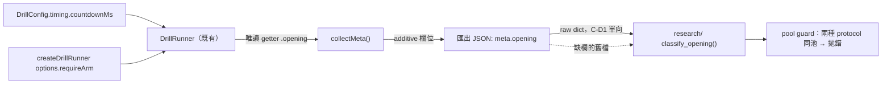

# WP-67 — 匯出開場協定標記：`meta.opening` 與 WP-65 的效度斷代

> Stage index：[../README.md](../README.md) · checklist：[task-checklist.md](task-checklist.md) · progress：[progress.md](progress.md)
>
> 本計畫依 `.claude/skills/engineering-planning/SKILL.md`、`references/design_standards.md` 與 `assets/tech_spec_template.md` 制定。**只建立執行計畫，不修改 production code。**

| | |
|---|---|
| **Problem** | [WP-65](../wp-65-drill-arming-and-countdown/README.md) 改變了每一場 drill 的**開場語意**（待命閘 ＋ 倒數變可見），但匯出 payload **完全記不住這件事**：`meta` 沒有任何欄位說明這個 run 走的是哪一種開場，`timing.countdownMs`（全 roster = 3000 ms）也從未進入匯出。⇒ 把 WP-65 前後的資料放進同一個池，開場段的首發指標（`t_acquire` / 首發命中 / 反應時間）會被靜默平均掉，而**沒有任何機械化的東西會擋住**。 |
| **Outcome** | 每一份新匯出在 `meta.opening` 記錄該 run **實際**走的開場協定與倒數時長；缺欄的舊資料有一條**單一實作**的離線分類規則；把兩種協定混進同一池的分析會**報錯**而不是靜默平均。 |
| **Non-goal** | 不改 arming 行為、不改倒數時長、不改 overlay 呈現、不改 `DrillRunner` 相位機；不改 `schemaVersion`（仍為 2）；不回填改寫任何**已錄**的匯出檔；不做 History Library 的 protocol 顯示（OQ-67.1）；不做 TS 側的舊檔分類器（OQ-67.3，C-D4 避免第二實作）。 |
| **Primary user** | 分析端（研究者）：要能在不讀 git log 的情況下，只憑 payload 判斷這份資料屬於哪一種開場刺激。 |
| **Estimate** | 6–8.5 dev-days（T0～T5 + T-exit）。 |
| **Risk** | **Med**。最高風險點在 **T1 的「缺席不補預設」**——這條與 [D-65-3](../../../DECISIONS.md) 的 optional-in／required-out 慣例**刻意相反**，補錯了會把 WP-65～WP-67 中間窗的 armed 資料全部誤分類成 `immediate-v0`（FM-1）。程式量本身很小。 |
| **IDs** | 規劃期（2026-09-11）重查四處來源：`exec-plan/README.md §2` 最大 WP = **WP-66**、`active/*/` 實際最大 = **WP-66**（`wp-66-target-hit-visual-feedback/`，平行 session 於 `959b4e3` 採納）、`DECISIONS.md` 最大 GD = **GD-41**、WP-66 已預約 **GD-42**（草稿，本體待其 T-exit 入帳）。依 [GD-15](../../../DECISIONS.md)「先採納先得」取用 **WP-67 / GD-43**，[stage14 §3](../../stage14/README.md) 的三個候選再順延為 **WP-68/69/70**。⚠️ 依 [GD-35](../../../DECISIONS.md) ② 紀律，二號**必須於 T0 重查**；被平行 session 取用則順延、不爭號。 |
| **Status** | ⬜ **未開工**（2026-09-11 規劃完成）。決策草稿 GD-43（D-67-1～D-67-6，見 [progress.md](progress.md)），**本體於 T-exit 入帳**，承 [WP-63](../wp-63-micro-flick-v8-measurement-foundation/README.md) D-63-P6 與 [WP-66](../wp-66-target-hit-visual-feedback/README.md) D-66-P7 先例。 |

### 落點說明

本主題屬匯出 schema 與離線斷代，**不屬 stage13 原本的「原始輸入取樣與抬滑鼠判準驗證」主題**；依使用者 2026-09-11 指示落於 `active/stage13/`，承 WP-62／63／64／65／66 同一先例。比照明帳記錄，**不改寫** stage13 的 §1 主敘事與 §4 相依圖；本 WP 與 WP-60～64、WP-66 無相依，**唯一上游是 WP-65 的 T-exit（已 ✅）**。

### 來源

[WP-65 T-exit](../wp-65-drill-arming-and-countdown/T-exit-gate.md) 步驟 5（效度斷代記錄）要求向使用者確認是否需要 `meta` 版本標記，並明訂「**若使用者要求，該標記屬新 WP，不在本 WP 夾帶**」。使用者於 2026-09-11 確認**需要**（[GD-41 狀態列](../../../DECISIONS.md)）。本 WP 即該項工作。

---

## 0. Repository-grounded discovery（2026-09-11 讀碼）

### 0.1 斷代的是**兩項**語意差異，不是一項

| | WP-65 之前 | WP-65 之後（production 路徑） |
|---|---|---|
| **起跑由誰決定** | 系統。drill 一載入就進 `countdown`，受試者可能還沒取得 Pointer Lock、還沒把手放上滑鼠 | 受試者。停在 `'armed'` 直到取得 Pointer Lock（[DrillRunner.ts:205](../../../../../src/drill/DrillRunner.ts#L205)） |
| **起跑時刻可不可預期** | 不可預期。倒數在跑但**完全沒有畫面呈現**——受試者看到的是「畫面卡住三秒然後目標突然出現」（[DrillStartOverlay.ts:4-8](../../../../../src/ui/DrillStartOverlay.ts#L4-L8) 的檔頭自述） | 可預期。3／2／1 可見倒數 = 標準的 **foreperiod 警示訊號** |

兩項都直接動到首目標出現當下的**注意力狀態與時間預期**，也就是 `t_acquire`／首發命中／反應時間這一族指標的量測前提。所以這是刺激層的斷代，不是呈現層的化妝。

### 0.2 現況：payload 記不住開場協定

- `Meta`（[metadata.ts:155-270](../../../../../src/data/metadata.ts#L155-L270)）沒有任何開場相關欄位。
- `timing.countdownMs` 只被 `DrillRunner` 內部讀（[DrillRunner.ts:224](../../../../../src/drill/DrillRunner.ts#L224)、[:298](../../../../../src/drill/DrillRunner.ts#L298)），**從未進入匯出**。全 roster 目前都是 3000 ms，但那是巧合不是契約。
- `requireArm` 只在 `main.ts` 的三個 `createDrillRunner()` 建構點傳 true（[main.ts:1033](../../../../../src/main.ts#L1033)、[:1492](../../../../../src/main.ts#L1492)、[:1534](../../../../../src/main.ts#L1534)），且是建構期的**私有**選項，`DrillRunner` 介面不曝露。

⇒ 現在要判斷一份匯出屬哪一種開場，唯一辦法是看 `startedAt` 對照 git log。那不是可稽核的資料，是考古。

### 0.3 中間窗的唯一指紋，只在**原始 JSON** 上成立

WP-65～本 WP 之間錄的匯出實際上已經是 armed 協定，卻不會帶 `meta.opening`。它們有一個指紋：`meta.validity.pointerLockLost` 是 WP-65 才加的第五欄，且 required-out ⇒ **原始 JSON 裡有這個鍵 = 這份匯出 ≥ WP-65**。

但這個指紋**parse 之後就消失**：`parseValidity()` 對缺欄補 `false`（[metadata.ts:234-241](../../../../../src/data/metadata.ts#L234-L241) 的 D-65-3 註解、[exportPayloadSchema.ts:370](../../../../../src/data/exportPayloadSchema.ts#L370)），所以 parse 後的物件裡，「pre-WP-65 匯出」與「乾淨的 post-WP-65 run」都是 `pointerLockLost === false`，**逐位相同**。

⇒ **分類規則必須寫在讀原始 JSON 的那一側**。Python 的 `load_export()` 正好把 `meta` 原封不動當 dict 帶出（[loader.py:186](../../../../../research/src/modules/ingest/algorithms/loader.py#L186) 的 `meta=dict(meta)`），且對未知鍵寬容、只對必填鍵嚴格 ⇒ **Python 不必改 parser 就看得到原始鍵面**。這是把分類器放在 `research/` 的決定性理由，不只是「消費端在那裡」。

### 0.4 現況：additive optional 欄位的既有慣例與 digest 護欄

repo 已有兩道護欄會對 meta 鍵面變動亮紅燈，**都必須被有意識地處理**：

| 護欄 | 位置 | 本 WP 的預期 |
|---|---|---|
| 8 筆 fixture 的 canonical digest | [exportPayloadSchema.test.ts:61-70](../../../../../src/data/exportPayloadSchema.test.ts#L61-L70) | **零位移**。因為本 WP 不對缺席的 `opening` 補值（§2.3），舊 payload 的 canonical bytes 不動 |
| 三個 frozen drill 的 live meta 鍵面 digest | [session-orchestrator.spec.ts:1128-1141](../../../../../tests/e2e/session-orchestrator.spec.ts#L1128-L1141) | **必定位移**。新 live run 會多一個 `opening` 鍵。這正是該護欄註解說的「a deliberate addition … updates these *and* says so in the owning WP's progress」 |

這兩者的**方向相反**，本身就是最強的驗收證據：前者不動證明舊資料沒被碰，後者動證明新資料真的帶欄。

### 0.5 Planning-time blast radius

| 檔案 | 改動性質 |
|---|---|
| `src/data/metadata.ts` | `OpeningMeta` 型別 ＋ `Meta.opening?` ＋ `collectMeta()` 一段 additive 驗證 |
| `src/data/exportPayloadSchema.ts` | `parseOpening()`，**缺席即 `undefined`**（不補值） |
| `src/drill/DrillRunner.ts` | `DrillRunner` 介面多一個唯讀 getter `opening`（曝露既有事實，不新增狀態） |
| `src/main.ts` | 匯出組裝處把 `activeDrillRunner.opening` 餵進 `collectMeta()` |
| `research/src/modules/…/opening.py`（新） | 分類純函式 ＋ 混池 guard（C-D2：純函式、無 I/O） |
| `tests/e2e/session-orchestrator.spec.ts` | frozen meta 鍵面 digest 重新基線（三格） |

---

## 1. 需求壓縮 (Requirements)

### 1.1 Functional Requirements

- **FR-67.1** 系統**必須**在每一份新匯出的 `meta.opening.protocol` 記錄該 run **實際**走的開場協定，取值為 `'immediate-v0'`（無待命閘）或 `'armed-countdown-v1'`（待命閘 ＋ 可見倒數）。
- **FR-67.2** 系統**必須**在 `meta.opening.countdownMs` 記錄該 run 實際使用的倒數時長，其**唯一**來源為該 run 的 `config.timing.countdownMs`；不得另立常數（C-D4）。
- **FR-67.3** `meta.opening` **必須**是 optional-in：缺欄的既有 payload 仍可被 `parseExportPayload()` 與 Python `load_export()` 讀取且不報錯。
- **FR-67.4** `parseExportPayload()` **必須**在 `meta.opening` 缺席時讓它維持 `undefined`，**不得**補任何預設值——缺席在本欄的語意是「未知，需靠離線規則斷代」，不是 `immediate-v0`。
- **FR-67.5** `research/` **必須**提供**單一實作**的離線分類函式，把任一份匯出（含缺欄者）判成 `immediate-v0` / `armed-countdown-v1` / `unknown`；缺欄者依原始 JSON 是否含 `meta.validity.pointerLockLost` 鍵判定。
- **FR-67.6** `research/` **必須**提供混池 guard：當同一批 run 含有兩種以上 protocol 時，預設**拋錯並列出各 protocol 的檔名**，只有呼叫端顯式具名放行才繼續。
- **FR-67.7** 四條 start 路徑（restart／換武器／換場景／換 drill／Session Plan 每個 block）產出的匯出**必須**帶一致且正確的 `meta.opening`。
- **FR-67.8** `meta.opening.protocol` **必須**由 runtime 事實推導（該 runner 的 `requireArm`），不得由硬編字串或版號常數決定。

### 1.2 Non-functional Requirements

- **NFR-67.1** [exportPayloadSchema.test.ts](../../../../../src/data/exportPayloadSchema.test.ts) 的 **8 筆** canonical digest **逐筆零位移**（缺席不補值的可執行證據）。
- **NFR-67.2** `npx vitest run tests/regression` 全數通過且 **fixture 零修改**（`git status -- tests/` 為空）。
- **NFR-67.3** `meta` 頂層鍵集合**恰多一鍵** `opening`；`meta.validity` 的五欄與 `suspect` 的 OR 集合**逐位不變**。
- **NFR-67.4** 不新增任何 per-tick 或 per-frame 成本：`meta.opening` 於匯出組裝期一次性寫入，`DrillRunner.opening` 為 O(1) getter、不在 tick 路徑配置物件。
- **NFR-67.5** Python 分類函式為純函式：無 file I/O、無 `print`、無 matplotlib（C-D2），輸入為已載入的 `meta` dict。
- **NFR-67.6** 決定性不變：同一輸入序列跨 ≥ 4 種 render FPS 的 `TickRecord[]` 逐位一致（本 WP 不進 sim 狀態）。

### 1.3 Constraints

- `schemaVersion` **維持 2**。[exportPayloadSchema.ts:313](../../../../../src/data/exportPayloadSchema.ts#L313) 與 Python `_validate_meta` 都硬性拒絕非 2；bump 會讓全部既有 fixture 與 `research/` 讀檔一次紅掉，而本 WP 是 additive，沒有正當理由付這個代價。
- **已錄匯出不可變**：不寫 migration script 回填既有 JSON（使用者 2026-09-11 選定）。原始資料一旦落盤即視為證據，改寫會讓檔案不再與當時產出逐位相同。
- C-D1：`research/` 只讀匯出 JSON，不得 import 任何 TS 模組；`src/` 不得 import Python 產物。
- 階段 A 鎖 Chrome/Edge 桌面版。

### 1.4 Open Questions

| # | 問題 | 預設（未推翻即生效） | Owner | Deadline | 影響 |
|---|---|---|---|---|---|
| **OQ-67.1** | History Library 卡片要不要顯示 opening protocol？ | **不做**。研究者的斷代發生在離線端；加一欄屬 UI 範圍蔓延 | 使用者 | T5 開工前 | T5 範圍 |
| **OQ-67.2** | 測試 harness／e2e 產出的匯出會帶 `immediate-v0`（因為不傳 `requireArm`），要不要另外標記「非真人資料」？ | **不另外標記**。`immediate-v0` 是事實陳述；「是不是真人」由既有 history／檔名紀律負責，不在本欄擴張語意 | 規劃內定 | T2 開工前 | T2 斷言範圍 |
| **OQ-67.3** | TS 側要不要也提供舊檔分類器？ | **不做**。兩套實作即 C-D4 禁止的第二定義；且 TS 端拿到的是 parse 後物件，原始鍵面已消失（§0.3），本來就做不到 | 規劃內定 | T3 開工前 | T3 範圍、C-D4 |
| **OQ-67.4** | 混池 guard 的放行介面要多寬？ | **一個呼叫點層級的顯式參數**（`allow_mixed=True`）＋ 呼叫端自己寫下理由；不提供全域開關、不提供環境變數 | 規劃內定 | T3 開工前 | T3 介面、FM-4 |

---

## 2. 系統架構與設計 (Technical Design)

### 2.1 System boundary

**In scope**

- `src/data/metadata.ts`：`OpeningMeta` 型別、`Meta.opening?`、`collectMeta()` 的 additive 驗證。
- `src/data/exportPayloadSchema.ts`：`parseOpening()`（缺席即 `undefined`）。
- `src/drill/DrillRunner.ts`：唯讀 getter `opening`（曝露 `requireArm` ＋ `config.timing.countdownMs` 這兩個**既有**事實）。
- `src/main.ts`：匯出組裝處接線。
- `research/`：分類純函式 ＋ 混池 guard ＋ 其 fixtures。
- `tests/e2e/`：live 匯出斷言 ＋ frozen meta 鍵面 digest 重新基線。
- 文件：`CONTEXT.md` 術語、`docs/operational/` 斷代規則。

**Out of scope**

- arming 行為、倒數時長、overlay 呈現、`DrillRunner` 相位機（WP-65 已交付，本 WP 只**描述**它）。
- `schemaVersion` bump、既有匯出檔回填、History Library UI、TS 側舊檔分類器。
- 任何指標語意（`t_acquire`／on-target／peek 窗界不動，C-D4）。
- `src/sim`、`SharedState`、`HitDetector`、輸入鏈——本 WP 一行都不碰。

### 2.2 Data flow



一句話：**開場協定的事實只有 `DrillRunner` 完整知道**（它同時持有 `requireArm` 與 `config`），所以它是唯一的出口；資料層只負責轉寫，離線層只負責分類與擋混池。

### 2.3 為什麼缺席**不**補預設 —— 與 D-65-3 的刻意不對稱

[D-65-3](../../../DECISIONS.md) 讓 `validity.pointerLockLost` 走 optional-in／**required-out**：parse 時把缺欄補 `false`，好讓每個讀者拿到 `boolean` 而不是 `boolean | undefined`。那條決策在該欄位上是對的，因為**缺席的語意確實就是 `false`**（pre-WP-65 沒有掉鎖偵測 ⇒ 等同沒有掉鎖被記錄）。

`opening` **不是**這種情況。缺席橫跨兩群性質相反的資料：

| 缺席的來源 | 真實協定 |
|---|---|
| pre-WP-65 匯出 | `immediate-v0` |
| WP-65 落地後、本 WP 落地前的匯出 | **`armed-countdown-v1`** |

補任何一個預設值都會把其中一群標錯。所以本欄的契約是 **optional-in／optional-out**：缺席保持缺席，由 §2.4 的離線規則斷代。這條不對稱是 D-67-2，必須入 GD-43，否則下一個讀到 D-65-3 的人會「順手統一」而製造 FM-1。

附帶效果：舊 payload 的 canonical bytes 不動 ⇒ NFR-67.1 的 8 筆 digest 零位移，正好是這條契約被遵守的**可執行證據**。

### 2.4 Interface contracts

**TS — 匯出欄位**

```ts
/**
 * WP-67 / FR-67.1-2：該 run 實際走的開場協定。
 *
 * optional-in / **optional-out**（D-67-2，與 D-65-3 刻意相反）：缺席 ≠ 'immediate-v0'，
 * 而是「未知，需離線斷代」——WP-65 落地後、WP-67 落地前的匯出實際是 armed 卻不帶本欄。
 * 補預設值會把那一群標錯，見 README §2.3。
 */
export interface OpeningMeta {
  /**
   * 'immediate-v0'       = 無待命閘、倒數不可見（WP-65 之前的 production，及所有不傳
   *                        `requireArm` 的 harness／測試路徑）。
   * 'armed-countdown-v1' = 待命閘 + 可見 3/2/1 倒數（WP-65 之後的 production）。
   */
  readonly protocol: 'immediate-v0' | 'armed-countdown-v1';
  /** 該 run 的 `config.timing.countdownMs`（唯一來源，FR-67.2）。必須為正有限數。 */
  readonly countdownMs: number;
}

// Meta 新增（頂層恰多一鍵，NFR-67.3）
readonly opening?: OpeningMeta;
```

**TS — runtime 事實出口**

```ts
export interface DrillRunner {
  // …既有成員不動…
  /**
   * WP-67 / FR-67.8：本 runner 的開場協定事實。由建構期的 `requireArm` 與**目前載入的**
   * `config.timing.countdownMs` 導出；`start()` 之前（尚無 config）回 `null`。
   * 唯讀、O(1)、不在 tick 路徑配置物件（NFR-67.4）；不參與相位判定、不讀時鐘。
   */
  readonly opening: OpeningMeta | null;
}
```

錯誤情境：`collectMeta()` 對傳入的 `opening` 做與既有欄位同型的驗證——`protocol` 非上述兩值之一、或 `countdownMs` 非正有限數，一律拋出**指名欄位**的錯誤（比照既有 `requirePositiveFiniteNumber(…, 'countdownMs')` 慣例），不靜默丟棄。

**Python — 離線分類與混池 guard**

```python
OpeningProtocol = Literal["immediate-v0", "armed-countdown-v1", "unknown"]

def classify_opening(meta: Mapping[str, Any]) -> OpeningProtocol:
    """由**原始** meta dict 判定開場協定（C-D2：純函式、無 I/O）。

    1. 有 `meta.opening.protocol` 且值已知 → 直接採用（WP-67 之後的匯出）。
    2. 缺 `opening`，但原始 `meta.validity` **含 `pointerLockLost` 鍵** → 'armed-countdown-v1'
       （WP-65～WP-67 中間窗；該鍵自 WP-65 起 required-out）。
    3. 兩者皆缺 → 'immediate-v0'（pre-WP-65）。
    4. 形狀不合（`opening` 非 mapping、`protocol` 非已知字串）→ 'unknown'，由呼叫端決定拒收。

    ⚠️ 必須餵**未經 TS parser 正規化**的 meta。`load_export()` 的 `Export.meta` 符合此條件
    （loader.py 原封 `dict(meta)`）；任何先過 TS `parseExportPayload()` 的物件都不行——
    它會把缺席的 `pointerLockLost` 補成 False，規則 2 與 3 就分不開了（README §0.3）。
    """

def require_single_protocol(
    exports: Sequence[Export],
    *,
    allow_mixed: bool = False,
) -> OpeningProtocol:
    """FR-67.6：確認整池同協定，回傳該協定。

    混到兩種以上且未顯式 `allow_mixed=True` → raise `MixedOpeningProtocolError`，
    訊息逐一列出每個 protocol 對應的 `source_path.name`，讓呼叫端看得到是哪幾份。
    `allow_mixed=True` 時回傳 'unknown' 並**不**拋錯——放行的代價是失去單一協定宣稱。
    """
```

### 2.5 Failure modes

| # | 觸發條件 | 影響範圍 | 處理策略 / 偵測 |
|---|---|---|---|
| **FM-1** | 有人「順手統一」把缺席的 `opening` 補成 `immediate-v0`（照 D-65-3 的慣例做） | **最嚴重**。WP-65～WP-67 中間窗的 armed 資料被標成 v0 ⇒ 混池時完全沒有警訊 | §2.3 寫明不對稱並入 GD-43；T1 一條指名測試「缺席 parse 後仍為 `undefined`」；NFR-67.1 的 8 筆 digest 會在補值當下全部變紅 |
| **FM-2** | `protocol` 被寫成硬編字串或版號常數，而非 runner 事實 | 之後有人關掉 `requireArm`（或新增不 arm 的路徑）而標記仍說 armed ⇒ **標記說謊，比沒有標記更糟** | FR-67.8；T2 兩條反證測試：`requireArm: false` 與省略 option ⇒ `opening.protocol === 'immediate-v0'` |
| **FM-3** | arming 與可見倒數在未來被拆開（例如保留 arming、拿掉 overlay），但 protocol 仍是 `armed-countdown-v1` | 出現**第三種**開場語意卻共用同一個標籤 ⇒ 斷代失效且無人察覺 | T4 e2e 斷言「protocol 為 armed 的 run，其 `#drill-start-overlay` 存在且倒數期可見」，把「同生共死」這個目前成立的假設釘成可執行契約；一旦有人拆開，e2e 立刻紅 |
| **FM-4** | 混池 guard 太嚴，既有分析腳本一次全紅 | 研究者為了跑完分析而全域放行 ⇒ guard 退化成裝飾 | OQ-67.4：只提供**呼叫點層級**的顯式參數，不提供全域開關／環境變數；T3 fixtures 必須含「一池同協定 → 正常回傳」的正向案例，證明日常路徑不被打擾 |
| **FM-5** | 分類器被餵進 TS parse 後的 meta（有人先跑 TS 正規化再交給 Python） | 規則 2 與 3 分不開 ⇒ pre-WP-65 資料被誤判為 armed | docstring 明寫前提；T3 一條測試以「補過 `pointerLockLost: False` 的 meta」為輸入，斷言分類器**無法**與真中間窗區分 ⇒ 用測試把這個限制固定成已知事實而非陷阱 |

---

## 2b. 硬約束衝擊 (Hard-constraint impact) — 逐條過閘

| 約束 | 是否觸及 | 說明 / 緩解 |
|---|---|---|
| 時鐘域：禁 `Date.now()`，一律 `performance.now()`（ADR-4） | **不觸及** | 本 WP 不產生任何時間戳。`countdownMs` 是 config 常數（時長，非時刻），`DrillRunner.opening` 不讀任何時鐘 |
| cross-origin isolation 生效（`crossOriginIsolated === true`） | **不觸及** | 不改 COOP/COEP、不改 bootstrap；`meta.crossOriginIsolated` 欄位本身不動 |
| **決定性**：同輸入序列跨 render FPS，sim 狀態逐位一致 | **不觸及**（仍需回歸證明） | 新欄位只在匯出組裝期寫入，不進 sim 狀態演進。以 `tests/regression/` 零修改全綠（NFR-67.2）＋ 跨 4 種 FPS 的既有 `TickRecord` 逐位斷言釘死 |
| **三迴圈邊界**：input／sim／render 只透過 `SharedState` 溝通（ADR-2） | **觸及（唯讀方向）** | `DrillRunner.opening` 是 sim→data 的**唯讀導出**，比照既有 `phase`／`countdownRemainingMs` 先例（[DrillRunner.ts:54](../../../../../src/drill/DrillRunner.ts#L54)）。不新增 `SharedState` 欄位、不新增跨迴圈寫入點、不回寫 sim |
| 固定佈局：輸入 ring ＋ `DataRecorder` arena，不 `push` 物件 | **不觸及** | 不碰 `DataRecorder`、不碰任何 ring／arena。`meta` 是每 run 一次的物件，不在固定佈局紀律的射程內 |
| seeded RNG：sim/recoil 禁 `Math.random()`，seed 入 metadata（GD-5） | **不觸及** | 本 WP 零隨機性，`meta.rngSeed` 不動 |
| **GD-6**：場景幾何永不進 sim runtime／解析度與場景切換不改 sim | **不觸及** | 不引用任何場景資料；「換場景」只是 FR-67.7 的四條 start 路徑之一，驗的是標記一致性 |
| **GD-9**：場景資產僅 CC0 或 CC-BY 且 `ATTRIBUTIONS.md` 可稽核 | **不觸及** | 不引入任何資產 |
| **GD-11**：FPSci（CC BY-NC-SA）程式碼／config 禁止進 repo | **不觸及** | `opening` 的兩個取值由本 repo 的實際行為定義，未參考 FPSci 任何 schema |
| hitbox 單一來源（`TargetState.hitbox`），命中與離線推導共用（GD-7） | **不觸及** | 不碰命中判定與 hitbox |
| C-D1／C-D5：`research/` ↔ `src/` 單向隔離、晉升指標雙實作對表 | **觸及 C-D1（遵守）；C-D5 不觸及** | C-D1：Python 只讀匯出 JSON、不 import TS；TS 不 import Python 產物。分類器**只在 Python 側**存在（OQ-67.3），故不構成雙實作。C-D5：`opening` 不是晉升指標，不進 `seg-v2`／`phase-v1`／`curve-v1`／`sync-v1`／`sg-seg-v2` 任一對表 |
| **C-D3**：未過構念驗證的指標不得進教練報告 | **觸及（同方向強化）** | 本 WP 不新增任何指標；它加的是**擋住錯誤混池**的護欄 |
| **C-D4**：既有構念不得有第二定義 | **觸及（刻意單一實作）** | `countdownMs` 只從 `config.timing.countdownMs` 取；protocol 只從 runner 的 `requireArm` 導出；分類規則只有 Python 一份（OQ-67.3 拒絕 TS 第二份） |

---

## 3. 風險分析 (Risk Analysis)

### 3.1 Validity risk

本 WP **不改變任何刺激**，所以它自己不造成斷代。它的效度風險全部在**標記說錯話**：

- 標記說謊（FM-2）比沒有標記更糟——研究者會信任它並據以分池。
- 標記正確但分類規則錯（FM-1／FM-5）造成同一個後果。
- 因此驗收重心不在「欄位有沒有寫出來」，而在**三條反證**：`requireArm: false` ⇒ v0、缺席 parse 後仍 `undefined`、中間窗 fixture 分類為 armed。

### 3.2 Technical debt risk

| 妥協 | 原因 | 後續處理 / 觸發條件 |
|---|---|---|
| 中間窗靠 `validity.pointerLockLost` 這個**間接指紋**斷代，而非直接標記 | 已錄資料不可變（使用者 2026-09-11 決定），且該指紋在中間窗內確實與 armed 同生共死（production 三個建構點全傳 `requireArm: true`） | **觸發條件**：任何新增的 production `createDrillRunner()` 呼叫點若不傳 `requireArm`，指紋立刻失效 ⇒ 屆時中間窗必須改標為 `unknown` 而非 armed |
| `protocol` 用封閉字串聯集，而非結構化旗標（`armed` ＋ `countdownVisible` 兩個 bool） | 兩個旗標可能互相矛盾而製造第三種語意；且目前 production 上兩者同生共死 | **觸發條件**：FM-3 成真 ⇒ 新增 `'armed-hidden-v2'` 之類的**新值**，**不得**原地改既有兩值的語意（比照 C-D5 的版本字串紀律） |

### 3.3 Performance bottlenecks

無。每 run 一次、兩個欄位、O(1) getter；不進 tick、不進 rAF、不新增配置（NFR-67.4）。

---

## 4. 任務拆解 (Task Breakdown)

*一 task = 一垂直切片 = 一原子 commit（協議 §3.1）。*

| Task | Objective | Dependencies | Risk | Complexity | 估時 | 檔案 |
|---|---|---|---|---|---|---|
| **T0** | Entry gate：編號重查（WP-67/GD-43）、驗 WP-65 exit gate 綠燈、凍結測試基線、OQ 收斂、GD-43 草稿 | — | Low | Low | 0.5 | [T0-entry-gate.md](T0-entry-gate.md) |
| **T1** | `OpeningMeta` 型別 ＋ `collectMeta()` 驗證 ＋ `parseOpening()`（**缺席即 `undefined`**） | T0 | **High** | Med | 1.5–2 | [T1-opening-meta-field.md](T1-opening-meta-field.md) |
| **T2** | runtime 事實出口：`DrillRunner.opening` getter → `main.ts` 匯出組裝接線 | T1 | Med | Med | 1–1.5 | [T2-runtime-opening-source.md](T2-runtime-opening-source.md) |
| **T3** | Python `classify_opening()` ＋ `require_single_protocol()` ＋ fixtures（含中間窗） | T1（欄位形狀定案即可，不等 T2） | Med | Med | 1–1.5 | [T3-python-classifier-and-pool-guard.md](T3-python-classifier-and-pool-guard.md) |
| **T4** | live e2e：四條 start 路徑的匯出斷言、FM-3 同生共死斷言、frozen meta digest 重新基線、全量回歸 | T2 | Med | Med | 1–1.5 | [T4-live-e2e-and-regression.md](T4-live-e2e-and-regression.md) |
| **T5** | 文件：`CONTEXT.md` 術語、`docs/operational/` 斷代規則與混池紅線 | T3 ＋ T4 | Low | Low | 0.5–1 | [T5-docs-and-terminology.md](T5-docs-and-terminology.md) |
| **T-exit** | 驗收 A-67.1～A-67.10 ＋ GD-43 本體入帳 ＋ 翻狀態 | T1–T5 | Low | Low | 0.5 | [T-exit-gate.md](T-exit-gate.md) |

### 建議執行順序

```
T0 ──▶ T1 ──┬──▶ T2 ──▶ T4 ──┐
            └──▶ T3 ─────────┴──▶ T5 ──▶ T-exit
```

T3 只依賴 T1 定下的欄位形狀（`opening.protocol` 的兩個字串值），不需要等 T2 的接線，可與 T2 並行。

---

## 5. 假設 (Assumptions)

1. **production 的三個 `createDrillRunner()` 建構點全部傳 `requireArm: true`**（[main.ts:1033](../../../../../src/main.ts#L1033)／[:1492](../../../../../src/main.ts#L1492)／[:1534](../../../../../src/main.ts#L1534)）。T2 必須逐點覆核；若出現第四個點或有一點沒傳，中間窗的指紋推論（§3.2）必須當場改標為 `unknown`。
2. **arming 與可見倒數在 production 同生共死**——兩者同一個 WP 落地、同一份 `main.ts` 建構。T4 的 FM-3 斷言就是把這個假設釘成契約。
3. **全 roster 的 `timing.countdownMs` 目前都是 3000**，但本 WP 不依賴這點——`countdownMs` 逐 run 從 config 讀，值不同也正確。
4. **`load_export()` 保持把 `meta` 原封當 dict 帶出**（[loader.py:186](../../../../../research/src/modules/ingest/algorithms/loader.py#L186)）。若日後 Python 側改成正規化 meta，FM-5 會從「已知限制」變成「已發生的 bug」。
