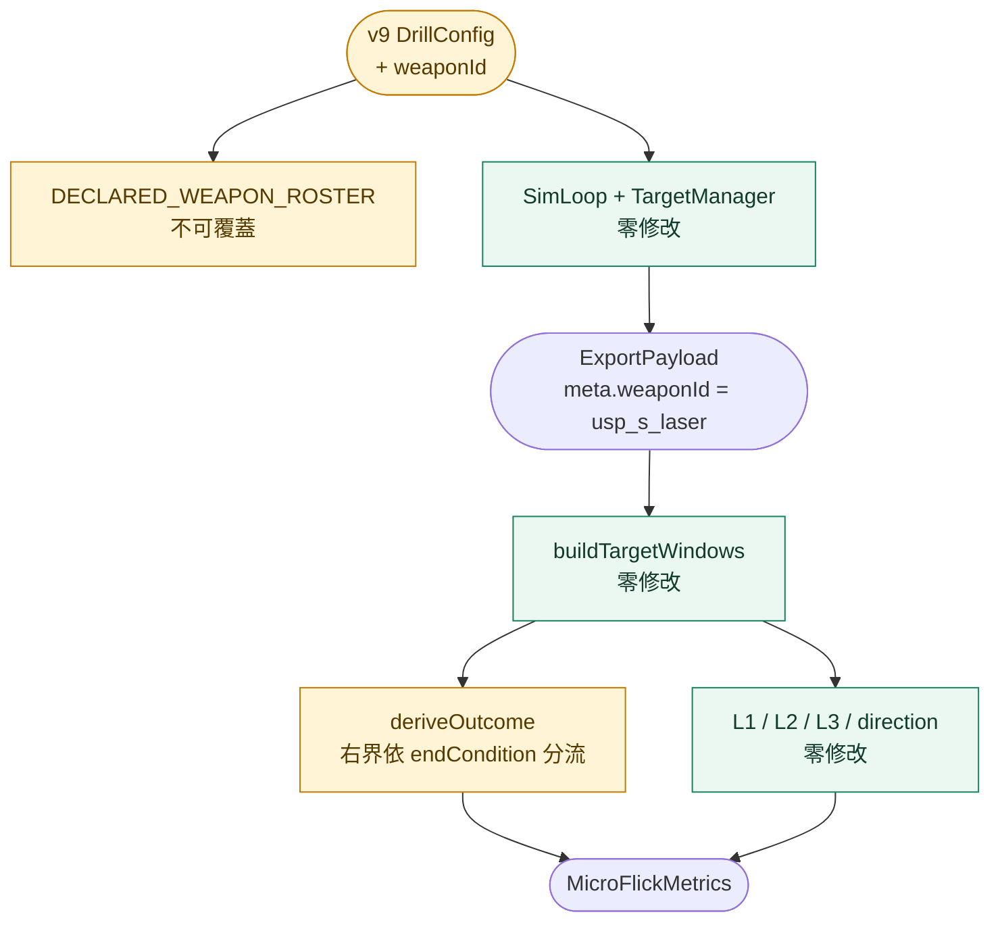

# WP-68 — Micro Flick v9 量測基礎層對齊（零散布武器 + 計時制窗界）

> 讓 `micro_flick_three_target_test_v9`（v8 的 **60 s 計時版**姊妹 drill）與 v8 取得**同等**的量測基礎層。
>
> Companion：[task-checklist.md](task-checklist.md) · [progress.md](progress.md) · 決策 `GD-45`（T-exit 入帳）
>
> 本計畫依 `.claude/skills/engineering-planning/SKILL.md`、`references/design_standards.md` 與 `assets/tech_spec_template.md` 制定，結構參照 [WP-63](../wp-63-micro-flick-v8-measurement-foundation/README.md)。**本 WP 不改 sim 演進、不改命中判定、不改 spawn 分布、不新增指標構念。**

| | |
|---|---|
| **Problem** | [WP-63](../wp-63-micro-flick-v8-measurement-foundation/README.md) 交付的量測基礎層對 v9 **結構上可用、實質上不可用**。v9 與 v8 共用同一個 population 形狀，故 `buildTargetWindows()`／`deriveMicroFlickMetrics()` 零修改就跑得動；但 v9 **沒宣告 `weaponId`** ⇒ 吃 `main.ts` 預設 `ak47`，命中與否不再是「扣扳機那一刻角誤差」的純函式。加上 `validSpanMs` 是為 **kill-budget** drill 定義的，套到 **計時制** 的 v9 上會系統性**高估** `killRateHz`（§0.2） |
| **Outcome** | v9 與 v8 在量測儀器上等價：同一把零散布零後座武器、同一套窗界原語、同一套事件錨定指標；計時制特有的窗界語意有**具名決策**而非沿用 kill-budget 的定義 |
| **Truth model** | v9 的 config 與 v8 逐欄相同，唯三差異：球徑 ×0.9（`MICRO_FLICK_V9_TARGET_DIAMETER_U` 由 v8 常數推導，兩者不可能漂移）、`endCondition: timeLimit 60000`（v8 為 `targetCount 60`）、`seed 56009`。**缺的不是指標層，是儀器宣告與一條計時制的窗界決策** |
| **Delivery policy** | 加法為主。T1 = 比照 [WP-63 T1](../wp-63-micro-flick-v8-measurement-foundation/T1-zero-spread-weapon.md) 的既有先例改 v9 fixture（1 個鍵）＋ roster 登記（1 行）。T2 **只改 `deriveOutcome()` 的窗界語意**，不動 L1／L2／L3 任何一行 |
| **Estimate** | 3 dev-days（T0／T1／T2／T-exit） |
| **Risk** | Med：T1 的風險型態與 WP-63 T1 完全相同（已有先例與現成的證明手法）；真正的新風險在 T2 —— 改 `deriveOutcome()` 會動到 v8 已交付且已釋出（v0.1.1）的數字，必須以 config 分流而非全域改寫 |
| **Milestone** | 無獨立里程碑，**T-exit gate 即交付判定**（比照 WP-60／62／63） |
| **Status** | ⬜ **未開工**（2026-09-14 規劃完成） |

### 落點說明（承 WP-63 同一先例，明帳記錄）

stage13（階段 M）的主題是「原始輸入取樣與抬滑鼠判準驗證」。本 WP **主題不屬該 stage** —— 它是 v8 量測基礎層的姊妹補齊，與 [WP-63](../wp-63-micro-flick-v8-measurement-foundation/README.md) 同源。依 WP-62／63／64／65／66／67 的同一先例落於此處；決策同步入 `GD-45` ①。

### 編號（2026-09-14 規劃期重查，T0 須再查一次）

| 項目 | 重查結果 |
|---|---|
| WP | [`exec-plan/README.md §2`](../../../README.md) 最大採納號 **WP-67** ⇒ 取 **WP-68** |
| GD | [`DECISIONS.md`](../../../DECISIONS.md) 最大已落帳 **GD-44**；`GD-43` 由 [WP-67](../wp-67-export-opening-protocol-marker/README.md) 預約（尚未落帳）⇒ 取 **GD-45**，不佔用 WP-67 的預約號 |
| stage14 候選順延 | 採納 WP-68 後，[stage14 §3](../../stage14/README.md) 的三個候選依 [GD-15](../../../DECISIONS.md)「先採納先得」順延為 **WP-69／70／71**（該檔 2026-09-14 的註記寫的是 68／70/71 的前一版，T-exit 須同步更新） |

---

## 0. Repository-grounded discovery（2026-09-14）

### 0.1 v9 現況：結構可用、儀器污染

以 WP-63 T-exit 新增的 harness（真 `TargetManager` seeded spawn、真 hitscan、真 `DataRecorder`）對 v8／v9 餵**同一份合成輸入**實測，另加一組「v9 只換武器」的對照：

| 量 | v8（已交付） | **v9（現況）** | v9 只換武器 |
|---|---|---|---|
| `meta.weaponId` | `usp_s_laser` | **`ak47`** | `usp_s_laser` |
| 窗數 === `visible` | ✅ 21/21 | ✅ 4/4 | ✅ 21/21 |
| 帶散布的發數 | 0 | **33/33** | 0 |
| 帶 aim punch 的發數 | 0 | **32/33** | 0 |
| 擊殺數 | 18 | **1** | 18 |
| `selection.n` | 17 | **0**（`no_kill_transitions`） | 17 |
| `direction` 逐 `W` 的 `n` | 17×4 | **0×4** | 17×4 |
| `geometry.cycletimeMs` | 170 | 100 | 170 |
| trace flags | `never_killed` | `never_killed`,**`ammo_exhausted_in_window`** | `never_killed` |
| `microAdjust.hitboxRadiusU` | 0.541875 | **0.4876875** ✅ | 0.4876875 |

**判讀**：

1. **窗界原語與指標模組對 v9 零修改可用** —— 窗數不變式成立、`cycletimeMs` 正確解析成 ak47 的 100（證明它讀匯出宣告的武器而非寫死常數）、`hitboxRadiusU` 正確讀到 v9 縮小 10% 的球、eye origin 正常、缺樣本一律具名旗標不補零。**沒有崩、沒有靜默算錯。**
2. **污染全部來自武器，不是來自縮小的靶** —— 只換武器一項，擊殺 1 → 18，兩個需要「擊殺→擊殺」轉移的層（L3 選擇策略、方向預測曲線）從 `n = 0` 復活到 `n = 17`。
3. ⚠️ **對照組與 v8 的數字幾乎逐位相同，那是這份合成瞄準軌跡的巧合**（offset 衰減值沒有落在兩個角半徑 1.118°–1.242° 的窄帶裡），**不是** v8 與 v9 等價的證據。本 WP 不得引用那個巧合作為任何論證。

### 0.2 `validSpanMs` 是為 kill-budget drill 定義的

[`microFlickMetrics.ts:385`](../../../../../src/metrics/microFlickMetrics.ts)：

```ts
const validSpanMs = hasSpan ? lastKillMs - firstVisibleMs : undefined;
```

對 **v8**（`endCondition: targetCount 60`）這是自然的：最後一顆被打掉，drill 就結束了，`lastKillMs` ≈ run 尾端。

對 **v9**（`endCondition: timeLimit 60000`）**不成立**：受試者在最後一次擊殺之後仍有真實的剩餘時間在打、在失手、在找靶，那段時間被整段排除出分母 ⇒ **`killRateHz` 系統性高估**。偏誤方向與 [KI-037](../../../../known_issue/KI-037-valid-duration-includes-countdown.md)（恆向低估）相反，但性質相同：一個看起來合理、實際上會說錯話的數字（C-D3）。

> **KI-037 本身不咬 v9**：它的標的是 [`DrillMetricRegistry.validDurationMs()`](../../../../../src/history/DrillMetricRegistry.ts)，走的是 history／assessment 投影路徑；v9 是 `mode: 'practice'` ⇒ 不進 registry。而 WP-63 的 `T_valid` 錨在**第一個 `visible`**（[D-63.T4-1](../wp-63-micro-flick-v8-measurement-foundation/progress.md)）已結構性避開倒數污染。⇒ 本 WP 要解的是**右界**，不是左界。

### 0.3 v9 現在就收得到資料

| 入口 | 位置 |
|---|---|
| app 變體清單 | [`main.ts:306`](../../../../../src/main.ts) |
| session family roster | [`drillFamily.ts:104`](../../../../../src/session/drillFamily.ts)（`micro-flick` 家族） |
| live e2e | [`micro-flick-live.spec.ts:318, 356, 430`](../../../../../tests/e2e/micro-flick-live.spec.ts) |

⇒ 操作員今天就能載入 v9 收資料，匯出看起來完全合理，而 `meta.weaponId` 會是 `ak47`。**這是活的風險，不是理論風險。**

### 0.4 v9 未登記於 `DECLARED_WEAPON_ROSTER`

[`drillFamily.ts:156-170`](../../../../../src/session/drillFamily.ts) 的 roster 在 WP-63 T1 收了 v8（`:169`），但 v9 不在其中 ⇒ 即使 T1 只改 fixture，Session Plan 的逐列武器指定仍可覆蓋它。武器是**量測儀器**不是操作員可選的變項（WP-62 / D-62-1 的同一紀律）⇒ 必須同步登記。

---

## 1. Requirements

### 1.1 Functional

| FR | 內容 | Task |
|---|---|---|
| **FR-68.1** | v9 fixture 必須宣告 `weaponId: 'usp_s_laser'`（使用者 2026-09-14 拍板），且該變更必須在匯出以 `meta.weaponId` 可稽核 | T1 |
| **FR-68.2** | v9 必須登記於 `DECLARED_WEAPON_ROSTER`，使其武器**不可**被 Session Plan 逐列指定覆蓋 | T1 |
| **FR-68.3** | 系統必須對 `endCondition.type === 'timeLimit'` 的 drill 以**涵蓋計分窗尾段**的右界計算 `validSpanMs`，而非截在最後一次擊殺 | T2 |
| **FR-68.4** | `endCondition.type === 'targetCount'` 的 drill（含 v8）其 `validSpanMs`／`killRateHz`／`shotsPerKill`／`shotAccuracy` 必須**逐位不變** | T2 |
| **FR-68.5** | 右界所依據的事實必須來自匯出本身（不得寫死 60000 或任何 drill 專屬常數），且無法判定時必須具名旗標而非猜測 | T2 |

### 1.2 Non-functional

| NFR | 量化指標 | Task |
|---|---|---|
| **NFR-68.1** | v1–v8 與所有非 v9 drill 的既有 golden 輸出、config 解析與 spawn trace **逐位不變**（`Object.is` 全欄位比對） | T1, T2 |
| **NFR-68.2** | T1 之後 v9 的 `sampleSpread()` 恆回 `{0,0}` 且**不消耗 recoil RNG** ⇒ 換武器不擾動任何 seeded 串流，以同 kill order 的 spawn trace 逐位比對釘死（比照 NFR-63.7） | T1 |
| **NFR-68.3** | 同一 seed 與輸入序列，v9 在 30／60／144／240 render FPS 下的逐 tick trace 與四層指標輸出**逐位一致**（複用 [`wp63-v8-metrics-determinism.test.ts`](../../../../../src/loop/__tests__/wp63-v8-metrics-determinism.test.ts) 的 harness 形狀） | T2 |
| **NFR-68.4** | 既有測試零修改全綠：`npm run typecheck`（×2）、全量 Vitest、[GD-44](../../../DECISIONS.md) 的 Edge 全量與 chromium-ci fast 兩層 Playwright（均 `--workers=1`）、`vite build` 皆 exit 0。T0 須先實測並記錄基線數字 | T0, T-exit |

### 1.3 Constraints

- **不得**更動 v9 的 spawn 場域、間距、目標數上限、球體尺寸、場景、`timeLimit` 值或 `next-tick` 生命週期
- **不得**修改 `peekWindows.ts`／`trackingDerivation.ts`／`detectionDerivation.ts`／`eyeOrigin.ts`／`angularKinematics.ts`／`submovement.ts` 任何一行（C-D4）
- **不得**新增指標構念、不得引入 movement-onset 判準（[GD-39](../../../DECISIONS.md) ② 的硬紀律）
- **不得**新增 `SharedState` 欄位、不得改 `DataRecorder` 或匯出 schema
- **不得**把 v9 提升為 Assessment、history 持久化或 replay
- **不得**修改 [`DrillMetricRegistry`](../../../../../src/history/DrillMetricRegistry.ts) —— KI-037 是另一條路徑上的另一個 bug，有自己的修法與 `BD` 號
- 階段 A 鎖 Chrome/Edge 桌面版；本 WP 不改變此前提

### 1.4 Open Questions

| OQ | 問題 | 預設假設（非阻塞） | Owner | Deadline | 影響 |
|---|---|---|---|---|---|
| ~~OQ-68.1~~ | ~~v9 要換成哪一把武器？~~ | ✅ **已關閉（2026-09-14，使用者拍板）：`usp_s_laser`**，與 v8 同一把。兩支姊妹 drill 因此在儀器上完全等價，`meta.weaponId` 不再能區分 v8／v9 —— 區分靠 `meta.drillId`（本來就是） | — | — | — |
| **OQ-68.2** | 既有 v9 匯出是否屬於某個已凍結的研究 cohort？ | **否** —— v9 為 practice/researcher-only，未進 history。T1 直接改 fixture 並以 `meta.weaponId` 斷代 | 研究者 | **T1 開工前** | 決定 T1 是改 v9 還是另開 v10 |
| **OQ-68.3** | 計時制的計分窗右界取「最後一個 tick」還是「`timeLimit` 從第一個 `visible` 起算」？ | **最後一個 tick** —— 它是匯出本身的事實（FR-68.5），不需要相信 config 與實際錄製對得上；兩者的差異須在 T2 以實測記入 `progress.md` | 實作者 | **T2 開工時** | 決定 FR-68.3 的右界定義與其旗標 |

---

## 2. Technical Design

### 2.1 System boundary

**In scope**

- v9 fixture 加 `weaponId: 'usp_s_laser'`＋`DECLARED_WEAPON_ROSTER` 登記
- `deriveOutcome()` 的 `validSpanMs` 右界依 `endCondition` 分流
- v9 的 FPS parity 覆蓋（複用既有 harness 形狀）

**Out of scope**

- 任何新指標構念；L1／L2／L3 的任何一行
- 窗界原語 `targetWindows.ts`（v9 已零修改可用，§0.1）
- `DrillMetricRegistry` 與 KI-037
- v9 進 Assessment／history／trend／replay
- 教練報告呈現層（C-D3 信度閘未過，承 [GD-39](../../../DECISIONS.md) ⑤，本 WP 同樣不宣稱任何指標可進教練報告）
- 真人 pilot 與常模

### 2.2 Interface contracts

`endCondition` 目前**不在匯出 schema 內**（與 [D-63.T5-1](../wp-63-micro-flick-v8-measurement-foundation/progress.md) 發現 `cycletimeSec` 不在 `meta.weapon` 上是同一類問題）。T2 開工第一件事是**親自複核**這一點；兩條路：

```ts
// 路徑 A（偏好）：右界直接取匯出事實，不需要知道 endCondition
//   scoringEndMs = 最後一個 tick 的 t
//   ⇒ 對 targetCount drill 與 timeLimit drill 都正確，但會改變 v8 的既有數字 ⇒ 違反 FR-68.4
//
// 路徑 B：以 drillId → drill config 查表（比照 T5 的 resolveCycletimeMs() 先例），
//   endCondition.type === 'timeLimit' 時右界取最後一個 tick，否則維持 lastKillMs。
//   ⇒ v8 逐位不變（FR-68.4），v9 涵蓋尾段（FR-68.3）。
//   代價：離線層多一個 registry 查表，且未知 drillId 須具名旗標。

export const MICRO_FLICK_OUTCOME_FLAG_VOCABULARY = [
  // …既有
  'scoring_window_truncated_at_last_kill', // 新增：右界截在最後一次擊殺（kill-budget 語意）
  'unknown_end_condition',                 // 新增：查不到 drill 的 endCondition ⇒ 退回既有語意並具名
] as const;
```

**T2 必須在 `progress.md` 明寫選了哪條路與為什麼**，並把 v9 上兩種右界的實測差值（秒數與 `killRateHz` 的相對差）記入帳本 —— 那個差值就是這條 FR 存在的理由，不能只說「已修正」。

### 2.3 Data flow（只標本 WP 的異動點）



### 2.4 Failure modes

| FM | 觸發條件 | 影響範圍 | 處理策略 |
|---|---|---|---|
| **FM-1** | T2 的右界分流誤觸 v8 | v8 的 `killRateHz` 等四量改變 ⇒ 已釋出（v0.1.1）的數字被無聲改寫 | FR-68.4 以 v8 的逐位不變斷言釘死；T2 的 DoD 要求 v8 四量 `Object.is` 比對 T1 後的值 |
| **FM-2** | 匯出的 `drillId` 查不到 config（未來新 drill／改名） | 右界無法判定 | 標 `unknown_end_condition`，退回既有 `lastKillMs` 語意並具名；**不**猜測、**不**預設成 timeLimit |
| **FM-3** | v9 run 在第一次擊殺前就結束 | 無 `lastKillMs`，既有 `no_valid_span` 已涵蓋 | 沿用既有處置，不新增分支 |
| **FM-4** | 操作員以 Session Plan 替 v9 指定別把武器 | 儀器被覆蓋，資料不可用且離線難察覺 | FR-68.2 的 roster 登記讓 `requireWeapon()` 在**模組建構期**擋掉（比照 v8） |
| **FM-5** | 既有 v9 匯出（`ak47` 世代）與 T1 後的資料混池 | 命中判定的隨機性不同，不可混比 | `meta.weaponId` 機械區分；OQ-68.2 為 T1 的 owner gate |

---

## 2b. 硬約束衝擊（`CLAUDE.md §4` 逐條過閘）

| 約束 | 是否觸及 | 說明 / 緩解 |
|---|---|---|
| 時鐘域：禁 `Date.now()`（ADR-4） | **不觸及** | T1 只改 config；T2 只消費既有匯出時間戳，新程式碼不讀任何時鐘 |
| cross-origin isolation 生效 | **不觸及**（沿用） | v9 的採集紀律沿用 [`analysis-micro-flick.md`](../../../../operational/analysis-micro-flick.md) 的既有硬閘，本 WP 不改變該契約，僅在 T-exit 補上 v9 適用性說明 |
| **決定性**：同輸入序列跨 render FPS 逐位一致 | **觸及（T1／T2）** | T1 換武器改 `state.weapon.ammo` 初值與 recoil 表 ⇒ 以 NFR-68.2 釘死（`inaccuracy` 三項全 0 ⇒ `sampleSpread` 早退不消耗 RNG）；T2 以 NFR-68.3 的四 FPS 逐位比對覆蓋 v9 |
| **三迴圈邊界**（ADR-2） | **不觸及** | T2 的異動全在離線分析層（`src/metrics/`），不在任何迴圈內、不讀寫 `SharedState`；T1 只改 config 與 roster |
| 固定佈局：ring + arena 不 `push` 物件 | **不觸及** | 不改 recorder；離線分析不在熱路徑 |
| seeded RNG（GD-5） | **觸及（T1）** | 不新增任何 RNG。換武器後 recoil RNG **零消耗**（NFR-68.2）；合成 fixture 全部決定性 |
| **GD-6** 場景幾何不進 sim | **不觸及** | 不讀 `propBounds`／GLTF mesh；v9 為 hitscan 無 occlusion context |
| **GD-9** 場景資產授權 | **不觸及** | 不新增任何場景資產；`micro-flick-room-v9` 場景本身不動 |
| **GD-11** FPSci 授權紅線 | **不觸及** | 不引用 FPSci 任何程式碼或 config |
| **GD-7** hitbox 單一來源 | **觸及（只讀）** | v9 的角半徑已由既有 `meta.targets.hitbox` 正確解析（§0.1 實測 0.4876875 = `widthU / 2`）；本 WP 不新增任何尺寸常數、不呼叫 `targetHitboxRadius()` |
| C-D1／C-D5 | **觸及（邊界宣告）** | v9 為 practice ⇒ `DrillMetricRegistry` 自動排除 ⇒ **C-D5 不觸發**，不建立 Python 對表；`research/` 側零改動。⚠️ T2 若改 `deriveOutcome()`，須確認該函式**未**被任何晉升指標消費（T2 Steps 1 的 CodeGraph 複核） |

---

## 3. 風險分析

### 3.1 Validity risk

| 風險 | 影響 | 緩解 |
|---|---|---|
| **v9 換武器造成資料斷代** | 既有 v9 匯出與 T1 後的資料**不可混比** —— 變的是命中判定的隨機性本身（有散布 → 零散布） | OQ-68.2 為 T1 的 owner gate；`meta.weaponId` 讓兩批資料可機械區分；若 OQ-68.2 答「是」則改開 v10 |
| **v8／v9 在 `meta.weaponId` 上不再可分** | 兩支姊妹 drill 用同一把武器（使用者拍板）⇒ 混池時只能靠 `meta.drillId` | 明帳限制：分析側**必須**以 `drillId` 分池；兩者的靶徑（1.08375 vs 0.975375）與計分制（kill-budget vs 60 s）不同，本來就不該混 |
| **T2 改動觸及 v8 已釋出的數字** | v0.1.1 的 v8 指標被無聲改寫 | FR-68.4 + FM-1 的逐位不變斷言；T2 的 DoD 明列 v8 四量的 `Object.is` 比對 |
| **天花板效應** | v9 靶更小（角半徑 1.118° vs v8 的 1.242°）但零散布，鑑別力仍未知 | **本 WP 無法緩解** —— 需要真人資料。承 [GD-39](../../../DECISIONS.md) ⑤ 的同一上限：本 WP 交付**可算的**指標，不是**有鑑別力的**指標 |

### 3.2 Technical debt risk

| 妥協 | 原因 | 觸發重構的條件 |
|---|---|---|
| 右界以 `drillId → config` 查表而非讀匯出的 `endCondition` | `endCondition` 不在匯出 schema 內（T2 須複核）。加進 schema 是 additive 改動，但屬匯出契約，應另開 WP（比照 [WP-67](../wp-67-export-opening-protocol-marker/README.md) 對 `meta.opening` 的處理） | 任何 WP 把 `endCondition` 或等價事實加進 `meta` 之後，本處查表應改讀匯出並移除 `unknown_end_condition` 旗標 |
| v9 不做 `?rawMouse=1` 專屬校準 | 承 [WP-63 §3.2](../wp-63-micro-flick-v8-measurement-foundation/README.md) 同一條：免閾值描述子的漏檢率需要真人 cohort | 與 v8 同一個觸發條件，兩者應一起做而非各做一次 |

### 3.3 Performance

離線分析層，不進 sim 熱路徑。v9 的 60 s × 128 Hz ≈ 7,680 ticks、`count: 600` 上限 ⇒ 規模不超過 [NFR-63.3](../wp-63-micro-flick-v8-measurement-foundation/README.md) 已實測的 180 窗／22,658 ticks（5.187 ms）。本 WP 不新增效能門檻。

---

## 4. 任務拆解

*一 task = 一垂直切片 = 一原子 commit（協議 §3.1）。*

| Task | Objective | Dependencies | Risk | Est.(d) | Definition of Done（可驗證證據） | Commit |
|---|---|---|---|---|---|---|
| **T0** | entry-gate：重查 WP／GD 編號、驗 WP-63 exit-gate 綠燈、實測基線、收斂 OQ-68.2 | — | Low | 0.5 | `DECISIONS.md` 與 `exec-plan/README.md §2` 的當下最大 WP／GD 號記入 `progress.md`；typecheck ×2／全量 Vitest／GD-44 兩層 Playwright／`vite build` 四項 exit 0 且**數字**記入 `progress.md`；CodeGraph 對 `deriveOutcome` 重跑 impact 並記錄；OQ-68.2 由研究者回答或以預設假設明帳推進 | `docs(wp-68): T0 entry-gate` |
| **T1** | v9 宣告 `weaponId: 'usp_s_laser'` + roster 登記 + 斷代標記 | T0 | Med | 1 | `micro_flick_three_target_test_variants.test.ts` 斷言 v9 的 `weaponId === 'usp_s_laser'` 且 v1–v7 的 config 鍵集合逐位不變；`drillFamily.test.ts` 斷言 v9 在 `DECLARED_WEAPON_BY_DRILL_ID` 內且不可覆蓋；新增測試以同 seed 同輸入序列比對 T1 前後的 **spawn trace 逐位相同**（NFR-68.2）；斷言 v9 條件下 `sampleSpread()` 回 `{0,0}` 且 rng 呼叫數 === 0；`meta.weaponId` round-trip 測試綠 | `feat(wp-68): T1 declare zero-spread weapon for micro flick v9` |
| **T2** | 計時制 drill 的計分窗右界 + v9 FPS parity | T1 | **High** | 1 | FR-68.3/4/5 逐條有測試；**v8 的 `validSpanMs`／`killRateHz`／`shotsPerKill`／`shotAccuracy` 對 T1 後的值逐位 `Object.is` 相同**（FR-68.4／FM-1）；v9 上兩種右界的實測差值（秒數 + `killRateHz` 相對差）記入 `progress.md`；`unknown_end_condition` 有具名測試（FM-2）；v9 的四 FPS 逐位一致斷言綠（NFR-68.3）；六個 canonical derivation 檔 `git diff` 為空 | `feat(wp-68): T2 score time-limited drills to the end of the clock` |
| **T-exit** | exit-gate：FR／NFR 逐條對帳、diff 稽核、帳本與索引更新 | T0–T2 | — | 0.5 | 每條 FR／NFR 有指令與輸出（非「已完成」）；`git diff --cached --name-only` 只含預期檔案；`GD-45` 入帳（入帳前重查號）；stage13 README §2、`exec-plan/README.md §2`、stage14 README §3（候選順延為 69／70／71）、`docs/MAP.md`、`analysis-micro-flick.md`（補 v9 適用性）五處更新；`npm run graph:update` 執行 | `docs(wp-68): T-exit gate and evidence reconciliation` |

**估時合計**：3 dev-days。

### 4.1 相依圖


全線串行：T2 的 v8 逐位不變斷言必須建立在 T1 已落地的基準上，否則兩個變因同時動，比對無法歸因。

---

## 5. 真人資料需求（誠實邊界）

承 [WP-63 §5](../wp-63-micro-flick-v8-measurement-foundation/README.md) 與 [GD-39](../../../DECISIONS.md) ⑤ 的同一分界，逐條沿用、不重複論證：

**本 WP 不需要真人資料**：武器宣告的機械正確性、seeded 串流的零擾動證明、計分窗右界的運算定義、v8 的逐位不變、決定性。

**非真人不可（本 WP 明確不宣稱）**：v9 靶徑縮小 10% 後是否仍有鑑別力、計時制與 kill-budget 兩種計分制對受試者策略的影響、以及 WP-63 §5 已列的全部五項。

⇒ **本 WP 的交付宣稱上限與 WP-63 相同 = 「可算、可重現、可稽核」，不含效度**；C-D3 閘未過 ⇒ v9 的指標同樣**不得進教練報告**。

---

## 6. Traceability

| 需求群 | 證據 owner |
|---|---|
| FR-68.1–2 | T1 fixture／roster 測試 + `meta.weaponId` round-trip |
| FR-68.3–5 | T2 右界測試（含 `unknown_end_condition` 具名案例） |
| NFR-68.1 | T1／T2 的 v1–v8 逐位不變 |
| NFR-68.2 | T1 spawn trace 逐位 + rng 呼叫數 0 |
| NFR-68.3 | T2 四 FPS parity |
| NFR-68.4 | T0 基線 + T-exit 全量閘 |
