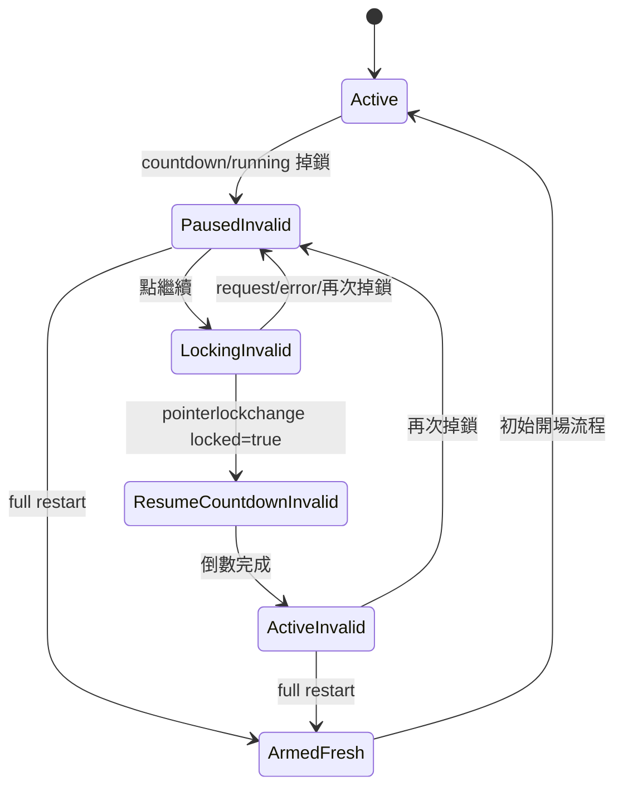
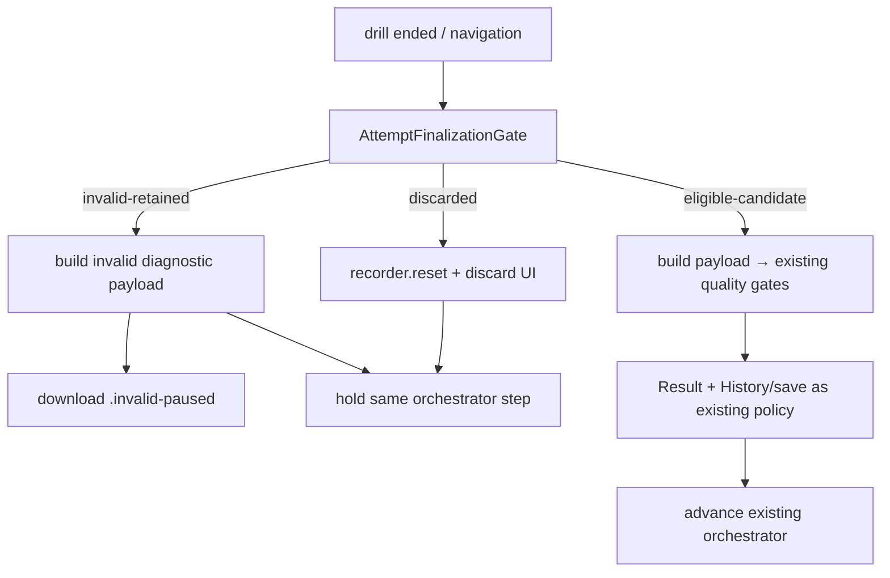

# WP-69 — 暫停後失效、時間戳完整性與整場 Restart

| | |
|---|---|
| **狀態** | 🟡 T5 已落地（2026-09-15），T6 可開工 |
| **目標** | 允許測試中暫停與繼續，但 pause 發生後該 attempt 永久不得被實驗採納；時間戳完整才保留 invalid diagnostic record，否則丟棄；只有 full restart 產生新的 eligible candidate |
| **上游** | [WP-65](../../stage13/wp-65-drill-arming-and-countdown/README.md)（arming/countdown/Pointer Lock validity）✅ |
| **決策** | [GD-46](../../../DECISIONS.md#gd-46--wp-69-暫停後永久失去實驗效力時間戳不可信即丟棄只有整場-restart-可恢復資格2026-09-15規劃)（規劃期已採納產品規則，T-exit 補實作證據） |
| **估時** | 12.5–18 dev-days |
| **Non-goal** | 不做 Settings 子選單、不做 Exit to Desktop、不允許 resume 恢復效力、不新增全域 `TimeScale`、不重定義既有 metric/threshold、不回填舊匯出 |

## 0. 可行性結論

**可行，但必須跨 application time、input、export/history 與三種 orchestrator 一起落地。** 現況的 `SimLoop.pump(now)` 會累加 rAF wall delta，單純「暫停時不呼叫 pump」會在 resume 時先補跑最多 250 ms，再走 re-anchor；這會造成 target、recorder 與 `event.timeStamp` 的時間域不一致。另一方面，`liveFrame()` 在 drill 結束後會無條件建立 payload、顯示結果、保存 history，並推進 Session/Protocol/Tracking Pilot。因此只有 UI overlay 或 `meta.suspect` 都不足以符合需求。

本 WP 採用三個集中式邊界：

1. **`PausableTimeMapper`**：把 rAF `now` 與 DOM `event.timeStamp` 映射到同一個 active measurement time；pause 時 active time 凍結，resume 後扣除 wall pause duration。零 pause 路徑必須是 identity。
2. **`RunAttemptController`**：pause lifecycle 與 sticky validity 的單一權威；不把 `paused` 塞進 `DrillPhase`。
3. **`AttemptFinalizationGate`**：唯一決定 payload 能否建立、能否下載／保存／推進，以及是否必須清空 recorder。

## 1. 需求 (Requirements)

### 1.1 Functional Requirements

| ID | Requirement | 驗證 Task |
|---|---|---|
| **FR-69.1** | `armed` 以外的錄製相位（`countdown`／`running`）一旦 Pointer Lock 遺失，立即進入 pause；sim、target、weapon、recorder tick 與 gameplay HUD time 全部凍結，rAF/UI 繼續。 | T2, T3 |
| **FR-69.2** | 第一次 pause 將 attempt validity sticky 地改為 `invalid-paused`；後續 resume、重新取鎖或倒數完成都不得恢復。 | T1, T3 |
| **FR-69.3** | `armed`、`idle`、`ended` 的取鎖變化不造成 pause invalidation；既有開場取鎖脈衝維持乾淨。 | T1, T3 |
| **FR-69.4** | Pause overlay 顯示「本次已失去實驗效力」並提供 `繼續（本次仍無效）` 與 `重新測試`；Resume click 必須同步呼叫 `requestPointerLock()`，以 `pointerlockchange` 為成功權威。 | T3 |
| **FR-69.5** | Resume 取鎖成功後先跑以該 drill `timing.countdownMs` 為來源的恢復倒數；倒數期 gameplay input 與 camera delta 仍被阻斷。取鎖失敗留在 paused 並顯示可重試錯誤。 | T3 |
| **FR-69.6** | full restart 清除 pause/integrity/disposition、recorder、frame log、result/HUD、sim tick index 與 RNG stream，保留同一 drill/config/scene/weapon/seed，回到既有 `armed`，建立新的 attempt number。 | T1, T3 |
| **FR-69.7** | Finalization 產出三態：`eligible-candidate`、`invalid-retained`、`discarded`。`eligible-candidate` 仍須通過所有既有資格／品質閘，不因 restart 自動視為 accepted。 | T1, T4 |
| **FR-69.8** | `invalid-retained` 僅在 pause 後時間戳完整性通過時成立；payload 必須自述 `meta.validity.pauseOccurred=true`，檔名帶 `.invalid-paused`，不得進正式 history/trend/threshold，也不得讓 Session/Protocol/Pilot 前進。 | T1, T4, T5 |
| **FR-69.9** | 時間戳完整性無法證明時產出 `discarded`：不得建立/序列化 payload、不得下載/保存/replay，不顯示由不可信資料算出的 metrics；清空 recorder 並要求 restart。 | T1, T4 |
| **FR-69.10** | SessionRunner、ProtocolRunner、TrackingPilotRunner 都必須停在同一 run/condition/block；restart 後 attempt +1 且 seed/config 不變。過去 invalid/discarded attempt 只能進 audit log，不佔正式 export 槽。 | T5 |
| **FR-69.11** | `pointerLockLost` 與 `pauseOccurred` 保持兩個構念：前者記輸入鎖遺失事實，後者控制 attempt 採納；錄製中掉鎖會同時為 true，舊 payload 相容。 | T1, T4 |
| **FR-69.12** | 離開或切換 drill/scene/weapon 時若有 paused attempt，依同一 finalization gate 處理，禁止繞過 discard/invalid 規則。 | T4 |

### 1.2 Non-functional Requirements

| ID | Requirement |
|---|---|
| **NFR-69.1** | 從未 pause 的路徑，跨 30/60/144/240 FPS 的 tick-index state、事件落 tick、輸出 schema 與既有 golden 逐位不變；time mapper 在首次 pause 前為 identity。 |
| **NFR-69.2** | pause 期間 `simLoop.pump(mappedNow)` 每幀回 `ticks=0`；resume 第一幀不得 catch up、不得觸發 >250 ms re-anchor。 |
| **NFR-69.3** | resume 後 tick/event timestamps 皆 finite、單調不減，且映射到同一 active time origin；pause wall interval 不出現在 gameplay elapsed time。 |
| **NFR-69.4** | pause 與 resume-countdown 期間 mouse、fire、ADS、A/D/W/S 皆不進 ring/camera；pause 邊界合成 release 不留下 held state。 |
| **NFR-69.5** | 每 tick/per-event 熱路徑不新增物件配置或動態陣列；time mapping 為 O(1) 純算術，recorder arena 與 input ring 固定佈局不變。 |
| **NFR-69.6** | UI 維持純 TypeScript + DOM overlay；Chrome/Edge desktop 實機 Pointer Lock e2e 覆蓋 resume 成功與失敗。 |
| **NFR-69.7** | invalid/discarded attempt 對 `HistoryClient.saveRun`、正式下載與任何 orchestrator advance 的呼叫數皆為 0；由 spy/e2e 反證。 |
| **NFR-69.8** | 完整 restart 後，以同 seed + 同輸入重跑，其 tick-index state 與從未 pause 的 fresh run 逐位相同。 |

### 1.3 Acceptance semantics

| Disposition | 條件 | Record | History / trend / threshold | Orchestrator |
|---|---|---|---|---|
| `eligible-candidate` | 從未 pause 且 recording integrity 通過 | canonical payload | 再交既有 gates 判定 | 可依既有流程前進 |
| `invalid-retained` | 曾 pause，且 resume 後時間軸可證明連續 | `.invalid-paused` diagnostic payload | **禁止** | 停在原 step，等待 full restart |
| `discarded` | 時間軸不連續、非 finite、overflow 或 pause fence 無法閉合 | **無 payload；arena 清空** | **禁止** | 停在原 step，等待 full restart/離開 |

`invalid-retained` 不是「低品質但可接受」；它是**明確不可採納、僅供稽核**。`eligible-candidate` 也不是 accepted；它只是有資格再接受既有 eligibility、quality 與 compatibility gates。

### 1.4 Open Questions

**全部已於 T0 關閉（2026-09-15，使用者拍板）**，證據與後果見 [progress.md §T0.6](progress.md)。

| ID | 問題 | 結論 | 與規劃期預設 | 影響 |
|---|---|---|---|---|
| **OQ-69.1** | invalid diagnostic record 要自動下載，還是只在結果頁提供手動下載？ | **只在結果頁提供手動下載鈕**；檔名仍強制 `.invalid-paused`，仍不得存 history | ⚠️ **推翻預設**（原為自動下載） | T4 不接自動下載，改為 Result 上的顯著下載控件。⚠️ `#drill-controls`（z-index 32）蓋在 `#result-screen`（30）之上 ⇒ 按鈕位置與 T6 點擊斷言有硬性要求（見 §T0.6）；殘餘風險：操作員不按即等於未保留 |
| **OQ-69.2** | 是否只把明確 `Esc` 算 pause？ | **任何 recording-time Pointer Lock loss 都算**；Web API 無可靠方式區分 Esc、blur、權限或瀏覽器回收 | 維持預設 | 與 [main.ts:1474](../../../../../src/main.ts#L1474) 既有 `pointerLockLost` 的相位判準逐字同窗，不新增第二套定義（C-D4） |
| **OQ-69.3** | `bufferOverflow`/`recorderOverflow` 是否一律歸 `discarded`？ | **只要發生於 paused attempt 就 discard**；乾淨未 pause run 維持既有 suspect 語意 | 維持預設 | 入封閉詞彙 `pause-attempt-overflow`（§T0.5 #8）；不偷改全域品質政策 |

## 2. 技術設計 (Technical Design)

### 2.1 State model

```ts
type PauseRuntimePhase = 'active' | 'paused' | 'locking' | 'resume-countdown';
type AttemptValidity = 'eligible-candidate' | 'invalid-paused';
type AttemptDisposition =
  | { kind: 'eligible-candidate' }
  | { kind: 'invalid-retained'; reason: 'paused' }
  | { kind: 'discarded'; reason: RecordingIntegrityReason };

interface RunAttemptController {
  readonly phase: PauseRuntimePhase;
  readonly validity: AttemptValidity;
  readonly attempt: number;
  pause(atWallMs: number): void;
  beginResume(): void;
  confirmLock(atWallMs: number): void;
  finishResumeCountdown(atWallMs: number): void;
  restart(): void;
  finalize(snapshot: RecordingSnapshot): AttemptDisposition;
}
```

`DrillPhase = idle | armed | countdown | running | ended` 保持不變。Pause controller 保存底層 phase；pause/resume 不呼叫 `DrillRunner.start()` 或 `restart()`。只有按下 Restart 才走唯一的 `restartActiveDrill()` coordinator。

狀態轉換：



### 2.2 Active measurement time

```ts
interface PausableTimeMapper {
  /** 首次 pause 前嚴格等於 wallNowMs；pause 時回固定值。 */
  mapWallTime(wallNowMs: number): number;
  pause(wallNowMs: number): void;
  resume(wallNowMs: number): void;
  restart(wallNowMs: number): void;
}
```

- `realClock.now()`、rAF `now`、DOM `event.timeStamp` 仍共享 Chromium time origin。
- app 傳 `mapper.mapWallTime(now)` 給 `SimLoop.pump()`；InputSampler 寫 ring 前也用同一 mapper。
- pause 時 rAF 繼續，但 mapped time 不動，所以 accumulator 不增加；resume 後累積 wall pause duration 被扣掉，第一幀沒有 catch-up/re-anchor。
- time mapper 不改 `SimLoop` 固定 128 Hz 演算法；首次 pause 前是 identity，守住既有 determinism baseline。
- timestamp health validator 釘住：pause fence 閉合、ticks/events finite 且單調、pause 期間零 gameplay tick/event、resume 首 tick 與前一 tick 相差恰為一個固定 tick（允許既有 sub-tick event 落桶規則）、paused attempt 無相關 overflow。T0 必須以現行 fixtures 實測後凍結封閉的 `RecordingIntegrityReason`，不得邊實作邊放寬。

### 2.3 Input and Pointer Lock

- `PointerLock` 的 `pointerlockchange` 仍是鎖定權威；Resume button 的 click handler 必須在 user gesture stack 內立即呼叫 `request()`。
- `InputSampler` 接受 `isGameplayInputEnabled()` 與 `mapEventTime()` 注入。pause/locking/resume-countdown 時所有 gameplay down/move 都拒收。
- pause 邊界呼叫單一 `suspend(atActiveMs)`：對 sampler 已採計的 fire/ADS/movement held state 補送 release edge；不得直接由 UI 寫 `SharedState.held*`。
- camera 的 `pointerLock.onMove` consumer 使用同一 enable gate，避免 resume-countdown 已鎖定但視角偷跑。
- 取鎖成功只進 `resume-countdown`；倒數完成後才解除 input/camera gate。

### 2.4 Finalization gate

```ts
interface AttemptFinalizationGate {
  decide(attempt: AttemptSnapshot, recording: RecordingSnapshot): AttemptDisposition;
}
```

`liveFrame()`、restart、換 drill/scene/weapon 與 protocol completion 不得各自重寫條件，全部先過此 gate：



Defense in depth：`HistoryPersistence.save()` 新增 `excluded: invalid-attempt`，即使未來 caller 漏掉 app gate 也不得把 `pauseOccurred=true` 的 assessment run 寫入 history。正式 download helper 與 replay entry 也各有一條拒收測試。

### 2.5 Orchestrator semantics

- **SessionRunner**：invalid/discarded 時不呼叫 `advance()`，cursor/`RunStep` 不變；restart 仍由同一 step `loadDrillById`/active config 啟動 attempt +1。
- **ProtocolRunner**：不得呼叫 `completeCurrentCondition()`，不得 push `exports[]`，不得觸發 `onProtocolComplete`；restart 重跑 current condition。
- **TrackingPilotRunner**：新增「discard/retry current running block」的明確入口，保留 `{blockIndex, previousAttempt, reason, disposition}` audit，payload 僅在 `invalid-retained` audit record 上可選存在；不得借用 `abortCurrentBlock()`，因它會前進。
- 三者共用 `AttemptDisposition`，不得各自從 `meta.suspect` 猜測。

### 2.6 Data contract

- `Meta.validity.pauseOccurred`：optional-in / required-out boolean；舊 payload 缺席解析為 `false`。
- `pointerLockLost` 保留；錄製中掉鎖的新資料同時寫 `pointerLockLost=true` 與 `pauseOccurred=true`。
- `meta.suspect` 繼續 OR 入 `pauseOccurred`，但正式採納由 `AttemptFinalizationGate` 額外 hard reject，不能依賴 suspect。
- `schemaVersion` 維持 2（additive change）；與未開工 [WP-67](../../stage13/wp-67-export-opening-protocol-marker/README.md) 的 `meta.opening` digest/鍵面在 T0 對帳，兩案不得互相覆蓋 fixture 基線。
- discarded 不存在 payload，因此其 reason 僅進 app/orchestrator audit，不得偽造一份空 payload。

## 2b. 硬約束衝擊 (Hard-constraint impact)

| CLAUDE.md §4 約束 | 是否觸及 | 設計與驗證 |
|---|---|---|
| 時間戳只用 `performance.now()`，禁 `Date.now()` | **觸及** | mapper 只映射同 time-origin 的 rAF/DOM/performance 值；時間測試掃描 `Date.now` 零新增 |
| cross-origin isolation | 不改 | bootstrap/headers 不動；live e2e 仍要求 `crossOriginIsolated=true` |
| 固定 128 Hz determinism | **觸及** | 不改 tick dt；零 pause identity、pause 零 tick、restart fresh-run parity 三組測試 |
| 移動目標 age-driven pure、禁讀時鐘 | 不改 | target motion 不改；只收到映射後既有 `tickEndMs` |
| input/sim/render 只經 `SharedState` 溝通 | **觸及** | input gate/synthetic release 寫既有 ring；render 只讀 attempt phase；UI 不直寫 sim held state |
| input true ring、固定欄位、消費後重用 | **觸及但不改佈局** | mapper 在 push 前 O(1)；不新增 event variant/欄位、不 resize |
| `DataRecorder` preallocated arena、不 wrap | **觸及但不改佈局** | pause 期間不 record；discard/restart 原地 `reset()`，不配置第二個 recorder |
| UI 純 TS + DOM overlay | **觸及** | `PauseOverlay.ts` 建構期配置，更新只改 text/style；零框架 |
| Chrome/Edge desktop | **觸及** | Pointer Lock user gesture 與 `event.timeStamp` 同源只在鎖定平台驗證 |
| seeded RNG、禁 `Math.random()`、seed 入 metadata | 不改 | pause 不消費 RNG；restart 重建同 seed stream並做 parity |
| 場景幾何永不進 sim | 不改 | pause controller 不讀 scene geometry |
| 資產授權紀律 | 不改 | 不新增資產，overlay 全 CSS/DOM |
| 解析度/場景切換不改 sim 演進 | **接線觸及** | navigation 先走 finalization gate；換場景的既有 sim 語意不改 |
| hitbox 單一來源 | 不改 | 不碰命中或幾何 |
| ADS 僅 input/render/data | **觸及** | pause 只在 input gate 合成 ads-up，零命中/彈道改動 |
| projectile config gate | 不改 | 不碰 `WeaponConfig.bullet` 或 hitscan/projectile 分支 |
| tracer render-only | 不改 | pause 不寫 tracer；rAF 可繼續畫 frozen state |
| muzzle origin 與命中/彈道分離 | 不改 | 不碰 muzzle/raycast/bullet arena |
| `research/` 單向消費 `src/` 匯出 | 不改 | 本 WP 無 Python 寫入需求；invalid payload仍是 schema v2 |
| `research/algorithms` 純函式 | 不改 | 不新增 research algorithm |
| C-D3 未過 gate 不進教練報告 | **強化** | pause invalid hard reject，不進正式 history/trend/report |
| C-D4 既有構念不得第二定義 | **觸及** | disposition/clock/finalization 各一個權威；orchestrator 不重算 |
| C-D5 晉升指標雙實作對表 | 不改 | 不新增或修改任何 promoted metric |

## 3. 風險分析 (Risk Analysis)

| Failure mode | 後果 | 緩解 / 機械證據 |
|---|---|---|
| **FM-1** 只停止呼叫 `pump` | resume catch-up/re-anchor，事件落錯 tick | mapped active time 每 rAF 都餵 pump；NFR-69.2 |
| **FM-2** 只用 `meta.suspect` | History 現況仍會保存 suspect assessment | app central gate + HistoryPersistence defense-in-depth；save call count=0 |
| **FM-3** pause 塞進 `DrillPhase` | 改變 countdown recording 與 9+ callers，破壞 WP-65 | 正交 `PauseRuntimePhase`；`DrillPhase` diff 必須為零 |
| **FM-4** Resume click 先 `await`/排程再 request lock | 瀏覽器判定失去 user gesture，無法取鎖 | click stack 同步 request；以 `pointerlockchange/error` 收斂 |
| **FM-5** 只擋 mouse/fire，不擋 keyboard/camera | pause 操作期間視角/held movement 偷跑 | 單一 gameplay-input gate + synthetic release + camera consumer 共用 |
| **FM-6** invalid result仍推進 orchestrator | 後續條件覆蓋 current config，無法整場重測 | 三 runner 對 `advance/complete/exports` 的零呼叫反證 |
| **FM-7** discarded 還先建 payload/metrics | 不可信資料已洩漏到 UI、replay 或下載 | disposition 在 snapshot/metrics 之前決定；discard 路徑明確無 payload |
| **FM-8** restart 只清 UI | sticky flag、RNG、tick index、held input污染下一場 | 單一 full-restart coordinator；fresh-run parity |
| **FM-9** WP-67 平行修改 schema/digest | additive 欄位互相覆蓋 fixture 或誤判舊檔 | T0 重查 WP-67 狀態、rebase 後鍵面/digest 合併驗證 |

### Technical debt / performance

- `main.ts` 仍是 orchestration god node；本 WP 只抽出 `RunAttemptController`、`PausableTimeMapper` 與 `AttemptFinalizationGate` 三個可測模組，不藉機重構整個 bootstrap。
- mapper 每事件只有常數次減法/比較；不新增 tick/event object allocation。Pause overlay 的 DOM 只建一次。
- ~~invalid diagnostic auto-download（OQ-69.1 預設）的容量成本~~ —— **T0 已推翻該預設**（改為結果頁手動下載），此成本不再存在；改為承擔「操作員不按即未保留」的殘餘風險（見 §1.4）。

## 4. 任務拆解 (Task Breakdown)

| Task | Objective | Dependencies | Risk | Complexity | 估時 | Commit |
|---|---|---|---|---|---:|---|
| **[T0](T0-entry-gate.md)** ✅ | Entry gate：重查編號/WP-67、凍結 baseline、time/integrity spike、關閉 OQ | — | High | Med | 1–1.5 d | `docs(wp-69): T0 entry gate for pause validity` |
| **[T1](T1-attempt-disposition-contract.md)** ✅ | `RunAttemptController` + disposition/integrity contract + additive metadata/parser | T0 | High | Med | 2–2.5 d | `feat(attempt): add sticky pause validity contract` |
| **[T2](T2-pausable-time-mapper.md)** ✅ | `PausableTimeMapper` 接 SimLoop/HUD/recorder，證明 freeze/no-catch-up/zero-pause identity | T1 | **High** | High | 2–3 d | `feat(loop): freeze active time during paused attempts` |
| **[T3](T3-input-pointer-lock-overlay.md)** ✅ | Input/camera gate、Pointer Lock resume、倒數與 PauseOverlay/Restart | T2 | High | High | 2–3 d | `feat(ui): add invalidating pause and full restart controls` |
| **[T4](T4-finalization-persistence-gate.md)** ✅ | Central finalization gate、invalid diagnostic export、discard、History/replay/navigation 防線 | T1–T3 | **High** | High | 2–3 d | `feat(data): gate finalization by attempt disposition` |
| **[T5](T5-orchestrator-retry.md)** ✅ | Session/Protocol/Tracking Pilot 留在同一步並支援 full retry/audit | T4 | High | High | 2–3 d | `feat(session): retry invalid attempts without advancing` |
| **[T6](T6-e2e-regression-docs.md)** | Live Edge E2E、全量回歸、文件/術語與操作說明 | T1–T5 | Med | Med | 1–1.5 d | `test(wp-69): verify pause discard and restart lifecycle` |
| **[T-exit](T-exit-gate.md)** | A-69.1～A-69.12 證據、GD-46 翻 ✅、索引狀態收尾 | T1–T6 | Low | Low | 0.5 d | `docs(wp-69): T-exit evidence for pause validity` |

建議順序：`T0 → T1 → T2 → T3 → T4 → T5 → T6 → T-exit`。這個 WP 不適合把 T2/T3/T4 平行開工，因為三者共享同一個 pause boundary 與 time/disposition contract。

## 5. 影響面摘要

CodeGraph 規劃期 blast-radius 顯示：`createSimLoop` 有 53 個 callers/test references、`Clock` 有 43 個、`DrillRunner` 有 9 個；`createInputSampler` 有 2 個 callers且有單元測試；`HistoryPersistence` 為單一 app caller；`SessionRunner`、`ProtocolRunner`、`TrackingPilotRunner` 各有既有測試。T0 必須重新跑 CodeGraph impact，若 index pending 則直接讀列名檔案後再落實，不得沿用本段行號。

主要預期檔案：

- `src/attempt/RunAttemptController.ts`, `AttemptFinalizationGate.ts`
- `src/loop/pausableTimeMapper.ts`, `src/main.ts`
- `src/input/InputSampler.ts`, `src/input/PointerLock.ts`, camera input wiring
- `src/ui/PauseOverlay.ts`, `src/ui/ResultScreen.ts`
- `src/data/metadata.ts`, `src/data/exportPayloadSchema.ts`, `src/history/HistoryPersistence.ts`
- `src/session/SessionRunner.ts`, `src/display/ProtocolRunner.ts`, `src/session/TrackingPilotRunner.ts`
- matching unit/regression/e2e tests and `docs/operational/`

## 6. Assumptions

1. Pause 的 production trigger 是 recording-time Pointer Lock loss；瀏覽器不能可靠區分 Esc 與 blur，所以預設同樣失效。
2. Pause invalidation 的 scope 是一個 run attempt，不是整個 session；full restart 重跑同一步即可恢復 candidate eligibility。
3. Restart 重播同 seed 刺激，承 [GD-35](../../../DECISIONS.md#gd-35--wp-58-session-program-scheduler--編號分配--四個新家族-id--兩值休息語意--frozencustom-雙軌--家族歸屬--assessment-資格2026-09-08wp-58-t0) 的 repeated-exposure 政策；分析端仍不得把 attempts 當 i.i.d.
4. `schemaVersion=2` 可用 additive optional-in 欄位承載 `pauseOccurred`；若 WP-67 先落地，T0 依其最新 canonical key/digest 合併，不升版。
