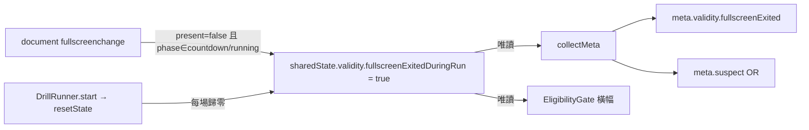

# WP-70 — 條件失效的效力單位改為 run，並補上恢復條件的入口

| | |
|---|---|
| **狀態** | ⬜ 規劃完成，未開工 |
| **目標** | `meta.suspect` 的 fullscreen 成分由「session 級 sticky」改為「**該次 run 的錄製窗內是否掉出全螢幕**」，與已經是 per-run 的 perf 成分對齊；並提供不重啟 plan 的「恢復條件」入口，讓操作員能回到全螢幕續跑同一項 |
| **來源** | [KI-040](../../../../known_issue/KI-040-fullscreen-suspect-never-resets-and-restart-cannot-recover.md)（診斷 + 使用者拍板方向） |
| **上游** | [WP-69](../../stage15/wp-69-pause-invalid-restart/README.md) ✅（attempt 級 pause/restart 已交付；本 WP 讓 fullscreen 與其語意對稱） |
| **決策** | `GD-47`（預約，T0 重查）——run 級判準；另需對 [GD-10](../../../DECISIONS.md#gd-10--顯示硬體策略--全遠端--三道防線2026-07-06) 補一條澄清註記 |
| **估時** | 6–9.5 dev-days |
| **Non-goal** | 不改 KI-007 的 recording 窗界定義、不把 pause 排除在錄製窗外、不改 eligibility gate 的三項檢查門檻、不改 perf floor 常數、不動 WP-69 的三態 disposition、不回填舊匯出 |

## 0. 可行性結論

**可行，且比 KI-040 初估的小。** 關鍵發現是 repo 內**已經有一個逐字同型的先例**：WP-65 T5 對
「錄製中掉鎖」做的正是本 WP 要對「錄製中掉出全螢幕」做的事 ——
`sharedState.validity.pointerLockLostDuringRun` 由 DOM 事件處理器在 `phase ∈ {countdown, running}`
時置真、由 `resetState()`（`DrillRunner.start()` 內，[DrillRunner.ts:190](../../../../../src/drill/DrillRunner.ts#L190)）
每場歸零、經 `meta.validity.pointerLockLost` 匯出並 OR 進 `meta.suspect`。

⇒ 本 WP 的核心（T1）是**照抄該 pattern 換一個旗標**，不是重新設計 `experimentSession`。
KI-040 §6.2 曾估「`experimentSession` 要從 session 級累加器改為 per-run 計算」，那是在尚未發現此
先例時寫的；實際上 per-run 儲存與歸零點都已存在，`experimentSession` 只需停止供應 export 路徑的
fullscreen 成分。

### 0.1 現況的真正不對稱（本 WP 存在的理由）

```
meta.suspect = (experimentSession.suspect || frames.summary.p95 > PERF_FLOOR_MS)
                └─ session 級 sticky，永不復位        └─ per-run（frameLog 每場 reset）
```

同一個欄位的兩個成分**scope 不一致**。本 WP 讓左半邊與右半邊對齊，而不是發明新的 scope。

### 0.2 ⚠️ 對 GD-10 的影響比 KI-040 初估的小（T0 必須複核此判讀）

逐字重讀 [GD-10](../../../DECISIONS.md) ①：「效能地板(per-frame time log 超標 → session 標
`suspect`/剔除)」——GD-10 把 "session 標 suspect" 綁在**效能地板**上，而該成分在實作上**早就是
per-run**（`frameLog` 每場 reset）。GD-10 的條文**並未**規定「錄製中退出 fullscreen ⇒ session 級
sticky suspect」；那是 WP-20 T2 實作時的延伸（見
[`experimentSession.ts`](../../../../../src/display/experimentSession.ts) docstring）。

⇒ 本 WP **不是推翻 GD-10**，而是（a）修正 WP-20 T2 延伸出來的 scope 不一致，（b）對 GD-10 補一條
澄清註記說明 suspect 的效力單位是 run。`GD-47` 記錄這條判準本身。**若 T0 複核後認為這仍構成對
GD-10 的實質修改，則改為修訂 GD-10 並在 `GD-47` 註明**——不得靜默擇一。

## 1. 需求 (Requirements)

### 1.1 Functional Requirements

| ID | Requirement | 驗證 Task |
|---|---|---|
| **FR-70.1** | 系統必須以「該次 run 的錄製窗（`countdown`/`running`）內是否發生 fullscreen 退出」決定該 run 的 fullscreen suspect 成分；跨 run 不得繼承。 | T1 |
| **FR-70.2** | 系統必須在 `meta.validity` 提供 `fullscreenExited` 具名布林欄位，使 payload 可自述 suspect 的來源；現行 payload 無法區分 suspect 來自 fullscreen 或 perf floor。 | T1 |
| **FR-70.3** | `meta.validity.fullscreenExited` 必須為 optional-in／required-out（缺席解析為 `false`），舊 payload 可解析；`schemaVersion` 維持 2。 | T1 |
| **FR-70.4** | 從未發生 fullscreen 退出的路徑，其 `meta.suspect` 與所有既有欄位必須逐位不變。 | T1 |
| **FR-70.5** | Protocol 路徑（`markCurrentConditionSuspect('fullscreen-exit')`）必須套用與 session plan **相同**的 KI-007 錄製窗判準；現行該路徑未套用，drill 之間退出全螢幕也會標記 condition。 | T2 |
| **FR-70.6** | Suspect 橫幅的顯示與隱藏必須由旗標真值驅動，不得依賴「有沒有人呼叫 `hideSuspectWarning()`」；新 run 開始即反映新的真值。 | T3 |
| **FR-70.7** | 橫幅與相關文案必須改為 run 級措辭；現行「本 session 資料標記為 suspect」在新判準下是錯的。 | T3 |
| **FR-70.8** | 系統必須提供「恢復條件」入口：在不重啟 Session Plan／protocol 的前提下重新請求 fullscreen 並重跑 perf 探測，通過後回到**同一項**。 | T4 |
| **FR-70.9** | 恢復條件流程必須在 user gesture 內請求 fullscreen；失敗（使用者拒絕、perf 不過）必須留在原畫面並顯示可重試的具名原因，不得靜默或強制前進。 | T4 |
| **FR-70.10** | 恢復條件流程不得呼叫 `sessionPlanRunner.start()`／`startProtocol()`，不得改變 cursor／conditionIndex／`exports[]`，不得產生下載。 | T4 |
| **FR-70.11** | 「繼續本項」必須是 **restart 本項**：依 WP-69 既成語意（OQ-69.4），暫停中結算不留 payload，入口文案不得暗示接續錄製。 | T4 |

### 1.2 Non-functional Requirements

| ID | Requirement |
|---|---|
| **NFR-70.1** | 零 fullscreen 退出的路徑，跨 30/60/144/240 FPS 的 tick-index state 與輸出 schema 逐位不變；`tests/regression` 計數零漂移。 |
| **NFR-70.2** | canonical fixture digest 的移動筆數必須**事前預測並事後逐筆吻合**（`meta.validity` 為 required-out ⇒ 只動帶 `meta.validity` 父物件者，預測 3 筆，與 WP-65／WP-69 同一族）。第 4 筆變動即 bug。 |
| **NFR-70.3** | 本 WP 不得新增任何 sim 迴圈、`SharedState` 熱路徑或命中判定的工作；新旗標為既有 `validity` 物件的一個固定欄位，不新增配置、不 resize。 |
| **NFR-70.4** | 恢復條件流程的 DOM 於建構期一次配置，更新只改 text/style；零框架（D1）。 |
| **NFR-70.5** | 恢復條件流程對 `sessionPlanRunner.advance()`／`completeCurrentCondition()`／`downloadJSON`／`historyPersistence.save()` 的呼叫數皆為 0；由 spy 反證。 |
| **NFR-70.6** | Chrome/Edge desktop 實機 e2e 必須覆蓋「真的進入 fullscreen → 錄製中退出 → 該 run 標記 → 恢復 → 下一 run 乾淨」完整鏈路。⚠️ 可行性由 T0 驗證（見 OQ-70.1）。 |

### 1.3 Open Questions

| ID | 問題 | Owner | Deadline | Impact |
|---|---|---|---|---|
| **OQ-70.1** 🔴 | Playwright 能否在 `--project=edge` 下可靠地進入真 fullscreen 並觸發 `fullscreenchange`？`Element.requestFullscreen()` 需要 user activation，Playwright 的合成點擊是否足夠未經驗證。**若不可行**，NFR-70.6 必須降級為具名替代證據（手動實機清單 + 單元層 fullscreenchange 注入），而非靜默放過 | T0 | T0 結束 | **T5 全部**；決定 T5 是 e2e 任務還是手動驗證清單任務 |
| **OQ-70.2** 🟡 | `experimentSession.suspect` 在 export 路徑被取代後是否仍有消費者？若無，是刪除還是保留為 session 級稽核觀測（「本 session 曾發生過中斷」）？刪除較乾淨；保留則需回答「誰讀它」 | T1 | T1 | T1 的刪改範圍；若保留需一併決定是否進 export |
| **OQ-70.3** 🟡 | 恢復條件流程要不要重跑**原生解析度**檢查？perf 與 fullscreen 顯然要重驗，但解析度在 session 中途不會變（除非使用者拖到別的螢幕——這正是會變的情況） | T4 | T4 | T4 的檢查項清單；影響流程耗時與失敗率 |
| **OQ-70.4** 🟡 | 既有已下載的匯出檔（瀏覽器下載資料夾，repo 掃不到）是否需要操作員自查清單？`data/session-history/` 已確認為零筆（KI-040 §8） | 使用者 | T6 | T6 的文件範圍；不阻塞程式修改 |

## 2. 技術設計 (Technical Design)

### 2.1 System boundary

**In scope**

- `src/state/SharedState.ts`：`validity` 新增一個固定布林欄位 + `resetState()` 歸零
- `src/main.ts`：`fullscreenchange` 處理器、`collectMeta()` 的 suspect/validity 組裝、恢復條件流程接線
- `src/data/metadata.ts` / `src/data/exportPayloadSchema.ts`：additive 欄位 + parser
- `src/ui/EligibilityGate.ts`：橫幅真值驅動 + 文案
- 新檔 `src/ui/ConditionRecoveryScreen.ts`（或等價）：E2 入口
- `src/display/ProtocolRunner.ts` 接線點的錄製窗判準（T2）
- 對應單元／回歸／e2e 測試與 `docs/operational/`

**Out of scope**

- KI-007 錄製窗界的**定義**（`countdown`/`running`）——不改，含「暫停期間仍屬錄製窗」（KI-040 OQ-KI-040-1 已拍板維持現狀）
- eligibility gate 的三項檢查**門檻**（`SESSION_PLAN_MIN_CONDITION`、`PERF_FLOOR_MS`）
- WP-69 的 `AttemptDisposition` 三態、`PausableTimeMapper`、`RunAttemptController`
- sim 迴圈、命中判定、彈道、場景、目標演進——本 WP 一行都不碰
- 舊匯出回填

### 2.2 Data flow（新旗標，逐字比照 WP-65 T5）



方向為 **DOM 事件 → `SharedState` → data/UI 唯讀**，與 `pointerLockLostDuringRun` 完全同型
（[main.ts:1877](../../../../../src/main.ts#L1877) 的既有寫法即範本）。

### 2.3 Interface contracts

```ts
// src/state/SharedState.ts — validity 物件新增一欄（固定佈局，不新增配置）
interface SharedStateValidity {
  playerCorridorExceeded: boolean;
  pointerLockLostDuringRun: boolean;
  /** WP-70：本次 run 的錄製窗內是否發生 fullscreen 退出。`resetState()` 每場歸零。 */
  fullscreenExitedDuringRun: boolean;
}

// src/data/metadata.ts — Meta['validity'] 新增一欄（required-out）
interface MetaValidity {
  corridorExceeded: boolean;
  perfFloor: boolean;
  recorderOverflow: boolean;
  bufferOverflow: boolean;
  pointerLockLost: boolean;
  pauseOccurred: boolean;
  /**
   * WP-70：本次 run 錄製中是否退出過 fullscreen。與 `perfFloor` 同為 run 級。
   * ⚠️ 與 `pointerLockLost` 是兩個構念：Esc 常同時觸發兩者，但視窗切換只觸發本欄。
   */
  fullscreenExited: boolean;
}

// src/data/exportPayloadSchema.ts — optional-in（缺席 = false）
validity?: { /* …既有… */ fullscreenExited?: boolean };
```

```ts
/**
 * WP-70 / T4 — 恢復條件流程：在不重啟 orchestrator 的前提下重新證明顯示條件。
 * 必須在 click user gesture 內同步呼叫 requestFullscreen()。
 * @returns 'recovered' 三項檢查全過且已回到 fullscreen；'rejected' 使用者拒絕或瀏覽器拒絕；
 *          'failed' 進了 fullscreen 但 gate 檢查未過（報告內含逐項 ✓✗）。
 */
export interface ConditionRecoveryScreenHandle {
  open(options: { onRecovered: (report: GateReport) => void }): void;
  close(): void;
  dispose(): void;
}
```

### 2.4 Failure modes

| ID | 觸發條件 | 影響範圍 | 處理策略 |
|---|---|---|---|
| **FM-70.1** | 只加新旗標但忘了把 `collectMeta()` 的 fullscreen 成分從 `experimentSession.suspect` 換掉 | 舊的 session 級污染原封不動，整個 WP 白做且測試可能仍綠 | T1 的 DoD 明列「`experimentSession.suspect` 不再出現在 `collectMeta()`」的 source-scan 斷言 |
| **FM-70.2** | `meta.validity` 是**逐欄手抄**而非展開（WP-65 T5 已在註解裡警告過） | 旗標在記憶體翻了、匯出永遠 false，離線完全不可察覺 | T1 必須有「旗標為真 → 匯出為真」的端到端斷言，不只測 SharedState |
| **FM-70.3** | 恢復流程用了 `startSessionPlan()` 之類既有入口 | 撞 `SessionRunner is already active`，或整個 plan 從第 0 步重跑 ⇒ 比現況更糟 | T4 的 DoD 以 spy 反證 `start()`／`advance()` 零呼叫；source-scan 釘住恢復流程不 import 那些入口 |
| **FM-70.4** | `requestFullscreen()` 被排到 `await` 之後才呼叫 | 失去 user activation，永遠取不到 fullscreen（與 WP-69 FM-4 同型） | T4 source-scan 釘住 click handler 內**同步**呼叫；e2e／手動實機覆蓋 |
| **FM-70.5** | T2 補上 recording 閘後，protocol 既有測試的 suspect 期望值改變而被誤當回歸 | 改錯方向（把閘拿掉）以求綠燈 | T2 的 DoD 要求逐條列出期望值變動的測試與**變動理由**，並以 KI-007 原文為據 |
| **FM-70.6** | Playwright 取不到真 fullscreen（OQ-70.1） | NFR-70.6 無法達成，修完沒有迴歸防線（正是 KI-040 §5 的老問題重演） | T0 先驗；不可行則 T5 產出**具名**手動驗證清單 + 單元層事件注入，並在 progress 明帳為替代證據 |

## 2b. 硬約束衝擊 (Hard-constraint impact)

| 約束 | 是否觸及 | 說明 / 緩解 |
|---|---|---|
| 時鐘域：禁 `Date.now()`，一律 `performance.now()`（ADR-4） | **觸及（弱）** | 恢復流程的 perf 探測沿用既有 `probeWarmupP95Ms()`，不新增時鐘讀取；新增程式碼的 `Date.now` 掃描須為零 |
| cross-origin isolation 生效 | 不觸及 | 不動 bootstrap/headers；e2e 仍斷言 `crossOriginIsolated === true` |
| **決定性**：同輸入序列跨 render FPS 逐位一致 | **觸及（僅需反證）** | 本 WP 不改 sim 任何一行；以「零 fullscreen 退出路徑逐位不變」+ `tests/regression` 零漂移反證（NFR-70.1） |
| **三迴圈邊界**：input/sim/render 只透過 `SharedState`（ADR-2） | **觸及** | 新旗標由 DOM 事件寫 `SharedState`、data/UI 唯讀——與 `pointerLockLostDuringRun` 同一條路徑、同一方向。UI 不得直寫 sim 狀態 |
| 固定佈局：輸入 ring + `DataRecorder` arena，不 `push` 物件 | **觸及但不改佈局** | 只在既有 `validity` 物件加一個布林欄位；不新增緩衝、不 resize、不配置物件 |
| seeded RNG：禁 `Math.random()`，seed 入 metadata（GD-5） | 不觸及 | 本 WP 無隨機性；新增程式碼的 `Math.random` 掃描須為零 |
| **GD-6**：場景幾何永不進 sim／解析度與場景切換不改 sim | 不觸及 | 不讀場景幾何；恢復流程只碰 fullscreen/perf/UI 層 |
| **GD-9**：場景資產授權 | 不觸及 | 不新增任何資產，UI 全 CSS/DOM |
| **GD-11**：FPSci 程式碼/config 禁入 repo | 不觸及 | 不參考 FPSci |
| hitbox 單一來源（GD-7） | 不觸及 | 不碰命中或幾何 |
| C-D1/C-D5：`research/` ↔ `src/` 單向隔離、晉升指標雙實作對表 | 不觸及 | 不新增/修改任何 promoted metric；`research/` 零改動。⚠️ 但新欄位會出現在匯出 JSON ⇒ Python 側的 schema 讀取須確認不因未知欄位而失敗（additive 相容性，T1 檢查） |
| C-D3：未過構念驗證閘的指標不得進教練報告 | **強化** | 本 WP 讓 suspect 的來源可辨識（FR-70.2），對品質判讀只增不減 |
| C-D4：既有構念不得有第二定義 | **觸及** | 錄製窗判準（KI-007）維持**單一**定義，且 T2 正是為了消除 protocol 路徑的第二套判準 |

## 3. 風險分析 (Risk Analysis)

### Validity risk

- **本 WP 會讓一部分先前被標 suspect 的情境變成不標。** 這是拍板的意圖（run 級），但方向是「放寬」，
  必須明帳：放寬的**唯一**來源是「上一個 run 的中斷不再污染這個 run」，而**不是**放寬單一 run 內的
  偵測。T1 的測試必須同時證明後者未被放寬（run 內退出 → 仍標記）。
- T2 反而**收緊**（protocol 路徑補上錄製窗閘）。兩個方向相反的變更同一個 WP 落地，progress 須分別記錄。

### Technical debt risk

- `experimentSession` 在本 WP 後可能只剩 `gate` 與 `active` 有消費者（OQ-70.2）。若選擇保留 `suspect`
  但無人讀，那是**有意識的妥協**，須在 progress 標記觸發清理的條件（例如「下一個碰 `experimentSession`
  的 WP 一併刪」），不得靜默留著。
- `main.ts` 仍是 orchestration god node；本 WP 只抽出恢復流程一個可測模組，不藉機重構 bootstrap
  （承 WP-69 同一條技術債，仍在帳）。

### Performance bottlenecks

- 無。新增為每場一次的布林寫入與一次 DOM 事件判斷；恢復流程的 perf 探測是既有函式，只在操作員
  明確按下時執行一次。

## 4. 任務拆解 (Task Breakdown)

| Task | Objective | Dependencies | Risk | Complexity | 估時 | Commit |
|---|---|---|---|---|---:|---|
| **[T0](T0-entry-gate.md)** | Entry gate：重查 WP/GD 編號、凍結 baseline 四閘、複核 KI-040 四缺陷仍成立、**驗證 Playwright fullscreen 可行性（OQ-70.1）**、預測 digest 移動筆數 | — | Med | Low | 0.5–1 d | `docs(wp-70): T0 entry gate for run-scoped validity` |
| **[T1](T1-per-run-fullscreen-flag.md)** | per-run fullscreen 旗標 + `meta.validity.fullscreenExited` + parser + 切斷 `experimentSession.suspect` 的 export 路徑 | T0 | **High** | Med | 1.5–2 d | `fix(validity): scope fullscreen suspect to the run` |
| **[T2](T2-protocol-path-consistency.md)** | protocol 路徑補上 KI-007 錄製窗判準，消除第二套判準（C-D4） | T1 | Med | Low | 0.5 d | `fix(protocol): apply the recording window to fullscreen exits` |
| **[T3](T3-banner-truth-driven.md)** | 橫幅改由旗標真值驅動 + run 級文案 | T1 | Low | Low | 0.5–1 d | `fix(ui): drive the suspect banner from the run flag` |
| **[T4](T4-condition-recovery-entry.md)** | E2 恢復條件入口：解耦 fullscreen 與 `startSessionPlan()`，新增恢復流程並接到暫停面板 | T1, T3 | **High** | High | 2–3 d | `feat(ui): add a condition recovery entry point` |
| **[T5](T5-gate-e2e-guard.md)** | 真走 fullscreen 的 e2e 防線；若 OQ-70.1 判不可行則產出具名替代證據 | T0, T4 | **High**（外部可行性） | Med | 1–1.5 d | `test(wp-70): guard the fullscreen validity lifecycle` |
| **[T6](T6-decisions-and-docs.md)** | `GD-47` 落帳 + GD-10 澄清註記 + `BD-040` + KI-040 翻已修 + operator manual／CONTEXT／schema | T1–T5 | Low | Low | 0.5–1 d | `docs(wp-70): record run-scoped validity decisions` |
| **[T-exit](T-exit-gate.md)** | FR-70.1～70.11 / NFR-70.1～70.6 逐條證據、索引狀態收尾 | T1–T6 | Low | Low | 0.5 d | `docs(wp-70): T-exit evidence for run-scoped validity` |

建議順序：`T0 → T1 → T2 → T3 → T4 → T5 → T6 → T-exit`。
T2 與 T3 在 T1 之後可並行（不同檔案、不同判準）；**T4 不宜與 T1 並行**，因為它依賴 T1 決定的旗標語意。

## 5. 影響面摘要

⚠️ **CodeGraph 在本 repo 對 caller 列舉不可採信**（[D-68.T0-4](../../stage13/wp-68-micro-flick-v9-measurement-parity/progress.md)，
WP-69 T-exit 二度複現：索引只涵蓋 `src/` 228 個非測試 `.ts` 中的 98 個，且 `sync` 回
"Already up to date"）。⇒ T0 的 blast radius **以 grep 為權威**，CodeGraph 僅作下界。

規劃期以 grep 取得的接觸點：

- `experimentSession`：`main.ts` 12 處引用（`enter`/`exit`/`suspect`/`gate`/`handleFullscreenChange`）
- `handleFullscreenChange`：單一呼叫點（`main.ts:674`）
- `markProtocolFullscreenExit`：宣告 1 + 呼叫 1 + 賦值 1（`main.ts:624/675/2082`）
- `hideSuspectWarning`：production 單一呼叫點（`main.ts:642`）
- `requestFullscreen`：production 單一呼叫點（`main.ts:633`）
- `sharedState.validity`：`resetState()` 一處歸零 + `collectMeta()` 一處讀取（+ `pointerLockLostDuringRun` 的既有寫入點）

## 6. Assumptions

1. 使用者拍板的「只要同一個 drill 沒有中斷即可」＝ 效力單位是**單次 run**（產生一份 payload 的那一次），
   而非 drill 型別或 session plan 的一個 item（一個 item 可能有多 reps ⇒ 多個 run，各自獨立判定）。
   ⚠️ 若此讀法有誤，FR-70.1 的措辭需改，T1 尚未動工前修正成本最低。
2. `resetState()` 由 `DrillRunner.start()` 呼叫 ⇒ 每次 run 起算，此即 per-run 歸零點（已於規劃期讀碼確認）。
3. Esc 同時解除 fullscreen 與 Pointer Lock 時，兩個旗標同時為真是**正確**結果，不需去重——它們是兩個構念。
4. 本 WP 不宣稱任何指標效度變化；`meta.suspect` 仍只是品質提示，採納與否仍由既有 eligibility/quality
   gates 與 WP-69 的 disposition 決定。
