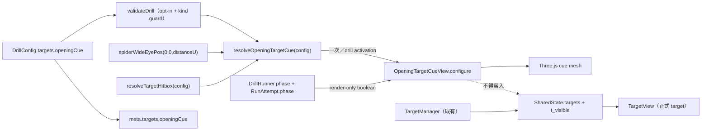

# WP-71 — Spider Shot Wide 開場定位提示（render-only）

> Stage index：[../README.md](../README.md) · checklist：[task-checklist.md](task-checklist.md) · progress：[progress.md](progress.md)
>
> 本計畫依 `.claude/skills/engineering-planning/SKILL.md`、`aim-analyst-ui` 規範與專案硬約束制定。**只建立執行計畫，不修改 production code。**

| | |
|---|---|
| **Problem** | `DrillRunner` 在 `armed`／`countdown` 不驅動 `TargetManager`，所以 `spider-shot-wide-v1` 必須等到倒數歸零才看到第一顆中心目標。受試者雖已取得 Pointer Lock，卻不知道應先把視角架在哪裡；第一輪因此混入場景定向成本，而不是純粹的 wide flick 表現。 |
| **Outcome** | `spider-shot-wide-v1` 在**初始 3 秒 countdown** 顯示一顆固定在首個中心 anchor 的「opening target cue／開場定位提示」；提示是 render-only、不可命中、不進 `SharedState.targets`、不蓋 `t_visible`、不消耗 RNG。進入 `running` 的同一 render frame 隱藏提示並顯示正式首目標。 |
| **Primary user** | 受試者（知道開場架槍方向）；研究者／分析端（payload 可辨識是否啟用提示，避免刺激條件混池）。 |
| **Estimate** | 7–10.5 dev-days（T0～T5 + T-exit）。 |
| **Risk** | **Med**。核心 sim 不改；主要風險是 presentation 被誤接成正式 target、`t_visible` 語意被污染，以及場景／drill 切換後殘留 cue。 |
| **Dependencies** | [WP-57](../../stage12/wp-57-spider-shot-wide-flick/README.md) ✅（wide spawn 幾何）、[WP-65](../../stage13/wp-65-drill-arming-and-countdown/README.md) ✅（`armed → countdown → running`）、[WP-69](../../stage15/wp-69-pause-invalid-restart/README.md) ✅（pause/resume gate）。WP-70 無程式相依；同 stage 只是使用者指定落點。 |
| **Decision** | `GD-48`（本計畫採納時入帳；T0 重查編號）。 |
| **Status** | 🟡 規劃完成，未開工。 |

## 0. Repository-grounded discovery

### 0.1 現行開場流程

1. App 以 `createDrillRunner(..., { requireArm: true })` 啟動；`start()` 先進 `armed`。
2. 取得 Pointer Lock 後 `armRequested = true`，runner 進 `countdown`。
3. `countdown` 尚未歸零時 [`DrillRunner.tick()`](../../../../../src/drill/DrillRunner.ts) 直接 return，`TargetManager` 完全不推進。
4. 歸零 tick 才進 `running` 並呼叫 `TargetManager.tick()`；`spawn()` 建立 `visible: true` 的正式 target，隨即蓋 `t_visible`。
5. [`TargetView`](../../../../../src/render/TargetView.ts) 只讀 `SharedState.targets`。因此目前沒有「看得見但不屬於正式 presentation」的視覺層。

### 0.2 為何 wide-v1 可安全先做

- `spider-shot-wide-v1` 的首目標固定走 `center-peripheral-yawpitch` 的 center 分支：`spiderWideEyePos(0, 0, distanceU)`。
- center 分支不消耗 RNG；周邊目標才消耗 seeded queue。
- drill 是 `mode: 'practice'`，目前不進 participant history／compatibility cell，適合先做行為 pilot。
- 正式幾何已有單一來源：`spiderWideEyePos()` + `resolveTargetHitbox()`；提示無需複製位置或尺寸常數。

### 0.3 命名約束

Repo 已有 `preAim`／`preAimDeg` 量測構念，指的是 presentation 前準心偏心量。為避免 C-D4 語意碰撞，本功能正規名稱定為：

- 中文：**開場定位提示**
- English/code：**opening target cue**
- config/meta value：`'countdown-anchor-v1'`

不得新增 `PreAimCue`／`preAimCue` 名稱。

## 1. 需求壓縮 (Requirements)

### 1.1 Functional Requirements

| ID | Requirement | Task |
|---|---|---|
| **FR-71.1** | 系統**必須**以 opt-in config gate 啟用 opening target cue；本 WP 只允許 `spider-shot-wide-v1` 宣告，其他 drill 省略時逐位維持現況。 | T1 |
| **FR-71.2** | cue **必須只在初始 `DrillPhase === 'countdown'` 且 attempt 為 `active` 時顯示；`idle`／`armed`／pause／resume-countdown／`running`／`ended` 一律隱藏。 | T3 |
| **FR-71.3** | cue 的位置、shape、顯示尺寸**必須**由正式 config 的 `spiderWideEyePos(0,0,distanceU)` 與 `resolveTargetHitbox()` 推導，不得手抄座標、距離或直徑。 | T1 |
| **FR-71.4** | cue **不得**進入 `SharedState.targets`、`tVisible`、visible/fire/hit event、hit-test、timeout、spawn count、target id、RNG 或 replay target stream。 | T1 / T3 / T5 |
| **FR-71.5** | `countdown → running` 的第一個 render frame **必須**隱藏 cue，並由既有 `TargetManager` 顯示正式中心目標；兩者位置與顯示尺寸逐位相等。 | T3 / T5 |
| **FR-71.6** | cue **必須**以與正式 target 冗餘可辨識的靜態樣式呈現（材質／填法 + 顏色，不只靠顏色），不得使用動畫、hit flash 或會誤認為可射擊的實色樣式。 | T2 |
| **FR-71.7** | 初始載入、Restart、換 weapon、換 drill、換 scene、Session Plan block 切換**必須**重新解析／清除 cue，舊 scene 不得殘留 mesh 或 GPU resource。 | T3 |
| **FR-71.8** | 啟用 cue 的新匯出**必須**以 `meta.targets.openingCue = 'countdown-anchor-v1'` 自述；未啟用者不得多出該鍵。 | T4 |
| **FR-71.9** | `meta.opening.protocol`（WP-67，尚未落地）與 `meta.targets.openingCue` **必須**保持正交：前者描述 arming/countdown 協定，後者描述 countdown 內的視覺刺激。 | T4 |
| **FR-71.10** | cue 顯示失敗時**必須** fail closed（不顯示 cue、正式 run 仍可開始），不得改寫正式 target 或阻塞 runner；不合法 config 則在 load/validation 時 fail fast。 | T1 / T2 |

### 1.2 Non-functional Requirements

| ID | Requirement |
|---|---|
| **NFR-71.1** | cue enable/disable 兩條路徑在同一輸入與 seed 下，跨 30/60/144/240 FPS 的 tick-index sim state、正式 target 序列與 event stream逐位一致；唯一允許差異是 `meta.targets.openingCue` 與 render 畫面。 |
| **NFR-71.2** | countdown 期間 `state.targets.length === 0`、`tVisible.size === 0`、visible event 數 = 0；進 `running` 後第一筆 visible event 恰為 1。 |
| **NFR-71.3** | cue 最多增加 1 mesh／1 draw call，僅存在於 countdown；建構／configure 之外每 frame 零物件配置、零 DOM 寫入、零動畫。 |
| **NFR-71.4** | cue 顯示期間相較 baseline 的 `frameLog` p95 不得新增 over-budget window；實測數值記入 `progress.md`。 |
| **NFR-71.5** | 1280×720 與 1920×1080、FOV 60/75/120 的 screenshot evidence 均須看得到 cue，且正式 target 啟用後 cue 無殘影。 |
| **NFR-71.6** | 未 opt-in drill 的 config canonical form、export canonical bytes 與既有 golden fixture 零位移；`meta.targets.openingCue` 為 optional-in，opt-in run required-out，非 opt-in run absent-out。 |
| **NFR-71.7** | `src/sim/`、`SharedState.ts`、`HitDetector.ts`、`SimLoop.ts`、`TargetManager.ts` 與 `src/input/` 在本 WP 的 production diff 必須為空。 |

### 1.3 Constraints

- Chrome／Edge desktop、Three.js `three/webgpu`、vanilla TypeScript；不得引入 UI framework。
- live HUD／canvas surface 不載 webfont、不跑動畫、不做每 frame layout work。
- cue 是 presentation，不是 target；不得以新增 `TargetState.preview`／`alive=false` 等方式偷渡進 sim。
- `spider-shot-wide-v1` 的正式首目標與 cue 共用 eye-frame pure geometry helper。
- 本 WP 不修改 countdown 長度、wide yaw/pitch schedule、hitbox、timeout、end condition 或 WP-69 pause 語意。

### 1.4 Open Questions

| ID | 問題 | Owner | Deadline | Impact / Default |
|---|---|---|---|---|
| **OQ-71.1** | cue 的最終材質：wireframe + neutral，或半透明 solid + 外框？ | 使用者／研究者 | T0 結束 | 影響 T2/T5 視覺基線。未另行拍板時採 **neutral wireframe + 40% opacity、無動畫**；正式 target 維持既有實色紅，形成填法 + 顏色雙重區分。 |
| **OQ-71.2** | cue 是否要在 3 秒 countdown 全程顯示，或只顯示前 2 秒、最後 1 秒清空？ | 使用者／研究者 | T0 結束 | 影響 FR-71.2 與 screenshot。預設採**全程顯示，running tick 原子切換**，避免最後一秒失去定位參考。 |

## 2. 系統架構與設計 (Technical Design)

### 2.1 System boundary

**In scope**

- `DrillConfig.targets.openingCue?` + `schema.ts` validation。
- 新純函式 resolver（建議 `src/drill/openingTargetCue.ts`），產出不可互動的 descriptor。
- `spider-shot-wide-v1` opt-in。
- 新 render-only `OpeningTargetCueView`（單一重用 mesh/material）。
- `main.ts` 的 drill/scene lifecycle 與 `liveFrame` phase gate。
- `meta.targets.openingCue` 型別、parser、匯出接線。
- 單元、integration、determinism、live WebGPU screenshot/perf evidence；CONTEXT／operational 文件。

**Out of scope**

- 真目標 pre-spawn、`TargetState` 新相位、命中／彈道／timeout／RNG 改動。
- 預覽第一個隨機 peripheral target。
- 其他 drill、Assessment roster、History/Trend UI、Replay 開場動畫。
- countdown 時長或 WP-69 pause/resume 語意。
- 實作 WP-67 的整套 `meta.opening`／Python pool guard；本 WP 只留正交契約與交接警示。

### 2.2 Data flow



### 2.3 Interface contracts

```ts
export type OpeningTargetCueMode = 'countdown-anchor-v1';

export interface OpeningTargetCueDescriptor {
  /** world-space 固定座標；由 spiderWideEyePos(0,0,distanceU) 產生。 */
  readonly position: Readonly<Vec3>;
  /** 正式 target 的 resolved shape。 */
  readonly shape: 'box' | 'sphere';
  /** render size；hitbox.visualSize 存在時沿用，否則用 hitbox 本體。 */
  readonly size: Readonly<{ width: number; height: number; depth: number }>;
}

/**
 * 省略 config gate → null。合法 opt-in → deterministic descriptor。
 * mode 與 spiderShot.kind 不相容時拋出指名 targets.openingCue 的錯誤。
 * 純函式：不讀時鐘、不讀 scene、不消耗 RNG、不碰 SharedState。
 */
export function resolveOpeningTargetCue(config: DrillConfig): OpeningTargetCueDescriptor | null;
```

```ts
export interface OpeningTargetCueView {
  /** drill/scene activation 時呼叫；null 代表停用並隱藏。不得持有 SharedState。 */
  configure(cue: OpeningTargetCueDescriptor | null): void;
  /** 每 rAF 可呼叫；冪等，只切 mesh.visible，不配置物件。 */
  setVisible(visible: boolean): void;
  /** 測試／診斷唯讀。 */
  readonly visible: boolean;
  /** scene replacement 時移除 mesh 並 dispose geometry/material。 */
  dispose(): void;
}

export function createOpeningTargetCueView(scene: THREE.Scene): OpeningTargetCueView;
```

```ts
export interface TargetsMeta {
  hitbox?: TargetHitboxConfig;
  hitFeedback?: 'flash';
  /** countdown 內非互動式、target-shaped 的開場定位提示；缺席 = 未啟用。 */
  openingCue?: 'countdown-anchor-v1';
}
```

### 2.4 決定性契約與三迴圈邊界

| 項目 | 契約 |
|---|---|
| **決定性** | cue resolver 只讀 immutable config，render view 只持有自己的 mesh；sim config 多一個未被 sim 消費的 optional 欄位。以 cue on/off、相同 seed、30/60/144/240 FPS 對比正式 target spawn/event/tick trace 逐位相等。 |
| **三迴圈邊界 (ADR-2)** | 新資料流只在 config → render。不得走 input → sim，也不得寫 `SharedState`。`main.ts` 讀既有 `DrillRunner.phase` 與 `RunAttempt.phase` 決定 presentation，沿用 WP-65/WP-69 已存在的 render gate。 |
| **固定佈局** | 不新增 ring/arena。cue view 建構期最多建立一個 mesh/material；configure 只改既有欄位，rAF 只寫 `visible`。 |
| **時鐘域** | 無新時間戳。顯示與否由相位判斷，不以 `performance.now()` 自算 countdown；禁 `Date.now()`。 |
| **seeded RNG** | resolver 不接收 RNG；cue 不消耗 `sequence.seed`／`spiderShot.seed`。正式 peripheral queue 的 draw budget 逐位不變。 |

### 2.5 與 WP-67 `meta.opening` 的契約

WP-67 尚未落 production。未來落地時：

- `meta.opening.protocol = 'armed-countdown-v1'` 只回答「是否經 armed + visible countdown」。
- `meta.targets.openingCue = 'countdown-anchor-v1'` 回答「countdown 期間是否顯示 target-shaped cue」。
- 分池鍵若分析開場／首 presentation，必須同時包含兩者；不得只看 `meta.opening.protocol`。
- WP-67 不得把 cue 有／無原地塞成同一 protocol 語意；若要合併成版本化 opening condition，須另立 GD 並提供 migration/分類規則。

## 2b. 硬約束衝擊 (Hard-constraint impact)

| 約束 | 是否觸及 | 說明 / 緩解 |
|---|---|---|
| 時鐘域：禁 `Date.now()`，一律 `performance.now()`（ADR-4） | **觸及（反證）** | cue 不讀時鐘，僅讀 phase；新增 production diff 的 `Date.now` 命中須為 0。 |
| cross-origin isolation 生效 | 不觸及 | 不改 header/bootstrap；T5 仍跑 isolation e2e。 |
| **決定性**：同輸入跨 render FPS，sim state 逐位一致 | **觸及** | NFR-71.1 四 FPS 對照 + 既有 regression 零漂移；cue 不消耗 RNG、不寫 state。 |
| **三迴圈邊界**：input/sim/render 只透過 `SharedState`（ADR-2） | **觸及** | 本案不新增跨迴圈 state；只讀既有 phase 做 render gate。禁止 cue 進 `SharedState.targets`。 |
| 固定佈局：input ring + recorder arena，不 `push` 物件 | **觸及（render）** | ring/arena 不動；cue 是單 mesh，rAF 零配置。 |
| seeded RNG：禁 `Math.random()`，seed 入 metadata（GD-5） | **觸及（反證）** | cue resolver 無 RNG 參數；新增 diff 的 `Math.random` 命中須為 0；正式序列逐位對表。 |
| **GD-6**：場景幾何永不進 sim／場景切換不改 sim | **觸及（render lifecycle）** | cue 是 scene mesh，但位置只由 drill eye-frame config 推導；場景資料不進 sim。換 scene 必須 dispose/reconfigure。 |
| **GD-9**：場景資產授權 | 不觸及 | 使用程序化 geometry/material，不新增外部資產。 |
| **GD-11**：FPSci 程式碼/config 禁入 repo | 不觸及 | 設計與實作皆為本 repo 自有。 |
| hitbox 單一來源（GD-7） | **觸及** | cue 顯示尺寸只能讀 `resolveTargetHitbox()`；禁止另寫 diameter。cue 不參與 hit-test，因此不是第二 hitbox。 |
| C-D1/C-D5：research/src 隔離與雙實作對表 | 不觸及 | 不改 promoted metrics、不讓 `research/` import TS。T4 只更新分析文件的分池紀律。 |
| C-D3/C-D4：效度與構念單一來源 | **觸及** | cue 不得被稱為 target visibility；`t_visible` 仍只代表正式 presentation。新刺激以 metadata 自述，避免混池。 |

## 3. 風險分析 (Risk Analysis)

### 3.1 Failure modes

| ID | 觸發條件 | 影響範圍 | 處理策略 | Task |
|---|---|---|---|---|
| **FM-71.1** | 為了重用 `TargetView` 而把 synthetic target push 進 `SharedState.targets` | countdown 可命中、`t_visible`／export／timeout／RNG 被污染 | source-scan + state/event 反證；本 WP 明禁修改 sim/state/hit 檔 | T1/T3/T5 |
| **FM-71.2** | cue 座標或尺寸手抄，日後 wide config 改動但 cue 未跟 | 玩家架到錯誤方向；running tick 畫面跳動 | resolver 只呼叫 `spiderWideEyePos` + `resolveTargetHitbox`；cue/live pose 逐位 equality test | T1/T5 |
| **FM-71.3** | 換 drill/scene 後未清 cue 或 resource | 非 wide drill 出現幽靈球；GPU leak | 四條 activation 路徑 integration test + dispose/reconfigure 計數 | T2/T3 |
| **FM-71.4** | 只看 `DrillPhase === countdown`，忽略 WP-69 attempt phase | pause／resume-countdown 背景仍顯示 cue、與 overlay 疊加 | gate = drill countdown **且** attempt active；四相位表驅動測試 | T3 |
| **FM-71.5** | cue 樣式與正式 target 太像 | 受試者在 countdown 誤以為已可射擊，改變行為 | 填法 + 顏色雙重差異；T0 screenshot 選型 + T5 使用者視覺 gate | T2/T5 |
| **FM-71.6** | 匯出未帶 cue condition，或未啟用 drill 也帶鍵 | 新舊刺激靜默混池／既有 canonical bytes 漂移 | optional-in + conditional required/absent-out、live payload 正反兩例、鍵集合差異恰一鍵 | T4/T5 |
| **FM-71.7** | 未來 WP-67 只按 `meta.opening.protocol` 分池 | armed-countdown 有 cue／無 cue 被混為同一刺激 | GD-48 + README §2.5 + WP-67 cross-WP alert；T4 operational 文件 | T4 |
| **FM-71.8** | transparent material 首次顯示才編 pipeline 或排序異常 | countdown 首幀卡頓／cue 被場景遮錯 | 建構時預暖單 mesh；T2 WebGPU smoke + T5 p95/draw call evidence；失敗時退回 wireframe opaque neutral | T2/T5 |

### 3.2 Validity risk

- cue 會刻意降低第一顆中心 anchor 的場景定向成本，因此 WP-71 前後的開場段資料不可直接混池。
- `spider-shot-wide-v1` 的主要構念取 peripheral presentations，但 rhythm 仍含 center anchors；不能以「主要指標排除 center」宣稱完全零效度影響。
- cue 只在固定 countdown 顯示；`armed` 可停任意久，若在 armed 顯示會造成不受控 exposure，因此明確排除。
- 不預覽隨機 peripheral 方向，避免提前洩漏實驗刺激。
- 正式 target 的 `t_visible` 仍在 running spawn tick；cue 是另一個具名 presentation layer，不得把它寫成「target 提早 visible」。

### 3.3 Technical debt risk

| 妥協 | 原因 | 觸發重構條件 |
|---|---|---|
| resolver 暫只接受 `center-peripheral-yawpitch` + `countdown-anchor-v1` | 本需求只有 wide-v1；先做封閉 enum 比通用 scene cue DSL 安全 | 第二個 drill 明確要求不同 opening cue 時，另案設計 versioned descriptor union |
| cue view 自有一份 box/sphere geometry factory | 避免把正式 `TargetView` 變成兼管非 target 的 god view | 第三個 target-like render view 出現時，再抽共用 geometry factory並做 visual parity test |
| metadata 放 `meta.targets`，不等待 WP-67 | WP-67 尚未實作；cue 是 target presentation 屬性、與 arming protocol 正交 | WP-67 開工時依 §2.5 組合分池，不原地改本欄語意 |

### 3.4 Performance bottlenecks

- countdown 期間多一個 mesh/draw call；running 後 `visible=false`，不參與繪製。
- 禁止每 rAF 建 descriptor、geometry、material 或顏色物件；configure 只在 activation／scene replacement。
- transparent pipeline 若有首次編譯成本，以 T2 smoke 提前暴露；fallback 為 opaque wireframe neutral。

## 4. 任務拆解 (Task Breakdown)

| Task | Objective | Dependencies | Estimate | Risk | Complexity | Definition of Done（摘要） | Commit |
|---|---|---|---:|---|---|---|---|
| **T0** | Entry gate：編號／上游／baseline／視覺 OQ 凍結 | — | 0.5–1 d | Low | Low | WP/GD 可用；OQ 關閉；baseline 計數與 screenshot 記錄 | `docs(wp-71): T0 entry gate for opening target cue` |
| **T1** | Config gate + schema + pure descriptor resolver + wide-v1 opt-in | T0 | 1–1.5 d | Med | Med | resolver 正負測試；正式 geometry 同源；sim/input diff 空 | `feat(wp-71): define the opening target cue contract` |
| **T2** | `OpeningTargetCueView` 單 mesh render component | T1 | 1–1.5 d | Med | Med | visibility/configure/dispose/material 測試；WebGPU smoke；rAF 零配置 | `feat(wp-71): render a distinct opening target cue` |
| **T3** | App lifecycle／phase gate／scene replacement 接線 | T2 | 1.5–2 d | **High** | High | 六相位表 + 五條 activation 路徑 + cue/live 原子切換；determinism 綠 | `feat(wp-71): wire the cue into drill countdown lifecycle` |
| **T4** | `meta.targets.openingCue` + parser + terminology/analysis contract | T1（可與 T2 並行） | 1–1.5 d | Med | Med | optional-in + conditional required/absent-out 正反測試；live payload；CONTEXT/WP-67 交接 | `feat(wp-71): export the opening cue condition` |
| **T5** | Live e2e、視覺、效能與全量回歸 | T3 + T4 | 1.5–2 d | **High** | Med | 6 張 screenshot、state/event 反證、p95/draw call、全量 exit 0 | `test(wp-71): verify opening cue validity and presentation` |
| **T-exit** | FR/NFR acceptance matrix、GD-48/索引/progress 對帳 | T1–T5 | 0.5–1 d | Low | Low | 每列具名證據；殘餘風險有 owner；git/staged scope 稽核 | `docs(wp-71): close opening target cue exit gate` |

詳細 Steps／DoD 見各 task 檔。每個 task = 一個垂直切片 = 一個原子 commit。

### FR → Task 完整性

| FR | Task | FR | Task |
|---|---|---|---|
| 71.1 | T1 | 71.6 | T2 |
| 71.2 | T3 | 71.7 | T3 |
| 71.3 | T1 | 71.8 | T4 |
| 71.4 | T1/T3/T5 | 71.9 | T4 |
| 71.5 | T3/T5 | 71.10 | T1/T2 |

## 5. Assumptions

1. 使用者採納上一輪建議：render-only cue、非真 target、只先用於 `spider-shot-wide-v1`。
2. initial countdown 仍允許 camera aim；WP-69 pause/resume gate 仍是 gameplay input 的權威。
3. `spiderWideEyePos(0,0,distanceU)` 持續是 wide-v1 首中心目標的權威位置；若上游改此契約，T1 equality test 必須先紅。
4. stage16 是使用者指定落點；本 WP 與 stage16 原本「條件失效」主題無直接相依，索引中會明帳而不改寫 WP-70 敘事。
