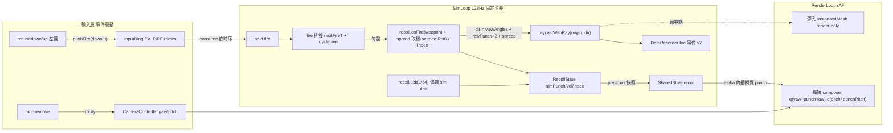

# 階段 B(stage2)執行計畫 — CS2 後座力系統 + 真急停物理

> stage2 頂層索引 + tech spec。整合三份輸入:**規格書 §1.3 階段 B**([../../../規格書_Three.js_WebGPU_反向急停瞄準訓練器.md](../../../規格書_Three.js_WebGPU_反向急停瞄準訓練器.md))、**CS2 壓槍軌跡復刻研究計畫**([./CS2%20壓槍軌跡復刻研究計畫.md](./CS2%20壓槍軌跡復刻研究計畫.md))、**2026-07-03 後座力整合稽核報告**(結論摘要見 §0)。
> 格式沿用 [exec-plan/README.md](../../README.md)(每 WP 一個自足子資料夾;task = 垂直切片 = 原子 commit)。文件語言:繁體中文,術語保留英文(D4)。

| | |
|---|---|
| **交付範圍** | CS2 後座力系統(彈道表 + punch 動力學 + inaccuracy)+ 武器層(cycletime/彈匣/full-auto)+ 階段 B 真急停物理(friction/accelerate integrator + velocity gate)+ 校準驗證 + 匯出 schema v2 與壓槍指標 |
| **上游門檻** | 階段 A **M4 ✅(2026-07-03)**;稽核結論**無 BLOCKER**(A1 固定 tick PASS) |
| **技術棧** | 沿用階段 A(Three.js `WebGPURenderer` + TS + Vite;UI = 純 TS + DOM overlay;Vitest + Playwright) |
| **估時** | 14.5–21 dev-days(≈3–4 週);WP-18(F5 移動目標)門控已解、未展開、另計 +2–3.5 |
| **狀態** | ✅ **M8 交付(2026-07-07)**:WP-10~17 全綠、驗收清單 B(附錄 E-B)全項通過、`test:ci` exit 0;WP-18(F5)為門控後續,不阻塞 M8 |

---

## 0. 輸入現況:稽核結論 × 研究計畫 × 規格階段 B 的整合邏輯

### 0.1 稽核結論摘要(2026-07-03,以 main entry 實際 import 路徑稽核)

| 項目 | 判定 | 落點與接法 | 收斂到 |
|---|---|---|---|
| A1 固定 tick | **PASS** | [SimLoop.ts](../../../../src/loop/SimLoop.ts) accumulator(`while (accSec >= tickSec)`),`SIM_HZ = 128`([constants.ts](../../../../src/loop/constants.ts))= 64×2,注入式常數;movement/fire 皆在 tick 內;無 `getDelta()` 滲入 | 架構直接沿用;tick 子節奏見 §2.4 |
| A2 相機角度所有權 | **PASS** | yaw/pitch 純量為中介狀態([CameraController.ts](../../../../src/view/CameraController.ts) `#yaw/#pitch` → `qYaw·qPitch`);punch 疊加點 = `#applyToCamera`,但目前僅 mousemove 觸發重推導 → 需每幀重組 | WP-13 |
| A3 彈道方向注入 | **WARN** | [HitDetector.ts:49](../../../../src/sim/HitDetector.ts) `raycaster.setFromCamera(NDC_CENTER, camera)` 寫死相機正前方;命中 = Raycaster + 手動 `Box3`(非物理引擎),改注入簽名即可 | WP-12 |
| A4 Pointer Lock / 感度 | **WARN** | `unadjustedMovement: true` 已有([PointerLock.ts:74](../../../../src/input/PointerLock.ts));感度為佔位 `RAD_PER_COUNT = 0.0022` **rad**/count ≈ CS2 0.022 **deg**/count 的 5.73 倍 | WP-12 |
| A5 武器/開槍抽象 | **WARN** | 開槍鏈集中單點(mousedown → ring → `applyInput` fire 分支)但**無 WeaponConfig、無 cycletime、無彈匣、無 full-auto**(InputSampler 無 mouseup) | WP-11 |
| A6 座標/角度慣例 | **PASS** | `qYaw(世界Y)·qPitch(局部X)` ≡ Euler 'YXZ';內部一律 radian;**pitch 正值朝上**(Three.js)vs Source punch pitch 正值朝下 → 接線處一次符號翻轉 + `degToRad` | WP-13 |
| 加分項 | — | Vitest ✅、`__fpsTest` E2E harness ✅、WebGPURenderer ✅;InstancedMesh 未用(彈孔需新增) | WP-10/13/17 |

### 0.2 三份輸入 → 本計畫的範圍收斂

- **研究計畫 Phase 1(演算法移植)** → WP-10。純數學、零 three 相依,golden tests 立即可跑(Vitest 就緒)。
- **研究計畫 Phase 2(Three.js 整合)** → WP-12 + WP-13。稽核已把整合點釘到行級(見 §0.1)。
- **研究計畫 Phase 3(prototype 對照工具)** → 2D 彈道檢查頁併入 WP-10(dev-only);壓槍路徑 vs 理想路徑對照併入 WP-16(結果頁)。
- **研究計畫 Phase 4(驗證)** → WP-15 + WP-17(golden 向量前移到 WP-10 的 DoD)。
- **規格 §1.3 階段 B(1)(2)**(friction integrator + velocity gate)→ WP-14。`MovementController` 介面不變(附錄 D 承諾)。
- **規格 §1.3 階段 B(3)**(`cl_showpos` 校準)→ WP-15。
- **規格 §1.3 階段 B(4)**(移動目標 sub-tick 內插)→ WP-18,**門控**:附錄 F「移動 + counter-strafe 能力混淆」研究設計決議(GD-1 遺留)。
- **規格 §4.2 階段 B 選項**(sim → Web Worker + SharedArrayBuffer)→ **out of scope**,觸發條件見 §2.2。

---

## 1. 需求(Requirements)

### 1.1 Functional Requirements

> 每條 FR 對應至少一個 WP task(映射欄);驗收句式 = 可機械判定。

| # | 需求(系統必須…) | 映射 |
|---|---|---|
| FR-B1 | 以武器 `seed` 決定性生成 64 筆彈道表 (angle, magnitude)(ran1 RNG,IA=16807/IM=2147483647;full-auto 相鄰彈 Lerp variance=0.55、前 4 發抑制 0.75→1.0);AK-47(seed 223)前 8 筆與參考向量逐位一致 | WP-10 T1 |
| FR-B2 | 每個 recoil tick(1/64s)對 punch 執行 HybridDecay(指數 8 + 線性 18)+ 角速度 leapfrog 積分(角速度 `exp(−4.5·dt)` 衰減);AK 10 發(cycletime 0.1s)後 `punch×2` = pitch −10.18°/yaw −1.56°(±0.01°) | WP-10 T2 |
| FR-B3 | inaccuracy 三成分:狀態基礎值(stand)+ 每發 `InaccuracyFire` 累積(以 `exp(−dt·ln10/recoveryTime)` 回復)+ 移動附加 `(v/vmax)^0.25 × InaccuracyMove`;取樣 θ 均勻、半徑 = U(0,1)×inaccuracy(中心偏置),RNG 為**注入式 seeded stream** | WP-10 T3 |
| FR-B4 | 停火超過 `cycletime × 1.1` 後 recoil index 以 `exp(−dt·ln10·2)` 衰減歸零;開槍時 index 遞增 | WP-10 T2 / WP-11 T3 |
| FR-B5 | 武器以 `WeaponConfig` 資料定義(cycletime、magSize、recoil 4 參數 + seed、inaccuracy 6 參數、recovery 4 參數;AK-47/M4A4/M4A1-S 三把預設值取自 CS2 vdata);新增武器 = 新 config,不改引擎(F4 精神) | WP-11 T1 |
| FR-B6 | 按住左鍵於 sim tick 內以 `cycletime` 節奏連續產彈(fire 事件帶 down/up;`nextFireT += cycletime` 無漂移);彈匣盡即停火 | WP-11 T2–T3 |
| FR-B7 | 滑鼠感度換算 = `movementX × sensitivity × 0.022°/count`(取代佔位 0.0022 rad/count);匯出 metadata 標記感度語意版本 | WP-12 T1 |
| FR-B8 | 命中射線方向由呼叫端注入(origin + direction);既有 camera-center 路徑保留為薄包裝、既有測試不破 | WP-12 T2 |
| FR-B9 | 相機合成:**渲染角度 = viewAngles + aimPunch**(視覺;每幀重組,punch 於 render 端內插)、**彈道方向 = viewAngles + rawPunch×2 + 擴散偏移**(實際);兩者分離 | WP-13 T1–T2 |
| FR-B10 | 彈孔以 `InstancedMesh` 渲染(單一 draw call,環狀覆寫上限 N;render-only,不入 sim/匯出) | WP-13 T3 |
| FR-B11 | `MovementController` 內部換為 Source friction/accelerate integrator(`sv_friction` 5.2、`sv_accelerate` 5.6、`sv_stopspeed` 75、上限 ~250 u/s,附錄 D);公開介面 `step(state, dtSec)` 不變;velocity 為連續值;常數以 `MovementProfile` 資料注入(多移動模型接口——Valorant 等後續模式 = 新 profile 不改引擎,本階段僅留接口) | WP-14 T1 |
| FR-B12 | 開火精準 gate 從二元 `stopped` 升級為連續模型(門檻 ~88 u/s = max 34%;`stopped` 改以 `v < 門檻` 寫入,SharedState 註解既定接縫);殘速/過衝指標輸出連續 u/s | WP-14 T2 |
| FR-B13 | 急停/起步速度曲線與 CS2 `cl_showpos` 參考軌跡逐 tick 對照通過(容差見 OQ-S2-2);AK 彈道 pattern 與社群 pattern 圖逐彈比對通過 | WP-15 T1–T2 |
| FR-B14 | 匯出 schema v2:`fire` 事件增 `viewYaw/viewPitch/aimPunchPitch/aimPunchYaw/spreadX/spreadY/recoilIndex/ammo`;meta 增 `weaponId/weaponSeed/rngSeed/sensitivityModel/movementModel/schemaVersion`;統計=匯出不變式維持 | WP-16 T1 |
| FR-B15 | 壓槍指標:補償路徑 vs 理想路徑(= `−aimPunch×2` 時間鏡像)的平均/RMS 角度誤差;結果頁呈現軌跡對照 | WP-16 T2–T3 |
| FR-B16 | 決定性回歸擴充:同 `rngSeed` + 同合成輸入序列(含 fire down/up 與合成 aim)→ 逐 tick punch 序列與彈著序列(tick index 鍵)一致,與 render FPS 無關 | WP-17 T1 |
| FR-B17 | (門控)移動目標命中位置 sub-tick 內插對齊 fire 時間戳(取代「最近 tick 位置」已知偏差) | WP-18 |

### 1.2 Non-functional Requirements

| 類別 | 量化需求 |
|---|---|
| Golden 精度 | 彈道表逐彈相對誤差 ≤ 1e-9(同演算法同輸入應位元級一致);10 發 punch 向量 ±0.01°;抑制係數前 4 發 = 30×Lerp(j/4, 0.75, 1) 精確 |
| 效能 | 壓 30 發 + 彈孔渲染期間 sim 128 Hz 不掉 tick(`ticks` 監控無 >1 tick 缺口);per-shot 熱路徑零物件配置(沿用 CLAUDE.md §4 GC 紀律) |
| 決定性 | FR-B16 於 60/144/240 FPS 合成 pump 節奏下全綠;`Math.random()` 在 `src/sim`/`src/recoil` 出現次數 = 0(lint/grep 閘) |
| 計時效度 | 三防線不退化:COI E2E 斷言、反應分布 sanity、決定性回歸(WP-9 既有閘全綠維持) |
| 可維護性 | 武器參數/tick 子節奏/彈孔上限皆設定常數,不寫死於邏輯(沿用 ADR-3 精神) |

### 1.3 Constraints(硬約束,新增項將回寫 CLAUDE.md §4)

- 沿用階段 A 全部硬約束(`performance.now()`、`three/webgpu`、COI、決定性、三迴圈經 SharedState、GC 紀律、純 TS UI、Chromium)。
- **新增:sim/recoil 內禁 `Math.random()`** — 擴散取樣一律注入 seeded RNG(ran1 重用),seed 記入 meta。
- **新增:recoil 衰減公式以 1/64s 為步長定義**;sim tick(1/128)與 recoil tick(1/64)的關係固定為 2:1 子節奏(§2.4),不得以變動 dt 代入。
- `MovementController.step(state, dtSec)` 介面不變(規格附錄 D 承諾;呼叫端零改動)。
- 單位紀律:sim/資料 source unit(u、u/s);**角度:recoil 模組輸出 degree,SharedState/CameraController 內部 radian,`degToRad` 只在 recoil→sim 接線處做一次**;Source punch pitch 正值朝下 → Three.js pitch 正值朝上,**符號翻轉只在同一接線處做一次**(集中可稽核)。

---

## 2. 系統設計(Technical Design)

### 2.1 System boundary

**In scope**:`src/recoil/`(新)、`src/weapon/`(新)、`SimLoop`(fire 排程 + recoil tick 佈線)、`InputSampler`(fire down/up)、`InputRing`(EV_FIRE payload)、`CameraController`(感度常數 + punch 合成)、`HitDetector`(方向注入)、`MovementController`(內部 integrator)、`SharedState`(weapon/recoil 欄位)、`DataRecorder`/`export`/`schema.md`(v2)、`MetricsDashboard`/`ResultScreen`(壓槍指標)、`TargetView` 旁新增彈孔 view、決定性測試與 `__fpsTest` harness 擴充。

**Out of scope**(防蔓延,各附觸發條件):
- sim → Web Worker + SharedArrayBuffer(§4.2):僅當 pilot 實測出主執行緒卡頓污染計時(DESIGN.md 既有議題)才立案。
- 蹲姿(crouch):訓練器無蹲輸入;inaccuracy 用 stand 值,`WeaponConfig` 保留 crouch 欄。
- Valorant 移動模式(settle-timer 急停、2D WASD、Unreal 單位/校準):**僅留接口**——`MovementProfile` 注入(WP-14)+ meta `movementModel` 斷代(WP-16);觸發條件:Valorant 訓練模式研究立案 → WP-14 之後另立 WP(屆時補 2D `held` 擴欄與 Valorant 校準參考)。
- reload 流程:彈匣盡 = 停火(30 發 spray 恰一匣);見 OQ-S2-6。
- 視角 tick-bucketed 重建:採「記錄而非重建」(§2.5);觸發重構條件:研究需要逐 tick 視角**重播**(非重建彈道)。
- F5 移動 drill 與追蹤指標:隨 WP-18 門控。

### 2.2 資料流(新增/異動)



雙迴圈邊界不變(ADR-2):recoil 狀態屬 sim、由 sim 寫入 `SharedState`;render 唯讀內插。視角 yaw/pitch 維持輸入路徑所有權(稽核 A2 既定設計)。

### 2.3 Interface contracts(關鍵簽名)

```ts
// src/recoil/ —— 純數學,零 three/DOM 相依(WP-10)
export type Rng = () => number;                       // [0,1) seeded(ran1);禁 Math.random
export function createRan1(seed: number): Rng;

export interface RecoilTableEntry { angleDeg: number; magnitude: number }
export function generateRecoilTable(p: WeaponRecoilParams): readonly RecoilTableEntry[]; // 恆 64 筆,同 seed 同輸出

export interface RecoilState {                        // 固定欄位、物件重用(GC 紀律)
  aimPunchPitchDeg: number; aimPunchYawDeg: number;   // 視覺 punch;彈道用 ×2(rawPunch 語意)
  punchVelPitch: number; punchVelYaw: number;
  recoilIndex: number; inaccuracyFire: number; lastFireT: number;
}
export function recoilTick(s: RecoilState, dtSec: number): void;   // dtSec 恆 1/64(§2.4);HybridDecay(8,18)+leapfrog+exp(−4.5dt)
export function recoilOnFire(s: RecoilState, w: WeaponConfig, table: readonly RecoilTableEntry[]): void;
export function sampleSpread(s: RecoilState, w: WeaponConfig, speedRatio: number, rng: Rng): { x: number; y: number };

// src/weapon/WeaponConfig.ts(WP-11;≈15 欄,對齊稽核清單)
export interface WeaponConfig {
  id: 'ak47' | 'm4a4' | 'm4a1s' | string;
  cycletimeSec: number; magSize: number;
  recoil: { seed: number; magnitude: number; magnitudeVariance: number; angleVariance: number };
  inaccuracy: { stand: number; crouch: number; fire: number; move: number; recoveryTimeStand: number; recoveryTimeCrouch: number };
  recoveryTransition?: { startBullet: number; endBullet: number };
}
// 執行期驗證比照 drill/schema.ts validateDrill 模式(err/require* helpers)

// src/sim/MovementController.ts(WP-14;移動模型資料抽象——Valorant 僅留此接口,不實作)
export interface MovementProfile { friction: number; accelerate: number; stopSpeed: number;
  maxSpeed: number; accuracyThreshold: number }           // CS2_PROFILE(附錄 D 值)為 stage2 唯一實作
export function createMovementController(profile?: MovementProfile): MovementController; // step(state, dtSec) 不變

// src/sim/HitDetector.ts(WP-12)
export function raycastWithRay(origin: THREE.Vector3, dirNormalized: THREE.Vector3,
  targets: readonly TargetState[]): RaycastResult;    // raycastFromCenter 改為薄包裝(呼叫本函式)

// src/view/CameraController.ts(WP-12/13)
const RAD_PER_COUNT = THREE.MathUtils.degToRad(0.022); // CS2 感度語意(FR-B7)
setViewPunch(yawRad: number, pitchRad: number): void;  // render loop 每幀以內插 punch 呼叫 → 重組 quaternion

// SharedState 擴充(WP-11/13;固定欄位,reset 原地清空)
weapon: { nextFireT: number; ammo: number };          // sim 寫
heldFire: boolean;                                     // consume 依 fire down/up 更新(比照 held.left/right)
recoil: { prev: PunchSnapshot; curr: PunchSnapshot };  // sim 每 tick 末寫,render alpha 內插(比照 prev/curr)
```

**InputRing 契約變更**(WP-11):`EV_FIRE` 啟用 `b` 欄 = down(0/1)(packed 槽位既有閒置欄,容量/佈局不變);`InputEvent` fire variant 改 `{ type:'fire'; down: boolean; t: number }`。寫入端 `InputSampler` 增 `mouseup` 監聽(仍以 locked 為採計閘門;解鎖時若 heldFire 未釋放,PointerLock onChange 補送 up,避免 stuck fire)。

### 2.4 tick 節奏設計(關鍵決策,見 OQ-S2-1)

- `SIM_HZ = 128` 不變(ADR-3;決定性回歸基準不動)。
- **recoil tick 以 64Hz 子節奏執行**:`simStep` 內於**偶數 tick**(`tickIndex & 1 === 0`)呼叫 `recoilTick(state, 1/64)`。理由:(a) ADR-3 選 128=64×2 的設計意圖就是對照 CS2 15.625ms tick;(b) golden 向量(10 發 punch −10.18°/−1.56°)以 64Hz 步進定義,子節奏可逐位對照,dt=1/128 代入會產生無對照基準的微差(HybridDecay 線性項與 leapfrog 非步長不變)。
- fire 排程走 128Hz tick 粒度:`nextFireT += cycletimeSec*1000`(累加制,無漂移);`heldFire && tickEndMs >= nextFireT && ammo > 0` 即出彈。cycletime 0.1s = 12.8 sim tick,非整數屬預期(CS2 subtick 同理),排程誤差 ≤ 1 sim tick(7.8ms)記為已知量化誤差。
- `simStep` 順序更新為:① prev←curr(含 punch 快照) ② targets ③ **recoilTick(偶數 tick)** ④ consume 輸入(fire 產彈就地 raycast) ⑤ movement.step ⑥ curr←新狀態 ⑦ recordTick。recoil 衰減在產彈**之前**,對齊 CS2「先 decay 再 kick」順序。

### 2.5 決定性與重播(viewAngles 政策)

視角維持輸入路徑即時寫入(不 tick-bucketed,稽核 A2/不確定清單 #2)。**政策 = 記錄而非重建**:每發 fire 事件完整記錄 `viewYaw/viewPitch + aimPunch + spread + recoilIndex`,彈道可離線精確重建;sim 決定性斷言(FR-B16)以**合成輸入**(harness 直寫 aim + fire 序列)驗證 punch/彈著序列,不依賴真滑鼠路徑。此為有意識的妥協,記入 technical debt(§7)。

### 2.6 Failure modes(對應 High/Med risk task)

| 觸發條件 | 影響 | 處理策略 |
|---|---|---|
| fire 排程用 `nextFireT = now + cycletime`(重設制)累積漂移 | 30 發總時長偏離 29×cycletime,pattern 對照全歪 | 契約規定累加制;WP-11 DoD 斷言 30 發 span = 2900ms ± 1 tick |
| deg/rad 或 pitch 符號在多處各轉一次 | 彈道/視覺方向錯亂且難追 | 轉換集中單一接線函式(§1.3 constraint);WP-13 DoD 含「上跳方向」與 golden 向量 E2E 斷言 |
| WP-14 integrator 改變逐 tick 軌跡 → 既有決定性 baseline 全紅 | 回歸誤判為 regression | **預期中的 breaking change**:重錄 baseline、GD 記錄;M1 契約(不同 FPS 同狀態)必須先於新 baseline 重驗 |
| 視覺 punch 與彈道 punch 分離造成 QA 誤判「打不準」 | 手感驗證與資料互相矛盾 | dev-only debug overlay:顯示 rawPunch×2 射線落點 marker + punch 數值 readout(比照急停 readout 模式) |
| per-fire 欄位增加使 DataRecorder arena 提前溢位 | `recorderOverflow` 污染 drill | WP-16 重估 `capacityForDrill`(fire 事件率上限 = magSize/cycletime);溢位測試納入 DoD |
| 校準不過(引擎行為 CS:GO 洩漏碼 + CS2 vdata 組合假設失效) | golden 基準可信度存疑 | 差異分層歸因(公式/常數/subtick 內插);研究計畫 caveat 已預告;結果記 WP-15 progress + GD |

### 2.7 Concurrency model

單執行緒單一 rAF 超級迴圈不變(階段 A 架構)。RecoilState/RNG 狀態為 sim 專屬(存於 SimLoop 閉包或 SharedState.recoil,render 唯讀快照);無共享可變性新增、無鎖需求。Worker 遷移明確 out of scope(§2.1)。

---

## 3. WP 索引(⬜ 未開始 · 🟡 進行中 · ✅ 完成)

> 每 WP 展開為自足子資料夾(`README.md` + `task-checklist.md` + `progress.md` + `T0-entry-gate` → `Tn` → `T-exit-gate`),沿用 [exec-plan/README.md §6](../../README.md) 慣例。編號接續階段 A(WP-0~9)。

| WP | 子資料夾 | 目標 | 里程碑 | 相依 | 估時 | 狀態 |
|---|---|---|---|---|---|---|
| **WP-10** | [wp-10-recoil-core/](../../completed/stage2/wp-10-recoil-core/README.md) | 後座力數學核心(彈道表 + punch 動力學 + inaccuracy)+ golden tests + 2D 檢查頁(dev-only) | **M5** | —(可立即開跑) | 2–3 | ✅ **M5 2026-07-05** |
| **WP-11** | [wp-11-weapon-fire/](../../completed/stage2/wp-11-weapon-fire/README.md) | `WeaponConfig` + fire down/up 事件 + cycletime 產彈 + 彈匣 + recoil index 掛點 | — | WP-10(型別) | 2–3 | ✅ **2026-07-06** |
| **WP-12** | [wp-12-input-seams/](../../completed/stage2/wp-12-input-seams/README.md) | 感度換算 CS2 0.022°/count(A4)+ 射線方向注入(A3) | — | — | 1–1.5 | ✅ **2026-07-06** |
| **WP-13** | [wp-13-sim-camera-integration/](../../completed/stage2/wp-13-sim-camera-integration/README.md) | recoil 進 simStep(64Hz 子節奏)+ 相機視覺/彈道合成 + 彈孔 InstancedMesh + debug overlay | **M6** | WP-10, 11, 12 | 2–3 | ✅ **M6 2026-07-06**(automated + 手動視覺 4 項使用者確認通過) |
| **WP-14** | [wp-14-movement-physics/](../../completed/stage2/wp-14-movement-physics/README.md) | friction/accelerate integrator 取代 M1 snap + velocity gate(~88 u/s)+ 殘速指標連續化 | — | —(介面不變,可與 10–13 並行) | 2–3 | ✅ **2026-07-06**(baseline 重錄 + Edge 實測手感驗證) |
| **WP-15** | [wp-15-calibration/](../../completed/stage2/wp-15-calibration/README.md) | `cl_showpos` 軌跡校準 + pattern 圖逐彈比對 + 擴散雲換算檢查 | **M7** | WP-13, 14 | 1.5–2 | ✅ **M7 caveated(2026-07-07)** — 速度曲線 surrogate 對表通過 + recoil 對 CS2 golden 釘死;第三方 pattern 差異已歸因接受(GD-14) |
| **WP-16** | [wp-16-metrics-export-v2/](../../completed/stage2/wp-16-metrics-export-v2/README.md) | 匯出 schema v2 + 壓槍指標(補償 vs 理想路徑)+ 結果頁軌跡對照 | — | WP-13 | 2–3 | ✅ **2026-07-07**(schema v2 + 壓槍指標;不變式/溢位/對帳全綠) |
| **WP-17** | [wp-17-integration/](../../completed/stage2/wp-17-integration/README.md) | E2E 全鏈路(壓槍 drill → 匯出 → 統計)+ 決定性回歸擴充 + 驗收清單 B | **M8** | WP-15, 16 | 1.5–2.5 | ✅ **M8(2026-07-07)** |
| **WP-18** | [wp-18-f5-subtick/](wp-18-f5-subtick/README.md) | F5 移動 drill + 目標 sub-tick 命中內插 + 追蹤指標 | — | ~~OQ-S2-5~~ ✅(GD-7)+ ~~WP-17(M8)~~ ✅ | +2–3.5 | 🟡 **task 檔已展開(2026-07-09),待實作**(T0–T5 + T-exit;下游 = [WP-22 T1](../stage3/wp-22-perception-integration/README.md)) |

---

## 4. 里程碑門控

| 里程碑 | 完成條件 | 對應 WP | 意義 |
|---|---|---|---|
| **M5 ✅ (2026-07-05)** | golden tests 全綠:seed 223 前 8 筆彈道表、10 發 punch 向量、前 4 發抑制係數、同 seed 決定性 | WP-10 | 數學核心正確性釘死;之後所有整合問題都可歸因到接線,不歸因到公式 |
| **M6 ✅ (2026-07-06)** | 瀏覽器內可按住連發壓槍:視覺上跳 + 彈道 = viewAngles + rawPunch×2 + spread 分離生效;10 發 E2E punch 值與 M5 向量一致(automated `test:ci` 全綠 + 手動視覺/手感 4 項使用者確認通過 2026-07-06) | WP-13 | 壓槍玩法成立(核心手感可實測) |
| **M7 ✅ caveated (2026-07-07)** | 速度曲線於 sim cadence 公式/常數對表通過(theory surrogate,非 `cl_showpos` 實錄——承 OQ-15.1/GD-13);recoil pattern 對 CS2 vdata M5 golden 逐位釘死;第三方 Aiming.Pro pattern 逐彈差異(yaw maxAbs 3.941°)分層歸因為來源模型不匹配並被研究者接受(GD-14);velocity gate 連續模型上線(WP-14) | WP-14+15 | 「counter-strafe × 壓槍」研究效度成立(移動 inaccuracy 掛在可信速度上);**外部實錄行為級真值仍為 caveat**(待高幀率 `cl_showpos`/demo 實錄) |
| **M8 ✅ (2026-07-07)** | E2E + schema v2 + 決定性回歸(punch/彈著序列)全綠;驗收清單 B(附錄 E-B)全 10 項通過;`test:ci` exit 0 | WP-17 | **stage2 交付達成**(WP-10~17 全綠;WP-18 F5 為門控後續、不阻塞 M8) |

---

## 5. 相依圖(關鍵路徑)

```
WP-10(recoil 核心)──┬→ WP-11(武器/fire)──┐
                     │                     ├→ WP-13(整合,M6)──┬→ WP-16(指標/匯出)──┐
WP-12(輸入接縫)─────┴─────────────────────┘                  │                    ├→ WP-17(M8)
WP-14(movement 物理)──────────────────────────────────────────┴→ WP-15(校準,M7)───┘
                                                                        WP-18(F5,🟡 task 檔已展開 · 待實作)
```

- **可並行三線開跑**:WP-10、WP-12、WP-14 互不相依。
- **M5 未過不進 WP-13**(比照 M1 脊椎邏輯:先鎖數學再接線)。
- WP-14 velocity gate 的 fire 耦合部分(FR-B12 的 accurate 判定)須待 WP-11 fire 管線就緒後落地(task 級相依,於 WP-14 T2 標注)。

---

## 6. 任務拆解(已展開為 per-WP 自足 task 檔,2026-07-03)

> 原 outline 已全數展開落地;各 task 的 Objective / 相依 / Risk / DoD **權威版在各 WP 資料夾**,本節僅索引。

| WP | Task 檔 |
|---|---|
| **WP-10** recoil-core(M5) | [wp-10-recoil-core/](../../completed/stage2/wp-10-recoil-core/README.md):T0 → T1 ran1/彈道表 → T2 punch → T3 spread → T4 檢查頁 → T-exit |
| **WP-11** weapon-fire | [wp-11-weapon-fire/](../../completed/stage2/wp-11-weapon-fire/README.md):T0 → T1 WeaponConfig → T2 fire down/up → T3 cycletime 排程 → T-exit |
| **WP-12** input-seams | [wp-12-input-seams/](../../completed/stage2/wp-12-input-seams/README.md):T0 → T1 CS2 感度 → T2 射線注入 → T-exit |
| **WP-13** sim-camera-integration(M6) | [wp-13-sim-camera-integration/](../../completed/stage2/wp-13-sim-camera-integration/README.md):T0 → T1 simStep 佈線 → T2 相機/彈道合成 → T3 彈孔 + debug overlay → T-exit |
| **WP-14** movement-physics | [wp-14-movement-physics/](../../completed/stage2/wp-14-movement-physics/README.md):T0 → T1 integrator → T2 velocity gate → T3 指標連續化 → T-exit |
| **WP-15** calibration(M7) | [wp-15-calibration/](../../completed/stage2/wp-15-calibration/README.md):T0 → T1 cl_showpos 對表 → T2 pattern 比對 → T-exit |
| **WP-16** metrics-export-v2 | [wp-16-metrics-export-v2/](../../completed/stage2/wp-16-metrics-export-v2/README.md):T0 → T1 schema v2 → T2 理想路徑指標 → T3 結果頁對照 → T-exit |
| **WP-17** integration(M8) | [wp-17-integration/](../../completed/stage2/wp-17-integration/README.md):T0 → T1 決定性回歸 → T2 全鏈路 E2E → T-exit(原 T3 驗收清單 B 併入) |
| **WP-18** f5-subtick(🟡 task 檔已展開,待實作) | [wp-18-f5-subtick/](wp-18-f5-subtick/README.md):2026-07-09 由 stub 展開為全套 task 檔(README/checklist/progress/T0–T5/T-exit);entry(OQ-S2-5 ✅ + M8 ✅)皆達成,尚未動 `src/`。下游消費者 = [WP-22 T1](../stage3/wp-22-perception-integration/README.md) |

---

## 7. 風險分析

| 風險 | 等級 | 說明與緩解 |
|---|---|---|
| WP-14 動核心 data flow(movement→決定性) | **High** | 既有 baseline 必然改變(預期);先重驗 M1 契約再重錄 baseline;GD 記錄。§2.6 failure mode |
| WP-13 跨三層接線(input/sim/view)+ 符號/單位錯接 | **High** | 轉換單點化 + golden E2E 斷言 + debug overlay;M5 先鎖數學使問題可歸因 |
| 引擎行為假設(CS:GO 洩漏碼 + CS2 vdata 組合) | Med | 研究計畫既列 caveat;WP-15 差異分層歸因;subtick 內插差異留意 |
| InputRing 契約變更(EV_FIRE payload) | Med | b 欄既有閒置、容量不變;既有測試全綠為閘;`codegraph_impact` 先行 |
| 匯出量膨脹 / arena 溢位 | Med | 容量公式重估 + 溢位測試(WP-16 T1) |
| **Technical debt(有意識妥協)** | — | ① 視角「記錄而非重建」(§2.5;觸發重構:需逐 tick 視角重播時)② crouch 欄保留不實作 ③ `view_recoil_tracking` 值未確認(僅視覺,OQ-S2-4)④ fire 排程 1 sim tick 量化誤差(7.8ms,記入已知誤差界線)⑤ Valorant 移動僅留接口(`MovementProfile` + `movementModel` 斷代;1D→2D、settle timer、Valorant 校準隨後續 WP) |

效能瓶頸評估:recoil tick 為 O(1) 純算術、spread O(1)、彈道表預生成 — 熱路徑無新配置;彈孔 InstancedMesh 單 draw call。無新 I/O。

---

## 8. Open Questions

| # | 問題 | 建議(計畫預設) | Owner | Deadline | 未決影響 |
|---|---|---|---|---|---|
| OQ-S2-1 ✅ | recoil tick 節奏:64Hz 子節奏 vs dt=1/128 代入 vs SIM_HZ 降 64 | **決議:64Hz 子節奏**(§2.4,ADR-3 意圖;2026-07-05 WP-10 T0) | 使用者 | 已拍板 | WP-10 golden 定義、WP-13 T1 佈線已鎖定 |
| OQ-S2-2 ✅ | 校準容差:`cl_showpos` 逐 tick ±? u/s;pattern 逐彈 ±?° | **決議:速度逐 tick ±1 u/s、AK pattern 逐彈 ±0.05°**;首輪跑完若需校正,須記最大偏差與差異分層理由。**T-exit 收斂(2026-07-07):容差維持 ±1 u/s / ±0.05°,未放寬。** 速度:surrogate 於 sim cadence 對表通過(±1 u/s 內)。pattern:第三方 Aiming.Pro 逐彈 yaw maxAbs **3.941°** **未通過** ±0.05° → 依規則記最大偏差(shot 15 yaw)+ 分層歸因(來源模型不匹配,非公式/換算),研究者接受為 caveat(GD-14)。 | 研究者 | 已拍板(2026-07-07 WP-15 T0);ledger 收斂 T-exit(2026-07-07) | M7 caveated PASS:速度曲線 surrogate 對表 + recoil 對 CS2 golden 釘死;第三方 pattern 差異歸因接受;實錄行為級真值仍為 caveat |
| OQ-S2-3 ✅ | 感度語意變更後,階段 A 已匯出資料的可比性標注 | **決議:T1 先加 `sensitivityModel: 'cs2-0.022deg'`;無此欄 = 階段 A 佔位語意 `0.0022 rad/count`;`schemaVersion` bump 留 WP-16 schema v2 一次做;舊資料不回溯轉換。WP-16 T0 收尾確認:v2 以 `schemaVersion` + model 欄共同斷代,研究端分流,不做舊資料轉換。** | 研究者 | 已拍板(2026-07-06 WP-12 T0);T0 收尾(2026-07-07 WP-16) | T1 metadata/schema 註記已鎖定 |
| OQ-S2-4 | `view_recoil_tracking`(視覺跟隨比例)CS2 對應值 | 先做開關 + 可調常數(僅視覺,不影響彈著/資料) | 研究計畫(社群求證) | 不阻塞 | WP-13 T2 視覺預設 |
| OQ-S2-5 ✅ | F5「移動 + counter-strafe 能力混淆」研究設計(附錄 F/GD-1 遺留) | **決議:採附錄 F 預設緩解——純追蹤 drill 與急停 drill 分離;指標層再切獲取/追隨(`t_acquire` vs 追蹤窗口內 TOT%/RMS ε),完整定義見 [DECISIONS.md GD-7](../../DECISIONS.md);複合 drill 維持進階標註、不入 WP-18** | 研究者 | 已拍板(2026-07-06 grill) | WP-18 門控**全解**(M8 ✅ 2026-07-07);ready 未展開,待排程 |
| OQ-S2-6 ✅ | 彈匣盡行為:停火(無 reload)是否可接受 | **決議:停火,drill 一 peek ≤ 一匣**(2026-07-05 WP-10 T0) | 使用者 | 已拍板 | WP-11 T3 DoD 已鎖定 |

---

## 9. 文件對帳清單(採納本計畫時執行;跨文件決策入 DECISIONS.md)

- [x] [DECISIONS.md](../../DECISIONS.md) 新增 **GD-5**:stage2 範圍採納(規格 §1.3 階段 B + 後座力系統新增)、tick 64Hz 子節奏、感度語意變更、WP-14 決定性 baseline 預期重錄、sim 禁 `Math.random()`、移動模型抽象留接口(`MovementProfile`;Valorant 不入 stage2)。(2026-07-05 WP-10 T0)
- [ ] 規格書升 **v1.2**:§1.3 補「CS2 後座力系統」條目;附錄 C 標 schema v2 欄位;附錄 E 增「驗收清單(階段 B)」節。
- [x] [exec-plan/README.md](../../README.md) §2 加 stage2 索引列(連到本檔);§3 加 M5–M8。(2026-07-05 WP-10 T0)
- [ ] [CONTEXT.md](../../../../CONTEXT.md) 新術語:aimPunch / rawPunch(×2)/ recoil index / HybridDecay / cycletime / inaccuracy(三成分)/ WeaponConfig / 理想壓槍路徑(−aimPunch×2 鏡像)/ 壓槍補償誤差 / MovementProfile(meta `movementModel` 斷代)。
- [x] [CLAUDE.md](../../../../CLAUDE.md) §4 硬約束追加:sim/recoil 禁 `Math.random()`(seeded RNG 注入);recoil 衰減以 1/64s 步長定義。(2026-07-05 WP-10 T0)
- [ ] 稽核報告全文若需留檔,另存 `docs/operational/`(本檔 §0.1 為摘要 + 行級連結)。

---

## 10. 執行規則

沿用 [exec-plan/README.md §5](../../README.md):一 task = 一垂直切片 = 一原子 commit;task 完成更新該 WP `progress.md` + checklist;跨 WP 先驗上游 exit-gate;**M5 未過不展開 WP-13**(數學未鎖不接線)。WP 展開時以 `completed/stage1/wp-2-dual-loop-skeleton/` 為格式模板。
