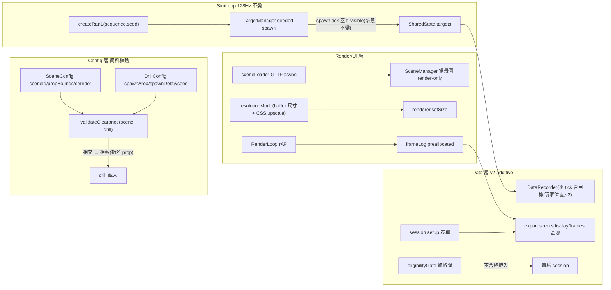

# 階段 C(stage3)執行計畫 — 研究場景與感知實驗(BR 場景 × 追蹤 × 解析度偵測)

> stage3 頂層索引 + tech spec。整合輸入:**2026-07-06 grill 五題拍板**([../../DECISIONS.md](../../DECISIONS.md) **GD-6 ~ GD-10**)+ 追蹤/偵測指標正規定義([../../../../CONTEXT.md](../../../../CONTEXT.md) §A)+ stage2 既有接縫(WP-16 schema v2、WP-18 F5 移動 drill)。
> 格式沿用 [exec-plan/README.md](../../README.md)(每 WP 一個自足子資料夾;task = 垂直切片 = 原子 commit)。文件語言:繁體中文,術語保留英文(D4)。

| | |
|---|---|
| **交付範圍** | 寫實原創 BR 場景系統(資料驅動、可置換、淨空驗證)+ 顯示管線(解析度模式/fullscreen/資格閘/frame-time log/session setup)+ 偵測 drill(seeded pop-in)+ 感知實驗整合(追蹤 × 場景、偵測 × 解析度受試者內 protocol)與驗收清單 C |
| **上游門檻** | 研究側:**GD-6~10 已全數拍板(2026-07-06 grill)**,無未決研究設計。工程側:WP-19/20 僅需 M4 ✅;WP-21 資料面需 WP-16(schema v2);WP-22 需 **M8 + WP-18** |
| **技術棧** | 沿用(Three.js `WebGPURenderer` + TS + Vite;UI = 純 TS + DOM overlay;Vitest + Playwright)+ GLTF 資產管線(`GLTFLoader`,render-only) |
| **估時** | 11.5–16.5 dev-days(WP-19~22;不含 stage2 的 WP-18 +2–3.5) |
| **狀態** | ⬜ 已規劃(2026-07-06);**排程建議**:WP-19/20/21 於 stage2 M6 後三線並行——**M6 ✅ 已達成(2026-07-06),條件成立**;WP-22 待 M8 + WP-18 |

---

## 0. 輸入現況:grill 五題決議 → 本計畫的範圍收斂

> 五題完整決議(含理由/排除選項/失效防範)見 [DECISIONS.md](../../DECISIONS.md) GD-6~10;正規術語(追蹤誤差 ε(t)、t_acquire、TOT%、t_detect、偏心度、雜亂度階層、淨空驗證、資格閘…)見 [CONTEXT.md](../../../../CONTEXT.md)。**本計畫不重複定義,只引用。**

| 決議 | 一句話 | 落點 |
|---|---|---|
| **GD-6** 場景遮擋 | 場景 = **純裝飾(render-only)** + **淨空驗證**(載入期視線走廊 vs prop-bounds,相交拒載);B-full(mesh 衍生 collision)永久排除;宣告式 occluder(C)留升級路徑 | WP-19 T3 |
| **GD-7** 追蹤指標(OQ-S2-5 解決) | 獲取/追隨指標層分離:`t_acquire` + 追蹤窗口內 TOT%/RMS(ε);**原始資料全記錄**(逐 tick `tx,ty,tz,px,pz` + seed/motion 進 meta,落 WP-16 schema v2);指標全離線推導、零 sim 改動 | WP-16 T1(欄)/ WP-18(drill)/ WP-22 T1(整合) |
| **GD-8** 偵測操作化 | 刺激 = **pop-in**(`t_visible`=spawn tick,現行語意);`t_detect` = 瞄準移動 onset(離線,per-trial 雜訊底);偏心度 = 共變數;slide-in 判準已預存(待 C 觸發,本階段不實作) | WP-21 |
| **GD-9** 場景資產 | **寫實原創**(不復刻特定地圖)+ 雜亂度階層(`field-low`/`urban-high`);授權 CC0+CC-BY(附 `ATTRIBUTIONS.md`)、NC/遊戲抽取排除;場景 = 有版本的 config 資料 | WP-19 T2/T5 |
| **GD-10** 顯示硬體 | 全遠端 + **三道 blocking 防線**:軟體資格閘(不合格拒入)、受試者內解析度對比(同面板全條件)、metadata 地板(自動 + 自陳);構念 = 「同一面板上的 render 解析度效應」 | WP-20 / WP-22 T2 |

**與 stage2 的介面**(不重疊、不搶跑):

- **WP-16(schema v2)** 是 stage3 的資料面上游:GD-7/8/10 指定的欄位(逐 tick 目標/玩家位置、`sequence.seed`/motion meta、`scene`/`display`/`frames` optional 區塊)**一次進 v2**——本計畫已回饋 WP-16 T1 scope(見 §9 對帳)。
- **WP-18(F5 移動 drill)** 維持在 stage2(門控**全解**:OQ-S2-5 ✅ + M8 ✅ 2026-07-07;🟢 ready、未展開、待排程):移動目標 sim 驅動、sub-tick 命中內插、render 端目標 alpha 內插、追蹤 drill(timed presentation)。stage3 的 WP-22 T1 **消費** WP-18,把追蹤 drill 放進 BR 場景——建議 WP-18 隨 stage3 一起排。
- **sim 熱路徑零侵入**:stage3 全部工作落在 render/UI/data/驗證層 + `TargetManager` 的 seeded spawn(注入式 RNG,GD-5 紀律)。recoil 鏈(WP-10~13)完全不碰。

---

## 1. 需求(Requirements)

### 1.1 Functional Requirements

> 每條 FR 對應至少一個 WP task(映射欄);驗收句式 = 可機械判定。

| # | 需求(系統必須…) | 映射 |
|---|---|---|
| FR-C1 | 場景由 `SceneConfig` 資料定義(`sceneId` 中性命名、`assetPackVersion`、`clutterTier`、資產 URL、`propBounds` AABB 清單、`playerCorridor` 宣告);`validateScene` 執行期驗證(比照 `validateDrill`:field-path 錯誤、成功回窄化 config);**新增場景 = 新 config,零引擎碼**(F4 精神) | WP-19 T1 |
| FR-C2 | GLTF 場景以 async 管線載入(bootstrap 既有 async 相容);載入失敗 fallback 佔位房間並記 meta;`dispose()` 完整釋放(geometry/material/texture);首個寫實場景 `field-low` 上線,資產全部 CC0/CC-BY 且 `ATTRIBUTIONS.md` 逐項可稽核 | WP-19 T2 |
| FR-C3 | **淨空驗證(GD-6)**:drill 載入時計算視線走廊(玩家走廊 × 目標運動包絡的線段集,prop-bounds 先膨脹 hitbox 半徑 + margin)vs `propBounds` 相交檢查;**相交即拒載**且錯誤訊息指名 prop id 與違規線段;玩家 runtime 逸出宣告走廊 → `suspect`(純觀測) | WP-19 T3 |
| FR-C4 | 場景可於 UI 切換(比照換 drill);meta 增 `scene` 區塊(`sceneId`/`assetPackVersion`/`clutterTier`);**場景切換不影響 sim 決定性**:同輸入序列在不同場景下 sim 狀態逐 tick 一致(自動化斷言) | WP-19 T4 |
| FR-C5 | 第二場景 `urban-high`(雜亂度階層對照)上線;兩場景 render 負載驗證:sim 128Hz 不掉 tick、frame-time 分佈記錄可比對 | WP-19 T5 |
| FR-C6 | 解析度模式 `native`/`fhd-1080`/`qhd-1440`:顯式 render buffer 尺寸 + `setPixelRatio(1)` + CSS 全螢幕 upscale;DOM 準心置中不受內部 buffer 影響(既有 §A 約束);感度為角度制、跨解析度不變(斷言) | WP-20 T1 |
| FR-C7 | **資格閘(GD-10)**:session 開始自動檢查——原生解析度 ≥ 實驗最高條件(`screen.width/height × devicePixelRatio`)、fullscreen 已進入、效能地板(warmup 探測 p95 frame time ≤ 門檻);**不合格 = 拒入實驗 session(明確畫面),非僅記錄** | WP-20 T2 |
| FR-C8 | per-frame render-time log:preallocated 固定容量,逐幀記 rAF timestamp;隨匯出輸出 `frames` 區塊(JSON 完整序列 + 摘要 p50/p95/p99/超標窗數);drill 中 p95 超效能地板 → `suspect` | WP-20 T3 |
| FR-C9 | session setup 表單(純 TS DOM):自陳欄(螢幕型號/原生解析度/面板尺寸/觀看距離)+ **session 識別欄(`participantId`/`sessionLabel`)**;meta 增 `display` 區塊(自動:mode/buffer/CSS 尺寸/dpr/fullscreen/更新率估計/screen 尺寸;手動:自陳欄)與 `session` 區塊(跨場次離線串接鍵;FPSci R3 對齊,2026-07-07 grill) | WP-20 T4 |
| FR-C10 | **seeded spawn 隨機化**:`sequence.seed` 啟用,`createRan1`(重用 [src/recoil/rng.ts](../../../../src/recoil/rng.ts),零相依)注入 `TargetManager`;spawn 位置(yaw 角/距離範圍)與時序(延遲分佈)由 config `spawnArea`/`spawnDelay` 定義;**同 seed 同序列**(決定性測試);**無 seed 的既有 drill 行為逐位不變**(回歸) | WP-21 T1 |
| FR-C11 | 偵測 drill(pop-in,GD-8):目標於 seeded 隨機位置/延遲瞬現,`t_visible` = spawn tick(現行語意,零新判準);推進沿用 P2 + `peekTimeoutMs`;spawn 事件記錄含目標位置 | WP-21 T2 |
| FR-C12 | 偵測離線推導鏈完整:由匯出(aim 逐 tick + 目標位置 + `t_visible`)可推導 `t_detect`(瞄準移動 onset)與偏心度;推導 spec 落 `docs/operational/`,合成 fixture 驗證(已知 onset 的合成 aim 流 → 推導誤差 ≤ 1 tick) | WP-21 T3 |
| FR-C13 | 追蹤 drill × 場景整合:WP-18 移動目標於 BR 場景執行;淨空驗證涵蓋整段運動包絡;E2E 斷言追蹤 drill 匯出含逐 tick 目標/玩家位置且淨空驗證綠 | WP-22 T1 |
| FR-C14 | 解析度受試者內 protocol E2E:資格閘 → 條件序列(對抗平衡由 protocol config 定義)→ 各條件跑 drill → 匯出含 `scene`/`display`/`frames` 區塊與條件標記 | WP-22 T2 |
| FR-C15 | 決定性回歸擴充 + 驗收清單 C:場景/解析度切換不改 sim 狀態序列(逐位);seeded spawn 同 seed 可重現;清單 C 全項通過 = stage3 交付 | WP-22 T3 |

### 1.2 Non-functional Requirements

| 類別 | 量化需求 |
|---|---|
| 效能 | 兩場景 + 彈孔 + 移動目標下 sim 128Hz 不掉 tick(`ticks` 監控無 >1 tick 缺口);frame log 記錄本身零配置(preallocated,GC 紀律);場景載入只在 drill 外(不進熱路徑) |
| 決定性 | 場景/解析度為 render/UI 關注:**既有決定性 baseline 不重錄**(同輸入序列跨場景/解析度 sim 狀態逐位一致,自動化斷言);seeded spawn 為新決定性面(同 seed 同序列,`Math.random` 禁令涵蓋 spawn 路徑,lint/grep 閘擴充) |
| 資產可稽核 | `ATTRIBUTIONS.md` 逐項:資產名/作者/來源 URL/授權/取得日;CI 或 lint 檢查場景資產目錄有對應條目 |
| 量測效度 | `t_visible` 語意不變(spawn tick);顯示鏈延遲差異由 frames 區塊外顯(誤差界線可報告);資格閘防 FHD 面板混入 QHD 條件(GD-10 失效防範) |
| 可維護性 | 解析度模式/效能地板門檻/走廊 margin/frame log 容量皆設定常數;場景與 drill 的組合由 config 宣告,不寫死 |

### 1.3 Constraints(硬約束;WP-19/20/21 T0 採納時回寫 CLAUDE.md §4)

- 沿用階段 A/B 全部硬約束(`performance.now()`、`three/webgpu`、COI、決定性、三迴圈經 SharedState、GC 紀律、純 TS UI、Chromium、sim/recoil 禁 `Math.random()`)。
- **新增:場景幾何永不進 sim runtime**(GD-6):`propBounds` 僅淨空驗證器可讀;`HitDetector`/`TargetManager` 不得引用任何場景資料。
- **新增:場景資產授權白名單**(GD-9):CC0/CC-BY(附 attribution)可 commit;CC-BY-NC/遊戲抽取資產/付費包原始檔**禁入 repo**。
- **新增:spawn 隨機化一律 seeded**(GD-5 延伸):`sequence.seed` → `createRan1`;seed 進匯出 meta。
- 解析度/場景切換僅 render/UI/data 層;`SIM_HZ`、sim 狀態演進、輸入鏈不受影響。

---

## 2. 系統設計(Technical Design)

### 2.1 System boundary

**In scope**:`src/scene/`(新:SceneConfig/validateScene/clearance)、`src/render/sceneLoader.ts`(新:GLTF 管線)、`src/render/SceneManager.ts`(MODIFY:接受 SceneConfig、保留佔位房間 fallback)、`src/display/`(新:resolutionMode/eligibilityGate/frameLog)、`src/ui/`(場景/解析度選擇、session setup 表單)、`src/main.ts`(resize 顯式 buffer 控制、載入時序)、`src/drill/schema.ts`(spawnArea/spawnDelay/seed 啟用)、`src/sim/TargetManager.ts`(seeded spawn)、`src/data/metadata.ts` + `export.ts`(`scene`/`display`/`frames` optional 區塊)、`public/assets/scenes/` + `ATTRIBUTIONS.md`、決定性/E2E 測試擴充、`docs/operational/`(t_detect 推導 spec、驗收清單 C)。

**Out of scope**(防蔓延,各附觸發條件):

- **宣告式 occluder(GD-6 路徑 C)與 slide-in 偵測**:判準已預存(GD-8);觸發 = 偵測研究需要「從掩體現身」生態效度 → 另立 WP。
- **fixation gate(注視閘)**:偏心度先走共變數(GD-8);觸發 = pilot 顯示偏心度變異吞掉解析度效應 → 屆時一併解 GD-4「aim 僅觀測」契約變更。
- **品牌擬真/特定地圖復刻**:GD-9 排除;熟悉度研究 = 授權取得或原版遊戲獨立實驗臂。
- **眼動儀整合**:`t_detect` 為瞄準 onset proxy(GD-8 既知限制);觸發 = 需要純知覺 RT(去動作成分)。
- **付費資產包管線**(gitignore + fetch script):觸發 = 美術方向需要(GD-9)。
- **追蹤 drill 本體 / sub-tick 內插 / timed presentation**:屬 WP-18(stage2);本計畫僅整合消費。

### 2.2 資料流(新增/異動)



雙迴圈邊界不變(ADR-2):場景圖/解析度/frame log 全在 render/UI 側;sim 新增僅 seeded spawn(注入式 RNG,無時鐘、無 DOM)。`propBounds` 資料流終點 = `validateClearance`,**不進** SharedState。

### 2.3 Interface contracts(關鍵簽名)

```ts
// src/scene/SceneConfig.ts(WP-19 T1)—— 場景 = 有版本的 config 資料(GD-9)
export interface PropBound { id: string; min: [number, number, number]; max: [number, number, number] } // u
export interface SceneConfig {
  sceneId: string;                          // 中性命名(GD-9;不掛遊戲名)
  assetPackVersion: string;                 // 資產斷代;進 meta.scene
  clutterTier: 'low' | 'mid' | 'high';      // 雜亂度階層(CONTEXT §A)
  asset: { url: string; displayScale?: number } | null;  // null = 佔位房間(fallback 同路徑)
  propBounds: readonly PropBound[];         // 僅 clearance validator 可讀;永不進 sim(GD-6)
  playerCorridor: { halfWidthU: number };   // 玩家活動宣告(GD-6c;runtime 逸出 → suspect)
}
export function validateScene(json: unknown): SceneConfig;   // 比照 validateDrill(err/require* helpers)

// src/scene/clearance.ts(WP-19 T3)—— GD-6 淨空驗證
export interface ClearanceViolation { propId: string; segment: string }  // 違規線段描述(可讀錯誤)
export function validateClearance(scene: SceneConfig, drill: DrillConfig): ClearanceViolation[];
// 幾何:目標運動包絡 AABB(由 motion type/range/distance 解析式推得)×
// 玩家走廊端點/中點(eye height)→ 線段集;propBounds 膨脹(hitbox 半徑 + CLEARANCE_MARGIN_U)
// 後逐段 slab test。空陣列 = 淨空;非空 = 拒載。過近似政策(保守)記 docs/operational/schema.md。

// src/display/resolutionMode.ts(WP-20 T1)
export type ResolutionMode = 'native' | 'fhd-1080' | 'qhd-1440';
export interface DisplayState {              // meta.display 自動欄的來源(固定欄位)
  mode: ResolutionMode; bufferW: number; bufferH: number; cssW: number; cssH: number;
  dpr: number; fullscreen: boolean; refreshEstimateHz: number;
}
export function applyResolutionMode(renderer: THREE.WebGPURenderer, mode: ResolutionMode): DisplayState;
// 顯式 buffer 尺寸 + setPixelRatio(1) + CSS 100% —— 感度(角度制)與 DOM 準心置中不受影響

// src/display/eligibilityGate.ts(WP-20 T2)—— GD-10 三道防線之一
export interface GateReport { pass: boolean; native: boolean; fullscreen: boolean; perf: boolean; details: string }
export function runEligibilityGate(required: { minW: number; minH: number }, warmupP95Ms: number): GateReport;
// 不合格 → 實驗 session 拒入(UI 明確顯示原因);一般練習不受限

// src/display/frameLog.ts(WP-20 T3)—— preallocated(GC 紀律)
export interface FrameLog { push(tMs: number): void; summary(): { p50: number; p95: number; p99: number; overBudget: number }; series(): readonly number[] }
export function createFrameLog(capacity: number): FrameLog;  // 容量 = maxDrillSeconds × MAX_DISPLAY_HZ

// src/drill/schema.ts 擴充(WP-21 T1;additive 選填,舊 drill 不變)
// targets.spawnArea?: { yawDegRange: [number, number]; distanceURange: [number, number] }
// sequence.spawnDelayMsRange?: [number, number]   // seeded 均勻取樣
// sequence.seed 啟用:給 → createRan1 注入 TargetManager;未給 → 既有交替行為(逐位不變)

// src/data/metadata.ts 擴充(WP-16 T1 加 v2 區塊縫;WP-19/20 填值)
// meta.scene?:   { sceneId, assetPackVersion, clutterTier }
// meta.display?: DisplayState + 自陳欄(monitorModel?/panelInches?/nativeW?/nativeH?/viewingDistanceCm?)
// meta.spawn?:   { seed, spawnArea, spawnDelayMsRange }
// 匯出 frames?: number[] + 摘要 —— 全部 additive optional;schemaVersion 政策見 §2.5
```

### 2.4 淨空驗證幾何(關鍵決策,GD-6)

- **保守過近似**:走廊 = 玩家走廊取樣點(端點 + 中點,eye height)×目標包絡採樣點(AABB 8 角 + 中心)的**線段集**;propBounds 先膨脹目標 hitbox 半徑 + `CLEARANCE_MARGIN_U`(設定常數,起點 0.5u)。段 vs AABB 用 slab method(精確、零相依)。
- **等價性論證**(GD-6d):走廊淨空 ⇒ 場景幾何永不落在任何 camera→目標線段上 ⇒ 對場景 raycast 與無場景**逐位元等價** ⇒ sim 不需場景知識、決定性 baseline 不分裂。
- **驗證時機**:drill 載入(換 drill/換場景/restart 皆重跑);O(玩家取樣 × 目標取樣 × props),百級 props 毫秒級,不進熱路徑。
- 玩家 runtime 逸出 `playerCorridor` → 該 drill 標 `suspect`(觀測性,比照 `recorderOverflow`;不 clamp、不改 sim 演進)。

### 2.5 schema 政策(v2 additive,不二次斷代)

GD-5/OQ-S2-3 既定「`schemaVersion` bump 留 WP-16 一次做」。stage3 遵守:**GD-7 指定的逐 tick 欄(`tx,ty,tz,px,pz`)與 meta `spawn` seed/motion 隨 WP-16 T1 一次進 v2**(已回饋 WP-16 scope,見 §9);`scene`/`display`/`frames`/`session` 為 **v2 的 optional 區塊**(schema.md 定義為 reserved,WP-19/20 填值;`session` = `participantId`/`sessionLabel` 跨場次串接鍵,WP-20 T4 填值,FPSci R3 對齊 2026-07-07)——additive、無語意重解釋,**不再 bump**。舊 v2 資料無這些區塊 = 該功能未啟用,語意自明。

### 2.6 Failure modes(對應 High/Med risk task)

| 觸發條件 | 影響 | 處理策略 |
|---|---|---|
| 場景資產壓垮 render(draw calls/texture)→ 掉幀 | 顯示鏈延遲汙染 t_detect/追蹤體感 | frame log 外顯 + 效能地板 `suspect`(FR-C8);WP-19 T5 兩場景負載驗證為 DoD;資產預算(三角形/材質數)記 SceneConfig 註記 |
| 淨空驗證過鬆(漏擋)或過嚴(誤擋) | 漏擋 = 效度破口;誤擋 = 場景做不出來 | 保守過近似 + margin 常數可調;誤擋錯誤指名 prop id + 線段(可修 config);漏擋防線 = 走廊等價性論證 + T3 對抗性測試(構造恰好相交/恰好不相交 fixture) |
| GLTF 載入時序與 drill 開始競態 | drill 在場景未就緒時開跑 | 載入 gating:場景 ready 前 drill 控制停用(UI disabled);E2E 斷言 |
| `screen.width × dpr` 在 Windows DPI 縮放下判斷錯誤 | 資格閘誤放/誤擋 | T2 以多組 DPI 情境(100%/125%/150%)手動驗證矩陣記 progress;取 `screen` + `matchMedia` 交叉檢核 |
| seeded spawn 改動波及既有 drill 決定性 | 既有 baseline 全紅 | 無 seed 路徑逐位不變為 T1 DoD(既有決定性回歸先跑);seeded 路徑另立新 baseline |
| frame log push 在熱路徑配置物件 | GC 卡頓汙染 frame time 本身 | preallocated Float64Array + 游標;容量滿 = 停記 + 旗標(比照 arena 紀律) |
| 資產授權漂移(來源下架/授權變更) | public repo 合規風險 | `ATTRIBUTIONS.md` 記取得日 + 授權快照;lint 檢查資產目錄↔attribution 對應 |

### 2.7 Concurrency model

單執行緒單一 rAF 超級迴圈不變。GLTF 載入為 async(bootstrap/切換時,drill 外);`frameLog` 為 render 專屬;seeded RNG 為 sim 專屬(TargetManager 閉包)。無共享可變性新增。Worker 遷移仍 out of scope(stage2 §2.1 觸發條件不變)。

---

## 3. WP 索引(⬜ 未開始 · 🟡 進行中 · ✅ 完成)

> 每 WP 展開為自足子資料夾(`README.md` + `task-checklist.md` + `progress.md` + `T0-entry-gate` → `Tn` → `T-exit-gate`)。編號接續 stage2(WP-10~18)。

| WP | 子資料夾 | 目標 | 里程碑 | 相依 | 估時 | 狀態 |
|---|---|---|---|---|---|---|
| **WP-19** | [wp-19-scene-system/](wp-19-scene-system/README.md) | 場景系統:SceneConfig + GLTF 管線 + 淨空驗證 + 場景切換/meta + 兩個雜亂度階層場景 | **M9** | M4 ✅(可與 stage2 尾段並行) | 4–6 | ⬜ |
| **WP-20** | [wp-20-display-pipeline/](wp-20-display-pipeline/README.md) | 顯示管線:解析度模式 + fullscreen/資格閘 + frame-time log + session setup 表單/display meta | — | M4 ✅(可並行) | 3–4 | ⬜ |
| **WP-21** | [wp-21-detection-drill/](wp-21-detection-drill/README.md) | 偵測 drill:seeded spawn 隨機化 + pop-in drill + t_detect/偏心度離線推導 spec | — | T1/T2 獨立;T3 需 WP-16(v2 欄) | 2.5–3.5 | ⬜ |
| **WP-22** | [wp-22-perception-integration/](wp-22-perception-integration/README.md) | 感知實驗整合:追蹤 × 場景 + 解析度受試者內 protocol E2E + 決定性回歸 + 驗收清單 C | **M10** | WP-19, 20, 21 + **WP-18(M8 後)** | 2–3 | ⬜ |

---

## 4. 里程碑門控

| 里程碑 | 完成條件 | 對應 WP | 意義 |
|---|---|---|---|
| **M9** | 場景可置換(≥2 個雜亂度階層)+ 淨空驗證會拒載違規 drill + 同輸入序列跨場景 sim 狀態逐位一致 + 資產 attribution 可稽核 | WP-19 | 場景脊椎成立:「換場景零引擎碼」與「場景不碰決定性」兩個承諾被測試釘死 |
| **M10** | 驗收清單 C 全項通過:資格閘拒入/放行正確、受試者內解析度 protocol E2E 綠、追蹤 × 場景 E2E 綠、偵測推導 fixture 綠、決定性回歸(場景/解析度不變性 + seeded spawn 重現)全綠 | WP-22 | **stage3 交付**:兩個感知實驗(追蹤能力、解析度 × 偵測)可開 pilot |

> WP-20/21 無獨立里程碑:其交付由 M10 驗收清單 C 一次收斂(比照 stage2 WP-11/12 → M6 的模式)。

---

## 5. 相依圖(關鍵路徑)

```
WP-19(場景,M9)────────────────┐
WP-20(顯示管線)────────────────┼→ WP-22(整合,M10)= stage3 交付
WP-21(偵測 drill;T3 需 WP-16)─┤
[stage2] WP-18(F5;entry = M8)──┘
```

- **三線可並行**:WP-19、WP-20、WP-21(T1/T2)互不相依,且皆不碰 stage2 recoil 鏈(WP-13~15)的檔案熱區。
- **建議排程**:stage2 M6(WP-13)收斂後開跑,避免 main 雙線大改;WP-21 T3 與 WP-22 T1 分別等 WP-16、WP-18。
- **M9 未過不進 WP-22**(場景脊椎邏輯,比照 M1/M5)。

---

## 6. 任務拆解(已展開為 per-WP 自足 task 檔,2026-07-06)

| WP | Task 檔 |
|---|---|
| **WP-19** scene-system(M9) | [wp-19-scene-system/](wp-19-scene-system/README.md):T0 → T1 SceneConfig schema → T2 GLTF 管線 + field-low → T3 淨空驗證器 → T4 場景切換 + meta → T5 urban-high + perf → T-exit |
| **WP-20** display-pipeline | [wp-20-display-pipeline/](wp-20-display-pipeline/README.md):T0 → T1 解析度模式 → T2 fullscreen + 資格閘 → T3 frame-time log → T4 session setup 表單 → T-exit |
| **WP-21** detection-drill | [wp-21-detection-drill/](wp-21-detection-drill/README.md):T0 → T1 seeded spawn → T2 偵測 drill config → T3 離線推導 spec + fixtures → T-exit |
| **WP-22** perception-integration(M10) | [wp-22-perception-integration/](wp-22-perception-integration/README.md):T0 → T1 追蹤 × 場景 → T2 解析度 protocol E2E → T3 決定性回歸 + 驗收清單 C → T-exit |

---

## 7. 風險分析

| 風險 | 等級 | 說明與緩解 |
|---|---|---|
| 場景資產效能(WebGPU draw calls/貼圖記憶體) | **High** | 資產預算前置(T2 選型即驗證)、frame log 外顯、T5 兩場景負載 DoD;fallback = 降階資產或縮 clutter 範圍 |
| 淨空驗證幾何錯(漏擋/誤擋) | **High** | 保守過近似 + 對抗性 fixture(§2.6);等價性論證寫進 schema.md 供審查 |
| 資格閘跨硬體誤判(Windows DPI/多螢幕) | Med | DPI 矩陣手動驗證;`details` 全量記 meta 供事後審查;誤擋成本低(重試)、誤放由 meta 事後可偵測 |
| WP-16/WP-18 時程滑動拖住 WP-21 T3 / WP-22 | Med | task 級相依明確(T0 gate);WP-19/20 與 WP-21 T1/T2 不受影響,可先交付 |
| 匯出量膨脹(frames 序列 + 逐 tick 位置欄) | Med | v2 容量重估已含逐 tick 欄(WP-16);frames 容量固定(≈72k floats/300s);JSON 完整、CSV 只摘要(OQ-S3-4) |
| **Technical debt(有意識妥協)** | — | ① slide-in/宣告式 occluder 只預存判準不實作(GD-8;觸發見 §2.1)② 偏心度共變數而非 fixation gate(GD-8)③ `t_detect` 為動作 onset proxy(無眼動儀)④ 更新率估計靠 rAF deltas(非 API 保證)⑤ 觀看距離自陳(不可量測) |

---

## 8. Open Questions

| # | 問題 | 建議(計畫預設) | Owner | Deadline | 未決影響 |
|---|---|---|---|---|---|
| OQ-S3-1 | 效能地板門檻(資格閘 warmup p95 ≤ ?ms;drill 中 suspect 門檻) | 起點:p95 ≤ 8.33ms(120Hz 等效),pilot 後校 | 研究者 | WP-20 T2 | 資格閘 DoD 無法客觀判定 |
| OQ-S3-2 | `t_detect` 參數 pre-registered 起點(θ_v 相對雜訊底倍率、持續 k tick) | 起點:θ_v = 3× 前刺激窗 SD、k = 4 tick(≈31ms);敏感度分析離線做 | 研究者 | WP-21 T3(spec 內給預設) | 不阻塞引擎;分析 spec 需標「暫定」 |
| OQ-S3-3 | 場景資產具體選型(CC0/CC-BY pack 清單與雜亂度對應) | T2 前列 3 候選(PolyHaven/Kenney/Sketchfab CC-BY 各一)比 draw calls/授權 | 使用者 | WP-19 T2 | T2 無法開工 |
| OQ-S3-4 | frames 匯出形式(完整序列 vs 摘要) | JSON 完整序列 + 摘要;CSV 只摘要 | 研究者 | WP-20 T3 | 匯出大小與分析端便利性 |
| OQ-S3-5 | 追蹤 drill 的 presentation 時長/速度階層設計(WP-18 展開時定) | 對帳點:WP-18 T0 與本計畫 WP-22 T1 互記 | 研究者 | WP-18 entry | WP-22 T1 消費面 |

---

## 9. 文件對帳清單(採納本計畫時執行;跨文件決策入 DECISIONS.md)

- [x] [DECISIONS.md](../../DECISIONS.md) **GD-6 ~ GD-10** 五筆決議入帳。(2026-07-06 grill)
- [x] [CONTEXT.md](../../../../CONTEXT.md) 新術語:追蹤誤差 ε(t)/on-target、t_acquire、TOT%/追蹤窗口、偵測反應時間/t_detect、偏心度、pop-in/slide-in、雜亂度階層、資格閘、純裝飾場景、淨空驗證、SceneConfig/sceneId;§D F5 接縫列更新。(2026-07-06 grill)
- [x] [stage2 README §8](../stage2/README.md) OQ-S2-5 翻 ✅ 指向 GD-7。(2026-07-06 grill)
- [x] [exec-plan/README.md](../../README.md) §2 加 stage3 索引表;§3 加 M9–M10;§4 相依圖擴充。(2026-07-06 本計畫)
- [x] [WP-16 README/T1](../../completed/stage2/wp-16-metrics-export-v2/README.md) scope 回饋:GD-7 逐 tick 欄(`tx,ty,tz,px,pz`)+ meta `spawn`(seed/motion)+ `scene`/`display`/`frames` reserved optional 區塊。(2026-07-06 本計畫)
- [x] [WP-18 README stub](../stage2/wp-18-f5-subtick/README.md) 更新:OQ-S2-5 ✅ → entry 僅餘 M8;指標定義指向 GD-7;stage3 WP-22 消費對帳。(2026-07-06 本計畫)
- [ ] [CLAUDE.md](../../../../CLAUDE.md) §4 硬約束追加(§1.3 三條新增項)——落 WP-19/20/21 各自 T0(採納即回寫)。
- [ ] 規格書升 **v1.3**:新增「階段 C:研究場景與感知實驗」節 + 附錄 E 增「驗收清單 C」+ F5/附錄 F 對帳(既有懸案一併收);GD-6~10 為權威來源。
- [ ] `docs/operational/schema.md`:`scene`/`display`/`frames`/`spawn` 區塊 + 逐 tick 位置欄對帳(隨 WP-16 T1 / WP-19 T4 / WP-20 T3 分批)。

---

## 10. 執行規則

沿用 [exec-plan/README.md §5](../../README.md):一 task = 一垂直切片 = 一原子 commit;task 完成更新該 WP `progress.md` + checklist;跨 WP 先驗上游 exit-gate;**M9 未過不展開 WP-22**(場景脊椎未鎖不做整合)。WP 展開格式以 stage2 各 WP 為模板(`completed/stage1/wp-2-dual-loop-skeleton/` 為原始模板)。
