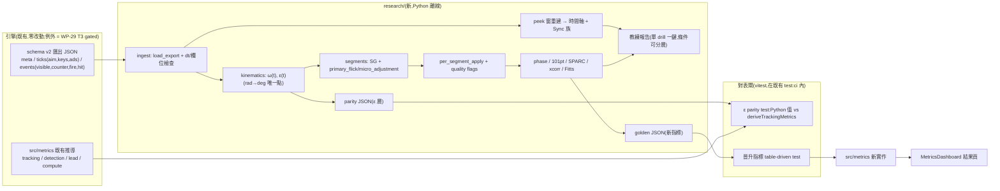

# 階段 D(stage4)執行計畫 — 選手表現分析管線(research 層:瞄準 × 急停診斷指標)

> stage4 頂層索引 + tech spec。**✅ 已採納(2026-08-04,GD-19/GD-20)**;草稿原案 2026-07-09 提案。
> 整合輸入:performance_analysis repo 架構分析與移植評估(2026-07-09)+ 教練視角優先序排序(目標:更有效追蹤選手**瞄準**與**急停**表現)+ stage1–3 既有資料面(WP-16 schema v2、WP-21 偵測 drill、WP-8 `MetricsDashboard`)+ **採納期讀碼對帳(2026-08-04,見 §0.1)**。
> 格式沿用 [exec-plan/README.md](../../README.md)(每 WP 一個自足子資料夾;task = 垂直切片 = 原子 commit)。文件語言:繁體中文,術語保留英文(D4)。

| | |
|---|---|
| **交付範圍** | 離線分析 research 層(Python,四目錄制,學 performance_analysis):schema v2 匯出 → 角運動學/submovement 分段地基(**含 ε 層雙向 parity**)→ 教練診斷指標(逐 peek 時間軸、Release-to-Click Sync、REC/MR/V phase、L/R 101 點曲線)→ 進階診斷(SPARC、Key-Velocity Coupling、Fitts)→ 成熟指標以 golden parity 晉升 TS `MetricsDashboard` |
| **上游門檻** | M4 ✅(schema v2 匯出鏈)+ WP-16 ✅(v2 欄位)+ **M11/M12 ✅**(`meta.targets.hitbox`/tick `ads`/`hit` 事件語意已鎖);**引擎零改動**(例外:WP-29 T3 選配 key-event 記錄、WP-32 metrics/UI 層,皆不碰 sim)。M13 手動回填(#32)**不阻塞** |
| **技術棧** | 新增:**Python 3.12 + uv + pyproject**(numpy/pandas/scipy;pytest)於 `research/`(OQ-S4-1 ✅);既有 TS 棧觸及點 = 對表 vitest(WP-28 T2、WP-32 T1)+ `src/metrics/` 與結果頁(WP-32) |
| **估時** | 11–16 dev-days(WP-28~32) |
| **狀態** | 🟡 **已採納;WP-28 task 全數完成,M14 六項全數恢復/重新宣告**(見下)· WP-29 ✅ 完成(2026-08-05,**不受 KI-004/005/006 阻塞**,只吃 `events`/`ticks[].keys`)· WP-30 ✅ 完成(2026-08-10)· WP-31 ✅ **完成(2026-08-12)**:T0~T3 + T-exit 全數交付,三個 P2 指標(SPARC/xcorr/Fitts)收斂為研究向/`blocked-by-data`,`coach-report-v2` 已含研究向區塊,WP-32 交接清單為空· WP-32 ⬜。**M14 ①⑥ 維持**(ingest/dt、pytest 綠,與 aim 差分/行為內容無關)。**M14 ②** 因 ε(t) 量測原點錯誤(D2a/D2b,實測偏差 12.5°/67°)於 2026-08-05 撤回,**已於 [KI-004](../../../known_issue/KI-004-sim-world-unit-domain-mismatch.md) S1 落地後重新宣告(2026-08-06)**。**M14 ③④⑤** 另因 [KI-005](../../../known_issue/KI-005-omega-render-sim-aliasing.md)(ω(t) render/sim aliasing)+ [KI-006](../../../known_issue/KI-006-m14-sample-no-counterstrafe.md)(真實樣本無 counter-strafe 構念)於 2026-08-06 撤回,**已於 [A2-T4](../../../known_issue/KI-005-A/A2-blocked-plan.md#a2-t4--m14-③④⑤-重新宣告-✅-已完成2026-08-07) 重新宣告(2026-08-07)**——KI-005 A1+A2 全數落地、KI-006(C+B)全數落地並 CLOSED。**WP-30/31 entry blocker 三條理由(KI-004/KI-005/KI-006)全數解除**,可展開。效度聲稱不擴大:仍限單一匿名受試者、n=3 session、非母體層級證據 |

---

## 0. 輸入現況

### 0.0 優先序決議 → WP 映射

> 排序原則(2026-07-09 教練視角評估):**一個指標的價值 = 它能不能改變下一週的訓練處方**。四個評估軸:教練決策價值 / 資料就緒度(schema v2 是否已有欄位)/ 演算法風險(移植已驗證 vs 新構念)/ 依賴關係。**本表為 scope 憲法**。

| 優先序 | 項目 | 排序理由(一句話) | 落點 |
|---|---|---|---|
| **P0-1** | 逐 peek counter-strafe 時間軸 | 教練第一線是個案回放不是統計量;欄位全在 schema v2,成本趨近零 | WP-29 T1 |
| **P0-2** | 角運動學 ω(t) + submovement 分段 | 單點故障:沒有它,P1/P2 全部軌跡指標沒有立足點;唯一需要認真校參的地基 | WP-28 T2/T3 |
| **P1-1** | REC/MR/V phase 分解 | 回答「慢在哪一段」→ 直接分流訓練處方;與既定 t_detect(GD-8)/t_acquire(GD-7)構念對接,不發明新概念 | WP-30 T1 |
| **P1-2** | Release-to-Click Sync 指標族 | 急停的本質 =「鬆鍵→反向鍵→開槍」三元組時序;既有 `fireTimingAlignmentMs` 的錨點族補齊,成本極低 | WP-29 T2 |
| **P1-3** | L/R 條件化 101 點正規化曲線 | 把既有 L/R symmetry 標量升級成「動作簽名曲線」;performance_analysis 象限儀表板已證明教練價值的形式 | WP-30 T2 |
| **P2-1** | SPARC(逐段平滑度) | 疲勞/緊繃早期警訊,但是監控儀表不是處方箋;價值隨個人基線累積 | WP-31 T1 |
| **P2-2** | Key-Velocity Coupling xcorr(keys vs ω) | strafe-aim 干擾指標,最有原創價值但**構念未驗證**——先過 reliability gate 才能進教練報告 | WP-31 T2 |
| **P2-3** | Fitts ID/MT/TP | 方法學成熟但被 drill 多樣性 gate 住;WP-21 偵測 drill 的 seeded `spawnArea` 提供 D 變異後升值 | WP-31 T3 |
| **P3(backlog)** | LDJ-V、velocity scaling、RawInputTrace/schema v3、瀏覽器保真度 bench、polling rate 實驗 | 研究向/儀器向,不改變教練追蹤選手的能力;唯一動引擎的項目留給明確研究委託 | §2.1 out of scope(附觸發條件) |

**與 performance_analysis 的關係**(移植評估結論,2026-07-09):

- performance_analysis 的 fusion 模組在解「三時鐘域對齊」;本專案單一 `performance.now()` 時鐘 + 128Hz 均勻 tick,**該層成本歸零**,移植重心全在 analysis 演算法。
- 可移植:submovement 分段(閾值演算法)、SPARC、REC/MR/V phase、101 點正規化、Release-to-Click Sync、Key-Velocity xcorr、`per_segment_apply` 模式、四目錄制紀律(`algorithms/` 純函式 + `notebooks/` + `parity_generators/` + `tests/`)。
- **參數不可照搬**:px/s → deg/s(yaw 乘 cos(pitch));SG window 於 128Hz 重掃(performance_analysis Go 用 w=7/p=3 是高頻資料)。
- 授權:performance_analysis 為自有 repo,程式碼可移植;FPSci 紅線不變(GD-11,方法學可參考、程式碼不可抄)。

### 0.1 採納期對帳(2026-08-04):草稿寫成後的四項現況變更

| # | 草稿假設(2026-07-09) | 現況(2026-08-04) | 對計畫的影響 |
|---|---|---|---|
| 0-1 | 預留 WP-23~27 / M11~M12 | stage5 取 WP-23~26 / M11~M13(GD-15)、muzzle-tracer 取 WP-27(GD-18) | **重編為 WP-28~32 / M14~M15 / 驗收清單 D**(`docs/operational/acceptance-stage-d.md`) |
| 0-2 | 「schema v2 = ticks(aim/keys) + events(visible/counter/fire)」 | stage5 additive 已上線:tick `ads`、event `hit`(`t_hit`/`timeOfFlightMs`/`shotSeq`)、`meta.weapon.ads/bullet`、`meta.targets.hitbox` | ingest 必須認全部 additive 欄;**ADS/projectile 成為分析的條件分層維度**(不是雜訊) |
| 0-3 | 「ε(t) 是本 stage 新推導」 | ε(t) 語意、`eyeY=1.6`、hitbox 來源、peek 窗 `[t_visible, nextVisible.t)` **已被 TS 實作釘死**([trackingDerivation.ts](../../../../src/metrics/trackingDerivation.ts)、[detectionDerivation.ts](../../../../src/metrics/detectionDerivation.ts) + [analysis-tracking.md](../../../operational/analysis-tracking.md)/[analysis-t-detect.md](../../../operational/analysis-t-detect.md)) | **parity 由單向改雙向**(§2.4a,本計畫最重要的設計修正):既有構念 TS 為權威、Python 對表;新構念 Python 為權威、TS 對表 |
| 0-4 | 「與 WP-18/WP-22 並行、無熱區重疊」 | 兩者皆已交付;目前**無 active WP** | 零檔案競爭;唯一 open 的上游是 M13 手動回填(#32),**不阻塞** research 層 |

**兩項讀碼發現(影響 FR 定義)**:

- **schema 沒有 `kill`/`timeout` 事件**([schema.md](../../../operational/schema.md) events = visible/counter/ads/fire/hit)。草稿 FR-D6 的 `t_kill/timeout` 必須**推導**:hitscan → `fire.hit === true`;projectile → 以 `shotSeq` 關聯的 `hit` 事件;timeout → 窗內無命中。窗界必須沿用 TS 既有定義,不得另立。
- **`counter` 事件是條件性的**:[SimLoop.ts:73-76](../../../../src/loop/SimLoop.ts#L73-L76) 只在 `ev.down && !held(反向) && vx 反號` 時記錄 → 已停住才開槍的 peek **沒有 counter 事件**。故 Sync 族的缺事件是常態語意,必須是 `flag` 而非 NaN。t_release(原方向鍵放開)無事件,只能自 `ticks[].keys` 取(±1 tick = 7.8125ms)。

### 0.2 編號重編對照(GD-19)

| 草稿編號 | 採納後 | 目標 |
|---|---|---|
| WP-23 research-foundation | **WP-28** | research 地基(M14) |
| WP-24 coach-timeline | **WP-29** | 教練第一層 |
| WP-25 trajectory-metrics | **WP-30** | 軌跡診斷 |
| WP-26 advanced-diagnostics | **WP-31** | 進階診斷 |
| WP-27 dashboard-integration | **WP-32** | 晉升整合(M15) |
| M11 / M12 | **M14 / M15** | research 地基 / stage4 交付 |
| 驗收清單 D | 不變(`acceptance-stage-d.md`) | — |

> OQ 編號 **`OQ-S4-n` 保持不變**(草稿期已被引用,保留可追溯性);新增者續編 OQ-S4-7/8。

---

## 1. 需求(Requirements)

### 1.1 Functional Requirements

| # | 需求(系統必須…) | 映射 |
|---|---|---|
| FR-D1 | `research/` 四目錄制成立:`modules/{ingest,kinematics,segments,metrics}/` 各含 `algorithms/`(純函式,禁 plotting/print/file I/O)+ `notebooks/` + `tests/`;`shared/filters/`(SG/Butterworth) | WP-28 T1 |
| FR-D2 | schema v2 匯出 loader:JSON → meta/ticks/events(pandas),欄位/單位對表 [schema.md](../../../operational/schema.md),**含 stage5 additive 欄**(tick `ads`、`hit` 事件、`meta.weapon.ads/bullet`、`meta.targets.hitbox`、`meta.scene/display/session`);dt 均勻性檢查(128Hz、缺 tick 偵測);壞值/缺欄拋 field-path 錯誤 | WP-28 T1 |
| FR-D3 | 角運動學:由 `ticks[].aim`(rad)推導 ω(t)(deg/s,yaw 分量乘 cos(pitch))與 ε(t)(deg);ε(t) 的 `eyeY`/hitbox/窗界語意**逐項沿用** [analysis-tracking.md](../../../operational/analysis-tracking.md),零新定義;rad→deg 轉換為全 research 層唯一發生點 | WP-28 T2 |
| FR-D4 | **ε 層雙向 parity**:Python 對同一匯出算出的 `tAcquireMs`/`totPercent`/`rmsEpsilonDeg`/`medianEpsilonDeg`/`p95EpsilonDeg` 與 TS `deriveTrackingMetrics` 逐 presentation 相對誤差 ≤ 1e-9;閘門落在**既有 `test:ci`**(vitest 讀 Python 產出的 parity JSON) | WP-28 T2 |
| FR-D5 | submovement 分段:ω(t) 經 SG 平滑後切 `primary_flick` / `micro_adjustment`(演算法骨架移植 performance_analysis,閾值/單位重校並 pre-registered 凍結);合成 fixture 邊界誤差 ≤ 2 tick;真實資料附分段成功率與疊圖 | WP-28 T3 |
| FR-D6 | `per_segment_apply` 泛用逐段計算 + 逐 peek/逐段 quality `flags`(失敗是資料不是缺失值;fallback reason 全記錄且可枚舉) | WP-28 T4 |
| FR-D7 | 逐 peek 時間軸:每 peek 的 t_visible → t_counter → t_release → t_fire(首發 + 補槍)→ **t_hit/timeout(推導,§0.1)** 事件時間軸圖 + drill 級摘要表;**窗界 = `[t_visible, nextVisible.t)`**(末筆 +∞,與 TS 同義) | WP-29 T1 |
| FR-D8 | 時間軸交叉驗證:同一匯出上,Python 重算的 `counterReactionMs`/`fireTimingAlignmentMs`/`firstShotHitRate` 與 [compute.ts](../../../../src/metrics/compute.ts) 相對誤差 ≤ 1e-9;不一致即 bug 或語意分歧,須入 [DECISIONS.md](../../DECISIONS.md) | WP-29 T1 |
| FR-D9 | Release-to-Click Sync 族:`t_fire − t_release(原方向鍵)`(自 `ticks[].keys`,±1 tick)、counter 鍵持續時間、`t_fire − t_counter`(對表既有指標);缺事件 peek 標 flag 不進聚合;附**量化精度評估報告** | WP-29 T2 |
| FR-D10 | (選配,gated)`DataRecorder` 增 `key` 事件(down/up,input `timeStamp`):**僅當** T2 精度評估依 §2.4d 判準判定不足;additive schema v2 optional 欄、data 層改動、sim 零侵入、既有決定性 baseline 零重錄 | WP-29 T3 |
| FR-D11 | REC/MR/V phase 分解:每 peek 切反應期/主運動期/驗證期(Butterworth 零相位邊界偵測,參數校 128Hz);輸出三段時長 + peak ω + flags;REC 邊界與 t_detect 推導([analysis-t-detect.md](../../../operational/analysis-t-detect.md))一致性檢查 | WP-30 T1 |
| FR-D12 | L/R 101 點正規化曲線:每 peek `[t_visible, t_firstShot]`(OQ-S4-5)重採樣 101 點,ω(t)/ε(t) 逐 side 平均曲線 + 分佈帶 + L/R 疊圖,圖上顯示 n(L)/n(R) | WP-30 T2 |
| FR-D13 | SPARC:逐 `primary_flick`(20Hz cutoff;fs=128 相容性斷言);與 performance_analysis Python 實作 golden 對表(同輸入同輸出,≤1e-9) | WP-31 T1 |
| FR-D14 | Key-Velocity Coupling:signed A/D key state(自 `ticks[].keys`)vs ω(t) 的 lagged xcorr(peak lag/strength + correlogram);**內建構念驗證 gate**,未達標 → 標研究向、不進教練報告。**gate 的操作化已於 2026-08-10 由 `gate-v1` 取代**(circular-shift null / bootstrap CI / 奇偶半分):字面的 split-half reliability 在 1 受試者樣本結構下不可計算,見 OQ-S4-3 關閉紀錄 | WP-31 T2 ✅ |
| FR-D15 | Fitts ID/MT/TP:ID = log₂(1 + D/W)(D = spawn 偏心角,自 `visible.targetX/Y/Z` + aim@spawn;W = 目標角尺寸,自 `meta.targets.hitbox`);MT = t_firstShot − t_visible;D 變異不足時輸出明確 `blocked-by-data` 判定 | WP-31 T3 |
| FR-D16 | 教練報告管線:單一 drill 匯出 → 一鍵產出靜態報告(時間軸 + sync + phase + L/R 曲線 + 通過 gate 的 P2 指標),含每指標 n、quality flags 與參數版本 metadata;**條件分層可切**(ads on/off、hitscan/projectile、scene、解析度) | WP-29/30/31 T-exit 累積 |
| FR-D17 | 晉升機制:選定指標由 Python 產 golden fixtures → `src/metrics/` TS 實作 + table-driven 對表(≤1e-9);結果頁擴充(純 TS + DOM,D1);**統計 = 匯出**不變式維持 | WP-32 T1/T2 |

### 1.2 Non-functional Requirements

| 類別 | 量化需求 |
|---|---|
| 效度 | 每個進教練報告的指標:合成 fixture 測試 + 真實資料檢核 + 已知限制記錄三者齊;新構念(P2)過 reliability gate 才可對選手解讀 |
| 決定性 | research 層唯讀消費匯出,引擎決定性 baseline 零影響;WP-29 T3(若觸發)與 WP-32 走既有 additive schema 政策(stage3 §2.5),**不 bump `schemaVersion`、不重錄任何 golden** |
| 可重現 | 分析參數(SG window、分段閾值、Butterworth cutoff、gate 門檻)全部設定常數 + 版本字串寫入報告 metadata;同一匯出 + 同參數 → 同報告(圖檔除外) |
| 純度 | `algorithms/` 零副作用:測試斷言 import 後無檔案寫入、無 matplotlib import;繪圖與 I/O 只在 `notebooks/` |
| 單位 | 角度 deg、時間 ms(量測時鐘域)、速度 u/s——對齊 CONTEXT 正規單位;rad→deg 只在 kinematics 層一處 |
| 工具鏈 | `uv run pytest` 全綠為 research 閘;engine `npm run test:ci` **不引入 Python 相依**(OQ-S4-7 ✅) |
| Fixture 體積 | 真實匯出 fixture ≤ 30s drill(≈3840 ticks)、`participantId` 匿名化後才可進 repo(OQ-S4-8 ✅) |

### 1.3 Constraints(硬約束;WP-28 T0 回寫 CLAUDE.md §4)

- 沿用 [CLAUDE.md §4](../../../../CLAUDE.md) 全部既有硬約束(不逐條重抄);本 stage 特別相關:GD-11 FPSci 紅線、統計 = 匯出、sim 熱路徑零侵入、禁 `Date.now()`(量測時鐘域 = `performance.now()`)。
- **C-D1**:`research/` ↔ `src/` **單向隔離** — research 只讀匯出 JSON/CSV 與 golden fixture,**不得 import 任何 TS 模組**;`src/` 不得 import Python 產物(唯一例外 = committed golden/parity JSON fixture)。
- **C-D2**:`algorithms/` 純函式紀律(禁 matplotlib/print/file I/O;繪圖與 I/O 落 `notebooks/`)。
- **C-D3**:**教練報告紅線** — 未通過構念驗證(reliability gate)的指標不得進教練報告;寧可少一個指標,不能有一個會說錯話的指標。
- **C-D4**:**既有構念不得有第二定義** — ε(t)/on-target/t_acquire/t_detect/peek 窗界以 `docs/operational/analysis-*.md` + `src/metrics/` TS 實作為權威;Python 側任何差異視為 bug,或屬須入帳的語意分歧(不得靜默各算一套)。

---

## 2. 系統設計(Technical Design)

### 2.1 System boundary

**In scope**:`research/`(新,全部)· `research/fixtures/`(匯出樣本 + parity/golden JSON)· `tests/golden/research/` + 對表 vitest(新,§2.4a)· `docs/operational/analysis-segments.md`(新,分段參數 registry)+ `acceptance-stage-d.md`(新,驗收清單 D)· `src/data/DataRecorder.ts` + [schema.md](../../../operational/schema.md)(**僅** WP-29 T3 觸發時,additive `key` 事件)· `src/metrics/` + 結果頁(**僅** WP-32)。

**Out of scope**(防蔓延,各附觸發條件):

- **LDJ-V**:觸發 = SPARC 上線後需要第二平滑度指標交叉驗證(需先解 128Hz 頻帶限制:jerk 二階微分放大高頻噪音,須共同頻帶低通)。
- **velocity scaling 回歸**(peak ω vs D):觸發 = 偵測/移動 drill 累積跨 D 範圍資料量(每條件 n ≥ 5 primary_flick 且 D 變異跨 ≥ 2 倍)。
- **RawInputTrace + schema v3、瀏覽器輸入保真度 bench、polling rate(1k/2k/4k/8k)實驗**:儀器研究,唯一需要動輸入/匯出鏈的項目;觸發 = 明確硬體研究委託 → 另立 stage/WP(先跑保真度 spike,以 performance_analysis 原生採集為 ground-truth 交叉驗證)。
- **即時(drill 中)指標回饋**:本 stage 全部離線;觸發 = 教練工作流需要 drill 中介入。
- **移動目標(F5)追蹤指標的 drill 面整合**:屬 WP-18/WP-23(已交付);research 只複用 ε(t) 演算法,不搶跑整合。
- **跨 session / 跨選手縱貫資料庫**:觸發 = pilot 後累積 ≥ 3 session 或 ≥ 3 選手;本 stage 以 `meta.session` 離線串接即可。

### 2.2 資料流



### 2.3 research/ 目錄形狀(學 performance_analysis `research/framework.md`)

```
research/
├── pyproject.toml            # Python 3.12(uv 管理);numpy/pandas/scipy/pytest
├── README.md                 # 閘門指令(uv run pytest)+ 參數 registry 連結 + fixture 體積上限
├── fixtures/
│   ├── exports/              # 真實匯出樣本(≤30s、匿名)+ 合成匯出(產生器輸出)
│   ├── parity/               # ε 層 parity JSON(Python 產 → vitest 讀)
│   └── golden/               # 晉升指標 golden(Python 產 → vitest 讀)
└── src/
    ├── modules/
    │   ├── ingest/           # loader、schema 對表、dt/品質檢查、合成匯出產生器
    │   ├── kinematics/       # ω(t)、ε(t)、rad→deg(唯一轉換點)
    │   ├── segments/         # SG 平滑、submovement 分段、per_segment_apply
    │   └── metrics/          # 時間軸、sync、phase、101pt、SPARC、xcorr、fitts
    │       └── (各模組:algorithms/ + algorithms/tests/ + notebooks/<task>/outputs/)
    ├── report/               # 教練報告組裝(notebook → 靜態 HTML)
    └── shared/filters/       # sg_filter、butter_filter(移植)
```

### 2.4 關鍵設計決策

#### (a) parity 雙向、單一機制、閘門落在既有 CI(對草稿的最重要修正)

草稿只規劃「Python 研究 → TS 生產」單向 golden。但 ε(t)/on-target/t_acquire/t_detect/peek 窗界**已有 TS 權威實作**;若 Python 各算一套,stage4 每一條逐段指標都建在未對表的 ε 上,M14 綠燈也是假的。

| 方向 | 權威 | 產出 | 消費 | 閘 |
|---|---|---|---|---|
| **TS → Python**(既有構念) | `src/metrics/*Derivation.ts` + `analysis-*.md` | Python 算出 `research/fixtures/parity/*.json`(逐 presentation:`tAcquireMs`/`totPercent`/`rmsEpsilonDeg`/`medianEpsilonDeg`/`p95EpsilonDeg`) | `tests/golden/research/*.test.ts` 對同一匯出跑 `deriveTrackingMetrics` 比對 ≤1e-9 | **既有 `test:ci`** |
| **Python → TS**(新構念,WP-32) | `research/src/modules/metrics/` | `research/fixtures/golden/*.json`(輸入匯出片段 + 期望值) | `src/metrics/` 新實作 table-driven vitest | **既有 `test:ci`** |

刻意的副作用:對表面 = TS **既有公開輸出**([`TrackingPresentationDerivation`](../../../../src/metrics/trackingDerivation.ts) 已含 t_acquire/TOT%/RMS/median/p95),**不為對表新增任何 TS API**;per-tick ε 序列由合成幾何 fixture(已知答案)另行釘死。Python 值以 committed fixture 進 repo → engine CI 不需要 Python(OQ-S4-7),但跨語言漂移仍會讓 `test:ci` 紅。

#### (b) 既有構念零重定義(C-D4)

peek 窗 = `[t_visible, nextVisible.t)`(末筆 +∞)、`eyeY = 1.6`、hitbox 取 `meta.targets.hitbox`(缺 → H1 `{1,2,1}`)、ε = aim 前向與目標中心的無號夾角 — 全部照抄 spec,不重推。

#### (c) 條件分層是一等公民

stage5 之後同一 drill 可能帶 ads on/off × hitscan/projectile × scene × 解析度。ingest 一律把這些欄帶進 peek 級索引,報告支援 `group_by`;**分段/phase 參數不得隨條件切換**(否則跨條件不可比)。

#### (d) t_release 精度先走 tick 量化 + 明文升級判準

`ticks[].keys` → ±7.8125ms;`counter` 事件是 input timeStamp(sub-tick)故 `t_fire − t_counter` 高精度。WP-29 T2 精度評估給明確判定,**判準 pre-registered**:量化誤差 SD ≥ 指標樣本 SD 的 1/3 即判定不足 → 觸發 T3 additive `key` 事件。

#### (e) 演算法與 performance_analysis 的差異點

| 項目 | performance_analysis | 本專案(stage4) |
|---|---|---|
| 訊號源 | raw mouse counts(px),~1kHz 非等間隔 QPC | `ticks[].aim`(rad→deg),128Hz 均勻 → **免重採樣、免對時** |
| 速度定義 | speed_px_s(SG 平滑) | ω(t) deg/s:`√((Δyaw·cos(pitch))² + Δpitch²)/Δt` |
| 分段閾值 | peak = max(mean+0.5σ, 200 px/s);邊界 0.1×/0.2× peak | 骨架相同;數值於 T3 以合成 fixture + 真實資料重掃(OQ-S4-2)後**凍結** |
| SG 參數 | Go w=7/p=3(高頻) | 128Hz 下重掃(w=7 ≈ 55ms 為起點候選) |
| 鍵盤源 | keyboardTrace(µs, wallclock 對時) | `ticks[].keys`(±1 tick 量化)+ `counter` 事件(input timeStamp);不足 → WP-29 T3 |
| 時鐘對齊 | fusion 模組(MAE ≈ 0.6ms) | 不需要(單一量測時鐘域) |

### 2.5 Interface contracts(關鍵簽名)

```python
# research/src/modules/ingest/algorithms/loader.py
@dataclass(frozen=True)
class Export:
    meta: dict                    # schemaVersion 必為 2;additive 欄缺席 = 該功能未啟用
    ticks: pd.DataFrame           # t, vx, vz, px, pz, tx, ty, tz, yaw, pitch, keys(list[str]), ads
    events: pd.DataFrame          # type, t, + 各 variant 稀疏欄(shotSeq/hit/firstShot/...)
    source_path: Path

def load_export(path: Path) -> Export: ...
    # raises SchemaError(field_path=...) 於缺必填欄 / 非有限值 / schemaVersion != 2

@dataclass(frozen=True)
class DtReport:
    tick_count: int; median_dt_ms: float; expected_dt_ms: float
    gap_count: int; gaps: list[tuple[int, float]]; uniform: bool

def check_dt(ticks: pd.DataFrame, sim_hz: int = 128) -> DtReport: ...

# research/src/modules/ingest/algorithms/synthetic.py(T1;決定性,無時鐘無隨機或 seeded)
def make_synthetic_export(spec: SyntheticSpec) -> dict: ...   # schema-faithful v2 payload

# research/src/modules/kinematics/algorithms/angular.py
def omega_deg_s(ticks: pd.DataFrame) -> np.ndarray: ...        # len == len(ticks);[0] = nan
def epsilon_deg(ticks: pd.DataFrame, meta: dict, eye_height: float = 1.6) -> np.ndarray: ...
def on_target(ticks: pd.DataFrame, meta: dict, eye_height: float = 1.6) -> np.ndarray: ...  # bool

# research/src/modules/segments/algorithms/submovement.py
@dataclass(frozen=True)
class SegmentParams:                     # pre-registered;凍結後只能改 version
    sg_window: int; sg_poly: int
    peak_sigma_k: float; peak_floor_deg_s: float
    low_ratio: float; stop_ratio: float
    version: str

@dataclass(frozen=True)
class Segment:
    kind: Literal['primary_flick', 'micro_adjustment']
    start_idx: int; end_idx: int; peak_omega: float; flags: tuple[str, ...]

def segment_submovements(omega: np.ndarray, params: SegmentParams) -> list[Segment]: ...
def per_segment_apply(segments: Sequence[Segment], fn: Callable[[Segment], dict]) -> pd.DataFrame: ...
    # 每列必含 flags;fn 拋錯 → flags += ('compute_failed:<reason>',),不吞成 NaN

# research/src/modules/metrics/algorithms/peek.py
@dataclass(frozen=True)
class PeekWindow:
    index: int; target_id: str; side: Literal['L', 'R']
    t_visible: float; t_end: float                  # nextVisible.t 或 +inf(與 TS 同義)
    t_counter: float | None; counter_key: str | None
    t_release: float | None                         # 自 ticks.keys 推導,±1 tick
    fires: tuple[float, ...]; t_first_shot: float | None
    t_hit: float | None                             # fire.hit / hit 事件(shotSeq)推導
    outcome: Literal['hit', 'timeout', 'no_shot']
    ads: bool | None; flags: tuple[str, ...]

def build_peek_windows(export: Export) -> list[PeekWindow]: ...
def sync_metrics(peeks: Sequence[PeekWindow]) -> pd.DataFrame: ...   # 三個錨點差 + flags
def phase_decompose(peek: PeekWindow, omega: np.ndarray, ticks: pd.DataFrame,
                    params: PhaseParams) -> PhaseSample: ...          # rec/mr/v 時長 + peak_omega + flags
def normalize_101(values: np.ndarray, t: np.ndarray, t0: float, t1: float) -> np.ndarray: ...  # (101,)
def compute_sparc(omega_seg: np.ndarray, fs: float = 128.0, cutoff_hz: float = 20.0) -> float: ...
def key_velocity_xcorr(key_state: np.ndarray, omega: np.ndarray,
                       max_lag_ticks: int) -> XcorrResult: ...        # peak_lag, peak_r, correlogram
def reliability_gate(samples: Sequence[XcorrResult],
                     thresholds: GateThresholds) -> GateVerdict: ...  # 'coach_report' | 'research_only'
def fitts_samples(peeks: Sequence[PeekWindow], export: Export) -> FittsResult: ...  # 'ok' | 'blocked-by-data'
```

```ts
// src/metrics/researchMetrics.ts(WP-32 T1;新檔,純函式,消費 ExportPayload)
export interface PromotedMetrics { /* phase 時長統計 + sync 統計 + L/R 101pt 縮圖資料 */ }
export function computePromotedMetrics(payload: ExportPayload): PromotedMetrics;
// 對表:tests/golden/research/promoted-metrics.test.ts 讀 research/fixtures/golden/*.json,容差 1e-9
```

### 2.6 Failure modes

| 觸發條件 | 影響 | 處理策略 |
|---|---|---|
| **Python ε(t) 與 TS 不一致**(座標慣例/窗界/hitbox fallback) | 全部逐段指標建在錯誤地基,M14 假綠 | FR-D4 parity 為 WP-28 T2 DoD 首項;不一致 → 先修 Python,若屬 spec 分歧則入 DECISIONS 後才續 |
| 分段閾值在 128Hz/deg/s 下不穩(碎段/漏段) | 全部逐段指標失真 | 合成 fixture 釘死已知邊界;真實資料掃參 + 疊圖人工檢核為 T3 DoD;fallback = 加大 SG window / 雙門檻遲滯;參數凍結 + version 字串 |
| **無真實匯出樣本** | WP-28 T1 之後真實資料項全 blocked | T1 交付**合成匯出產生器**解鎖演算法與 parity;真實資料四項標為 M14 阻塞項,樣本到位後補跑 |
| t_release ±1 tick 量化吃掉 Sync 族效應 | P1-2 指標解析度不足 | T2 內建精度評估 + §2.4d pre-registered 判準 → 觸發 T3 additive key 事件(data 層,零 sim 侵入) |
| xcorr 構念不可靠(128Hz + 階段 A 二元速度) | 對選手講錯故事 | reliability gate 為 T2 DoD;未達標明確標「研究向」,不進教練報告(C-D3) |
| Python/TS 雙實作漂移 | dashboard 數字 ≠ 研究數字 | 雙向 golden 皆在 `test:ci` 內;任一端改動 CI 立即紅 |
| Python 閘在 engine CI 之外 → 靜默腐化 | research 測試長期紅而無人知 | `research/README.md` 明列 `uv run pytest`;每 task DoD 貼 pytest 輸出;M15 需雙閘證據 |
| 匯出 fixture 過大進 repo | repo 膨脹、diff 不可讀 | ≤30s 截斷 + 合成 fixture 優先;上限寫入 `research/README.md` |
| 單 drill peek 數少(n ~ 數十) | 聚合統計不穩 | 報告一律顯示 n + 分佈(非只均值);跨 session 聚合靠 `meta.session`(WP-20 已交付)離線串接 |
| Butterworth cutoff ≥ Nyquist 等退化輸入 | crash 或靜默錯值 | 退化情境走 fallback + flag(不 crash)為 WP-30 T1 DoD |
| ε(t) 需要 camera 位置(eye height) | 推導錯 → ε 系統性偏移 | `eyeY` 沿用 spec 常數 1.6,ingest 對表 meta;合成 fixture 含已知幾何驗證 |

### 2.7 Concurrency model

**N/A(單程序批次)**。research 層為單執行緒批次腳本:`algorithms/` 純函式、無共享可變狀態、無背景執行緒、無 cancellation 語意。若日後跨 drill 批量分析需並行,只能以 process pool 對純函式 fan-out(out of scope,觸發 = 單批 > 50 匯出)。引擎側零併發變更(單 rAF 超級迴圈不變,ADR-2)。

---

## 3. WP 索引(⬜ 未開始 · 🟡 進行中 · ✅ 完成)

> 每 WP 一個自足子資料夾(`README.md` + `task-checklist.md` + `progress.md` + `T0` → `Tn` → `T-exit`)。編號分配見 GD-19。

| WP | 子資料夾 | 目標 | 優先序 | 里程碑 | 相依 | 估時 | 狀態 |
|---|---|---|---|---|---|---|---|
| **WP-28** | [wp-28-research-foundation/](wp-28-research-foundation/README.md) | research 地基:scaffold + ingest + 角運動學(**含 ε parity**)+ submovement 分段 + quality flags + 一鍵 pipeline | P0-2 | **M14 ✅** | M4 ✅ + WP-16 ✅ + M11/M12 ✅ | 3.5–4.5 | ✅ **task 全數完成;M14 六項全數恢復/重新宣告**(①⑥維持,② 已於 KI-004 S1 落地後重新宣告(2026-08-06),③④⑤ 已於 [A2-T4](../../../known_issue/KI-005-A/A2-blocked-plan.md#a2-t4--m14-③④⑤-重新宣告-✅-已完成2026-08-07) 重新宣告(2026-08-07);KI-005 A1+A2 全數落地、KI-006 CLOSED) |
| **WP-29** | [wp-29-coach-timeline/](wp-29-coach-timeline/README.md) | 教練第一層:逐 peek 時間軸(交叉驗證 compute.ts)+ Release-to-Click Sync 族(+ 選配 key 事件)+ 教練報告 v0 | P0-1 + P1-2 | — | WP-28 **T1**(僅 ingest) | 1.5–2.5 | ✅ **完成(2026-08-05)**:T0–T2 + T3(使用者 override)+ T-exit 全綠;`timeline-v1`/`sync-v1` 定稿,OQ-S4-6 關閉 |
| **WP-30** | [wp-30-trajectory-metrics/](wp-30-trajectory-metrics/README.md) | 軌跡診斷:REC/MR/V phase 分解 + L/R 101 點曲線 | P1-1 + P1-3 | — | **M14 ✅** | 2–3 → **2.5–3.25**(D-30.0) | ✅ **完成(2026-08-10)**：T0 strict roster/使用界線、T1 `t_detect` parity、T2 `phase-v1`、T3 `curve-v1`、T-exit `coach-report-v1` 全數交付；REC/`t_detect` 系統性分歧保留 OQ-S4-17 研究向 |
| **WP-31** | [wp-31-advanced-diagnostics/](wp-31-advanced-diagnostics/README.md) | 進階診斷:SPARC + Key-Velocity xcorr(reliability gate)+ Fitts | P2 | — | **M14 ✅** + WP-30 ✅ | 2–3 → **2.5–3.25**(D-31.0) | ✅ **完成(2026-08-12)**:T0 ✅(2026-08-10)—— `gate-v1` 三件組凍結(含 seed,OQ-S4-3 關閉)+ 三份 pre-registration + fixture roster 沿用與 strict 閘覆核;**T1 ✅**(2026-08-10)—— `sparc-v1` 逐位移植 + 跨 repo golden ≤1e-9 + 階梯 verdict `stratified_only`(OQ-S4-18 關閉);**T2 ✅**(2026-08-10)—— `xcorr-v1`+`gate-v1` 三 session 全 `research_only`(2/3 未過 ① shuffle null),`coach_report` 由 AST 掃描證明不可達,新開 OQ-S4-20;**T3 ✅**(2026-08-12)—— `fitts-v1` D/W/ID/MT/TP + `blocked-by-data`(09:18 blocked,09:24/09:37 `ok` 但 r² 低);**T-exit ✅**(2026-08-12)—— 三份判定收斂 + `coach-report-v2`(研究向區塊 `#advanced` + 缺口說明 `#advanced-gaps`)+ `analysis-advanced-diagnostics.md` 定稿;**WP-32 交接清單為空**(三構念皆止步研究向/`blocked-by-data`) |
| **WP-32** | [wp-32-dashboard-integration/](wp-32-dashboard-integration/README.md) | 晉升整合:golden parity → TS metrics + 結果頁擴充 + 驗收清單 D | — | **M15** | WP-29 ✅ + WP-30 ✅ + **WP-31 T-exit ✅**([D-32.1](wp-32-dashboard-integration/progress.md)) | 2–3 → **4.5–5.75**([D-32.0](wp-32-dashboard-integration/progress.md)) | 🟡 **T0 完成(2026-08-17)**:三個上游 T-exit 複驗通過;晉升清單封閉七列(`phase-v1`/`sync-v1`/`curve-v1` 納入,`sparc-v1`/`xcorr-v1`/`fitts-v1` 排除,`timeline-v1` 無事可做,關閉 OQ-S4-4);移植紀律 P1–P5 + SG 係數策略(D-32.3)+ `filter_degenerate` 子集決議(D-32.4)全數凍結;新開 OQ-S4-21/22/23/24 |

---

## 4. 里程碑門控

| 里程碑 | 完成條件(可機械判定) | 對應 WP | 意義 |
|---|---|---|---|
| **M14 ✅ (①⑥ 維持;② 重新宣告 2026-08-06;③④⑤ 重新宣告 2026-08-07)** | ① ✅ 真實匯出 ingest/dt:3,507 ticks / 7.8125ms / gap 0 ② ✅ **重新宣告(2026-08-06)** —— 原判定(2026-08-05)因 ε(t) 量測原點錯誤(D2a camera base offset + D2b `SIM_TO_WORLD`,對 `fire.offsetDeg` 實測偏差 12.52°/67.11°)撤回;[KI-004](../../../known_issue/KI-004-sim-world-unit-domain-mismatch.md) S1 落地後以新證據重新宣告:閘 ① `fire.offsetDeg` oracle ≤0.5°(08:03/09:39 修法後 0.000°/0.030°)、閘 ② 閉式幾何 ≤1e-9、parity fixture 重產且 `test:ci`/`uv run pytest` 全綠 ③ ✅ **重新宣告(2026-08-07,[A2-T4](../../../known_issue/KI-005-A/A2-blocked-plan.md#a2-t4--m14-③④⑤-重新宣告-✅-已完成2026-08-07))** —— 原判定(2026-08-06)因合成訊號不經 render path、看不見 render/sim aliasing 而證據力失效;A2-T2 以新採樣複驗 + A2-T3 用同一組合成邊界案例重驗證(135 組候選全過,max boundary error ≤ 2 tick)後重新宣告 ④ ✅ **重新宣告(2026-08-07,同上)** —— 原判定(2026-08-06)因真實產率僅 4/19(21%)且樣本不含 counter-strafe 構念撤回;KI-005 側(A2-T2 守恆閘機器精度通過,FM-1 關閉)與 KI-006 側(§6 B-1~B-5 全數滿足,CLOSED)兩條理由皆解除後重新宣告 ⑤ ✅ **重新宣告(2026-08-07,同上)** —— 原判定因 `seg-v1` 的 SG window(7 tick)短於 beat 週期(8 tick)數學上不可能濾除而撤回;A2-T3 已重掃凍結 `seg-v2`(`sg_window=11`)並於真實資料驗證優於 `seg-v1` 後重新宣告 ⑥ ✅ `uv run pytest`:74→228 passed | WP-28 | ①⑥ 與 aim 差分/行為內容無關,不受影響;**ε 地基(KI-004)+ 分段地基(KI-005/KI-006)已全數修正並重新宣告** → **WP-30/31 entry blocker 三條理由全數解除(2026-08-07),可展開**。效度聲稱不擴大:仍限單一匿名受試者、n=3 session、非母體層級證據 |
| **M15** | 驗收清單 D 全項通過:教練報告一鍵產出(FR-D16)、晉升指標 TS golden 對表綠、`test:ci` exit 0 **且** `uv run pytest` 綠、每指標附效度證據(fixture + 真實檢核 + 限制)、P2 三指標各有明確進退判定 | WP-32 | **stage4 交付**:瞄準 × 急停教練分析管線 pilot-ready |

---

## 5. 相依圖(關鍵路徑)

```
                     ┌─(T1 ingest 綠即可)─→ WP-29(時間軸 + Sync,P0-1/P1-2)──┐
WP-28(地基,M14)──┤                                                          ├→ WP-32(晉升整合,M15)= stage4 交付
                     ├─(M14 過後)─────────→ WP-30(phase + 101pt 曲線,P1)────┤
                     └─(M14 過後)─────────→ WP-31(SPARC/xcorr/Fitts,P2)─────┘
                                                    (WP-31 T-exit ✅ 為 WP-32 T0 硬相依,D-32.1,2026-08-12 使用者拍板;
                                                     三指標實際判定全數止步研究向/blocked-by-data,晉升清單見 D-32.1 wp-32 progress.md)
```

- **最短價值路徑 = WP-28 T1 → WP-29 T1/T2**:教練最快拿到逐 peek 時間軸與 sync(兩者只吃 ingest 與 events,不吃分段)。
- **M14 ② 已於 [KI-004](../../../known_issue/KI-004-sim-world-unit-domain-mismatch.md) S1 落地後重新宣告(2026-08-06)**,**M14 ③④⑤ 已於 [A2-T4](../../../known_issue/KI-005-A/A2-blocked-plan.md#a2-t4--m14-③④⑤-重新宣告-✅-已完成2026-08-07) 重新宣告(2026-08-07)**——[KI-005](../../../known_issue/KI-005-omega-render-sim-aliasing.md)(儀器修法 A1 + 複驗與重掃 A2)與 [KI-006](../../../known_issue/KI-006-m14-sample-no-counterstrafe.md)(構念存在性閘 C + 重新採樣 B)兩條獨立理由均已全數落地,KI-006 CLOSED。**WP-30/31 entry blocker 三條獨立理由全數解除,可展開**;`seg-v1`(legacy 匯出用)與 `seg-v2`(tick-integral 匯出用)自動選版,單樣本效度限制的引用要求不變(仍限單一匿名受試者、n=3 session、非母體層級證據)。**WP-29 不受影響**(只吃 `events` 與 `ticks[].keys`,不碰 `px/pz`),已於 2026-08-05 完成交付。
- WP-31 三個 task 互不相依,可依資料就緒度亂序執行(Fitts 等偵測 drill 資料;xcorr 等 reliability 判定)。
- 目前**無 active WP**,零檔案熱區競爭。

---

## 6. 任務拆解(採納後每 task 展開自足檔:Steps / DoD / Commit)

### WP-28 research-foundation(P0-2 → M14;3.5–4.5d)

| Task | Scope | Definition of Done | Risk |
|---|---|---|---|
| **T0 entry-gate** | ① OQ-S4-1/7/8 拍板落地(已由使用者確認,記證據)② C-D1~C-D4 回寫 CLAUDE.md §4 ③ GD-19/GD-20 入帳確認 ④ 真實匯出樣本狀態記錄(未取得 → 記 M14 阻塞項 + 合成產生器替代方案) | `uv run pytest` 空跑綠(pyproject 可解析);CLAUDE.md 四條硬約束 commit;樣本狀態與阻塞項記 progress | Low |
| **T1 scaffold + ingest** | `research/` 四目錄制 + pyproject(uv);`load_export` → meta/ticks/events;欄位/單位對表 schema.md **含 stage5 additive 欄**;`check_dt`;**合成匯出產生器**(schema-faithful、決定性) | 合成匯出 round-trip 綠;缺欄/非有限值/`schemaVersion!=2` fixture 各拋 field-path 錯誤;dt 報告含 tick 數/缺口/中位間隔;`algorithms/` 純度測試綠(無 I/O、無 matplotlib import);真實匯出 round-trip 標 M14 阻塞項 | Low |
| **T2 angular kinematics + ε parity** | `omega_deg_s`/`epsilon_deg`/`on_target`(rad→deg 唯一點;`eyeY`/hitbox 由 meta 解析);產 `fixtures/parity/*.json`;新增 `tests/golden/research/epsilon-parity.test.ts` | ① ω 合成 fixture(常數角速度/純 yaw/純 pitch/高 pitch 邊界)相對誤差 ≤ 1e-6 ② ε 已知幾何 fixture 綠 ③ **parity test 在 `npm run test:ci` 內綠,逐 presentation 五個量 ≤1e-9** ④ 差異若源於 spec 分歧 → DECISIONS 入帳後才算 PASS | **High** |
| **T3 SG + submovement 分段** | 移植分段骨架(peak 偵測 + low/stop 邊界);SG window/閾值以合成 fixture + 真實資料掃參(OQ-S4-2);分段疊圖 notebook | 合成 fixture(已知 primary/micro 邊界)誤差 ≤ 2 tick;真實 drill 分段成功率報告 + 疊圖產出(**樣本到位後**);掃參證據記 progress;`SegmentParams` 落設定常數 + `version` | **High** |
| **T4 per_segment_apply + flags** | 泛用逐段 map;逐 peek/逐段 `flags` 全 fallback reason 可枚舉 | 單元測試綠(空段/單樣本/NaN 注入/fn 拋錯 → flag 不吞成 NaN);下游任一指標輸出皆含 flags 欄 | Low |
| **T-exit(M14)** | 全鏈驗證 + 文件 | `uv run pytest` 全綠 + `npm run test:ci` exit 0;「匯出 → 分段 + 品質報告」一鍵 script 綠;分段參數/限制記 `docs/operational/analysis-segments.md`;M14 六項證據齊(§4) | — |

### WP-29 coach-timeline(P0-1 + P1-2;1.5–2.5d)

| Task | Scope | Definition of Done | Risk |
|---|---|---|---|
| **T0 entry-gate** | 驗 WP-28 T1 exit;記錄 `compute.ts` 交叉驗證基準清單與其**條件性語意**(counter 事件缺席場景) | ingest 綠;基準清單 + 語意註記記 progress | Low |
| **T1 逐 peek 時間軸** | `build_peek_windows`(窗界沿用 TS;t_hit/timeout 由 `fire.hit`/`hit` 事件推導);每 peek 時間軸圖 + drill 摘要表 | ① 重算 `counterReactionMs`/`fireTimingAlignmentMs`/`firstShotHitRate` 與 `compute.ts` 相對誤差 ≤ 1e-9(不一致 → bug 或語意分歧須入 DECISIONS)② ≥1 drill 全 peek 時間軸產出 ③ `outcome` 分類單元測試綠 | Med |
| **T2 Sync 族 + 精度評估** | `t_fire − t_release`(ticks.keys)、counter 持續時間、`t_fire − t_counter`;缺事件標 flag 不進聚合;量化精度評估 | 單元測試(正常/缺 release/缺 counter/亂序 fixture)綠;精度評估報告依 §2.4d 判準給出**明確判定**(觸發 T3 或不觸發 + 理由) | Med |
| **T3(選配,gated)key 事件** ✅ | 原 gate = 僅當 T2 判定不足;09:39 判 `sufficient` → 原判 skipped,**使用者 override 後仍實作**為 additive observability:`DataRecorder` 增 opt-in `key` 事件(down/up + input timeStamp);additive v2 optional;schema.md 對帳 | ✅ 既有決定性 baseline 綠(**零重錄**,預設 OFF 故 byte-for-byte 不變);新事件 vitest 綠;schema.md 已更新;override 判定與偏離記 D-29.8~D-29.11 | Med |
| **T-exit** ✅ | 教練報告 v0(時間軸 + sync,含條件分層) | ✅ 一鍵 `coach_report.py` 綠(單檔自足靜態 HTML);六個指標各帶 n + flags 計數 + 版本 + 效度層級;四份範例報告存 `notebooks/t-exit/outputs/` 且 deterministic | — |

### WP-30 trajectory-metrics(P1;entry = M14;2–3d → **2.5–3.25d,D-30.0**)

> **與規劃稿的偏離(D-30.0,2026-08-07 T0 落地回寫)**:插入獨立的 **T1 = t_detect Python 推導 + 對表閘**(原因:FR-D11 的 REC 邊界一致性檢查需要 Python 側 t_detect,而 `t_detect` 是既有構念,C-D4 要求對表閘,對表閘本身是獨立垂直切片,不得折進 phase task)。原規劃的 T1(phase)/T2(101pt)順延為 **T2/T3**。理由與 alternatives considered 詳見 [wp-30 progress.md D-30.0](wp-30-trajectory-metrics/progress.md)。

| Task | Scope | Definition of Done | Risk |
|---|---|---|---|
| **T0 entry-gate** ✅ | 驗 M14 六項;fixture roster 凍結 + `strict=True` 機械閘;`suspect` 使用界線重立(D-29.2 不適用);`phase-v1`/`curve-v1` pre-registration 骨架 | ✅ 完成(2026-08-07):M14 六項逐項覆核記 progress;fixture roster 六份逐列凍結;strict 閘負向測試獨立驗證;D-30.1b(多段 peek MR 取法)以三份真實匯出 segment 數分佈拍板;pre-registration 骨架寫定 | Low |
| **T1 t_detect parity** ✅(新增,D-30.0) | Python 推導 `t_detect`/`eccentricity_at_spawn`(對表 [analysis-t-detect.md](../../../operational/analysis-t-detect.md) 已解析預設值);vitest 對表閘 ≤1e-9(含反 vacuous) | ✅ 四份 fixture 對表、反 vacuous pooled `detected=23`、legacy strict 負向測試全綠 | Med |
| **T2 REC/MR/V phase** ✅(原 T1) | `MR = seg-v2 primary_flick`(D-30.1/D-30.1b);Butterworth 僅報告用平滑;每 peek rec/mr/v 時長 + peak ω + flags;REC-end vs t_detect 一致性檢查 | ✅ 合成邊界 0 tick 誤差；真實 59/60 非退化；REC-end 與 `t_detect` 為系統性分歧(OQ-S4-17) | Med |
| **T3 L/R 101 點曲線** ✅(原 T2,不依賴 T1/T2,可並行) | `[t_visible, t_firstShot]`(OQ-S4-5)重採樣 101 點,線性插值;ω(t)/ε(t) 逐 side 平均 + IQR 分佈帶(D-30.4)+ 疊圖 | ✅ 三份真實 drill 各 L/R `n=10`、零排除；合成短窗正向回歸綠 | Low |
| **T-exit** ✅ | phase + 曲線併入報告 v1 | ✅ `coach-report-v1` 一鍵產出三份真實 + 合成 HTML；phase/curve 帶 n、flags、version、效度層級；REC/`t_detect` 系統性分歧維持研究向；9 份 committed examples deterministic；雙閘綠 | — |

### WP-31 advanced-diagnostics(P2;entry = M14 + WP-30 exit;2–3d → **2.5–3.25d,D-31.0**)

> **與規劃稿的偏離(D-31.0,2026-08-10 T0 落地回寫)**:task 數不變(五 task),但 **T0 與 T1 的 scope 各追加一項**,估時上修至 2.5–3.25d:① T0 增「`gate-v1` 重新操作化」——原 OQ-S4-3 的 `split-half r` 需要跨受試者變異維度,在現行 **1 受試者 × 3 session × 20 peeks** 下數學上不可計算,不改寫則 T2 的 DoD「gate 給明確判定」沒有定義;② T1 增「N=32/64 padding 階梯診斷」——規劃期實測逐 peek `primary_flick` 段長中位數 32 tick,恰在零填充 N=32/64 的邊界,不做則 SPARC 分佈報告可能呈現與平滑度無關的階梯假象。兩者皆非可選。理由與 alternatives considered 詳見 [wp-31 progress.md D-31.0/D-31.1/D-31.2](wp-31-advanced-diagnostics/progress.md)。

| Task | Scope | Definition of Done | Risk |
|---|---|---|---|
| **T0 entry-gate** ✅ | 驗 M14 六項 + WP-30 T-exit;fixture roster 沿用 + strict 閘覆核;**`gate-v1` 三件組重新操作化與凍結**(含 seed);`sparc-v1`/`xcorr-v1`/`fitts-v1` pre-registration;OQ-S4-3 改寫入帳 | ✅ 完成(2026-08-10):M14 六項 + WP-30 T-exit 逐項覆核附證據位置;strict 閘負向(08:03/09:39 兩入口皆拋錯)/正向獨立重跑;**D-31.4** 凍結 `GateThresholds` 七欄位 + `seed=20260810` + 三分支判定 + 上限條款(`coach_report` 不可達,須由程式碼保證);**D-31.5** 凍結三份 pre-registration + SPARC 段來源契約;零 `src/`、零 `research/` 變更 | Low |
| **T1 SPARC** ✅ | `compute_sparc` **逐位移植**(常數以 `Final` 釘死);逐 **`phase-v1` MR 區間**(非整條軌跡);跨 repo golden 對表 + **N=32/64 階梯診斷** | ✅ 完成(2026-08-10):兩份 committed golden 對表 ≤1e-9(PA parity 8 個量 + 128Hz 域 8 case,含 5 個中間值);有效列數與 `phase-v1` 非退化 MR 數機械一致(20/19/20,pooled 59);階梯診斷 `step_ratio = 0.7643 ≥ 0.5` → **`stratified_only`**(**D-31.6**,關閉 OQ-S4-18);合成 fixture 確定性 `too_few_samples` | Med |
| **T2 Key-Velocity xcorr** ✅ | signed A/D state(`ticks[].keys`)vs ω(t);逐 peek peak lag/strength + correlogram;**`gate-v1` 三件組**(circular-shift null / bootstrap CI / 奇偶半分,seeded) | ✅ 完成(2026-08-10):合成四案例綠(已知 lag ≤1 tick 且符號正確;**純雜訊 → p 不顯著**;另加合成強耦合 → p 顯著的正向對照);**逐 session 判定產出:三 session 全 `research_only`**,09:18 / 09:37 未過 ① shuffle null(p=0.056 / 0.173)、09:24 三件全過(**D-31.9**);`coach_report` 由 **AST 掃描**證明不可達;同輸入同判定(逐 session 獨立 seed);`key` 事件交叉檢核 248/248 全對(**D-31.8**);新開 **OQ-S4-20** | Med |
| **T3 Fitts** ✅ | D = spawn 偏心角(`visible.targetX/Y/Z` + aim@spawn)、W = 目標角尺寸(`meta.targets.hitbox`,GD-7 單一來源);MT = t_firstShot − t_visible;逐 peek ID/MT → TP + 回歸診斷 | ✅ 完成(2026-08-12):已知幾何 fixture 綠(誤差 ≤1e-9);逐 session 判定 09:18 `blocked-by-data`(`d_ratio=1.8343 < min_d_ratio=2.0`)、09:24/09:37 `ok`(r² 0.0669/0.0339,TP 16.61/25.25 bits/s);**D 內生性與 MT 含 RT 兩項限制**逐字進 `fitts-v1` 與 registry(D-31.10) | Low |
| **T-exit** ✅ | 三指標效度判定收斂 + `analysis-advanced-diagnostics.md` 定稿 | ✅ 完成(2026-08-12):三指標各一份判定收斂表(SPARC `stratified_only`/xcorr `research_only`/Fitts 09:18 `blocked-by-data`+09:24·09:37 `ok`);`coach_report.py` 升 `coach-report-v2`(研究向區塊 `#advanced` + 缺口說明 `#advanced-gaps`);9 份 committed 範例重跑;**WP-32 交接清單為空**(C-D3 上限下三構念皆止步研究向/blocked-by-data) | — |

### WP-32 dashboard-integration(→ M15;entry = WP-29 ✅ + WP-30 ✅ + WP-31 T-exit ✅;2–3d → **4.5–5.75d,D-32.0**)

> **與規劃稿的偏離(D-32.0,2026-08-17 T0 落地回寫)**:規劃稿把 WP-32 寫成 T0/T1 golden parity/T2 結果頁/T-exit 四項、2–3d。讀碼後(`grep -rniE "savgol|sg_window|submovement|primary_flick|omega" src/ --include=*.ts` 對 `src/metrics/` 零命中)發現 TS 側沒有 ω(t)、SG、submovement 分段地基,而 `phase-v1` 的 MR 邊界 = `seg-v2` 的 `primary_flick` → 晉升 phase 必然連帶晉升整條分段鏈。故拆為七 task,理由與 alternatives considered 詳見 [wp-32 progress.md D-32.0](wp-32-dashboard-integration/progress.md)。同時 [D-32.1](wp-32-dashboard-integration/progress.md) 把 WP-31 由「M15 選項」升為硬相依(2026-08-12 使用者拍板)。

| Task | Scope | Definition of Done | Risk |
|---|---|---|---|
| **T0 entry-gate** ✅ | 三上游 T-exit 複驗;**晉升清單封閉(關閉 OQ-S4-4,三進四出)**+ 移植紀律 P1–P5 + SG 係數策略 + `filter_degenerate` 子集決議;零程式碼 | ✅ 完成(2026-08-17):三上游逐項覆核記 progress;晉升清單 + 排除理由/證據記 progress;P1–P5 入 Decision Log D-32.2;SG 策略入 D-32.3;`filter_degenerate` 決議入 D-32.4;OQ-S4-4 關閉、OQ-S4-21/22/23/24 開帳;`src/`/`research/` 零 diff | Low |
| **T1 TS ω(t) + SG 凍結係數表** | `angularKinematics.ts`(tick-integral,strict)+ `savitzkyGolay.ts`(凍結係數表,`sg-seg-v2`)+ 兩支 golden | 係數表對 committed golden ≤1e-12;ω golden ≤1e-9;`meta.mouseIntegration` 缺席 → `blocked`(不回退 `aim-diff-legacy`) | **High** |
| **T2 TS `seg-v2` 分段移植** | `submovement.ts`(`find_peaks` plateau / 邊界 walk / merge / flags) | segment golden(`startIdx`/`endIdx`)逐位相等,非容差 | **High** |
| **T3 phase + sync 晉升** | 共享 peek 窗抽出(`peekWindows.ts`,零語意變更)+ `phase-v1` + `sync-v1` 晉升(`researchMetrics.ts`)+ golden | TS 測試綠且對表 golden(P3 三級容差);既有 `compute.ts` 測試零修改全綠 | Med |
| **T4 curve 晉升** | 逐 tick ε 抽出(`trackingDerivation.ts`,零語意變更)+ `curve-v1` 101 點 L/R 晉升 + golden | golden 對表 101 點逐點;既有 `trackingDerivation.ts` 測試零修改全綠;只依賴 T1(可與 T2 並行) | Med |
| **T5 結果頁擴充** | `MetricsDashboard`/`ResultScreen` 增 research-promoted 區塊(純 TS + DOM,D1,n/flags/version/效度層級 + `blocked` 態);「統計 = 匯出」E2E | vitest 綠;既有 dashboard 測試零修改全綠;metric id 集合 = 封閉晉升清單(多一個即 fail);E2E 證明實機 drill 後晉升區塊非空 | Med |
| **T-exit(M15)** | 驗收清單 D 定稿 + C-D5 入 CLAUDE.md §4 + 全項通過 | `test:ci` exit 0 + `uv run pytest` 綠;`acceptance-stage-d.md` 逐項證據連結;stage4 狀態翻 ✅ + exec-plan/README.md 對帳 + 移入 `completed/stage4/` | — |

---

## 7. 風險分析

| 風險 | 等級 | 說明與緩解 |
|---|---|---|
| **ε(t) 雙實作分裂**(Python vs 既有 TS) | **High** | 採納期加固:FR-D4 parity 為 WP-28 T2 DoD 首項、閘門在既有 `test:ci`、對表面用 TS 既有公開輸出(零新 TS API);分歧一律入帳不靜默 |
| 分段參數在 128Hz/deg/s 不穩 | **High** | M14 硬閘;合成 fixture 釘死 + 真實掃參 + 疊圖人工檢核;fallback = 遲滯雙門檻/加大 window;參數凍結 + version |
| 真實匯出樣本未到位 | Med | ✅ 2026-08-05 樣本到位;真實 ingest/dt、19/20 成功率與 20 張疊圖人工檢核完成,M14 阻塞解除;合成證據未被用來替代真實檢核 |
| t_release ±1 tick 量化不足 | Med | T2 精度評估 + pre-registered 判準(§2.4d)+ T3 additive 升級路徑(data 層,零 sim 侵入,不 bump schema) |
| xcorr 構念不可靠 | Med | reliability gate 前置(C-D3);最壞情況 = 降級研究向,不影響 P0/P1 交付 |
| Python 閘在 engine CI 之外 → 靜默腐化 | Med | 每 task DoD 貼 pytest 輸出;雙向 golden fixture 進 `test:ci`;M15 需雙閘證據 |
| 單 drill 樣本數少 | Med | 報告強制顯示 n + 分佈;跨 session 靠 `meta.session` 離線串接 |
| 範圍蔓延(研究向指標擠掉教練交付) | Med | §0.0 排序為 scope 憲法;P3 全 out of scope 附觸發條件;WP-31 為 M15 選項而非必要條件 |
| **Technical debt(有意識妥協)** | — | ① t_release 先走 tick 量化(觸發 = §2.4d 判準)② xcorr 在階段 A 二元速度下 vx 通道退化,只做 ω 通道(觸發 = 連續移動模型上線)③ SPARC/phase 參數為 pilot 前暫定(觸發 = pilot 後校準)④ Fitts 的 W 用單一 hitbox 角尺寸(頭/身分解沿 CONTEXT 既有延後)⑤ 教練報告為靜態 HTML(觸發 = 教練需互動篩選,OQ-S4-6) |

---

## 8. Open Questions

| # | 問題 | 建議 / 決議 | Owner | Deadline | 未決影響 |
|---|---|---|---|---|---|
| **OQ-S4-1** | research 層語言/工具鏈 | ✅ **決議(2026-08-04):Python 3.12 + uv + pyproject**(環境已驗:Python 3.12.10 / uv 0.9.18)。移植對象是 performance_analysis Python 實作,scipy 生態必要;TS 僅承接晉升後生產實作 | 使用者 | WP-28 T0 ✅ | unblocked |
| **OQ-S4-7** | Python 閘是否進 `npm run test:ci` | ✅ **決議(2026-08-04):不進**。`test:ci` 是每 stage 的引擎不變式閘,加 Python 相依會讓純引擎工作在無 uv 機器上卡住。改為:① `uv run pytest` 為 research 獨立閘 ② 雙向 golden/parity fixture 進 `test:ci`(跨語言漂移仍紅)③ M15 要求雙閘證據 | 使用者 | WP-28 T0 ✅ | unblocked |
| **OQ-S4-8** | 真實匯出 fixture 政策 | ✅ **關閉(2026-08-05)**:政策維持 ≤30s + 匿名 ID;27.390625s `counterstrafe_ad_v1`/`P001` 已進 `research/fixtures/exports/` 並完成 M14 ①④⑤ | 使用者 | 2026-08-05 | unblocked;M14 已宣告 |
| **OQ-S4-2** | 分段閾值 deg/s 起點(peak 門檻、low/stop 比例、SG window) | 骨架沿 performance_analysis(mean+0.5σ、0.1×/0.2× peak、w=7 起點);數值由 T3 掃參定,**pre-registered 記錄後凍結** | 研究者 | WP-28 T3 | M14 無法判定 |
| ~~**OQ-S4-3**~~ | ~~reliability gate 門檻(split-half r、shuffle 顯著水準)~~ | ✅ **關閉(2026-08-10,WP-31 T0)**:原提案 `split-half r ≥ 0.7 + shuffle p < 0.01` **不可計算** —— split-half r 需要跨受試者變異維度,現行樣本 = 1 受試者 P001 × 3 session × 20 peeks,該維度 n=1。使用者拍板改為在此樣本結構下可計算的 **`gate-v1` 三件組**(① circular-shift shuffle null `p<0.01`/1000 iters ② 逐 session bootstrap 95% CI 寬度 ≤0.20/2000 iters ③ 奇偶 peek 半分 \|Δ\| 落在 ② 的 CI 內;`min_samples=10`、`seed=20260810`),並附**上限條款**:三件組比 split-half r 弱,只證明「訊號非偶然 + 估計量穩定」,**不證明個體差異可靠度** → C-D3 下 xcorr 最高只到 `research_only`,`coach_report` 於本樣本結構下不可達(須由程式碼保證)。凍結值、三分支判定與 alternatives 見 [wp-31 progress.md D-31.4](wp-31-advanced-diagnostics/progress.md) | 研究者 / 使用者 | WP-31 T0 ✅ | unblocked;升級路徑 = 取得 ≥3 受試者後另立 `gate-v2` 重跑 |
| ~~**OQ-S4-18**~~(新) | ~~SPARC 在 128Hz 的 N=32/64 零填充階梯,是否大到讓「跨段長比較」不成立~~ | ✅ **關閉(2026-08-10,WP-31 T1,D-31.6):不成立**。pooled n=59 實測 `step_ratio = 0.7643` ≥ pre-registered 的 `step_ratio_threshold = 0.5` → verdict **`stratified_only`**:SPARC 僅限同 `padded_n` bucket 內比較,報告須明文標限制。`FC_HZ`/`AMP_THRESH`/padding/`MIN_SAMPLES` 一律未動,亦未新增固定 N 的第二版本。**附帶歸因限制**:階梯無法歸因為純 padding 假象 —— 段長同時決定 `padded_n` 與動作本身性質,兩者共變不可分離,故判定為「跨 bucket 不可單一解讀」而非「扣一個修正項」 | 研究者 | WP-31 T1 ✅ | unblocked |
| **OQ-S4-20**(新) | `xcorr-v1` 的 session 統計量是「逐 peek 對 65 個 lag 取最大 \|r\|」,本身是**最大化統計量**:circular-shift null 在 5.6% / 17.3% 的抽樣中也達到觀測水準(中位 \|r\| ≈ 0.90),三份真實 session 有兩份因此未過 ① | 🟡 **WP-31 T2 開,不在本 WP 解**(D-31.9)。問題不在 `shuffle_alpha` 的數值(09:37 的 p=0.173 連 0.05 都過不了),而在統計量的選擇:是否應改用**固定 lag 的 r**、或對 lag 數作多重比較校正 → 屬 `xcorr-v2` + 全鏈重跑。依 T2 DoD ⑤「發現門檻不合適則記錄但不修改」處置。**這是 stage4 至今唯一一次 pre-registered null 實際擋下錯誤結論**(0.90 差點被當成強耦合寫進報告)。**WP-31 T-exit 已複核(2026-08-12):結論不變,不阻塞收斂**——xcorr 已進 `coach-report-v2` 研究向區塊並附此限制,`xcorr-v2` 留給 WP-32 或補錄後 | 研究者 | WP-32 或補錄後 | xcorr 的效度天花板;不阻塞 WP-31 T-exit(判定已明確且方向保守) |
| **OQ-S4-19**(新) | Fitts 的 D 為內生(玩家上一 peek 結束時準星停在哪),回歸結果能否作為 TP 的個人基線 | 🟡 **T3 交付數值 + 限制,不作因果主張**。目標只在兩個固定位置出現,D 的變異幾乎全來自前一 peek 的過衝/修正 → 相關性觀察,非 Fitts 典範的受控設計;且 `MT = t_firstShot − t_visible` 含 RT 與 counter-strafe 停止時間,截距 `a` 會吸收兩者(`t_detect` 僅 5–9/20 peek 有值,不足以逐 peek 扣除)。升級為受控設計(drill 端隨機化 spawn 偏心)屬新 WP/新錄製,不在本 stage。**WP-31 T-exit 已複核(2026-08-12):結論不變**——09:24/09:37 已進 `coach-report-v2` 研究向區塊並附兩項限制,09:18 因 `blocked-by-data` 改列缺口說明;WP-32 T0 晉升清單評估結論為「不建議」(見 `analysis-advanced-diagnostics.md` T-exit 章節) | 研究者 | pilot 後 | TP 的解讀範圍;不阻塞 T3 交付 |
| ~~**OQ-S4-4**~~ | ~~晉升 dashboard 的指標清單~~ | ✅ **關閉(2026-08-17,WP-32 T0)**:晉升清單封閉七列(三進四出)—— `phase-v1`/`sync-v1`/`curve-v1` 納入;`sparc-v1`(`stratified_only`,D-31.6)/`xcorr-v1`(`research_only`,D-31.9)/`fitts-v1`(09:18 `blocked-by-data`+09:24·09:37 `ok` 但 r² 低,D-31.10)排除;`timeline-v1` 三量無事可做。逐項理由 + 證據見 [wp-32 progress.md §0.6](wp-32-dashboard-integration/progress.md) | 使用者 | WP-32 T0 ✅ | unblocked |
| **OQ-S4-21**(新) | scipy `savgol_filter(mode='interp')` 的 edge polyfit 以凍結矩陣重現後,能否在三份真實 fixture 上穩定達 ≤1e-9 | 🟡 **WP-32 T0 開帳(D-32.3)**,T1 驗。若不達標:先查是否為矩陣精度 → 仍不行則停手入帳,提案把 edge 5 個樣本的對表容差分級為 ≤1e-6 並在 `analysis-phase-curves.md` 明載,不得靜默放寬 | 研究者 | WP-32 T1 | phase 晉升可行性;最壞情況 = phase 降級為不晉升,退回 sync+curve 兩項 |
| **OQ-S4-22**(新) | 結果頁單 drill n ≈ 20 peeks(phase 非退化約 59/60 → 單 drill ~19),phase/sync 的均值是否穩定到可對選手呈現 | 🟡 **WP-32 T0 開帳**,T5 以呈現形式解:強制顯示 n + p50 + SD,不顯示單一「分數」;是否需要跨 drill 累積由 pilot 後決定 | 使用者 / 研究者 | WP-32 T5 | 呈現形式;不阻塞實作 |
| **OQ-S4-23**(新) | `curve-v1` 在結果頁的縮圖形式(L/R 疊圖 + IQR 帶 vs 只給 n 與帶寬摘要) | 🟡 **WP-32 T0 開帳**,T5 拍板。建議:inline SVG L/R 疊圖 + IQR 帶(與教練報告 v1 同形式),圖上標 `n(L)`/`n(R)` | 使用者 | WP-32 T5 | 結果頁版面;不阻塞對表 |
| **OQ-S4-24**(新) | 晉升後 Python/TS 雙實作的長期維護紀律要不要升為硬約束 | 🟢 **WP-32 T0 開帳,建議升**:T-exit 將「任一端改動 `seg-v2`/`phase-v1`/`curve-v1`/`sync-v1` 語意須同步重跑 golden 對表」寫入 [CLAUDE.md](../../../../CLAUDE.md) §4 為 **C-D5**,並入 DECISIONS.md(候選 **GD-21**) | 使用者 | WP-32 T-exit | 長期漂移風險 |
| **OQ-S4-5** | 101 點正規化窗口錨 | **`[t_visible, t_firstShot]`**(counter-strafe 錨定首發,CONTEXT §A;t_kill 版含補槍屬「清目標節奏」,留分析端副版) | 研究者 | WP-30 T2 | 曲線語意不定 |
| ~~**OQ-S4-6**~~ | ~~教練報告載體~~ | ✅ **關閉(2026-08-05,WP-29 T-exit)**:`research/src/report/coach_report.py` 一鍵產出單檔自足靜態 HTML(inline CSS + inline SVG,零外部資源、可直接寄送),四份 committed 範例 deterministic。升級為互動式的觸發條件(教練需互動篩選)未達,維持技術債登錄 §7⑤ | 使用者 | 2026-08-05 | unblocked |
| ~~**OQ-S4-12**~~ | ~~缺「含真實 A/D strafe」的 counter-strafe 匯出~~ | ✅ **關閉(2026-08-05)**:09:39 匯出已補錄並進 `research/fixtures/exports/`(21.27s ≤30s、匿名 `P001`、PII-like 掃描無命中、counter 24、三個對表量各 n=20) | 使用者 | 2026-08-05 | unblocked；T2 可依 `sync-v1` 作實質判定 |
| **OQ-S4-10** | `t_release` 在無 counter 事件時的 fallback 是否足以支撐跨 peek 比較 | 🟡 **維持 open(T-exit 已複核,證據不足以關閉)**:兩份真實 fixture 的 `release_inferred_no_counter` 樣本數為 **0**,無法驗證跨 peek 可比性;fallback + flag 保留,**聚合預設排除不變** | 研究者 | 有 inferred 樣本的真實錄製後 | Sync 族分母與跨 peek 可比性仍待驗證 |
| **OQ-S4-11** | 兩份真實 fixture 皆無 `ads` 事件、皆為 hitscan | 🟡 **維持 open(T-exit 已複核)**:`--group-by side/ads/weapon_mode` 三種皆已實作並由測試釘死;真實資料實測 ads → 只有 `off`、weapon_mode → 只有 `hitscan`,projectile cell 僅合成 fixture 有樣本。需 ADS-on / projectile 真實錄製才能關閉 | 研究者 | WP-30 或補錄後 | 條件分層缺真實對照,但不阻塞實作 |
| **OQ-S4-14** | phase 邊界複用 `seg-v2` primary_flick,或獨立 Butterworth 偵測器(FR-D11 字面) | ✅ **關閉(2026-08-07,WP-30 T0)**:複用 `seg-v2`(D-30.1);多段 peek 的 MR 取法採候選①(D-30.1b,以三份真實匯出 60 peeks 的 segment 數分佈拍板,詳見 [wp-30 progress.md](wp-30-trajectory-metrics/progress.md)) | 使用者 / 研究者 | WP-30 T0 ✅ | unblocked |
| **OQ-S4-15** | `t_detect` 在 counter-strafe drill 上是否有足夠 `detected` 樣本支撐 REC 一致性檢查(FR-D11) | ✅ **關閉(2026-08-07,WP-30 T2)**:pooled n=21 ≥ 門檻 10,非 `blocked-by-data`;一致性檢查**已交付但結論為系統性分歧**(見 OQ-S4-17),非「一致」——這仍是決定性判定,不是 vacuous pass | 研究者 | WP-30 T2 ✅ | unblocked |
| **OQ-S4-16** | 09:18/09:24 兩份新真實 fixture 的 `meta.suspect = true` 是否為 [KI-007](../../../known_issue/KI-007-suspect-flag-false-positive-post-drill-fullscreen-exit.md) 的 fullscreen false positive | ✅ **關閉(2026-08-07,WP-30 T0)**:KI-007 §5 已載研究者第一手確認為誤判(drill 結束後才退出全螢幕,非中途);D-30.3 已拍板新使用界線與失效條件(若出現與研究者陳述矛盾的書面/系統紀錄則重新評估) | 使用者 / 研究者 | WP-30 T0 ✅ | unblocked |
| **OQ-S4-17**(新) | REC-end(`seg-v2` `MR.start`)與 `t_detect` 存在系統性分歧(pooled median −78.1ms,三 session 方向與量級一致):是否為 `theta_v`/`k` 針對 detection pop-in drill 校準、不適配 counter-strafe 快速甩動的參數失配,或另有他因 | 🟡 **open**。WP-30 T2 只記錄與量測分歧(不得為對齊而重定義 REC 或重調 `t_detect` 參數,C-D4);根因待獨立驗證(例如對 `theta_v`/`k` 做專屬 counter-strafe 樣本的敏感度分析) | 研究者 | 待排 | 若根因是參數失配,`t_detect` 在 counter-strafe 類 drill 上的教練報告呈現方式可能需要額外限制說明 |

> parity 方向(既有構念 TS 權威、新構念 Python 權威)**不列為 OQ**:C-D4 已定為硬約束,理由是「同一構念兩個定義」本身即效度缺陷,無取捨空間。

---

## 9. 文件對帳清單

- [x] [DECISIONS.md](../../DECISIONS.md) **GD-19**(stage4 採納:WP-28~32/M14~M15/清單 D 重編 + research 層單向隔離 + parity 雙向與 CI 落點)入帳。(2026-08-04 本計畫)
- [x] [DECISIONS.md](../../DECISIONS.md) **GD-20**(教練報告 reliability gate 紅線 + P3 延遲決策與觸發條件)入帳。(2026-08-04 本計畫)
- [x] [exec-plan/README.md](../../README.md):§2 加階段 D 索引表;§3 加 M14–M15;§4 相依圖擴充;§6 目錄慣例。(2026-08-04 本計畫)
- [x] [docs/MAP.md](../../../MAP.md):§3 導航更新(stage4 已採納 + research 層入口)。(2026-08-04 本計畫)
- [x] [CLAUDE.md](../../../../CLAUDE.md) §4 硬約束追加 C-D1~C-D4(WP-28 T0,2026-08-04)。
- [x] [CONTEXT.md](../../../../CONTEXT.md) 新術語(各 task 隨切片回寫):submovement 分段(primary_flick/micro_adjustment)、ω(t) 角速度、REC/MR/V phase、Release-to-Click Sync、101 點正規化曲線、reliability gate、parity fixture;§B 增 research 層元件列。**WP-30 T-exit 已回寫**:REC/MR/V(`phase-v1`)、101 點 L/R ω(t)/ε(t)(`curve-v1`)、research-side `t_detect`、教練報告 v1 與其 sample limits。
- [x] `docs/operational/analysis-segments.md`(新:`seg-v1` 參數 registry + flags 詞彙表 + 一鍵 pipeline 契約 + 已知限制;WP-28 T3 建立、T-exit 補齊,2026-08-04)。
- [ ] `docs/operational/acceptance-stage-d.md`(新,WP-32 T-exit:驗收清單 D)。
- [ ] 規格書版本對帳:新增「階段 D」節 + 附錄 E 增「驗收清單 D」(M15 前完成)。
- [x] `docs/operational/analysis-peek-timeline.md`(新:`timeline-v1` 窗界/錨點/outcome/封閉 flags 詞彙表 + `sync-v1` 定義與 pre-registered 判準 + 報告載體契約 + 五項已知限制;WP-29 T1 建立、T-exit 定稿,2026-08-05)。
- [x] `docs/operational/analysis-phase-curves.md`(`phase-v1`/`curve-v1` registry、封閉 flags、frozen parameters、報告載體契約與 sample limits;WP-30 T-exit 定稿,2026-08-10)。
- [x] `docs/operational/analysis-advanced-diagnostics.md`(新:進階診斷層 registry。**T1 建立首版**(`sparc-v1`:定義/常數表/段來源契約/封閉 flags/兩份跨 repo golden 出處與產生方式/N=32/64 階梯判定 `stratified_only`/已知限制,2026-08-10);**T2 追加 `xcorr-v1` + `gate-v1`**(免對時的通道契約、lag 符號慣例逐字、correlogram 帶 `n_overlap`、封閉 flags、三件組操作化與凍結值 + seed、**上限條款逐字**、當次三 session 判定與 `key` 事件交叉檢核結果、已知限制,2026-08-10);**T3 追加 `fitts-v1`**(D/W 來源、`blocked-by-data` 判準、D 內生性/MT 含 RT 限制、當次逐 session 判定,2026-08-12);**T-exit 定稿**(三份判定收斂表、`coach-report-v2` 報告載體契約、sample limits 總覽、WP-32 交接結論,2026-08-12))。
- [x] (WP-29 T3 使用者 override 已實作)[schema.md](../../../operational/schema.md):`key` 事件 additive 對帳。(2026-08-05,commit `dcdafbd`)

---

## 10. 執行規則

沿用 [exec-plan/README.md §5](../../README.md):一 task = 一垂直切片 = 一原子 commit;task 完成更新該 WP `progress.md` + checklist;跨 WP 先驗上游 exit-gate。**M14 原六項全綠宣告(2026-08-05)已分兩次撤回;② 已於 KI-004 S1 落地後重新宣告(2026-08-06),但 WP-30/31 entry blocker 因 KI-005/KI-006 仍維持,尚不得展開**;後續仍須引用 WP-28 的單樣本效度限制與 `seg-v1` version。WP 展開格式以 [`completed/stage5/wp-25-ballistics-tracer/`](../../completed/stage5/wp-25-ballistics-tracer/README.md) 為模板。Python 側紅綠燈證據(`uv run pytest` 輸出)比照 CI 紀律記 progress。
