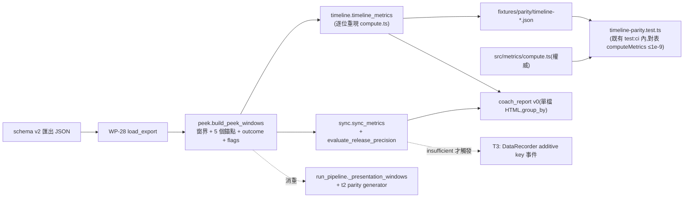

# WP-29 — coach-timeline:逐 peek 時間軸 + Release-to-Click Sync 族(教練第一層)

> stage4 執行計畫的 WP 子資料夾。上層 spec:[../README.md](../README.md) · 決議依據:**GD-19**(stage4 採納/編號/research 邊界/parity 雙向)· **GD-20**(教練報告 reliability gate 紅線)· GD-8(t_detect / 偵測操作化)· GD-11(FPSci 紅線)。
> Companion:[task-checklist.md](task-checklist.md) · [progress.md](progress.md)

| | |
|---|---|
| **目標** | 教練第一線可用的**個案回放層**:逐 peek 事件時間軸(`t_visible → t_counter → t_release → t_fire → t_hit/timeout`)+ **與 [compute.ts](../../../../../src/metrics/compute.ts) 逐量交叉驗證**;Release-to-Click Sync 指標族 + **量化精度 pre-registered 判定**;教練報告 v0(靜態 HTML,條件可分層) |
| **里程碑** | 無獨立里程碑(WP-32 → M15 的必要輸入;為 [§5 最短價值路徑](../README.md) 的第二段) |
| **相依** | **WP-28 T1 ✅**(ingest 綠即可;**不需 M14**)。M14 ① ③④⑤⑥ 可引用(分段 / ω(t) / 一鍵 pipeline);**② ε parity 已於 2026-08-05 撤回**([KI-004](../../../../known_issue/KI-004-sim-world-unit-domain-mismatch.md) / K-2)→ **ε(t) 相關產物一律不得引用**,但本 WP 本就不消費 ε,故**不受阻塞** |
| **對應 FR** | FR-D7 / FR-D8 / FR-D9 / FR-D10(gated)+ FR-D16 首版(報告 v0) |
| **估時** | 1.5–2.5 dev-days(T3 若觸發 +0.5–1) |
| **狀態** | ✅ **完成(2026-08-05)** —— T0–T2 ✅；09:39 precision sufficient；T3 原判 skipped，**使用者 override 實作 T3 ✅**（commit `dcdafbd`）為 additive observability，T2 verdict 未改；**T-exit ✅** 教練報告 v0(單檔靜態 HTML,條件分層)+ `analysis-peek-timeline.md` 定稿 + OQ-S4-6 關閉 |

---

## 0. 進場現況(2026-08-05 讀資料 + 補錄,影響 scope 與 DoD)

`research/fixtures/exports/` 現有**兩份**真實匯出,構成一組天然對照。第二份(09:39)是為排查第一份「零位移」而補錄的,詳見 [KI-004](../../../../known_issue/KI-004-sim-world-unit-domain-mismatch.md)。

| | [08:03](../../../../../research/fixtures/exports/counterstrafe_ad_v1-2026-08-05T08_03_45.617Z.json) | [**09:39**](../../../../../research/fixtures/exports/counterstrafe_ad_v1-2026-08-05T09_39_06.031Z.json) |
|---|---|---|
| 時長 / ticks | 27.39s / 3,507 | 21.27s / 2,723 |
| `ticks[].keys` | **全為 `[]`**,零鍵狀態轉換 | `A` 617 / `D` 587 / `A+D` 33 / 空 1,486 |
| `counter` 事件 | **0** | **24**(`A` 12 / `D` 12) |
| `vx` / `max\|px\|` | 恆 0 / 0 | ±250(612 個相異值)/ 169.25 |
| `visible` / `fire` | 20 / 22 | 20 / 22 |
| `counterReactionMs` | **n = 0** | **n = 20**,中位數 427.2 ms |
| `fireTimingAlignmentMs` | **n = 0** | **n = 20**,中位數 126.5 ms |
| `firstShotHitRate` | **90** | 90 |
| `meta.suspect` | false | **true**(KI-004;非效能/溢位問題) |
| 彈道 / ADS | hitscan、`ads` 事件 0 | hitscan、`ads` 事件 0 |

**08:03 那份的成因已結案**:不是引擎缺陷,是該次 run 確實沒有鍵盤輸入 —— 同 build、同機器、同流程重錄後鍵盤資料完整落盤(`keydown → onKeyDown → pushKey → ring → consume → applyInput → held → movement.step → ticks[].keys` 全鏈驗證通過)。

**四個直接後果(已寫入下方契約與 DoD,不是備註)**:

1. **真實資料現在可承擔交叉驗證**:09:39 三個量都有 n=20,FR-D8 的 ≤1e-9 對表在真實 fixture 上是實質的。
2. **反 vacuous 條款仍然保留**,但改變理由:不再是「真實資料沒樣本」的權宜,而是**紀律** —— 對表閘必須斷言參與比對的樣本數非零,否則未來換 fixture 時可能無聲退化成 `n=0 vs n=0` 假綠(T1 DoD ②)。08:03 的首發率經 `compute-v1` 稽核更正為 90(20 個相容首發中 2 miss;補槍使逐 peek outcome 仍全為 hit),見 D-29.3。
3. **T2 精度評估不再預期落 `blocked-by-data`**:09:39 提供 20 個 `release_to_fire_ms` 樣本,`sync-v1` 判準可以真的跑出 `sufficient` / `insufficient`。三分支仍保留(未來 fixture 未必有樣本),但 T3 是否觸發從此是**有證據的決定**。
4. **兩份 fixture 分工明確**:08:03 = 「零輸入」邊界案例(所有錨點缺席時報告不得 crash);09:39 = 主要真實效度樣本。兩者都要進 T1/T2 的測試矩陣。

> ⚠️ **09:39 帶 `suspect: true`,但這不代表資料不可用。** 成因是 [KI-004](../../../../known_issue/KI-004-sim-world-unit-domain-mismatch.md) 的 corridor gate 單位域錯誤(source unit 比 world unit,門檻緊 100×),**任何**有做急停的 run 都會被標記。WP-29 的指標只吃 `events` 與 `ticks[].keys`,不碰 `px/pz`,故**不受 KI-004 影響**;使用理由與界線須記 progress(見 [T0](T0-entry-gate.md))。ε(t) 系列(WP-30/31)則受影響 —— 修法已於 2026-08-05 拍板(K-1/K-2/K-3),**M14 ② 撤回**,須待 KI-004 S1 落地後才解除 WP-30/31 的 entry blocker。

---

## 1. 範圍

**In scope**:

```
research/src/modules/metrics/algorithms/peek.py          ← ADD build_peek_windows / PeekWindow      [T1]
research/src/modules/metrics/algorithms/timeline.py      ← ADD timeline_metrics(對表 compute.ts)   [T1]
research/src/modules/metrics/algorithms/sync.py          ← ADD sync_metrics + 量化精度評估          [T2]
research/src/modules/metrics/algorithms/tests/           ← ADD 單元測試(窗界/outcome/缺事件/亂序)  [T1/T2]
research/src/modules/metrics/notebooks/t1/outputs/       ← ADD 逐 peek 時間軸圖 + drill 摘要表      [T1]
research/src/modules/metrics/notebooks/t2/outputs/       ← ADD 精度評估報告                          [T2]
research/fixtures/parity/timeline-*.json                 ← ADD 時間軸交叉驗證 parity JSON            [T1]
tests/golden/research/timeline-parity.test.ts            ← ADD vitest 對表閘(既有 test:ci 內)      [T1]
research/src/report/coach_report.py                      ← ADD 教練報告 v0(靜態 HTML,條件分層)     [T-exit]
research/src/report/tests/test_coach_report*.py          ← ADD 報告契約 + 層級純度測試              [T-exit]
research/src/modules/metrics/notebooks/t-exit/outputs/   ← ADD 四份 committed 範例報告(deterministic) [T-exit]
research/src/report/run_pipeline.py                      ← MODIFY 改用共享 peek 模組(消重)          [T1]
research/src/modules/kinematics/notebooks/t2/generate_epsilon_parity.py ← MODIFY 同上(只驗窗界 index;ε 非證據) [T1]
research/src/modules/segments/notebooks/t3-sweep/run_sweep.py ← MODIFY 同上 + leading-ω 切尾 [T1]
docs/operational/analysis-peek-timeline.md               ← ADD 新構念 registry(t_release/outcome/flags) [T1/T-exit]
src/data/DataRecorder.ts + docs/operational/schema.md    ← MODIFY **僅 T2 判定不足時**(additive `key` 事件) [T3]
```

**Out of scope**:REC/MR/V phase 與 L/R 101 點曲線(WP-30)、SPARC/xcorr/Fitts(WP-31)、TS 晉升實作與結果頁(WP-32)、分段參數調整(`seg-v1` 依 D-28.7 凍結)、互動式報告(OQ-S4-6 觸發條件未達)、跨 session 聚合(stage4 §2.1)。

### 1.1 資料流(本 WP 新增部分;全域圖見 [../README.md §2.2](../README.md))



## 2. 關鍵契約

- **既有構念零重定義(C-D4)**:peek 窗 = `[t_visible, nextVisible.t)`(末筆 +∞);`counterReactionMs` / `fireTimingAlignmentMs` / `firstShotHitRate` 的**唯一權威是 [compute.ts](../../../../../src/metrics/compute.ts)**,Python 側逐位重現,含三個易漏語意:
  - `firstShotHitRate` 分母 = **全部 `visible` 事件數**(不是首發數),值域 0–100(已乘 100);
  - 窗內 `firstFire` 需同時滿足 `firstShot === true` **且**(`targetId` 缺席 **或** 等於 `visible.targetId`);
  - `stat()` 的 `p50` 為**線性插值**分位數、`sd` 為**母體**標準差(除以 n)——聚合層對表必須用同一定義。
- **新構念 Python 為權威,但必須有文件**(C-D4 的另一半):`t_release`、`outcome`、`counter_hold_ms`、flags 詞彙表落 `docs/operational/analysis-peek-timeline.md`,帶 `version` 字串;定案後比照 `seg-v1` 只能升版重跑,不得原地改語意。
- **缺事件是常態語意,不是缺失值**:[SimLoop.ts](../../../../../src/loop/SimLoop.ts) 只在 `ev.down && !held(反向) && vx 反號` 時寫 `counter` 事件 → **已停住才開槍的 peek 天生沒有 counter 事件**。缺錨點一律標 `flag` 並排除該指標的聚合,**不得吞成 NaN、不得補 0**(沿用 D-28.9 的 flag 詞彙表封閉紀律)。
- **單一窗界實作**:`build_peek_windows` 是全 research 層唯一的 peek 窗來源。T1 必須把 [run_pipeline.py `_presentation_windows`](../../../../../research/src/report/run_pipeline.py)、t2 parity generator 與 t3-sweep runner 三份切片**收斂到此模組**,並證明消重前後窗內 tick index 集合逐位相同。M14 ② 已撤回,ε 數值與 `epsilon-*.json` 不作本 task 證據。
- **parity 閘落點不變**(GD-19 / OQ-S4-7):Python 產 committed JSON → vitest 在**既有 `npm run test:ci`** 內對表;engine CI 不引入 Python 相依。**不得為對表新增任何 TS API**(比照 [epsilon-parity.test.ts](../../../../../tests/golden/research/epsilon-parity.test.ts):測試內就地組 `DataRecorderSnapshot` 後呼叫既有 `computeMetrics`)。
- **教練報告紅線(C-D3 / GD-20)**:報告 v0 只放通過交叉驗證的時間軸量與明確標示精度限制的 Sync 族;任何未過構念驗證的量一律標「研究向」或不進報告。
- **引擎零侵入**:T1/T2/T-exit 不動 `src/`;T3 若觸發僅動 data 層 additive 欄,**不 bump `schemaVersion`、不重錄任何 golden**(stage3 §2.5 additive 政策)。

## 3. Failure modes

| 觸發 | 影響 | 處理 |
|---|---|---|
| **交叉驗證假綠**(零輸入 fixture 上 counter/alignment 樣本數為 0) | FR-D8 綠燈不代表 Python 實作正確,WP-30/32 建在未驗證的窗界上 | T1 DoD ② 的反 vacuous 斷言:合成與 09:39 兩量各 `n ≥ 2` 且首發同時涵蓋命中/未命中;08:03 專責 `n=0` 邊界不得 crash/補 0 |
| Python 與 `compute.ts` 對不上(分母、`p50` 插值、`sd` 母體/樣本、targetId 過濾) | 教練看到的數字 ≠ 結果頁數字 | 對表容差 ≤1e-9 為 T1 DoD 首項;不一致**先修 Python**;若判定 TS 側 bug 或 spec 分歧 → 入 [DECISIONS.md](../../../DECISIONS.md) / [known_issue](../../../../known_issue/) 後才可 PASS |
| `t_release` 定義在無 counter 事件時退化(不知道哪一鍵是「原方向」) | Sync 族語意漂移,跨 peek 不可比 | 定義寫死於 `analysis-peek-timeline.md`:原方向鍵 = counter 鍵的反向鍵;無 counter 事件時以「窗內最後一次 A/D 由 held → released 的 tick」為 fallback 並標 `release_inferred_no_counter`;兩條路徑各有單元測試 |
| projectile `hit` 事件落在 `nextVisible` 之後 | 命中被誤判為 timeout,`outcome` 分布失真 | `hit` 以 `shotSeq` 關聯**不受窗界限制**;跨窗命中標 `hit_outside_window` 並仍計為 `hit`(與 `compute.ts` 的 `fireHitOutcome` 同語意);合成 fixture 釘死 |
| 消重時改動了 parity 產生器的窗界 | tracking presentation 可能對到不同 tick 集合,讓後續 KI-004 S1 重產失去可比基線 | T1 DoD ⑤:逐窗比較消重前後 tick index 集合；不得引用或要求 ε 數值不變(M14 ② 已撤回) |
| 精度判準在 n 過小時被硬套 | 以噪音決定是否動引擎(T3) | T0 凍結最小樣本數與 `blocked-by-data` 分支;n 不足一律輸出 `blocked-by-data`,**不得**因此觸發 T3 |
| 報告把 flag 過的 peek 併入聚合 | 教練用被污染的統計下處方 | 每個聚合欄位輸出 `n` + `flags` 計數;單元測試斷言帶 flag 的 peek 不進聚合分母 |
| 時間軸圖依賴 matplotlib 進 `algorithms/` | C-D2 純度紀律腐化 | 繪圖只在 `notebooks/` 與 `src/report/`;`algorithms/` 純度測試沿用 WP-28 T1 模式 |

## 4. Task 索引

| Task | 檔案 | Objective | 相依 | Risk | 估時 |
|---|---|---|---|---|---|
| **T0** | [T0-entry-gate.md](T0-entry-gate.md) | 驗 WP-28 T1 exit;凍結 `compute.ts` 對表基準清單 + 缺事件語意 + **精度判準三分支與最小 n** | — | Low | 0.25d |
| **T1** | [T1-peek-timeline.md](T1-peek-timeline.md) | `build_peek_windows` + `timeline_metrics` + **交叉驗證閘**(含反 vacuous)+ 三份窗界實作消重 | T0 | **Med** | 0.75–1d |
| **T2** | [T2-sync-precision.md](T2-sync-precision.md) | Sync 族三指標 + flags + **量化精度評估與明確判定** | T1 | Med | 0.5–0.75d |
| **T3(選配,gated)** ✅ | [T3-key-events.md](T3-key-events.md) | 原 gate = **僅當 T2 判定 `insufficient`**;09:39 兩量皆 `sufficient` → 原判 skipped。**使用者 override 後仍實作**(commit `dcdafbd`),定位為 additive observability 而非精度修復:`DataRecorder.recordKeyEvents`(opt-in,預設 OFF)+ `key` 事件 + peek `t_release_event`/`release_source`。T2 verdict 與 `sync-v1` 逐位未改。見 D-29.8~D-29.11 | T2 判定 + 使用者 override | Med | 0.5–1d |
| **T-exit** ✅ | [T-exit-gate.md](T-exit-gate.md) | 教練報告 v0(一鍵、條件分層)+ `analysis-peek-timeline.md` 定稿 + OQ-S4-6 關閉 | T1–T2(T3 依判定) | — | 0.25–0.5d |

## 5. Interface contracts

```python
# research/src/modules/metrics/algorithms/peek.py                                    [T1]
@dataclass(frozen=True)
class PeekWindow:
    index: int                                   # visible 事件序(0-based),與 Segment.peek_index 同義(D-28.10)
    target_id: str
    side: Literal['L', 'R']
    t_visible: float                             # ms,量測時鐘域
    t_end: float                                 # nextVisible.t 或 +inf(與 compute.ts / trackingDerivation 同義)
    t_counter: float | None                      # 窗內第一個 counter 事件(input timeStamp,sub-tick)
    counter_key: str | None                      # 'A' | 'D'
    t_release: float | None                      # 自 ticks.keys 推導,±1 tick;定義見 analysis-peek-timeline.md
    release_key: str | None
    t_first_shot: float | None                   # 窗內第一個 firstShot fire 且 targetId 相容
    fires: tuple[float, ...]                     # 窗內全部 fire.t(含補槍),升序
    t_hit: float | None                          # hitscan: fire.hit → fire.t;projectile: shotSeq 關聯的 hit.t
    outcome: Literal['hit', 'timeout', 'no_shot']
    ads: bool | None                             # 窗內 ticks.ads 是否曾為 True(條件分層鍵;無 tick → None)
    flags: tuple[str, ...]                       # 封閉詞彙表,見 analysis-peek-timeline.md
    tick_slice: slice                            # 對 export.ticks(依 t 排序後)的索引區間

def build_peek_windows(export: Export) -> list[PeekWindow]: ...
    # 長度恆等於 visible 事件數;不丟窗、不合併窗

# research/src/modules/metrics/algorithms/timeline.py                                [T1]
@dataclass(frozen=True)
class Stat:                                      # 逐位對齊 compute.ts stat():p50 線性插值、sd 母體
    mean: float; p50: float; sd: float; n: int

@dataclass(frozen=True)
class TimelineMetrics:
    counter_reaction_ms: Stat
    fire_timing_alignment_ms: Stat
    first_shot_hit_rate: float                   # 0–100,分母 = visible 事件數
    peeks: tuple[PeekWindow, ...]

def timeline_metrics(export: Export) -> TimelineMetrics: ...
def timeline_parity_payload(export: Export) -> dict: ...   # notebooks 端寫檔;algorithms 只回 dict

# research/src/modules/metrics/algorithms/sync.py                                    [T2]
@dataclass(frozen=True)
class SyncParams:                                # pre-registered;凍結後只能改 version
    min_samples: int                             # 低於此數 → blocked-by-data
    sd_ratio_threshold: float                    # 量化 SD ≥ 樣本 SD × 此值 → insufficient(§2.4d = 1/3)
    version: str

def sync_metrics(peeks: Sequence[PeekWindow], ticks: pd.DataFrame) -> pd.DataFrame: ...
    # 欄:peek_index, release_to_fire_ms, counter_hold_ms, counter_to_fire_ms, side, ads, flags

@dataclass(frozen=True)
class PrecisionVerdict:
    metric: str; n: int; sample_sd_ms: float | None
    quantization_sd_ms: float                    # 均勻量化 = dt/√12 = 7.8125/√12 ≈ 2.2551 ms
    verdict: Literal['sufficient', 'insufficient', 'blocked-by-data']
    reason: str

def evaluate_release_precision(sync: pd.DataFrame, params: SyncParams,
                               sim_hz: int = 128) -> tuple[PrecisionVerdict, ...]: ...
```

```ts
// tests/golden/research/timeline-parity.test.ts(T1;新測試檔,零新 TS API)
// 讀 research/fixtures/exports/*.json + research/fixtures/parity/timeline-*.json,
// 就地組 DataRecorderSnapshot({ ticks, events, recorderOverflow }) → 既有 computeMetrics(),
// 逐量對表 mean/p50/sd/n + firstShotHitRate,相對誤差 ≤ 1e-9。
```

## 6. 執行規則

沿用 [exec-plan/README.md §5](../../../README.md):一 task = 一垂直切片 = 一原子 commit;完成即更新 [progress.md](progress.md) 與 [task-checklist.md](task-checklist.md);**兩個閘都要貼證據**(`uv run pytest` + `npm run test:ci`)。跨 WP 決策入 [DECISIONS.md](../../../DECISIONS.md),per-WP 決策入本資料夾 `progress.md`(編號 `D-29.n`)。

## 7. Open Questions(本 WP 新增;既有 OQ-S4-* 見 [../README.md §8](../README.md))

| # | 問題 | 建議 / 待決 | Owner | Deadline | 未決影響 |
|---|---|---|---|---|---|
| ~~**OQ-S4-12**~~ | ~~真實 counter-strafe 樣本缺席~~ | ✅ **關閉(2026-08-05)**:09:39 匯出已補錄並進 `research/fixtures/exports/`(21.27s ≤30s、`participantId=P001`、PII-like 掃描無命中、counter 24、三個對表量各 n=20) | 使用者 | 2026-08-05 | unblocked |
| **OQ-S4-11**(新) | 兩份真實 fixture 皆無 `ads` 事件、皆為 hitscan | 🟡 **維持 open(T-exit 已複核)**:`--group-by` 三種分層皆已實作並由測試釘死,但真實資料實測 `--group-by ads` → 只有 `off` 一組、`--group-by weapon_mode` → 只有 `hitscan` 一組;projectile cell 只有合成 fixture 有樣本。需一次 ADS-on / projectile 真實錄製才能關閉 | 研究者 | WP-30 或補錄後 | 條件分層無真實對照;不阻塞實作 |
| **OQ-S4-10** | `t_release` 在無 counter 事件時的 fallback 定義是否足以支撐跨 peek 比較 | 🟡 **維持 open(T-exit 已依證據更新)**:兩份真實 fixture 提供的 `release_inferred_no_counter` 樣本數為 **0**(09:39 有 release 的 peek 都有 counter;08:03 兩者皆無),故仍無證據支持納入聚合。fallback + flag 保留,**預設排除不變** | 研究者 | 有 inferred 樣本的真實錄製後 | Sync 族的 n 與可比性;報告 v0 的分母定義 |
| ~~**OQ-S4-6**~~(既有) | ~~教練報告載體~~ | ✅ **關閉(2026-08-05,T-exit)**:`coach_report.py` 一鍵產出單檔自足靜態 HTML(inline CSS + inline SVG,零外部資源),四份 committed 範例報告 deterministic。升級為互動式報告的觸發條件(教練需互動篩選)未達 | 使用者 | 2026-08-05 | 已解 |
