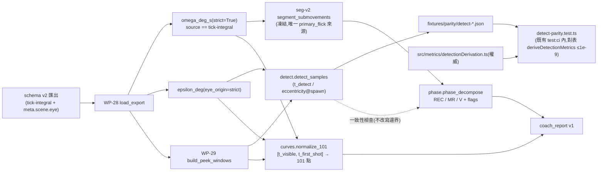

# WP-30 — trajectory-metrics:REC/MR/V phase 分解 + L/R 101 點正規化曲線(軌跡診斷層)

> stage4 執行計畫的 WP 子資料夾。上層 spec:[../README.md](../README.md) · 決議依據:**GD-19**(stage4 採納/research 邊界/parity 雙向)· **GD-20**(教練報告 reliability gate 紅線)· GD-8(t_detect / 偵測操作化)· GD-7(hitbox 單一來源)· GD-11(FPSci 紅線)。
> Companion:[task-checklist.md](task-checklist.md) · [progress.md](progress.md)

| | |
|---|---|
| **目標** | 回答教練「**慢在哪一段**」與「**L/R 動作簽名差在哪**」:每 peek 的 REC/MR/V 三段分解(含與 `t_detect` 推導的一致性檢查)+ 逐 side 的 101 點正規化 ω(t)/ε(t) 曲線;兩者收斂進教練報告 v1 |
| **里程碑** | 無獨立里程碑(WP-32 → M15 的必要輸入) |
| **相依** | **M14 全六項**(含 ③④⑤ 重新宣告)。M14 ③④⑤ 的解除已由 [KI-005-A / A2-T4](../../../../known_issue/KI-005-A/A2-blocked-plan.md#a2-t4--m14-③④⑤-重新宣告-✅-已完成2026-08-07) 交付(2026-08-07),**本 WP 只驗證、不代辦**(協議 §6) |
| **對應 FR** | FR-D11 / FR-D12 + FR-D16 第二版(報告 v1) |
| **估時** | 2.5–3.25 dev-days(**高於 [../README.md §3](../README.md) 編列的 2–3d**,超出部分全在 T1;理由見 §4 與 [progress.md](progress.md) D-30.0) |
| **狀態** | ⬜ **未開始;entry blocker 已解除(2026-08-07)** —— [KI-005-A / A2-T4](../../../../known_issue/KI-005-A/A2-blocked-plan.md#a2-t4--m14-③④⑤-重新宣告-✅-已完成2026-08-07) 已落地,M14 ③④⑤ 已重新宣告,KI-006 CLOSED;**T0 待執行以正式驗證並開工**(協議 §6:entry-gate 仍須自行覆核上游 exit-gate,不因帳本已更新而略過) |

---

## 0. 進場現況(2026-08-07 規劃期讀碼 + 讀資料;三項皆改變 scope 與 DoD)

### 0.1 entry blocker:已於 A2-T4 解除(2026-08-07)

| 理由 | 出處 | 現況 |
|---|---|---|
| ε(t) 量測原點錯誤 | [KI-004](../../../../known_issue/KI-004-sim-world-unit-domain-mismatch.md) / S1 | ✅ 已解除(M14 ② 於 2026-08-06 重新宣告) |
| ω(t) render/sim aliasing | [KI-005](../../../../known_issue/KI-005-omega-render-sim-aliasing.md) | ✅ A1 修法落地、A2-T2 四項複驗通過(FM-1 以機器精度關閉)、A2-T3 `seg-v2` 凍結 |
| 樣本無 counter-strafe 構念 | [KI-006](../../../../known_issue/KI-006-m14-sample-no-counterstrafe.md) | ✅ C(construct presence gate)落地;B(重新採樣)由 A2-T1 三份新匯出滿足(n > 2),§6 B-1~B-5 全數滿足,**KI-006 CLOSED** |
| **M14 ③④⑤ 重新宣告** | [A2-T4](../../../../known_issue/KI-005-A/A2-blocked-plan.md#a2-t4--m14-③④⑤-重新宣告-✅-已完成2026-08-07) | ✅ **已落地(2026-08-07)= 本 WP 唯一 entry blocker 已解除** |

三條原始理由**皆已解除**,M14 帳本已於 A2-T4 落地時同步更新逐項判定。**T0 仍須自行覆核上游 exit-gate 的實際證據(不得只信任帳本文字)後才可開 T1。**

### 0.2 真實證據 fixture 整組更換(不是偏好,是硬約束)

WP-30 兩個指標都消費 **ω(t)**,101 點曲線另消費 **ε(t)**。兩者對匯出的要求都比 WP-29 嚴:

| fixture | ticks | ω source | `meta.scene.eye`/`simToWorld` | `key` 事件 | WP-30 用途 |
|---|---:|---|---|---:|---|
| [08:03](../../../../../research/fixtures/exports/counterstrafe_ad_v1-2026-08-05T08_03_45.617Z.json) | 3,507 | `aim-diff-legacy` | ❌ 無 | 0 | **禁用**(beat aliasing + 無 eye origin) |
| [09:39](../../../../../research/fixtures/exports/counterstrafe_ad_v1-2026-08-05T09_39_06.031Z.json) | 2,723 | `aim-diff-legacy` | ❌ 無 | 0 | **禁用**(同上) |
| [09:18](../../../../../research/fixtures/exports/counterstrafe_ad_v1-2026-08-07T09_18_05.631Z.json) | 2,038 | `tick-integral` | ✅ | 86 | ✅ 真實效度樣本 |
| [09:24](../../../../../research/fixtures/exports/counterstrafe_ad_v1-2026-08-07T09_24_18.148Z.json) | — | `tick-integral` | ✅ | 84 | ✅ 真實效度樣本 |
| [09:37](../../../../../research/fixtures/exports/counterstrafe_ad_v1-2026-08-07T09_37_24.351Z.json) | 1,904 | `tick-integral` | ✅ | 78 | ✅ 真實效度樣本 |
| [`synthetic_counterstrafe.json`](../../../../../research/fixtures/exports/synthetic_counterstrafe.json) | 48 | `tick-integral` | ✅ | 0 | 演算法邊界(**僅 2 peeks / 48 ticks**,短窗退化案例的天然來源) |

**WP-29 的三份 fixture 分工(合成 / 08:03 零輸入 / 09:39 主要效度)在本 WP 完全不適用。** 真實證據 = **3 sessions × 20 peeks = 60 peeks(L 30 / R 30)**,`counter` 事件 23/25/20、橫移 tick 佔比 0.656/0.654/0.644、皆通過 `construct-v1` presence gate。

> 這條界線**必須機械化**,不能靠文件自律:WP-30 的所有 notebook 入口一律以 `omega_deg_s(..., strict=True)` 解 ω,legacy 匯出當場拋錯而非靜默產出 aliased 曲線(T0 DoD)。同理 ε 一律 `resolve_eye_origin(meta, strict=True)`。

### 0.3 D-29.2 的 KI-004 使用界線在本 WP **自動失效**

[D-29.2](../wp-29-coach-timeline/progress.md) 成立的條件是明文的:「本 WP 只消費 `events` 與 `ticks[].keys`,**不得消費 `px/pz`**;一旦消費,本決議立即失效並須重新評估」。ε(t) 的射線原點正是 `eye_origin.base + (px, 0, pz) * simToWorld` → **WP-30 必然消費 `px/pz`,故必須重新拍一條使用界線決議**(T0)。

規劃期已查清三份新 fixture 的 `suspect` 來源,與 09:39 **不是同一件事**:

| fixture | `meta.suspect` | `meta.validity` | 判讀 |
|---|---|---|---|
| 09:18 | **true** | `corridorExceeded: true`,其餘全 false | corridor 於 KI-004/S1 後已與 suspect **解耦**(NFR-S1-2b:corridorExceeded 不得單獨拉 suspect)→ suspect 另有來源 |
| 09:24 | **true** | 同上 | 同上 |
| 09:37 | **false** | `corridorExceeded: true`,其餘全 false | **反證**:corridor 為真但 suspect 為假 ⇒ 解耦確實生效 |

A2-T1 記錄的觸發源是 `experimentSession.suspect`(session 中途退出 fullscreen)。該判定的 false positive 已由 [KI-007](../../../../known_issue/KI-007-suspect-flag-false-positive-post-drill-fullscreen-exit.md) 於 commit `1d6e874` 修正,但**這三份是修法前錄的**。T0 必須:① 逐份確認 suspect 觸發源;② 拍板使用界線(含失效條件);③ A2-T1 遺留的「待研究者確認是否確有中途退出」若仍未回,以 OQ 帶著走,不得靜默當作乾淨。

---

## 1. 範圍

**In scope**:

```
research/src/modules/metrics/algorithms/detect.py     ← ADD t_detect 推導(對表 TS)              [T1]
research/src/modules/metrics/algorithms/phase.py      ← ADD REC/MR/V 分解 + PhaseParams          [T2]
research/src/modules/metrics/algorithms/curves.py     ← ADD normalize_101 + 逐 side 聚合          [T3]
research/src/modules/metrics/algorithms/tests/        ← ADD 單元測試(邊界/退化/封閉 flags)      [T1-T3]
research/src/modules/metrics/notebooks/t1..t3/outputs/← ADD parity 產生器 + phase 分佈 + L/R 疊圖 [T1-T3]
research/fixtures/parity/detect-*.json                ← ADD t_detect parity JSON                  [T1]
tests/golden/research/detect-parity.test.ts           ← ADD vitest 對表閘(既有 test:ci 內)      [T1]
research/src/report/coach_report.py                   ← MODIFY 報告 v1(phase + 曲線區塊)        [T-exit]
research/src/report/tests/test_coach_report*.py       ← MODIFY 報告契約測試                       [T-exit]
docs/operational/analysis-phase-curves.md             ← ADD 新構念 registry(phase-v1 / curve-v1) [T2/T3/T-exit]
```

**Out of scope**:

- SPARC / Key-Velocity xcorr / Fitts(WP-31)、TS 晉升實作與結果頁(WP-32)。
- **動任何已凍結參數**:`seg-v2`、`seg-v1`、`sync-v1`、`timeline-v1`、`compute-v1`、`construct-v1`。要改一律升版 + 全鏈重跑(D-28.7 先例)。
- **動 `src/` 任何生產碼**。T1 只新增 `tests/golden/research/` 下的測試檔,零新 TS API(比照 [epsilon-parity.test.ts](../../../../../tests/golden/research/epsilon-parity.test.ts) / [timeline-parity.test.ts](../../../../../tests/golden/research/timeline-parity.test.ts))。
- 以 08:03 / 09:39 產生任何 ω/ε 效度主張(§0.2)。
- 互動式報告(OQ-S4-6 的升級觸發條件仍未達)、跨 session 縱貫資料庫(stage4 §2.1;本 WP 的三 session 以並列呈現,不建立縱貫模型)。
- 重新採樣(採樣已由 A2-T1 完成;本 WP 不觸發新錄製)。

### 1.1 資料流(本 WP 新增部分;全域圖見 [../README.md §2.2](../README.md))



## 2. 關鍵契約

- **既有構念零重定義(C-D4)**:`t_detect` / `eccentricity_at_spawn` 的權威是 [detectionDerivation.ts](../../../../../src/metrics/detectionDerivation.ts) + [analysis-t-detect.md](../../../operational/analysis-t-detect.md);Python 側逐位重現並以 parity 閘釘死,**不得**因為「counter-strafe drill 與 detection drill 不同」而在本 WP 另立一套偵測起點。peek 窗界一律取自 `build_peek_windows`(`timeline-v1`),不重算。
- **新構念 Python 為權威,但必須有文件**:`phase-v1`(REC/MR/V 邊界規則、參數、封閉 flags)與 `curve-v1`(重採樣窗、插值、聚合與納入規則)落 `docs/operational/analysis-phase-curves.md`,帶 `version`;定稿後只能升版重跑,不得原地改語意。
- **MR 邊界複用 `seg-v2`,不得產生 primary_flick 的第二定義(✅ 已拍板 2026-08-07,D-30.1)**:`MR = primary_flick` 區間、`REC = [t_visible, primary_flick.start)`、`V = [primary_flick.end, t_first_shot]`;**Butterworth 只作報告用平滑,不產生第二套運動起點**。此結構為定案,T2 不得改動。
  - **唯一留給真實資料的子問題(D-30.1b,T0 拍板)**:一個 peek 切出**多個 segment** 時,MR 取哪一段。三個候選 —— ① 第一個 `primary_flick`(現行 `seg-v2` 語意) ② 峰值 ω 最大的 segment ③ 首個 `primary_flick` 起點到最後一個 `micro_adjustment` 終點的合併區間。判準以三份真實匯出的**逐 peek segment 數分佈**與疊圖決定,pre-register 後凍結。
  - 若真實資料顯示**沒有任何候選能一致地對應「主運動期」**(例如多數 peek 呈現甩過頭再修回的雙峰,三個候選各切各的),才回頭重開「是否需要獨立偵測器」——此時屬**新決策**,須入 [DECISIONS.md](../../../DECISIONS.md),不得由 T2 自行裁量。
- **ω/ε 來源機械閘(§0.2)**:所有 WP-30 入口以 `strict=True` 解 ω 與 eye origin;legacy 匯出拋錯而非降級。`omega[0] = nan` 契約不變(TD-3 已於 A2-T3 拍板不改),消費端沿用 `_OMEGA_INDEX_OFFSET` 的「切尾 + index 映回」模式(D-29.4)。
- **缺錨點是常態語意,不是缺失值**:沿用 `timeline-v1` / `sync-v1` 紀律 —— 缺 `t_first_shot`、窗太短、濾波退化一律標 flag 並排除該指標聚合,**不得吞成 NaN、不得補 0**;flags 封閉詞彙表由演算法自我斷言(比照 [peek.py](../../../../../research/src/modules/metrics/algorithms/peek.py) 的 `KNOWN_PEEK_FLAGS`)。
- **聚合納入規則沿用 D-29.5**:一列的值只有在「數值有限**且**整列 flags 為空」時才進 `n` 與分佈;被排除的列仍完整輸出供檢視。
- **退化不得 crash**:[`butter_filter`](../../../../../research/src/shared/filters/butter.py) 對 `cutoff ≥ Nyquist` 與 `样本數 ≤ padlen` 一律拋 `ValueError` —— 這是正確行為,消費端必須接住並轉成 flag + fallback(未濾波或不分段),**不得**讓一個短窗炸掉整份報告。合成 fixture 只有 48 ticks / 2 peeks,是天然的短窗案例。
- **parity 閘落點不變**(GD-19 / OQ-S4-7):Python 產 committed JSON → vitest 在既有 `npm run test:ci` 內對表;engine CI 不引入 Python 相依;**不得為對表新增任何 TS API**。
- **教練報告紅線(C-D3 / GD-20)**:報告 v1 內每個量標效度層級 ——「與既有 TS 推導對表通過」(t_detect)/「新構念 + 明示限制」(phase、101 點曲線);未過驗證者不進主表。
- **效度聲稱不得擴大**:三份真實 fixture 為**同一受試者 P001、同一台 240 Hz 機器、同一 drill config**。沿用 [KI-004 R-7](../../../../known_issue/KI-004-S1/README.md) 紀律 —— 儀器修好不等於樣本代表性提升,任何 phase/曲線結論一律附此限制。

## 3. Failure modes

| 觸發 | 影響 | 處理 |
|---|---|---|
| 誤用 08:03 / 09:39 產 ω 曲線 | 整個 WP 的軌跡指標建在 beat aliasing 上,重演 KI-005 | T0 的 `strict=True` 機械閘 + fixture roster 凍結;測試斷言 legacy 匯出**必定拋錯**(不是「應該不用」) |
| phase 邊界與 `seg-v2` primary_flick 分叉 | 同一件事兩個定義(C-D4),教練看到互相矛盾的「主運動期」 | 預設複用 seg-v2 邊界;若採獨立偵測器則一致率為 pre-registered 驗收條件,分歧入帳 |
| `phase-v1` 參數只在合成資料上掃參後凍結 | **重演 `seg-v1` 的錯誤**(合成訊號不含真實現象 → 凍結值在真實資料上不適用) | 沿用 `seg-v2` 的雙維度掃參模式:合成通過條件(邊界誤差 ≤ 2 tick)**+** 三份真實匯出的第二評分維度,兩者皆綠才凍結 |
| 短窗 / 濾波退化炸掉報告 | 一鍵報告不可用 | `butter_filter` 的 `ValueError` 一律接住 → `filter_degenerate` flag + fallback;合成 fixture(48 ticks)為必跑回歸案例 |
| `t_first_shot` 缺席的 peek 進了 101 點曲線 | 曲線窗界退化(t1 未定義),曲線被拉歪 | `no_first_shot` 的 peek 一律排除並計數;報告顯示排除數與原因 |
| t_detect 在 counter-strafe drill 上大量 `timeout` | REC 一致性檢查退化成空集合,FR-D11 的檢查形同虛設 | T1 DoD 含**反 vacuous 斷言**(比照 D-29.3 的教訓):`detected` 樣本數須 ≥ 門檻,否則明確輸出 `blocked-by-data` 並開 OQ,**不得**以空集合宣告一致 |
| Python 與 `deriveDetectionMetrics` 參數預設不同 | parity 假綠或假紅,且 `analysis-t-detect.md` 自稱 provisional | T1 第一步是**逐欄抄 TS 的已解析預設值**進 progress,再寫 Python;文件與程式碼不一致時以**程式碼**為權威並入帳 |
| 三 session 的 phase 分佈差異被當成訓練效果 | 對選手講錯故事 | 報告一律逐 session 呈現 n 與分佈,不跨 session 併池;跨 session 推論明文標為 out of scope |
| 報告 v1 破壞 v0 的 deterministic 契約 | committed 範例報告 diff 失去「資料或凍結契約改變」的訊號價值 | T-exit 沿用 v0 的無時鐘/無隨機/穩定排序紀律;既有四份範例報告的重跑差異須逐項解釋 |

## 4. Task 索引

| Task | 檔案 | Objective | 相依 | Risk | 估時 |
|---|---|---|---|---|---|
| **T0** | [T0-entry-gate.md](T0-entry-gate.md) | 驗 M14 六項(含 A2-T4)+ 凍結 fixture roster 與 strict 閘 + **新的 suspect 使用界線決議** + `phase-v1`/`curve-v1` pre-registration 骨架 | **A2-T4** | Low | 0.25d |
| **T1** | [T1-detect-parity.md](T1-detect-parity.md) | `t_detect` / `eccentricity_at_spawn` Python 推導 + **vitest 對表閘 ≤1e-9**(含反 vacuous) | T0 | Med | 0.5–0.75d |
| **T2** | [T2-phase-decompose.md](T2-phase-decompose.md) | REC/MR/V 三段分解 + `phase-v1` 掃參凍結 + REC-end vs `t_detect` 一致性檢查 | T1 | **Med** | 0.75–1d |
| **T3** | [T3-lr-curves.md](T3-lr-curves.md) | 101 點正規化 + 逐 side 平均曲線 + 分佈帶 + L/R 疊圖 | T0(不依賴 T1/T2) | Low | 0.5–0.75d |
| **T-exit** | [T-exit-gate.md](T-exit-gate.md) | 教練報告 v1 + `analysis-phase-curves.md` 定稿 + 文件對帳 | T2 + T3 | — | 0.5d |

> **與 [../README.md §6](../README.md) 的偏離**:上層 spec 編列 WP-30 為 T0/T1(phase)/T2(101pt)/T-exit 共 2–3d。本計畫**插入 T1 t_detect parity**,原 phase/101pt 順延為 T2/T3,估時上修至 2.5–3.25d。理由:FR-D11 的「REC 邊界與 t_detect 一致性檢查」需要 Python 側的 t_detect,而 t_detect 是**既有構念**(TS 權威),依 C-D4 必須有對表閘,不能順手寫一套。此偏離記 [progress.md](progress.md) D-30.0,T0 落地時同步回寫 [../README.md §6](../README.md)。
>
> **T3 可與 T1/T2 並行或提前**:101 點曲線只吃 `build_peek_windows` + ω/ε,不依賴 phase 或 t_detect。若 T2 的掃參卡住,先交付 T3 仍是教練可用的獨立價值。

## 5. Interface contracts

```python
# research/src/modules/metrics/algorithms/detect.py                                   [T1]
@dataclass(frozen=True)
class DetectParams:                              # 值逐欄取自 TS ResolvedDetectionDerivationOptions
    pre_stimulus_ms: float                       # analysis-t-detect.md 預設 500
    theta_sd_k: float                            # 預設 3(theta_v = k * SD(|dε/dt|))
    sustain_ticks: int                           # 預設 4
    anticipation_ms: float                       # 預設 100
    version: str                                 # "detect-v1"

@dataclass(frozen=True)
class DetectSample:
    peek_index: int
    t_detect: float | None                       # 持續下降段的第一個 tick(非第四個確認 tick)
    status: Literal['detected', 'timeout']       # timeout 是有效觀察結果,不是缺失值
    eccentricity_at_spawn_deg: float
    baseline_insufficient: bool                  # 前刺激窗 < pre_stimulus_ms
    anticipation: bool                           # t_detect - t_visible < anticipation_ms
    flags: tuple[str, ...]

def detect_samples(export: Export, peeks: Sequence[PeekWindow], *,
                   eye_origin: EyeOrigin,
                   params: DetectParams = DEFAULT_DETECT_PARAMS) -> tuple[DetectSample, ...]: ...
def detect_parity_payload(export: Export, samples: Sequence[DetectSample]) -> dict: ...

# research/src/modules/metrics/algorithms/phase.py                                    [T2]
@dataclass(frozen=True)
class PhaseParams:                               # pre-registered;凍結後只能改 version
    cutoff_hz: float                             # 零相位 Butterworth 低通(僅平滑/報告用,見 §2)
    butter_order: int
    min_window_ticks: int                        # 低於此數 → window_too_short,不分段
    version: str                                 # "phase-v1"

@dataclass(frozen=True)
class PhaseSample:
    peek_index: int; side: Literal['L', 'R']
    t_onset: float | None                        # = MR 起點(預設 = seg-v2 primary_flick.start)
    t_mr_end: float | None                       # = MR 終點(預設 = seg-v2 primary_flick.end)
    t_anchor: float | None                       # = t_first_shot(V 段終點,OQ-S4-5)
    rec_ms: float | None; mr_ms: float | None; v_ms: float | None
    peak_omega_deg_s: float | None
    t_detect: float | None                       # 一致性檢查用;不參與邊界決定
    rec_minus_detect_ms: float | None            # REC-end − t_detect;分佈入報告
    flags: tuple[str, ...]                       # 封閉詞彙表,見 analysis-phase-curves.md

def phase_decompose(peek: PeekWindow, omega: np.ndarray, ticks: pd.DataFrame,
                    segments: Sequence[Segment], params: PhaseParams,
                    detect: DetectSample | None = None) -> PhaseSample: ...
def phase_table(peeks, omega, ticks, segments, params, detects=None) -> pd.DataFrame: ...

# research/src/modules/metrics/algorithms/curves.py                                   [T3]
@dataclass(frozen=True)
class CurveParams:                               # pre-registered;凍結後只能改 version
    points: int                                  # 101
    min_ticks: int                               # 窗內最少 tick 數,低於此 → window_too_short
    band: Literal['iqr', 'sd']                   # 分佈帶定義(T0 拍板)
    version: str                                 # "curve-v1"

def normalize_101(values: np.ndarray, t: np.ndarray, t0: float, t1: float,
                  *, points: int = 101) -> np.ndarray: ...        # (points,);退化輸入拋 ValueError
def curve_table(peeks, omega, epsilon, ticks, params) -> pd.DataFrame: ...
    # 每 peek 一列:peek_index, side, ads, signal('omega'|'epsilon'), p000..p100, flags
def curve_summary(table: pd.DataFrame, params: CurveParams) -> dict: ...
    # 逐 side × signal:mean 曲線 + band 上下界 + n;n 恆與圖上標示同源
```

```ts
// tests/golden/research/detect-parity.test.ts(T1;新測試檔,零新 TS API)
// 讀 research/fixtures/exports/*.json + research/fixtures/parity/detect-*.json,
// 就地組 DataRecorderSnapshot → 既有 deriveDetectionMetrics(),
// 逐 presentation 對表 t_detect / status / eccentricityAtSpawn,相對誤差 ≤ 1e-9。
```

## 6. 執行規則

沿用 [exec-plan/README.md §5](../../../README.md):一 task = 一垂直切片 = 一原子 commit;完成即更新 [progress.md](progress.md) 與 [task-checklist.md](task-checklist.md);**兩個閘都要貼證據**(`uv run pytest` + `npm run test:ci`)。跨 WP 決策入 [DECISIONS.md](../../../DECISIONS.md),per-WP 決策入本資料夾 `progress.md`(編號 `D-30.n`)。

**四條不可事後改的凍結**:T0 的 fixture roster、T0 的 `phase-v1`/`curve-v1` pre-registration、上游 `seg-v2`、上游 `sync-v1`/`timeline-v1`/`compute-v1`。要改一律升 version + 全鏈重跑。

## 7. Open Questions(本 WP 新增;既有 OQ-S4-* 見 [../README.md §8](../README.md))

| # | 問題 | 建議 / 待決 | Owner | Deadline | 未決影響 |
|---|---|---|---|---|---|
| **OQ-S4-14**(新) | phase 邊界是複用 `seg-v2` primary_flick,還是獨立的 Butterworth 零相位偵測器(FR-D11 字面) | ✅ **主體已拍板(2026-08-07,使用者)**:**複用 `seg-v2`** —— `MR = primary_flick`、`REC = [t_visible, MR.start)`、`V = [MR.end, t_first_shot]`;Butterworth 降為報告用平滑。🟡 **剩 D-30.1b 待 T0 以真實資料拍板**:多 segment 的 peek 取哪一段為 MR(三候選見 §2) | 使用者 / 研究者 | WP-30 T0 | 主體已定,T2 可據以開工;子問題影響多段 peek 的 MR 取法 |
| **OQ-S4-15**(新) | `t_detect` 在 counter-strafe drill 上是否有足夠 `detected` 樣本支撐 REC 一致性檢查 | 🟡 **T1 以資料判定**。`analysis-t-detect.md` 的參數是為 detection pop-in drill 訂的;counter-strafe 的視角在 `t_visible` 前未必靜止,前刺激基線 SD 可能偏大 → `theta_v` 偏鬆。樣本不足一律輸出 `blocked-by-data` 並開後續 OQ,**不得**空集合宣告一致 | 研究者 | WP-30 T1 | FR-D11 的一致性檢查能否交付 |
| **OQ-S4-16**(新) | 09:18 / 09:24 的 `meta.suspect = true` 觸發源是否確為 [KI-007](../../../../known_issue/KI-007-suspect-flag-false-positive-post-drill-fullscreen-exit.md) 的 fullscreen false positive,抑或 session 中途真的退出過 fullscreen | 🟡 **T0 查清 + 拍板使用界線**。A2-T1 已記「待研究者確認」;`meta.validity` 顯示 corridor 與 suspect 已解耦(09:37 為反證)。若確有中途退出,須評估對 `display`/frame 面的影響是否觸及 ω/ε(預期不觸及,GD-10),並明文寫入界線與失效條件 | 使用者 / 研究者 | WP-30 T0 | 三份真實 fixture 的可用性與效度聲稱範圍 |
| **OQ-S4-11**(既有) | 兩份舊 fixture 皆無 `ads` 事件、皆為 hitscan | 🟡 **維持 open,且範圍擴大**:三份新 fixture 同樣是 hitscan、無 ADS-on peek → `--group-by ads` / `weapon_mode` 在真實資料上仍退化成單格 | 研究者 | ADS-on / projectile 真實錄製後 | 條件分層無真實對照;不阻塞實作 |
| **OQ-S4-10**(既有) | `t_release` 無 counter 時的 fallback 是否足以支撐跨 peek 比較 | 🟡 **維持 open**;本 WP 不消費 `t_release`,無新證據 | 研究者 | 有 inferred 樣本的真實錄製後 | 不影響 WP-30 |
