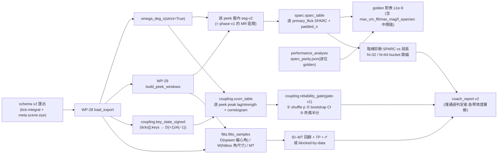

# WP-31 — advanced-diagnostics:SPARC + Key-Velocity Coupling xcorr + Fitts(進階診斷層)

> stage4 執行計畫的 WP 子資料夾。上層 spec:[../README.md](../README.md) · 決議依據:**GD-19**(stage4 採納/research 邊界/parity 雙向)· **GD-20**(教練報告 reliability gate 紅線)· GD-7(hitbox 單一來源)· GD-11(FPSci 紅線)。
> Companion:[task-checklist.md](task-checklist.md) · [progress.md](progress.md)

| | |
|---|---|
| **目標** | 三個 **P2 監控/研究向**指標各自跑到一個**明確的進退判定**:SPARC(逐段平滑度)、Key-Velocity Coupling xcorr(strafe-aim 干擾)、Fitts ID/MT/TP。本 WP 的交付物**不是「三個指標上線」,而是「三個指標各有一份可稽核的效度判定 + 通過者才進報告」**(C-D3) |
| **里程碑** | 無獨立里程碑。**WP-32 → M15 的選項輸入**(未過 gate 者不晉升,亦不阻塞 M15) |
| **相依** | **M14 全六項 ✅**(2026-08-07 重新宣告)+ **WP-30 ✅**(2026-08-10)。WP-30 不是形式相依:T1 的分段來源必須沿用 `phase-v1` 的**逐 peek 窗內 `seg-v2` 分段**慣例,否則會產生 `primary_flick` 的第三定義(C-D4) |
| **對應 FR** | FR-D13 / FR-D14 / FR-D15 + FR-D16 第三版(報告 v2,**條件性**) |
| **估時** | 2.5–3.25 dev-days(**高於 [../README.md §6](../README.md) 編列的 2–3d**;超出部分在 T0 的 gate 重新操作化與 T1 的階梯診斷,理由見 §4 與 [progress.md](progress.md) D-31.0) |
| **狀態** | ⬜ 未開始(entry blocker 全數解除) |

---

## 0. 進場現況(2026-08-10 規劃期讀碼 + 讀資料;四項皆改變 scope 與 DoD)

規劃期實測資料一律取自 T0 將凍結的三份 `tick-integral` 真實 fixture(§0.1),**非**推測值。

### 0.1 fixture roster 沿用 WP-30,不重新開放

| fixture | ticks | ω source | WP-31 用途 |
|---|---|---|---|
| [08:03](../../../../../research/fixtures/exports/counterstrafe_ad_v1-2026-08-05T08_03_45.617Z.json) | 3,507 | `aim-diff-legacy` | **禁用**(beat aliasing + 無 eye origin) |
| [09:39](../../../../../research/fixtures/exports/counterstrafe_ad_v1-2026-08-05T09_39_06.031Z.json) | 2,723 | `aim-diff-legacy` | **禁用**(同上) |
| [09:18](../../../../../research/fixtures/exports/counterstrafe_ad_v1-2026-08-07T09_18_05.631Z.json) | 2,038 | `tick-integral` | ✅ 真實效度樣本 |
| [09:24](../../../../../research/fixtures/exports/counterstrafe_ad_v1-2026-08-07T09_24_18.148Z.json) | 2,104 | `tick-integral` | ✅ 真實效度樣本 |
| [09:37](../../../../../research/fixtures/exports/counterstrafe_ad_v1-2026-08-07T09_37_24.351Z.json) | 1,904 | `tick-integral` | ✅ 真實效度樣本 |
| [`synthetic_counterstrafe.json`](../../../../../research/fixtures/exports/synthetic_counterstrafe.json) | 48 | `tick-integral` | 演算法邊界(2 peeks;短窗/退化案例) |

**機械閘同 WP-30**:所有入口 `omega_deg_s(..., strict=True)` + `resolve_eye_origin(meta, strict=True)`;legacy 匯出當場拋錯,不得靜默降級。真實證據母體 = **3 sessions × 20 peeks = 60 peeks(L 30 / R 30)**。

### 0.2 SPARC 的段來源:必須沿用 `phase-v1` 的逐 peek 分段(不是整條軌跡分段)

規劃期實測(`seg-v2`,三份真實 fixture):

| 分段方式 | primary_flick 數 | 意義 |
|---|---|---|
| **整條軌跡**一次分段 | **1 / 1 / 1**(pooled n = **3**) | 峰值門檻 `mean + kσ` 被整條 trace 的統計吃掉 → SPARC 只有 3 個樣本,FR-D13 的「分佈報告」形同虛設 |
| **逐 peek 窗內**分段(= WP-30 `phase-v1` / [generate_phase_report.py](../../../../../research/src/modules/metrics/notebooks/t2/generate_phase_report.py) 的作法) | **20 / 19 / 20**(pooled n = **59/60**,1 個 `no_primary_flick`) | SPARC 逐段樣本充足;且與 `phase-v1` 的 MR 區間**同一組邊界**,不產生第三定義 |

**契約**:T1 的 SPARC 逐段單位 = `phase-v1` 的 MR 區間(逐 peek 窗內 `seg-v2` 的第一個 `primary_flick`,D-30.1/D-30.1b)。T1 **不得**自行決定另一種分段 scoping。

### 0.3 SPARC 在 128Hz 短段上的頻譜解析度階梯(T1 的主要風險,已拍板處理方式)

實測逐 peek primary_flick 段長:min 24 / p25 28 / **median 32** / p75 37 / max 58 tick(中位數 ≈ 250 ms)。全部 ≥ `_MIN_SAMPLES = 16`,故 performance_analysis 的退化分支不會因段長被觸發。**但**:

| 段長 L | 零填充 N = 2^⌈log₂L⌉ | df = 128/N | ≤20Hz 的 bin 數 |
|---:|---:|---:|---:|
| 24–32 | 32 | 4.00 Hz | 6 |
| 33–58 | 64 | 2.00 Hz | 11 |

**中位段長 32 恰好落在 N=32/64 的邊界上**:L=32 與 L=33 的兩段動作,頻譜解析度差一倍,SPARC 值會出現與運動平滑度無關的**階梯跳動**。performance_analysis 的原始資料是 ~1kHz,同樣的 padding 規則在那裡不構成問題;在 128Hz 它是一等風險。

**已拍板(2026-08-10,使用者;T0 正式凍結)**:**逐位移植 + 量化階梯診斷**。
- `compute_sparc` **逐位照抄** performance_analysis 實作(含 `_MIN_SAMPLES=16`、`max(v)` 而非 `max(|v|)`、`_AMP_THRESH=0.03` 振幅門檻、`_FALLBACK_MIN_BINS=8` 回退、退化回傳 `0.0` 而非 NaN),golden 對表 ≤1e-9 為 T1 首要 DoD;
- **不新增固定 N 的第二版本**(避免 C-D4 意義下的第二定義);
- 另交付「SPARC vs 段長」階梯診斷,量化 N=32/64 邊界的跳幅;若跳幅 ≥ T0 pre-registered 比例門檻,SPARC **只能作同 padding bucket 內的分層比較**,且報告明文標限制。

### 0.4 reliability gate:OQ-S4-3 的 split-half r 在現行樣本結構下不可計算(已拍板改寫)

OQ-S4-3 原提案 `split-half r ≥ 0.7 + shuffle p < 0.01`。**split-half r 需要一個跨單位(受試者)的變異維度**才有定義;現況是 **1 受試者 × 3 session × 20 peeks**,跨受試者維度 n=1 → r 在數學上算不出來。若硬算(例如把 3 個 session 當 3 個單位),得到的是 n=3 的相關係數,不是可靠度證據。

**已拍板(2026-08-10,使用者;T0 凍結為 `gate-v1`)**:改寫為在此樣本結構下**可計算的三件組**——

| # | 條件 | 判準(T0 凍結具體數值) |
|---|---|---|
| ① | **shuffle / permutation null**:逐 peek 對 key-state 序列作循環位移(circular shift),重算 xcorr peak strength | 觀測值相對 null 分佈 `p < 0.01` |
| ② | **bootstrap CI**:逐 session 對 peek 重抽,計 session 級統計量的 CI | CI 寬度 ≤ 門檻(T0 凍結) |
| ③ | **奇偶 peek 半分一致性**:同 session 內奇數 / 偶數 peek 各算一次 session 級統計量 | \|Δ\| 落在 ② 的 CI 內 |

**明文限制(必須逐字進 `gate-v1` 文件與報告)**:此三件組**比 split-half r 弱** —— 它證明「訊號非偶然 + 估計量穩定」,**不證明個體差異可靠度**。因此在 C-D3 下,xcorr 通過 `gate-v1` 的**最高層級只能是「研究向 + 明示限制」**,不得升為教練報告主表指標;若三件組任一未過,一律 `research_only` 或 `blocked-by-data`。

### 0.5 Fitts:D 變異足夠,但 D 是內生的

實測 spawn 偏心角(取自 WP-30 T1 committed [detect parity JSON](../../../../../research/fixtures/parity/) 的 `eccentricityAtSpawnDeg`,三份真實 fixture,n=60):

| fixture | D min | D max |
|---|---:|---:|
| 09:18 | 16.75° | 30.72° |
| 09:24 | 11.16° | 28.49° |
| 09:37 | 8.70° | 29.45° |

pooled 跨度 8.70°–30.72° ≈ **3.5×**,滿足 [../README.md §2.1](../README.md) 對 velocity-scaling / Fitts 的「D 變異跨 ≥ 2 倍」觸發條件 → **T3 預期不會落 `blocked-by-data`**(仍保留該分支,判準 T0 pre-register)。

**但兩項效度限制必須寫死在 `fitts-v1` 文件與報告裡**:
1. **D 是內生的,不是實驗操弄的**。目標只在兩個固定位置((±2, 1.5, −4))出現;D 的變異幾乎全部來自「上一個 peek 結束時玩家把準星留在哪」。這是**相關性觀察**,不是 Fitts 典範的受控設計;D 與前一 peek 的行為(過衝/修正)共變。
2. **MT 含反應時間與 counter-strafe 停止時間**。`MT = t_firstShot − t_visible`,回歸截距 `a` 會吸收 RT + 急停;`t_detect` 只在 5–9/20 的 peek 上有值(WP-30 T1 實測),不足以做逐 peek 的 RT 扣除。

### 0.6 xcorr 的 key 通道:`ticks[].keys` 為主,`key` 事件為輔

三份 fixture 的 `ticks[].keys` 非空 tick 佔比 1128/2038、1103/2104、990/1904(≈ 52–55%),且各含 78–86 個 WP-29 T3 的 additive `key` 事件。xcorr 在 128Hz tick 網格上運作 → **key-state 一律取自 `ticks[].keys`**(與 ω 天然同格,免對時);`key` 事件僅作 T2 的**交叉檢核**(斷言 tick-derived state 與事件序列不矛盾),不作為主資料源。階段 A 的二元速度使 `vx` 通道退化,故**只做 ω 通道**(沿用 [../README.md §7](../README.md) 技術債②)。

---

## 1. 範圍

**In scope**:

```
research/src/modules/metrics/algorithms/sparc.py       ← ADD compute_sparc 逐位移植 + 逐段表 + 階梯診斷 [T1]
research/src/modules/metrics/algorithms/coupling.py    ← ADD key_state_signed / xcorr / gate-v1        [T2]
research/src/modules/metrics/algorithms/fitts.py       ← ADD D/W/ID/MT/TP + 回歸 + blocked-by-data      [T3]
research/src/modules/metrics/algorithms/tests/         ← ADD 單元測試(golden/邊界/退化/封閉 flags)    [T1-T3]
research/src/modules/metrics/notebooks/t1..t3/outputs/ ← ADD 分佈報告 + correlogram + Fitts 回歸圖      [T1-T3]
research/fixtures/golden/sparc-pa-parity.json          ← ADD performance_analysis 逐位 golden(移入)   [T1]
research/fixtures/golden/sparc-128hz-domain.json       ← ADD 本專案 fs 域 golden(一次性產生,記出處)  [T1]
research/src/report/coach_report.py                    ← MODIFY 報告 v2(**僅通過 gate 的指標**)       [T-exit]
research/src/report/tests/test_coach_report*.py        ← MODIFY 報告契約測試                            [T-exit]
docs/operational/analysis-advanced-diagnostics.md      ← ADD 新構念 registry(sparc-v1/xcorr-v1/gate-v1/fitts-v1) [T1-T-exit]
```

**Out of scope**:

- **TS 晉升實作與結果頁**(WP-32)。本 WP **不產生任何 `fixtures/golden/` 的 TS 對表 fixture**;`sparc-*.json` 是 Python↔Python(跨 repo)golden,不是 Python→TS 晉升 golden,兩者在 T1 必須以檔名與 README 明確區分。
- **動 `src/` 任何檔案**(含測試)。本 WP 全程零 TS 變更,`git diff --stat` 須為證據。
- **動任何已凍結參數**:`seg-v2`、`seg-v1`、`sync-v1`、`timeline-v1`、`compute-v1`、`construct-v1`、`detect-v1`、`phase-v1`、`curve-v1`。要改一律升版 + 全鏈重跑(D-28.7 先例)。
- **LDJ-V**(第二平滑度指標;[../README.md §2.1](../README.md) 觸發條件未達)、**velocity scaling 回歸**、**RawInputTrace/schema v3**。
- **以 08:03 / 09:39 產生任何 ω/ε 效度主張**(§0.1)。
- **新的真實錄製**。本 WP 不觸發採樣;樣本不足一律走 `blocked-by-data` 分支並開 OQ。
- **跨 session 併池推論**與跨 session 縱貫模型(沿用 WP-30:三 session 並列呈現)。
- **把 xcorr 或 SPARC 升為教練報告主表指標**(C-D3;§0.4 已限定最高層級)。

### 1.1 資料流(本 WP 新增部分;全域圖見 [../README.md §2.2](../README.md))



## 2. 關鍵契約

- **三個指標的交付物是「判定」,不是「數字」(C-D3 / GD-20)**:每個指標在 T-exit 必須有一份「進教練報告 / 研究向 / blocked-by-data」的判定 + 證據連結。**「算得出來」不等於「可以對選手講」**;寧可少一個指標,不能有一個會說錯話的指標。
- **SPARC 段來源唯一(§0.2)**:SPARC 的逐段單位 = `phase-v1` 的 MR 區間(逐 peek 窗內 `seg-v2` 第一個 `primary_flick`)。**不得**新增第三種分段 scoping;`no_primary_flick` 的 peek 一律排除並計數。
- **SPARC 演算法逐位移植,零在地改良(§0.3)**:`compute_sparc` 對照 performance_analysis 的 `research/src/modules/analysis/algorithms/metrics_sparc.py`(外部 repo,非本 repo 路徑)逐位重現。**不得**因為「128Hz 上 bin 太少」就改 `_FC_HZ`、`_AMP_THRESH` 或 padding 規則 —— 那會讓 FR-D13 的 golden 對表失去意義。解析度問題以**診斷 + 使用限制**處理,不以改參數處理。
- **跨 repo golden 是 committed JSON,不是 runtime 依賴(C-D1)**:`research/` 執行期**不得** import performance_analysis 的任何模組或路徑。golden 以檔案移入本 repo,產生方式與出處(repo、commit、腳本)寫入 `analysis-advanced-diagnostics.md`;`uv run pytest` 在沒有 performance_analysis 的機器上必須綠。
- **授權**:performance_analysis 為自有 repo,程式碼可移植([../README.md §0.0](../README.md));**GD-11 FPSci 紅線不變** —— 本 WP 不得引入 FPSci 任何程式碼或 config。
- **`gate-v1` 必須在看到任何真實 xcorr 值之前凍結(§0.4)**:三件組的門檻數值、shuffle/bootstrap 迭代次數與 **RNG seed** 全部在 T0 寫入 `GateThresholds` 並凍結。事後不得依結果調整,只能升版重跑。
- **隨機性一律 seeded**:shuffle 與 bootstrap 用 `np.random.default_rng(seed)`,seed 進 params 與報告 metadata;同一匯出 + 同參數 → 同判定(NFR 可重現)。
- **新構念 Python 為權威,但必須有文件(C-D4)**:`sparc-v1` / `xcorr-v1` / `gate-v1` / `fitts-v1` 的定義、參數、封閉 flags 詞彙表落 `docs/operational/analysis-advanced-diagnostics.md`,各帶 `version`;定稿後只能升版重跑,不得原地改語意。
- **Fitts 的 W 沿用單一 hitbox 來源(GD-7)**:W 由 `meta.targets.hitbox` + 目標距離推導,**不得**新增另一套尺寸常數或閾值;eye origin 一律 `resolve_eye_origin(meta, strict=True)`。
- **缺錨點是常態語意,不是缺失值**:沿用 `timeline-v1`/`phase-v1` 紀律 —— `no_primary_flick`、窗太短、key-state 恆定、`t_first_shot` 缺席一律標 flag 並排除該指標聚合,**不得吞成 NaN、不得補 0**;flags 封閉詞彙表由演算法自我斷言(比照 [peek.py](../../../../../research/src/modules/metrics/algorithms/peek.py) 的 `KNOWN_PEEK_FLAGS`)。
- **聚合納入規則沿用 D-29.5**:一列的值只有在「數值有限**且**整列 flags 為空」時才進 `n` 與分佈;被排除的列仍完整輸出供檢視。
- **效度聲稱不得擴大**:三份真實 fixture 為**同一受試者 P001、同一台 240 Hz 機器、同一 drill config**。任何 SPARC / xcorr / Fitts 結論一律附此限制(沿用 KI-004 R-7 紀律)。
- **報告 v2 的 deterministic 契約不變**:無時鐘、無隨機(seed 固定)、穩定排序;既有 9 份 committed 範例報告的重跑差異須逐項解釋。

## 3. Failure modes

| 觸發 | 影響 | 處理 |
|---|---|---|
| SPARC 改用整條軌跡分段 | pooled n 從 59 掉到 3,分佈報告失去意義,且產生 `primary_flick` 第三定義 | §0.2 契約 + T1 DoD 斷言:SPARC 表的列數與 `phase-v1` 的非退化 MR 數一致(59/60),不一致即 fail |
| 為了「讓 128Hz 有更多 bin」而動 `_FC_HZ` / `_AMP_THRESH` / padding | FR-D13 的跨 repo golden 對表變成自我對表,失去外部驗證力 | golden 對表(含 5 個中間值)為 T1 首要 DoD;參數常數以 `Final` 宣告並由測試逐值釘死 |
| N=32/64 階梯被當成真實平滑度差異 | 對選手講錯故事(「你這一下比較不順」其實只是段長多了一個 tick) | T1 階梯診斷 + T0 pre-registered 跳幅門檻;超標 → SPARC 限同 bucket 分層比較,報告明文標限制 |
| `gate-v1` 三件組被事後放寬以求「通過」 | 效度判定退化成儀式,C-D3 紅線失效 | T0 凍結門檻 + seed;T2 只執行不修改;要改一律升 `gate-v2` 並重跑全鏈,且須入 [DECISIONS.md](../../../DECISIONS.md) |
| shuffle null 用了非循環的重排 | 破壞 key-state 的自相關結構 → null 過度樂觀 → 假 p 值顯著 | pre-register 為**循環位移**(circular shift)且位移量避開 0 與 ±全長;合成訊號測試斷言「無耦合輸入 → p 不顯著」 |
| xcorr 在 key-state 恆定的 peek 上算出 NaN 並被吞掉 | 分母不明、correlogram 出現空洞 | `_pearson` 對零標準差回傳 NaN 為正確行為;消費端必須轉 `key_state_constant` flag 並排除聚合,不得補 0 |
| Fitts 的 D 內生性未被聲明 | 讀者把相關性讀成 Fitts 定律的受控驗證 | §0.5 兩項限制逐字寫入 `fitts-v1` 文件與報告;回歸結果一律標「觀察性、非受控設計」 |
| Fitts 的 W 另立尺寸常數 | 與 `HitDetector` / `trackingDerivation` 的 hitbox 來源分裂(違 GD-7) | W 只能由 `meta.targets.hitbox` 推導;測試斷言 hitbox 缺席時走 H1 `{1,2,1}` fallback 且與既有推導同源 |
| 短窗 / 退化輸入炸掉一鍵報告 | 報告 v2 不可用 | 合成 fixture(48 ticks / 2 peeks)為必跑回歸案例;所有退化路徑轉 flag,不拋例外到報告層 |
| `research/` 執行期 import performance_analysis | 違反 C-D1,且在沒有該 repo 的機器上 pytest 紅 | golden 以 committed JSON 移入;純度測試斷言 `sparc.py` 的 import 清單不含外部 repo 路徑 |
| 三 session 的 SPARC / xcorr 差異被當成訓練效果 | 對選手講錯故事 | 報告逐 session 呈現 n 與分佈,不跨 session 併池;跨 session 推論明文標 out of scope |

## 4. Task 索引

| Task | 檔案 | Objective | 相依 | Risk | 估時 |
|---|---|---|---|---|---|
| **T0** | [T0-entry-gate.md](T0-entry-gate.md) | 驗 M14 六項 + WP-30 T-exit;沿用 fixture roster 與 strict 閘;**`gate-v1` 三件組凍結(含 seed)**;`sparc-v1`/`xcorr-v1`/`fitts-v1` pre-registration;OQ-S4-3 改寫入帳 | **WP-30 T-exit ✅** | Low | 0.25–0.5d |
| **T1** | [T1-sparc.md](T1-sparc.md) | `compute_sparc` 逐位移植 + **跨 repo golden 對表 ≤1e-9(含中間值)** + 逐 MR 段 SPARC 表 + **階梯診斷** | T0 | Med | 0.75–1d |
| **T2** | [T2-key-velocity-xcorr.md](T2-key-velocity-xcorr.md) | signed A/D state vs ω 的逐 peek xcorr + correlogram + **`gate-v1` 明確判定** | T0(不依賴 T1) | **Med** | 0.75–1d |
| **T3** | [T3-fitts.md](T3-fitts.md) | D/W/ID/MT/TP + ID–MT 回歸 + `blocked-by-data` 判準 + 內生性限制 | T0(不依賴 T1/T2) | Low | 0.5–0.75d |
| **T-exit** | [T-exit-gate.md](T-exit-gate.md) | 三份判定收斂 + 報告 v2(僅通過者)+ `analysis-advanced-diagnostics.md` 定稿 + 文件對帳 | T1 + T2 + T3 | — | 0.5d |

> **與 [../README.md §6](../README.md) 的偏離(D-31.0,T0 落地時回寫上層)**:上層 spec 編列 2–3d,且 T1 SPARC 的 DoD 只寫「golden 對表 + 分佈報告 + 退化語意」。本計畫**追加兩項**並上修估時至 2.5–3.25d:① T0 增「`gate-v1` 重新操作化」(原 OQ-S4-3 的 split-half r 在 1 受試者 × 3 session 下不可計算,§0.4);② T1 增「N=32/64 階梯診斷」(§0.3 實測中位段長 32 恰在邊界)。兩者皆非可選:前者不做則 T2 的判定無定義,後者不做則 SPARC 的分佈報告可能在報告階梯假象。
>
> **T1/T2/T3 互不相依,可依資料/人力就緒度亂序執行**(沿用 [../README.md §5](../README.md))。建議序:T2 優先(唯一可能改變報告 v2 內容的判定)→ T1 → T3。

## 5. Interface contracts

```python
# research/src/modules/metrics/algorithms/sparc.py                                   [T1]
# 常數逐位對應 performance_analysis metrics_sparc.py;由測試逐值釘死,不得調整。
MIN_SAMPLES: Final[int] = 16
FC_HZ: Final[float] = 20.0
AMP_THRESH: Final[float] = 0.03
FALLBACK_MIN_BINS: Final[int] = 8

def compute_sparc(velocity_series: np.ndarray, fs: float) -> float: ...
    # 逐位移植;退化(n < 16 / fs <= 0 / max_v <= 1e-9 / bins < 2)回傳 0.0,NaN 輸入回傳 nan

@dataclass(frozen=True)
class SparcTrace:                                  # golden 對表用的中間值,對應 PA 的 expected_*
    max_v: float; n_fft: int; max_mag: float
    freqs_pass1_count: int; freqs_final_count: int
    f_span: float; arc: float; sparc: float

def compute_sparc_traced(velocity_series: np.ndarray, fs: float) -> SparcTrace: ...

@dataclass(frozen=True)
class SparcParams:                                 # pre-registered;凍結後只能改 version
    fs_hz: float                                   # 128.0;與 dt 一致性斷言
    step_ratio_threshold: float                    # 階梯跳幅 / 段內變異 的上限(T0 凍結)
    version: str                                   # "sparc-v1"

@dataclass(frozen=True)
class SparcSample:
    peek_index: int; side: Literal['L', 'R']
    start_idx: int; end_idx: int                   # = phase-v1 的 MR 區間(peek 窗內索引)
    n_ticks: int; padded_n: int; bins_le_fc: int   # 階梯診斷的分層鍵
    sparc: float | None
    flags: tuple[str, ...]                         # 封閉詞彙表:no_primary_flick / too_few_samples / degenerate_spectrum / …

def sparc_table(peeks, omega_by_peek, segments_by_peek,
                params: SparcParams) -> pd.DataFrame: ...
def sparc_length_sensitivity(table: pd.DataFrame,
                             params: SparcParams) -> dict: ...
    # 逐 padded_n bucket 的 n / 中位 / IQR + 跨 bucket 跳幅;
    # verdict: 'comparable' | 'stratified_only'(跳幅 ≥ step_ratio_threshold)

# research/src/modules/metrics/algorithms/coupling.py                                [T2]
@dataclass(frozen=True)
class XcorrParams:                                 # pre-registered;凍結後只能改 version
    max_lag_ms: float                              # 對稱 lag 範圍 [−max_lag_ms, +max_lag_ms]
    min_ticks: int                                 # 窗內最少 tick;低於此 → window_too_short
    key_encoding: Literal['signed_ad']             # D(+1) − A(−1);A+D 同按 → 0
    version: str                                   # "xcorr-v1"

@dataclass(frozen=True)
class XcorrResult:
    peek_index: int; side: Literal['L', 'R']
    peak_lag_ms: float | None                      # 負 = key 領先 ω;正 = ω 領先 key(與 PA 同慣例)
    peak_strength: float | None                    # signed Pearson r
    n_ticks: int
    correlogram: tuple[tuple[float, float], ...]   # ((lag_ms, r), …);報告用
    flags: tuple[str, ...]                         # key_state_constant / omega_constant / window_too_short / …

def key_state_signed(ticks: pd.DataFrame) -> np.ndarray: ...          # (n_ticks,) float ∈ {−1, 0, +1}
def key_velocity_xcorr(key_state: np.ndarray, omega: np.ndarray, *,
                       max_lag_ticks: int, dt_ms: float) -> XcorrResult: ...
def xcorr_table(peeks, ticks, omega, params: XcorrParams) -> pd.DataFrame: ...

@dataclass(frozen=True)
class GateThresholds:                              # **T0 凍結;事後不得調整(gate-v1)**
    min_samples: int                               # 低於此 → blocked-by-data
    shuffle_iters: int; shuffle_alpha: float       # ① circular-shift null;p < alpha
    bootstrap_iters: int; ci_width_max: float      # ② session 級統計量 CI 寬度上限
    half_agreement_within_ci: bool                 # ③ 奇偶半分 |Δ| 須落在 ② 的 CI 內
    seed: int                                      # 決定性:同輸入同判定
    version: str                                   # "gate-v1"

@dataclass(frozen=True)
class GateVerdict:
    metric: str; session: str; n: int
    observed: float
    shuffle_p: float | None
    ci_lo: float | None; ci_hi: float | None; ci_width: float | None
    half_delta: float | None; half_within_ci: bool | None
    verdict: Literal['coach_report', 'research_only', 'blocked-by-data']
    reason: str                                    # 可枚舉字串;三件組逐條說明哪一條未過

def reliability_gate(table: pd.DataFrame,
                     thresholds: GateThresholds) -> tuple[GateVerdict, ...]: ...
    # C-D3 上限:本樣本結構下 'coach_report' 不可達(§0.4),最高為 'research_only'

# research/src/modules/metrics/algorithms/fitts.py                                   [T3]
@dataclass(frozen=True)
class FittsParams:                                 # pre-registered;凍結後只能改 version
    min_samples: int                               # 低於此 → blocked-by-data
    min_d_ratio: float                             # max(D)/min(D) 低於此 → blocked-by-data
    min_id_range_bits: float                       # ID 跨度低於此 → blocked-by-data
    version: str                                   # "fitts-v1"

@dataclass(frozen=True)
class FittsSample:
    peek_index: int; side: Literal['L', 'R']
    d_deg: float | None                            # spawn 偏心角:aim@t_visible → 目標中心
    w_deg: float | None                            # 目標水平角尺寸,自 meta.targets.hitbox(GD-7)
    id_bits: float | None                          # log2(1 + D/W)
    mt_ms: float | None                            # t_first_shot − t_visible(含 RT,見 §0.5)
    flags: tuple[str, ...]                         # no_first_shot / degenerate_geometry / …

@dataclass(frozen=True)
class FittsResult:
    samples: tuple[FittsSample, ...]
    n: int
    slope_ms_per_bit: float | None; intercept_ms: float | None; r2: float | None
    throughput_bits_s: float | None                # TP = 1 / slope(秒制)
    d_ratio: float | None; id_range_bits: float | None
    status: Literal['ok', 'blocked-by-data']
    reason: str

def fitts_samples(peeks, export, *, eye_origin: EyeOrigin,
                  params: FittsParams) -> FittsResult: ...
```

## 6. 執行規則

沿用 [exec-plan/README.md §5](../../../README.md):一 task = 一垂直切片 = 一原子 commit;完成即更新 [progress.md](progress.md) 與 [task-checklist.md](task-checklist.md);**兩個閘都要貼證據**(`uv run pytest` + `npm run test:ci`)。跨 WP 決策入 [DECISIONS.md](../../../DECISIONS.md),per-WP 決策入本資料夾 `progress.md`(編號 `D-31.n`)。

**五條不可事後改的凍結**:T0 的 fixture roster、T0 的 `gate-v1`(含 seed)、T0 的 `sparc-v1`/`xcorr-v1`/`fitts-v1` pre-registration、上游 `seg-v2`/`phase-v1`/`curve-v1`、上游 `sync-v1`/`timeline-v1`/`compute-v1`/`detect-v1`/`construct-v1`。要改一律升 version + 全鏈重跑。

**Concurrency model**:沿用 [../README.md §2.7](../README.md) 的 **N/A(單程序批次)**。T2 的 shuffle(1000×)與 bootstrap(2000×)是單執行緒純函式迴圈,**不得**為了加速引入 thread/process pool —— 平行化會讓 seeded RNG 的取樣順序不可重現,直接破壞 `gate-v1` 的決定性要求(T2 DoD ②)。若日後效能成為問題,只能以「固定分片 + 每片獨立 seed」的方式重新設計並升版。

**本 WP 特有的一條**:`npm run test:ci` 在本 WP 中是**回歸閘不是對表閘** —— 本 WP 不新增任何 TS 測試,`src/` 與 `tests/` 應為零 diff;若出現 diff,該 task 立即 fail 並回頭檢視是否越界。

## 7. Open Questions(本 WP 新增;既有 OQ-S4-* 見 [../README.md §8](../README.md))

| # | 問題 | 建議 / 待決 | Owner | Deadline | 未決影響 |
|---|---|---|---|---|---|
| **OQ-S4-3**(既有) | reliability gate 門檻 | 🟢 **T0 關閉**:原提案 `split-half r ≥ 0.7 + shuffle p < 0.01` 在 1 受試者 × 3 session 下 r 不可計算(§0.4);2026-08-10 使用者拍板改為 `gate-v1` 三件組(shuffle p / bootstrap CI / 奇偶半分),並明文限制「不證明個體差異可靠度、C-D3 下最高只到研究向」。T0 凍結具體數值與 seed 後關閉 | 使用者 / 研究者 | WP-31 T0 | 未凍結則 T2 的判定無定義 |
| **OQ-S4-18**(新) | SPARC 在 128Hz 的 N=32/64 padding 階梯,是否大到讓「跨段長比較」不成立 | 🟡 **T1 以資料判定**。實測段長中位數 32 恰在邊界(§0.3)。T0 pre-register 跳幅門檻;超標 → SPARC 僅限同 bucket 分層比較並在報告標限制;**不得**為此改 padding 規則(會破壞 FR-D13 golden 對表) | 研究者 | WP-31 T1 | SPARC 的分佈報告能否跨段長解讀 |
| **OQ-S4-19**(新) | Fitts 的 D 為內生(玩家上一 peek 留下的準星位置),回歸結果能否作為 TP 的個人基線 | 🟡 **T3 交付數值 + 限制,不作因果主張**。D 與前一 peek 的過衝/修正共變;MT 含 RT 與急停時間(§0.5)。是否升級為受控設計(在 drill 端隨機化 spawn 偏心)屬**新 WP/新錄製**,不在本 stage | 研究者 | pilot 後 | TP 的解讀範圍;不阻塞 T3 交付 |
| **OQ-S4-17**(既有) | REC-end 與 `t_detect` 系統性分歧 | 🟡 **維持 open**;本 WP 不消費 REC 邊界(SPARC 用 MR 區間),無新證據。若 T3 日後要做 RT 扣除的 MT,才會再撞到此題 | 研究者 | 待排 | 不影響 WP-31 |
| **OQ-S4-11**(既有) | 真實 fixture 皆無 ADS、皆為 hitscan | 🟡 **維持 open**:本 WP 三指標的 `--group-by ads`/`weapon_mode` 在真實資料上同樣退化成單格 | 研究者 | ADS-on / projectile 真實錄製後 | 條件分層無真實對照;不阻塞實作 |
