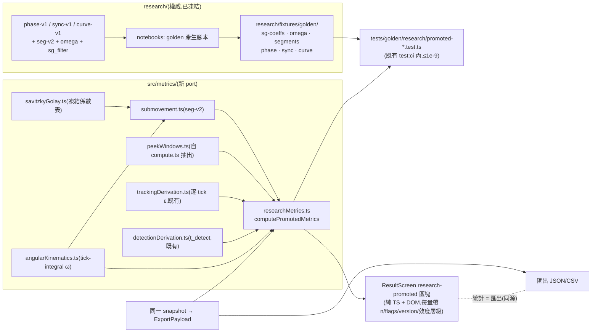

# WP-32 — dashboard-integration:golden parity → TS metrics + 結果頁擴充 + 驗收清單 D(M15)

> stage4 執行計畫的 WP 子資料夾。上層 spec:[../README.md](../README.md) · 決議依據:**GD-19**(stage4 採納/編號/research 邊界/**parity 雙向**)· **GD-20**(教練報告 reliability gate 紅線)· GD-7(hitbox 單一來源)· GD-11(FPSci 紅線)· D1(UI = 純 TS + DOM)。
> Companion:[task-checklist.md](task-checklist.md) · [progress.md](progress.md)

| | |
|---|---|
| **目標** | 把 stage4 research 層**已凍結且已驗證**的三個新構念(`phase-v1` / `sync-v1` / `curve-v1`)以 **Python → TS golden parity(≤1e-9)** 晉升進 `src/metrics/`,並擴充結果頁呈現;以 `acceptance-stage-d.md` 收斂 **M15 = stage4 交付** |
| **里程碑** | **M15**(stage4 交付:瞄準 × 急停教練分析管線 pilot-ready) |
| **相依** | **WP-29 ✅**(`timeline-v1`/`sync-v1`)+ **WP-30 ✅**(`phase-v1`/`curve-v1`/research-side `t_detect`)+ **WP-31 T-exit ✅**(三份效度判定收斂;**2026-08-12 使用者拍板由「選項」升為硬相依**,見 §0.2 與 D-32.0) |
| **對應 FR** | FR-D17(晉升機制)+ FR-D16 收尾(報告 v2 已由 WP-31 T-exit 交付,本 WP 只做結果頁側) |
| **估時** | **4.5–5.75 dev-days**(規劃稿 2–3d → 上修,理由見 §0.1 與 D-32.0) |
| **狀態** | ⬜ 未開始 |

---

## 0. 進場現況(2026-08-12 讀碼,影響 scope / 估時 / task 數)

### 0.1 晉升成本不對稱 —— 本 WP 最重要的規劃事實

規劃稿把 WP-32 寫成「T1 golden parity + T2 結果頁擴充」兩個 task。**讀碼後這個切法不成立**:三個晉升項對 TS 側的要求差距一個數量級。

`grep -rniE "savgol|sg_window|submovement|primary_flick|omega" src/ --include=*.ts` 對 `src/metrics/` **零命中** —— TS 側目前**沒有** ω(t)、沒有 Savitzky-Golay、沒有 submovement 分段。

| 晉升項 | TS 側已有 | TS 側須新增 | 成本 |
|---|---|---|---|
| **`sync-v1`** | peek 窗界(`compute.ts` 私有 `buildPeekWindows`)、`ticks[].keys` | `t_release` 推導 + 三個差值 + `PrecisionVerdict` | 低 |
| **`curve-v1`** | 逐 tick ε(`trackingDerivation.ts` 私有 `trackingSamples`)、`eyeOrigin.ts` | ω(t) 移植 + `normalize101` + L/R 聚合 + IQR band | 中 |
| **`phase-v1`** | `t_detect`(`detectionDerivation.ts`,WP-30 T1 已對表) | ω(t) + **SG filter** + **`seg-v2` 整套分段** + `phase_decompose` | **高** |

`phase-v1` 的 MR 邊界 = 逐 peek 窗內 `seg-v2` 的第一個 `primary_flick`([D-30.1/D-30.1b](../wp-30-trajectory-metrics/progress.md))→ **晉升 phase 必然連帶晉升整條分段鏈**。這是本 WP 把 task 從 2 個拆成 7 個、估時從 2–3d 上修到 4.5–5.75d 的唯一原因。

**一項意外的減負**:`phase-v1` 的 Butterworth **只用於報告疊圖平滑**(`smooth_report_omega`,模組 docstring 明寫 "never a boundary input"),不參與任何邊界計算 → **TS 側不需要移植 `butter_filter`/`filtfilt`**。代價是 `filter_degenerate` 這一個 flag 在 TS 側無法產生,須於 T0 明文凍結為「刻意的詞彙表子集」(見 §2 契約第 4 條)。

### 0.2 WP-31 三指標:預期全數不晉升,但理由要有證據

WP-31 T1 判 `stratified_only`(SPARC 僅限同 `padded_n` bucket 內比較,[D-31.6](../wp-31-advanced-diagnostics/progress.md))、T2 判**三 session 全 `research_only`**([D-31.9](../wp-31-advanced-diagnostics/progress.md);`coach_report` 在 `gate-v1` 上限條款下由 AST 掃描證明不可達)。**C-D3 下兩者都不得進結果頁主表。** T3(Fitts)判定未出。

使用者已拍板 **先完成 WP-31 T3 + T-exit 再開 WP-32 T0**(2026-08-12),故本 WP 的 T0 拿得到三份完整判定,晉升清單的排除理由是**證據**而非推定。

### 0.3 fixture roster 與禁用界線(承 WP-31 T0,不重新談判)

| fixture | phase / curve / ω 相關對表 | sync 相關對表 |
|---|---|---|
| 09:18 / 09:24 / 09:37(tick-integral) | ✅ 主用(`strict=True`) | ✅ 可用 |
| 09:39 | ❌ **禁用**(beat aliasing + 無 eye origin) | ✅ **主要真實效度樣本**(13 個 unflagged Sync 列) |
| 08:03 | ❌ 禁用(同上) | ✅ 零輸入邊界案例(`n=0` 不得 crash) |
| 合成 | ✅ 演算法邊界 | ✅ 演算法邊界 |

**sync-v1 不吃 ω/`px`/`pz`,只吃 `events` 與 `ticks[].keys`**,故 09:39/08:03 對 sync 仍是合法證據(WP-29 T0 的 KI-004 使用界線決議原文,界線未變)。

### 0.4 生產路徑上 `meta.mouseIntegration` 存在(已驗)

[main.ts:364](../../../../../src/main.ts) 於 `collectMeta` 帶入 `mouseIntegration`、[main.ts:783](../../../../../src/main.ts) 逐 drill 重配 gain → **實機匯出必帶 `ticks[].dYaw/dPitch`**,TS 側可用與 Python 逐位相同的 `tick-integral` ω。

但 `DataRecorder` 的 `mouseIntegration` 是 **optional**(預設未配置,[DataRecorder.test.ts:178](../../../../../src/data/DataRecorder.test.ts))→ 缺席時 Python 側 `omega_deg_s(strict=True)` 會拋錯。**TS 側必須採同一紀律:缺席 → 該區塊標 `blocked`,禁止靜默回退 `aim-diff-legacy`**(那正是 [KI-005](../../../../known_issue/KI-005-omega-render-sim-aliasing.md) 的 beat aliasing bug,退回去等於在結果頁上顯示已知錯誤的數字)。

---

## 1. 範圍

**In scope**:

```
src/metrics/filters/savitzkyGolay.ts        ← ADD SG 平滑(凍結係數表,seg-v2 w=11/p=3)     [T1]
src/metrics/angularKinematics.ts            ← ADD omegaDegPerSec(tick-integral,strict)      [T1]
src/metrics/submovement.ts                  ← ADD segmentSubmovements + SEG_V2_PARAMS        [T2]
src/metrics/peekWindows.ts                  ← ADD 由 compute.ts 抽出的共享窗界(零語意變更)  [T3]
src/metrics/compute.ts                      ← MODIFY 改用共享窗界(逐位不變)                 [T3]
src/metrics/researchMetrics.ts              ← ADD computePromotedMetrics(phase/sync/curve)   [T3/T4]
src/metrics/trackingDerivation.ts           ← MODIFY 逐 tick ε 抽為可複用(零語意變更)        [T4]
src/metrics/MetricsDashboard.ts             ← MODIFY additive meta 參數                       [T5]
src/ui/ResultScreen.ts                      ← MODIFY 新增 research-promoted 區塊(純 TS+DOM)  [T5]
src/main.ts                                 ← MODIFY 結果頁取得 meta(additive)               [T5]
tests/golden/research/promoted-*.test.ts    ← ADD 四支 table-driven 對表(既有 test:ci 內)    [T1~T4]
research/fixtures/golden/*.json             ← ADD sg-coeffs / omega / segments / phase / sync / curve golden [T1~T4]
research/src/modules/*/notebooks/*/         ← ADD golden 產生腳本(寫檔只在 notebooks,C-D2)  [T1~T4]
docs/operational/acceptance-stage-d.md      ← ADD 驗收清單 D                                  [T-exit]
docs/operational/analysis-phase-curves.md   ← MODIFY 補「TS 晉升面與刻意分歧」段              [T3/T4]
CLAUDE.md §4                                ← MODIFY 追加 C-D5(雙實作對表紀律)               [T-exit]
```

**Out of scope**:

- **WP-31 三指標(SPARC / xcorr / Fitts)的晉升** —— C-D3 紅線;`stratified_only` / `research_only` 一律不進結果頁。觸發條件 = 取得 ≥3 受試者後另立 `gate-v2` 重跑並判 `coach_report`(OQ-S4-3 升級路徑)。
- **`timeline-v1` 的晉升** —— 三個時間軸量本來就是 `compute.ts` 的既有輸出(TS 為權威,WP-29 T1 已對表),**沒有東西要晉升**。
- **Butterworth / `smooth_report_omega` 的 TS 移植** —— 報告疊圖用,不參與邊界(§0.1)。
- **教練報告(Python 側 HTML)的任何變更** —— 報告 v2 由 WP-31 T-exit 定稿。
- **`seg-v1` 的 TS 移植** —— 只服務 pre-KI-005 legacy 匯出;結果頁只處理當下實機 drill,必帶 `mouseIntegration`。缺席 → `blocked`(§0.4)。
- **互動式 dashboard / 跨 session 聚合 / 即時(drill 中)回饋** —— stage4 §2.1 out of scope,觸發條件未變。
- **任何 sim / 輸入鏈 / schema 變更** —— 本 WP 引擎側只碰 `src/metrics/`、`src/ui/`、`src/main.ts` 的組裝;**不 bump `schemaVersion`、不重錄任何 golden/決定性 baseline**。

### 1.1 資料流(本 WP 新增部分;全域圖見 [../README.md §2.2](../README.md))



---

## 2. 關鍵契約(全部為 T0 凍結項,事後只能升 version 重跑)

1. **parity 方向不變(GD-19 §2.4a)**:`phase-v1` / `sync-v1` / `curve-v1` / `seg-v2` / ω / SG 皆為**新構念 → Python 為權威、TS 為 port**,閘 = `research/fixtures/golden/*.json` + `tests/golden/research/promoted-*.test.ts`,落在**既有 `npm run test:ci`**(engine CI 不引入 Python 相依,OQ-S4-7 決議不變)。

2. **既有構念禁第二定義(C-D4)** —— 本 WP 最容易犯的錯:
   - peek 窗界 `[t_visible, nextVisible.t)`:**必須複用** `compute.ts` 現有實作(T3 抽為 `peekWindows.ts`,**零語意變更**),不得在 `researchMetrics.ts` 另寫一份;
   - 逐 tick ε:**必須複用** `trackingDerivation.ts` 的計算路徑(T4 抽出,零語意變更),不得用 `eyeOrigin` 另組一套幾何;
   - `t_detect`:**必須呼叫** `deriveDetectionMetrics`(既有 TS 權威,WP-30 T1 已雙向對表),不得重推。

3. **SG 係數 = 凍結常數,不是「移植 scipy」**:`sg_filter` 底層是 `scipy.signal.savgol_filter(window_length=11, polyorder=3)`,預設 `mode='interp'` —— 內部是固定 FIR 係數,**兩端 5 個樣本另以三次多項式擬合**(scipy `_fit_edges_polyfit` 走 `lstsq`)。在 TS 重寫 `lstsq` 不可能達到 ≤1e-9 的可靠性。**做法**:由 Python 產出 `sg-coeffs-seg-v2.json`(11 個 interior 係數 + 前/後各 5×11 的 edge 轉換矩陣)→ TS **內嵌為凍結常數表**(生產碼不在 runtime 讀 fixture)+ 一支測試斷言常數表 vs committed golden **≤1e-12**。係數表本身即凍結參數的一部分,改動 = 升 `seg-v3`。

4. **`filter_degenerate` 是刻意的詞彙表子集(D-32.x,T0 凍結)**:TS 側不移植 Butterworth → 無法產生 `filter_degenerate`。golden 對表**逐 peek 比較 flags 集合時排除此 flag**,並在 `analysis-phase-curves.md` 明文記載「TS 晉升面的 flags 詞彙表 = Python 詞彙表 −{`filter_degenerate`};此 flag 只描述報告疊圖能否平滑,不影響任何 rec/mr/v/peak ω 數值」。其餘 flag **必須逐 peek 完全相同**(不是子集,是相等)。

5. **`blocked` 優於錯值(§0.4)**:`meta.mouseIntegration` 缺席 → `computePromotedMetrics` 回傳 `{ status: 'blocked', reason }`,結果頁顯示理由;**禁止**回退 `aim-diff-legacy`。這是把 [KI-005](../../../../known_issue/KI-005-omega-render-sim-aliasing.md) 的教訓寫進生產碼。

6. **教練報告紅線延伸到結果頁(C-D3 / GD-20)**:結果頁上每個晉升量必須帶 **n + flags 計數 + version 字串 + 效度層級**;未過構念驗證者(WP-31 三項)一律不出現。單 drill n ≈ 20 peeks,**強制顯示 n 與分佈而非只給均值**(沿用 WP-29 報告紀律)。

7. **統計 = 匯出(不變式,stage1 WP-8/WP-9 先例)**:晉升指標必須由**與匯出同一個 `snapshot()`** 推導。T5 以 additive 參數把 `meta` 帶進結果頁,不得另建第二條資料來源。

8. **引擎側零行為變更**:`src/sim`、`src/input`、`src/loop`、`src/data` 應為零 diff;`compute.ts` 與 `trackingDerivation.ts` 的修改是**純結構抽出**,既有測試須**零修改**全綠(這是判斷「有沒有偷改語意」的機械證據)。

---

## 3. Failure modes

| 觸發 | 影響 | 處理 |
|---|---|---|
| **SG edge(`mode='interp'`)在 TS 對不上 ≤1e-9** | `seg-v2` 邊界漂移 → phase 的 rec/mr/v 全錯,M15 假綠 | 契約 3 的凍結係數表把問題從「重寫 lstsq」降為「套矩陣」;T1 DoD 首項即係數表 ≤1e-12。若仍對不上 → **停手入帳 OQ-S4-21**,不得放寬容差硬過 |
| **`find_peaks` plateau 規則不一致** | 平頂峰的 peak index 差 1 → segment 邊界差 1 tick → phase 差 7.8125ms | T2 必須逐位重現 scipy `_local_maxima_1d` 的「plateau 取 `(left+right)//2`」;合成 fixture 必含平頂與相鄰雙峰案例;golden 對表 **segment index 為整數逐位相等**(非容差) |
| 抽出 `buildPeekWindows` / `trackingSamples` 時偷改語意 | `compute.ts` / `deriveTrackingMetrics` 行為漂移 → WP-29 的 `timeline-parity` 與 WP-28 的 `epsilon-parity` 一起紅 | T3/T4 DoD:既有測試**零修改**全綠;`git diff` 須顯示抽出檔案的邏輯行逐字搬移(可審) |
| 結果頁拿不到 `meta`(`collectMeta` 為 async/量測 displayHz) | 晉升區塊在實機上永遠 `blocked`,測試卻綠 | T5 必須有一條 **E2E 斷言**(既有 `tests/e2e/full-drill.spec.ts` 路徑)證明實機 drill 結束後晉升區塊有非空數值,不能只靠 unit test |
| 單 drill n 過小(20 peeks,phase 非退化 ~59/60) | 教練用不穩統計下處方 | 契約 6:強制顯示 n + 分佈;T5 測試斷言 n 欄位存在且與 golden 相同 |
| Python 側日後改了 `phase-v1`/`seg-v2` 卻沒重跑 TS 對表 | dashboard 數字 ≠ 研究數字(GD-19 要防的正是這個) | golden 進 `test:ci` → 任一端改動 CI 立即紅;T-exit 把「任一端改動須重跑對表」升為 **CLAUDE.md §4 的 C-D5 硬約束** |
| 為了讓 TS 好寫而簡化 `curve-v1` 的 `min_ticks=3` / IQR band | 兩邊曲線形狀不同,L/R 疊圖說錯故事 | `CurveParams` 三欄位在 T0 逐欄抄錄凍結;T4 golden 對 101 點**逐點**對表,且 `n(L)`/`n(R)` 與排除規則須相同 |
| 晉升區塊把 WP-31 的 `research_only` 指標「順手也放上去」 | 直接違反 C-D3 紅線 | T0 凍結晉升清單為封閉三項;T5 測試斷言結果頁 metric id 集合 = 封閉清單(多一個即 fail) |
| golden fixture 體積膨脹(逐 tick 101 點 × 60 peeks) | repo 膨脹、diff 不可讀 | golden 只存**聚合曲線**(L/R 各 101 點 + band)與逐 peek 純量,不存逐 tick 原始序列;上限沿用 `research/README.md` 政策 |

---

## 4. Task 索引

| Task | 檔案 | Objective | 相依 | Risk | 估時 |
|---|---|---|---|---|---|
| **T0** | [T0-entry-gate.md](T0-entry-gate.md) | 驗三個上游 exit;**凍結晉升清單(關閉 OQ-S4-4)+ 移植紀律五條 + SG 係數策略 + flags 子集決議**;零程式碼 | — | Low | 0.25–0.5d |
| **T1** | [T1-ts-kinematics-sg.md](T1-ts-kinematics-sg.md) | TS ω(t)(tick-integral,strict)+ **SG 凍結係數表** + 兩支 golden | T0 | **High** | 1–1.25d |
| **T2** | [T2-ts-segmentation.md](T2-ts-segmentation.md) | TS `seg-v2` 分段移植(`find_peaks` plateau / 邊界 walk / merge / flags)+ golden(**index 逐位**) | T1 | **High** | 1–1.25d |
| **T3** | [T3-phase-sync-promotion.md](T3-phase-sync-promotion.md) | 共享 peek 窗抽出 + `phase-v1` + `sync-v1` 晉升 + golden | T2 | Med | 0.75–1d |
| **T4** | [T4-curve-promotion.md](T4-curve-promotion.md) | 逐 tick ε 抽出 + `curve-v1` 101 點 L/R 晉升 + golden | T1(不依賴 T2/T3) | Med | 0.5–0.75d |
| **T5** | [T5-result-screen.md](T5-result-screen.md) | 結果頁 research-promoted 區塊(n/flags/version/效度層級 + `blocked` 態)+ 統計=匯出 E2E | T3 + T4 | Med | 0.5–0.75d |
| **T-exit** | [T-exit-gate.md](T-exit-gate.md) | `acceptance-stage-d.md` + C-D5 入 CLAUDE.md + 文件對帳 + **M15 宣告** | T5 | — | 0.5d |

**T4 只依賴 T1(ω)與既有 ε,與 T2/T3 無相依** → 若要並行,T4 可與 T2 同時開;但**一 task 一 commit 的紀律不變**。

---

## 5. Interface contracts

```ts
// src/metrics/filters/savitzkyGolay.ts                                            [T1]
/** 凍結係數表:seg-v2 的 window=11 / poly=3。改動 = 升 seg 版號,不得原地改。 */
export interface SgCoefficients {
  readonly window: number;              // 11
  readonly poly: number;                // 3
  readonly interior: readonly number[]; // 長度 = window
  readonly leadingEdge: readonly (readonly number[])[];  // (window-1)/2 列 × window
  readonly trailingEdge: readonly (readonly number[])[];
  readonly version: string;             // 'sg-seg-v2'
}
export const SG_SEG_V2: SgCoefficients;
/** 逐位對齊 scipy savgol_filter(mode='interp');輸入須全為有限值且長度 ≥ window,否則拋錯。 */
export function sgSmooth(values: readonly number[], coeffs: SgCoefficients): number[];

// src/metrics/angularKinematics.ts                                                [T1]
export type OmegaSource = 'tick-integral';
export interface OmegaResult { readonly values: readonly number[]; readonly source: OmegaSource; }
/**
 * ω(t) deg/s,index 0 為 NaN(與 Python omega_deg_s 契約同義)。
 * 僅支援 tick-integral:ticks[].dYaw/dPitch 缺席或含非有限值即 throw(KI-005;禁 aim-diff-legacy 回退)。
 * pitch 修正用「該 tick 的 pitch 減去半個積分量」的中點 pitch。
 */
export function omegaDegPerSec(ticks: readonly Tick[]): OmegaResult;

// src/metrics/submovement.ts                                                      [T2]
export type SegmentKind = 'primary_flick' | 'micro_adjustment';
export interface SegmentParams {
  readonly sgWindow: number; readonly sgPoly: number;
  readonly peakSigmaK: number; readonly peakFloorDegPerSec: number;
  readonly lowRatio: number; readonly stopRatio: number;
  readonly version: string;
}
export const SEG_V2_PARAMS: SegmentParams;   // 11 / 3 / 0.75 / 60.0 / 0.1 / 0.2 / 'seg-v2'
export interface Segment {
  readonly kind: SegmentKind;
  readonly startIdx: number; readonly endIdx: number;   // inclusive,對 omega 去頭後的 index frame
  readonly peakOmega: number;
  readonly flags: readonly string[];                     // 已排序,封閉詞彙表
}
export interface SegmentResult { readonly segments: readonly Segment[]; readonly traceFlags: readonly string[]; }
export function segmentSubmovements(omega: readonly number[], params?: SegmentParams): SegmentResult;

// src/metrics/peekWindows.ts                                                      [T3;自 compute.ts 抽出,零語意變更]
export interface PeekWindowTs {
  readonly index: number; readonly targetId: string; readonly side: 'L' | 'R';
  readonly tVisible: number; readonly tEnd: number;      // nextVisible.t 或 Infinity
  readonly counter?: CounterEvent; readonly firstFire?: FireEvent;
  readonly tickRange: { readonly start: number; readonly end: number }; // [start, end) 對已排序 ticks
}
export function buildPeekWindows(payload: ExportPayload): PeekWindowTs[];

// src/metrics/researchMetrics.ts                                                  [T3/T4]
export interface PromotedStat { mean: number; p50: number; sd: number; n: number; }
export interface PhaseAggregate {
  recMs: PromotedStat; mrMs: PromotedStat; vMs: PromotedStat;
  peakOmegaDegPerSec: PromotedStat;
  flagCounts: Readonly<Record<string, number>>;          // 詞彙表 −{filter_degenerate}
  version: string;                                       // 'phase-v1'
}
export interface SyncAggregate {
  releaseToFireMs: PromotedStat; counterHoldMs: PromotedStat; counterToFireMs: PromotedStat;
  verdicts: readonly { metric: string; n: number; sampleSdMs?: number;
                       quantizationSdMs: number;
                       verdict: 'sufficient' | 'insufficient' | 'blocked-by-data'; reason: string }[];
  flagCounts: Readonly<Record<string, number>>;
  version: string;                                       // 'sync-v1'
}
export interface CurveAggregate {
  omega: { left: NormalizedCurve; right: NormalizedCurve };
  epsilon: { left: NormalizedCurve; right: NormalizedCurve };
  version: string;                                       // 'curve-v1'
}
export interface NormalizedCurve {
  readonly mean: readonly number[];   // 長度 101
  readonly lower: readonly number[];  // IQR 下界
  readonly upper: readonly number[];
  readonly n: number;
}
export type PromotedMetrics =
  | { status: 'ok'; phase: PhaseAggregate; sync: SyncAggregate; curve: CurveAggregate }
  | { status: 'blocked'; reason: string };                // meta.mouseIntegration 缺席等
export function computePromotedMetrics(payload: ExportPayload): PromotedMetrics;

// src/metrics/MetricsDashboard.ts                                                 [T5;additive,不改既有簽名語意]
export interface MetricsDashboard {
  compute(snapshot: DataRecorderSnapshot): Metrics;                       // 既有,不動
  computePromoted(payload: ExportPayload): PromotedMetrics;               // 新增
}
```

```python
# research/src/modules/*/notebooks/*/generate_promoted_golden.py                   [T1~T4]
# 只在 notebooks 寫檔(C-D2);algorithms/ 只回 dict。
# 產出:research/fixtures/golden/{sg-coeffs-seg-v2,omega,segments,phase,sync,curve}-<fixture>.json
```

---

## 6. 執行規則

沿用 [exec-plan/README.md §5](../../../README.md):一 task = 一垂直切片 = 一原子 commit;完成即更新 [progress.md](progress.md) 與 [task-checklist.md](task-checklist.md);**兩個閘都要貼證據**(`uv run pytest` + `npm run test:ci`)。跨 WP 決策入 [DECISIONS.md](../../../DECISIONS.md),per-WP 決策入本資料夾 `progress.md`(編號 `D-32.n`)。

**本 WP 特有的四條紀律**:

1. **`src/` 有 diff 是常態,但範圍封閉**:只允許 `src/metrics/`、`src/ui/ResultScreen.ts`、`src/main.ts`。`src/sim`、`src/input`、`src/loop`、`src/data` 出現 diff = 該 task 越界,立即 fail 回頭檢視。
2. **抽出 ≠ 改寫**:T3 的 `buildPeekWindows`、T4 的逐 tick ε 都是**純結構搬移**;判準 = 既有測試**零修改**全綠 + `git diff` 可逐行對照。
3. **凍結清單只增不改**:上游 `seg-v2`/`phase-v1`/`curve-v1`/`sync-v1`/`detect-v1`/`compute-v1`/`timeline-v1` 全部維持凍結;本 WP 新增 `sg-seg-v2` 係數表與 `promoted-v1` 對表面。要改一律升 version + 全鏈重跑(D-28.7 先例)。
4. **交付物是「數字一致」而不是「功能上線」**:每個 task 的 DoD 首項都是對表結果,不是畫面。畫面在 T5,且畫面本身也要靠測試釘死 metric id 集合。

---

## 7. Open Questions(本 WP 新增;既有 OQ-S4-* 見 [../README.md §8](../README.md))

| # | 問題 | 建議 / 待決 | Owner | Deadline | 未決影響 |
|---|---|---|---|---|---|
| **OQ-S4-21**(新) | scipy `savgol_filter(mode='interp')` 的 edge polyfit 以凍結矩陣重現後,能否在三份真實 fixture 上穩定達 ≤1e-9 | 🟡 **T1 驗**。若不能:① 先查是否為矩陣精度(改以更高精度產生常數)② 仍不行則**停手入帳**,提案把 edge 5 個樣本的對表容差分級為 ≤1e-6 並在 `analysis-phase-curves.md` 明載,**不得靜默放寬** | 研究者 | WP-32 T1 | phase 晉升可行性;最壞情況 = phase 降級為不晉升,退回 sync+curve 兩項 |
| **OQ-S4-22**(新) | 結果頁單 drill n ≈ 20 peeks(phase 非退化約 59/60 → 單 drill ~19),phase/sync 的均值是否穩定到可對選手呈現 | 🟡 **T5 以呈現形式解**:強制顯示 n + p50 + SD,不顯示單一「分數」;是否需要跨 drill 累積由 pilot 後決定(跨 session 聚合仍 out of scope) | 使用者 / 研究者 | WP-32 T5 | 呈現形式;不阻塞實作 |
| **OQ-S4-23**(新) | `curve-v1` 在結果頁的縮圖形式(L/R 疊圖 + IQR 帶 vs 只給 n 與帶寬摘要) | 🟡 **T5 拍板**。建議:inline SVG L/R 疊圖 + IQR 帶(與教練報告 v1 同形式,避免兩套視覺語彙),圖上標 `n(L)`/`n(R)` | 使用者 | WP-32 T5 | 結果頁版面;不阻塞對表 |
| **OQ-S4-24**(新) | 晉升後 Python/TS 雙實作的長期維護紀律要不要升為硬約束 | 🟢 **建議升**:T-exit 將「任一端改動 `seg-v2`/`phase-v1`/`curve-v1`/`sync-v1` 語意須同步重跑 golden 對表」寫入 [CLAUDE.md](../../../../../CLAUDE.md) §4 為 **C-D5**,並入 DECISIONS.md(候選 **GD-21**) | 使用者 | WP-32 T-exit | 長期漂移風險 |
| **OQ-S4-17 / 19 / 20 / 10 / 11** | 承上游,均維持 open | 本 WP **不解**,但 T-exit 的 `acceptance-stage-d.md` 須逐條列為「stage4 交付時的已知限制」 | 研究者 | pilot 後 | 效度聲稱範圍;不阻塞 M15 |
