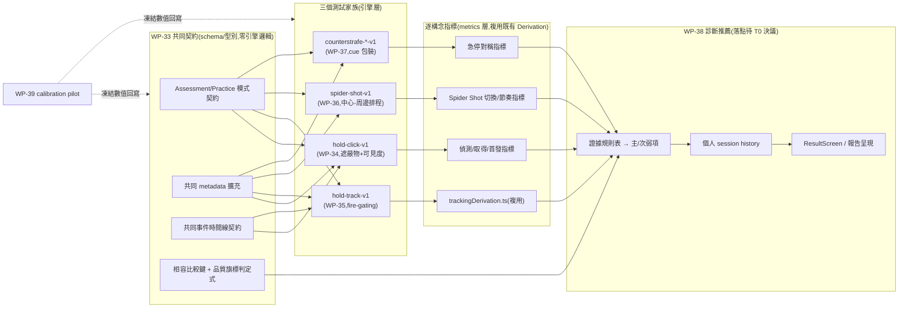

# 階段 F(stage6)執行計畫 — 個人瞄準能力測試框架 v1(架槍挑戰 / Spider Shot / 急停測試 + 診斷推薦 + 縱向追蹤)

> stage6 頂層索引 + tech spec。🟡 **已採納規劃(2026-08-19,GD-22)**;原案 [`active/stage6/aim-assessment-framework-v1.md`](aim-assessment-framework-v1.md)(2026-08-19 提案)為需求 source of truth,本檔為拆解後的執行計畫。
> 整合輸入:框架 v1 草稿(三測試家族 + 共同契約 + 診斷推薦層)+ 讀碼對帳(2026-08-19,見 §0.1)。
> 格式沿用 [exec-plan/README.md](../../README.md)(每 WP 一個自足子資料夾;task = 垂直切片 = 原子 commit)。文件語言:繁體中文,術語保留英文(D4)。
> **本階段狀態**:規劃已拍板(WP 編號/里程碑/交付順序);**WP-33 ✅ 完成**(`wp-33-assessment-contract/`,T0~T3+T-exit 全數完成 2026-08-19,契約定稿於 [`docs/operational/analysis-assessment-contract.md`](../../operational/analysis-assessment-contract.md),開放 WP-34~37 entry);**WP-34 ✅ 完成**(`wp-34-hold-click-visibility/`,T0~T3+T-exit 全數完成 2026-08-19——候選②(scene 層封閉幾何離線解析)+ occlusion-aware `validateClearance` 政策選項①落地,`hold-click-v1` 協定與 `analysis-visibility.md` 契約定稿,開放 WP-35 entry;見 §6 WP-34 與 [wp-34 progress.md](wp-34-hold-click-visibility/progress.md))。

| | |
|---|---|
| **交付範圍** | 個人瞄準能力測試框架 v1:架槍挑戰(`hold-click-v1`/`hold-track-v1`)+ Spider Shot(`spider-shot-v1`)+ 急停測試(`counterstrafe-cued-v1`/`-reversal-v1`/`-free-v1`)三個測試家族;共同 Assessment/Practice 契約 + 事件時間線 + metadata;診斷規則引擎 + 版本化推薦 + 個人 session history;calibration pilot 工具 + `protocolVersion = 1.0.0` 凍結發布。**首版只服務 CS movement profile**;VALORANT 等其他 profile 明確排除(見 §2.1)。 |
| **上游門檻** | M4 ✅(schema v2)+ WP-19 ✅(場景系統,GD-6 邊界)+ WP-21 ✅(seeded spawn + `t_detect` 偵測推導)+ WP-23 ✅(hitbox 單一來源,GD-7)+ WP-18 ✅(`trackingDerivation.ts` 追蹤指標);stage4(WP-28~32)非硬相依,但 WP-38 的報告呈現紀律(n/flags/version/效度層級)沿用其先例 |
| **技術棧** | 全部落在既有 TS 引擎棧(`src/drill`/`src/sim`/`src/scene`/`src/metrics`/`src/ui`);**不預設**新增 Python 層——WP-38 是否比照 stage4 走 `research/` 離線分析或留在 TS 即時結果頁,列為 T0 待決(OQ-S6-8) |
| **估時** | 16–23 dev-days(WP-33~39;WP-34 已由 T0 spike 下修為 2.5–3.5d,見 §6) |
| **狀態** | 🟡 **規劃已採納(2026-08-19,GD-22)**:WP 編號 WP-33~39、里程碑 M16、交付順序拍板。**WP-33 ✅ 完成**(2026-08-19,T0~T-exit 全數完成,契約定稿,開放 WP-34~37 entry);**WP-34 ✅ 完成**(2026-08-19,T0~T3+T-exit 全數完成,可見度時間線 + occlusion-aware clearance + `hold-click-v1` 落地,`analysis-visibility.md` 定稿,開放 WP-35 entry)。**下一步**:WP-35~37 T0 entry-gate 可展開。 |

---

## 0. 輸入現況

### 0.0 優先序決議 → WP 映射

> 排序原則沿用框架 v1 §"建議交付順序"(7 步)。核心邏輯:**先凍結全部三家族共用的契約,再依「複用既有引擎能力的程度」由低風險到高風險展開,診斷與 pilot 放最後**——因為診斷規則需要三家族的真實指標分佈才能校準,pilot 需要全部協定骨架就緒才能探索數值範圍。

| 順序 | 項目 | 排序理由 | 落點 |
|---|---|---|---|
| 1 | 共同 Assessment/Practice 契約 + metadata + 事件時間線 + 品質旗標 | 三個測試家族與診斷層全部依賴這組契約;不先凍結,後面每個 WP 都可能各自造一套(重蹈 C-D4 覆轍) | WP-33 |
| 2 | `hold-click-v1` + 遮蔽物可見度時間線 | 全框架**唯一需要新引擎能力**(render/scene 層連續可見度計算)的項目,風險最高、最可能像 WP-32 一樣讀碼後發現隱藏成本——**故排最前,愈早驗證可行性,後面排程愈不會被打亂** | WP-34 |
| 3 | `hold-track-v1` | 複用 WP-34 的 emergence/exposure 機制 + 既有 `trackingDerivation.ts`,是全框架**唯二**跨 WP 直接相依的組合之一 | WP-35 |
| 4 | `spider-shot-v1` | 複用 WP-21 的 seeded polar spawn 骨架,只需新增「單目標存在」約束與「中心—周邊」排程,與 WP-34/35 無檔案熱區重疊,可並行 | WP-36 |
| 5 | 急停三協定包裝 | 複用 WP-5/WP-23 既有 counter-strafe 玩法核心,主要是新增 cue UI + Assessment/Practice 包裝,工程風險最低,可與 WP-34~36 並行 | WP-37 |
| 6 | 診斷推薦引擎 + session history | 需要三個家族**都有真實指標輸出**才能校準證據規則表與呈現版面,故排在三家族之後 | WP-38 |
| 7 | Calibration pilot + `protocolVersion` 凍結 | 數值凍結(可見度門檻/世界距離/角距角尺寸/樣本數)是全部協定骨架就緒後才有意義的最後一步 | WP-39 |

### 0.1 讀碼對帳(2026-08-19):框架草稿假設 vs 現況

| # | 草稿假設 | 現況(讀碼發現) | 對計畫的影響 |
|---|---|---|---|
| 0-1 | 「架槍挑戰需要遮蔽物 + 漸進可見度」隱含為既有能力的延伸 | `events` 目前只有**二元** `visible`(WP-21 pop-in,出現即整顆可見);場景幾何(`propBounds`/GLTF)依 **GD-6** 硬約束**永不進 sim runtime**,只能被 render/scene validation 層讀取 | `visibleFraction(t)` 連續可見度是**全新**能力,必須設計成「render/scene 層計算 → 匯出成 data 層可消費的訊號」,不能像 `t_visible` 一樣直接是 sim tick 時間戳。**這是 WP-34 需要獨立 T0 spike 的根本原因** |
| 0-2 | `hold-track-v1` 的「移動期間鎖開火」是既有機制 | 現有 `DrillConfig.timing.presentationMs`(WP-18)只管「呈現時長到期→撤除+補生」,**不鎖 fire**;`peekTimeoutMs` 也只管撤除,同樣不碰開火權限 | 需新增一個獨立的 fire-gating 語意(而非重用 `presentationMs`),且要確認落在 input/weapon-fire 層而非 sim 狀態層,避免違反「sim 只讀 config,不讀場景/UI 意圖」的既有分層慣例 |
| 0-3 | Spider Shot 的「中心—周邊」排程可視為 L/R 交替序列的變形 | `DrillConfig.sequence` 現況只有 `alternation: 'LR' \| 'RL'` 兩態序列;無「回中心」或「單目標存在」的排程原語 | Spider Shot 需要新的排程資料結構(非改寫既有 `alternation`,避免動到 L/R 交替既有語意——沿用 C-D4 精神:既有序列語意不得被新排程污染) |
| 0-4 | 診斷/推薦層的「結果呈現」單一落點 | 現有兩個呈現接縫地位不對等:`ResultScreen.ts`(純 TS + DOM,單次 drill 即時結果)與 `research/src/report/coach_report.py`(stage4 offline 教練報告,Python,跨 drill/條件分層)。框架 v1 需要的「個人歷史 + 相容比較 + 版本化推薦」更接近後者的形狀 | WP-38 的落點(TS 即時 vs Python offline)**未定案**,直接影響是否要複用 stage4 的 `research/` 四目錄制與 C-D1~C-D4 紀律——**列為 OQ-S6-8,WP-38 T0 拍板** |

### 0.2 編號分配

| 草稿項目 | 採納後 | 里程碑 |
|---|---|---|
| 共同契約 | **WP-33** | — |
| 架槍 `hold-click-v1` + 可見度 | **WP-34** | — |
| 架槍 `hold-track-v1` | **WP-35** | — |
| Spider Shot `spider-shot-v1` | **WP-36** | — |
| 急停三協定包裝 | **WP-37** | — |
| 診斷推薦引擎 | **WP-38** | — |
| Calibration pilot + 凍結 | **WP-39** | **M16**(stage6 交付) |

> 依 [DECISIONS.md](../../DECISIONS.md) GD-15「先採納先得」的既有慣例,本階段字母標籤取下一個未用字母 **F**(A=stage1、B=stage2、C=stage3、D=stage4、E=stage5)。

---

## 1. 需求(Requirements)

### 1.1 Functional Requirements

| # | 需求(系統必須…) | 映射 |
|---|---|---|
| FR-F1 | Assessment/Practice 模式分離契約:難度(block 內固定 vs block 間可調)、隨機性(seed/schedule 留存 vs 可用新 seed)、即時回饋(最小化 vs 可顯示)、歷史比較(可進 vs 預設不進)、重試(不因失誤重抽 vs 可快速重來)五軸皆可由 config 宣告 | WP-33 |
| FR-F2 | 共同 metadata 擴充:`protocolVersion`、`recommendationVersion`、`gameMovementProfile`(首版固定 `cs2-source`)、`assessmentFeedbackPolicy`、`qualityGateStatus`;`participantId`/`sessionId` 沿用既有 `meta.session`(WP-20)不重新定義 | WP-33 |
| FR-F3 | 共同事件時間線契約凍結(僅語意,不含 WP-34 引擎實作):`cue → foreperiod → t_first_visible → t_measurement_onset → detect → on_target → target_stop → fire → outcome`;同名事件跨任務不得有不同語意(C-D4 精神延伸) | WP-33 |
| FR-F4 | 相容比較鍵判定式:`participantId + taskId+protocolVersion + gameMovementProfile + weaponId+mode + sensitivity/FOV + 條件格 + feedbackPolicy + qualityGateStatus` 全部相容才可比較;品質旗標(`n` 不足 / 協定不相容)觸發時**不得**輸出能力升降或處方結論 | WP-33 |
| FR-F5 | 遮蔽物幾何 + render/scene 層連續可見度時間線:`t_first_visible`(幾何首次可見)、`visibleFraction(t)`(逐 tick 投影可見比例或可重建等價資料)、`t_measurement_onset`(達凍結可見門檻)、`t_full_exposure`;**場景幾何不得進 sim runtime**(GD-6),訊號須由 render/scene 層產生後匯出供 metrics 層離線消費 | WP-34 |
| FR-F6 | `hold-click-v1`:目標出現後允許立即開火;構念 = 預瞄偏差、`t_detect − t_measurement_onset`、取得(`t_first_on_target − t_detect`,overshoot/undershoot)、首發(`t_fire − t_first_on_target`,首發命中,開火角度偏差) | WP-34 |
| FR-F7 | `hold-track-v1`:目標移動期間鎖開火,`target_stop` 或停止提示後才解鎖首發;固定移動窗口作為短暫追蹤指標基礎(TOT%/RMS/median/P95 angular error,複用 `trackingDerivation.ts`),避免反應快者因提早擊殺而天然獲得較短追蹤窗 | WP-35 |
| FR-F8 | `spider-shot-v1`:同時最多一個可命中目標;命中中心後下一目標依 seeded polar schedule 出現在周邊,命中周邊後固定回中心;Assessment 使用固定 `D_deg × W_deg` 條件格版本 | WP-36 |
| FR-F9 | Spider Shot 指標:切換反應(視覺—動作代理值)、移動執行(movement time/峰值角速度)、停止控制(overshoot/逸出/微調)、首發(命中/角度偏差)、節奏(transition interval 分布) | WP-36 |
| FR-F10 | `counterstrafe-cued-v1`:系統提示 A/D,玩家依提示完成 peek + 反向制動 + 首發(標準 Assessment 主協定,起始方向與提示時間可精確記錄) | WP-37 |
| FR-F11 | `counterstrafe-reversal-v1`:提示方向按住達固定持續時間 → 收到反向提示 → 執行反向輸入,隔離制動能力與反向輸入 timing | WP-37 |
| FR-F12 | `counterstrafe-free-v1`:玩家自訂 peek 節奏與開火時機,**僅供 Practice**,不進正式進步判定 | WP-37 |
| FR-F13 | 急停共同指標:輸入反應(cue-to-key/release latency/counter-input latency)、制動(time-to-accuracy-gate/zero crossing/停止距離/過度反向量)、射擊同步(fire alignment/residual speed/門檻前開火率)、首發、L/R 對稱(各自 `n`/分布/差值) | WP-37 |
| FR-F14 | 診斷規則引擎:每 Assessment session 最多輸出一個主要限制 + 一個次要限制,附來源指標/`n`/flags/相容條件;規則表版本化(`recommendationVersion`),門檻變更須升版並保存舊規則 | WP-38 |
| FR-F15 | 相容比較鍵複測判定 + 個人 session history:同 session 摘要(非 trial 數)為縱向單位,顯示最近固定窗口 session 中位數與變異,同時呈現能力與 speed–accuracy trade-off | WP-38 |
| FR-F16 | 結果呈現整合:每個晉升/呈現的指標必須帶來源/`n`/flags/版本;樣本不足或品質不合格顯示「資料不足」,不顯示進步/退步箭頭(沿用 stage4 C-D3 精神) | WP-38 |
| FR-F17 | Calibration pilot 工具:支援近/中/遠世界距離、可見門檻候選值、架槍速度/露出距離、Spider Shot `D_deg`/`W_deg` 範圍的參數化探索;pilot 資料**不進**正式歷史 | WP-39 |
| FR-F18 | 協定凍結程序 + `protocolVersion = 1.0.0` 發布:pilot 結束後先凍結協定與分析規則再收正式 baseline;驗收清單 F 全項通過 | WP-39 |

### 1.2 Non-functional Requirements

| 類別 | 量化需求 |
|---|---|
| 決定性 | 三個測試家族的 seed/schedule 全數保存;同一輸入序列在不同 render FPS 下 sim 狀態逐 tick 一致(ADR-2 精神),不斷言 wall-clock 時間戳 |
| 效度 | Assessment 協定的凍結參數(可見門檻/條件格/gate 門檻)**pre-registered**,凍結後不得為了讓資料好看而事後調整(沿用 GD-5/GD-8/GD-20 pre-registration 紀律) |
| 純度(引擎邊界) | `src/sim`、`SharedState`、`HitDetector`、`TargetManager` 不得引用任何場景資料(GD-6);可見度計算與判定式全部落在 render/scene validation 或 metrics/離線層 |
| 單一來源 | 目標 hitbox 沿用 `DrillConfig.targets.hitbox?` 單一來源(GD-7),Spider Shot 的 `W_deg` 由同一 hitbox 換算,不得新增第二套尺寸常數 |
| 授權 | FPSci 紅線不變(GD-11):方法學可參考,程式碼/config 不得複製 |
| 工具鏈 | 不預設新增 Python 依賴;若 WP-38 T0 決議需要 offline 分析層,比照 stage4 的 C-D1(單向隔離)+ 獨立閘(不進 `npm run test:ci`) |
| 文件語言 | 繁體中文,術語保留英文(D4);新術語(如 `visibleFraction`、`t_measurement_onset`、`spider-shot-v1`)於各 WP T-exit 回寫 [CONTEXT.md](../../../../CONTEXT.md) |

### 1.3 Constraints(硬約束;沿用 CLAUDE.md §4,不逐條重抄)

- **GD-6**:場景幾何永不進 sim runtime;`propBounds`/GLTF/場景 collision 只可被 render/scene validation 層讀取。WP-34 的可見度計算是本階段唯一直接觸碰此邊界的項目,T0 spike 的首要任務就是驗證「連續可見度訊號」能否在不違反此邊界的前提下產生。
- **GD-7**:目標 hitbox 單一來源(`DrillConfig.targets.hitbox?` / `meta.targets.hitbox`);Spider Shot 的 `W_deg`、架槍的命中判定必須共用此來源,不得新增另一套尺寸常數。
- **GD-11**:FPSci(NVlabs,CC BY-NC-SA 4.0)紅線——方法學可參考,程式碼/config 禁止複製進本 repo。
- **GD-5 / GD-8 / GD-20 精神延伸**:任何 Assessment 協定的凍結參數(可見門檻、gate 門檻、條件格)必須 pre-registered,WP-39 pilot 凍結後不得事後調整;未通過構念驗證的診斷結論不得進結果呈現(比照 C-D3 紅線)。
- 禁 `Date.now()`(量測時鐘域 = `performance.now()`);決定性契約(同輸入序列跨 render FPS 下 sim 狀態一致)全程適用。

---

## 2. 系統設計(Technical Design)

### 2.1 System boundary

**In scope**:`src/drill/`(新增 Assessment/Practice 協定 schema)· `src/sim/TargetManager.ts` + `src/state/types.ts`(Spider Shot 排程、hold-track fire-gating 接縫)· `src/scene/`(遮蔽物幾何 + 可見度計算,WP-34)· `src/metrics/`(新增偵測/追蹤/急停/Spider Shot 逐構念指標,複用既有 `*Derivation.ts`)· `src/ui/`(cue 提示 UI、`ResultScreen.ts` 擴充)· `src/data/`(metadata additive 欄位:`protocolVersion`/`recommendationVersion`/`gameMovementProfile` 等)· 診斷規則引擎(落點 TS 或 Python 待 WP-38 T0 決議)· `docs/operational/acceptance-stage-f.md`(新,驗收清單 F)。

**Out of scope**(附觸發條件):

- **VALORANT 或其他 `gameMovementProfile`**:觸發 = 明確委託新增第二套移動模型 profile;新 profile 走獨立版本與獨立歷史曲線,不回寫 CS 歷史。
- **跨玩家排名 / 單一總分**:框架 v1 明文不做(§"明確不做"),三個測試家族與各構念永不合成跨構念總分。
- **Practice 模式的自適應難度演算法**(即時 cue、連擊、弱側加量的智慧化調參):v1 只需要 config 層級可調,不需要自適應演算法;觸發 = 教練工作流明確要求自動調參。
- **跨 session/選手縱貫資料庫**(多選手比較儀表板):觸發 = 累積 ≥ 3 選手且有明確教練工作流需求(沿用 stage4 GD-20 P3 同類觸發條件)。
- **`counterstrafe-free-v1` 的正式進步判定**:明文只用於 Practice 與技術觀察。

### 2.2 資料流



### 2.3 關鍵設計決策

#### (a) 可見度時間線的計算邊界(GD-6 延伸,WP-34 核心決策)

`t_first_visible`/`visibleFraction(t)`/`t_measurement_onset` 需要場景幾何才能算,但場景幾何依 GD-6 不得進 sim runtime。候選方案(WP-34 T0 spike 需逐一評估成本):

1. **Render 層逐幀投影/raycast**,再降頻取樣寫入一條 data 層可消費的訊號(類比 WP-20 的 frame-time log 模式:render 產生,data 層記錄,sim 不參與)。
2. **Scene validation 層離線幾何解析**(類比 `clearance.ts` 淨空驗證的作法):在已知目標軌跡與遮蔽物包絡的前提下,用封閉幾何公式而非逐幀 raycast 算出可見度曲線。
3. **兩者混合**:即時只記錄少量錨點事件(`t_first_visible`/`t_full_exposure`),`visibleFraction(t)` 的連續曲線交給離線 metrics 層用已知幾何重建(類似 WP-21 的 `t_detect` 離線推導模式)。

T0 spike 的 DoD 是從三個候選中選一個並記錄成本比較,而不是預先假設某一個可行。

#### (b) hold-track 的 fire-gating 不進 sim 狀態機

鎖 fire / 解鎖是「這個 tick 是否接受開火輸入」的**判定**,不是 sim 的物理狀態;沿用既有分層慣例(`DrillConfig` 是資料,`TargetManager`/`WeaponConfig` 消費資料),新欄位應該落在 drill 生命週期判定層(類似 `peekTimeoutMs` 的角色),而不是新增 sim 內部狀態變數。細節留給 WP-35 T0。

#### (c) Spider Shot 排程與既有 L/R 交替序列並存,不互相污染(C-D4 精神延伸)

`DrillConfig.sequence.alternation` 的既有語意(L/R 交替)服務架槍與急停;Spider Shot 需要「單目標 + 中心—周邊往返」全新排程原語,**必須是新的可辨識欄位**(例如條件式 discriminated union),不得修改 `alternation` 既有型別使其同時承載兩種語意。

#### (d) 診斷推薦引擎落點(OQ-S6-8,WP-38 T0 拍板)

兩個候選:① 留在 TS(`ResultScreen.ts`/`MetricsDashboard`),即時單次 drill 結果 + 讀取歷史匯出做 session history;② 比照 stage4 走 `research/` 離線 Python 層,複用 C-D1~C-D4 隔離紀律與 golden parity 機制。判斷依據:個人 session history 需要跨多次匯出聚合與規則版本化管理,這個形狀更接近 stage4 已驗證的 offline 報告模式;但若團隊希望「訓練當下就看到診斷」,TS 即時路徑更合適。T0 需要讀碼(`ResultScreen.ts` 現有擴充空間 + `coach_report.py` 現有聚合能力)後才能拍板,不在本階段 README 預先假設。

### 2.4 Failure modes

| 觸發 | 影響 | 處理 |
|---|---|---|
| 可見度計算方案(2.3a)三個候選都無法在合理成本內達到「連續可見度」精度 | `hold-click-v1` 的核心構念(預瞄/反應)無法可靠量測,M16 可能需要降級交付 | WP-34 T0 spike 明文允許「降級為離散可見度階梯(如 25%/50%/75%/100%)」作為 fallback,並記錄降級理由與對效度聲稱的限制,不得隱藏 |
| Spider Shot 新排程原語與既有 `alternation` 序列在 `TargetManager.reset(seq)` 產生耦合 bug | 既有 counter-strafe/架槍 drill 決定性回歸可能被污染 | WP-36 T0 DoD 首項 = 既有決定性回歸測試**零修改**全綠;新排程走獨立分支,不共用既有序列推進邏輯 |
| 診斷規則表在只有少量真實 session 時就被拿來對選手下結論 | 教練依不穩證據改動訓練處方(重蹈 stage4 C-D3 要防的錯誤) | FR-F16/§1.3:未達品質閘(`n`/相容鍵)一律顯示「資料不足」,規則表版本化且門檻 pre-registered,凍結後不得因單一難看的 session 而放寬 |
| WP-38 選擇 Python offline 路徑但引擎側事件時間線(WP-33)欄位命名/單位與既有 TS 構念(`t_detect`/ε(t))有差異 | 重蹈 GD-19 發現的「雙實作分裂」風險 | WP-33 T0 明文引用 C-D4(既有構念禁第二定義);WP-38 若選 Python 路徑,新構念一律走 stage4 已驗證的雙向 parity 機制,不得另起爐灶 |
| `protocolVersion`/`recommendationVersion` 在 pilot 期間被多次原地修改 | 破壞「同版本才可比較」的相容鍵語意,已收集的 pilot 資料失去可追溯性 | WP-33 FR-F1/FR-F4 的判定式把版本號當硬相容欄位;WP-39 明文「pilot 與正式版本分開保存」(框架 v1 §"pilot 參數與正式 v1 參數分開保存") |

### 2.5 Concurrency model

**N/A(沿用既有單 rAF 超級迴圈,ADR-2)**。本階段不新增背景執行緒或非同步 pipeline;WP-34 的可見度計算若走 render 層逐幀方案,仍在既有 render loop 內同步執行,不新增 worker/併發語意。若 WP-38 走 Python offline 路徑,沿用 stage4 §2.7 的「單程序批次」模型,不做變更。

---

## 3. WP 索引(⬜ 未開始 · 🟡 進行中 · ✅ 完成)

> 每 WP 一個自足子資料夾(`README.md` + `task-checklist.md` + `progress.md` + `T0` → `Tn` → `T-exit`)。編號分配見 [DECISIONS.md](../../DECISIONS.md) **GD-22**。

| WP | 子資料夾 | 目標 | 優先序 | 里程碑 | 相依 | 估時 | 狀態 |
|---|---|---|---|---|---|---|---|
| **WP-33** | [`wp-33-assessment-contract/`](wp-33-assessment-contract/README.md) | 共同契約:Assessment/Practice 模式分離 + metadata 擴充 + 事件時間線契約 + 相容比較鍵/品質旗標判定式 | 1 | — | M4 ✅ + WP-20 ✅(`meta.session`) | 2–3d | ✅ |
| **WP-34** | [`wp-34-hold-click-visibility/`](wp-34-hold-click-visibility/README.md) | 架槍 `hold-click-v1` + 遮蔽物可見度時間線(T0~T-exit ✅ 全數完成,候選②落地) | 2 | — | WP-33;T0 spike 已提前於 WP-33 T-exit 前執行完成 | 2.5–3.5d(T0 spike 後下修,不拆分) | ✅ |
| **WP-35** | [`wp-35-hold-track/`](wp-35-hold-track/README.md) | 架槍 `hold-track-v1`:移動期間鎖 fire、停止後解鎖、追蹤窗指標 | 3 | — | WP-34(共用 emergence 機制) | 2–3d | 🟡 執行計畫已展開(讀碼對帳完成;T0 待開工) |
| **WP-36** | [`wp-36-spider-shot/`](wp-36-spider-shot/README.md) | Spider Shot `spider-shot-v1`:單目標約束 + 中心—周邊 seeded 排程 + 五類指標(讀碼對帳完成;T0 待開工) | 4 | — | WP-33 ✅(可與 WP-34/35 並行) | 2.5–3.5d | 🟡 執行計畫已展開 |
| **WP-37** | `wp-37-counterstrafe-protocols/`(⬜ 待建立) | 急停三協定包裝(`cued`/`reversal`/`free`)+ L/R 對稱指標 | 5 | — | WP-33(可並行) | 2–3d | ⬜ |
| **WP-38** | `wp-38-diagnosis-recommendation/`(⬜ 待建立) | 診斷規則引擎 + 版本化推薦 + 個人 session history + 結果呈現整合 | 6 | — | WP-34+35+36+37 全部產出逐構念指標 | 3–4d | ⬜ |
| **WP-39** | `wp-39-calibration-freeze/`(⬜ 待建立) | Calibration pilot 工具 + 數值凍結 + `protocolVersion = 1.0.0` + 驗收清單 F | 7 | **M16** | 全部 | 2–3d | ⬜ |

**合計估時**:16–23 dev-days(WP-34 已由 T0 spike 定案為 2.5–3.5d,不需要拆分成兩個 WP;見 [wp-34 progress.md D-34.1/D-34.2](wp-34-hold-click-visibility/progress.md))。

---

## 4. 里程碑門控

| 里程碑 | 完成條件(可機械判定) | 對應 WP | 意義 |
|---|---|---|---|
| **M16**(stage6 交付) | 驗收清單 F 全項通過(`docs/operational/acceptance-stage-f.md`,WP-39 T-exit 建立):三家族同名事件時間語意一致、相容比較鍵判定式綠、`hold-click`/`hold-track` 不互相宣稱對方構念、Spider Shot 每次 transition 保存方向/角距/角尺寸、急停三子協定不共用未分層總分、Assessment/Practice 不共用正式 baseline、結果呈現對每個診斷顯示來源指標/`n`/flags/版本、不相容 session 不產生進步/退步結論、pilot 參數與正式參數分開保存、所有新指標先過既有 validity/quality gate 才進推薦規則 | WP-39 | 個人瞄準能力測試框架 v1 pilot-ready:可用同一套契約診斷選手在架槍/Spider Shot/急停三個構念面的主要弱項,並在相容條件下追蹤個人進步 |

---

## 5. 相依圖(關鍵路徑)

```
WP-33(共同契約)──┬─────────────→ WP-34(hold-click + 可見度,T0 spike 優先跑)──→ WP-35(hold-track)──┐
                  ├─────────────→ WP-36(spider-shot)─────────────────────────────────────────────┼→ WP-38(診斷/推薦)──→ WP-39(pilot + M16 凍結)
                  └─────────────→ WP-37(急停三協定包裝)──────────────────────────────────────────┘
```

- WP-34/35/36/37 四線在 WP-33 之後可並行(檔案熱區:34/35 動 `src/scene` + drill 生命週期;36 動 drill 排程;37 主要動 UI/cue + 既有 sim 讀取,彼此不重疊)。
- **WP-34 的 T0 讀碼 spike 是唯一例外**:因為是零程式碼的可行性調查(不寫入 `DrillConfig`/`TargetManager` 任何新欄位),可以在 WP-33 完成前先跑,盡早暴露風險、避免排程被打亂到後段才發現。**已於 2026-08-19 完成**:候選②(scene 層封閉幾何離線解析)拍板,不需要拆分 WP,詳見 [wp-34 progress.md](wp-34-hold-click-visibility/progress.md)。
- **M16 未過不宣告 stage6 交付**;WP-38 entry 前必須四個測試家族 WP(34/35/36/37)皆 T-exit ✅。

---

## 6. 任務拆解(初稿;各 WP T0 執行時依讀碼結果回寫偏離,沿用 stage4 D-30.0/D-31.0/D-32.0 先例)

### WP-33 assessment-contract(優先序 1;2–3d)

| Task | Scope | Definition of Done | Risk |
|---|---|---|---|
| **T0 entry-gate** | 驗上游(M4/WP-20)exit;凍結 Assessment/Practice 五軸契約(難度/隨機性/回饋/歷史比較/重試) | 契約表逐軸寫入 `docs/operational/analysis-assessment-contract.md`(新);零程式碼 | Low |
| **T1** | 共同 metadata 型別擴充(additive):`protocolVersion`/`recommendationVersion`/`gameMovementProfile`/`assessmentFeedbackPolicy`/`qualityGateStatus` | 既有匯出決定性 baseline 零重錄;新欄位 additive 單元測試綠;`schema.md` 對帳 | Low |
| **T2** | 共同事件時間線契約凍結(型別/命名,不含 WP-34 引擎實作):`t_measurement_onset`/`visibleFraction`/`t_full_exposure` 欄位形狀 | 型別定義 + 單元測試(欄位存在性/預設省略語意);與既有 `t_visible`/`t_detect` 命名不衝突的斷言 | Low |
| **T3** | 相容比較鍵判定式 + 品質旗標(`n` 不足/協定不相容 → 阻擋結論輸出) | 純函式 `checkCompatibility()`/`checkQualityGate()` 單元測試綠(含正例/反例) | Low |
| **T-exit** | 契約文件定稿 + 三家族 WP 可安全引用 | `docs/operational/analysis-assessment-contract.md` 定稿;`npm run test:ci` exit 0 | — |

### WP-34 hold-click-visibility(優先序 2;2.5–3.5d;**✅ 全數完成,見下方偏離說明**)

> **與規劃稿的偏離**(2026-08-19 T0 spike 落地回寫,比照 stage4 D-30.0/D-31.0/D-32.0 的先例格式):原規劃因「架槍可見度時間線是全框架唯一觸碰 GD-6 邊界的新能力」把估時定為浮動的 3–5d 並保留拆分成兩個 WP 的選項。T0 讀碼後發現候選②(scene 層封閉幾何離線解析)所需的四個關鍵元件——`segmentIntersectsAabb()`([clearance.ts](../../../../src/scene/clearance.ts))、`eyeOriginForTick()`([eyeOrigin.ts](../../../../src/metrics/eyeOrigin.ts))、`TickRecord.tx/ty/tz`、`SceneConfig.propBounds` + 程序化視覺方塊生成管線——**皆已存在**,候選①(render 逐幀 raycast)因決定性風險被直接排除(非三選一)。真正新增的工程量只有一個離線衍生模組 + 一個 clearance 政策決策(occlusion-aware 驗證模式,選項①:曝光後子路徑零遮蔽,emergence 前允許指定 propBounds 遮蔽,使用者 2026-08-19 拍板)+ 新場景內容 + 協定組裝。故估時下修為 2.5–3.5d,**不拆分 WP**。理由與 alternatives considered 詳見 [wp-34 progress.md D-34.1/D-34.2](wp-34-hold-click-visibility/progress.md)。

| Task | Scope | Definition of Done | Risk |
|---|---|---|---|
| **T0 讀碼 spike** ✅ | 零程式碼:評估三個可見度計算候選方案的成本;occlusion-aware clearance 政策三選一 | ✅ 完成(2026-08-19):候選②拍板(候選①因決定性風險排除)、政策選項①拍板、task 切分定案(不拆分),詳見 [wp-34 progress.md](wp-34-hold-click-visibility/progress.md) D-34.1/D-34.2 | — |
| **T1** | `src/metrics/visibilityDerivation.ts`:`visibleFraction`/`tFirstVisible`/`tMeasurementOnset`/`tFullExposure`(離線純函式,組合既有元件)+ 合成 fixture | 合成 fixture(全遮蔽/全曝光/部分遮蔽/邊緣掠過遮蔽物角落)綠;不 import `src/render/`/`src/sim/` | Med |
| **T2** ✅ | Occlusion-aware `validateClearance`(additive `ClearanceOptions`)+ 新 `peek-corridor` occlusion 場景(程序化牆,零新資產授權疑慮) | ✅ 完成:既有 `clearance.test.ts` 零修改全綠;新場景通過 occlusion-aware 驗證(emergence 前遮蔽成立 + 曝光後零遮蔽成立) | Med |
| **T3** ✅ | `hold-click-v1` 協定 config + 預瞄/反應/取得/首發指標(複用既有 `detectionDerivation.ts`/`trackingDerivation.ts`/`compute.ts`,不重推) | ✅ 完成:端到端合成 drill 測試綠;`anticipation` flag 正確標記提早開火;不重新定義任何既有構念 | Low |
| **T-exit** ✅ | 驗收:可見度時間線可重建、`hold-click` 不宣稱獨立 tracking 能力(框架 v1 驗收條件);`analysis-visibility.md` 定稿 | ✅ 完成:`npm run test:ci` 的 Vitest/typecheck 全綠(見 [wp-34 progress.md](wp-34-hold-click-visibility/progress.md));Playwright 既有 app-ready flake 與本 WP 無關(S-34.3/S-34.4/S-34.5) | — |

### WP-35 hold-track(優先序 3;entry = WP-34 T-exit;2–3d)

| Task | Scope | Definition of Done | Risk |
|---|---|---|---|
| **T0 entry-gate** | 驗 WP-34 exit;讀 `DrillConfig.timing`(`presentationMs`/`peekTimeoutMs`)確認 fire-gating 落點不衝突既有語意 | 落點決策記 progress;零程式碼 | Low |
| **T1** | Fire-gating:移動期間鎖 fire、`target_stop`/停止提示後解鎖 | 單元測試(鎖定中拒絕 fire / 解鎖後接受 fire)綠;既有 `hold-click` 決定性回歸零修改全綠 | Med |
| **T2** | 追蹤窗指標:複用 `trackingDerivation.ts` 的 TOT%/RMS/median/P95,固定移動窗口不受提早擊殺影響 | 合成 fixture(提早/準時/逾時三案例)驗證窗口長度不因擊殺時間改變 | Med |
| **T-exit** | 驗收:`hold-track` 追蹤窗不因提早擊殺而縮短(框架 v1 驗收條件) | `npm run test:ci` exit 0 | — |

### WP-36 spider-shot(優先序 4;entry = WP-33 T-exit;2.5–3.5d)

| Task | Scope | Definition of Done | Risk |
|---|---|---|---|
| **T0 entry-gate** | 驗 WP-33 exit;確認新排程原語與既有 `sequence.alternation` 不耦合(§2.3c) | 型別設計(discriminated union)記 progress | Low |
| **T1** | 單目標存在約束 + 中心—周邊 seeded polar schedule | 單元測試:任一時刻場上恰有一個可命中目標;seed 相同 → 排程逐位相同 | Med |
| **T2** | 條件格:`D_deg`/`W_deg`(換算自 GD-7 單一 hitbox 來源)+ 象限/距離標記,每次 transition 記錄 | 單元測試對表(座標→角度換算)+ 既有 hitbox 決定性零修改全綠 | Med |
| **T3** | 五類指標:切換反應/移動執行/停止控制/首發/節奏 | 合成 fixture 驗證各指標計算;真實資料人工檢核 | Med |
| **T-exit** | 驗收:每次 transition 保存方向/角距/角尺寸(框架 v1 驗收條件) | `npm run test:ci` exit 0 | — |

### WP-37 counterstrafe-protocols(優先序 5;entry = WP-33 T-exit;2–3d)

| Task | Scope | Definition of Done | Risk |
|---|---|---|---|
| **T0 entry-gate** | 驗 WP-33 exit;盤點 WP-5/WP-23 既有 counter-strafe 機制可直接複用的部分 | 複用清單記 progress | Low |
| **T1** | `counterstrafe-cued-v1`:方向 + timing 提示 UI + 記錄 | 單元測試(提示時間戳/方向記錄)綠 | Low |
| **T2** | `counterstrafe-reversal-v1`:持續按住 → 反向提示 → 反向輸入判定 | 單元測試(正常/過早/過晚反向案例)綠 | Med |
| **T3** | `counterstrafe-free-v1`(Practice only)+ L/R 對稱指標(三協定共用) | Practice 模式不寫入正式歷史的斷言;對稱指標各側 `n`/分布輸出 | Low |
| **T-exit** | 驗收:三子協定不共用未分層總分(框架 v1 驗收條件) | `npm run test:ci` exit 0 | — |

### WP-38 diagnosis-recommendation(優先序 6;entry = WP-34+35+36+37 T-exit;3–4d)

| Task | Scope | Definition of Done | Risk |
|---|---|---|---|
| **T0 entry-gate** | **拍板 OQ-S6-8**(落點 TS vs Python,見 §2.3d);驗四個上游 WP exit;讀 `ResultScreen.ts`/`coach_report.py` 現有擴充能力 | 落點決策 + 理由記 [DECISIONS.md](../../DECISIONS.md)(若跨界影響大則升 GD) | Med |
| **T1** | 證據規則表 → 主/次弱項標籤,版本化 `recommendationVersion` | 規則表單元測試(各證據模式 → 對應標籤)綠;門檻凍結記錄 | Med |
| **T2** | 相容比較鍵複測判定 + 個人 session history 視圖 | 不相容 session 不產生結論的單元測試;history 視圖顯示中位數 + 變異 | Med |
| **T3** | 結果呈現整合(依 T0 落點,TS `ResultScreen` 或 Python 報告) | 每指標帶來源/`n`/flags/版本;資料不足顯示「資料不足」而非箭頭 | Med |
| **T-exit** | 驗收:結果呈現對每個診斷顯示來源指標/`n`/flags/版本(框架 v1 驗收條件) | 依落點選擇的閘(`npm run test:ci` 及/或 `uv run pytest`)全綠 | — |

### WP-39 calibration-freeze(優先序 7 → **M16**;entry = 全部;2–3d)

| Task | Scope | Definition of Done | Risk |
|---|---|---|---|
| **T0 entry-gate** | 驗全部上游 exit;列出待凍結數值清單(OQ-S6-1~6,見 §7) | 清單記 progress | Low |
| **T1** | Pilot 工具:近/中/遠距離、可見門檻候選、Spider Shot `D_deg`/`W_deg` 範圍的參數化 config 產生器 | pilot config 不進正式歷史的斷言;參數掃描腳本可重現(seeded) | Med |
| **T2** | 數值凍結:依 pilot 結果寫死協定參數,`protocolVersion` 由 pilot 態升為 `1.0.0` | 凍結值 + 決策記 [DECISIONS.md](../../DECISIONS.md);pilot 與正式參數分開保存的斷言 | Low |
| **T-exit(M16)** | `docs/operational/acceptance-stage-f.md` 驗收清單 F 定稿 + 全項通過 + 文件對帳 | 兩閘證據齊全;exec-plan/README.md 對帳;stage6 狀態翻 ✅,視需要移入 `completed/stage6/` | — |

---

## 7. 風險分析

| 風險 | 等級 | 說明與緩解 |
|---|---|---|
| ~~WP-34 可見度時間線工程量未知~~(GD-6 邊界下的新能力) | ~~High~~ → **Med**(2026-08-19 T0 spike 後下修) | ✅ T0 spike 已完成:候選②所需元件皆已存在,不需要降級 fallback,不需要拆分 WP。剩餘風險降為「新離線模組 + 新場景內容 + clearance 政策落地」的一般實作風險,詳見 [wp-34 progress.md](wp-34-hold-click-visibility/progress.md) |
| Spider Shot 新排程與既有 L/R 序列耦合 | Med | T0 設計為 discriminated union、獨立分支;既有決定性回歸測試零修改為機械判準 |
| 診斷規則表在樣本不足時被誤用 | Med | FR-F16 品質旗標為硬閘;規則版本化 + pre-registered 門檻,沿用 stage4 C-D3 紅線精神 |
| WP-38 落點決策(TS vs Python)拖到 T0 才拍板,可能影響估時 | Med | T0 明列兩條路徑的具體讀碼問題(§2.3d),限時在 T0 完成拍板,不得無限展延 |
| 三個測試家族各自量產指標,但共同契約(WP-33)覆蓋不到某個邊界情境 | Med | WP-33 T-exit 後,WP-34/35/36/37 T0 entry-gate 都必須逐項覆核契約是否夠用,不夠用回頭修 WP-33(比照 stage4 WP-30/31 entry-gate 覆核既有基礎的慣例) |
| Calibration pilot 數值反覆調整,protocolVersion 未及時升版 | Low | WP-39 T2 的凍結決策強制記 DECISIONS.md;pilot/正式參數分開保存為 T-exit DoD |

---

## 8. Open Questions

| # | 問題 | 建議 / 待決 | Owner | Deadline | 未決影響 |
|---|---|---|---|---|---|
| **OQ-S6-1**(承框架 v1 OQ-AF-01) | 可見比例門檻(`t_measurement_onset`)數值 | WP-39 pilot 比較候選值後凍結 | 研究者 | WP-39 | `hold-click` 反應指標的可重現性 |
| **OQ-S6-2**(承 OQ-AF-02) | 架槍近/中/遠世界距離 | 依 CS 場景與可辨識性校準,WP-39 pilot | 研究者 | WP-39 | 條件格定義 |
| **OQ-S6-3**(承 OQ-AF-03) | 架槍速度與露出距離 levels | 先篩選再保留有限條件格,WP-39 pilot | 研究者 | WP-39 | 條件格定義 |
| **OQ-S6-4**(承 OQ-AF-04) | Spider Shot `D_deg`/`W_deg` levels | 以無明顯地板/天花板為準,WP-39 pilot | 研究者 | WP-39 | 條件格定義 |
| **OQ-S6-5**(承 OQ-AF-05) | trial/block/baseline session 數 | pilot 估計 session 內外變異後決定 | 研究者 | WP-39 | 縱向比較的統計效力 |
| **OQ-S6-6**(承 OQ-AF-06) | Assessment 是否顯示即時命中回饋 | 比較最小回饋與無策略回饋版本,WP-39 pilot | 使用者 | WP-39 | 回饋政策凍結值 |
| ~~**OQ-S6-7**~~ | ~~WP-34 可見度計算若三個候選方案(§2.3a)成本都過高,是否接受降級為離散可見度階梯作為 v1 交付範圍~~ | ✅ **關閉(2026-08-19,WP-34 T0)**:不需要降級。候選②(scene 層封閉幾何離線解析)所需元件皆已存在,可交付連續 `visibleFraction(t)`(N=9 取樣點,非階梯);候選①因決定性風險排除 | 使用者 / 研究者 | WP-34 T0 ✅ | unblocked |
| **OQ-S6-8**(新) | 診斷推薦引擎落點:TS 即時(`ResultScreen`)或 Python offline(比照 stage4 `research/`) | 🟡 **WP-38 T0 拍板**(見 §2.3d);兩條路徑的讀碼問題已列出 | 使用者 | WP-38 T0 | 是否需要複用 stage4 的 C-D1~C-D4 隔離紀律與 golden parity 機制 |
| **OQ-S6-9**(新) | WP-35 的 fire-gating 是否會與既有 `WeaponConfig` 開火合法性判定(彈匣/cycletime)產生互動,需要合併判定還是獨立疊加 | 🟡 **WP-35 T0** 讀碼確認 | 研究者 | WP-35 T0 | fire-gating 實作落點與既有開火鏈的整合方式 |
| ~~**OQ-S6-10**~~(WP-33 T0 開帳) | ~~`weaponMode`(相容鍵欄位)在單武器現狀下如何取值~~ | ✅ **關閉(2026-08-19,WP-33 T3)**:`WeaponConfig` 無獨立 `weaponMode`;現有 `weaponId` 已區分 BR hip/ADS/hitscan/projectile 變體,故 v1 `weaponMode = weaponId`;未來獨立欄位需升 compatibility-key version | 研究者 | WP-33 T3 ✅ | unblocked |
| ~~**OQ-S6-11**~~(WP-33 T0 開帳) | ~~`targetConditionCell` 序列化格式是否需要三家族各自 cell builder~~ | ✅ **關閉(2026-08-19,WP-33 T3)**:呼叫端自行序列化非空字串,WP-33 不解析內容;三家族格式由 WP-34~37 各自定義,不夠用則回本文件升版 | 研究者 | WP-33 T3 ✅ | unblocked |
| **OQ-S6-12**(WP-34 T0 開帳) | `visibleFraction` 取樣點數 N=9(中心+8角)是否足以避免「目標邊緣掠過遮蔽物角落」時的離散跳變假象 | 🟡 **WP-34 T1 已用合成 fixture 量化**(N=1 報 1.0、N=9 報 5/9,確認敏感);最終 N/門檻凍結留給 **WP-39 pilot**,不阻塞 WP-34 T-exit(候選值已 pre-registered,見 [analysis-visibility.md](../../operational/analysis-visibility.md)) | 研究者 | WP-39 | `t_measurement_onset` 的可重現性(v1 走候選值,pilot 前不得為讓資料好看而調整) |
| ~~**OQ-S6-13**~~(WP-34 T0 開帳) | ~~Occlusion-aware 場景是否需要獨立的 `clutterTier`,或沿用既有三階層語意~~ | ✅ **關閉(2026-08-19,WP-34 T2,D-34.4)**:新增獨立 `peek-corridor` sceneId,沿用既有 `clutterTier: 'low'`,不擴充 clutter taxonomy | 研究者 | WP-34 T2 ✅ | unblocked |

---

## 9. 文件對帳清單

- [x] [DECISIONS.md](../../DECISIONS.md) **GD-22**(stage6 採納:WP-33~39/M16 編號 + WP-34 獨立 T0 spike 決議)入帳。(2026-08-19 本計畫)
- [x] [exec-plan/README.md](../../README.md):§2 加階段 F 索引表;§3 加 M16;§4 相依圖擴充;§6 目錄慣例加 `active/stage6/`。(2026-08-19 本計畫)
- [x] [docs/MAP.md](../../../MAP.md):§3「進行中(`active/`)」由「無」更新為 stage6。(2026-08-19 本計畫)
- [ ] [CONTEXT.md](../../../../CONTEXT.md) 新術語(各 WP T-exit 隨切片回寫):WP-33 部分已於 T-exit 回寫(§I:`AssessmentMode`/`Meta.assessment`/`gameMovementProfile`/`sessionId`/`CompatibilityKey`/`qualityGateStatus`/`recommendationVersion`/`AssessmentTimelinePoint`);WP-34 部分已於本次 T-exit 回寫(§A:`visibleFraction(t)`／可見度時間線;§C:occlusion-aware clearance);尚缺 WP-35~37 術語:`hold-track-v1`、`spider-shot-v1`、`counterstrafe-cued-v1`/`-reversal-v1`/`-free-v1`。
- [x] `docs/operational/analysis-assessment-contract.md`(新,WP-33 T0 起稿 / T-exit 定稿)。(2026-08-19)
- [ ] `docs/operational/acceptance-stage-f.md`(新,WP-39 T-exit,驗收清單 F)。
- [ ] 規格書:視 WP-38/WP-39 交付結果決定是否新增「階段 F」節(WP-39 T-exit 評估)。
