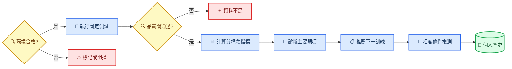

# FPS 瞄準能力測試框架 v1

_第一版設計基線；用於診斷個人弱項、推薦下一個訓練，並在相容條件下追蹤同一選手的進步。_

> **狀態：** Draft v1 — 任務構念與協定方向已拍板；數值範圍、樣本數與回饋時機待 calibration pilot 後凍結。
>
> **範圍：** 首版以 CS movement profile 為主；VALORANT 與其他遊戲須以獨立 profile、獨立版本與獨立歷史曲線加入。

---

## 📋 框架摘要

本框架定義三個測試家族：架槍挑戰、Spider Shot 與急停測試。它們共同服務兩個產品決策：

1. 找出選手目前最主要的可訓練弱項
2. 在相同測試版本與相容環境下追蹤個人進步

首版不建立跨玩家排名，也不把不同構念壓成單一總分。每個結論必須保留原始條件、樣本數、品質旗標與演算法版本。

| 測試家族 | 主要構念 | Assessment 主協定 | Practice 延伸 |
| --- | --- | --- | --- |
| **架槍挑戰** | 預瞄、反應、取得、首發、短追蹤 | `hold-click-v1`、`hold-track-v1` | 變速、變露出、弱側加量 |
| **Spider Shot** | 目標切換、flick、停止控制、節奏 | `spider-shot-v1` | 自適應角距與尺寸 |
| **急停測試** | 制動、反向輸入、停槍同步、首發 | `counterstrafe-cued-v1`、`counterstrafe-reversal-v1` | `counterstrafe-free-v1` |



## 🎯 設計原則與使用邊界

### 主要設計原則

- **同人縱向優先：** 比較單位是同一選手在相容 session 下的變化
- **構念分離：** 預瞄、反應、取得、追蹤、首發與移動同步各自報告
- **Assessment 固定：** 使用凍結協定、seeded schedule、固定回饋政策與版本化參數
- **Practice 可適應：** 自適應難度、即時 cue、連擊與弱側加量只存在於練習模式
- **條件可追溯：** 遊戲 profile、武器、場景、靈敏度、FOV、顯示與輸入狀態全部入 metadata
- **品質先於結論：** `n` 不足、flags 不空或協定不相容時，不輸出能力升降或訓練處方

### 明確不做

- 不以三個任務合成跨構念總分
- 不以單一最好 trial 判斷進步
- 不將同一 session 內的多個 trial 當成彼此獨立的受試者樣本
- 不將 CS 與 VALORANT movement profile 接成同一條趨勢
- 不在 scored block 中逐 trial 改難度
- 不把滑鼠動作起始時間宣稱為純知覺反應時間

> ⚠️ **量測用語：** 沒有眼動或獨立反應按鍵時，`t_detect` 是由持續性瞄準動作推導的視覺—動作反應代理值，不是純神經或純視覺反應時間。

## ⚙️ 共同測試契約

### 模式分離

| 契約 | Assessment | Practice |
| --- | --- | --- |
| **難度** | block 內固定 | block 間可調整 |
| **隨機性** | seed 與 schedule 留存 | 可用新 seed |
| **即時回饋** | 最小化，結束後呈現 | 可顯示 cue、連擊、音效 |
| **歷史比較** | 可進相容趨勢 | 預設不進正式趨勢 |
| **重試** | 不因失誤即時重抽 | 可快速重來 |

### 實驗單位與重複結構

- `trial` 是一次技術重複，用來估計該條件在一個 session 內的分布
- `condition block` 是同一協定下的一組平衡條件
- `session` 是縱向比較的基本單位；trial 不能被當成多個獨立 session
- `participant` 是個人歷史的最上層單位
- 距離、方向與其他已知干擾因子須在 session 內平衡或分層
- session／task order 須以 seed 產生並保存，降低學習、疲勞與固定順序混淆

### 共同 metadata

| 類別 | 必存欄位 |
| --- | --- |
| **身份與版本** | `participantId`、`sessionId`、`taskId`、`protocolVersion`、`recommendationVersion` |
| **遊戲與武器** | `gameMovementProfile`、`weaponId`、射速、首發準度門檻、ADS 狀態 |
| **輸入** | DPI、hip／ADS sensitivity、cm/360、FOV、`rawInputEnabled`、反轉軸 |
| **顯示** | refresh rate、resolution mode、renderer backend、fullscreen／isolation 狀態 |
| **模擬** | `simHz`、scene、drill config、seed、schedule、開始時間 |
| **目標** | 實體 hitbox、距離、角尺寸、速度、方向、露出距離、可見門檻版本 |
| **品質** | dt gaps、late input、buffer overflow、suspect 與任務專屬 flags |

### 共同事件時間線


不同任務可以省略不適用的事件，但同名事件不得有不同語意。逐 tick 可見比例應保留；正式反應起點使用版本化的 `t_measurement_onset`，不可僅依「第一個像素出現」硬編碼。

## 🎯 架槍挑戰

### 場景與共同條件

- 場景具有實際遮蔽物，目標從遮蔽物後水平移出
- 目標只向已提示方向移動，玩家事先知道左出或右出
- 出現時間不可預測，使用 bounded random foreperiod
- 目標移出後停止，不退回遮蔽物
- 移動速度來自當前遊戲 movement profile
- 露出距離可變，但每個 Assessment condition 內固定
- 近／中／遠保持相同實體模型，接受遠距角尺寸自然縮小
- 左／右與近／中／遠在 session 內平衡，報告同時提供分層與整體描述

### `hold-click-v1`

玩家可在目標出現後立即射擊。此模式的主要構念是預瞄、視覺—動作反應、目標取得與首發；移出後的短暫追隨只作軌跡描述，不宣稱為獨立 tracking 能力。

| 階段 | 指標 |
| --- | --- |
| **出現前** | 預瞄偏差、預期出現線高度偏差、準星漂移 |
| **反應** | `t_detect - t_measurement_onset`、anticipation flag |
| **取得** | `t_first_on_target - t_detect`、overshoot／undershoot、微調次數 |
| **首發** | `t_fire - t_first_on_target`、首發命中、開火角度偏差、射速合法性 |
| **結果** | 依方向與距離分層的成功率、中央値、P95 與 acquisition failure |

### `hold-track-v1`

目標移出期間鎖住開火；目標停止或停止提示後才允許第一發。固定的移動窗口用來衡量短暫追蹤，避免反應較快者因提早擊殺而天然得到較短追蹤窗。

| 階段 | 指標 |
| --- | --- |
| **取得** | `tAcquire`、acquisition failure |
| **追蹤** | TOT%、RMS／median／P95 angular error、掉靶次數、重新取得時間 |
| **停止轉換** | `t_fire - t_stop`、停止後首發命中、停止後開火偏差 |
| **分層** | 方向、距離、速度與露出距離 |

### 可見性語意

每個 trial 至少記錄：

- `t_first_visible`：幾何上第一次出現可見部分
- `visibleFraction(t)`：每 tick 的投影可見比例或等價可重建資料
- `t_measurement_onset`：達到凍結可見門檻的正式反應起點
- `t_full_exposure`：達到該 condition 定義的完整露出位置
- `t_stop`：目標速度正式進入停止狀態

可見門檻的數值在 calibration pilot 後凍結；改動門檻必須升 `protocolVersion`。

## ⚡ Spider Shot

### 任務規則

- 場上同時最多一個可命中目標
- 開始目標位於畫面中心
- 命中中心後，下一目標依 seeded polar schedule 出現在周邊
- 命中周邊後，下一目標固定回到中心
- 任務持續固定時間，目標總數由玩家完成速度決定
- 射速、彈匣與射擊合法性由所選武器決定
- Assessment 使用固定的角距與角尺寸分布版本

### 條件與分層

周邊位置以角度座標定義，不以螢幕像素定義。每次 transition 至少保存：

- `center_to_peripheral` 或 `peripheral_to_center`
- 水平、垂直或斜向象限
- 實際角距 `D_deg`
- 目標角尺寸 `W_deg`
- 實體 hitbox 與世界距離
- target schedule seed

### 主要指標

| 構念 | 指標 |
| --- | --- |
| **切換反應** | 前一命中到持續性瞄準動作起始；標示為視覺—動作代理值 |
| **移動執行** | movement time、峰值角速度、主要 flick 時長 |
| **停止控制** | overshoot／undershoot、首次進靶後逸出、微調次數 |
| **首發** | 首發命中、開火角度偏差、額外射擊數 |
| **節奏** | transition interval 分布與 session 內變異 |

原始時間不得跨不同 `D_deg × W_deg` 直接平均後解讀。第一版 calibration 先探索角距與尺寸範圍，再凍結 `spider-shot-v1` 的有限條件格；探索資料不進正式歷史曲線。

## 🔄 急停測試

### 遊戲物理

首版使用現行 [CS2 movement profile](../../../src/sim/MovementController.ts)。未來加入 VALORANT 時新增獨立 `gameMovementProfile`、任務版本與 baseline，不回寫既有 CS 歷史。

### `counterstrafe-cued-v1`

系統提示 A 或 D，玩家依提示完成 peek、反向制動與首發。此模式作為標準 Assessment 主協定，因為起始方向與提示時間可被精確記錄。

### `counterstrafe-reversal-v1`

玩家依提示按住指定方向；達固定持續時間後收到反向提示並執行反向輸入。此模式隔離制動能力與反向輸入 timing，降低自由 peek 路徑差異。

### `counterstrafe-free-v1`

玩家自行決定 peek 節奏與開火時機。此模式保留較高遊戲情境相似性，但 trial 起點與路徑不完全標準化，因此首版只用於 Practice 與技術觀察，不進正式進步判定。

### 主要指標

| 構念 | 指標 |
| --- | --- |
| **輸入反應** | cue-to-key、release latency、counter-input latency |
| **制動** | time-to-accuracy-gate、zero crossing、停止距離、過度反向量 |
| **射擊同步** | fire alignment、開火 residual speed、門檻前開火率 |
| **首發** | first-shot hit、開火角度偏差、合法射速 |
| **對稱** | 左右側各自的 `n`、分布與差值 |

## 📊 診斷、推薦與縱向追蹤

### 診斷輸出

每個 Assessment session 最多輸出一個主要限制與一個次要限制。診斷不得只依單一最好值，且必須附上來源指標、`n`、flags 與相容條件。

| 證據模式 | 診斷標籤 | 下一個訓練方向 |
| --- | --- | --- |
| 預瞄偏差高、反應正常 | `preaim-placement` | 架槍線與弱側位置校準 |
| 預瞄正常、動作起始慢 | `visual-motor-onset` | 隨機 foreperiod 出現偵測 |
| 起始正常、取得慢且 overshoot 高 | `flick-control` | 降速 Spider Shot、一次乾淨停止 |
| 取得快、首發偏差高 | `click-timing` | 首次進靶後開火控制 |
| Tracking 取得正常、TOT 低 | `tracking-maintenance` | 固定速度持續控制 |
| 急停 residual speed 高 | `counterstrafe-braking` | 反向制動，不提高瞄準難度 |
| 停穩正常、開火仍偏晚 | `fire-commitment` | gate 後快速首發 |

診斷規則以 `recommendationVersion` 管理。任何門檻變更都要升版並保存舊規則，不可用新門檻重寫舊 session 的原始結論。

### 相容比較鍵

正式進步比較至少要求以下欄位相容：

```text
participantId
taskId + protocolVersion
gameMovementProfile
weaponId + weapon mode
sensitivity/FOV profile
target condition cell
assessment feedback policy
quality-gate status
```

硬體或 refresh rate 改變時保留資料，但分層顯示並標記環境切換點。Practice session 不自動併入 Assessment baseline。

### 進步判定

- 以 session 摘要而非 trial 數量作為縱向單位
- 顯示最近一次、固定窗口的 session 中位數與 session 間變異
- 同時呈現主要能力與 speed–accuracy trade-off，避免只追求更快或只追求更準
- baseline session 數、比較窗口與最小可解讀變化待 pilot 後凍結
- 樣本不足或品質不合格時顯示「資料不足」，不顯示進步／退步箭頭

## 🔍 Calibration、開放問題與凍結程序

### Calibration pilot 目的

pilot 只用來選擇可用範圍與發現地板／天花板效應，不進正式個人進步歷史。需要校準：

- 架槍的近／中／遠世界距離
- `t_measurement_onset` 的可見比例門檻
- 架槍速度與露出距離的有限條件格
- Spider Shot 的角距與角尺寸範圍
- 每個 condition 的 measured trials 與 block 數
- warm-up 長度、休息規則與 Assessment 回饋時機
- 建立 baseline 所需的 session 數與最小可解讀變化

### 設計與隨機化

- 採同一選手重複量測設計，session 內以方向／距離等已知因子做完整或近完整平衡
- 使用 seeded schedule 隨機化 trial 與 task order
- 對學習與疲勞採 block 與休息控制；不可讓某一距離永遠出現在最後
- calibration 與正式 Assessment 使用不同 seed roster
- pilot 結束後先凍結協定與分析規則，再收正式 baseline

### 尚未凍結的問題

| ID | 問題 | v1 暫定處理 |
| --- | --- | --- |
| **OQ-AF-01** | 可見比例門檻數值 | pilot 比較候選值後凍結 |
| **OQ-AF-02** | 近／中／遠世界距離 | 依 CS 場景與可辨識性校準 |
| **OQ-AF-03** | 架槍速度與露出距離 levels | 先篩選，再保留有限條件格 |
| **OQ-AF-04** | Spider Shot 角距／尺寸 levels | 以無明顯地板／天花板為準 |
| **OQ-AF-05** | trial、block、baseline session 數 | pilot 估計 session 內外變異後決定 |
| **OQ-AF-06** | Assessment 是否顯示即時命中回饋 | 比較最小回饋與無策略回饋版本 |

## ✍️ 專案落地與驗收

### 現有接縫

| 能力 | 現有接縫 |
| --- | --- |
| **資料驅動任務** | [`DrillConfig`](../../../src/drill/DrillConfig.ts)、[`DrillRunner`](../../../src/drill/DrillRunner.ts) |
| **目標與移動** | [`TargetManager`](../../../src/sim/TargetManager.ts)、現有 seeded spawn／tracking motion |
| **CS 移動** | [`MovementController`](../../../src/sim/MovementController.ts) |
| **基礎指標** | [`computeMetrics`](../../../src/metrics/compute.ts) |
| **追蹤指標** | [`deriveTrackingMetrics`](../../../src/metrics/trackingDerivation.ts) |
| **視覺—動作偵測** | [`deriveDetectionMetrics`](../../../src/metrics/detectionDerivation.ts) |
| **結果呈現** | [`ResultScreen`](../../../src/ui/ResultScreen.ts)、[`coach_report.py`](../../../research/src/report/coach_report.py) |

### 建議交付順序

1. 凍結共用事件、metadata、相容比較鍵與品質旗標
2. 實作 `hold-click-v1` 與遮蔽物可見性時間線
3. 實作 `hold-track-v1` 與停止後解鎖開火
4. 實作 `spider-shot-v1` 的中心—周邊 seeded schedule
5. 將現有急停能力包裝為兩個 Assessment 協定與一個 Practice 協定
6. 建立診斷 view-model、版本化推薦與個人 session history
7. 執行 calibration pilot，凍結數值後發布 `protocolVersion = 1.0.0`

### v1 驗收條件

- [ ] 相同 config、seed 與輸入序列可得到相同逐 tick／event 結果
- [ ] 三個任務的同名事件具有一致時間語意
- [ ] 架槍的可見比例、正式 onset、停止與開火事件可被重建
- [ ] `hold-click` 不宣稱輸出獨立 tracking 能力
- [ ] `hold-track` 的追蹤窗不因提早擊殺而縮短
- [ ] Spider Shot 每次 transition 保存方向、角距與角尺寸
- [ ] 三個急停子協定不共用未分層總分
- [ ] Assessment 與 Practice 不共用正式 baseline
- [ ] 結果頁對每個診斷顯示來源指標、`n`、flags 與版本
- [ ] 不相容 session 不會產生進步／退步結論
- [ ] pilot 參數與正式 v1 參數分開保存
- [ ] 所有新指標先通過現有 validity／quality gate 才能進推薦規則

---

_Last updated: 2026-08-19 · Owner: project maintainer / esports performance coach_
