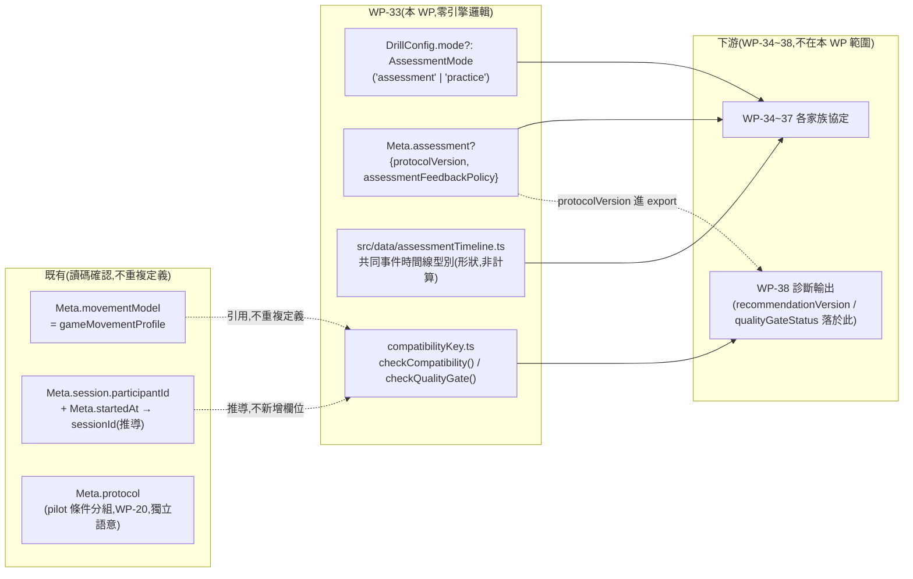

# WP-33 — assessment-contract:Assessment/Practice 契約 + metadata 擴充 + 事件時間線契約 + 相容鍵/品質旗標

> stage6 執行計畫的 WP 子資料夾。上層 spec:[../README.md](../README.md) · 需求 source of truth:[../aim-assessment-framework-v1.md](../aim-assessment-framework-v1.md) · 決議依據:**GD-22**(stage6 採納/編號)。
> Companion:[task-checklist.md](task-checklist.md) · [progress.md](progress.md)

| | |
|---|---|
| **目標** | 凍結三家族(架槍/Spider Shot/急停)與診斷層全部依賴的共同契約:Assessment/Practice 模式分離、metadata additive 欄位、事件時間線型別(僅型別,不含 WP-34 引擎實作)、相容比較鍵 + 品質旗標判定式。**零引擎邏輯**(WP-33 資料流圖標註,見 [../README.md §2.2](../README.md))——本 WP 交付型別與純函式,不交付任何測試/量測行為 |
| **里程碑** | 無獨立里程碑;是 **M16**(stage6 交付)的地基,WP-34~37 entry 皆需本 WP T-exit |
| **相依** | **M4 ✅**(schema v2)+ **WP-20 ✅**(`meta.session`/`meta.protocol`/`meta.display` 既有 additive 慣例) |
| **對應 FR** | FR-F1(模式契約)+ FR-F2(metadata 擴充)+ FR-F3(事件時間線契約)+ FR-F4(相容鍵 + 品質旗標) |
| **估時** | 2–3 dev-days(見 [../README.md §6](../README.md)) |
| **狀態** | ⬜ 未開始 |

---

## 0. 讀碼對帳(2026-08-19,T0 前置;影響 scope 與欄位落點)

> stage6 README §0.1 已標記「WP-33 之後每個 WP 若各自造一套契約,會重蹈 C-D4 覆轍」;以下是本 WP 動筆前對既有 `src/data/metadata.ts`、`src/drill/DrillConfig.ts`、`docs/operational/schema.md`、`docs/operational/pilot-protocol-stage3.md` 的讀碼結果,決定哪些 FR-F2 欄位是「真的新」、哪些是「既有構念換個名字」。

| # | 框架 v1 / stage6 README 假設 | 讀碼發現 | 對本 WP 的影響 |
|---|---|---|---|
| **0-1** | `gameMovementProfile`(首版固定 `cs2-source`)是新 metadata 欄位 | `src/data/metadata.ts:85` 的 `Meta.movementModel: 'cs2-source'` **已經是同一個構念**——`schema.md` L70 原文已寫「Future Valorant-style profiles use a new value, not reinterpretation」,與 FR-F2 對 `gameMovementProfile` 的定義逐字相同 | **不新增欄位**。`gameMovementProfile` 只是 stage6 文件對既有 `meta.movementModel` 的概念命名;`analysis-assessment-contract.md` 明文記載兩者為同一欄位,禁止新增第二個攜帶相同語意的 key(C-D4) |
| **0-2** | `protocolVersion` 可能直接掛在既有 `meta.protocol` 物件上 | `meta.protocol.{protocolId, conditionIndex, conditionLabel}`(`SessionMeta`/`ProtocolMeta`,WP-20)是**不同構念**:服務 stage3 calibration pilot 的「同一位受試者多條件實驗」分組(見 [`pilot-protocol-stage3.md:82`](../../../../operational/pilot-protocol-stage3.md)的 `resolution_detection_v1` 範例,`protocolId` 是實驗批次名、`conditionIndex/Label` 是同批次內的條件編號),不是「這個 drill 用哪個凍結的 Assessment 任務協定版本」 | **不可共用 `meta.protocol` 物件**,否則 WP-39 pilot 的 `conditionIndex/Label` 會和 stage6 的協定版本語意疊在一起,C-D4 意義上的「同名不同義」。新欄位落在獨立區塊 `meta.assessment`(見 §2 契約①),與 `meta.protocol` 並存、互不覆寫 |
| **0-3** | `participantId`/`sessionId` 沿用既有 `meta.session` | `SessionMeta`(`src/data/metadata.ts:62`)只有 `participantId`/`sessionLabel?`,**沒有 `sessionId` 欄位** | `sessionId` 不新增儲存欄位——框架 v1 定義的「session」= 一次 drill 匯出的縱向比較單位,已經可由 `participantId + meta.startedAt`(既有必填欄位)決定性推導;新增儲存欄位屬多餘的第二來源。相容鍵判定式(T3)內部推導 `sessionId`,不落地成 meta 儲存欄位 |
| **0-4** | `recommendationVersion`/`qualityGateStatus` 是 metadata additive 欄位,與 `protocolVersion` 同一批寫入匯出 | 兩者依賴 WP-38 的診斷規則表版本與相容鍵判定**結果**,而診斷是匯出**之後**、可能用不同版本規則表重跑的離線步驟(FR-F14「規則表版本化,門檻變更升版並保存舊規則」)——若把 `recommendationVersion` 寫進匯出 meta,同一份原始資料會被綁死在第一次診斷用的版本上,違反「舊資料可用新版規則重新診斷」的可稽核性 | `recommendationVersion` **不進 `meta.assessment`**,改成 WP-38 診斷輸出物件的欄位(T0 決議記錄,見 §2 契約②)。`qualityGateStatus` 同理:它是 T3 `checkQualityGate()` 的**回傳值**,不是逐 drill 記錄的原始事實;本 WP 交付判定式,不交付一個要被寫入 meta 的旗標欄位 |
| **0-5** | Assessment/Practice 模式(FR-F1)隱含為既有機制的延伸 | `DrillConfig`(`src/drill/DrillConfig.ts`)/`src/drill/schema.ts` 目前**沒有任何** mode 概念(`grep -rn "Assessment\|Practice mode\|feedbackPolicy" src/` 零命中,除既有 `session`/`SessionSetup` 命名雷同但語意不同) | 五軸契約(難度/隨機性/回饋/歷史比較/重試)在 v1 只需要一個 additive 判別欄位 `DrillConfig.mode?: 'assessment' \| 'practice'`;省略 = `'practice'`(既有全部 drill 配置零回溯相容成本,且符合「既有 drill 從未宣稱是 Assessment」的事實) |

**結論**:FR-F2 表列六個「新」欄位裡,只有 `protocolVersion`、`assessmentFeedbackPolicy` 是本 WP 真正要新增的儲存欄位;`gameMovementProfile` 是既有欄位的概念別名(不新增)、`sessionId` 是推導值(不落地)、`recommendationVersion`/`qualityGateStatus` 延後到 WP-38 的輸出型別(不進 export meta)。這個收斂寫入 Decision Log `D-33.1`,並回寫 [../README.md](../README.md) FR-F2 若後續 WP 讀到本 WP 產出時需要對齊。

---

## 1. 範圍

**In scope**:

```
src/drill/DrillConfig.ts                     ← ADD DrillConfig.mode?: AssessmentMode(additive)      [T1]
src/drill/assessmentContract.ts               ← ADD AssessmentMode + 五軸契約型別註記                  [T1]
src/drill/schema.ts                           ← MODIFY validateDrill 驗證 mode 列舉(additive)         [T1]
src/data/metadata.ts                          ← ADD Meta.assessment 區塊(additive,見 §2 契約①)       [T1]
src/data/assessmentTimeline.ts                ← ADD 共同事件時間線型別(僅型別/欄位形狀)                [T2]
src/metrics/compatibilityKey.ts               ← ADD checkCompatibility() / checkQualityGate()         [T3]
docs/operational/analysis-assessment-contract.md ← ADD 契約文件(T0 起稿,T-exit 定稿)                  [T0/T-exit]
```

**Out of scope**(附觸發條件):

- **可見度時間線引擎實作**(`visibleFraction(t)`/`t_measurement_onset` 的實際計算)——WP-34 T0 spike 之後才決定計算方案;本 WP 只凍結欄位形狀。觸發 = WP-34 T0 spike 完成。
- **`hold-track` fire-gating 落點**——WP-35 T0 讀碼決議(OQ-S6-9),本 WP 不預先設計該欄位落在哪個型別。
- **Spider Shot 排程原語**(discriminated union 的具體 schema)——WP-36 T0/T1,本 WP 只確保新排程不會需要修改 `sequence.alternation` 既有型別(C-D4 延伸,§2 契約④原則性宣告,具體型別留給 WP-36)。
- **診斷規則引擎與 `recommendationVersion` 的儲存落點**——WP-38 T0 拍板(OQ-S6-8);本 WP 只在 §0.1(0-4)記錄「不進 export meta」的邊界決策,不設計 WP-38 的輸出型別。
- **任何 UI / cue 呈現**——五個下游 WP 各自負責;本 WP 不動 `src/ui/`。
- **任何既有匯出欄位的語意變更**——`mode` 省略必須逐位等同現行行為(無 mode 概念的既有 drill 全部視為 `'practice'` 語意上的超集,不改變任何既有測試/golden)。

### 1.1 資料流(本 WP 產出;下游消費見 [../README.md §2.2](../README.md))



---

## 2. 關鍵契約(T0 凍結項;事後只能升 version 重跑,不得原地改)

### ① `Meta.assessment` 區塊獨立於既有 `Meta.protocol`(承 §0.1 0-2)

```ts
export interface AssessmentMeta {
  /** 凍結的 Assessment 任務協定版本,例如 'hold-click-v1@1.0.0'。與 meta.protocol.protocolId(pilot 條件分組,WP-20)是不同構念,不得合併。 */
  protocolVersion: string;
  /** Assessment 回饋政策(FR-F1);Practice 模式省略此欄位或標記非受控回饋。 */
  assessmentFeedbackPolicy: 'minimal-end-of-block' | 'unrestricted';
}
```

`meta.protocol`(既有)繼續只服務 pilot 多條件分組;兩區塊在同一份匯出中可以同時出現(例如 WP-39 pilot 期間跑 `hold-click-v1` 且同時記錄 pilot conditionIndex),互不覆寫、互不推導對方。

### ② `gameMovementProfile` = 既有 `Meta.movementModel`,不新增欄位(承 §0.1 0-1)

`analysis-assessment-contract.md` 明文記載:stage6 文件中出現的「`gameMovementProfile`」一律指 `meta.movementModel`;**禁止**任何 WP-34~39 的程式碼或 metadata 新增第二個攜帶相同語意的 key。

### ③ `sessionId` 為推導值,不落地(承 §0.1 0-3)

`compatibilityKey.ts` 內部以 `` `${meta.session.participantId}:${meta.startedAt}` `` 或等價穩定序列化推導 `sessionId`,**不**在 `Meta`/`SessionMeta` 新增儲存欄位。WP-38 的個人 session history 若需要穩定鍵,呼叫同一推導函式,不得另行拼接。

### ④ `recommendationVersion` / `qualityGateStatus` 不進 export meta(承 §0.1 0-4)

- `recommendationVersion` 由 WP-38 診斷規則表本身攜帶版本字串,是**診斷輸出物件**的欄位,不是逐 drill metadata——這樣同一份原始匯出可以在規則表升版後重新診斷,不會被第一次診斷結果綁死。
- `qualityGateStatus` 是 `checkQualityGate()`(本 WP T3 交付)的**回傳值**,呼叫時機在诊断/呈現層,不在匯出時預先計算或儲存。

### ⑤ Assessment/Practice 模式契約五軸(FR-F1,凍結進 `analysis-assessment-contract.md`)

| 契約軸 | Assessment | Practice | 落地方式(v1) |
|---|---|---|---|
| 難度 | block 內固定 | block 間可調 | 由呼叫端(各 WP-34~37)保證,`DrillConfig.mode`本身不驗證 block 內容 |
| 隨機性 | seed/schedule 留存 | 可用新 seed | `mode==='assessment'` 時呼叫端必須提供 `sequence.seed`;T1 schema 驗證只做「assessment 缺 seed → 拋錯」的存在性檢查,不驗證 schedule 內容 |
| 即時回饋 | 最小化 | 可顯示 | 對應 `Meta.assessment.assessmentFeedbackPolicy` |
| 歷史比較 | 可進相容趨勢 | 預設不進 | 由 WP-38 讀 `mode` 判斷是否收進 session history,本 WP 不做歷史儲存 |
| 重試 | 不因失誤重抽 | 可快速重來 | 由呼叫端保證,`DrillRunner` 生命週期不在本 WP 範圍 |

省略 `DrillConfig.mode` = 既有行為的超集(視為 `'practice'` 語意,零回溯相容成本;既有 63 份既有 drill config 零修改)。

### ⑥ 事件時間線同名事件禁止跨任務改語意(FR-F3,C-D4 延伸)

`src/data/assessmentTimeline.ts` 只定義**欄位形狀**,不含計算:

```ts
export interface AssessmentTimelinePoint {
  readonly tFirstVisible?: number;      // 幾何首次可見;現行 pop-in 'visible' 事件即此語意的既有子集
  readonly tMeasurementOnset?: number;  // 版本化可見門檻達成點(WP-34 定義計算方式)
  readonly tFullExposure?: number;
  readonly tStop?: number;
}
```

任何下游 WP 若需要為既有欄位(`t_visible`/`t_detect`/`t_first_on_target` 等,已由 `compute.ts`/`detectionDerivation.ts`/`trackingDerivation.ts` 定義)另賦新語意,視為違反本契約,必須回到本文件走 versioned 變更,不得在各自 WP 內悄悄改寫。

### ⑦ 相容比較鍵欄位封閉(FR-F4)

```ts
export interface CompatibilityKey {
  readonly participantId: string;
  readonly taskId: string;              // 例如 'hold-click-v1'(協定家族+版本前段,不含 pilot conditionIndex)
  readonly protocolVersion: string;
  readonly gameMovementProfile: string; // = meta.movementModel
  readonly weaponId: string;
  readonly weaponMode: string;
  readonly sensitivityFovKey: string;   // 由 sensitivity+fovDeg 決定性序列化
  readonly targetConditionCell: string;
  readonly assessmentFeedbackPolicy: string;
  readonly qualityGateStatus: string;
}
```

九個欄位缺一即視為不相容(全等判定,非模糊比對);新增第十個欄位需升 `compatibilityKey` 的內部版本並在文件記錄,不得原地插入。

---

## 3. Failure modes

| 觸發 | 影響 | 處理 |
|---|---|---|
| 誤把 `gameMovementProfile` 寫成新 metadata 欄位(忽略 §0.1 0-1) | 同一構念兩個名字,C-D4 違規;WP-34~39 有一半讀 `movementModel`、一半讀新欄位,相容鍵判定漏比對 | T0 DoD 明文列「零新增 movementModel 同義欄位」;T1 code review 檢查點 |
| `meta.assessment` 與既有 `meta.protocol` 混用(例如把 `protocolVersion` 塞進 `meta.protocol.protocolId`) | pilot 條件分組(WP-39)與協定版本語意疊在一起,WP-39 T-exit 驗收清單 F 的「pilot 參數與正式參數分開保存」條件會被污染 | §2 契約① 明文兩區塊獨立;T1 單元測試斷言兩者可同時存在且互不覆寫 |
| `DrillConfig.mode` 省略時驗證器誤判為必填 | 既有全部 drill config(63+ 份)驗證失敗,阻斷既有 CI | T1 DoD 首項 = 既有 `DrillRunner.test.ts`/`clearance.test.ts` 等既有測試**零修改**全綠 |
| `checkCompatibility()`/`checkQualityGate()` 被下游當作「順手在自己檔案內重寫一份」 | 重蹈 C-D4;WP-34~38 各自的相容判斷可能給出不同答案 | T3 DoD 要求以純函式輸出 + 單元測試覆蓋正例/反例;`analysis-assessment-contract.md` 明文「所有比較必須呼叫本函式,禁止另寫」 |
| `recommendationVersion`/`qualityGateStatus` 被誤放進本 WP 的 `Meta.assessment`(忽略 §0.1 0-4) | WP-38 拍板 OQ-S6-8 時發現欄位已經卡進 schema v2,回頭要做 additive 欄位棄用,產生技術債 | T0/T1 DoD 明文列這兩個欄位**不**出現在 `AssessmentMeta` 型別中 |

---

## 4. Task 索引

| Task | 檔案 | Objective | 相依 | Risk | 估時 |
|---|---|---|---|---|---|
| **T0** | [T0-entry-gate.md](T0-entry-gate.md) | 驗 M4/WP-20 exit;凍結 §0.1 讀碼對帳 + §2 七項契約;起稿 `analysis-assessment-contract.md`;零程式碼 | — | Low | 0.5d |
| **T1** | [T1-metadata-extension.md](T1-metadata-extension.md) | `DrillConfig.mode` + `Meta.assessment` additive 型別/驗證 | T0 | Low | 0.75–1d |
| **T2** | [T2-event-timeline-contract.md](T2-event-timeline-contract.md) | 共同事件時間線型別凍結(欄位形狀,不含計算) | T0(可與 T1 並行) | Low | 0.5d |
| **T3** | [T3-compatibility-quality-gate.md](T3-compatibility-quality-gate.md) | `checkCompatibility()` / `checkQualityGate()` 純函式 + 單元測試 | T1(需要 `AssessmentMeta` 型別) | Med | 0.75–1d |
| **T-exit** | [T-exit-gate.md](T-exit-gate.md) | `analysis-assessment-contract.md` 定稿;文件對帳;WP-33 狀態翻 ✅,開放 WP-34~37 entry | T2 + T3 | — | 0.25d |

**T2 只依賴 T0**(型別凍結不需要 `AssessmentMeta`)→ 可與 T1 並行;一 task 一 commit 的紀律不變。

---

## 5. Interface contracts

```ts
// src/drill/assessmentContract.ts                                              [T1]
export type AssessmentMode = 'assessment' | 'practice';

// src/drill/DrillConfig.ts                                                     [T1,additive]
export interface DrillConfig {
  // …既有欄位不變…
  mode?: AssessmentMode; // 省略 = 'practice' 語意超集,零回溯相容成本
}

// src/data/metadata.ts                                                         [T1,additive]
export interface AssessmentMeta {
  protocolVersion: string;
  assessmentFeedbackPolicy: 'minimal-end-of-block' | 'unrestricted';
}
export interface Meta {
  // …既有欄位不變…
  assessment?: AssessmentMeta;
}
export interface CollectMetaArgs {
  // …既有欄位不變…
  assessment?: AssessmentMeta;
}

// src/data/assessmentTimeline.ts                                               [T2]
export interface AssessmentTimelinePoint {
  readonly tFirstVisible?: number;
  readonly tMeasurementOnset?: number;
  readonly tFullExposure?: number;
  readonly tStop?: number;
}

// src/metrics/compatibilityKey.ts                                              [T3]
export interface CompatibilityKey {
  readonly participantId: string;
  readonly taskId: string;
  readonly protocolVersion: string;
  readonly gameMovementProfile: string;
  readonly weaponId: string;
  readonly weaponMode: string;
  readonly sensitivityFovKey: string;
  readonly targetConditionCell: string;
  readonly assessmentFeedbackPolicy: string;
  readonly qualityGateStatus: string;
}
export function deriveSessionId(meta: Meta): string;
export function buildCompatibilityKey(meta: Meta, targetConditionCell: string, qualityGateStatus: string): CompatibilityKey;
export function checkCompatibility(a: CompatibilityKey, b: CompatibilityKey): boolean;
export type QualityGateStatus = 'ok' | 'insufficient-n' | 'incompatible-protocol' | 'suspect-run';
export function checkQualityGate(args: { n: number; minN: number; suspect: boolean; compatible: boolean }): QualityGateStatus;
```

---

## 6. 執行規則

沿用 [exec-plan/README.md §5](../../../README.md):一 task = 一垂直切片 = 一原子 commit;完成即更新 [progress.md](progress.md) 與 [task-checklist.md](task-checklist.md);單一閘 `npm run test:ci`(本 WP 不動 `research/`,不需要 `uv run pytest`)。跨 WP 決策入 [DECISIONS.md](../../../DECISIONS.md),per-WP 決策入本資料夾 `progress.md`(編號 `D-33.n`)。

**本 WP 特有的三條紀律**:

1. **零引擎邏輯**:本 WP 只交付型別 + 純函式(`checkCompatibility`/`checkQualityGate`);不得新增任何讀取場景/sim/render 狀態的程式碼。任何「這個型別要怎麼被填值」的具體計算留給 WP-34~38。
2. **既有構念禁第二定義(C-D4)**:`gameMovementProfile` 必須引用 `meta.movementModel`,不得新增同義欄位;`sessionId` 必須用推導函式,不得新增儲存欄位。T1/T3 code review 檢查點。
3. **既有匯出零回溯相容成本**:`DrillConfig.mode` 與 `Meta.assessment` 皆為可省略的 additive 欄位;省略時的行為必須逐位等同現行(既有測試零修改全綠是機械判準)。

---

## 7. Open Questions(本 WP 新增;既有 OQ-S6-* 見 [../README.md §8](../README.md))

| # | 問題 | 建議 / 待決 | Owner | Deadline | 未決影響 |
|---|---|---|---|---|---|
| **OQ-S6-10**(新) | `weaponMode`(相容鍵欄位之一)在單武器(AK47)、無 ADS 變體的現狀下如何取值——是否等於 `weaponId`,還是需要額外欄位區分 hip/ADS 測試變體 | 🟡 **T3 讀碼**:先讀 `WeaponConfig`/`activeWeaponConfig()` 目前有幾種 mode 概念,若目前只有單一武器則 `weaponMode` 暫定等於 `weaponId`,留 TODO 待多武器/ADS Assessment 出現時再拆分 | 研究者 | WP-33 T3 | 相容鍵欄位定義完整度;不阻塞 T3 落地(可先用 `weaponId` 佔位) |
| **OQ-S6-11**(新) | `targetConditionCell` 的序列化格式(距離/角尺寸/速度如何拼成單一字串鍵)在三家族(架槍近中遠、Spider Shot `D_deg×W_deg`、急停無條件格)下是否需要每家族各自的 cell builder,還是本 WP 就要定出通用格式 | 🟡 **WP-33 T3 定初版**(單一字串鍵,家族各自決定內容,WP-33 只驗證「非空字串即可比較」);若後續家族發現不夠用,回本文件升版 | 研究者 | WP-33 T3 | 相容鍵在三家族間是否可互相比較(理論上不該跨家族比較,但鍵格式不一致會讓 bug 更難發現) |

---

## 8. 文件對帳清單

- [ ] [DECISIONS.md](../../../DECISIONS.md):若 §0.1 的讀碼收斂(`gameMovementProfile`/`sessionId`/`recommendationVersion` 落點)被判定為跨 WP 硬約束,T-exit 時評估是否升 GD 編號。
- [ ] [../README.md](../README.md) §3:WP-33 狀態 ⬜ → ✅(T-exit)。
- [ ] `docs/operational/analysis-assessment-contract.md`(新,T0 起稿/T-exit 定稿)。
- [ ] [CONTEXT.md](../../../../../CONTEXT.md):新術語(`AssessmentMode`、`CompatibilityKey`、`qualityGateStatus`)於 T-exit 回寫。
