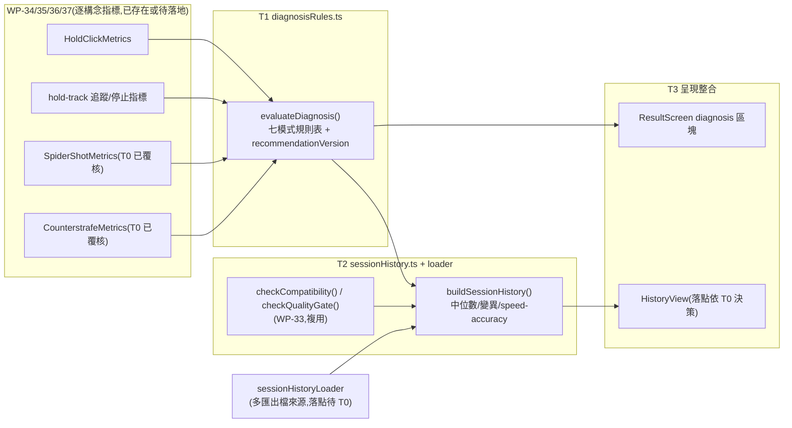

# WP-38 — diagnosis-recommendation:證據規則引擎 + 版本化推薦 + 個人 session history + 結果呈現整合

> stage6 執行計畫的 WP 子資料夾。上層 spec:[../README.md](../README.md) · 需求 source of truth:[../aim-assessment-framework-v1.md](../aim-assessment-framework-v1.md) · 決議依據:**GD-22**(stage6 採納)+ 本 WP T0 讀碼待執行。
> Companion:[task-checklist.md](task-checklist.md) · [progress.md](progress.md)

| | |
|---|---|
| **目標** | 交付 FR-F14(證據規則引擎:每 Assessment session 最多輸出一主一次弱項,附來源指標/`n`/flags/相容條件,規則版本化)+ FR-F15(相容比較鍵複測判定 + 個人 session history:近期 session 中位數與變異,能力與 speed–accuracy trade-off 並陳)+ FR-F16(結果呈現整合:每個晉升指標帶來源/`n`/flags/版本,樣本不足顯示「資料不足」而非箭頭) |
| **里程碑** | 無獨立里程碑;是 **M16** 的直接前置(WP-39 pilot 需要診斷輸出已可運作才能收正式 baseline) |
| **相依** | **WP-34/35/36/37 T-exit 均 ✅**(T0 於 2026-08-24 覆核);`SpiderShotMetrics` 與 `CounterstrafeMetrics` 的最終落地介面已由本 WP T0 重讀實檔確認(見 §0-1/§5),後續 task 必須消費該實際契約。 |
| **對應 FR** | FR-F14 + FR-F15 + FR-F16 |
| **估時** | 3–4 dev-days([../README.md §3](../README.md));讀碼發現「個人 session history」需要一個**目前全 repo 都不存在**的能力——跨多個匯出檔案讀取(見 §0-4),不是既有 `ResultScreen.ts` 或 `coach_report.py` 任一邊已具備、只需擴充的東西;這是本 WP 除 OQ-S6-8 落點之外的第二個未知數,估時傾向落在上緣,由 T0 讀碼結果收斂 |
| **狀態** | ✅ T0~T-exit 全數完成(2026-08-25);`analysis-diagnosis.md` 定稿,WP-39(M16)entry 條件之一已滿足 |

---

## 0. 讀碼對帳(規劃階段,2026-08-19;決定本 WP 淨新增工作量)

> 動筆前對 `src/ui/ResultScreen.ts`、`research/src/report/coach_report.py`、`src/metrics/compatibilityKey.ts`、`src/metrics/holdClickMetrics.ts`、`docs/operational/analysis-hold-track.md`、`docs/exec-plan/active/stage6/wp-36-spider-shot/README.md`、`wp-37-counterstrafe-protocols/README.md` 的讀碼結果。目的與 WP-33~37 §0 同:找出框架 v1 假設為既有能力延伸的項目,實際上有多少缺口。

| # | 框架 v1 / stage6 README 假設 | 讀碼發現 | 對本 WP 的影響 |
|---|---|---|---|
| **0-1** | WP-34~37 的逐構念指標介面在 WP-38 開工時皆已凍結,可直接消費 | T0 已重讀 [`spiderShotMetrics.ts`](../../../../../src/metrics/spiderShotMetrics.ts) 與 [`counterstrafeMetrics.ts`](../../../../../src/metrics/counterstrafeMetrics.ts):前者輸出逐 target 的 `switchReaction`/`movementExecution`/`stopControl`/`firstShot` 與 session `rhythm`;後者輸出 `SidedStat` 的制動/同步量與兩個 rate。欄位名稱與 §5 草案的 `SpiderShotMetrics`/`CounterstrafeMetrics` 型別引用一致。 | §5 的 WP-36/37 型別引用已於 **2026-08-24 T0 覆核**，後續不得再依 README 草案推定標量形狀；T1 必須從逐 target 陣列或 `SidedStat` 明確取出 evidence 與 `n`。 |
| **0-2** | 診斷規則引擎的落點(TS `ResultScreen` vs Python `coach_report.py`,OQ-S6-8)取決於哪一邊「已經有」個人歷史聚合能力 | `grep -n "class \|def " research/src/report/coach_report.py` 顯示 `coach_report.py` 是**單一 session/單一匯出檔**的報告產生器(`build_report(export, peeks, ...)`),沒有任何跨檔案/跨 session 迴圈或聚合函式;`ResultScreen.ts` 同樣是單次 drill 結束後的即時畫面(`createResultScreen`/`createResultSummary`/`createPromotedSummary`),沒有讀取歷史匯出的機制。**兩邊都不具備個人歷史能力**,§2.3(d) 原本「Python 更接近歷史聚合形狀」的假設不成立 | OQ-S6-8 不能簡化為「哪邊已經有歷史能力」,必須拆成兩個獨立子問題(見 §2①):(a) 單次 session 的診斷標籤與呈現落在哪裡、(b) 跨 session 歷史聚合的資料從哪裡來、落在哪裡。這移除了 README 原本假設的「二選一」框架,T0 需要新的決策結構 |
| **0-3** | `research-promoted` 區塊(WP-32)的呈現型式可直接沿用給診斷區塊 | [`ResultScreen.ts`](../../../../../src/ui/ResultScreen.ts) 已有 `PROMOTED_METRIC_IDS`(封閉 metric id 清單,WP-32 C-D3 紀律)、`createPromotedSummary()`(status: `'blocked'` vs 正常態,附 n/flags/version)——這是一個**已驗證、可直接複製的型式**,不是新設計 | T3 的診斷卡片可比照 `createPromotedSummary` 的形狀:封閉 `DIAGNOSIS_METRIC_IDS`、`status: 'insufficient-data'` 取代 `'blocked'`、每卡帶來源指標/`n`/flags/`recommendationVersion`。降低 T3 的設計風險 |
| **0-4** | 「個人 session history」是既有匯出/呈現管線的延伸 | `grep -rn "history\|localStorage\|indexedDB"` 對 `src/` 零命中——**全 repo 沒有任何跨瀏覽器 session 的持久化機制**。此應用是純前端、單次執行的訓練器(D1),每次匯出是一個獨立 JSON/CSV 檔案落地到使用者磁碟,沒有內建「讀回先前匯出」的介面(無 `<input type=file>`、無 IndexedDB) | 這是本 WP**真正的新增能力**,而不是既有機制的包裝。T0 必須把它當一個獨立的小型架構決策處理(比照 WP-34 T0 spike 的規格),見 §2②;不能假設 T2 只是「寫一個聚合函式」那麼簡單 |
| **0-5** | 證據規則表的七個模式(框架 v1 §"診斷輸出")可直接對應到既有/規劃中的欄位 | 逐列核對:`preaim-placement`/`visual-motor-onset` 對應 [`HoldClickPresentationMetrics`](../../../../../src/metrics/holdClickMetrics.ts) 的 `preAim.eccentricityDeg`/`detectionLatencyFromOnsetMs`;`flick-control`/`click-timing` 對應 `acquisitionFromDetectMs`/`firstShotAfterOnTargetMs`(必要時交叉引用 WP-36 `stopControl.overshootDeg`);`tracking-maintenance` 對應 WP-18 既有 `deriveTrackingMetrics()` 的 TOT%;`counterstrafe-braking`/`fire-commitment` 對應 WP-37 草案 `CounterstrafeMetrics.overReversalUPerS`/`timeToAccuracyGateMs`/`releaseToFireMs`(來自已晉升 `sync-v1`) | 七個模式**皆可映射到已存在或已設計的欄位**,沒有缺口需要新推導函式;規則引擎(T1)是**純消費既有輸出的判定邏輯**,不需要碰任何幾何或既有構念(C-D4 天然滿足)。但門檻數值(「高」/「慢」/「低」)全部未凍結,需要以 versioned config 注入(比照 WP-34 `onsetThreshold` 建構參數模式),而非寫死常數 |

**結論**:FR-F14(規則引擎)是最低風險的部分——純消費既有輸出的判定邏輯,零新幾何。真正的兩個未知數是 OQ-S6-8(落點,已從假設的二選一變成需要拆解的多維決策)與個人歷史的資料來源(全新能力,§0-4)。這兩點收斂了 T0/T1/T2 的切法(見 §4),記入 Decision Log D-38.1(T0 執行時定案)。

---

## 1. 需求對應

| FR | 內容 | 落點 |
|---|---|---|
| FR-F14 | 證據規則引擎:每 Assessment session 最多輸出一主一次弱項,附來源指標/`n`/flags/相容條件;規則表版本化(`recommendationVersion`),門檻變更須升版並保存舊規則 | T1 |
| FR-F15 | 相容比較鍵複測判定(`checkCompatibility`/`checkQualityGate` 消費)+ 個人 session history:近期固定窗口 session 中位數與變異,能力與 speed–accuracy trade-off 並陳 | T2 |
| FR-F16 | 結果呈現整合:每個診斷/晉升指標帶來源/`n`/flags/版本;資料不足顯示「資料不足」,不顯示進步/退步箭頭 | T3 |

### 1.1 範圍

**In scope**:

```
src/metrics/diagnosisRules.ts              ← ADD 七模式規則表 + evaluateDiagnosis()(純函式,消費既有/WP-36/37 輸出)  [T1]
src/metrics/sessionHistory.ts              ← ADD 個人 session history 聚合(consumes SessionSummary[])              [T2]
src/data/sessionHistoryLoader.ts           ← ADD 多匯出檔載入介面(落點依 T0 §2② 決策;可能是 TS 或不落在 src/)      [T2]
src/ui/ResultScreen.ts                     ← MODIFY 新增 diagnosis 區塊(封閉 DIAGNOSIS_METRIC_IDS,比照 WP-32 型式) [T3]
src/ui/HistoryView.ts                      ← ADD(若 T0 拍板落在 TS)個人歷史檢視(純 TS + DOM,D1)                  [T3]
src/main.ts                                ← MODIFY 結果頁取得診斷/歷史 additive 參數                                [T3]
docs/operational/analysis-diagnosis.md     ← ADD 契約文件(七模式規則表 + 門檻版本化 + history 聚合定義)             [T1/T2/T-exit]
docs/operational/acceptance-stage-f.md     ← 本 WP 不建立(WP-39 T-exit 職責);T-exit 只補齊 WP-38 對應驗收條件的證據來源 |
```

**Out of scope**(附觸發條件):

- **`acceptance-stage-f.md` 本身**——WP-39 T-exit 建立;本 WP 只交付其中「結果呈現對每個診斷顯示來源指標/`n`/flags/版本」與「不相容 session 不會產生進步/退步結論」兩項驗收條件的實作證據。
- **跨玩家排名 / 單一總分**——框架 v1 明文不做,`DiagnosisResult` 型別不得出現合成總分欄位。
- **診斷門檻的最終凍結數值**——WP-39 pilot 待決;本 WP 只交付「可配置 + 版本化」的規則引擎機制。
- **WP-36/WP-37 本身的任何實作**——無檔案熱區重疊;本 WP 只消費其產出介面。
- **個人歷史的跨玩家聚合儀表板**——stage6 §2.1 明文 out of scope,觸發條件未變(累積 ≥3 選手)。
- **Practice session 併入正式歷史**——WP-33 契約已禁止(`mode` 判斷);本 WP 只需在 history loader 層守門,不重新設計判斷邏輯。

### 1.2 資料流(本 WP 新增部分)



---

## 2. 關鍵契約(T0 待凍結項;以下為讀碼後的建議方向,非最終定案)

### ① OQ-S6-8 拆解:落點不是二選一,是兩個獨立子決策(承 §0-2)

stage6 README §2.3(d) 把 OQ-S6-8 寫成「診斷推薦引擎落點:TS 即時 vs Python offline」的單一二選一問題。讀碼後(§0-2)發現兩邊都沒有現成的歷史聚合能力,原本的判斷依據不成立。T0 應改為拆解成兩個獨立問題各自決策:

| 子問題 | 建議方向 | 理由 |
|---|---|---|
| **(a) 單次 session 診斷標籤 + 呈現** | **TS(2026-08-24 T0 定案)**,擴充 `ResultScreen.ts`(比照 §0-3 的 `createPromotedSummary` 型式) | `ResultScreen` 仍維持既有的 optional promoted-metrics render seam；規則引擎消費的指標亦都在 TS 端。診斷可在訓練結束時立即呈現，並維持 D1(純 TS + DOM)邊界。 |
| **(b) 跨 session 歷史聚合** | **候選①純 TS 多檔載入(2026-08-24 T0 定案)**：新增獨立 `<input type=file multiple>` history view，使用者每次手動選取先前 export JSON，無自動持久化。 | `research/fixtures/exports/` 是受控、匿名化、每檔最多 30 秒的測試 corpus；現有 `research` 的 shared pipeline 與 `coach_report.py` 均只接受一個 export，沒有可沿用的教練目錄掃描慣例。Python 候選還需新增診斷結果 sidecar／跨語言聚合與另一個呈現通道，不能如原先假設般只讀既有 TS 診斷輸出。粗估候選① **1.25–1.75 dev-days**(TS parser/assessment guard/pure aggregation/DOM view/測試);候選② **2.0–2.75 dev-days**(目錄 CLI、跨檔驗證、診斷 sidecar 合約、Python report/view、雙 gate)。因此選①；代價是無跨裝置持久化，這不在本 WP 範圍。 |

**T0 的實際待辦**:讀碼確認教練/研究者現有的匯出檔案管理慣例(訪談或查 `research/fixtures/` 現有結構),再拍板 (b) 的候選。不阻塞 (a) 的落地——(a) 無論 (b) 選哪個候選都成立。

### ② 個人歷史的資料來源:新能力,不是既有機制延伸(承 §0-4)

不論 ①②候選,`sessionHistory.ts` 的聚合函式本體都應該是**純函式**,輸入為 `SessionSummary[]`(已解析、已附 `CompatibilityKey` 的歷史記錄陣列),不關心這些記錄從哪裡載入。這讓「聚合邏輯」與「資料來源機制」解耦,即使 T0 對 (b) 的候選改變心意,`sessionHistory.ts` 本身不需要重寫。

```ts
// src/metrics/sessionHistory.ts                                                  [T2,新增,與資料來源解耦]
export interface SessionSummary {
  readonly compatibilityKey: CompatibilityKey;
  readonly sessionId: string;          // deriveSessionId()
  readonly startedAt: string;
  readonly diagnosis: DiagnosisResult; // T1 產出
  readonly speedMetric: { readonly id: string; readonly value: number };
  readonly accuracyMetric: { readonly id: string; readonly value: number };
}
```

`sessionHistoryLoader.ts`(或其 Python 對應物,依 T0 候選)只負責「把磁碟上的匯出檔案變成 `SessionSummary[]`」,不做聚合判斷。

### ③ 診斷規則引擎:純函式消費既有輸出,門檻版本化注入(承 §0-5)

```ts
// src/metrics/diagnosisRules.ts                                                  [T1,新增]
export type DiagnosisLabel =
  | 'preaim-placement' | 'visual-motor-onset' | 'flick-control' | 'click-timing'
  | 'tracking-maintenance' | 'counterstrafe-braking' | 'fire-commitment';

export interface DiagnosisEvidence {
  readonly metricId: string;    // 例如 'hold-click.preAim.eccentricityDeg'(封閉詞彙表,同 WP-32 metric id 紀律)
  readonly value: number;
  readonly n: number;
  readonly flags: readonly string[];
}

export interface DiagnosisFinding {
  readonly label: DiagnosisLabel;
  readonly evidence: readonly DiagnosisEvidence[];
  readonly nextTrainingDirection: string;  // 框架 v1 §"診斷輸出" 表格右欄原文
}

export type DiagnosisResult =
  | {
      readonly status: 'ok';
      readonly primary?: DiagnosisFinding;    // 至多一筆(FR-F14)
      readonly secondary?: DiagnosisFinding;  // 至多一筆
      readonly recommendationVersion: string;
    }
  | { readonly status: 'insufficient-data'; readonly reason: string };

export interface DiagnosisThresholds {
  readonly version: string;               // 例如 'recommendation-v1';改動門檻須升版(FR-F14)
  // 七個模式的門檻值,pilot 前為候選值(比照 visibility-v1 的 onsetThreshold 建構參數模式)
  readonly preAimHighDeg: number;
  readonly onsetSlowMs: number;
  readonly acquisitionSlowMs: number;
  readonly overshootHighDeg: number;
  readonly firstShotSlowMs: number;
  readonly totLowPercent: number;
  readonly residualSpeedHighUPerS: number;
  readonly fireCommitmentSlowMs: number;
}

export function evaluateDiagnosis(
  inputs: DiagnosisInputs,          // 彙整自 HoldClickMetrics / hold-track / SpiderShotMetrics / CounterstrafeMetrics 的單一 session 摘要
  thresholds: DiagnosisThresholds,
  qualityGateStatus: QualityGateStatus,  // WP-33 checkQualityGate() 結果
): DiagnosisResult;
```

`qualityGateStatus !== 'ok'` 時一律回傳 `{ status: 'insufficient-data', reason }`,不進入七模式判定(FR-F16/C-D3 硬閘)。

### ④ 結果呈現:比照 WP-32 `research-promoted` 型式,封閉 metric id 清單(承 §0-3)

```ts
// src/ui/ResultScreen.ts                                                        [T3,additive,比照既有 PROMOTED_METRIC_IDS]
export const DIAGNOSIS_METRIC_IDS = [
  'diagnosis-primary-label',
  'diagnosis-primary-evidence',
  'diagnosis-secondary-label',
  'diagnosis-secondary-evidence',
  'diagnosis-recommendation-version',
  'diagnosis-quality-gate-status',
] as const;
```

每卡必須顯示 `n` + flags 計數 + `recommendationVersion`(承 NFR「單一來源」與 C-D3 精神,對齊 WP-32 D-32.8 的「不顯示單一分數,強制列 n/mean/SD」先例——診斷標籤本身雖是類別值而非數值,但支撐它的每個來源指標仍須依此紀律呈現)。

---

## 3. Failure modes

| 觸發 | 影響 | 處理 |
|---|---|---|
| WP-38 T0 直接消費 WP-36/37 README 草案介面,未等其實際落地 | 若 WP-36/37 T0/T1 執行時調整了欄位命名(README 明文允許),WP-38 的規則引擎在真正開工時會對不上實際 `src/metrics/*.ts` 匯出 | T0 entry-gate DoD 首項 = 重新 `grep`/讀取 WP-36/37 最終落地的 `spiderShotMetrics.ts`/`counterstrafeMetrics.ts`,而非只讀其 README;若尚未 T-exit,T0 不得假裝已定案,應記錄為阻塞並等待 |
| 「個人歷史」資料來源決策(§2②)被延後到 T2 執行時才發現候選①②都需要額外一週工程量 | M16 時程被打亂;WP-39 pilot 排程連帶延後 | T0 DoD 明文要求候選①②各自的成本估計(不只是「哪個更好」,還要有粗略工時),避免 D-32.0 式的估時上修在 T2 才發生 |
| 規則引擎門檻(§2③)在 pilot 前被工程side 隨意選定「看起來合理」的數字,之後被誤用於對選手下結論 | 違反 NFR 效度紀律(凍結參數須 pre-registered);重蹈 stage4 C-D3 要防的錯誤 | `DiagnosisThresholds` 一律標記 `version` 且在 `analysis-diagnosis.md` 明文記載「pilot 前候選值,非最終凍結值」,測試斷言門檻來自建構參數而非硬編字面數字(比照 visibility-v1 `onsetThreshold` 先例) |
| `evaluateDiagnosis()` 在證據矛盾(例如同時符合兩個以上模式)時的優先序未定義 | 診斷結果不穩定,同一組指標值在不同呼叫順序下可能給出不同 primary/secondary | T1 DoD 必須明文定義優先序規則(建議:按框架 v1 表格由上而下的證據鏈順序,前一個模式的排除條件優先於後一個),並以合成 fixture 覆蓋至少一個「兩模式同時成立」的邊界案例 |
| `sessionHistory.ts` 在 `checkCompatibility()` 判定不相容時,仍被上層誤用產生趨勢箭頭 | 直接違反 FR-F15/框架 v1「不相容 session 不會產生進步/退步結論」的驗收條件 | T2 DoD:斷言不相容 session 一律被排除在 `eligible` 陣列外,且輸出型別不含「箭頭方向」欄位(用中位數 + 變異呈現,不是德爾塔符號),對齊 D-32.8 的呈現紀律精神 |
| `HistoryView`(若落在 TS)或 Python history 工具把 Practice session 誤併入正式歷史 | 直接違反 WP-33 契約(Assessment/Practice 不共用正式 baseline) | T2 DoD:loader 層讀取 `Meta.assessment` 判斷 `mode`,`mode !== 'assessment'` 的匯出一律被排除,合成測試覆蓋「歷史清單混入一筆 Practice 匯出」案例 |
| 七模式規則表把某個模式寫死綁定單一測試家族(例如 `flick-control` 只讀 WP-34 欄位,漏了 WP-36 的 `stopControl.overshootDeg` 交叉證據) | 診斷結論在只做過 Spider Shot、沒做過架槍的選手身上永遠無法觸發 `flick-control` | T1 DoD 逐模式列出「輸入可能來自哪些測試家族」的對照表(不是只認一個家族),合成 fixture 覆蓋「只有 Spider Shot 資料」與「只有架槍資料」兩種單家族情境 |

---

## 4. Task 索引

| Task | 檔案 | Objective | 相依 | Risk | 估時 |
|---|---|---|---|---|---|
| **T0** | [T0-entry-gate.md](T0-entry-gate.md) | 驗四個上游 WP exit(尤其重新讀取 WP-36/37 最終落地介面);拍板 OQ-S6-8 兩個子決策(§2①②);讀碼確認七模式規則表輸入對照;零程式碼 | WP-34+35+36+37 T-exit | Med(落點決策 + 阻塞於 WP-36/37 進度) | 0.5–0.75d |
| **T1** | [T1-rule-engine.md](T1-rule-engine.md) | `diagnosisRules.ts`:七模式規則表 + `evaluateDiagnosis()` + `recommendationVersion` + 優先序規則 | T0 | Med | 1–1.25d |
| **T2** | [T2-session-history.md](T2-session-history.md) | `sessionHistory.ts` 聚合(中位數/變異/speed-accuracy)+ 依 T0 候選落地的 loader + Assessment/Practice 守門 | T1 | Med–High(依 T0 候選,新資料來源機制) | 1–1.5d |
| **T3** | [T3-result-presentation.md](T3-result-presentation.md) | `ResultScreen` diagnosis 區塊(封閉 metric id + n/flags/version)+ 個人歷史呈現 | T2 | Med | 0.5–0.75d |
| **T-exit** | [T-exit-gate.md](T-exit-gate.md) | 驗收:診斷帶來源/`n`/flags/版本、不相容 session 不產生結論(框架 v1 驗收條件);`analysis-diagnosis.md` 定稿;文件對帳 | T3 | — | 0.25d |

**T0 是本 WP 的關鍵路徑與風險集中點**(唯一需要等待 WP-36/37 進度、且要拍板本 WP 最大的兩個未知數);T1 一旦拍板完成是純函式工作,風險最低。一 task = 一垂直切片 = 一原子 commit 紀律不變。

---

## 5. Interface contracts(T0 已覆核;WP-36/37 來源為實際落地檔案)

```ts
// src/metrics/diagnosisRules.ts                                                  [T1,新增]
export type DiagnosisLabel =
  | 'preaim-placement' | 'visual-motor-onset' | 'flick-control' | 'click-timing'
  | 'tracking-maintenance' | 'counterstrafe-braking' | 'fire-commitment';

export interface DiagnosisEvidence {
  readonly metricId: string;
  readonly value: number;
  readonly n: number;
  readonly flags: readonly string[];
}

export interface DiagnosisFinding {
  readonly label: DiagnosisLabel;
  readonly evidence: readonly DiagnosisEvidence[];
  readonly nextTrainingDirection: string;
}

export type DiagnosisResult =
  | { readonly status: 'ok'; readonly primary?: DiagnosisFinding; readonly secondary?: DiagnosisFinding; readonly recommendationVersion: string }
  | { readonly status: 'insufficient-data'; readonly reason: string };

export interface DiagnosisThresholds {
  readonly version: string;
  readonly preAimHighDeg: number;
  readonly onsetSlowMs: number;
  readonly acquisitionSlowMs: number;
  readonly overshootHighDeg: number;
  readonly firstShotSlowMs: number;
  readonly totLowPercent: number;
  readonly residualSpeedHighUPerS: number;
  readonly fireCommitmentSlowMs: number;
}

export interface DiagnosisInputs {
  readonly holdClick?: HoldClickMetrics;                    // WP-34,已落地
  readonly holdTrack?: { readonly totPercent: number; readonly dropCount: number };  // WP-35,已落地(trackingDerivation + trackingTransitions)
  readonly spiderShot?: SpiderShotMetrics;                  // WP-36,T0 已覆核 src/metrics/spiderShotMetrics.ts
  readonly counterstrafe?: CounterstrafeMetrics;            // WP-37,T0 已覆核 src/metrics/counterstrafeMetrics.ts
}

export function evaluateDiagnosis(
  inputs: DiagnosisInputs,
  thresholds: DiagnosisThresholds,
  qualityGateStatus: QualityGateStatus,
): DiagnosisResult;

// src/metrics/sessionHistory.ts                                                  [T2,新增]
export interface SessionSummary {
  readonly compatibilityKey: CompatibilityKey;
  readonly sessionId: string;
  readonly startedAt: string;
  readonly diagnosis: DiagnosisResult;
  readonly speedMetric: { readonly id: string; readonly value: number };
  readonly accuracyMetric: { readonly id: string; readonly value: number };
}

export type SessionHistoryResult =
  | {
      readonly status: 'ok';
      readonly eligible: readonly SessionSummary[];  // 已過 checkCompatibility() 過濾
      readonly medianSpeed: number; readonly medianAccuracy: number;
      readonly variabilitySpeed: number; readonly variabilityAccuracy: number;
    }
  | { readonly status: 'insufficient-data'; readonly reason: string };

export function buildSessionHistory(
  current: SessionSummary,
  past: readonly SessionSummary[],
  windowSize: number,
  minN: number,
): SessionHistoryResult;

// src/data/sessionHistoryLoader.ts (或 research/ 對應物)                        [T2,落點待 T0 §2② 拍板]
// 職責:磁碟上的匯出檔案 → SessionSummary[];不含聚合判斷,不含 mode 以外的過濾邏輯。
```

---

## 6. 執行規則

沿用 [exec-plan/README.md §5](../../../README.md):一 task = 一垂直切片 = 一原子 commit;完成即更新 [progress.md](progress.md) 與 [task-checklist.md](task-checklist.md);單一閘 `npm run test:ci`(若 T0 §2② 選擇 Python 候選,另加 `uv run pytest`)。跨 WP 決策入 [DECISIONS.md](../../../DECISIONS.md),per-WP 決策入本資料夾 `progress.md`(編號 `D-38.n`)。

**本 WP 特有的四條紀律**:

1. **T0 不得在 WP-36/37 未 T-exit 前假裝介面已定案**:凡是引用 `SpiderShotMetrics`/`CounterstrafeMetrics` 的欄位,commit message 與 progress.md 必須註明「引自 wp-36/37 README 草案,待其 T-exit 覆核」,直到覆核完成才能移除此註記。
2. **規則引擎(T1)是純函式,不得反過來定義新的指標推導**:`diagnosisRules.ts` 只能讀取 WP-34/35/36/37 已計算好的欄位,不得為了「湊出一個模式的證據」而在此檔案內重新計算任何幾何或時間差(C-D4 精神延伸)。
3. **門檻一律版本化注入,不得寫死字面常數**:`DiagnosisThresholds` 的每個欄位在測試中必須以命名常數或 fixture 值斷言,不得在 `diagnosisRules.ts` 內出現裸露數字(比照 visibility-v1 `onsetThreshold` 先例)。
4. **不相容/資料不足一律短路,不進入七模式判定**:`qualityGateStatus !== 'ok'` 或歷史 `n < minN` 時,`DiagnosisResult`/`SessionHistoryResult` 必須回傳 `insufficient-data` 分支,測試以「品質閘失敗但指標數值本身正常」的合成案例覆蓋,證明短路邏輯先於七模式判定執行。

---

## 7. Open Questions(本 WP 新增;既有見 [../README.md §8](../README.md))

| # | 問題 | 建議 / 待決 | Owner | Deadline | 未決影響 |
|---|---|---|---|---|---|
| **OQ-S6-23**(新) | 個人歷史的資料來源機制(§2②):純 TS 多檔上傳視圖,或 Python `research/` 目錄掃描 offline 工具 | ✅ **T0 closed**:採純 TS 多檔上傳(D-38.2)。`research/` 現況是單檔分析與受控 fixtures，Python 候選還需新增診斷 sidecar；不阻塞 T1。 | 使用者 | 2026-08-24 | T2 使用 `sessionHistoryLoader.ts` + DOM history view；無自動持久化。 |
| **OQ-S6-24**(新) | 七模式規則表在「同時符合兩個以上模式」時的優先序 | 🟡 **T1 拍板**;T0 已確認證據鏈不互斥(`click-timing`/`fire-commitment` 可同時成立)，候選為框架 v1 表格順序，T1 必須定義明確 exclusion 與 primary/secondary 去重(D-38.3)。 | 研究者 | WP-38 T1 | 診斷結果穩定性;需要合成 fixture 鎖定同時成立案例。 |
| **OQ-S6-25**(新) | `recommendationVersion` 與 WP-33 已凍結的 `protocolVersion`/`CompatibilityKey` 是否需要聯動(例如規則表升版是否影響歷史可比較性) | 🟢 **建議**:兩者獨立——`protocolVersion` 描述測試協定本身,`recommendationVersion` 描述診斷規則,同一 session 的原始指標值不因規則表升版而改變,只有「診斷標籤」的解讀會變;`analysis-diagnosis.md` 需明文記載「舊 session 的原始指標可重新套用新規則表重跑診斷,但不得回改歷史紀錄的原始診斷標籤」(pre-registration 精神延伸,比照 WP-32 D-32.10 對 KI-008 更正的處理方式) | 使用者 | WP-38 T1/T-exit | 歷史資料的可重新詮釋性;不阻塞開工 |
| **OQ-S6-26**(新) | 「speed–accuracy trade-off」在 FR-F15 中要求「同時呈現」,具體用哪一對指標作為 speed/accuracy 代表因家族而異(架槍 vs Spider Shot vs 急停) | 🟡 **T2/T3 拍板**;初判傾向每個測試家族各自定義一對(架槍:`acquisitionFromDetectMs` vs `firstShotHit` 率;Spider Shot:`rhythm.medianMs` vs 首發命中率;急停:`counterToFireMs` vs `firstShotHitRate`),`SessionSummary.speedMetric`/`accuracyMetric` 型別已預留欄位供各家族填入,不強制單一全域定義 | 研究者 | WP-38 T2 | 呈現層的具體指標選擇;不影響型別契約(已是 additive `{id, value}` 形狀) |

---

## 8. 文件對帳清單

- [x] [../README.md](../README.md) §3:WP-38 狀態列更新為「T0~T-exit 全數完成」+ 狀態翻 ✅(2026-08-25);OQ-S6-8 同步關閉,WP-39 entry 敘述修正為 unblocked。
- [x] `docs/operational/analysis-diagnosis.md`(T1 起稿/T-exit 定稿):七模式規則表 + 門檻版本化紀律、`recommendationVersion` 語意(含與 `protocolVersion` 的獨立關係,OQ-S6-25)、個人歷史聚合定義(中位數/變異/speed-accuracy 家族對照表,OQ-S6-26)、OQ-S6-8/23 落點決策最終記載。
- [x] [CONTEXT.md](../../../../../CONTEXT.md):新術語(`DiagnosisLabel`、`recommendationVersion`、`SessionSummary`、`SessionHistoryResult`)已於 T-exit 回寫(§I 更新 + 新增 §J)。
- [x] [DECISIONS.md](../../../DECISIONS.md):覆核後不需升 GD——OQ-S6-23 選純 TS 多檔上傳,未新增 Python 依賴或擴大 `research/` 職責,不影響工具鏈邊界(NFR §1.2)。
