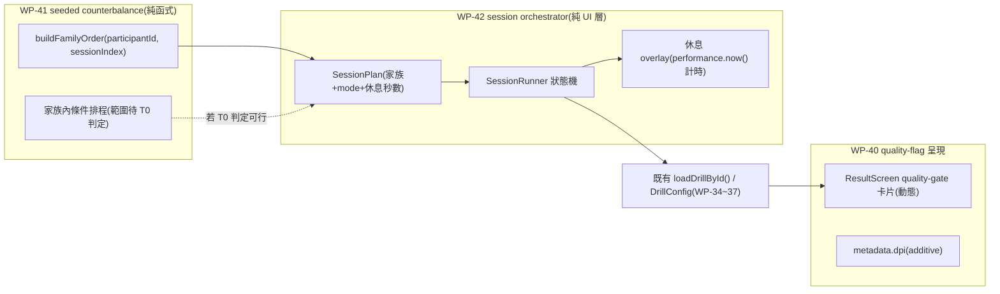

# 階段 G(stage7)執行計畫 — 選手測試流程前端優化(quality-flag 呈現 / session orchestrator / seeded counterbalance)

> **本檔狀態:🟡 規劃已採納(2026-08-25,[DECISIONS.md](../../DECISIONS.md) GD-24)**。格式沿用 [exec-plan/README.md](../../README.md) 與 [stage6 README](../../completed/stage6/README.md) 的 tech-spec 慣例(WP 拆解 / 里程碑 / 相依圖 / Open Questions)。**採納不代表 WP 子資料夾已展開**(比照 stage4/stage5/stage6 慣例):WP-40~42 各自的 `wp-N-*/` 子資料夾於各 WP 自己的 T0 讀碼時才展開,本檔目前即為完整 tech spec。
> 觸發:使用者提出「選手測試流程(pilot 階段版)」施測 SOP 草稿(對話紀錄,尚未落檔為獨立文件),要求盤點現有前端能否支撐該流程並提出優化方向;經數輪討論定案 FR-G9(Session Plan 的兩類可調性)後,使用者於 2026-08-25 指示依建議拍定執行計畫。
> 與 stage6 的關係:stage6(`completed/stage6/`,WP-33~39)已於 2026-08-25 交付、M16 達成、`protocolVersion=1.0.0` 暫定凍結(GD-23)。本階段**不修改**stage6 已交付的任何協定/指標邏輯,只處理「一場測試怎麼被操作」;不硬相依 M16 的正式宣告動作本身。
> 文件語言:繁體中文,術語保留英文(D4)。

---

## 0. 背景與讀碼依據

2026-08-25 對 `src/` 做的讀碼稽核(非本檔杜撰,逐項有檔案佐證)發現:stage6(WP-33~39)交付的是**四個測試家族的引擎/指標能力**,但使用者施測 SOP 描述的「一整場測試怎麼跑」這層**幾乎不存在**。六項具體落差:

| # | SOP 要求 | 讀碼發現 | 證據 |
|---|---|---|---|
| 0-1 | 家族→休息→家族的 session 排程 | **不存在**。每個 drill 各自獨立載入,沒有任何跨家族排程層 | [`main.ts:930`](../../../../src/main.ts#L930) `loadDrillById()` 一次載一個;[`ProtocolRunner.ts:76-145`](../../../../src/display/ProtocolRunner.ts#L76-L145) 只排序**單一 drill 內部**條件(如解析度模式),非跨家族 |
| 0-2 | 家族順序 / 家族內條件用 seeded 區塊隨機化,避免疲勞系統性偏誤 | **不存在**。現有 seed 皆是單一 drill 內部的目標/排程隨機性,repo 內無 shuffle / counterbalance / Latin-square 邏輯 | `pilotConfigs.ts` 的 `pilotSeed()`、[`SimLoop.ts:716`](../../../../src/loop/SimLoop.ts#L716) `createRan1(seed)` 皆為單一 drill 範疇 |
| 0-3 | 熱身(Practice)→ 正式(Assessment)可切換 | `mode` 是**寫死在每個 `DrillConfig` 裡的靜態欄位**,非 runtime 切換([`hold_click_v1.ts:42`](../../../../src/drill/hold_click_v1.ts#L42) 等皆硬編 `mode: 'assessment'`) | WP-33 progress.md 記載此構念交付前 `rg "Assessment\|Practice mode\|feedbackPolicy" src` 零命中 |
| 0-4 | 匯出後先看 quality flags 再決定要不要重測 | **只有殼**。[`ResultScreen.ts:383`](../../../../src/ui/ResultScreen.ts#L383) 的 "Quality gate" 卡片值**寫死成 `'ok'`**;`lateEventCount`/`bufferOverflow`/`recorderOverflow`/`validity.*`/`suspect` 只寫進匯出 JSON,肉眼開檔案才看得到 | `ResultScreen.ts:373-386`(`createDiagnosisSummary`)、`metadata.ts:105-123`(旗標欄位定義) |
| 0-5 | 個人 session history / 相容比較 | **有,但刻意保守**。WP-38 T3 已交付 [`HistoryView.ts`](../../../../src/ui/HistoryView.ts):手動選多個匯出 JSON,顯示相容 session 的中位數/變異,**沒有趨勢箭頭、沒有持久化**(C-D3 精神下的刻意設計,不建議急著補) | wp-38 progress.md |
| 0-6 | 一次性環境 metadata(DPI/sensitivity/FOV/refresh rate/...) | 除 DPI 外皆已有欄位:`protocolVersion`/`participantId`(metadata.ts:65,76)、`sensitivity`/`fovDeg`(:90,99)、`displayHz`(:87)、`movementModel = 'cs2-source'`(:92,即 `gameMovementProfile`)。**DPI 完全沒有欄位** | `metadata.ts`;`rg "dpi"` 僅命中 `dPitch`/`dYaw` 等無關字串 |

**與 stage6 的關係(刻意區隔,避免範圍污染)**:stage6/WP-39 的 `pilotConfigs.ts` 解決的是「**校準要測哪些參數值**」(近/中/遠距離候選、可見門檻候選…);本提案解決的是「**一場測試怎麼被操作**」(家族順序、休息、品質旗標即時可見)。兩者正交,不重疊、不修改 stage6 已交付的協定/指標邏輯。**stage6 已於 2026-08-25 完整交付**(`completed/stage6/`,WP-33~39 全部 T-exit ✅,M16 驗收清單 F 全 12 項通過,`STAGE6_PROTOCOL_VERSION=1.0.0`/`DIAGNOSIS_THRESHOLDS_V1` 已於 [GD-23](../../DECISIONS.md) provisional 凍結)——本提案的上游門檻已滿足,但**不硬相依** M16 這個宣告動作本身,因為操作流程層不改變協定凍結狀態。

---

## 1. 需求(Requirements)

### 1.1 Functional Requirements

| # | 需求(系統必須…) | 映射 |
|---|---|---|
| FR-G1 | `ResultScreen` 的 quality-gate 卡片必須讀取**真實匯出旗標**(`lateEventCount`/`bufferOverflow`/`recorderOverflow`/`validity.corridorExceeded`/`validity.perfFloor`/`suspect`)並即時呈現,不得硬編固定值;任一旗標觸發時套用既有 `--warn` token(aim-analyst-ui skill) | WP-40 |
| FR-G2 | 一次性 session metadata 補 `dpi` 欄位(additive),與既有 `sensitivity`/`fovDeg`/`displayHz` 同一區塊記錄 | WP-40 |
| FR-G3 | 新增一個**純 UI/DOM 層**(D1)的 session 排程模組:給定「家族清單 + 每項的 mode + 休息秒數」的 session plan,依序驅動既有 `loadDrillById()` 載入對應協定,家族之間插入休息倒數 overlay | WP-42 |
| FR-G4 | Session plan 第一步預設載入對應家族的 Practice-mode `DrillConfig` 作熱身;若某家族目前沒有 Practice 變體,必須在 T0 讀碼中列出缺口,不得假設存在 | WP-42 |
| FR-G5 | 休息 overlay 需可設定秒數、顯示倒數,且不得阻斷資料匯出流程(休息期間不寫入任何 sim/`SharedState` 狀態) | WP-42 |
| FR-G6 | 新增一個純函式模組:`buildFamilyOrder(participantId, sessionIndex)` 決定性地產生四家族出場順序,使同一選手跨 session 輪替,禁用 `Math.random`,比照既有 `createRan1` seeded 模式 | WP-41 |
| FR-G7 | 家族內條件(L/R、近/中/遠、象限)的區塊隨機化**range 待 T0 判定**——若四個協定的既有 seed 已經決定了呈現序列(而非可被外部二次排程的獨立維度),FR-G7 範圍縮小為「記錄現況、不做二次排程」,並把差距記回 open question,而非假裝已解決 | WP-41 |
| FR-G8 | Session plan 的可調參數(trial 數、休息秒數、家族清單)集中在一個具名 config 常數,呼應 WP-39 的 pilot-candidate 具名常數紀律,便於日後只換數值不動邏輯 | WP-42 |
| FR-G9 | Session Plan 總覽允許測試操作者在**開始前**設定兩類參數,兩者可調性不同:① **家族子集**(勾選要跑哪幾個家族,對應 SOP「聚焦診斷時可只跑該家族但仍需跑滿平衡條件」)——自由勾選,不動任何凍結數值;② **session-plan preset**(trial 數/休息秒數的具名組合,例如 `pilot-default`)——**只能選既有具名 preset,不得自由輸入數字**,避免破壞相容比較鍵與 pre-registration 紀律(GD-5/GD-8/GD-20)。所選 preset 必須 additive 寫入匯出 metadata(例如 `sessionPlanPreset`),不得靜默套用 | WP-42 |

### 1.2 Non-functional Requirements

| 類別 | 量化需求 |
|---|---|
| 引擎純度 | 本階段全部落在 UI/orchestration 層;`src/sim`、`SharedState`、`HitDetector`、`TargetManager` 不得被引用或修改(GD-6 精神延伸——這層甚至不碰場景,純粹是「載哪個 config、算休息秒數」) |
| 決定性 | `buildFamilyOrder`/家族內排程(若 FR-G7 範圍成立)必須是純函式、同輸入同輸出;不得使用 `Date.now()`/`Math.random()` |
| 不污染既有回歸 | 四個測試家族既有的決定性回歸測試(WP-34~37 T-exit 交付)必須**零修改全綠** |
| 技術棧 | 純 TS + DOM overlay(D1),沿用 aim-analyst-ui skill 的 token/元件慣例;不引入框架、不新增 Python 依賴 |
| 文件語言 | 繁體中文,術語保留英文(D4);新術語(`SessionPlan`/`buildFamilyOrder`/…)於各 WP T-exit 回寫 CONTEXT.md(新增 §K) |

### 1.3 Constraints(硬約束;沿用 CLAUDE.md §4,不逐條重抄)

- **D1**:UI 層維持純 TS + DOM overlay,不引入框架。
- **GD-6 精神延伸**:orchestration 層不得讀寫 sim/`SharedState`;休息 overlay 只是計時器 + DOM 顯示。
- **C-D4 精神延伸**:既有構念(`AssessmentMode`/`qualityGateStatus`/各家族既有 seed)不得有第二定義;`SessionRunner` 只是既有 `loadDrillById()` 呼叫的排程器,不重新定義任何協定內部語意。
- **禁 `Date.now()` / `Math.random()`**:休息倒數計時器用 `performance.now()`;排程隨機性一律 seeded。

---

## 2. 系統設計(Technical Design)

### 2.1 System boundary

**In scope**:`src/ui/ResultScreen.ts`(quality-gate 卡片動態化)· `src/data/metadata.ts`(DPI additive 欄位 + session setup 表單)· 新增 `src/session/`(`sessionSchedule.ts` 家族/條件排程純函式、`SessionRunner.ts` orchestrator UI)· `src/main.ts`(接線:提供 session plan 選單,取代/包裹既有單一 drill 選單)。

**Out of scope**(附觸發條件):

- **WP-39 pilot config 工具本身**——不修改 `src/pilot/pilotConfigs.ts` 或凍結數值;觸發 = 未來校準參數需要調整,那是 stage6 的維護範圍。
- **WP-38 診斷規則/`HistoryView.ts` 的邏輯本身**——`HistoryView.ts` 手動多檔比對是刻意設計(C-D3),不在本階段擴充趨勢箭頭/持久化;觸發 = 累積足夠 session 且教練工作流明確需要自動化歷史。
- **新增 Practice-mode `DrillConfig`(若 T0 發現缺口)的協定內部邏輯**——WP-42 T0 只負責**盤點**缺口並記錄,若需要新增 Practice 變體視工程量另開子任務,不在本提案假設已完成。
- **跨玩家排名 / 單一總分**——框架 v1(stage6)明文不做,本階段不改變這條紅線。

### 2.2 資料流



### 2.3 關鍵設計決策(已採納;細節仍由各 WP 自己的 T0 讀碼覆核)

#### (a) Session Orchestrator 只做「選哪個 config、算休息秒數」,不新增任何協定語意

`SessionRunner` 的職責邊界跟 `main.ts` 現有的 `loadDrillById()` 一樣淺——它只是把「使用者手動點選下一個 drill」這個動作換成「依 session plan 自動排程」。**不得**在這層引入任何 sim tick、SharedState 讀寫或協定專屬邏輯,避免重演「UI 層意外變成第二套引擎邏輯」的風險。

#### (b) 家族內條件的區塊隨機化,先讀碼再拍板(FR-G7 的誠實態度)

四個協定(`hold_click_v1`/`hold_track_v1`/`spider_shot_v1`/`counterstrafe_reversal_v1`)目前各自有自己的 seeded schedule(如 `spiderShotV1.spiderShot.seed`、`holdTrackV1.sequence.seed`)。**尚未確認**這些 seed 決定的是「協定內部生成序列」還是「外部可覆寫的呈現順序」——如果是前者,WP-41 對條件層級的介入可能與協定既有決定性測試衝突,必須先讀碼再判斷 FR-G7 的可行範圍,不能假設兩者相容。這一點刻意保留為 WP-41 T0 的讀碼產出,而非本提案預先斷言。

#### (c) Session Plan 的兩類可調性:家族子集自由勾選,數值參數只能選 preset

FR-G9 的核心是**不對稱的可調性**,不是「這個畫面能不能編輯」的單一是非題:

- **家族子集**——勾掉某個家族只是「不排它進 session plan」,四個協定各自的內部邏輯與決定性完全不受影響,可以放心做成自由勾選。
- **trial 數 / 休息秒數**——這些數字一旦可以現場自由輸入,兩個既有紀律會同時被繞過:① 相容比較鍵(`compatibilityKey.ts`)沒有把「這次用了幾個 trial」當作可比較性的一部分,若操作者隨手改數字,同一 `protocolVersion` 下的 session 可能悄悄變得不可比較卻無人察覺;② GD-20 的教訓是「臨時調參數直到資料好看」的行為必須被結構性擋掉,而非只靠操作者自律。做法是把可選集合收斂成具名 preset(如 `pilot-default`),UI 只能選,不能填數字;新增 preset 需要走跟 WP-39 凍結常數一樣的「新增具名常數 + 記 progress/DECISIONS」流程,不是使用者可以在畫面上隨手做的事。

#### (d) Spider Shot 的「量」參數形狀與其他三家族不同,preset 設計不能假設四家族共用同一套欄位

讀碼 [`spider_shot_v1.ts`](../../../../src/drill/spider_shot_v1.ts) 確認:Spider Shot v1 的「量」是**單一總目標數**(`targets.count`/`endCondition.value`,現凍結為 20)+ **時間上限 backstop**(`timing.timeLimitMs`,現 120000),不是「每個條件格 N 個 trial」——因為 v1 目前**只有一個** `D_deg`/`W_deg` 條件格(15°、hitbox 1×2×1u,GD-23 已凍結),20 個目標怎麼分派到四個象限由 `spiderShot.seed` 排程決定,不是操作者按格設定的數字。相對地,`hold-click`/`hold-track`/`counterstrafe` 三家族的「量」概念更接近「每個條件格(L/R × 近中遠,或每側)重複幾次」。

**對 FR-G9/WP-42 T1 的設計含意**:`SessionPlan` preset 的資料結構**不能**對四個家族假設同一套「trial 數」欄位形狀;Spider Shot 的 preset 分支型別是 `{ targetCount, timeLimitMs }`,其餘三家族是 `{ trialsPerCell }` 之類的形狀。這是 discriminated union,不是共用介面硬套——若日後 Spider Shot 也需要「每格 trial 數」這個維度(多個 `D_deg`/`W_deg` 水準),那是 stage6 尚未解的 **OQ-S6-4** 範疇,stage7 不能越俎代庖替 Spider Shot 新增條件格,只能反映協定當下已有的參數形狀。

#### (e) 熱身(Practice)可能不是「切換既有 config 的 mode」,而是「載入另一個 Practice 專屬 config」

因為 `mode` 是靜態欄位而非 runtime 切換(§0-3),熱身步驟最務實的做法是:如果協定已有 Practice 變體(目前只確認 `counterstrafe-free-v1` 是),直接載入它;若沒有,**不要**臨時在 orchestrator 層 monkey-patch `mode`(那會製造第二個「這是 Practice」的判定路徑,違反 C-D4 精神)。WP-42 T0 的讀碼產出決定其餘三個家族是否需要新增 Practice 變體,以及那件事的工程量。

### 2.4 Failure modes

| 觸發 | 影響 | 處理 |
|---|---|---|
| WP-41 T0 發現條件層級排程與協定既有 seed 衝突,FR-G7 無法如提案所寫實作 | 家族內「區塊隨機化避免疲勞偏誤」的 SOP 要求只能停在「記錄現況」層級,無法真正實作二次排程 | 誠實記錄於 WP-41 progress.md 與本檔 open question,縮小 WP-41 範圍為「只做家族順序」,不得為了湊功能而破壞協定既有決定性回歸 |
| `SessionRunner` 為了方便,直接讀寫 `SharedState` 或在 orchestrator 層算 tick | 違反引擎純度(§1.2),埋入第二套隱性狀態機,未來難以稽核 | T0 entry-gate 明文要求:orchestrator 的所有邏輯必須可用「純 DOM timer + 呼叫既有 `loadDrillById()`」描述,任何超出此邊界的實作方式觸發設計重審 |
| 三個家族(hold-track/spider-shot/counterstrafe)沒有 Practice 變體,WP-42 臨時 monkey-patch `mode` 欄位 | 製造第二個「這是 Practice」判定路徑,污染 WP-33 已凍結的 Assessment/Practice 契約 | WP-42 T0 只盤點缺口,不在 orchestrator 層繞過契約;新增 Practice 變體視為需要另外拍板的工程量,不隱藏在本階段內悄悄做掉 |
| Quality-gate 卡片動態化時,誤把 `suspect` 之外的觀測性欄位也當作「阻擋繼續測試」的硬性錯誤 | 可能讓測試操作者對可接受的邊界情況(如單一 tick 的 late input)過度反應、頻繁重測,浪費 session 時間 | WP-40 T1 明確區分「顯示警示」與「建議重測」兩個層級,不是任何非 `ok` 都等同「這筆資料作廢」 |
| Session Plan 總覽的 trial 數/休息秒數改成自由數字輸入(而非 preset 選單) | 相容比較鍵沒有把這些數字納入判定式,操作者可能無意間讓同一 `protocolVersion` 下的 session 互不可比較;也重新打開「調參數到資料好看為止」的門(GD-20 要防的事) | FR-G9/WP-42 T1 的 DoD 明文:UI 只能選既有具名 preset,不得渲染任何自由數字輸入框;新增 preset 走 WP-39 凍結常數同一套「新增具名常數 + 記錄」流程 |

### 2.5 Concurrency model

**N/A(沿用既有單 rAF 超級迴圈,ADR-2)**。orchestrator 的休息計時與 session plan 推進皆在既有 render loop 內以 `performance.now()` 輪詢,不新增 worker/背景執行緒。

---

## 3. WP 索引(⬜ 未開始 · 🟡 進行中 · ✅ 完成;**規劃已採納,子資料夾待各 WP 自己的 T0 展開**)

| WP | 子資料夾(各 WP T0 時展開) | 目標 | 優先序 | 里程碑 | 相依 | 估時(粗估) | 狀態 |
|---|---|---|---|---|---|---|---|
| **WP-40** | [`wp-40-quality-flag-visibility/`](wp-40-quality-flag-visibility/README.md)(✅ 完成) | `ResultScreen` quality-gate 卡片動態化(讀真實旗標)+ metadata 補 DPI 欄位 | 1 | — | 無(獨立) | 1–1.5d | ✅ 完成 |
| **WP-41** | [`wp-41-seeded-counterbalance/`](wp-41-seeded-counterbalance/README.md)(✅ 完成) | 純函式:`buildFamilyOrder` 決定性家族順序;FR-G7 判定關閉(記錄現況,不實作二次排程) | 2 | — | 無(獨立,可與 WP-40 並行) | 1–2d(依 T0 判定範圍浮動) | ✅ 完成 |
| **WP-42** | [`wp-42-session-orchestrator/`](wp-42-session-orchestrator/README.md)(🟡 已展開,待 T0) | `SessionRunner`:session plan 狀態機 + 休息 overlay + 熱身步驟 + 家族子集/preset 選擇(FR-G9);T3 接入 WP-41 排程 | 3 | **M17** | WP-41(僅 T3 接線相依;T0~T2 可用手動固定順序先行) | 規劃稿原估 2–3d;WP-42 T0 讀碼發現 `availableDrills` 可達性缺口(見 [wp-42 README §0-2](wp-42-session-orchestrator/README.md#0-讀碼對帳規劃階段2026-08-25決定本-wp-淨新增工作量)),上修為 3–4.5d | 🟡 已展開,待 T0 |

**合計估時(粗估,未讀碼)**:4–6.5 dev-days。各 WP 展開時需自己的 T0 entry-gate 讀碼覆核此估時(比照 stage4/stage6 慣例,規劃稿估時不是承諾)。

---

## 4. 里程碑門控

| 里程碑 | 完成條件(已採納;細節由 WP-42 T-exit 定稿為驗收清單 G) | 對應 WP | 意義 |
|---|---|---|---|
| **M17**(stage7 交付,草案) | quality-gate 卡片對任一真實旗標即時反應且非硬編;session orchestrator 可無人工介入跑完「熱身→四家族→收操」全流程,休息計時正確;`buildFamilyOrder` 同 participantId 跨 sessionIndex 產生不同排列且可重現;既有四家族決定性回歸測試零修改全綠;DPI 進入匯出 metadata | WP-42 | 選手測試 SOP 的「怎麼操作一整場測試」在前端有實際支撐,不再需要人工排班 + 事後扒 JSON |

---

## 5. 相依圖

```
WP-40(quality-flag 呈現,獨立)
WP-41(seeded counterbalance,獨立;T0 判定 FR-G7 範圍)──┐
                                                        ├→ WP-42 T3(接入排程)
WP-42 T0~T2(手動固定順序骨架,不等 WP-41)───────────────┘
```

- WP-40/41/42 的 T0~T2 三線可並行(檔案熱區互不重疊:40 動 `ResultScreen.ts`/`metadata.ts`,41 是全新純函式模組,42 是全新 orchestrator 模組)。
- **僅 WP-42 T3(把手動順序換成 WP-41 的 seeded 排程)硬相依 WP-41 T-exit**;在此之前 WP-42 可用寫死的固定家族順序先驗證 orchestrator 骨架本身。

---

## 6. 任務拆解(初稿;採納後各 WP T0 讀碼回寫偏離,沿用 stage4/stage6 先例)

### WP-40 quality-flag-visibility(優先序 1;1–1.5d)

| Task | Scope | Definition of Done | Risk |
|---|---|---|---|
| T0 entry-gate | 讀 `ResultScreen.ts:373-386`、`metadata.ts:105-123` 旗標定義、既有 session setup 表單(若存在)的擴充點 | 缺口清單記 progress;零程式碼 | Low |
| T1 | Quality-gate 卡片改讀真實旗標,依「警示」vs「建議重測」分級(§2.4 失效模式) | 單元測試:各旗標觸發/未觸發情境對應正確卡片內容與 `--warn` token | Low |
| T2 | `metadata.ts` additive 新增 `dpi`;若有 session setup 表單則補輸入欄位 | 既有匯出決定性 baseline 零重錄;新欄位單元測試綠 | Low |
| T-exit | `npm run test:ci` exit 0;`analysis-*.md` 或 CONTEXT.md 視需要回寫 | — | — |

### WP-41 seeded-counterbalance(優先序 2;1–2d)

| Task | Scope | Definition of Done | Risk |
|---|---|---|---|
| T0 entry-gate | 讀四個協定(`hold_click_v1`/`hold_track_v1`/`spider_shot_v1`/`counterstrafe_reversal_v1`)既有 seed 用途,判定 FR-G7(家族內條件排程)是否可行、範圍多大 | 判定記 progress(比照 WP-34 T0 spike 格式);零程式碼 | Med(判定結果直接決定後續 task 範圍) |
| T1 | `buildFamilyOrder(participantId, sessionIndex)` 純函式 + 決定性測試(同輸入同輸出、不同 sessionIndex 產生不同排列) | 單元測試:seed 相同 → 排列逐位相同;seed 不同 → 排列不同 | Med |
| T2 | 依 T0 判定結果:若可行,實作家族內條件排程;若不可行,只記錄現況並關閉/縮小 FR-G7 | 視 T0 判定分岔;若縮小範圍,回寫本檔 open question | Med~High(視 T0 結果) |
| T-exit | `npm run test:ci` exit 0;既有四家族決定性回歸零修改全綠 | — | — |

### WP-42 session-orchestrator(優先序 3;entry = 可與 WP-40/41 並行,T3 需 WP-41 T-exit;2–3d)

| Task | Scope | Definition of Done | Risk |
|---|---|---|---|
| T0 entry-gate | 讀 `main.ts` 現有 `availableDrills`/`loadDrillById()` 介面;盤點四個家族哪些已有 Practice 變體(目前只確認 `counterstrafe-free-v1`) | 缺口清單記 progress;零程式碼 | Low |
| T1 | `SessionPlan` 型別 + `SessionRunner` 狀態機(手動固定家族順序版,不等 WP-41);驅動既有 `loadDrillById()`;Session Plan 總覽加**家族子集勾選**(自由)+ **session-plan preset 選單**(FR-G9,只能選既有具名 preset,不得渲染自由數字輸入);所選 preset additive 寫入匯出 metadata | 單元/整合測試:狀態機依序推進、不跳過任何一項;preset 切換有對應單元測試;既有單一 drill 選單流程零破壞 | Med |
| T2 | 休息 overlay(`performance.now()` 倒數 + DOM 顯示,沿用 aim-analyst-ui token) | 手動驗收:倒數精準、不寫入 sim/SharedState | Low |
| T3 | 接入 WP-41 的 `buildFamilyOrder`,取代手動固定順序 | 單元測試:session plan 的家族順序來源可追溯到 `buildFamilyOrder` 輸出 | Low(依賴 WP-41 已驗證) |
| T-exit(M17) | 驗收清單 G(`docs/operational/acceptance-stage-g.md`,新)全項通過 | `npm run test:ci` exit 0 | — |

---

## 7. Open Questions(OQ-S7-3/4/5 已隨採納拍板關閉;OQ-S7-1/2 留待對應 WP 的 T0 讀碼,屆時轉入各 WP progress.md 追蹤)

| # | 問題 | 建議 / 待決 | Owner | 未決影響 |
|---|---|---|---|---|
| ~~**OQ-S7-1**~~ | ~~四個協定的既有 seed 是否已經決定「家族內條件呈現順序」,使 FR-G7(外部區塊隨機化)與協定既有決定性測試衝突~~ | ✅ **關閉(2026-08-25,WP-41 T0/T-exit)**:三協定(hold-click/hold-track/counterstrafe)無可排序維度,seed 只影響 spawn 延遲抖動;Spider Shot 雖有真實 azimuth 隨機性,但覆寫價值不足以納入本 WP 範圍。詳見 [wp-41 progress.md D-41.1/D-41.2](wp-41-seeded-counterbalance/progress.md) | 研究者 | unblocked;WP-41 交付範圍收斂為僅 FR-G6 |
| **OQ-S7-2** | `hold-track`/`spider-shot`/`counterstrafe-cued` 是否需要新增 Practice-mode `DrillConfig` 變體供熱身使用 | WP-42 T0 讀碼盤點;若需要,工程量另計,不隱藏在本階段估時內 | 研究者 | 決定熱身步驟的實際涵蓋範圍 |
| ~~**OQ-S7-3**~~ | ~~Session plan 的休息秒數/trial 數是否要與 stage6 WP-39 的 pilot-candidate 常數共用同一個「pilot 態」標記機制,還是各自獨立管理~~ | ✅ **關閉(2026-08-25,採納時拍板)**:獨立管理——orchestration 參數(休息秒數/家族清單)與協定校準參數(D_deg/holdDurationMs 等)是不同層級的數值,共用標記機制會混淆「這是排程參數」與「這是協定凍結參數」兩件事 | 使用者 | unblocked;WP-42 T1 的 `SessionPlan` config 型別與 stage6 的 `pilotConfigs.ts` 各自獨立 |
| ~~**OQ-S7-5**~~(承 FR-G9) | ~~Session-plan preset 選單預設要不要限制成「僅研究者角色可見/新增」,或任何測試操作者都能在既有 preset 間切換~~ | ✅ **關閉(2026-08-25,採納時拍板)**:「切換既有 preset」對任何操作者開放(不影響 pre-registration,只是選一組已審過的組合);「新增/修改 preset 本身」限研究者,比照 WP-39 凍結常數的變更門檻(改 preset 定義 = 改協定 layer,需走 DECISIONS.md) | 使用者 | unblocked;WP-42 T1 UI 不需要區分操作者/研究者角色,只需區分「選 preset」與「編輯 preset 原始碼」兩個不同操作介面(後者不在本階段 UI 範圍內) |
| ~~**OQ-S7-4**~~ | ~~本提案採納後,WP 編號(WP-40~42)、里程碑(M17)、階段字母是否需要正式記入 exec-plan/README.md §2/§3/§4/§6 與新開一筆 GD 決策~~ | ✅ **關閉(2026-08-25)**:已採納,依 GD-15「先採納先得」取字母 **G**(A~F 已用);[DECISIONS.md](../../DECISIONS.md) **GD-24** 記錄本次採納;[exec-plan/README.md](../../README.md) §2/§3/§4/§6 與 [docs/MAP.md](../../../MAP.md) §3 已同步更新 | 使用者 | unblocked |

---

## 8. 文件對帳清單

- [x] [DECISIONS.md](../../DECISIONS.md):新開 **GD-24** 記錄 stage7 採納、WP-40~42 / M17 編號分配、階段字母 G、FR-G9 preset 分層決策。(2026-08-25 本次)
- [x] [exec-plan/README.md](../../README.md):§2 加階段 G 索引表;§3 加 M17;§4 相依圖擴充;§6 目錄慣例加 `active/stage7/`。(2026-08-25 本次)
- [x] [docs/MAP.md](../../../MAP.md):§3「進行中(`active/`)」補上 stage7;§3.2 加階段 G 索引。(2026-08-25 本次)
- [x] [CONTEXT.md](../../../CONTEXT.md):WP-40 T-exit 新增 **§L**(`QualityFlagId`/`QualityFlagSeverity`/`dpi`)——原計畫寫「§K」已被 WP-39 佔用(OQ-S7-8),故本次落地為 §L。(2026-08-25)
- [x] [CONTEXT.md](../../../CONTEXT.md):WP-41 T-exit 新增 **§M**(`TestFamilyId`/`buildFamilyOrder`)。(2026-08-25)
- [ ] [CONTEXT.md](../../../CONTEXT.md):WP-42 新術語(`SessionPlan`/…)於其 T-exit 回寫,續接 **§N 起**(§M 已被本次 WP-41 佔用)。
- [ ] `docs/operational/acceptance-stage-g.md`(新,WP-42 T3/T-exit 起稿/定稿)。
- [ ] 依 §3 表格展開 `wp-40-quality-flag-visibility/`、`wp-41-seeded-counterbalance/`、`wp-42-session-orchestrator/` 三個子資料夾(各含 README/task-checklist/progress/T0~T-exit)——**待各 WP 實際開工時才展開**,不在本次採納動作內。
