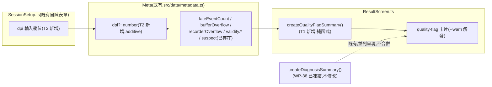

# WP-40 — quality-flag-visibility:`ResultScreen` 真實旗標呈現 + metadata 補 DPI

> stage7 執行計畫的 WP 子資料夾。上層 spec:[../README.md](../README.md) §1(FR-G1/FR-G2)、§3、§6。
> Companion:[task-checklist.md](task-checklist.md) · [progress.md](progress.md)

| | |
|---|---|
| **目標** | 交付 FR-G1(`ResultScreen` 新增一組讀取**真實匯出旗標**的 quality-flag 卡片,取代目前完全不存在的呈現;任一旗標觸發套用 `--warn` token)+ FR-G2(`metadata.ts` additive 新增 `dpi` 欄位,與既有 `sensitivity`/`fovDeg`/`displayHz` 同一區塊記錄) |
| **里程碑** | 無獨立里程碑;與 WP-41 一起是 **M17**(WP-42 T-exit)的前置,但本身無阻塞相依 |
| **相依** | 無(獨立;stage7 README §5 標記可與 WP-41/42 T0~T2 並行) |
| **對應 FR** | FR-G1 + FR-G2 |
| **估時** | 1–1.5 dev-days([../README.md §3](../README.md)) |
| **狀態** | ⬜ 待開工(本檔為 T0 展開前的規劃稿,依 stage4/stage6 慣例) |

---

## 0. 讀碼對帳(規劃階段,2026-08-25;決定本 WP 淨新增工作量)

> 動筆前對 `src/ui/ResultScreen.ts`、`src/data/metadata.ts`、`src/ui/SessionSetup.ts`、`src/main.ts`、`.claude/skills/aim-analyst-ui/assets/tokens.css` 的讀碼結果,確認 stage7 README §0-4/§0-6 的落差描述在目前 `src/` 上仍然成立,並找出比 stage7 README 更細的實作接點。

| # | stage7 README 假設 | 讀碼發現 | 對本 WP 的影響 |
|---|---|---|---|
| **0-1** | `ResultScreen.ts:383` 的 "Quality gate" 卡片值寫死成 `'ok'` | 確認成立,但**這張卡片是 WP-38 的 `diagnosis-quality-gate-status`**——[`createDiagnosisSummary()`](../../../../../src/ui/ResultScreen.ts#L361-L389) 內,屬於 WP-38 已凍結的封閉 `DIAGNOSIS_METRIC_IDS`(C-D4 保護的既有構念,見 [wp-38 README §2④](../../completed/stage6/wp-38-diagnosis-recommendation/README.md))。它描述的語意是「診斷評估是否在 quality gate 通過後才執行」——一旦 `diagnosis.status === 'ok'` 分支被走到,這件事本身即為真,寫死並非 bug,只是**與 FR-G1 要的東西不是同一件事**。 | **FR-G1 不得修改 `DIAGNOSIS_METRIC_IDS` 或 `createDiagnosisSummary()`**(違反 C-D4 既有構念不得有第二定義)。必須新增一組**獨立、additive** 的 quality-flag 呈現路徑,消費 `Meta` 的原始旗標欄位,不是包裝/覆寫 WP-38 的診斷卡片。 |
| **0-2** | `lateEventCount`/`bufferOverflow`/`recorderOverflow`/`validity.corridorExceeded`/`validity.perfFloor`/`suspect` 只寫進匯出 JSON,`ResultScreen` 無讀取管線 | 確認成立。[`Meta`](../../../../../src/data/metadata.ts#L80-L138) 欄位定義齊全(`lateEventCount:number`、`bufferOverflow`/`recorderOverflow`/`suspect:boolean`、`validity?: {corridorExceeded, perfFloor, recorderOverflow, bufferOverflow}`),但 [`ResultScreenHandle.show()`](../../../../../src/ui/ResultScreen.ts#L64-L69) 簽名只吃 `(metrics, promoted?, diagnosis?)`,完全不接 `Meta`。兩個呼叫點 [`main.ts:788`](../../../../../src/main.ts#L788)(dev test harness)與 [`main.ts:1222`](../../../../../src/main.ts#L1222)(正式流程)在呼叫時**當下範疇內都已經有 `payload`/`payload.meta`**(`buildCurrentExportPayload()`/`forceExportJSON()` 的回傳值),接線成本低——是新增一個 additive 第 4 參數,不是重新設計資料流。 | T1 的介面設計可直接以 `payload.meta` 的子集作為輸入,不需要新的資料管線;`show()` 簽名 additive 加第 4 個 optional 參數,兩個呼叫點同步補上。 |
| **0-3** | FR-G1 要求「任一旗標觸發套用既有 `--warn` token」 | `--warn: #f5a623`(注解:「suspect / overflow flag（bufferOverflow、recorderOverflow…）」)確實已在 [`tokens.css:29`](../../../../../.claude/skills/aim-analyst-ui/assets/tokens.css#L29) 定義,與 FR-G1 的旗標清單完全對應。**但 `ResultScreen.ts` 目前所有卡片一律用裸 hex inline style**(`renderCard()`,見 [ResultScreen.ts:326-359](../../../../../src/ui/ResultScreen.ts#L326-L359)),沒有任何 `:root` CSS variable 注入,也沒有引用 `tokens.css`。 | T1 必須决定「引入 `tokens.css` 的 `--warn` 變數」還是「複製其色值並註記來源」——引入整份 token stylesheet牽動全頁其餘卡片配色(可能超出本 WP 範圍),複製色值又要避免變成第二個顏色定義來源。T0 需要拍板,傾向後者(單一具名常數 `QUALITY_FLAG_WARN_COLOR = '#f5a623'` + 註解指回 `tokens.css:29`),避免範圍蔓延到整頁視覺改版。 |
| **0-4** | `metadata.ts` 完全沒有 `dpi` 欄位 | 確認成立(`rg "dpi"` 僅命中 `dPitch`/`dYaw` 等無關字串)。`sensitivity`/`fovDeg`/`displayHz` 三者都是 `Meta` 頂層欄位,由 `collectMeta()`([metadata.ts:199](../../../../../src/data/metadata.ts#L199))在 [`main.ts:426-436`](../../../../../src/main.ts#L426-L436)(`buildCurrentExportPayload()`)組裝,`sensitivity`/`fovDeg` 來源是 `settingsPanel.sensitivity`/`settingsPanel.fov`(runtime 設定面板,可程式讀取);`displayHz` 來源是 `measureDisplayHz()`(可量測)。**DPI 不可能用同樣方式取得**——滑鼠 DPI 是外部硬體設定,瀏覽器沒有 API 可讀。 | DPI 必須走**自陳(self-report)**路徑,與 [`SessionSetupValues`](../../../../../src/ui/SessionSetup.ts#L8-L17) 現有的 `monitorModel`/`panelInches`/`viewingDistanceCm` 同一機制(顯示硬體自陳),而非 `sensitivity`/`fovDeg` 的「程式可讀」機制——即使 FR-G2 說「同一區塊記錄」,指的是 `Meta` 頂層欄位位置,**不是**同一資料來源機制。T2 需要在 `SessionSetup.ts` 新增 `dpi?: number` 欄位 + 表單輸入,再由 `main.ts` 併入 `collectMeta({..., dpi: sessionSetupValues?.dpi})`。 |
| **0-5** | 個人歷史/匯出解析(`sessionHistoryLoader.ts`,WP-38 T2)對新欄位是否需要改動 | 讀碼未發現任何欄位白名單機制會拒絕未知欄位——`Meta` 是單一 interface,parse 端(`collectMeta`/其消費者)只驗證**必要**欄位,新增 optional 欄位不影響既有匯出的向後相容(WP-38 T2 DoD 的「既有匯出決定性 baseline 零重錄」先例可直接沿用)。 | T2 DoD 沿用 WP-38 T2 同款斷言:既有(無 `dpi`)匯出檔案的解析/相容比較行為零改變;新欄位只在 `SessionSetupValues` 提供時才出現。 |

**結論**:FR-G1 與 FR-G2 都是**低風險、無新幾何/無新指標構念**的 additive 工作,零觸碰 sim/`SharedState`/指標推導層,零違反 GD-6/C-D4。真正需要 T0 拍板的兩個小決策是(a)`--warn` 顏色的取值方式(§0-3)、(b)`dpi` 自陳欄位的表單措辭與合理範圍驗證(§0-4,如「100–32000 DPI」這類 UI 層面的輸入邊界,非科學凍結常數)。

---

## 1. 需求對應

| FR | 內容 | 落點 |
|---|---|---|
| FR-G1 | `ResultScreen` 新增 quality-flag 卡片,讀取真實匯出旗標(`lateEventCount`/`bufferOverflow`/`recorderOverflow`/`validity.corridorExceeded`/`validity.perfFloor`/`suspect`),不得硬編固定值;任一旗標觸發套用 `--warn` 色;明確區分「顯示警示」與「建議重測」兩個層級(stage7 README §2.4 失效模式) | T1 |
| FR-G2 | `metadata.ts` additive 新增 `dpi` 欄位,與既有 `sensitivity`/`fovDeg`/`displayHz` 同一 `Meta` 頂層區塊記錄;`SessionSetup.ts` 補自陳輸入欄位 | T2 |

### 1.1 範圍

**In scope**:

```
src/ui/ResultScreen.ts   ← ADD 封閉 QUALITY_FLAG_IDS + createQualityFlagSummary() + show() additive 第 4 參數   [T1]
src/main.ts              ← MODIFY 兩個 resultScreen.show() 呼叫點補 qualityFlags 引數;collectMeta 補 dpi         [T1/T2]
src/data/metadata.ts     ← ADD Meta.dpi?: number(additive)+ CollectMetaArgs.dpi?: number + 驗證                  [T2]
src/ui/SessionSetup.ts   ← ADD SessionSetupValues.dpi?: number + 表單數字輸入欄位                                [T2]
docs/operational/*.md    ← 視 T-exit 需要,判斷是否新增契約文件或補充既有 analysis-*.md(T0 判定,見 §7 OQ)          [T-exit]
```

**Out of scope**(附觸發條件):

- **WP-38 `DIAGNOSIS_METRIC_IDS`/`createDiagnosisSummary()` 的任何修改**——`diagnosis-quality-gate-status` 卡片是 WP-38 已凍結契約,語意正確(見 §0-1),本 WP 不得觸碰;觸發 = 若未來需要合併兩張卡片的呈現位置,那是獨立的 UI 佈局決策,需另開 DECISIONS.md 條目。
- **`sensitivity`/`fovDeg`/`displayHz` 既有欄位的驗證/來源邏輯**——本 WP 只新增 `dpi`,不修改既有三者。
- **`tokens.css` 整份注入 `ResultScreen`**——若 T0 判定需要,範圍會蔓延到全頁配色改版,超出本 WP 估時;觸發 = 若後續 WP 需要系統性套用 aim-analyst-ui token,另開工作項。
- **`suspect`/`validity.*` 欄位本身的計算邏輯**——本 WP 只**呈現**既有欄位,不改變其產生方式(`main.ts:426-455` 的既有邏輯零修改)。
- **DPI 用於任何指標計算(如換算 eDPI/cm-per-360)**——框架 v1 與 stage7 均未要求;`dpi` 純粹是 additive 記錄欄位,供研究端事後查閱,不接入任何 `src/metrics/*` 運算(C-D4 精神延伸:不得無故新增第二套感度換算)。

### 1.2 資料流(本 WP 新增部分)



---

## 2. 關鍵契約(T0 待凍結項;以下為讀碼後的建議方向,非最終定案)

### ① Quality-flag 卡片是獨立於 WP-38 診斷卡片的新呈現單元(承 §0-1)

`QUALITY_FLAG_IDS` 是一組**新的**封閉 metric id 清單,比照 `PROMOTED_METRIC_IDS`/`DIAGNOSIS_METRIC_IDS` 的既有型式(C-D3 精神:封閉詞彙表,不允許呈現層隨意生字串 id),但**不與**兩者共用同一個陣列或 union type。`ResultScreenHandle.show()` 的第 4 個參數是 additive optional,呼叫端不傳時(例如尚未升級的測試 fixture)呈現層必須有明確的「未提供」狀態,不得假設一定有值。

### ② 兩層嚴重度:「顯示警示」≠「建議重測」(承 stage7 README §2.4 失效模式表)

不是任一旗標非 `false`/`0` 就等同「這筆資料作廢」。初判分兩層(T1 讀碼後可調整,但必須明確定義,不得語意含混):

| 旗標 | 建議層級 | 理由(初判,T1 拍板) |
|---|---|---|
| `suspect` | **建議重測** | 已是 `main.ts` 既有邏輯的 OR 聚合觀測性錯誤(experiment session 中途退出全螢幕、或 frame p95 超效能地板),語意上就是「這個 run 可能不可信」 |
| `recorderOverflow` | **建議重測** | recorder arena 溢位代表**遺失資料**(非旗標式警示,是真的少記了),下游指標推導可能不完整 |
| `bufferOverflow` | 警示 | 輸入 ring buffer 溢位,可能只影響極少數 tick,不必然使整份資料不可用 |
| `lateEventCount > 0` | 警示 | 個別輸入事件延遲抵達,通常是效能地板前兆,非結構性資料遺失 |
| `validity.corridorExceeded` | 警示 | 玩家逸出走廊是**純觀測**(KI-004/S1 T3 K-3 決議),場景幾何不影響命中判定,不是「資料作廢」訊號 |
| `validity.perfFloor` | 警示 | 效能地板觀測拆解,與 `suspect` 已涵蓋的 p95 判斷是同一觀測不同粒度,重複顯示但不應重複判定為重測 |

**T1 DoD 必須明確產出一個 `overallSeverity: 'ok' | 'warn' | 'retest-recommended'` 彙總值**,而不是把六個布林值原樣丟給呈現層讓使用者自己判斷。

### ③ `--warn` 顏色取值:具名常數 + 註解指回 token 來源,不整份注入 tokens.css(承 §0-3)

```ts
// src/ui/ResultScreen.ts                                                      [T1,新增]
/** 對齊 aim-analyst-ui skill tokens.css `--warn`(suspect / overflow flag)。 */
const QUALITY_FLAG_WARN_COLOR = '#f5a623';
```

不引入 `<link>`/`@import` 或整份 `:root` 變數注入——那會讓 `ResultScreen` 其餘既有卡片(裸 hex)與新卡片(CSS var)呈現方式不一致,屬於超出本 WP 範圍的視覺改版。

### ④ `dpi` 自陳欄位:比照 `panelInches` 的數字輸入型式(承 §0-4)

```ts
// src/ui/SessionSetup.ts                                                      [T2,additive]
export interface SessionSetupValues {
  participantId: string;
  sessionLabel?: string;
  monitorModel?: string;
  nativeW?: number;
  nativeH?: number;
  panelInches?: number;
  viewingDistanceCm?: number;
  selfReportUncertain?: boolean;
  dpi?: number;   // 新增:滑鼠 DPI 自陳(外部硬體設定,瀏覽器無法讀取)
}
```

```ts
// src/data/metadata.ts                                                        [T2,additive]
export interface Meta {
  // …既有欄位
  sensitivity: number;
  fovDeg?: number;
  // …
  dpi?: number;   // 新增:與 sensitivity/fovDeg/displayHz 同一頂層區塊,來源 = SessionSetupValues.dpi(自陳)
}
```

輸入邊界(UI 驗證用,非科學凍結常數,比照 `panelInches`/`viewingDistanceCm` 的 `NATIVE_MIN`/`NATIVE_MAX` 型式):初判 `DPI_MIN = 100`、`DPI_MAX = 32000`(市售滑鼠常見範圍上緣),T2 執行時可依實際輸入需求調整,不需要走凍結常數升版流程(這不是效度凍結參數,是表單防呆邊界)。

---

## 3. Failure modes

| 觸發 | 影響 | 處理 |
|---|---|---|
| T1 誤把 `diagnosis-quality-gate-status`(WP-38)當作要修的卡片,直接改寫 `createDiagnosisSummary()` | 違反 C-D4(既有構念不得有第二定義),破壞 WP-38 已凍結的 `DIAGNOSIS_METRIC_IDS` 契約與其既有測試 | T0 entry-gate 明文將 §0-1 的區分寫入 DoD 首項;T1 的程式碼變更必須是**新增檔案內的新函式/新常數**,`git diff` 對 `createDiagnosisSummary()` 應為空 |
| Quality-flag 卡片把任一非 `ok` 旗標都渲染成「建議重測」 | 測試操作者對可接受的邊界情況(如單一 tick 的 late input)過度反應、頻繁重測,浪費 session 時間(stage7 README §2.4 已列此風險) | T1 DoD 明文區分兩層嚴重度(§2②),測試覆蓋「只有 `lateEventCount=1`,其餘皆 false」不得產出 `retest-recommended` |
| `dpi` 欄位被誤用於任何指標計算(如換算 eDPI) | 違反 C-D4 精神(無故新增第二套感度換算構念),且 DPI 自陳資料未經校驗,拿去做量化推論會污染效度 | T2 DoD 明文:`dpi` 只出現在 `Meta`/`SessionSetupValues`/表單,`rg "\.dpi\b" src/metrics` 必須零命中 |
| 既有(無 `dpi`/無 qualityFlags)匯出檔案或測試 fixture 在新增 additive 欄位後解析失敗 | 破壞既有回歸測試,違反「既有匯出決定性 baseline 零重錄」紀律 | T1/T2 DoD 各自要求既有 fixture 零修改的情況下 `npm run test:ci` 全綠;新欄位測試用**新增**的合成案例覆蓋,不修改既有 fixture 檔案 |
| `--warn` 色值(`#f5a623`)與 `tokens.css` 未來版本的 `--warn` 定義漂移(各自維護一份色碼) | 兩份色碼來源不同步,長期造成視覺不一致 | T1 在具名常數旁加註解指回 `tokens.css:29` 的行號/用途說明(§2③已示範);若 `tokens.css` 之後改色,靠人工比對更新,不做自動同步機制(超出本 WP 範圍) |

---

## 4. Task 索引

| Task | 檔案 | Objective | 相依 | Risk | 估時 |
|---|---|---|---|---|---|
| **T0** | [T0-entry-gate.md](T0-entry-gate.md) | 覆核 §0 讀碼發現在開工當下仍成立;拍板 §2①②③④ 四個小決策;零程式碼 | 無 | Low | 0.25d |
| **T1** | [T1-quality-flag-card.md](T1-quality-flag-card.md) | `ResultScreen.ts` 新增 `QUALITY_FLAG_IDS` + `createQualityFlagSummary()` + `show()` additive 第 4 參數;兩個嚴重度層級;`main.ts` 兩處呼叫點接線 | T0 | Low | 0.5–0.75d |
| **T2** | [T2-dpi-metadata.md](T2-dpi-metadata.md) | `metadata.ts` additive `dpi`;`SessionSetup.ts` 補自陳表單欄位;`main.ts` `collectMeta` 接線 | T0(可與 T1 並行,檔案熱區不重疊) | Low | 0.25–0.5d |
| **T-exit** | [T-exit-gate.md](T-exit-gate.md) | 驗收 FR-G1/FR-G2;`npm run test:ci` 全綠;文件對帳(CONTEXT.md 新增 §L、stage7 README 狀態翻轉) | T1 + T2 | — | 0.25d |

T1/T2 檔案熱區互不重疊(T1 動 `ResultScreen.ts` + `main.ts` 的 `show()` 呼叫點;T2 動 `metadata.ts` + `SessionSetup.ts` + `main.ts` 的 `collectMeta()` 呼叫點),可並行;T-exit 需等兩者都完成才能做端到端驗收與 `main.ts` 最終彙整(兩處改動都落在同一個 `buildCurrentExportPayload()`/`show()` 呼叫周邊,需要合併後才能一次性覆核零衝突)。

---

## 5. Interface contracts(T0 讀碼建議;細節由 T1/T2 執行時覆核)

```ts
// src/ui/ResultScreen.ts                                                      [T1,新增]
export const QUALITY_FLAG_IDS = [
  'quality-flag-late-events',
  'quality-flag-buffer-overflow',
  'quality-flag-recorder-overflow',
  'quality-flag-corridor-exceeded',
  'quality-flag-perf-floor',
  'quality-flag-suspect',
] as const;
export type QualityFlagId = (typeof QUALITY_FLAG_IDS)[number];

export type QualityFlagSeverity = 'ok' | 'warn' | 'retest-recommended';

export interface QualityFlagsInput {
  readonly lateEventCount: number;
  readonly bufferOverflow: boolean;
  readonly recorderOverflow: boolean;
  readonly suspect: boolean;
  readonly validity?: {
    readonly corridorExceeded: boolean;
    readonly perfFloor: boolean;
  };
}

export interface QualityFlagCard extends ResultCard {
  readonly severity: QualityFlagSeverity;
}

export function createQualityFlagSummary(flags: QualityFlagsInput): {
  readonly overallSeverity: QualityFlagSeverity;
  readonly cards: readonly QualityFlagCard[];
};

export interface ResultScreenHandle {
  readonly visible: boolean;
  show(
    metrics: Metrics,
    promoted?: PromotedMetrics,
    diagnosis?: DiagnosisResult,
    qualityFlags?: QualityFlagsInput,   // additive 第 4 參數
  ): void;
  hide(): void;
  dispose(): void;
}

// src/data/metadata.ts                                                        [T2,additive]
export interface Meta {
  // …既有欄位不變
  sensitivity: number;
  fovDeg?: number;
  displayHz: number;
  dpi?: number;   // 新增
}

export interface CollectMetaArgs {
  // …既有欄位不變
  dpi?: number;   // 新增,經 requirePositiveFiniteNumber 驗證(若提供)
}

// src/ui/SessionSetup.ts                                                       [T2,additive]
export interface SessionSetupValues {
  // …既有欄位不變
  dpi?: number;   // 新增
}
```

---

## 6. 執行規則

沿用 [exec-plan/README.md §5](../../../README.md):一 task = 一垂直切片 = 一原子 commit;完成即更新 [progress.md](progress.md) 與 [task-checklist.md](task-checklist.md);單一閘 `npm run test:ci`。跨 WP 決策入 [DECISIONS.md](../../../DECISIONS.md),per-WP 決策入本資料夾 `progress.md`(編號 `D-40.n`)。

**本 WP 特有的三條紀律**:

1. **不得修改 WP-38 `DIAGNOSIS_METRIC_IDS`/`createDiagnosisSummary()`**:quality-flag 卡片是獨立新增的呈現單元,`git diff` 對這兩個既有符號必須為空(§0-1/§3 失效模式首項)。
2. **`dpi` 不得流入任何 `src/metrics/*` 計算**:純 additive 記錄欄位,`rg "\.dpi\b" src/metrics` 必須零命中(§3 失效模式)。
3. **兩層嚴重度不得省略**:quality-flag 彙總必須明確產出 `overallSeverity`,不得只是把六個布林值原樣列出讓使用者自行判斷(§2②)。

---

## 7. Open Questions

| # | 問題 | 建議 / 待決 | Owner | 未決影響 |
|---|---|---|---|---|
| **OQ-S7-6**(新) | `--warn` 色值要用具名常數複製(§2③建議)還是引入 `tokens.css` 的 `:root` 變數 | T0 拍板;初判傾向具名常數複製(避免全頁配色改版蔓延) | 研究者/工程 | 決定 T1 的 CSS 實作方式與是否有第二份顏色來源的長期維護風險 |
| **OQ-S7-7**(新) | `dpi` 表單輸入邊界(`DPI_MIN`/`DPI_MAX`)的具體數值 | T2 執行時依實際輸入需求拍板(UI 防呆,非凍結常數,可隨時調整) | 研究者/工程 | 影響表單驗證訊息,不影響資料契約 |
| **OQ-S7-8**(新) | CONTEXT.md 新術語(`QualityFlagId`/`QualityFlagSeverity`/`dpi`)該進哪個章節——stage7 README §8 原計畫寫「新增 §K」,但 §K 已被 WP-39 佔用(`docs/CONTEXT.md` 現況 A~K,WP-39 是最後一個) | 本 WP T-exit 改為新增 **§L**;需回頭修正 [../README.md §8](../README.md) 與未來 WP-41/42 T-exit 的章節號描述(§K→§L) | 研究者 | 若不修正,WP-41/42 T-exit 時可能重複嘗試寫入已被 WP-40 佔用的 §L,造成章節衝突 |

---

## 8. 文件對帳清單

- [ ] [CONTEXT.md](../../../../CONTEXT.md):新增 **§L**(`QualityFlagId`/`QualityFlagSeverity`/`dpi`),同時視需要在 [../README.md](../README.md) §8 註記 §K→§L 修正(OQ-S7-8)。
- [ ] [../README.md](../README.md) §3:WP-40 狀態列翻 ✅。
- [ ] `docs/operational/analysis-*.md`:T0 判定是否需要新增/擴充契約文件(quality-flag 嚴重度分層若視為需要跨文件對齊的分析構念,比照既有 `analysis-diagnosis.md` 慣例;若判定不需要,記錄理由於 progress.md,不強行新增文件)。
- [ ] [DECISIONS.md](../../../DECISIONS.md):若 T0 §2①②③④ 任一決策被判定為跨 WP 影響(例如 §0-1 的「不得修改 WP-38 契約」若引發佈局爭議),另開 GD 條目;目前預期不需要,留待 T0 覆核。
