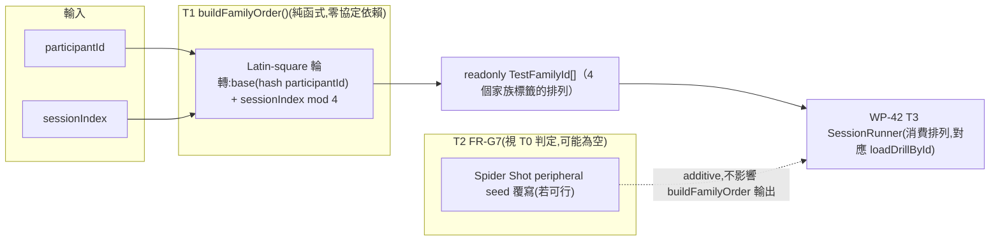

# WP-41 — seeded-counterbalance:`buildFamilyOrder` 決定性家族順序 + FR-G7 範圍判定

> stage7 執行計畫的 WP 子資料夾。上層 spec:[../README.md](../README.md) §1(FR-G6/FR-G7)、§3、§6。
> Companion:[task-checklist.md](task-checklist.md) · [progress.md](progress.md)

| | |
|---|---|
| **目標** | 交付 FR-G6(純函式 `buildFamilyOrder(participantId, sessionIndex)`:決定性產生四家族出場順序,同一選手跨 session 輪替,避免疲勞系統性偏誤)+ 判定 FR-G7(家族內條件區塊隨機化)的實際可行範圍,若可行則交付對應純函式,若不可行則收斂範圍並記錄現況 |
| **里程碑** | 無獨立里程碑;僅 WP-42 T3(接入排程)硬相依本 WP T-exit,其餘為 **M17**(WP-42 T-exit)的前置 |
| **相依** | 無(獨立;stage7 README §5 標記可與 WP-40/42 T0~T2 並行) |
| **對應 FR** | FR-G6 + FR-G7 |
| **估時** | 1–2 dev-days([../README.md §3](../README.md);依 T0 對 FR-G7 的判定範圍浮動) |
| **狀態** | ⬜ 待開工(本檔為 T0 展開前的規劃稿,依 stage4/stage6/WP-40 慣例) |

---

## 0. 讀碼對帳(規劃階段,2026-08-25;決定本 WP 淨新增工作量與 FR-G7 範圍)

> 動筆前對四個協定(`hold_click_v1.ts`/`hold_track_v1.ts`/`spider_shot_v1.ts`/`counterstrafe_reversal_v1.ts`)、`TargetManager.ts`(spawn RNG 消費點)、`compatibilityKey.ts`、`pilotConfigs.ts`(`pilotSeed()` 既有先例)的讀碼結果。目的:直接回答 stage7 README OQ-S7-1——既有 seed 是否已決定「家族內條件呈現順序」,使 FR-G7 與協定既有決定性測試衝突。這一節的發現比 stage7 README §0 更細,足以讓 WP-41 實際開工時的 T0 用**覆核**取代**從零判定**(比照 WP-40 T0 覆核 WP-40 README §0 的先例)。

| # | stage7 README 假設 | 讀碼發現 | 對本 WP 的影響 |
|---|---|---|---|
| **0-1** | 四個協定各自的 `sequence.seed`/`spiderShot.seed` 決定「家族內條件呈現順序」,可能與既有決定性測試衝突(OQ-S7-1) | 逐一讀 [`hold_click_v1.ts:52-56`](../../../../../src/drill/hold_click_v1.ts#L52-L56)、[`hold_track_v1.ts:45-49`](../../../../../src/drill/hold_track_v1.ts#L45-L49)、[`counterstrafe_reversal_v1.ts:11`](../../../../../src/drill/counterstrafe_reversal_v1.ts#L11)、[`spider_shot_v1.ts:19-29`](../../../../../src/drill/spider_shot_v1.ts#L19-L29):四者的 `seed` 都是**寫死在 config 裡的單一字面常數**(34034/35035/37002/36036),不吃 `participantId`/`sessionIndex`,且各自被對應 `*.test.ts` 斷言逐位相等(如 `hold_click_v1.test.ts:15` 斷言 `seed` 恰為 `34034`)。 | 若要讓「家族內條件呈現順序」隨參與者/session 變化,必須在 orchestrator 層**覆寫**這個 seed,而不能直接改動 `src/drill/*.ts` 的預設常數(會打破現有決定性回歸)。這證實 OQ-S7-1 的衝突風險是真實的,但衝突點只在「若要覆寫」這個動作本身,不是「seed 存在」這件事本身。 |
| **0-2** | 四個協定內都有「L/R、近/中/遠、象限」三種條件維度需要區塊隨機化 | 讀 [`DrillConfig.ts:73-86`](../../../../../src/drill/DrillConfig.ts#L73-L86) 確認 `targets.distance` 是**單一數字**,不是多層級陣列;`hold_click_v1.ts:8`/`hold_track_v1.ts:5` 宣告的 `HOLD_CLICK_DISTANCE_LEVELS_V1 = {near, mid, far}` 這類常數,**在凍結的 assessment config 裡只實際用了 `.mid` 一個值**,near/far 目前是未接線的備選常數,不是「多條件呈現、待排序」的既成事實。四個協定的 `sequence.alternation` 也只是單一靜態欄位(`'LR'` 或 `'RL'`),決定的是首側,不是逐次呈現序列。 | FR-G7 描述的「近/中/遠」條件矩陣**在目前的 v1 凍結 assessment config 中並不存在**——沒有多層級可排序。這不是 WP-41 該補的缺口(比照 WP-38 §0-5 對 Spider Shot 單一 D/W 條件格的既有結論、stage6 OQ-S6-4 未解範圍),FR-G7 若照原文字面執行,會變成「排序一個只有一個值的維度」,沒有意義。 |
| **0-3** | seed 驅動的 RNG 就是「呈現順序」的來源,理當可比照 `pilotSeed()` 先例做 per-session 覆寫 | 讀 [`TargetManager.ts:92-134`](../../../../../src/sim/TargetManager.ts#L92-L134):L/R 側是 `nextSide` 每次擊殺**確定性翻面**(`markKilled` 觸發,非 RNG),`spawnRng` 只餵給 `sampleDelayMs()`(spawn 延遲取樣,`spawnDelayMsRange`)與 `sampleSpawnPose()`(`spawnArea` 的 yaw/distance 取樣)。逐協定核對:`hold_click_v1`/`hold_track_v1` 的 `spawnArea` 兩端相等(退化為單點,`[HIDDEN_YAW_DEG, HIDDEN_YAW_DEG]`/`[mid, mid]`),故 seed **只影響 spawn 延遲時間抖動(700–1700ms)**,不影響位置或條件本身;`counterstrafe_reversal_v1` 連 `spawnArea` 都沒有,且 `spawnDelayMsRange:[500,500]` 退化為固定值,seed **實質上不產生任何可觀測隨機性**;只有 `spider_shot_v1` 的 `spiderShot.peripheral.azimuthDegRange:[0,360]` 是**真正的滿量程隨機性**,決定每個 peripheral 目標出現在 8 方位何處([`TargetManager.ts:150-155`](../../../../../src/sim/TargetManager.ts#L150-L155))。 | 四個協定中,**三個(hold-click/hold-track/counterstrafe)目前沒有任何值得做「區塊隨機化」的條件維度**——L/R 已是確定性交替(天然平衡,不需要再排),距離/位置皆退化為單點,counterstrafe 的 seed 甚至是惰性的。唯一有真實「呈現序列」可談的是 **Spider Shot 的 peripheral 方位角**,但它與 0-1 一樣是單一凍結字面常數。 |
| **0-4** | `CompatibilityKey`(WP-33,`checkCompatibility()`/`checkQualityGate()` 消費)可能把 seed 納入相容性判定,覆寫 seed 會使 session 之間變得不可比較 | 讀 [`compatibilityKey.ts:3-14`](../../../../../src/metrics/compatibilityKey.ts#L3-L14):`CompatibilityKey` 的十個欄位(`participantId`/`taskId`/`protocolVersion`/`gameMovementProfile`/`weaponId`/`weaponMode`/`sensitivityFovKey`/`targetConditionCell`/`assessmentFeedbackPolicy`/`qualityGateStatus`)**不含 seed**;`targetConditionCell` 是描述「哪個條件格」的字串(如 `hold:distance=mid`),不是 RNG 種子本身。 | 覆寫 seed(若 FR-G7 判定要做)**不會**破壞 session 間相容性比較,只要 `targetConditionCell` 描述的條件格不變。這解除了 GD-20 式的「臨時調參數污染相容比較」疑慮——與 stage7 README §1.2 NFR 及 WP-42 FR-G9 對 trial 數/休息秒數的顧慮不是同一件事(那是 orchestration 參數,這裡是協定內部 RNG stream,兩者都不進 `CompatibilityKey`,但風險性質不同:trial 數會改變樣本量,seed 只改變呈現序列,不改變樣本量或條件格定義)。 |
| **0-5** | WP-39 `pilotConfigs.ts` 已有「依 index 決定性生成 seed」的先例,可直接沿用给 `buildFamilyOrder` | 讀 [`pilotConfigs.ts:129-131`](../../../../../src/pilot/pilotConfigs.ts#L129-L131):`pilotSeed(familyOffset, index) = PILOT_SEED_ROSTER_START + familyOffset * 1000 + index` 是**純算術**(非 `createRan1`),用於生成不同候選條件格各自的協定 seed,語意是「pilot 校準候選值的索引」,不是「跨 session 平衡呈現順序」。 | `buildFamilyOrder` 不是同一件事(它排序 4 個家族標籤,不生成 RNG seed),但可沿用「純算術、決定性、依 index 展開」的實作風格,不需要引入 `createRan1`(GD-5 的「seeded RNG」要求適用於**取樣**行為;純排列/輪轉不是取樣,用確定性算術即可,比照 `pilotSeed` 先例)。 |

**結論**:FR-G6(`buildFamilyOrder`)是零風險、零協定接觸的全新純函式,建議依 §2① 的 Latin-square 輪轉設計直接交付。FR-G7 的原文字面前提(「L/R、近/中/遠、象限」需要區塊隨機化)在目前 `src/drill/*.ts` 的凍結 assessment config 上**只有 Spider Shot 的 peripheral 方位角一個維度是真實存在且有意義的**,其餘三個協定沒有可排序的條件維度;即使 Spider Shot 這一個維度也是單一凍結字面常數,覆寫它不違反 `CompatibilityKey`,但需要新增一個 additive 的「seed 覆寫」機制,且必須確認不觸碰 `src/drill/spider_shot_v1.ts` 本體(避免打破其既有決定性回歸)。這收斂了 WP-41 實際開工時 T0 的判定範圍(見 §2②),但**本規劃稿不代 T0 拍板**,只把讀碼證據準備好——T0 開工時仍需覆核本節引用的行號/常數是否被其他並行 WP(尤其 WP-40/WP-42)改動,並正式寫入 Decision Log。

---

## 1. 需求對應

| FR | 內容 | 落點 |
|---|---|---|
| FR-G6 | 純函式 `buildFamilyOrder(participantId, sessionIndex)`:決定性產生四家族(`hold-click`/`hold-track`/`spider-shot`/`counterstrafe`)出場順序;同一選手跨 `sessionIndex` 輪替;禁用 `Math.random`,同輸入同輸出、不同 `sessionIndex` 產生不同排列 | T1 |
| FR-G7 | 家族內條件(L/R、近/中/遠、象限)的區塊隨機化,**範圍由 T0 判定**(§0 讀碼已強烈指向「三個協定無可排序維度、一個協定的維度需額外覆寫機制」,T0 需正式覆核並拍板) | T0 判定 + T2(依判定結果實作或關閉) |

### 1.1 範圍

**In scope**:

```
src/session/sessionSchedule.ts   ← ADD TestFamilyId + buildFamilyOrder()(純函式)                              [T1]
src/session/sessionSchedule.ts   ← ADD(若 T0 判定 FR-G7 可行)Spider Shot peripheral seed 覆寫用純函式          [T2]
docs/operational/analysis-*.md   ← ADD/MODIFY FR-G7 判定記錄(可行則寫契約,不可行則寫關閉理由 + 讀碼證據)        [T0/T2/T-exit]
```

**Out of scope**(附觸發條件):

- **`src/drill/*.ts` 四個協定本體的任何修改**——本 WP 只讀取/覆核既有介面,不得修改 `hold_click_v1.ts`/`hold_track_v1.ts`/`spider_shot_v1.ts`/`counterstrafe_reversal_v1.ts` 的預設常數或既有欄位;觸發 = 若 FR-G7 判定需要新增「近/中/遠」多層級條件格,那是協定內部設計變更,需另開 WP,不在本階段隱藏完成(比照 stage6 OQ-S6-4「Spider Shot 條件格擴充」既有的不越俎代庖紀律)。
- **`SessionRunner.ts` / session plan 狀態機本身**——WP-42 職責;本 WP 只交付 `buildFamilyOrder()`(+ 視 T0 判定交付條件排程函式)供 WP-42 T3 匯入,不建立任何 UI 或狀態機。
- **`loadDrillById()` 的家族→drillId 對應表**——WP-42 職責(`buildFamilyOrder` 只回傳家族標籤,不知道也不需要知道對應哪個 `DrillConfig`)。
- **Spider Shot 條件格本身的新增(如多個 `D_deg`/`W_deg` 水準)**——stage6 OQ-S6-4 未解範圍,本 WP 不得越俎代庖;若 FR-G7 判定要做 peripheral seed 覆寫,那只是「換一個已存在的 seed 字面值」,不是新增條件格。
- **DPI/quality-flag 呈現(WP-40)、session orchestrator UI(WP-42)**——檔案熱區不重疊,無需協調。

### 1.2 資料流(本 WP 新增部分)



---

## 2. 關鍵契約(T0 待凍結項;以下為讀碼後的建議方向,非最終定案)

### ① `buildFamilyOrder`:Latin-square 輪轉,不是隨機排列(承 §0-5)

FR-G6 要求「決定性產生四家族出場順序,使同一選手跨 session 輪替,避免疲勞系統性偏誤」——這正是實驗設計裡「counterbalancing / Latin square」要解的問題:目的是讓每個家族在每個出場位置上出現的次數盡量平均,而不是「看起來隨機」。全排列(4!=24 種)shuffle 反而可能在小樣本 session 數下偶然讓某家族總是排最後,不比簡單輪轉更公平。建議:

```ts
// src/session/sessionSchedule.ts                                              [T1,新增]
export const TEST_FAMILY_IDS = ['hold-click', 'hold-track', 'spider-shot', 'counterstrafe'] as const;
export type TestFamilyId = (typeof TEST_FAMILY_IDS)[number];

export function buildFamilyOrder(participantId: string, sessionIndex: number): readonly TestFamilyId[];
```

實作方向(純算術,不需要 `createRan1`,比照 `pilotSeed()` 先例的「決定性算術優先於取樣」風格):以一個確定性字串雜湊把 `participantId` 映射到 `[0, 4)` 的起始輪轉位,再以 `(start + sessionIndex) mod 4` 決定本次輪轉量,對 `TEST_FAMILY_IDS` 做 cyclic rotate。效果:同一選手的 session 0~3 剛好走完 4 種輪轉(每個家族在每個位置各出現一次,教科書式 Latin-square 平衡);不同選手因雜湊起點不同,起始位不同,避免樣本層級的順序混淆。T1 執行時若判斷需要更強的隨機性(而非僅輪轉),必須在 progress.md 記錄理由,不得默默改成 `Math.random()`(GD-5 硬約束)。

**注意**:`TestFamilyId` 是一個**新的**、比 `taskId`/`drillId` 更粗的分組概念(`taskId` 現況 = `payload.meta.drillId`,如 `'hold-click-v1'`,見 [`main.ts:540`](../../../../../src/main.ts#L540);一個家族可能有 practice/assessment 兩個 drillId)。這不是 C-D4 說的「既有構念第二定義」——`taskId`/`drillId` 描述「跑哪個協定變體」,`TestFamilyId` 描述「屬於哪個測試家族」,是 stage7 README 本來就用的分組語彙(§0 表格已用「四個測試家族」措辭),WP-41 只是把它正式收斂成一個封閉型別。

### ② FR-G7 判定:三個協定關閉,Spider Shot 需要額外決策(承 §0-1~§0-3)

T0 開工時建議的判定路徑(§0 已提供證據,T0 需覆核 + 正式拍板):

| 協定 | 建議判定 | 理由 |
|---|---|---|
| hold-click / hold-track | **關閉**——記錄現況,不做二次排程 | `spawnArea` 退化為單點,唯一受 seed 影響的是 700–1700ms 的延遲抖動,不是「條件呈現順序」;L/R 已是確定性交替,天然平衡 |
| counterstrafe(reversal) | **關閉**——記錄現況,不做二次排程 | `spawnDelayMsRange:[500,500]` 退化為固定值,seed 目前不產生任何可觀測隨機性;沒有東西可排 |
| spider-shot | **待 T0 判定**:若採納,新增一個 additive 純函式,依 `participantId`/`sessionIndex` 決定性生成覆寫用的 `spiderShot.seed`,在 orchestrator 層(WP-42 呼叫)clone 一份 `DrillConfig` 套用,不修改 `src/drill/spider_shot_v1.ts` 本體 | 這是四個協定中唯一有真實「呈現序列」(peripheral 方位角)可談的維度;但額外複雜度(clone config、驗證 schema 仍過、確保匯出 metadata 反映實際使用的 seed 而非預設字面值)是否值得,由 T0 權衡估時後決定,不在本規劃稿預先拍板 |

若 T0 判定 spider-shot 分支也關閉,FR-G7 整體收斂為「記錄現況」,T2 退化為純文件任務(比照 wp-38 T0 §2① 面對 OQ-S6-8 時「先讀碼、不假裝已解決」的態度)。

### ③ Spider Shot seed 覆寫(若 T0 判定可行):additive clone,不改本體

```ts
// src/session/sessionSchedule.ts                                              [T2,新增,僅 T0 判定可行時交付]
/** 依參與者/session 決定性生成 Spider Shot peripheral 覆寫 seed;不使用 Math.random（GD-5）。 */
export function buildSpiderShotOverrideSeed(participantId: string, sessionIndex: number): number;

/** clone 一份 DrillConfig,只替換 spiderShot.seed;不得修改傳入物件,不得動其餘欄位。 */
export function withOverriddenSpiderShotSeed(config: DrillConfig, seed: number): DrillConfig;
```

`withOverriddenSpiderShotSeed()` 的輸出仍須通過 `schema.ts` 既有 `validateDrill()`(只是換一個已存在欄位的字面值,不改變欄位結構),且匯出 `meta` 記錄的 seed 必須是**實際使用**的覆寫值,不是 `spider_shot_v1.ts` 的預設 `36036`(否則會造成「metadata 寫的 seed 跟實際跑的不一樣」的稽核缺口)。

---

## 3. Failure modes

| 觸發 | 影響 | 處理 |
|---|---|---|
| T1 為了「更隨機」引入 `Math.random()` 或非決定性雜湊(如依 `Date.now()` 加鹽) | 直接違反 CLAUDE.md §4 硬約束(禁 `Date.now()`/`Math.random()`);`buildFamilyOrder` 失去可重現性,無法給同一參與者同一 session 重跑相同順序 | T1 DoD 明文要求純算術/確定性雜湊,測試以「同輸入兩次呼叫結果逐位相等」覆蓋;`rg "Math.random\|Date.now"` 對新檔案零命中 |
| T0 誤判 FR-G7,在 hold-click/hold-track/counterstrafe 三個協定「找不到維度」的情況下,仍動手修改 `src/drill/*.ts` 硬塞一個新的可排序欄位 | 違反 §1.1 out-of-scope 紀律(協定內部設計變更需另開 WP);且會打破 WP-34/35/37 已凍結的決定性回歸測試 | T0 entry-gate DoD 明文:任何觸碰 `src/drill/*.ts` 既有檔案的改動一律不在本 WP 範圍,`git diff` 對這四個檔案必須為空 |
| Spider Shot seed 覆寫(若實作)遺漏同步更新匯出 `meta`,導致研究端拿到的 seed 值與實際跑的不一致 | 資料溯源缺口——事後無法用記錄的 seed 重現該次 session 的 peripheral 方位序列,違反 GD-5/GD-8 精神 | T2 DoD(若此分支被採納)明文要求:任何覆寫 seed 的路徑,匯出 `meta` 必須反映「實際傳給 `TargetManager` 的 seed」,測試以「覆寫後的 config 跑一次 drill,匯出 meta 的 seed 與覆寫值逐位相等」覆蓋 |
| `buildFamilyOrder` 的 Latin-square 輪轉在 `sessionIndex` 超出 [0,4) 循環週期時(例如選手做了第 5 次 session)被誤認為「用完了,行為未定義」 | 排程在長期追蹤選手時失效或拋錯,影響教練實際使用(選手通常會做遠多於 4 次 session) | T1 DoD 明文:`sessionIndex` 為任意非負整數皆合法(`(start + sessionIndex) mod 4` 天然週期性 wrap),測試覆蓋 `sessionIndex = 4/5/100` 應與 `0/1/0` 分別產生相同排列 |

---

## 4. Task 索引

| Task | 檔案 | Objective | 相依 | Risk | 估時 |
|---|---|---|---|---|---|
| **T0** | [T0-entry-gate.md](T0-entry-gate.md) | 覆核 §0 讀碼發現在開工當下仍成立;正式拍板 §2②(FR-G7 三協定關閉 + Spider Shot 分支去留);零程式碼 | 無 | Med(判定結果直接決定 T2 範圍與估時) | 0.5d |
| **T1** | [T1-build-family-order.md](T1-build-family-order.md) | `sessionSchedule.ts`:`TestFamilyId` + `buildFamilyOrder()`(Latin-square 輪轉)+ 決定性測試 | T0 | Low | 0.5–0.75d |
| **T2** | [T2-condition-schedule-scope.md](T2-condition-schedule-scope.md) | 依 T0 判定:若 Spider Shot 分支關閉,只補文件記錄 FR-G7 現況;若採納,交付 `buildSpiderShotOverrideSeed()`/`withOverriddenSpiderShotSeed()` | T0(可與 T1 並行,檔案熱區有重疊但邏輯獨立,建議 T1 先落地) | Low(關閉分支)~Med(採納分支) | 0.1d(關閉)~0.5d(採納) |
| **T-exit** | [T-exit-gate.md](T-exit-gate.md) | 驗收 FR-G6 全綠 + FR-G7 判定已記錄;`npm run test:ci` 全綠;文件對帳 | T1 + T2 | — | 0.25d |

T0 是本 WP 唯一的風險集中點(§0 已備妥證據,但 T0 仍須正式覆核 + 拍板,不得省略);T1 一旦開工是零依賴純函式工作,可與 T0 判定並行草擬(T1 完全不需要知道 FR-G7 判定結果就能交付)。一 task = 一垂直切片 = 一原子 commit 紀律不變。

---

## 5. Interface contracts(T0 讀碼建議;細節由 T1/T2 執行時覆核)

```ts
// src/session/sessionSchedule.ts                                              [T1,新增]
export const TEST_FAMILY_IDS = ['hold-click', 'hold-track', 'spider-shot', 'counterstrafe'] as const;
export type TestFamilyId = (typeof TEST_FAMILY_IDS)[number];

/**
 * 決定性產生四家族出場順序(Latin-square 輪轉,FR-G6)。同一 participantId + sessionIndex 恆等;
 * 同一 participantId 不同 sessionIndex 依 mod 4 輪轉;不同 participantId 因雜湊起點不同而錯開。
 * 不使用 Math.random()/Date.now()(GD-5)。
 */
export function buildFamilyOrder(
  participantId: string,
  sessionIndex: number,
): readonly TestFamilyId[];

// src/session/sessionSchedule.ts                                              [T2,新增,僅 T0 判定 Spider Shot 分支可行時交付]
/** 依 participantId/sessionIndex 決定性生成 Spider Shot peripheral 覆寫 seed(不使用 Math.random)。 */
export function buildSpiderShotOverrideSeed(participantId: string, sessionIndex: number): number;

/** clone 一份 DrillConfig 並只替換 spiderShot.seed;不修改傳入物件,不觸碰 src/drill/spider_shot_v1.ts 本體。 */
export function withOverriddenSpiderShotSeed(config: DrillConfig, seed: number): DrillConfig;
```

---

## 6. 執行規則

沿用 [exec-plan/README.md §5](../../../README.md):一 task = 一垂直切片 = 一原子 commit;完成即更新 [progress.md](progress.md) 與 [task-checklist.md](task-checklist.md);單一閘 `npm run test:ci`。跨 WP 決策入 [DECISIONS.md](../../../DECISIONS.md),per-WP 決策入本資料夾 `progress.md`(編號 `D-41.n`)。

**本 WP 特有的四條紀律**:

1. **禁 `Math.random()`/`Date.now()`,一律決定性算術或既有 seeded RNG**(CLAUDE.md §4 硬約束延伸):`buildFamilyOrder`/任何 seed 生成函式都必須是同輸入同輸出的純函式,測試以「同輸入兩次呼叫逐位相等」覆蓋。
2. **不得修改 `src/drill/*.ts` 四個協定本體**:本 WP 只讀取/覆核既有介面,`git diff` 對 `hold_click_v1.ts`/`hold_track_v1.ts`/`spider_shot_v1.ts`/`counterstrafe_reversal_v1.ts` 必須為空(§1.1 out of scope 首項/§3 失效模式第二項)。
3. **`TestFamilyId` 不得與 `taskId`/`drillId` 混用或互相替代**:`TestFamilyId` 是家族分組標籤,`taskId`/`drillId` 是協定變體識別;`sessionSchedule.ts` 不得直接 import `src/drill/*.ts` 的任何 `DrillConfig` 常數(WP-42 才是「家族標籤 → 實際 drillId」對應表的落點,§1.1 out of scope 第三項)。
4. **FR-G7 若判定關閉,不得為了「湊功能」保留死程式碼**:若 T0 判定三協定 + Spider Shot 分支皆關閉,T2 只交付文件記錄,不得新增任何未被消費的函式或型別(避免製造無用的第二套排程 API 表面)。

---

## 7. Open Questions

| # | 問題 | 建議 / 待決 | Owner | 未決影響 |
|---|---|---|---|---|
| **OQ-S7-1**(承 stage7 README,本 WP T0 正式關閉) | 四個協定的既有 seed 是否已經決定「家族內條件呈現順序」,使 FR-G7 與協定既有決定性測試衝突 | 本檔 §0/§2② 已備妥證據,建議判定:hold-click/hold-track/counterstrafe 三協定關閉(無可排序維度),Spider Shot 待 T0 權衡估時後拍板;T0 開工時需正式覆核 + 寫入 Decision Log,不可直接照抄本節文字結案 | 研究者 | 決定 T2 的實際交付範圍(純文件 vs. 新增覆寫函式)與 WP-41 估時收斂在 1d 或接近 2d 上緣 |
| **OQ-S7-9**(新) | 若 T0 判定 Spider Shot 覆寫分支值得做,WP-42 的 Session Plan 是否需要额外 UI 让操作者知道「本次 session 用了哪個覆寫 seed」,還是純粹記錄進匯出 metadata 即可,不需要即時呈現 | 初判:不需要即時 UI 呈現(比照既有 seed 從不在 `ResultScreen` 呈現的先例),覆寫 seed 只是研究端事後可稽核的 metadata 欄位;留給 WP-42 T0 讀碼時確認是否有教練工作流需求 | 研究者 | 若答案是「需要呈現」,WP-42 的範圍需要增加一個小的呈現點,影響其估時 |
| **OQ-S7-10**(新) | `buildFamilyOrder` 的 Latin-square 輪轉(僅 4 種排列)是否足夠滿足「避免疲勞系統性偏誤」的統計要求,或需要更強的平衡設計(如同時平衡「哪個家族接在哪個家族後面」的一階順序效應,而不只是位置平衡) | 初判:對 4 個 session 內的位置平衡已足夠達成 SOP 提出的「避免疲勞系統性偏誤」字面要求;若研究端需要更嚴謹的一階順序平衡(比照 experimental-design 的 balanced Latin square),屬於本 WP 之後的加強項,不阻塞 T1 交付基本輪轉版本 | 研究者 | 若答案要求更嚴謹設計,T1 的排列演算法需要重新設計(仍是純函式,不影響型別契約) |

---

## 8. 文件對帳清單

- [ ] [../README.md](../README.md) §3:WP-41 狀態列更新為已展開/完成進度。
- [ ] [CONTEXT.md](../../../../CONTEXT.md):新術語(`TestFamilyId`、`buildFamilyOrder`)於 T-exit 回寫(§L 已被 WP-40 佔用,需與 WP-40 T-exit 協調實際章節號,見 [wp-40 OQ-S7-8](../wp-40-quality-flag-visibility/README.md#7-open-questions))。
- [ ] `docs/operational/*.md`:FR-G7 判定記錄(可行則新增契約,不可行則記錄關閉理由 + 本檔 §0 讀碼證據的精簡版)。
- [ ] [DECISIONS.md](../../../DECISIONS.md):若 T0 判定 Spider Shot 覆寫分支採納且被認為有跨 WP 影響(例如需要 WP-42 配合呈現),另開 GD 條目;目前預期不需要,留待 T0 覆核。
