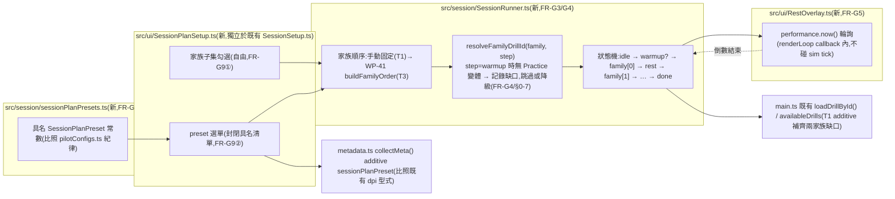

# WP-42 — session-orchestrator:`SessionRunner` 狀態機 + 休息 overlay + 熱身步驟 + 家族子集/preset 選擇

> stage7 執行計畫的 WP 子資料夾。上層 spec:[../README.md](../README.md) §1(FR-G3/FR-G4/FR-G5/FR-G8/FR-G9)、§3、§6。
> Companion:[task-checklist.md](task-checklist.md) · [progress.md](progress.md)

| | |
|---|---|
| **目標** | 交付 FR-G3(session 排程模組:家族清單 + mode + 休息秒數,依序驅動既有 `loadDrillById()`)+ FR-G4(熱身步驟)+ FR-G5(休息 overlay)+ FR-G8(具名 config 常數)+ FR-G9(家族子集自由勾選 + preset 只能選不能填數字);T3 接入 WP-41 `buildFamilyOrder` |
| **里程碑** | **M17**(stage7 交付) |
| **相依** | WP-41(僅 T3 接線相依;T0~T2 可用手動固定順序先行,見 [../README.md §5](../README.md)) |
| **對應 FR** | FR-G3 + FR-G4 + FR-G5 + FR-G8 + FR-G9 |
| **估時** | 規劃稿原估 2–3 dev-days([../README.md §3](../README.md));**本檔 §0-2 讀碼發現一個未被規劃稿記載的缺口(四家族中兩家族的 assessment config 目前完全不在 `main.ts` 的 `availableDrills`/`loadDrillById()` 可達範圍內),補齊這個缺口是 SessionRunner 能運作的前提,估時上修為 3–4.5 dev-days,由 T0 覆核後收斂** |
| **狀態** | ⬜ 待開工(本檔為 T0 展開前的規劃稿,依 stage4/stage6/WP-40/WP-41 慣例) |

---

## 0. 讀碼對帳(規劃階段,2026-08-25;決定本 WP 淨新增工作量)

> 動筆前對 `src/main.ts`(`availableDrills`/`loadDrillById`/`pendingSessionMode`/`sessionSetupForm`/`eligibilityGateScreen`/既有 protocol 啟動按鈕)、`src/display/ProtocolRunner.ts`、`src/display/brTrackingProtocol.ts`、`src/ui/SessionSetup.ts`、`src/drill/DrillRunner.ts`(countdown phase 型式)、`src/data/metadata.ts`(既有 additive 欄位型式)、四個協定各自的 `mode` 欄位與 `counterstrafe_free_v1.ts` 的讀碼結果。目的:找出 stage7 README §0/§2(e) 假設「SessionRunner 只是把手動點選換成自動排程」在目前 `src/` 上是否真的只差「排程」這一層,還是有更底層的可達性缺口。

| # | stage7 README / 既有假設 | 讀碼發現 | 對本 WP 的影響 |
|---|---|---|---|
| **0-1** | `main.ts` 的 `loadDrillById(drillId)` 是「現成、任何協定都能載」的既有能力,SessionRunner 只需要呼叫它 | 讀 [`main.ts:948-974`](../../../../../src/main.ts#L948-L974) 確認 `loadDrillById()` 本體邏輯健全(驗證 scene/drill、重建 `TargetManager`/`DrillRunner`/`SimLoop`),**但它只能載入 `availableDrills` 陣列裡已登記的 id**,查無則 `throw new Error('Unknown drill: ...')`。 | SessionRunner 呼叫 `loadDrillById(familyDrillId)` 前,`familyDrillId` 必須先出現在 `availableDrills`。這把 §0-2 的發現變成一個真正的技術前提,不是文字遊戲。 |
| **0-2** | 四個測試家族(`hold-click`/`hold-track`/`spider-shot`/`counterstrafe`)的 assessment config 已經是「現有能力,只是沒被排程串起來」 | 讀 [`main.ts:114-150`](../../../../../src/main.ts#L114-L150)(`availableDrills` 完整宣告)逐一核對:**只有 `holdClickV1`/`holdTrackV1` 在陣列中**;`spiderShotV1`(`spider_shot_v1.ts`)、`counterstrafeReversalV1`/`counterstrafeFreeV1`/`counterstrafeCuedV1`(`counterstrafe_*_v1.ts`)**完全不在 `availableDrills`**——`rg "spiderShotV1\|counterstrafeReversalV1\|counterstrafeFreeV1\|counterstrafeCuedV1" src/main.ts` 零命中。這四個 config 目前只被各自的 `*.test.ts` 與 `src/pilot/pilotConfigs.ts`(WP-39 校準候選產生器,不驅動實機 UI)消費。 | **這不是 stage7 README 已預見的落差**——README §0/§2(a) 把「SessionRunner 只做排程」當作既定事實,但實際上「spider-shot 家族與 counterstrafe 家族連手動點選都做不到」。SessionRunner 若要真的跑完「熱身→四家族→收操」(M17 驗收條件),**T1 必須先把這兩個家族的 config additive 加入 `availableDrills`**,這件事本身不是排程邏輯,是可達性接線,估時因此上修(見估時列)。 |
| **0-3** | Session 排程需要一個新狀態機,`src/session/SessionRunner.ts` 從零設計 | 讀 [`ProtocolRunner.ts:1-203`](../../../../../src/display/ProtocolRunner.ts) 與其兩個既有消費者 [`resolutionDetectionProtocol.ts`](../../../../../src/display/resolutionDetectionProtocol.ts)/[`brTrackingProtocol.ts`](../../../../../src/display/brTrackingProtocol.ts):`createProtocolRunner<TPayload>()` 已是一個**通用、已測試**(`ProtocolRunner.test.ts`)的多條件排程引擎——`start()`→`beginNextCondition()`→`completeCurrentCondition()`,每個 condition 呼叫 `applyCondition()`(`main.ts` 內實作即呼叫 `loadDrillById()`)。`main.ts` 也已有**現成的接線型式**:`pendingSessionMode: 'session' \| 'resolution-protocol' \| 'br-tracking-protocol'` + 三顆並列啟動按鈕(`experimentButton`/`protocolButton`/`brProtocolButton`)+ `sessionSetupForm.open()` → `eligibilityGateScreen.open()` → `onEnter` 依 `pendingSessionMode` 分派([`main.ts:289-368`](../../../../../src/main.ts#L289-L368))。 | 但 `ProtocolRunner` 有兩個與 SessionRunner 語意不符的地方:①`ProtocolCondition.mode: ResolutionMode` 是必填欄位(`assertReadyState` 會拿它跟 `applyCondition()` 回傳值核對),對「跑哪個測試家族」這個維度是無關欄位,`brTrackingProtocol` 的既有先例是全部塞 `'native'` 繞過去;②**排程推進是手動按鈕觸發**(`beginNextProtocolCondition`/`completeActiveProtocolCondition` 綁在 `protocolNextButton.click`),沒有任何「自動倒數後前進」的既有邏輯,FR-G5 的休息倒數是全新能力。T0 需要正式拍板:重用 `ProtocolRunner` 引擎(容忍 `mode` 欄位的語意不match,取其「已測試的排程骨架」)或另建一個小狀態機(乾淨語意,但重造「驗證 config → loadDrillById → 匯出」這條已驗證的路)。**`pendingSessionMode`/啟動按鈕/`sessionSetupForm→eligibilityGate` 這段既有接線型式無論選哪個引擎都應該沿用**——它是本 repo 對「新增一種 session 啟動方式」已有的標準做法,不是本 WP 該重新發明的部分。 |
| **0-4** | 「休息 overlay」可以比照 `DrillRunner` 既有 countdown phase(`nowMs - countdownStartMs >= config.timing.countdownMs`)的型式實作 | 讀 [`DrillRunner.ts:114-127`](../../../../../src/drill/DrillRunner.ts#L114-L127):countdown 的計時基準是**sim tick 傳入的 `nowMs`**(sim clock,由 `SimLoop`/`realClock` 供給,ADR-4),在 `tick()` 內推進,這是 sim 迴圈的一部分。stage7 README §2.5/CLAUDE.md GD-6 精神延伸明文:orchestration 層**不得**讀寫 `SharedState`/驅動 sim tick。 | 休息倒數不能直接借用 `DrillRunner` 的 countdown 機制(那是 sim 迴圈內部狀態);必須是**獨立於 sim 的計時**——在既有 `renderLoop`(`createRenderLoop((now) => {...})`,[`main.ts:1180`](../../../../../src/main.ts#L1180))的回呼裡以 `performance.now()` 輪詢,純 DOM overlay 更新文字,不呼叫任何 `sharedState`/`drillRunner`/`targetManager` API(§2.5 沿用既有單 rAF 超級迴圈,不新增 worker)。 |
| **0-5** | `SessionSetup.ts` 目前的表單型式(`makeTextField`/`makeNumberField`/`readValues`/`overlayCss`/`cardCss`)可直接沿用給「家族子集勾選 + preset 選單」 | 讀 [`SessionSetup.ts:1-372`](../../../../../src/ui/SessionSetup.ts) 全文:現有型式是**單一步驟表單**(填完直接送出開 eligibility gate),沒有 checkbox 群組或 `<select>` 的既有範例(唯一 checkbox 是單顆 `selfReportUncertain`)。`SessionSetupValues`/`SessionSetupOptions`/`onSubmit` 的形狀是「一次性人口學/顯示器自陳資料」,語意上與「這次要跑哪些家族、用哪個 preset」是不同的表單(前者是每個 session 只填一次的受試者背景,後者是每次啟動 session 都要選的排程參數)。 | Session Plan 的家族勾選 + preset 選單**不應該塞進 `SessionSetup.ts` 既有表單**(語意混雜,且 `SessionSetupValues` 型別會被迫塞入排程參數),應該是一個新的、獨立的小型 UI 單元(可沿用 `overlayCss`/`cardCss`/`makeButton` 等**樣式常數**與**表單 helper 風格**,但不擴充 `SessionSetupValues` 本身)。 |
| **0-6** | `metadata.ts` 的 additive 欄位(FR-G9 要求 `sessionPlanPreset` additive 寫入)沒有既有型式可循 | 讀 [`metadata.ts:80-253`](../../../../../src/data/metadata.ts#L80-L253):`dpi?: number` 已經是一個**現成先例**——`Meta` 選填欄位 + 對應 `CollectMetaArgs` 選填欄位 + `requirePositiveFiniteNumber()` 驗證(若提供)+ `collectMeta()` 內條件式 spread(`...(dpi !== undefined ? { dpi } : {})`)。 | FR-G9 的 `sessionPlanPreset` additive 欄位可直接比照這個型式(字串列舉驗證取代數字範圍驗證),不需要新設計一套 additive-metadata 機制;`dpi` 目前已進 `Meta`/`collectMeta`(WP-40 的一部分已落地或並行進行中),但 `SessionSetupValues` 尚未有對應輸入欄位——這是 WP-40 的範圍,本 WP 不需等待或觸碰,只需確認新增 `sessionPlanPreset` 走同一 additive 慣例、不與 `dpi` 的落地進度耦合。 |
| **0-7** | 四個家族中,只有 `counterstrafe-free-v1` 確認有 Practice 變體(stage7 README §0-3/OQ-S7-2) | `Glob src/drill/*.ts` 逐一核對 `mode` 欄位:`hold_click_v1.ts`/`hold_track_v1.ts`/`spider_shot_v1.ts` 皆硬編 `mode: 'assessment'`,**沒有**對應的 `*_practice_v1.ts` 檔案;`counterstrafe_free_v1.ts:6` 確認 `mode: 'practice'`;`counterstrafe_cued_v1.ts`/`counterstrafe_reversal_v1.ts` 皆為 `assessment`。 | OQ-S7-2 讀碼結論確認:hold-click/hold-track/spider-shot **三個家族目前沒有 Practice 變體**,FR-G4「熱身步驟」對這三個家族在現有 config 下無法比照 counterstrafe 直接載入替代 config;T0 必須拍板熱身步驟對這三個家族的降級行為(例如:略過熱身直接進入 assessment、或明確標示「本家族無熱身」),**不得**在 orchestrator 層 monkey-patch `mode` 欄位(違反 C-D4,stage7 README §2.3(e) 已有此結論)。 |

**結論**:FR-G3/G8(排程模組 + 具名 config 常數)與 FR-G5(休息 overlay)是規劃稿已預見、風險可控的工作;真正把估時往上推的是 §0-2(兩個家族的 assessment config 完全不在既有 UI 可達範圍,必須先補齊)與 §0-7(三個家族沒有 Practice 變體,熱身步驟必須有明確降級語意,不是「補一個 config 就好」)。§0-3 揭露了一個**規劃稿未提及的重用候選**(`ProtocolRunner` + 既有 `pendingSessionMode` 接線型式),T0 必須正式評估是否重用,不能假裝從零開始設計是唯一選項。這些發現直接影響 T1 的範圍與本 WP 估時上緣,已反映在頁首估時列。

---

## 1. 需求對應

| FR | 內容 | 落點 |
|---|---|---|
| FR-G3 | 純 UI/DOM 層的 session 排程模組:給定「家族清單 + 每項 mode + 休息秒數」的 session plan,依序驅動既有 `loadDrillById()`,家族之間插入休息倒數 overlay | T1 |
| FR-G4 | Session plan 第一步預設載入對應家族的 Practice-mode config 作熱身;無 Practice 變體的家族必須明確記錄缺口,不得假裝存在(§0-7) | T1 |
| FR-G5 | 休息 overlay 可設定秒數、顯示倒數,不得阻斷資料匯出流程,休息期間不寫入任何 sim/`SharedState` 狀態 | T2 |
| FR-G8 | Session plan 可調參數(trial 數、休息秒數、家族清單)集中在具名 config 常數 | T1 |
| FR-G9 | 家族子集自由勾選(不動凍結數值)+ session-plan preset 只能選既有具名組合(不得自由輸入數字);preset additive 寫入匯出 metadata | T1 |

### 1.1 範圍

**In scope**:

```
src/main.ts                          ← MODIFY availableDrills additive 補 spider-shot-v1/counterstrafe-reversal-v1/
                                        counterstrafe-free-v1(+視 T0 判定 counterstrafe-cued-v1);
                                        新增 pendingSessionMode 第 4 分支 + 對應啟動按鈕(比照既有 protocol 按鈕型式);
                                        collectMeta 補 sessionPlanPreset                                            [T1]
src/session/SessionRunner.ts         ← ADD SessionPlan 型別 + resolveFamilyDrillId() + SessionRunner 狀態機         [T1]
src/session/sessionPlanPresets.ts    ← ADD 具名 preset 常數(比照 pilotConfigs.ts 具名常數紀律,FR-G8/FR-G9②)          [T1]
src/ui/SessionPlanSetup.ts           ← ADD 家族子集勾選 + preset 選單(獨立於 SessionSetup.ts,§0-5)                  [T1]
src/ui/RestOverlay.ts                ← ADD 休息倒數 DOM overlay(performance.now() 驅動,不碰 sim)                    [T2]
src/data/metadata.ts                 ← ADD Meta.sessionPlanPreset?: string(additive,比照 dpi 型式)                   [T1]
src/session/sessionSchedule.ts       ← MODIFY(T3)匯入 WP-41 buildFamilyOrder(),取代 T1 的手動固定順序                [T3]
docs/operational/acceptance-stage-g.md ← ADD(新)M17 驗收清單                                                        [T-exit]
```

**Out of scope**(附觸發條件):

- **`ProtocolRunner.ts`/`resolutionDetectionProtocol.ts`/`brTrackingProtocol.ts` 本體的任何修改**——即使 T0 判定重用 `ProtocolRunner` 引擎,也只能是「新增一個消費者」,不得修改其既有型別簽名或既有兩個 protocol 的行為;觸發 = 若重用判定需要擴充 `ProtocolCondition` 型別(如把 `mode: ResolutionMode` 改成選填),那是跨三個消費者的破壞性變更,需另開決策記錄,不在本 WP 隱藏完成。
- **`src/drill/*.ts` 四個協定本體的任何修改**——本 WP 只在 `availableDrills` **新增陣列項目**(引用既有 export,不改其內容),不得修改 `hold_click_v1.ts`/`hold_track_v1.ts`/`spider_shot_v1.ts`/`counterstrafe_*.ts` 的既有欄位;觸發 = 若熱身步驟判定需要新增 Practice 變體(hold-click/hold-track/spider-shot),那是協定內部設計變更,需另開工作項,不在本階段假裝已完成(§0-7)。
- **`src/ui/SessionSetup.ts` 既有表單的任何欄位擴充**——家族子集/preset 選擇是獨立的新 UI 單元,不擴充 `SessionSetupValues`(§0-5)。
- **`compatibilityKey.ts`/`CompatibilityKey` 的任何修改**——`sessionPlanPreset` 只進 `Meta` 頂層 additive 欄位,不進相容性判定十個欄位(FR-G9②/stage7 README §2.4 失效模式表已有此紀律)。
- **WP-41 `sessionSchedule.ts` 本身的實作**——T1 用手動固定順序(比照 `TEST_FAMILY_IDS` 陣列 literal 順序)先行,不等待、不預先假設 WP-41 尚未 T-exit 的介面細節;T3 才正式匯入。
- **counterstrafe-cued-v1 是否併入 session plan**——四家族的封閉分組是 `hold-click`/`hold-track`/`spider-shot`/`counterstrafe`,counterstrafe 家族目前有三個 drill 變體(cued/reversal/free);T0 需判定 session plan 的 counterstrafe assessment 步驟該載入 `counterstrafe-reversal-v1` 還是同時涵蓋 `counterstrafe-cued-v1`,若判定只載入其中之一,另一個變體維持現況(不進 `availableDrills`),記入 Open Questions,不擅自擴大範圍替兩者都接線。

### 1.2 資料流(本 WP 新增部分)



---

## 2. 關鍵設計決策(T0 待凍結項;以下為讀碼後的建議方向,非最終定案)

### ① SessionRunner 引擎:新建小狀態機,不重用 `ProtocolRunner`(承 §0-3;T0 需正式覆核)

`ProtocolRunner<TPayload>` 是既有、已測試的通用排程引擎,但兩個結構性不合:(a)`ProtocolCondition.mode: ResolutionMode` 是必填且被 `assertReadyState` 核對的欄位,對「家族排程」這個維度語意不符,唯一既有繞過方式是像 `brTrackingProtocol` 全塞 `'native'`,這會讓型別簽名說謊(欄位存在但語意是「無關」);(b)`beginNextCondition`/`completeCurrentCondition` 是**手動按鈕觸發**,FR-G5 的自動倒數是核心需求,若要在 `ProtocolRunner` 之上疊加自動計時,實際上是在既有引擎外面另包一層狀態機,不會少寫多少邏輯,反而要同時理解兩層狀態(`ProtocolRunner` 的 `current`/`exports` + 本 WP 的倒數 timer)。

**建議**:`SessionRunner` 是一個獨立、更簡單的狀態機(`idle → warmup? → family[i] → rest → family[i+1] → … → done`),**沿用**的是 `main.ts` 既有的**接線型式**(`pendingSessionMode` 多一個分支 + 一顆新啟動按鈕 + `sessionSetupForm → eligibilityGateScreen → onEnter` 既有 pipeline),而不是 `ProtocolRunner` 引擎本體。這讓 `SessionRunner` 的每個 phase 轉換只需要呼叫既有 `loadDrillById()`(比照 §2.3(a) 既有設計決策「只做選 config、算休息秒數」),不需要迁就 `ResolutionMode` 這個無關欄位。T0 若讀碼後認為重用 `ProtocolRunner` 的收益(現成測試覆蓋)大於語意不符的代價,可覆寫此建議,但必須正式記錄理由(Decision Log `D-42.1`),不得沉默選擇。

### ② `availableDrills` 缺口:additive 補齊,不改變既有陣列項目(承 §0-2)

```ts
// src/main.ts                                                                   [T1,additive]
import { spiderShotV1 } from './drill/spider_shot_v1.ts';
import { counterstrafeReversalV1 } from './drill/counterstrafe_reversal_v1.ts';
import { counterstrafeFreeV1 } from './drill/counterstrafe_free_v1.ts';
// counterstrafeCuedV1 視 T0 §1.1 out-of-scope 判定決定是否併入

const availableDrills: AvailableDrill[] = [
  // …既有 9 個項目不變
  { id: spiderShotV1.drillId, label: spiderShotV1.drillId, source: spiderShotV1 },
  { id: counterstrafeReversalV1.drillId, label: counterstrafeReversalV1.drillId, source: counterstrafeReversalV1 },
  { id: counterstrafeFreeV1.drillId, label: counterstrafeFreeV1.drillId, source: counterstrafeFreeV1 },
];
```

這不是「新增協定」——三個 config 早已存在、已通過 `validateDrill()`/`schema.ts`(有各自的 `*.test.ts`),只是從未被登記進 `availableDrills`。additive 陣列擴充不影響既有 9 個項目與既有 `Controls.ts` 下拉選單行為(下拉選單會多三個選項,這是良性的能力擴充,不是破壞性變更)。`sceneId`/`loadOptions` 欄位:讀碼確認這三個 config 皆未使用 `spawnArea`(§0-2 對照 WP-41 §0-3 的讀碼結論:hold-click/hold-track/counterstrafe 的 `spawnArea` 皆退化,spider-shot 走獨立的 `spiderShot` schedule 不需要 `spawnArea`),故三者皆可省略 `loadOptions.clearance`,`sceneId` 省略即沿用 `activeSceneConfig`(既有 fallback 行為),不需要額外場景指定。

### ③ 熱身步驟對三個無 Practice 變體家族的降級語意(承 §0-7)

```ts
// src/session/SessionRunner.ts                                                 [T1,新增]
export type WarmupAvailability = 'available' | 'unavailable';

/** 家族 → practice 變體 drillId 對照;缺席家族回傳 'unavailable',SessionRunner 據此跳過熱身 phase(FR-G4)。 */
export function resolveWarmupDrillId(family: TestFamilyId): { availability: WarmupAvailability; drillId?: string } {
  if (family === 'counterstrafe') return { availability: 'available', drillId: counterstrafeFreeV1.drillId };
  return { availability: 'unavailable' }; // hold-click / hold-track / spider-shot:無 Practice 變體(§0-7)
}
```

`SessionRunner` 狀態機在 `warmup` phase 遇到 `'unavailable'` 時**直接跳到該家族的 assessment step**,UI 需明確顯示「本家族無熱身,直接開始正式測試」(不是靜默跳過讓操作者誤以為熱身已完成)。這是 FR-G4「若某家族目前沒有 Practice 變體,必須在 T0 讀碼中列出缺口,不得假設存在」的直接落實。

### ④ 家族子集 + preset:獨立 UI 單元,preset 只能選(承 §0-5;沿用 stage7 README §2.3(c) 已拍板的不對稱可調性)

```ts
// src/session/sessionPlanPresets.ts                                            [T1,新增,比照 pilotConfigs.ts 具名常數紀律]
export interface SessionPlanPreset {
  readonly id: string;
  readonly restSeconds: number;
  readonly perFamilyTrialShape: Readonly<Record<TestFamilyId, { readonly trialsPerCell?: number; readonly targetCount?: number; readonly timeLimitMs?: number }>>;
}

export const SESSION_PLAN_PRESET_PILOT_DEFAULT: SessionPlanPreset = {
  id: 'pilot-default',
  restSeconds: 60,
  perFamilyTrialShape: {
    'hold-click': { trialsPerCell: /* 沿用既有 config 既定值,不新造數字 */ },
    'hold-track': { trialsPerCell: /* 同上 */ },
    'spider-shot': { targetCount: 20, timeLimitMs: 120000 }, // 沿用 spiderShotV1 既有凍結值
    counterstrafe: { trialsPerCell: /* 同上 */ },
  },
} as const;

export const SESSION_PLAN_PRESETS: readonly SessionPlanPreset[] = [SESSION_PLAN_PRESET_PILOT_DEFAULT];
```

`perFamilyTrialShape` 是 discriminated 形狀(承 stage7 README §2.3(d) 已拍板的決定:Spider Shot 的「量」是 `targetCount`+`timeLimitMs`,其餘家族是 `trialsPerCell`),**不得**假設四家族共用同一個數字欄位。`SessionPlanSetup.ts` 的 UI 只能從 `SESSION_PLAN_PRESETS` 選一筆,不得渲染任何 `<input type=number>`;新增 preset 走本檔新增具名常數 + commit + progress.md 記錄,不是使用者可在畫面上做的事(FR-G9②/OQ-S7-5 已關閉的紀律)。

### ⑤ 休息 overlay:renderLoop 回呼內的 `performance.now()` 輪詢,不建立第二個計時來源(承 §0-4)

```ts
// src/ui/RestOverlay.ts                                                        [T2,新增]
export interface RestOverlayHandle {
  show(remainingMs: number): void;
  hide(): void;
  dispose(): void;
}
```

`RestOverlayHandle.show()` 只負責畫面文字更新(純 DOM),倒數的實際計時邏輯留在 `SessionRunner`(`SessionRunner.poll(nowMs)`,由既有 `renderLoop` 的 `(now) => {...}` 回呼逐帧呼叫,`now` 即既有 rAF 時間源)。`RestOverlay` 不得內建自己的 `setInterval`/`setTimeout`(會製造第二個獨立於 rAF 的時鐘,違反 ADR-2 單迴圈精神);`SessionRunner` 也不得讀寫 `sharedState`/呼叫 `drillRunner.tick()`(GD-6 精神延伸,§0-4 已確認)。

---

## 2.6 建議修復方法總覽(工程師建議;T0 可直接採用,或讀碼後提出異議並記錄覆核理由)

> §2①~⑤ 各自的「建議方向」在此收斂成一張可直接執行的對照表,避免 T0 面對五個平行決策時無所適從。**這是建議,不是拍板**——T0 的職責是覆核每一列在開工當下是否仍然成立,若成立可直接照做並在 Decision Log 記一句「採用本節建議,理由同 README §2.6」,若不成立才需要重新分析。

| 缺口/決策點 | 建議修復方法 | 為什麼 | 若不採用的替代成本 |
|---|---|---|---|
| §0-2 `availableDrills` 缺口(SessionRunner 兩個家族完全打不開) | **Additive 補三個項目**:`spider-shot-v1`/`counterstrafe-reversal-v1`/`counterstrafe-free-v1`;**不含** `counterstrafe-cued-v1`。每個新增項目在 T1 手動跑一次「選取→倒數→目標→擊殺→ended→匯出」全流程,不只憑 TypeScript 編譯過關 | 三個 config 已通過 `validateDrill()`/各自 `*.test.ts`,只是從未被登記進 UI 選單;additive 陣列擴充是風險最低的接線方式,不觸碰既有 9 個項目或 `Controls.ts` 既有行為 | 若跳過手動驗證,`loadDrillById()` 全鏈路(`createSceneManagerWithStatus`/`createTargetManager`/`buildSimLoop`)可能在真正執行期才炸(例如 `spiderShot.seed` 與 `sequence.seed` 互斥檢查),等到 T-exit 端到端驗證才發現,回頭修的成本比 T1 當場驗證高 |
| §2① SessionRunner 引擎選擇(OQ-S7-11) | **新建一個小狀態機**(`idle → warmup? → family → rest → … → done`),**不**重用 `ProtocolRunner<TPayload>`;但**沿用** `main.ts` 既有 `pendingSessionMode` + 啟動按鈕 + `sessionSetupForm → eligibilityGateScreen` 接線型式 | `ProtocolRunner.ProtocolCondition.mode: ResolutionMode` 是必填且被 `assertReadyState` 核對的欄位,語意上與「家族排程」無關,唯一既有繞過方式是塞假值(`brTrackingProtocol` 全塞 `'native'`);且它的推進是手動按鈕觸發,FR-G5 的自動倒數必須另包一層,包了等於沒省——不如直接寫語意乾淨的新狀態機,只借用「已驗證的啟動流程」這個外層接線 | 若硬套 `ProtocolRunner`,§3 失效模式表最後一項的「三種排程共享 `main.ts` 可變狀態,互斥語意需額外守門」風險會實際發生,且未來要拆分兩種語意(resolution/BR protocol vs assessment session)時,程式碼耦合已經深了,重構成本更高 |
| §2③/OQ-S7-2 熱身缺口(三家族沒有 Practice 變體) | **只有 counterstrafe 有真正熱身**(載入 `counterstrafe-free-v1`);hold-click/hold-track/spider-shot 的 warmup phase **直接跳過**並顯示明確訊息(例如「本家族無熱身,直接開始正式測試」) | 新增三個 Practice 變體是協定內部設計變更(`src/drill/*.ts` 本體),超出本 WP 範圍,且會連動觸發既有決定性回歸測試;誠實記錄缺口優於在 orchestrator 層 monkey-patch `mode` 製造假熱身(違反 C-D4) | 若堅持補齊三個 Practice 變體,WP-42 估時會再往上修(需要新開協定設計工作,不是排程層工作),且可能需要拆出獨立 WP,不建議塞進本 WP 隱藏完成 |
| OQ-S7-12 counterstrafe 家族選哪個變體 | 只載入 `counterstrafe-reversal-v1`;`counterstrafe-cued-v1` 維持現況,不進 `availableDrills` | 對齊 stage6 WP-37/WP-39 pilot 校準的既有焦點(`pilotConfigs.ts` 也只處理 `counterstrafeReversalV1`),避免無謂擴大 `availableDrills` 補齊範圍 | 若研究端後續需要 `cued` 變體進 session plan,屆時再開一個 additive 小任務即可,不必在本 WP 預先擴大範圍 |
| OQ-S7-13 preset 數值來源(`perFamilyTrialShape`) | `pilot-default` 的每個家族欄位直接引用該協定既有 `endCondition.value`/`targets.count` 凍結值,不新造數字 | 這些協定目前都只有單一條件格,「總數」與「每格 trial 數」在數學上是同一個數;直接引用避免產生第二套數字來源與既有凍結值分歧(C-D4 精神延伸) | 若研究端要求不同定義(例如未來多條件格時「每格」與「總數」分離),屆時 preset 型別已是 discriminated union,可對應家族擴充,不需要現在重新設計型別 |
| §2⑤ 休息倒數計時 | `performance.now()` 輪詢,掛在既有 `renderLoop((now) => {...})` 回呼內(`SessionRunner.poll(now)`),**不**建立 `setInterval`/`setTimeout`/新 worker | 沿用 ADR-2「三迴圈只透過既有機制溝通、單 rAF 超級迴圈」的紀律,避免第二個獨立於既有渲染節奏的時鐘源,也避免 orchestrator 意外變成第二套隱性狀態機 | 若另開 `setInterval`,休息倒數的時間基準會與既有 rAF/sim clock 脫鉻,在效能地板/背景分頁節流情境下可能與畫面更新不同步,且違反 CLAUDE.md §4 對計時來源單一性的精神 |

---

## 3. Failure modes

| 觸發 | 影響 | 處理 |
|---|---|---|
| T1 直接把 §2② 新增的三個 `availableDrills` 項目當作「順手做」,沒有各自跑一次 dev harness 手動驗證載入成功 | `spider-shot-v1`/`counterstrafe-reversal-v1`/`counterstrafe-free-v1` 從未被 `main.ts` 實際載入過(只被 unit test 用合成物件驗證過 schema),真正走 `loadDrillById()` → `createSceneManagerWithStatus`/`createTargetManager`/`buildSimLoop` 全鏈路可能踩到未預期的執行期錯誤(例如 `spiderShot.seed` 與 `sequence.seed` 互斥檢查、`activeWeaponConfig()` 的武器 id 解析) | T1 DoD 明文要求:三個新增項目各自手動驗證「選單選取 → 倒數 → 目標出現 → 可擊殺 → ended → 匯出成功」全流程至少一次,不只是 TypeScript 編譯通過 |
| `SessionRunner` 為了方便,直接讀寫 `SharedState` 或呼叫 `drillRunner.tick()`/`activeTargetManager` 相關 API 來「順便」推進休息倒數 | 違反引擎純度(stage7 README §1.2 NFR/§2.4 失效模式表已列此風險),埋入第二套隱性狀態機 | T0 entry-gate DoD 明文要求:`SessionRunner`/`RestOverlay` 的 `git diff` 對 `src/sim/*`、`src/state/SharedState.ts`、`src/drill/DrillRunner.ts` 必須為空;任何觸碰這些檔案的實作方式觸發設計重審 |
| 熱身步驟在 hold-click/hold-track/spider-shot 三個無 Practice 變體家族**靜默跳過**,操作者以為已完成熱身 | 選手實際上直接進入正式測試,可能影響資料(冷啟動效應未被熱身消解),且操作者不知道發生了什麼 | T1 DoD:`resolveWarmupDrillId()` 回傳 `'unavailable'` 時,`SessionRunner` 必須觸發一個明確的 UI 訊息(比照既有 `protocolStatus` 文字提示型式),測試覆蓋「三個無熱身家族的 warmup phase 立即轉場並附帶訊息」情境 |
| `sessionPlanPreset` 被誤用於除 metadata 記錄外的任何邏輯分支(例如依 preset id 動態改變 `SIM_HZ`/命中判定) | 違反 C-D4/GD-6 精神,preset 變成第二套隱性協定開關 | T1 DoD:`rg "sessionPlanPreset" src/sim src/metrics` 必須零命中(比照 WP-40 對 `dpi` 的同款守門紀律) |
| T0 選擇重用 `ProtocolRunner`(§2①的替代方案),但未意識到 `assertReadyState` 對 `mode` 欄位的強制核對會導致 `resolutionProtocolRunner`/`brTrackingProtocolRunner` 與新的 assessment session runner 三者的 `applyCondition` 實作出現隱性耦合(共用 `main.ts` 同一批狀態變數如 `activeResolutionMode`) | 三種排程各自假設自己是唯一在跑的 `activeProtocolRunner`,若 UI 允許同時觸發兩種模式,`activeDrillConfig`/`activeResolutionMode` 等共享可變狀態可能被交叉覆寫,產生難以重現的資料污染 | 若 T0 判定重用 `ProtocolRunner`:DoD 必須包含「同時只能有一個 session/protocol 在跑」的守門測試(啟動按鈕在任一模式進行中應 disable 其餘);若 T0 判定新建 `SessionRunner`(§2①建議方向),仍須確認新按鈕與既有三個啟動路徑共享的 `pendingSessionMode`/`experimentSession` 互斥語意不被破壞 |

---

## 4. Task 索引

| Task | 檔案 | Objective | 相依 | Risk | 估時 |
|---|---|---|---|---|---|
| **T0** | [T0-entry-gate.md](T0-entry-gate.md) | 覆核 §0 讀碼發現(尤其 availableDrills 缺口、WP-41 現況);正式拍板 §2①②③④⑤ 五個決策;關閉 OQ-S7-2;零程式碼 | 無(WP-41 T-exit 僅為 T3 前提,不阻塞 T0) | Med(決策①的引擎選擇直接決定 T1 骨架) | 0.5–0.75d |
| **T1** | [T1-session-plan-runner.md](T1-session-plan-runner.md) | `availableDrills` additive 補三個缺口 config;`SessionPlan`/`sessionPlanPresets.ts`/`SessionRunner` 狀態機(手動固定家族順序)+ 熱身降級邏輯;`SessionPlanSetup.ts`(家族子集勾選 + preset 選單);`main.ts` 接線(`pendingSessionMode` 新分支 + 啟動按鈕);`metadata.ts` additive `sessionPlanPreset` | T0 | **Med–High**(涵蓋 §0-2 缺口接線 + 新狀態機 + 新 UI,是本 WP 風險與工作量集中點) | 1.5–2.25d |
| **T2** | [T2-rest-overlay.md](T2-rest-overlay.md) | `RestOverlay.ts`(DOM 倒數顯示)+ `SessionRunner.poll(nowMs)` 接入既有 `renderLoop` 回呼 | T1 | Low | 0.5d |
| **T3** | [T3-family-order-wiring.md](T3-family-order-wiring.md) | 接入 WP-41 `buildFamilyOrder()`,取代 T1 的手動固定家族順序 | T1 + WP-41 T-exit | Low(依賴 WP-41 已驗證) | 0.25–0.5d |
| **T-exit** | [T-exit-gate.md](T-exit-gate.md) | 驗收清單 G(`docs/operational/acceptance-stage-g.md`,新)全項通過;`npm run test:ci` 全綠;文件對帳 | T2 + T3 | — | 0.25d |

T0 是本 WP 最大的風險集中點(§2①引擎選擇決定 T1 骨架形狀);T1 是本 WP 實際工作量最大的 task(§0-2 缺口接線本身就有非瑣碎的手動驗證負擔,見 §3 失效模式首項)。一 task = 一垂直切片 = 一原子 commit 紀律不變。

---

## 5. Interface contracts(T0 讀碼建議;細節由 T1~T3 執行時覆核)

```ts
// src/session/sessionPlanPresets.ts                                            [T1,新增]
export interface SessionPlanPreset {
  readonly id: string;
  readonly restSeconds: number;
  readonly perFamilyTrialShape: Readonly<Record<TestFamilyId, PerFamilyTrialShape>>;
}
export type PerFamilyTrialShape =
  | { readonly trialsPerCell: number }
  | { readonly targetCount: number; readonly timeLimitMs: number };

export const SESSION_PLAN_PRESETS: readonly SessionPlanPreset[];

// src/session/SessionRunner.ts                                                 [T1,新增]
export interface SessionPlan {
  readonly participantId: string;
  readonly sessionIndex: number;
  readonly families: readonly TestFamilyId[];     // 子集,FR-G9①
  readonly presetId: string;                       // FR-G9②
  readonly includeWarmup: boolean;
}

export type SessionRunnerPhase =
  | { readonly kind: 'idle' }
  | { readonly kind: 'warmup'; readonly family: TestFamilyId; readonly availability: WarmupAvailability }
  | { readonly kind: 'family'; readonly family: TestFamilyId; readonly familyIndex: number }
  | { readonly kind: 'rest'; readonly nextFamily: TestFamilyId; readonly remainingMs: number }
  | { readonly kind: 'done' };

export interface SessionRunnerHandle {
  readonly phase: SessionRunnerPhase;
  start(plan: SessionPlan): Promise<void>;
  /** 由既有 renderLoop 回呼逐帧呼叫;推進休息倒數。不讀寫 SharedState/呼叫 drillRunner。 */
  poll(nowMs: number): void;
  advance(): Promise<void>; // 熱身完成/家族完成後手動或倒數結束觸發前進
  dispose(): void;
}

export type WarmupAvailability = 'available' | 'unavailable';
export function resolveWarmupDrillId(family: TestFamilyId): { availability: WarmupAvailability; drillId?: string };
export function resolveFamilyDrillId(family: TestFamilyId): string; // family → assessment drillId(封閉對照表)

// src/ui/SessionPlanSetup.ts                                                   [T1,新增]
export interface SessionPlanSetupOptions {
  readonly presets: readonly SessionPlanPreset[];
  readonly families: readonly TestFamilyId[];
  onSubmit: (selection: { families: readonly TestFamilyId[]; presetId: string; includeWarmup: boolean }) => void;
  parent?: HTMLElement;
}
export function createSessionPlanSetup(options: SessionPlanSetupOptions): { open(): void; close(): void; dispose(): void };

// src/ui/RestOverlay.ts                                                        [T2,新增]
export interface RestOverlayHandle {
  show(remainingMs: number): void;
  hide(): void;
  dispose(): void;
}
export function createRestOverlay(parent?: HTMLElement): RestOverlayHandle;

// src/data/metadata.ts                                                         [T1,additive]
export interface Meta {
  // …既有欄位不變
  sessionPlanPreset?: string;   // 新增,FR-G9②
}
export interface CollectMetaArgs {
  // …既有欄位不變
  sessionPlanPreset?: string;   // 新增
}
```

---

## 6. 執行規則

沿用 [exec-plan/README.md §5](../../../README.md):一 task = 一垂直切片 = 一原子 commit;完成即更新 [progress.md](progress.md) 與 [task-checklist.md](task-checklist.md);單一閘 `npm run test:ci`。跨 WP 決策入 [DECISIONS.md](../../../DECISIONS.md),per-WP 決策入本資料夾 `progress.md`(編號 `D-42.n`)。

**本 WP 特有的五條紀律**:

1. **`SessionRunner`/`RestOverlay` 不得讀寫 `SharedState` 或呼叫 `drillRunner`/`activeTargetManager` 的任何推進方法**:只能呼叫既有 `loadDrillById()` 這一個入口(§2⑤/§3 失效模式第二項);`git diff` 對 `src/sim/*`、`src/state/SharedState.ts` 必須為空。
2. **`availableDrills` 新增項目一律 additive,不修改既有 9 個項目或其消費者 `Controls.ts`/`ProtocolRunner` 的既有行為**(§2②)。
3. **`sessionPlanPreset` 只能是 metadata 記錄欄位,不得流入 `src/sim`/`src/metrics` 任何計算或判定**(§3 失效模式第四項,比照 WP-40 對 `dpi` 的同款紀律)。
4. **新增 preset 走具名常數 + commit + progress.md,UI 不得渲染自由數字輸入**(§2④/FR-G9②/OQ-S7-5 已關閉的紀律)。
5. **熱身缺口(§0-7)不得靜默跳過**:`resolveWarmupDrillId()` 回傳 `'unavailable'` 時必須有對應 UI 訊息,測試覆蓋此分支(§3 失效模式第三項)。

---

## 7. Open Questions(接續 [../README.md §7](../README.md) 與 [wp-41 §7](../wp-41-seeded-counterbalance/README.md#7-open-questions) 的全域編號)

| # | 問題 | 建議 / 待決 | Owner | 未決影響 |
|---|---|---|---|---|
| **OQ-S7-2**(承 stage7 README,本 WP T0 正式關閉) | `hold-track`/`spider-shot`/`counterstrafe-cued` 是否需要新增 Practice-mode `DrillConfig` 變體供熱身使用 | 本檔 §0-7/§2③已備妥證據:三個家族(hold-click/hold-track/spider-shot)目前無 Practice 變體;建議 T0 拍板「本 WP 不新增,熱身步驟對這三家族降級為『無熱身』並明確提示」,新增 Practice 變體另開工作項 | 研究者 | 決定熱身步驟的實際涵蓋範圍;若研究者要求三家族都要有熱身,WP-42 估時需再上修並可能拆出新 WP |
| **OQ-S7-11**(新) | SessionRunner 引擎:新建小狀態機,或重用既有 `ProtocolRunner<TPayload>`(§0-3/§2①) | 本檔建議新建(語意乾淨,`ProtocolRunner.mode: ResolutionMode` 欄位語意不符);T0 需正式覆核並記錄 `D-42.1` | 研究者/工程 | 決定 T1 的骨架設計,若選重用需額外處理 §3 失效模式表最後一項的互斥語意風險 |
| **OQ-S7-12**(新) | Counterstrafe 家族的 session plan assessment 步驟該載入 `counterstrafe-reversal-v1` 還是同時涵蓋 `counterstrafe-cued-v1`(§1.1 out-of-scope 最後一項) | 初判:只載入 `counterstrafe-reversal-v1`(與 stage6 WP-37/WP-39 pilot 校準的既有焦點一致);`counterstrafe-cued-v1` 維持現況不進 `availableDrills`,若研究端需要納入另開範圍 | 研究者 | 決定 T1 `availableDrills` 補齊清單的實際項目數(3 個 vs 4 個) |
| **OQ-S7-13**(新) | `SessionPlanPreset.perFamilyTrialShape` 的實際數值(§2④ `pilot-default` 草稿留白)——`hold-click`/`hold-track`/`counterstrafe` 的 `trialsPerCell` 該沿用哪個既有欄位當作「目前已跑幾次」的基準(這些 config 本身用 `targets.count`/`endCondition.value` 描述總數,不是「每格」) | T1 執行時讀碼確認:若 `trialsPerCell` 語意上就等於既有 `endCondition.value`(因為這些協定目前只有單一條件格),`perFamilyTrialShape` 可以直接引用既有凍結值,不新造數字;若研究端已有不同定義,需要在 T1 進一步澄清 | 研究者 | 影響 `sessionPlanPresets.ts` 是否會意外引入與既有凍結值不一致的第二套數字來源(C-D4 精神延伸風險) |

---

## 8. 文件對帳清單

- [ ] [../README.md](../README.md) §3:WP-42 狀態列更新;M17 驗收清單 G 完成後翻 ✅。
- [ ] [CONTEXT.md](../../../../CONTEXT.md):新術語(`SessionPlan`、`SessionRunner`、`SessionPlanPreset`、`resolveWarmupDrillId`)於 T-exit 回寫(章節號需與 WP-40/41 協調,見 [wp-40 OQ-S7-8](../wp-40-quality-flag-visibility/README.md#7-open-questions))。
- [ ] `docs/operational/acceptance-stage-g.md`(新,T3/T-exit 起稿/定稿)。
- [ ] [DECISIONS.md](../../../DECISIONS.md):若 T0 §2①(引擎選擇)或 §0-2(availableDrills 缺口補齊範圍)被判定為跨 WP 影響(例如影響 WP-39 pilot 工具的既有假設),另開 GD 條目;目前預期不需要(pilotConfigs.ts 消費的是同一批 config 的 export,不受 `availableDrills` 陣列變動影響),留待 T0 覆核。
