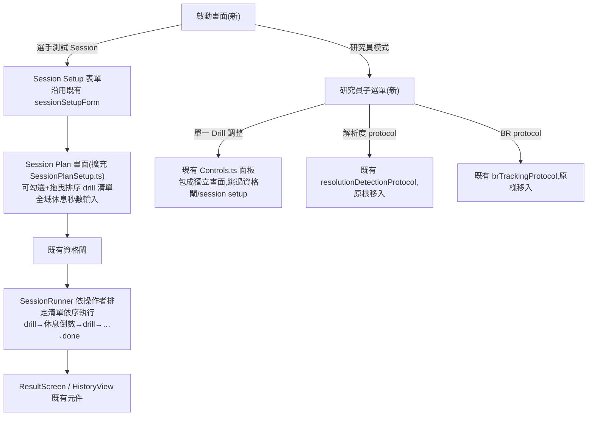

# 階段 H(stage8)提案 — 前端入口重構(選手測試 Session / 研究員模式 兩分岔)

> **本檔狀態:🟡 討論定案,尚未正式採納**。本檔記錄與使用者(電競表現教練)對話後拍板的 UI flow 方向,**尚未**指派 WP 編號 / 里程碑字母 / [DECISIONS.md](../../DECISIONS.md) GD 條目,亦**未**同步 [exec-plan/README.md](../../README.md)、[docs/MAP.md](../../../MAP.md)。這些文件對帳動作依專案慣例(見 stage6/stage7 先例)留到使用者確認要正式開工(T0 讀碼)時一併補上,本檔暫用 **WP-43** 作為文中指稱用的工作代號,非最終編號。
> 觸發:使用者以「電競表現教練」角度,盤點本專案能否用於選手測試,經數輪討論(施測順序/家族範圍/UI flow)後,決定**先不處理個別 drill 的參數細節**,只先把「主要操作入口」收斂成兩條清楚路徑,讓軟體「先可用」。
> 與 stage6/stage7 的關係:**不修改**任何已交付的協定/指標邏輯(stage6)或既有 `SessionRunner`/`buildFamilyOrder` 引擎(stage7);本提案只重組**入口層**——使用者要先看到兩個清楚的按鈕,而不是現況四顆按鈕平鋪 + 一條常駐研究用 toolbar。
> 文件語言:繁體中文,術語保留英文(D4)。

---

## 0. 背景與現況讀碼(2026-08-25 對話中確認)

| # | 現況 | 證據 | 對本提案的意義 |
|---|---|---|---|
| 0-1 | 啟動畫面是 4 顆平鋪按鈕:「實驗 session」「解析度 protocol」「BR protocol」「Session Plan」 | `src/main.ts:357-407`(`experimentButton`/`protocolButton`/`brProtocolButton`/`sessionPlanButton` 依序 `appendChild` 進同一個 `sessionLaunchControls`) | 這是使用者想收斂的「不清楚明瞭」來源;四者語意不對等(一個是選手測試排程、三個是研究/校準工具)卻並列呈現 |
| 0-2 | 「研究員調整單一 drill」目前是**常駐 floating toolbar**,不是獨立畫面 | `src/ui/Controls.ts`(`createControls()`:`position:fixed;bottom:16px`,下拉選 drill/scene + Load + Restart + tracer toggle),`main.ts` 內無論哪個模式都會掛載 | 這條路徑事實上已經存在、已經能跑,只是視覺上跟四顆入口按鈕混在一起,不是「兩個清楚選項」的結構 |
| 0-3 | Session Plan(stage7 WP-42)的家族順序目前由 `buildFamilyOrder(participantId, sessionIndex)`(WP-41)決定,**非操作者手動排序**;家族子集是自由勾選(checkbox),trial 數/休息秒數只能選具名 preset,**不開放自由數字輸入**(FR-G9,GD-20 精神) | `docs/exec-plan/completed/stage7/README.md` §1.1/§2.3(c) | 本提案要新增「操作者手動排序」+「休息時間自由輸入數字」,這是對 FR-G9 既有紀律的**刻意偏離**,需要在本檔誠實記錄取捨(見 §2.3) |
| 0-4 | `SessionPlan` 目前的家族粒度固定是 4 個(`hold-click`/`hold-track`/`spider-shot`/`counterstrafe`),沒有「同家族跑兩個變體」或「任意 drillId 清單」的概念 | `docs/exec-plan/completed/stage7/wp-42-session-orchestrator/README.md` §5(`SessionPlan.families: readonly TestFamilyId[]`) | 本提案的「操作者自訂 drill 清單」等於把資料模型從「家族列舉」放寬為「有序 drillId 清單」,是一個型別擴充,非全新子系統 |

**結論**:本提案不是從零設計,是在 stage7 既有骨架(`SessionRunner`/`SessionPlanSetup.ts`/`RestOverlay.ts`/`Controls.ts`)上做**入口重組 + 排程模型放寬**。

---

## 1. 範圍(本次對話明確拍板:先不做的事)

> 使用者原話:「先不要在本階段詳細解決所有 drill 的設置問題,先讓本軟體可用」。

**In scope(本提案)**:

1. **FR-H1** 啟動畫面收斂成兩個主要選項:**選手測試 Session** / **研究員模式**。
2. **FR-H2** 選手測試 Session:操作者可**拖曳排序**要跑的 drill 清單。
3. **FR-H3** 選手測試 Session:可設定**一個全域休息秒數**(套用在清單中每個 drill 之間),自由輸入數字。
4. **FR-H4** 研究員模式:收納既有「單一 drill 調整」(現有 `Controls.ts` 面板,包成獨立畫面而非常駐 bar)+「解析度 protocol」+「BR protocol」三個既有能力,做子選單,不佔用主畫面版面。

**Out of scope(本次對話明確排除,留待之後另開提案)**:

- 任何單一 drill 的**參數表單化**(D_deg/holdDurationMs/可見度門檻等數值調整)——研究員模式沿用現況「改 config 原始碼」,不新增 UI 輸入欄位。
- Spider Shot「周邊目標小幅擺動」變體、急停「敵方目標移動」變體——這兩個新 drill 構念本身(前一輪討論已識別為需要獨立 T0 spike)不在本提案範圍。
- `counterstrafe-cued-v1` 是否要補進 `availableDrills`(stage7 OQ-S7-12 遺留的開放問題)——維持現況,不在本提案處理。
- WP-41 `buildFamilyOrder` 抗疲勞 counterbalance 邏輯本身——程式碼保留,只是「選手測試 Session」這條路徑本次選擇不呼叫它(見 §2.3 取捨說明),之後要不要並存兩種排程模式(自動 counterbalance vs 手動排序)留待下一輪討論。

---

## 2. 系統設計

### 2.1 兩條路徑總覽



### 2.2 System boundary

**In scope**:

```
src/main.ts                      ← MODIFY 入口按鈕群改兩分岔;既有三顆研究按鈕移入研究員子選單
src/ui/SessionPlanSetup.ts       ← MODIFY 家族 checkbox → 可拖曳排序清單;preset 選單 → 拖曳清單 + 全域休息秒數輸入框
src/session/SessionRunner.ts     ← MODIFY 新增「消費操作者手動排定清單」的路徑(不呼叫 buildFamilyOrder)
src/ui/Controls.ts               ← MODIFY 從常駐掛載改為「研究員模式」點選後才掛載(元件本體幾乎不變,只改掛載時機)
src/ui/ResearcherMenu.ts         ← ADD(新)研究員子選單畫面:單一 Drill 調整 / 解析度 protocol / BR protocol 三個入口
```

**Out of scope**(附觸發條件,呼應 §1):

- `src/drill/*.ts` 任何協定本體——本提案零程式碼觸碰協定內部邏輯。
- `src/session/sessionSchedule.ts`(WP-41 `buildFamilyOrder` 本體)——不修改、不刪除,僅本次「選手測試 Session」路徑不呼叫;觸發 = 之後決定要並存自動 counterbalance 模式時再另開任務。
- `docs/operational/analysis-*.md` 任何契約文件——未動任何指標語意。

### 2.3 關鍵設計決策(本次對話拍板)

#### (a) 排序互動:拖曳排序(非點擊順序)

清單裡每個 drill 有拖曳把手,操作者上下拖動決定順序;勾選/取消勾選不影響已排定的順序記憶。原因:比「依點擊順序排列」更直覺,且取消再勾選不會打亂其餘項目順序。

#### (b) 休息時間:一個全域數字(非逐段設定)

Session Plan 畫面只有一個「休息秒數」輸入框,套用在清單中每一個 drill 之間。先做全域版本,是因為「先讓軟體可用」——逐段設定是後續可加的能力,不是本次必要範圍。

#### (c) 誠實記錄的效度取捨:手動排序 = 關掉抗疲勞 counterbalance

WP-41 的 `buildFamilyOrder(participantId, sessionIndex)` 是特意設計來讓同一選手跨 session 自動輪替家族順序,避免「某家族永遠測到最後,選手永遠是疲勞狀態下測那個家族」這種系統性偏誤。本提案的「操作者自由拖曳排序」等於把這個防護關掉——順序由人手動決定,且很可能每次都設成同一個順序。

**這對「先讓軟體可用」的當前目標沒有阻塞**,但如果之後要拿這批資料做跨 session 縱向比較或跨家族公平比較,順序造成的偏誤不會被自動平均掉。此取捨已於對話中向使用者提出,使用者選擇接受並往下走;記錄於此供之後回顧决策脈絡。

#### (d) 休息時間開放自由輸入數字,不套用 FR-G9② 的「只能選 preset」紀律

stage7 FR-G9② 刻意把 trial 數/休息秒數收斂成具名 preset,理由是避免「相容比較鍵漏掉這個維度」與「調參數到資料好看為止」(GD-20)。本提案的「全域休息秒數自由輸入」與此紀律不同調——但休息秒數本身是**操作排程**參數,不是協定凍結參數,不影響單次 drill 的量測效度(不像 `D_deg`/`holdDurationMs` 那樣直接決定構念操作化定義)。本次對話按使用者要求採用自由輸入,列為 §4 Open Question 供之後決定是否要收斂為 preset。

#### (e) 研究員模式:三個既有能力平移,不新增邏輯

「解析度 protocol」「BR protocol」的既有行為(`pendingSessionMode` 分支、既有資格閘/QHD 門檻)完全不變,只是從主畫面移到研究員子選單底下,純粹是**視覺層挪動**。

### 2.4 Failure modes

| 觸發 | 影響 | 處理 |
|---|---|---|
| `SessionRunner` 的「手動排定清單」路徑意外共用 `buildFamilyOrder` 路徑的同一個內部狀態變數 | 兩條排程來源可能互相覆寫,產生「這場 session 順序到底哪裡來的」的稽核困難 | 手動排定清單走獨立的 `SessionPlan.manualOrder`(或等價欄位),不與 WP-41 `buildFamilyOrder` 輸出共用同一個 setter |
| `Controls.ts` 改成「點了才掛載」後,既有依賴「常駐可用」的呼叫路徑(若有)未被檢查 | 既有其他畫面若隱性假設 Controls 面板一直存在(例如程式化呼叫 `setSelectedDrill`),改動後可能出現 no-op 或錨點錯誤 | 之後真正開工時的 T0 讀碼需列出 `Controls.ts` 目前所有呼叫端,逐一確認掛載時機改變後的行為 |
| 休息秒數自由輸入允許操作者填 0 或負數/超大值 | 0 秒休息形同無休息(可能違背 SOP 防疲勞初衷);超大值可能讓操作者誤以為當掉 | 之後 T1 實作時輸入框需要基本邊界檢查(例如 ≥0、有上限),但這是**表單驗證**,不是本提案要新增的「凍結參數」語意,不違反 §2.3(d) 的取捨 |

### 2.5 Concurrency model

**N/A**(沿用既有單 rAF 超級迴圈,ADR-2)。本提案不新增計時來源,休息倒數沿用既有 `RestOverlay`/`performance.now()` 機制(WP-42 已交付)。

---

## 3. 與既有紀律的關係(逐條核對,誠實記錄偏離)

| 既有紀律 | 本提案是否遵守 | 說明 |
|---|---|---|
| D1(純 TS + DOM overlay) | ✅ 遵守 | 全部改動落在既有 UI 層 |
| GD-6(orchestrator 不讀寫 SharedState/sim) | ✅ 遵守 | `SessionRunner` 手動排定清單路徑不改變引擎邊界 |
| FR-G9②(trial 數/休息秒數只能選 preset) | ⚠️ **本提案刻意偏離**(休息秒數改自由輸入) | 見 §2.3(d);已知會與 stage7 既有紀律不一致,列 Open Question |
| WP-41 抗疲勞 counterbalance | ⚠️ **本提案的手動排序路徑不呼叫它** | 見 §2.3(c);程式碼保留,僅本路徑不使用 |
| C-D4(既有構念不得有第二定義) | ✅ 遵守 | 不重新定義任何協定內部語意,只動排程/入口層 |

---

## 4. Open Questions

| # | 問題 | 目前傾向 | Owner |
|---|---|---|---|
| OQ-S8-1 | 休息秒數自由輸入 vs 收斂為具名 preset(呼應 stage7 FR-G9②)——要不要在下一輪補一個「自訂但有上下限」的折衷? | 先自由輸入(本次對話拍板),之後視實際使用情況再決定是否收斂 | 使用者 |
| OQ-S8-2 | 「選手測試 Session」路徑要不要保留一個開關,讓操作者選擇「手動排序」或「WP-41 自動 counterbalance」兩種模式並存? | 本提案先只做手動排序;並存模式留待下一輪討論 | 使用者 |
| OQ-S8-3 | 研究員模式底下的「單一 Drill 調整」未來是否要補上參數表單(D_deg 等)? | 明確排除在本提案外(§1),需另開提案 | 使用者/研究者 |
| OQ-S8-4 | 本提案若確認要開工,WP 編號(暫用 WP-43)、里程碑字母(暫用 H)、GD 條目需要正式指派——什麼時候做? | 待使用者確認要進入 T0 讀碼時,比照 stage6/stage7 先例一次性寫入 [DECISIONS.md](../../DECISIONS.md)/[exec-plan/README.md](../../README.md)/[docs/MAP.md](../../../MAP.md) | 使用者 |

---

## 5. WP 索引(⬜ 待開工;子資料夾已依 [engineering-planning] 展開)

> 本提案範圍(FR-H1~H4)收斂成單一 WP,格式比照 [`completed/stage7/wp-40-quality-flag-visibility/`](../../completed/stage7/wp-40-quality-flag-visibility/README.md)。**WP 編號(WP-43)/里程碑(暫定 M18)沿用本檔頭部已聲明的暫用代號,尚未正式指派**——T0 的第一項任務即是把「是否現在正式指派」的決定記下來(見 wp-43 T0-entry-gate.md)。

| WP | 子資料夾 | 目標 | 對應 FR | 狀態 |
|---|---|---|---|---|
| **WP-43**(暫用) | [`wp-43-session-entry-restructure/`](wp-43-session-entry-restructure/README.md) | 啟動畫面兩分岔 + Session Plan 拖曳排序/自由休息秒數 + 研究員子選單 | FR-H1~H4 | ⬜ 待開工 |

---

## 6. 配套文件

- [`ui-storyboard.html`](ui-storyboard.html):本提案 UI flow 的視覺化故事板(設計 mock,非最終畫面,不接程式邏輯),供審閱兩條路徑的畫面順序。

---

## 7. 下一步(非本次對話範圍,先列出供之後參考)

1. 使用者確認本檔方向後,可比照 stage6/stage7 慣例走「採納 → 指派 WP/GD 編號 → 展開 T0 讀碼」流程(wp-43 T0 已列出對應決策項)。
2. T0 讀碼需覆核:`Controls.ts` 現有呼叫端清單、`SessionPlanSetup.ts` 現有 preset 選單改成拖曳清單的實際元件選型(是否需要額外套件或純手刻 drag handle)、`SessionRunner` 型別擴充後既有 WP-41 T3 接線(`buildFamilyOrder`)是否要保留為並存選項、現有「實驗 session」按鈕(`pendingSessionMode='session'`)的去向(wp-43 README §0-5 新發現,先前討論未涵蓋)。
3. §1 Out of scope 列出的三項(drill 參數表單化、兩個新移動變體、`counterstrafe-cued-v1` 接線)各自另開提案,不併入本階段。
