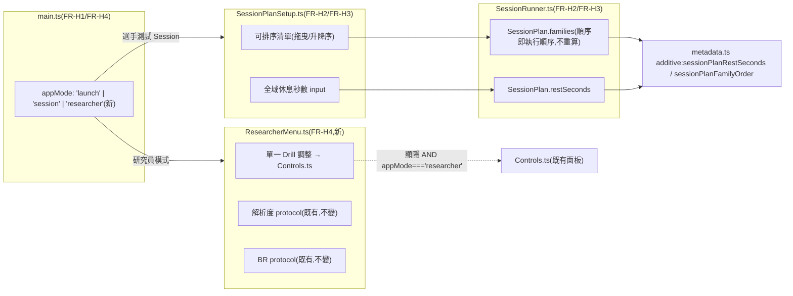

# WP-43(暫用編號)— session-entry-restructure:啟動畫面兩分岔 + Session Plan 拖曳排序/自由休息秒數 + 研究員子選單

> stage8 提案的 WP 子資料夾。上層 spec:[../README.md](../README.md) §1(FR-H1/FR-H2/FR-H3/FR-H4)、§2、§5。
> Companion:[task-checklist.md](task-checklist.md) · [progress.md](progress.md)
> 格式比照 [`completed/stage7/wp-40-quality-flag-visibility/README.md`](../../../completed/stage7/wp-40-quality-flag-visibility/README.md)。

| | |
|---|---|
| **目標** | 交付 FR-H1(啟動畫面兩分岔)+ FR-H2(Session Plan 拖曳排序)+ FR-H3(全域休息秒數自由輸入)+ FR-H4(研究員子選單收納既有三個工具) |
| **里程碑** | 暫定 **M18**(stage8 交付),編號未正式指派(見 [../README.md](../README.md) §4 OQ-S8-4) |
| **相依** | 無(獨立;不相依任何未交付的上游 WP,stage6/stage7 皆已交付) |
| **對應 FR** | FR-H1 + FR-H2 + FR-H3 + FR-H4 |
| **估時** | 2–3 dev-days(規劃稿粗估,未讀碼;T0 讀碼後可能收斂或上修,見 §7 風險) |
| **狀態** | ⬜ 待開工(本檔為 T0 展開前的規劃稿,依 stage4/stage6/stage7 慣例——**尚未執行任何 task**,§0/§2 的讀碼發現/決策建議皆為擬定,不是已拍板事實) |

---

## 0. 讀碼對帳(規劃階段,2026-08-25;決定本 WP 淨新增工作量)

> 動筆前對 `src/main.ts`、`src/ui/Controls.ts`、`src/ui/SessionPlanSetup.ts`、`src/session/SessionRunner.ts`、`src/session/sessionSchedule.ts`、`src/session/sessionPlanPresets.ts`、`src/ui/RestOverlay.ts`、`src/data/metadata.ts` 的讀碼結果。目的與 wp-40/wp-42 §0 同:找出 stage8 README §0/§2 假設的落差是否仍然成立,並找出比上層 README 更細的實作接點。

| # | stage8 README / 既有假設 | 讀碼發現 | 對本 WP 的影響 |
|---|---|---|---|
| **0-1** | 啟動畫面 4 顆按鈕平鋪 | 確認成立:[`main.ts:357-407`](../../../../../src/main.ts#L357-L407)——`experimentButton`/`protocolButton`/`brProtocolButton`/`sessionPlanButton` 依序 `appendChild` 進同一個 `sessionLaunchControls`,四者視覺上完全對等 | FR-H1 的「兩分岔」需要重組這個容器的內容與點擊行為,細節見 §2① |
| **0-2** | `Controls.ts` 是常駐 floating toolbar | 確認成立,但讀碼發現一個 stage8 README 未提及的細節:[`main.ts:1089-1094`](../../../../../src/main.ts#L1089-L1094) 的 `syncControlsVisibility()` 只依 `pointerLock.locked`/`drillRunner.phase === 'ended'` 決定顯隱,**與 `pendingSessionMode`/任何「模式」完全無關**——也就是說,現況這個面板在頁面剛載入、尚未點任何按鈕時就已經可能顯示(只要 pointer 未鎖定)。它跟啟動按鈕群同時可見,是 stage8 README §0-2 描述的「混雜」的真正機制成因。 | FR-H4「包成獨立畫面而非常駐 bar」不能只改「掛載時機」,必須新增一個**與 `syncControlsVisibility()` 並列的顯隱條件**(是否處於「研究員模式」),兩個條件要 AND 起來;否則兩分岔啟動畫面顯示時,底下的 Controls 面板可能同時穿透可見。 |
| **0-3** | Session Plan 的家族順序目前由 `buildFamilyOrder()` 決定 | 確認成立,且比 stage8 README 描述得更緊密:[`SessionRunner.ts:129-131`](../../../../../src/session/SessionRunner.ts#L129-L131) 的 `start()` 永遠呼叫 `buildFamilyOrder(plan.participantId, plan.sessionIndex)` 產生順序,再用 `plan.families.includes(family)` 過濾子集——**`plan.families` 目前只承擔「子集」語意,完全不承擔「順序」語意**,即使呼叫端傳入有序陣列,順序也會被丟棄重算。 | FR-H2 不是「新增排序功能」,而是要**移除**這一段 `buildFamilyOrder()` 呼叫(至少對這條路徑),改成直接信任 `plan.families` 陣列本身的順序。這比 stage8 README §2.2 預期的「型別擴充」更小——不需要新欄位,只需要改變 `start()` 內部一行邏輯的語意,但影響面要覆核 WP-41 T3 的既有測試(`SessionRunner.test.ts`)是否斷言了「順序由 `buildFamilyOrder` 決定」這件事。 |
| **0-4** | 休息秒數只能選具名 preset | 確認成立:[`SessionPlan.presetId`](../../../../../src/session/SessionRunner.ts#L13) → `findSessionPlanPreset()` → `preset.restSeconds`([SessionRunner.ts:127-133](../../../../../src/session/SessionRunner.ts#L127-L133))。`metadata.ts` 的 `sessionPlanPreset` 欄位([metadata.ts:286-287](../../../../../src/data/metadata.ts#L286-L287))經 `requireSessionPlanPreset()` **強制驗證必須是 `SESSION_PLAN_PRESETS` 封閉清單裡的 id**,自由字串會擲錯。 | FR-H3 的自由數字輸入若直接塞進 `presetId`,會被 `requireSessionPlanPreset()` 擋下。**必須新增一個獨立欄位**(例如 `SessionPlan.restSeconds: number`)取代目前經由 `presetId` 間接取得休息秒數的路徑;`metadata.ts` 的 `sessionPlanPreset` 欄位語意(封閉具名 preset)不能被挪用來承載自由數字,需要新增 additive metadata 欄位記錄實際使用的休息秒數與家族順序(供研究稽核用,見 §2③)。 |
| **0-5**(新發現,先前對話未涵蓋) | 「研究員模式」只需收納「解析度 protocol」「BR protocol」「單一 drill 調整」三項 | 讀碼發現現況還有第四個入口:[`main.ts:357-376`](../../../../../src/main.ts#L357-L376) 的 `experimentButton`(「實驗 session」,`pendingSessionMode='session'`)——它會先過既有資格閘(fullscreen/解析度/效能地板),再呼叫 `experimentSession.enter(report)`,但**不**透過 Session Plan,測的是「當前 Controls.ts 選中的任一 drill」。這個模式的語意介於「選手正式測試」與「研究員快速試跑」之間,stage8 README 沒有明確分類它該去哪。 | 這是**規劃階段未決的缺口**,不是本 WP 可以自行拍板的小事——列入 §7 Open Question,T0 需要使用者確認:併入研究員模式(當作另一種單一 drill 測試方式)、視為「選手測試 Session」的舊版流程(可能該淘汰)、或保留原樣但移出主畫面。本 WP 的 T1 不假設答案,先列出讀碼發現。 |
| **0-6** | `SessionPlanSetup.ts` 現況是 checkbox + `<select>` preset 的既有表單型式 | 確認成立([SessionPlanSetup.ts:40-96](../../../../../src/ui/SessionPlanSetup.ts#L40-L96)):`familyInputs` 是純 checkbox 陣列,DOM 順序固定 = `options.families` 傳入順序(目前是 `TEST_FAMILY_IDS` 常數順序),沒有任何拖曳/排序相關程式碼或套件依賴。 | T2 的拖曳排序是**從零實作**(手刻,不依賴外部套件——專案既有紀律是純 TS + DOM,`package.json` 目前無拖曳套件依賴,新增外部套件需另外評估,不在本 WP 預設範圍內)。最小可行做法:每列一個 ▲/▼ 按鈕升降序,或 HTML5 native drag-and-drop(`draggable="true"` + `dragstart`/`dragover`/`drop`),T0 需要選一個並記錄理由。 |

**結論**:FR-H2(拖曳排序)比原規劃更單純——只是讓 `SessionRunner` 不要覆寫呼叫端傳入的順序,不需要新的資料結構;FR-H3(自由休息秒數)需要新增一個欄位並讓它不經過 `SESSION_PLAN_PRESETS` 封閉驗證;FR-H4(研究員子選單)比原規劃複雜——顯隱邏輯需要新增一個獨立條件而非只是「延後掛載」,且發現了一個未分類的第四入口(§0-5)需要使用者拍板;FR-H1(兩分岔啟動畫面)的實作成本主要在於重組現有事件監聽,邏輯本身不複雜。

---

## 1. 需求對應

| FR | 內容 | 落點 |
|---|---|---|
| FR-H1 | 啟動畫面收斂成「選手測試 Session」/「研究員模式」兩個主要選項,既有「解析度 protocol」/「BR protocol」移入研究員子選單 | T1 |
| FR-H2 | Session Plan 的家族清單依操作者拖曳排定的順序執行,不再由 `buildFamilyOrder()` 覆寫 | T2 |
| FR-H3 | Session Plan 新增全域休息秒數自由輸入(數字,非具名 preset),套用在清單每個家族之間 | T2 |
| FR-H4 | 研究員子選單收納「單一 drill 調整」(`Controls.ts`)+「解析度 protocol」+「BR protocol」;`Controls.ts` 面板顯隱新增「是否處於研究員模式」條件 | T1 |

### 1.1 範圍

**In scope**:

```
src/main.ts                          ← MODIFY 啟動按鈕群重組(FR-H1);新增 appMode 狀態管理 Controls.ts 顯隱(FR-H4);
                                        startSessionPlan() 改傳 restSeconds 取代 presetId 派生休息秒數(FR-H3);
                                        collectMeta 補 sessionPlanRestSeconds/sessionPlanFamilyOrder additive           [T1/T2]
src/ui/ResearcherMenu.ts              ← ADD(新)研究員子選單畫面:單一 Drill 調整 / 解析度 protocol / BR protocol 三個入口   [T1]
src/ui/SessionPlanSetup.ts            ← MODIFY 家族 checkbox fieldset → 可排序清單(手刻升降序或 drag-and-drop,§0-6);
                                        preset `<select>` → 全域休息秒數 `<input type="number">`                       [T2]
src/session/SessionRunner.ts          ← MODIFY start() 移除 buildFamilyOrder() 呼叫與其 filter,直接採用 plan.families
                                        既有順序;SessionPlan 型別新增 restSeconds:number 取代經 presetId 派生            [T2]
src/data/metadata.ts                  ← ADD Meta.sessionPlanRestSeconds?: number + Meta.sessionPlanFamilyOrder?:
                                        readonly string[](additive,記錄實際使用的休息秒數與家族順序供稽核)                [T2]
docs/operational/*.md                 ← 視 T-exit 判斷是否需要新增/擴充契約文件                                          [T-exit]
```

**Out of scope**(附觸發條件,呼應 [../README.md](../README.md) §1):

- **`src/drill/*.ts` 任何協定本體**——零程式碼觸碰。
- **`src/session/sessionSchedule.ts`(`buildFamilyOrder()` 本體)**——不修改、不刪除;`SessionRunner.start()` 只是不再呼叫它,函式本身與其既有測試(`sessionSchedule.test.ts`)保持不變。觸發 = 未來決定要並存「手動排序」與「自動 counterbalance」兩種模式(OQ-S8-2)時,才需要真正的型別分歧設計。
- **`src/session/sessionPlanPresets.ts`**——不修改;`SESSION_PLAN_PRESETS`/`perFamilyTrialShape` 保留給未來可能的「自動 counterbalance」模式使用,本 WP 的手動排序路徑不消費它。
- **既有「實驗 session」按鈕(`pendingSessionMode='session'`)的去向**——§0-5 發現的缺口,不在本 WP 自行拍板,列 §7 Open Question,待使用者決定後才排入 task。
- **任何單一 drill 的參數表單化**——沿用 [../README.md](../README.md) §1 既有排除範圍。

### 1.2 資料流(本 WP 新增部分)



---

## 2. 關鍵設計決策(T0 待凍結項;以下為讀碼後的建議方向,非最終定案)

### ① 啟動畫面重組:新增 `appMode` 狀態,取代目前「按鈕各自設 `pendingSessionMode` 後開表單」的扁平結構(承 §0-1/§0-2)

現況四顆按鈕各自監聽 `click` 直接設定 `pendingSessionMode` 再開 `sessionSetupForm`。建議新增一個更高層的 `appMode: 'launch' | 'session' | 'researcher'` 變數,「選手測試 Session」按鈕把 `appMode` 設為 `'session'` 並沿用既有 `sessionPlanButton` 的既有行為(`pendingSessionMode='session-plan'` + 開表單);「研究員模式」按鈕把 `appMode` 設為 `'researcher'` 並開 `ResearcherMenu`。`syncControlsVisibility()` 改為 `(!pointerLock.locked || drillRunner.phase === 'ended') && appMode === 'researcher'`(§0-2 發現的 AND 條件)。

### ② `ResearcherMenu.ts`:純選單畫面,三個入口呼叫既有函式,不重寫既有邏輯(承 FR-H4)

```ts
// src/ui/ResearcherMenu.ts                                                     [T1,新增]
export interface ResearcherMenuOptions {
  readonly onSelectDrillControls: () => void;   // 顯示既有 Controls.ts 面板
  readonly onSelectResolutionProtocol: () => void;  // 既有 protocolButton 行為
  readonly onSelectBrProtocol: () => void;          // 既有 brProtocolButton 行為
  readonly parent?: HTMLElement;
}
export function createResearcherMenu(options: ResearcherMenuOptions): { open(): void; close(): void; dispose(): void };
```

三個回呼直接複用 `main.ts` 既有的 `protocolButton`/`brProtocolButton` click handler 內容,不重寫 `pendingSessionMode`/`sessionSetupForm` 銜接邏輯。

### ③ Session Plan 順序 + 休息秒數:`SessionRunner.start()` 停止覆寫順序,新增 `restSeconds` 欄位(承 §0-3/§0-4)

```ts
// src/session/SessionRunner.ts                                                [T2,型別變更]
export interface SessionPlan {
  readonly participantId: string;
  readonly sessionIndex: number;
  readonly families: readonly TestFamilyId[];   // 語意變更:陣列順序即執行順序(不再被 buildFamilyOrder 覆寫)
  readonly restSeconds: number;                  // 新增,取代 presetId 派生;由呼叫端驗證 ≥0 且有限
  readonly includeWarmup: boolean;
}
```

`start()` 內移除 `buildFamilyOrder(...)` 呼叫與其 `.filter()`,改成直接以 `plan.families`(需驗證非空、元素皆為合法 `TestFamilyId`、無重複)作為 `families`;`presetRestMs = plan.restSeconds * 1000`,不再呼叫 `findSessionPlanPreset()`。**`presetId` 欄位整個移除**(不再有任何路徑消費它)——`sessionPlanPresets.ts`/`SESSION_PLAN_PRESETS` 保留檔案本身但暫時無消費者,供 §7 OQ-S8-2 的「並存自動 counterbalance 模式」未來使用。

### ④ Metadata 稽核欄位:additive 記錄實際使用的順序與休息秒數(承 §0-4)

```ts
// src/data/metadata.ts                                                        [T2,additive]
export interface Meta {
  // …既有欄位不變(含既有 sessionPlanPreset?: string,本 WP 不刪除該欄位定義,但無路徑再寫入它)
  sessionPlanRestSeconds?: number;        // 新增:本次 session 實際使用的全域休息秒數
  sessionPlanFamilyOrder?: readonly string[];  // 新增:本次 session 實際執行的家族順序(操作者排定)
}
```

不驗證這兩個欄位對應到任何封閉清單(它們本質上就是「操作者這次選了什麼」的稽核記錄,不是凍結協定參數)——僅驗證型別/範圍(秒數 ≥0 且有限;順序陣列元素皆為合法 `TestFamilyId`)。

### ⑤ 拖曳排序元件:手刻 HTML5 native drag-and-drop 或升降序按鈕,不新增外部套件(承 §0-6)

兩個候選,T0 需要選一個:

| 候選 | 優點 | 缺點 |
|---|---|---|
| HTML5 native drag-and-drop(`draggable`/`dragstart`/`dragover`/`drop`) | 符合先前討論拍板的「拖曳排序」互動;不需外部套件 | 觸控裝置支援較弱(本專案鎖 Chrome/Edge 桌面版,CLAUDE.md §4 已有此硬約束,風險可接受) |
| 每列 ▲/▼ 按鈕升降序 | 實作最簡單,無瀏覽器相容性疑慮,鍵盤可操作 | 與先前討論拍板的「拖曳」字面不符,需要跟使用者確認是否可接受 |

初判傾向 native drag-and-drop(符合原始互動決策),但 T0 需要正式拍板並記錄理由。

---

## 3. Failure modes

| 觸發 | 影響 | 處理 |
|---|---|---|
| `SessionRunner.start()` 移除 `buildFamilyOrder()` 呼叫後,既有 WP-41 T3 測試(`SessionRunner.test.ts`/`SessionRunnerPoll.test.ts`)斷言了「順序由 `buildFamilyOrder` 決定」 | 既有測試可能紅燈,或更糟——測試本身沒斷言順序來源,改動後靜默通過但實際行為已改變且無測試覆蓋 | T0 entry-gate 需要先讀這兩個測試檔案,確認目前是否有斷言依賴 `buildFamilyOrder` 的具體排列;T2 DoD 必須新增「`plan.families` 傳入順序與 `SessionRunner` 實際執行順序逐位相同」的測試 |
| `syncControlsVisibility()` 新增 `appMode==='researcher'` 條件後,既有依賴「Controls 面板隨時可見」的呼叫路徑(若有,例如 dev test harness)出現非預期隱藏 | 既有手動測試流程或既有 e2e 腳本可能斷言 Controls 面板可見卻失敗 | T1 DoD 需要 grep 既有 Playwright/e2e 測試對 `#drill-controls` 的斷言,逐一確認新增條件後仍成立或需同步調整測試 |
| 休息秒數 input 允許操作者填 0、負數或極大值(如 999999 秒) | 0 秒違背防疲勞初衷;極大值可能讓操作者誤以為當掉;負數應被拒絕但若無驗證會傳入 `Math.max(0, ...)` 邏輯產生非預期行為 | T2 DoD 明文要求輸入邊界驗證(如 0–3600 秒),邊界外顯示錯誤訊息並阻擋送出;這是表單防呆而非凍結參數(比照 wp-40 DPI 邊界的性質) |
| `sessionPlanPreset` 既有欄位定義保留但無路徑寫入,未來開發者誤以為它仍是本流程的休息秒數來源 | 文件與程式碼行為不一致,造成維護混淆 | T2 在 `metadata.ts` 該欄位旁加註解說明「本欄位為 stage7 具名 preset 流程使用,stage8 手動排序流程改用 `sessionPlanRestSeconds`/`sessionPlanFamilyOrder`」;T-exit 文件對帳需在 CONTEXT.md §O 一併說明兩套欄位的分工 |
| §0-5 發現的「實驗 session」按鈕缺口在 T1 執行時被隨手決定(例如直接刪除或直接塞進研究員模式),未經使用者確認 | 可能移除一個使用者仍在用的既有功能路徑,或做出與使用者真實意圖不符的分類 | T1 In scope 明文不觸碰 `experimentButton`/`pendingSessionMode==='session'` 分支,直到 §7 Open Question 由使用者拍板;若拍板前必須先動它(例如版面擺不下),先以「保留原按鈕,暫時不歸類,維持現有可見範圍」為預設處理,不擅自刪除 |

---

## 4. Concurrency model

**N/A**(沿用既有單 rAF 超級迴圈,ADR-2)。本 WP 不新增計時來源;休息倒數沿用既有 `RestOverlay`/`SessionRunner.poll(nowMs)` 機制(WP-42 已交付,零改動)。

---

## 5. Task 索引

| Task | 檔案 | Objective | 相依 | Risk | 估時 |
|---|---|---|---|---|---|
| **T0** | [T0-entry-gate.md](T0-entry-gate.md) | 覆核 §0 讀碼發現在開工當下仍成立;拍板 §2①②③④⑤ 五個決策;正式向使用者提出 §0-5/§7 缺口供拍板;零程式碼 | 無 | Med(§0-5 缺口與 §2③ 型別變更的決策直接決定 T1/T2 骨架) | 0.5d |
| **T1** | [T1-launch-researcher-menu.md](T1-launch-researcher-menu.md) | `main.ts` 新增 `appMode` + 啟動按鈕群重組;`ResearcherMenu.ts` 新增三個入口;`Controls.ts` 顯隱條件新增 `appMode` AND 判定 | T0 | Med(涉及既有事件監聽重組,需覆核既有 e2e 對啟動按鈕/Controls 面板的斷言) | 1–1.5d |
| **T2** | [T2-session-plan-reorder-rest.md](T2-session-plan-reorder-rest.md) | `SessionPlanSetup.ts` 排序清單 + 休息秒數 input;`SessionRunner.ts` 型別與 `start()` 邏輯變更;`metadata.ts` additive 稽核欄位;`main.ts` 對應接線 | T0(可與 T1 並行,檔案熱區不重疊) | Med–High(移除 `buildFamilyOrder()` 呼叫需要覆核既有測試斷言,見 §3 失效模式首項) | 1–1.5d |
| **T-exit** | [T-exit-gate.md](T-exit-gate.md) | 驗收 FR-H1~H4;`npm run test:ci` 全綠;文件對帳(CONTEXT.md §O、stage8 README 狀態、WP/GD 編號正式指派視使用者當下決定) | T1 + T2 | — | 0.25d |

T1/T2 檔案熱區大致不重疊(T1 動 `main.ts` 的啟動按鈕/`appMode`/`ResearcherMenu.ts`;T2 動 `SessionPlanSetup.ts`/`SessionRunner.ts`/`metadata.ts` 與 `main.ts` 的 Session Plan 接線段落),可並行;`main.ts` 是兩者共用檔案但改動區塊不同,T-exit 需要合併後一次性覆核零衝突(比照 wp-40 T1/T2 共用 `main.ts` 不同呼叫點的先例)。一 task = 一垂直切片 = 一原子 commit 紀律不變。

---

## 6. Interface contracts(T0 讀碼建議;細節由 T1/T2 執行時覆核)

```ts
// src/main.ts                                                                 [T1,新增]
type AppMode = 'launch' | 'session' | 'researcher';

// src/ui/ResearcherMenu.ts                                                    [T1,新增]
export interface ResearcherMenuOptions {
  readonly onSelectDrillControls: () => void;
  readonly onSelectResolutionProtocol: () => void;
  readonly onSelectBrProtocol: () => void;
  readonly parent?: HTMLElement;
}
export interface ResearcherMenuHandle { open(): void; close(): void; dispose(): void; }
export function createResearcherMenu(options: ResearcherMenuOptions): ResearcherMenuHandle;

// src/session/SessionRunner.ts                                               [T2,型別變更]
export interface SessionPlan {
  readonly participantId: string;
  readonly sessionIndex: number;
  readonly families: readonly TestFamilyId[];   // 順序 = 執行順序
  readonly restSeconds: number;                  // 取代 presetId
  readonly includeWarmup: boolean;
}
// presetId 欄位移除；SessionRunnerPhase / SessionRunnerHandle 簽名不變。

// src/ui/SessionPlanSetup.ts                                                  [T2,型別變更]
export interface SessionPlanSelection {
  readonly families: readonly TestFamilyId[];    // 依操作者排序後的陣列
  readonly restSeconds: number;
  readonly includeWarmup: boolean;
}
// presetId 欄位移除；SessionPlanSetupOptions 的 `presets` 輸入欄位移除，改為 `restSecondsBounds?: { min: number; max: number }`。

// src/data/metadata.ts                                                        [T2,additive]
export interface Meta {
  // …既有欄位不變
  sessionPlanRestSeconds?: number;
  sessionPlanFamilyOrder?: readonly string[];
}
export interface CollectMetaArgs {
  // …既有欄位不變
  sessionPlanRestSeconds?: number;
  sessionPlanFamilyOrder?: readonly string[];
}
```

---

## 7. Open Questions

| # | 問題 | 建議 / 待決 | Owner | 未決影響 |
|---|---|---|---|---|
| **OQ-S8-5**(新,承 §0-5) | 既有「實驗 session」按鈕(`pendingSessionMode='session'`,資格閘 + `experimentSession` 追蹤,但不透過 Session Plan)在兩分岔啟動畫面裡該歸類到哪:併入研究員模式、視為選手測試 Session 的替代路徑、或維持獨立第三入口? | 本 WP 不自行拍板(見 §3 失效模式最後一項);T0 需要正式提給使用者選擇 | 使用者 | 決定 T1 的啟動畫面究竟是「兩個」還是「兩個 + 一個未分類」按鈕,直接影響 FR-H1 的驗收判定 |
| **OQ-S8-6**(新,承 §2⑤) | 拖曳排序元件用 HTML5 native drag-and-drop 還是升降序按鈕? | 初判傾向 native drag-and-drop(符合先前討論拍板的互動決策);T0 正式拍板 | 使用者/工程 | 決定 T2 的 UI 實作複雜度與瀏覽器相容性風險範圍 |
| **OQ-S8-7**(新,承 §2③) | 移除 `buildFamilyOrder()` 呼叫後,`SessionPlan.presetId`/`sessionPlanPresets.ts` 完全無消費者——是否要在本 WP 就標記為「保留供未來 OQ-S8-2 使用」,還是應該連同移除以避免死碼? | 初判保留(理由:stage7 README §2.3(c) 已記錄「並存兩種排程模式」是合理的未來方向,現在刪除等於關掉這個選項);T0 拍板 | 使用者/研究者 | 若判定移除,`sessionPlanPresets.ts`/`SESSION_PLAN_PRESETS` 需要一併清理,`findSessionPlanPreset` 的既有測試需要處理 |
| **OQ-S8-8**(新) | 休息秒數 input 的邊界值(如 0–3600 秒)由誰拍板——UI 防呆邊界(工程可自行決定,比照 wp-40 DPI 先例)還是需要研究者核准? | 初判 UI 防呆邊界,工程可自行決定,T2 執行時定案並記錄理由即可,不需要走凍結常數升版流程 | 工程 | 若研究者認為休息秒數上下限有效度意涵(例如過短休息影響資料可比較性),則需要升級為研究者核准項目 |
| **OQ-S8-4**(承 [../README.md](../README.md) §4) | WP 編號(WP-43)/里程碑(M18)/GD 條目何時正式指派 | 待使用者於 T0 確認開工時,一次性寫入 [DECISIONS.md](../../../DECISIONS.md)/[exec-plan/README.md](../../../README.md)/[docs/MAP.md](../../../../MAP.md) | 使用者 | 若不指派,文件圖譜的全域索引(exec-plan/README.md §2/§3/§4、MAP.md §3)暫時不會列出本 WP,不影響本 WP 自身執行,但會造成之後回溯時的索引缺口 |

---

## 8. 文件對帳清單

- [ ] [../README.md](../README.md) §5:WP-43 狀態列於 T-exit 後翻 ✅。
- [ ] [CONTEXT.md](../../../../../CONTEXT.md):新術語(`AppMode`/`SessionPlan.restSeconds`/`sessionPlanRestSeconds`/`sessionPlanFamilyOrder` 等)於 T-exit 回寫至新增 **§O**(章節號承接 WP-42 已佔用的 §N)。
- [ ] `docs/operational/*.md`:T-exit 判斷是否需要新增/擴充契約文件(初判不需要,理由比照 wp-40 D-40.5——本 WP 是排程/呈現層決策,非新構念)。
- [ ] [DECISIONS.md](../../../../DECISIONS.md):待 OQ-S8-4 由使用者拍板後,一次性補上 GD 條目(暫定 GD-25)。
- [ ] [exec-plan/README.md](../../../../README.md) §2/§3/§4/§6:待 OQ-S8-4 拍板後同步(階段字母暫定 H)。
- [ ] [docs/MAP.md](../../../../../MAP.md) §3:待 OQ-S8-4 拍板後同步。
