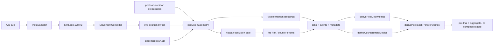

# WP-45(暫用編號)— peek-click-transfer-pilot-v1:自體移動曝光 × 急停首發 transfer test

> stage9 的獨立 WP 提案。上層 spec:[../README.md](../README.md)。
> Companion:[task-checklist.md](task-checklist.md) · [progress.md](progress.md)
> 規劃來源:Kovaak's `Peek and Click` 錄影分析 + 本專案 stage6 `hold-click-v1`/`counterstrafe-reversal-v1` 現有構念。

| | |
|---|---|
| **目標** | 交付一個 Practice/pilot-only 的整合 transfer test：玩家依 A/D cue 從掩體後移出，使靜止目標曝光，反向制動後首發；miss 可補槍，hit/timeout 推進下一輪 |
| **里程碑** | Pilot-ready；不在本 WP 凍結正式 Assessment 數值或新增跨構念總分 |
| **相依** | stage6 WP-34/WP-37 已完成；T3 等 WP-44 T-exit；T5 等 stage8 WP-43 T-exit |
| **估時** | 6–9 dev-days，不含真人 pilot 招募、資料蒐集與 sample-size/power 決定 |
| **狀態** | 🟡 T1–T5 完成，可開始 T-exit |

---

## 0. 問題陳述與設計定位

Kovaak's 錄影呈現的核心循環是「沿掩體／走廊移動 → 小目標曝光 → 點射；miss 可補槍 → 擊殺後換側」。直接複製 90 秒、kill×accuracy 的單一分數不適合本專案，因為它同時混合視覺曝光、瞄準擷取、反向急停、首發、補槍與速度—準度取捨，失敗原因不可診斷。

本 WP 將該玩法定位為 **integrated transfer test**，不是 `counterstrafe-reversal-v1` 或 `hold-click-v1` 的替代品：

- `hold-click-v1` 保留「目標移動造成曝光」的元件能力量測。
- `counterstrafe-reversal-v1` 保留「固定 hold→reversal cue」的制動元件量測。
- `peek-click-transfer-pilot-v1` 新增「玩家自身 A/D 位移造成曝光」的整合情境，用來檢查上述能力能否轉移到較接近遊戲的 peek-and-click 任務。

研究設計採受試者內 repeated-measures；受試者是獨立 replicate，單一受試者的 20 個 peeks 是巢狀 trial，不得當成 `n=20` 的獨立樣本。本 WP 只交付可執行且可匯出的 pilot 工具；正式樣本數、power、模型與 v1 freeze 由真人 pilot 後的後續 WP 決定。

### 0.1 現況讀碼結論

| # | 現況 | 對設計的影響 |
|---|---|---|
| 0-1 | `holdClickMetrics.ts` 已能從 `ticks[]` + `SceneConfig.propBounds` 推導 `tFirstVisible`/`tMeasurementOnset`/`tFullExposure` | 不新增第二套曝光構念；抽出共用純幾何 kernel 後重用 |
| 0-2 | `counterstrafeMetrics.ts` 已提供制動、sync、首發與 L/R 分層 | 新 assembler 組裝既有結果，不重算 `counterToFireMs` 等 frozen 構念 |
| 0-3 | `HitDetector.raycastWithRay()` 只對 target AABB 求交，不讀 scene props | 若不先補 hitscan occlusion，玩家可穿牆擊殺，transfer test 無效；T1 是 High-risk 關鍵路徑 |
| 0-4 | `peek-corridor` 只有左側 `cover-wall`，且已被 frozen `hold-click-v1` 使用 | 不改既有場景；新增對稱 `peek-ad-corridor-v1` |
| 0-5 | `TargetManager` 已支援單 active target、LR/RL 交替、cue foreperiod、miss 補槍、hit/timeout 推進 | pilot 不需要新 trial state machine；嚴格 L/R 交替承接影片節奏 |
| 0-6 | Session v1 的四家族 roster 直接參與 `buildFamilyOrder()` | 不把第五家族塞進既有常數；T5 建 versioned pilot roster，v1 排序逐位不變 |

---

## 1. 需求壓縮(Requirements)

### 1.1 Functional Requirements

| ID | Requirement | 驗收摘要 | Task |
|---|---|---|---|
| **FR-P45-1** | 系統**必須**提供 Practice-only 的 `peek-click-transfer-pilot-v1`，每 block 20 trials、L/R 各 10 次，target hit 或 timeout 後推進下一輪 | config/schema/端到端測試驗證 count、順序、結束條件 | T3 |
| **FR-P45-2** | 系統**必須**讓 scene prop 真正阻擋 hitscan；被 cover 阻擋的 target AABB 命中不得記為 hit/kill | behind-cover miss、exposed hit、無 props 向後相容測試 | T1 |
| **FR-P45-3** | 系統**必須**用同一個純幾何 kernel 推導曝光比例與 hitscan 遮擋，不得維護兩套 segment/AABB 判定 | `visibilityDerivation` 與 hitscan occlusion parity tests | T1 |
| **FR-P45-4** | 系統**必須**提供左右對稱的 `peek-ad-corridor-v1`，中心起點對兩側 target 皆遮蔽，向正確方向移動後能跨過 50% onset | scene config/clearance/visibility symmetry tests | T2 |
| **FR-P45-5** | 系統**必須**保留 miss 補槍，同時把 first shot、首次 hit、shots-to-kill 分開記錄 | 合成 fixture 含 first miss→second hit | T3/T4 |
| **FR-P45-6** | 系統**必須**輸出曝光、擷取、制動、首發與完成時間的 per-trial/aggregate metrics，且不得輸出 composite score | interface key-set test + fixture | T4 |
| **FR-P45-7** | 系統**必須**提供 1.5°/2.0°/3.0° 三個 target angular-size pilot candidates，seed/候選值寫入可重現 config/metadata | pilot builder tests；預設研究員入口載入 2.0° candidate | T3 |
| **FR-P45-8** | 系統**必須**提供 versioned transfer-pilot session 順序，使 `hold-click`、`counterstrafe`、`peek-click-transfer` 在 participant/session 間位置平衡，且不得改變 stage6 v1 四家族既有順序 | v1 golden order 不變；三條件三個 session index 各占每一位置一次 | T5 |
| **FR-P45-9** | 系統**必須**標記 pre-exposure fire、no onset、no counter、fire-before-gate、timeout、corridor exceeded 與現有 display suspect 狀態 | flags fixture + export integration tests | T4/T5 |

### 1.2 Non-functional Requirements

| ID | Requirement | 機械判準 | Task |
|---|---|---|---|
| **NFR-P45-1 決定性** | 同 seed/輸入序列在不同 render pump cadence 下必須產生逐 tick/逐 event 相同 export | 60/120/240 Hz regression fixture 深等值 | T1/T3 |
| **NFR-P45-2 回溯相容** | stage6 frozen drills、`peek-corridor` 與無 occlusion context 的 hit path 必須逐位維持既有行為 | 既有 regression/golden tests 零修改全綠 | T1–T5 |
| **NFR-P45-3 熱路徑** | steady-state sim tick 與 fire path 不得新增每 tick／每發配置；20-trial run 不得 recorder overflow | source-level allocation test/既有 GC discipline tests + E2E meta assertion | T1/T-exit |
| **NFR-P45-4 時間有效性** | 曝光 crossing 必須使用 128 Hz tick domain；同一 crossing 的 sim/離線時間差不得超過 1 tick (`7.8125 ms`) | parity fixture | T1/T4 |
| **NFR-P45-5 可稽核** | 每個正式 pilot export 必須含 drill/scene/seed/hitbox/visibility threshold/protocol condition | metadata assertions | T3/T5 |

### 1.3 Constraints

- 不修改 `hold-click-v1`、`counterstrafe-{cued,reversal,free}-v1`、`counterstrafe_ad_v1` 或 `STAGE6_PROTOCOL_VERSION` 的凍結值。
- 玩家 movement 維持 A/D 一維 Source-like profile；不新增 W/S、maze traversal、玩家碰撞或物理引擎。
- v0 pilot 目標沿用 box hitbox/mesh；球形 target 視覺不在本 WP。
- Assessment 禁 composite score；Kovaak-style score 若未來加入，只能是 Practice UI 且不得進 compatibility/history。
- projectile occlusion 不在本 WP；T1 只承接 `weapon.bullet === undefined` 的 hitscan path，未來 projectile 場景另開版本。
- T3 必須等 WP-44 T-exit，T5 必須等 stage8 WP-43 T-exit，避免 active-plan 熱區衝突。

### 1.4 Open Questions

| ID | 問題 | 目前預設 | Owner | Deadline | 未決影響 |
|---|---|---|---|---|---|
| **OQ-S9-4** | pilot 的總 timeout 是否先用 spawn-anchored `3000 ms`，或本 WP 直接新增 onset-anchored 第二段 timeout？ | T3 先用 `3000 ms` 並輸出 `cue→onset`/`onset→hit`；真人 pilot 後再決定 split timeout | 研究者＋使用者 | T3 開工前 | T3 config/schema；不阻塞 T1/T2 |
| **OQ-S9-5** | 1.5°/2.0°/3.0° 中哪個成為正式 v1 值？ | 不在本 WP 凍結；研究員入口預設 2.0°，三者皆可載入 | 使用者 | 真人 pilot T-exit 後 | 後續 freeze WP，不阻塞本 WP |
| **OQ-S9-6** | 正式 Assessment 是否保留嚴格 LR 交替，或改 constrained balanced-random？ | pilot 嚴格 LR，對齊影片且複用既有 schedule | 研究者 | 真人 pilot 後 | 後續 v1 construct interpretation |
| **OQ-S9-7** | transfer test 是否正式成為第五測試家族？ | 本 WP 只建立 versioned pilot roster，不改 stage6 default roster | 使用者 | T5/T-exit | Session UI label/history policy |

---

## 2. 系統架構與設計(Technical Design)

### 2.1 System boundary

**In scope**:

```
src/scene/occlusionGeometry.ts                 ← ADD 共用 segment/AABB kernel                         [T1]
src/metrics/visibilityDerivation.ts             ← MODIFY 改用共用 kernel，輸出語意不變                 [T1]
src/loop/SimLoop.ts                             ← MODIFY hitscan target hit 後套 scene occlusion gate    [T1]
src/testharness/fpsTestHarness.ts               ← MODIFY 將 active scene propBounds 注入 sim options     [T1]
src/main.ts                                     ← MODIFY scene propBounds 注入 + pilot drill 註冊          [T1/T3/T5]
src/scene/scenes/peek-ad-corridor.*             ← ADD 對稱場景 config/props/asset                        [T2]
scripts/gen-peek-ad-corridor-gltf.mjs            ← ADD 原創 CC0 box geometry generator                    [T2]
src/drill/peek_click_transfer_pilot_v1.ts        ← ADD scene-aware pilot config + angular candidates       [T3]
src/pilot/pilotConfigs.ts                       ← MODIFY/add builder                                     [T3]
src/metrics/peekClickTransferMetrics.ts          ← ADD 組裝既有 hold-click/counterstrafe metrics          [T4]
src/session/sessionSchedule.ts                  ← MODIFY additive versioned roster helper                 [T5]
src/session/SessionRunner.ts                    ← MODIFY additive pilot family resolution                [T5]
src/session/sessionPlanPresets.ts               ← MODIFY transfer-pilot-v1 preset                        [T5]
```

**Out of scope**:

- 修改 stage6 任一 frozen drill、既有四家族 default order 或歷史 compatibility key。
- Kovaak leaderboard、1000 分 score-to-win、KPS/SPM composite UI。
- 球形 mesh/hitbox、z 軸走廊導航、玩家／牆面 collision response。
- projectile-vs-scene collision、穿透、材質、damage falloff。
- 真人 pilot 的招募、sample size/power、mixed-model 實作與正式 numeric freeze。

### 2.2 Data flow



資料語意：target spawn 的既有 `visible` event 仍表示 presentation 建立；`tFirstVisible`/`tMeasurementOnset`/`tFullExposure` 繼續由 tick eye pose + target pose + scene props 推導。hitscan gate 只決定該發是否被 cover 阻擋，不覆寫既有 `visible` event 或 counter 時間線。

### 2.3 Interface contracts

#### A. 共用 occlusion kernel

```ts
// src/scene/occlusionGeometry.ts
export interface BlockingIntersection {
  readonly propId: string;
  readonly alpha: number; // segment from→to 的 [0,1] 比例
  readonly point: Vec3;
}

export function firstBlockingIntersection(
  from: Readonly<Vec3>,
  to: Readonly<Vec3>,
  props: readonly PropBound[],
): BlockingIntersection | undefined;

export function visibleFractionForTarget(
  eye: Readonly<Vec3>,
  center: Readonly<Vec3>,
  hitbox: Readonly<TargetHitboxSize>,
  props: readonly PropBound[],
  sampleCount: 1 | 9,
): number;
```

- `firstBlockingIntersection` 回最近 prop；`alpha` 相同時依 props 原順序決定，確保 deterministic。
- `props=[]` 回 `undefined`；不配置 `THREE.Vector*`。
- `sampleCount` 非 1/9 時 runtime throw（供 JS/JSON 邊界防護）；非有限座標由上游 schema/scene validation 拒絕。

#### B. SimLoop additive occlusion context

```ts
// src/loop/SimLoop.ts
export interface HitscanOcclusionContext {
  readonly propBounds: readonly PropBound[];
}

export interface SimLoopOptions {
  readonly afterTick?: (state: SharedState, nowMs: number, tickIndex: number) => void;
  readonly hitscanOcclusion?: HitscanOcclusionContext;
}
```

- 省略 `hitscanOcclusion` 時逐位走現有路徑。
- hitscan target ray 先求 target hit point，再以 `firstBlockingIntersection(origin, hitPoint, props)` 判定；有 blocker 時 `hit=false`、不 `markKilled`，tracer/impact 終點使用 blocker point。
- `weapon.bullet !== undefined` 時本 context 不作用；projectile occlusion 明確留在 out of scope。

#### C. Pilot config

```ts
export const PEEK_CLICK_ANGULAR_SIZE_CANDIDATES_DEG = [1.5, 2, 3] as const;

export interface PeekClickTransferPilotConfig {
  readonly id: string;
  readonly sceneId: 'peek-ad-corridor-v1';
  readonly drill: DrillConfig; // mode:'practice', 20 targets, LR, AK-47/default
  readonly clearanceOptions: ClearanceOptions;
  readonly visibility: { readonly sampleCount: 9; readonly onsetThreshold: 0.5 };
  readonly angularSizeDeg: 1.5 | 2 | 3;
}

export function buildPeekClickTransferPilotConfig(
  angularSizeDeg: 1.5 | 2 | 3,
): PeekClickTransferPilotConfig;
```

- world hitbox width/height = `2 * distanceU * tan(angularSizeDeg / 2)`；depth 明確由 builder 固定並寫入 metadata。
- 不在 builder 接受任意數值，避免 operator 自由調參污染 pilot cells。

#### D. Transfer metrics

```ts
export interface PeekClickTransferPresentation {
  readonly targetId: string;
  readonly side: 'L' | 'R';
  readonly tMeasurementOnsetMs?: number;
  readonly tFirstShotMs?: number;
  readonly onsetToFirstShotMs?: number;
  readonly onsetToHitMs?: number;
  readonly shotsToKill?: number;
  readonly firstShotHit: boolean;
  readonly validFirstShot: boolean;
  readonly flags: readonly string[];
}

export interface PeekClickTransferMetrics {
  readonly presentations: readonly PeekClickTransferPresentation[];
  readonly validFirstShotRate: number;
  readonly firstShotHitRate: number;
  readonly fireBeforeGateRate: number;
  readonly counterstrafe: CounterstrafeMetrics;
  readonly anticipationRate: number;
}

export function derivePeekClickTransferMetrics(
  payload: ExportPayload,
  scene: SceneConfig,
  options: HoldClickMetricsOptions,
): PeekClickTransferMetrics;
```

- `validFirstShot = first fire.hit && tFirstShot >= tMeasurementOnset && residualSpeed < CS2_PROFILE.accuracyThreshold`。
- 無 onset/fire/hit 不補 0；回 `undefined` + machine-readable flag。
- public interface 不得含 `score`/`compositeScore`。

#### E. Versioned pilot order

```ts
export const TRANSFER_PILOT_FAMILY_IDS = [
  'hold-click',
  'counterstrafe',
  'peek-click-transfer',
] as const;

export function buildFamilyOrderForRoster<T extends string>(
  participantId: string,
  sessionIndex: number,
  roster: readonly T[],
): readonly T[];
```

- 現有 `buildFamilyOrder(participantId, sessionIndex)` 繼續綁定原四家族常數且 golden output 不變。
- roster 空陣列、重複 id、負 sessionIndex throw 明確錯誤。

### 2.4 Trial contract(pilot default)

1. 3 秒 countdown。
2. cue foreperiod 500 ms；cue 指向下一個 target side。
3. target 於對應側 spawn，但中心起點對 target 的 9-point visible fraction 必須 `<0.5`。
4. 玩家依 cue strafe，crossing `0.5` 時得到 `tMeasurementOnset`。
5. 玩家反向輸入制動；`|vx| < 88 u/s` 才能產生 accurate hit。
6. first miss 不撤 target，可補槍；hit 或 3000 ms pilot timeout 撤除並翻面。
7. 20 targets 或 120000 ms backstop 結束。

`3000 ms` 是 pilot 候選，不是 frozen Assessment 值；若 OQ-S9-4 在 T3 前改採 split timeout，必須先新增獨立 task/interface，不得悄悄改 `peekTimeoutMs` 語意。

### 2.5 Failure modes

| ID | 觸發條件 | 影響 | 處理策略 | 對應 Task |
|---|---|---|---|---|
| **FM-P45-1** | scene 切換後 sim loop 仍持有舊 `propBounds` | 空氣牆或穿牆，資料不可用 | scene/drill atomic load 後重建 loop；E2E 連續切換兩場景驗證 | T1/T3 |
| **FM-P45-2** | visibility 與 hit gate 各自實作 segment/AABB | 畫面已曝光但仍被判 wallbang，或反之 | 強制兩路 import 同一 kernel；parity fixture | T1 |
| **FM-P45-3** | cover endpoint/tangent 被浮點誤判 | onset jitter 或邊界 shot 不穩定 | segment alpha epsilon 契約 + tangent/endpoint golden tests | T1 |
| **FM-P45-4** | 新場景一側幾何不對稱 | L/R 指標反映場景而非玩家 | mirror-coordinate tests + equal crossing-position tolerance ≤1 tick | T2 |
| **FM-P45-5** | timeout 從 spawn 起算而截斷慢 exposure | 慢移動者被混入 no-shot，selection bias | 分報 `cue→onset` 與 `onset→hit`；flag `timeout_before_onset`；正式 v1 前重審 OQ-S9-4 | T3/T4 |
| **FM-P45-6** | 嚴格 LR 造成位置可預期 | 不可把 onset latency解讀成純視覺反應 | 文件與 UI 標示 transfer task；不與 hold-click detection latency 同名比較 | T4/T-exit |
| **FM-P45-7** | 把第五家族加入 stage6 default roster | 所有既有 participant order 改變 | versioned roster helper；v1 golden order 鎖定 | T5 |
| **FM-P45-8** | T3/T5 與 WP-44/WP-43 同時改熱區 | merge conflict 或入口契約重做 | 明確 dependency gate；未達 gate 不開始 task | T3/T5 |

### 2.6 Concurrency model

**N/A(無新增執行緒／worker／mutex／channel)**。沿用 ADR-2：InputSampler、128 Hz SimLoop、rAF RenderLoop 透過 SharedState 溝通。`propBounds` 在 sim loop 建構時以 readonly reference 注入，場景切換以既有 atomic load 重建 loop；不允許 render loop 在條件執行中 mutate 該陣列。

---

## 3. 風險分析(Risk Analysis)

| Risk | 等級 | 原因 | 降低方式 |
|---|---|---|---|
| Hitscan occlusion 觸碰核心 fire→hit→kill data flow | **High** | `SimLoop`/`HitDetector`/recorder/impact/tracer 跨模組；錯誤會影響所有 hitscan drills | additive options、無 context 零變更、PoC fixture、完整 regression |
| 對稱 scene 幾何與可見 crossing | Med | 視覺 asset、propBounds、clearance、eye pose 必須一致 | props JSON 單一來源生成 GLTF；鏡像與 crossing tests |
| Transfer metrics 對齊兩套 presentation/window | Med | hold-click/peek window 可能因 timeout/缺事件而 index 漂移 | 以 `targetId` join，不以 array index 靜默 zip；缺失 flag |
| Session v2 接 stage8 UI restructure | Med | active WP-43 可能改入口 owner/DOM 結構 | T5 hard dependency；只依重構後公開入口接線 |
| 目標尺寸與 timeout 未校準 | Med(研究效度) | 影片只能提供候選尺度，不能當正式 freeze 證據 | 三候選 pilot；Practice metadata；後續 freeze WP |

### 3.1 Scalability / performance

- 每 tick：最多 1 active target × 9 visibility rays × 少量 prop AABBs；pilot scene 只有固定低數量 props。
- `visibleFractionForTarget` 不得建立 `Vec3[]`；使用 scalar/local scratch 或呼叫端重用緩衝。
- fire path 只在低頻 hitscan 事件跑 nearest blocker；無 props 立即 return。
- 若未來 scene props >64 或多 target >8，觸發條件成立時另開 broad-phase/BVH WP；本 WP 不預先引入空間索引。

### 3.2 Technical debt(有意識妥協)

| 妥協 | 原因 | 後續觸發 |
|---|---|---|
| 使用小 box 而非影片紅球 | 維持 TargetView/HitDetector 同一 hitbox source，避免 shape union 擴張 | 真人 pilot 顯示 box edge 明顯改變 acquisition，或需求明確要求球形 |
| pilot 使用 spawn-anchored 3000 ms total timeout | 先複用既有 DrillRunner，避免未校準前新增第二套 timeout 狀態機 | `timeout_before_onset` >5% 或 slow-mover bias 明顯 |
| pilot 嚴格 LR | 對齊影片與既有 deterministic alternation | 正式 Assessment 需要降低 anticipation 時，另開 balanced-random schedule v2 |
| hitscan-only scene occlusion | 新任務使用 AK/default hitscan；控制 blast radius | projectile drill 進入有 cover 場景 |

---

## 4. 任務拆解(Task Breakdown)

| Task | Objective | Dependencies | Risk | Complexity | Definition of Done |
|---|---|---|---|---|---|
| **T0** | Entry gate：凍結 construct/interface、覆核 active WP 熱區與 baseline | None | Low | 0.5d | [T0-entry-gate.md](T0-entry-gate.md) 全勾；baseline commands/commit 記入 progress；OQ-S9-4 有決議 |
| **T1** | 共用 occlusion kernel + hitscan wall-block gate + visibility refactor | T0 | **High** | 1.5–2.5d | behind-cover miss/exposed hit/parity/determinism tests 全綠；省略 context 舊 path deep-equal |
| **T2** | 新增左右對稱 `peek-ad-corridor-v1` 場景與 clearance/visibility tests | T0 | Med | 1–1.5d | GLTF 由 props JSON 可重建；左右 hidden/exposed crossing 鏡像誤差 ≤1 tick |
| **T3** | 新增三個 angular-size pilot configs、20-trial gameplay 與研究員入口 | T1+T2+WP-44 T-exit | Med | 1–1.5d | first miss 保留/second hit 推進/LR×10/timeout/backstop/E2E export tests 全綠 |
| **T4** | 新增 transfer metrics assembler、flags 與結果呈現 | T3 | Med | 1–1.5d | targetId join fixtures 覆蓋 hit/miss/timeout/pre-fire；public keys 無 score；統計=export |
| **T5** | Versioned transfer-pilot session roster/preset/入口 | T4+stage8 WP-43 T-exit | Med | 1–1.5d | v1 order golden 不變；三家族位置平衡；60s rest/warmup/metadata E2E 全綠 |
| **T-exit** | 全鏈路驗收、operational docs、stage9 對帳 | T1–T5 | — | 0.5d | `npm run test:ci` 全綠；手動驗收清單完成；文件/DECISIONS/MAP 對帳 |

一 task = 一個垂直切片 = 一個原子 commit。詳細 DoD 見各 task 檔。

---

## 5. 驗證策略

### 5.1 Unit / contract

- segment/AABB：outside、inside、tangent、endpoint、兩 props nearest、空 props。
- 9-point visible fraction：0、部分、0.5 crossing、1、左右鏡像。
- metrics：缺 onset、pre-fire、first miss→second hit、no counter、fire-before-gate、timeout。
- schedule：20 trials = 10L/10R；reset/restart 同 seed replay 相同。

### 5.2 Integration / regression

- `visibilityDerivation` 既有 hold-click fixtures 逐位不變。
- no-context `SimLoop` 既有 hit/first-shot/recoil fixtures 逐位不變。
- scene atomic switch 不持有舊 props。
- 60/120/240 Hz render cadence 同 export。
- stage6 family order golden 不變；transfer pilot 三條件 rotation 平衡。

### 5.3 E2E / manual

1. 中央起點看不到左右 target。
2. cue A/D 後向正確方向移動，target 逐步露出。
3. 隔牆準心對準並開火不得 kill；tracer/impact 停在 cover。
4. 曝光後未達 88 u/s 開火不得 hit；急停後可 hit。
5. first miss 可補槍；hit 後下一輪翻面。
6. 20 trials/timeout/backstop 能正常結束與匯出。
7. export 含 scene/seed/hitbox/onset threshold/flags/protocol context。

---

## 6. 文件對帳清單

- [ ] `docs/operational/analysis-peek-click-transfer.md`：construct boundary、trial timeline、metrics、flags、不可跨家族直接比較的提醒。
- [ ] `CONTEXT.md`：新增 `peek-click-transfer`、self-motion exposure、hitscan occlusion、valid first shot 術語。
- [ ] `DECISIONS.md`：記錄「transfer test 不取代 component assessments」與「共用 occlusion kernel」。
- [ ] `docs/exec-plan/active/stage9/README.md`：WP-45 狀態與依賴更新。
- [ ] `docs/exec-plan/README.md`、`docs/MAP.md`：使用者正式採納／T-exit 時同步。
- [ ] 若正式升格 Assessment：另開 numeric freeze/power/analysis WP，不在本 WP 偷渡。
